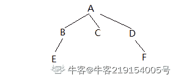

# 测试工程师能力评估试卷

## 1

下列哪项是判定/条件覆盖的特点（      ）

正确答案: A   你的答案: 空 (错误)

```cpp
判定中每个条件的所有可能结果至少出现一次，每个判定本身所有可能结果也至少出现一次
```

```cpp
判定中每个条件获得所有可能的结果
```

```cpp
每个判定所有可能结果至少出现一次
```

```cpp
覆盖程序中所有可能的路径
```

本题知识点

Java 工程师 C++工程师 测试工程师 爱奇艺 软件测试 测试开发工程师 2019

讨论

[MichaelYue](https://www.nowcoder.com/profile/7177662)

主要考察的是白盒测试的几种方法概念：语句覆盖主要特点：语句覆盖是最起码的结构覆盖要求，语句覆盖要求设计足够多的测试用例，使得程序中每条语句至少被执行一次。判定覆盖主要特点：判定覆盖又称为分支覆盖，它要求设计足够多的测试用例，使得程序中每个判定至少有一次为真值，有一次为假值，即：程序中的每个分支至少执行一次。每个判断的取真、取假至少执行一次。条件覆盖主要特点：条件覆盖要求设计足够多的测试用例，使得判定中的每个条件获得各种可能的结果，即每个条件至少有一次为真值，有一次为假值。判定/条件覆盖主要特点：设计足够多的测试用例，使得判定中每个条件的所有可能结果至少出现一次，每个判定本身所有可能结果也至少出现一次。组合覆盖主要特点：要求设计足够多的测试用例，使得每个判定中条件结果的所有可能组合至少出现一次。路径覆盖主要特点：设计足够的测试用例，覆盖程序中所有可能的路径。

编辑于 2019-08-07 20:40:12

* * *

[邻 201910082213861](https://www.nowcoder.com/profile/267878722)

题目是条件和判定，条件是必须要出现一次的，所以出现了条件所以判定也会实现一次

编辑于 2019-10-17 18:45:05

* * *

[牛客 786349404 号](https://www.nowcoder.com/profile/786349404)

A 判定覆盖要求对每个判定的结果都历经一次，即至少有一个为真，一个为假条件覆盖要求对每个条件可能的结果都历经一次，对一个条件的结果至少有一个为真一个为假判定/条件覆盖要求判定中每个条件的所有结果都历经一次，判定的所有结果也都历经一次

发表于 2020-03-07 15:59:08

* * *

## 2

使用语句覆盖对下列代码进行测试用例设计时，需要设计（      ）个测试用例

```cpp
public  static void Test(int a, int b, int c)
{
    if ((a > 1) && (c == 0))
        b = b / a;
    if ((a == 1) && (b > 1))
        b = b + 1;
}
```

正确答案: B   你的答案: 空 (错误)

```cpp
1
```

```cpp
2
```

```cpp
3
```

```cpp
4
```

本题知识点

测试工程师 京东 Java 工程师 C++工程师 软件测试 测试开发工程师 2019

讨论

[牛客 592246541 号](https://www.nowcoder.com/profile/592246541)

注意审题, 是使用语句覆盖.语句覆盖:选择足够的测试用例，使程序中的每条语句至少执行一次。***所谓足够的指的是越少越好***

发表于 2019-12-05 15:29:48

* * *

[阿伟一路向北](https://www.nowcoder.com/profile/769445352)

由于 a>1 和 a==1 不可能同时成立，因此两个执行语句无法通过一组取值而同时执行，因此，需要两次。

发表于 2020-03-17 09:47:07

* * *

[88668](https://www.nowcoder.com/profile/512881910)

简言之，语句覆盖，就是设计若干个[测试用例](https://baike.baidu.com/item/%E6%B5%8B%E8%AF%95%E7%94%A8%E4%BE%8B)，运行被测程序，使得每一可执行语句至少执行一次。这里的“若干个”，意味着使用[测试用例](https://baike.baidu.com/item/%E6%B5%8B%E8%AF%95%E7%94%A8%E4%BE%8B)越少越好。[语句覆盖率](https://baike.baidu.com/item/%E8%AF%AD%E5%8F%A5%E8%A6%86%E7%9B%96%E7%8E%87)的公式可以表示如下：[语句覆盖率](https://baike.baidu.com/item/%E8%AF%AD%E5%8F%A5%E8%A6%86%E7%9B%96%E7%8E%87)=可执行的语句总数/被评价到的语句数量 x 100%

发表于 2019-10-31 15:37:00

* * *

## 3

测试用例设计的方法有（ ）

正确答案: A   你的答案: 空 (错误)

```cpp
等价类、边界值
```

```cpp
预置条件
```

```cpp
业务流程图
```

```cpp
依照测试点，写预期结果
```

本题知识点

测试工程师 京东 Java 工程师 C++工程师 软件测试 测试开发工程师 2019

讨论

[heejeong](https://www.nowcoder.com/profile/36490639)

黑盒测试用例设计方法包括等价类划分法、边界值分析法、错误推测法、因果图法、判定表驱动法、正交试验设计法、功能图法、场景图法等。白盒测试常见的用例设计方法有：代码检查法、静态结构分析法、静态质量度量法、逻辑覆盖法、基本路径覆盖测试法、域测试、符号测试。详见 Molrang 博客：[`www.cnblogs.com/molrang/p/6420918.html`](https://www.cnblogs.com/molrang/p/6420918.html)

发表于 2019-09-22 10:24:46

* * *

[urnotlynn](https://www.nowcoder.com/profile/264195635)

测试用例常见的设计方法有：等价类划分法、边界值分析法、错误推测法、判定表法、正交实验法。

发表于 2019-07-05 23:09:55

* * *

[牛客 270612839 号](https://www.nowcoder.com/profile/270612839)

选择测试用例是软件测试员最重要的任务，选择测试用例的方法是等价类划分。等价类划分是指分步骤的，把海量的测试用例集缩减得很小，但过程同样有效，比如我们测试 1+1,1+2，1+3，1+4 之后，没必要测试 1+5，1+6。而临界值，比如 1+999999999。就需要处理数据溢出的情况。

发表于 2020-08-09 22:23:08

* * *

## 4

下述（ ）不属于单元测试

正确答案: A   你的答案: 空 (错误)

```cpp
全局数据结构是否有问题
```

```cpp
逻辑覆盖、循环覆盖
```

```cpp
代码评审、代码走查
```

```cpp
静态数据流分析
```

本题知识点

测试工程师 京东 Java 工程师 C++工程师 软件测试 测试开发工程师 2019

讨论

[wurui007](https://www.nowcoder.com/profile/746694387)

单元测试的策略：

1.  逻辑覆盖、
2.  循环覆盖、
3.  同行评审、
4.  桌前检查、
5.  代码走查、
6.  代码评审、
7.  景泰数据流分析

发表于 2019-07-05 15:00:07

* * *

[原语](https://www.nowcoder.com/profile/4696084)

D 选项的景泰数据流分析应该是静态数据流分析吧？

发表于 2019-07-23 10:45:47

* * *

[213201803230041158](https://www.nowcoder.com/profile/7345130)

单元测试是对软件组成进行的测试。其目的是检验软件基本组成单位的正确性。测试对象是软件设计的最小单元：模块，又称为模块测试。 
测试阶段：编码后或者编码前（TDD） 
测试对象：最小模块 
测试人员：白盒测试工程师或开发人员 
测试依据：代码和注释+设计详细文档 
测试方法：白盒测试 
测试内容：模块接口测试、局部数据结构测试、路径测试、错误处理测试、边界测试
————————————————
版权声明：本文为 CSDN 博主「@make great efforts」的原创文章，遵循 CC 4.0 BY-SA 版权协议，转载请附上原文出处链接及本声明。
原文链接：[`blog.csdn.net/daboluo521/article/details/81385017`](https://blog.csdn.net/daboluo521/article/details/81385017)

发表于 2020-03-04 11:19:07

* * *

## 5

2 元地铁票售票软件：投币 2 元时，按下“2 元”按钮，弹出相应地铁票；投币 5 元，则弹出地铁票同时退还 3 元，若对该功能进行测试用例设计最宜选择哪种方法（      ）

正确答案: D   你的答案: 空 (错误)

```cpp
等价类划分法
```

```cpp
边界值分析
```

```cpp
错误推测法
```

```cpp
因果图
```

本题知识点

Java 工程师 C++工程师 测试工程师 爱奇艺 软件测试 测试开发工程师 2019

讨论

[没有人路过的行星](https://www.nowcoder.com/profile/461849744)

这道题容易错选 A，A 应该是不确定输入值或者可输入值过多，只能划分区间，而题目中的地铁投币已经限定了可投币的类型，也就限定了输入值，那么通过确定的输入推导可能的输出，正好符合因果图。

发表于 2020-03-15 19:39:05

* * *

[牛客 47163106 号](https://www.nowcoder.com/profile/47163106)

首先不存在有效和无效条件，不能使用等价类划分；其次没有给出数值范围，不能使用边界值分析；最后错误推导法凭借经验，这个不适合

发表于 2020-12-06 12:26:37

* * *

[倦眼问酒书 i](https://www.nowcoder.com/profile/1903371)

因果图是从需求中找出因（输入条件）和果（输出或程序改变的状态），通过因果图转化为判定表。 1.输入条件之间的关系（组合、约束） 2.输入与输出的关系 3.输出条件的关系

发表于 2019-07-16 12:21:05

* * *

## 6

在执行集成测试阶段，需要输出的是（      ）

正确答案: D   你的答案: 空 (错误)

```cpp
集成测试用例
```

```cpp
集成测试代码
```

```cpp
集成测试脚本
```

```cpp
集成测试报告
```

本题知识点

Java 工程师 C++工程师 测试工程师 爱奇艺 软件测试 测试开发工程师 2019

讨论

[牛客 685897295 号](https://www.nowcoder.com/profile/685897295)

这题目是有歧义吗？问的是什么产生了输出还是产生的输出是什么……

发表于 2020-02-11 21:10:36

* * *

[azedplayer](https://www.nowcoder.com/profile/1871642)

这题目入土吧。阴间题目

发表于 2020-08-04 16:49:37

* * *

[牛客 240913849 号](https://www.nowcoder.com/profile/240913849)

执行集成测试阶段  注意“执行”   产生的就是集成测试报告了

发表于 2020-04-17 01:12:13

* * *

## 7

白盒测试方法不包括（ ）

正确答案: D   你的答案: 空 (错误)

```cpp
语句覆盖
```

```cpp
条件覆盖、判定/条件覆盖、条件组合覆盖
```

```cpp
路径覆盖
```

```cpp
边界值测试
```

本题知识点

测试工程师 京东 Java 工程师 C++工程师 软件测试 测试开发工程师 2019

讨论

[哄哄冲鸭！](https://www.nowcoder.com/profile/892906202)

记录高赞回答：
白盒测试方法包括：语句覆盖、判定覆盖、条件覆盖、判定条件覆盖、条件组合覆盖、路径覆盖，因此没有边界值测试！虽然边界值测试既可以用于黑盒也可以用于白盒，但它的确不属于白盒测试方法。

发表于 2020-08-10 14:13:46

* * *

[虚幻如影](https://www.nowcoder.com/profile/478887402)

为什么在 16 题的时候：既可以用于黑盒测试，也可以用于白盒测试的方法的是？答案是：边界值法难道是我眼花了，可惜不能发截图！！！

发表于 2020-01-07 10:20:34

* * *

[_ 张张张 i](https://www.nowcoder.com/profile/517258984)

D——边界值是属于黑盒测试方法

发表于 2019-06-17 21:53:12

* * *

## 8

下面哪些属于动态分析（）

正确答案: B C   你的答案: 空 (错误)

```cpp
代码覆盖率
```

```cpp
模块功能检查
```

```cpp
系统压力测试
```

```cpp
程序数据流分析
```

本题知识点

软件测试 测试工程师

讨论

[白驹之过隙](https://www.nowcoder.com/profile/300975041)

选 B、C。 **动态程序分析**是对计  查看全部)

编辑于 2019-05-05 10:34:21

* * *

[哄哄冲鸭！](https://www.nowcoder.com/profile/892906202)

动态分析：代码运行结束后。模块功能检查和系统压力测试，必须执行代码后才能分析。静态分析：代码运行之前。数据流分析和代码覆盖率，不需要执行代码就可分析。

发表于 2020-08-09 17:21:39

* * *

[我要拿 offer!](https://www.nowcoder.com/profile/2470771)

动态分析：代码运行结束后静态分析：代码运行之前

发表于 2019-09-25 17:30:00

* * *

## 9

单元测试主要技术手段有（）

正确答案: A B C   你的答案: 空 (错误)

```cpp
驱动代码
```

```cpp
Stub 代码
```

```cpp
Mock 代码
```

```cpp
GUI 测试手段
```

本题知识点

测试工程师 顺丰科技 软件测试

讨论

[哈哈哈哦哦](https://www.nowcoder.com/profile/233466701)

mock：对代码中某些不容易获取的对象创建虚拟对象来测试 stub：桩函数是代替某些被调用了但是没有编写代码，一般再增量迭代自底向上的过程中不用编写。再自顶向下的过程中需要编写驱动函数：调用被测函数，给被测函数传参

发表于 2019-07-29 19:06:39

* * *

[牛客 581894954 号](https://www.nowcoder.com/profile/581894954)

GUI 测试手段是系统测试手段

发表于 2019-07-17 20:44:06

* * *

[荔枝味牛客](https://www.nowcoder.com/profile/589693638)

mock：对代码中某些不容易获取的对象创建虚拟对象来测试 stub：桩函数是代替某些被调用了但是没有编写代码，一般再增量迭代自底向上的过程中不用编写。再自顶向下的过程中需要编写驱动函数：调用被测函数，给被测函数传参

发表于 2021-06-07 19:39:06

* * *

## 10

下面几种白盒测试技术，哪种是最强的覆盖准则（）。

正确答案: D   你的答案: 空 (错误)

```cpp
语句覆盖
```

```cpp
条件覆盖
```

```cpp
判定覆盖
```

```cpp
条件组合覆盖
```

本题知识点

软件工程 软件测试 测试工程师

讨论

[唯愿不再划水](https://www.nowcoder.com/profile/7880770)

六种覆盖方法中，覆盖准则由弱到强依次是语句覆盖、判定覆盖（分支覆盖）、条件覆盖、判定/条件覆盖、条件组合覆盖、路径覆盖。其中，语句覆盖是使得程序中每个语句至少被执行一次；判定覆盖是使得程序中的每个分支至少都通过一次；条件覆盖是使得判定中的每个条件获得各种可能的结果；判定/条件覆盖是使得判定中的每个条件取到各种可能的值，并使每个判定取到各种可能的结果；条件组合覆盖是使得每个判定中条件的各种可能组合都至少出现一次；

发表于 2017-05-20 23:45:11

* * *

[蓝天白云悠悠我心](https://www.nowcoder.com/profile/7606483)

关于语句覆盖：只针对程序逻辑中显式存在的语句。如果 if 结构中没有给出 else 后的执行分支，语句覆盖就不会考虑这种情况。语句覆盖对多分支的逻辑运算是无法全面反映的，只在乎运行一次，不考虑其他情况。

发表于 2017-08-21 09:29:45

* * *

[liMia](https://www.nowcoder.com/profile/9691110)

copy 六种覆盖方法中，覆盖准则由弱到强依次是语句覆盖、判定覆盖（分支覆盖）、条件覆盖、判定/条件覆盖、条件组合覆盖、路径覆盖。 其中， 语句覆盖是使得程序中每个语句至少被执行一次； 判定覆盖是使得程序中的每个分支至少都通过一次； 条件覆盖是使得判定中的每个条件获得各种可能的结果； 判定/条件覆盖是使得判定中的每个条件取到各种可能的值，并使每个判定取到各种可能的结果； 条件组合覆盖是使得每个判定中条件的各种可能组合都至少出现一次；

发表于 2018-07-07 08:03:34

* * *

## 11

以下程序至少需要（ ）个测试用例，才可以满足判断覆盖
if（x && y）{....}
else{....}

正确答案: B   你的答案: 空 (错误)

```cpp
1
```

```cpp
2
```

```cpp
3
```

```cpp
4
```

本题知识点

软件测试 测试工程师

讨论

[啊哦 123](https://www.nowcoder.com/profile/7044450)

判定覆盖要求每个分支都至少被执行一次，即 Y，N 都要被执行一次，这个题中只有一个判定，所以两次

发表于 2017-07-13 10:28:29

* * *

[G2Bent](https://www.nowcoder.com/profile/4767218)

条件语句+1 即获得测试用例数量

发表于 2017-07-16 22:19:31

* * *

[Monologue-llx](https://www.nowcoder.com/profile/4573413)

判定覆盖是要让每个分支至少都被执行过一次，因为本题中只有一个条件，所以至少只需要 2 组测试用例即可满足。

发表于 2018-03-13 20:37:30

* * *

## 12

在以下测试阶段中，( )主要依据是系统设计文档

正确答案: C   你的答案: 空 (错误)

```cpp
单元测试
```

```cpp
集成测试
```

```cpp
系统测试
```

```cpp
验收测试
```

本题知识点

软件测试 测试工程师

讨论

[karaysn](https://www.nowcoder.com/profile/7759354)

单元测试，详细设计文档集成测试，概括设计文档系统测试，系统设计文档

发表于 2017-11-06 08:49:52

* * *

[rs 勿忘初心](https://www.nowcoder.com/profile/7491640)

单元测试是针对软件的详细设计做的测试，测试用例的主要 依据 也是详细设计。而集成测试是针对软件的概括设计做的测试，测试用例的主要 依据 则是概括设计。

发表于 2017-06-28 16:53:48

* * *

[Mellivoracapensis](https://www.nowcoder.com/profile/621691683)

单元测试，详细设计文档
集成测试，概括设计文档([`www.cnblogs.com/bluedy1229/p/9291648.html`](https://www.cnblogs.com/bluedy1229/p/9291648.html))
系统测试，系统设计文档([`www.cnblogs.com/trendline/articles/how-to-create-design-doc.html`](https://www.cnblogs.com/trendline/articles/how-to-create-design-doc.html))

发表于 2019-03-05 13:37:42

* * *

## 13

下面叙述中错误的是（  ）

正确答案: A   你的答案: 空 (错误)

```cpp
软件测试的目的是发现错误并改正错误
```

```cpp
对被调试的程序进行“错误定位”是程序调试的必要步骤
```

```cpp
程序调试通常也称为 Debug
```

```cpp
软件测试应严格执行测试计划，排除测试的随意性
```

本题知识点

软件测试 测试工程师

讨论

[牛 100](https://www.nowcoder.com/profile/5918115)

软件测试的目的是为了发现错误而执行程序的过程，并不涉及改正错误，所以选项 A 错误。程序调试的基本步骤有：错误定位、修改设计和代码，以排除错误、进行回归测试，防止引进新的错误。程序调试通常称为 Debug，即排错。软件测试的基本准则有：所有测试都应追溯到需求、严格执行测试计划，排除测试的随意性、充分注意测试中的群集现象、程序员应避免检查自己的程序、穷举测试不可能、妥善保存测试计划等文件。

发表于 2016-12-16 15:17:55

* * *

[水云轩](https://www.nowcoder.com/profile/5263818)

软件测试的目的是发现缺陷和预防缺陷

发表于 2017-08-16 20:11:32

* * *

[rs 勿忘初心](https://www.nowcoder.com/profile/7491640)

来自@ [牛 100](https://www.nowcoder.com/profile/5918115)软件测试的目的是为了发现错误而执行程序的过程，并不涉及改正错误，所以选项 A 错误。程序调试的基本步骤有：错误定位、修改设计和代码，以排除错误、进行回归测试，防止引进新的错误。程序调试通常称为 Debug，即排错。软件测试的基本准则有：所有测试都应追溯到需求、严格执行测试计划，排除测试的随意性、充分注意测试中的群集现象、程序员应避免检查自己的程序、穷举测试不可能、妥善保存测试计划等文件。

发表于 2017-06-28 16:48:39

* * *

## 14

下面有关白盒测试和黑盒测试说法错误的有？

正确答案: C   你的答案: 空 (错误)

```cpp
白盒测试也称结构测试或逻辑驱动测试，是指基于一个应用代码的内部逻辑知识，即基于覆盖全部代码、分支、路径、条件的测试。
```

```cpp
黑盒测试也称功能测试或数据驱动测试，它是在已知产品所应具有的功能，通过测试来检测每个功能是否都能正常使用
```

```cpp
黑盒测试，也称作黑盒分析，是基于对程序内部细节有限认知上的软件调试方法
```

```cpp
黑盒测试与白盒测试相比，更需要关心模块与模块之间的交互
```

本题知识点

软件测试 测试工程师

讨论

[Nicole Liu](https://www.nowcoder.com/profile/223636)

这一题 CD 选啥我不知道，因为我觉得 CD 都错了，这里补充一下关于 CD 的知识。对于 C，**度娘说“** **灰盒测试，** **也称作灰盒分析，是基于对程序内部细节有限认知上的软件调试方法”**对于 D，灰盒测试中，测试员**可能知道系统组件之间是如何互相作用**的，**但缺乏对内部程序功能和运作的详细了解**。对于内部过程，灰盒测试把程序看作一个必须从外面进行分析的黑盒。因此，假设测试对象有很多模块组成，**1.灰盒测试与黑盒测试相比，更关心模块与模块之间的交互** 2.灰盒测试与白盒测试相比，灰盒测试无需关心内部模块实现细节，而白盒测试仍需更深入了解内部模块细节。

编辑于 2015-04-11 16:59:20

* * *

[Alline](https://www.nowcoder.com/profile/9306997)

模块之间的交互不是白盒关心的吗

发表于 2016-08-16 12:34:08

* * *

[得不到的 boy](https://www.nowcoder.com/profile/969322084)

首先 C 项绝对错误，软件调试不等于软件测试 其次，D 选项中，大家想到集成测试，集成测试依靠黑盒测试，要考虑各个模块之间接口的关系(不知道对否)

发表于 2018-09-22 10:46:28

* * *

## 15

集成测试分为渐增组装测试和（ ）

正确答案: A   你的答案: 空 (错误)

```cpp
非渐增组装测试
```

```cpp
确认测试
```

```cpp
单元测试
```

```cpp
测试计划
```

本题知识点

软件工程 软件测试 测试工程师

讨论

[Mr 张巍瀚](https://www.nowcoder.com/profile/9578755)

渐增组装测试，是测完一个再加上一个一起测试。 非渐增组装测试，是一个一个的测试。

发表于 2017-07-03 10:27:50

* * *

[Miss 朱朱](https://www.nowcoder.com/profile/7028256)

```cpp
1）非渐增组装测试（非增式集成测试）：将单元测试后的模块按照总体的结构图一次性集成起来，然后把连接的整体进行程序测试。
一般用黑盒法来编写测试集并进行测试。
程序错误易出现，不容易集成成果。单元测试使用的辅助模块多，适合于规模小的开发系统。
2）渐增组装测试（增式集成测试）：在单元测试的基础上，采用自顶向下或自底向上逐层安装测试，知道最后安装测试完毕。
也可采用自顶向下与自底向上相结合集成测试，单元测试与集成测试相结合来进行集成测试。
将错误分解，容易找到错误并测试成功，适合于大规模的开发系统。

```

发表于 2017-10-09 10:02:13

* * *

[小棉袄的牛客网](https://www.nowcoder.com/profile/39504288)

渐增组装测试，是测完一个再加上一个一起测试。 非渐增组装测试，是一个一个的测试。

发表于 2021-03-30 22:58:50

* * *

## 16

既可以用于黑盒测试，也可以用于白盒测试的方法的是（）

正确答案: B   你的答案: 空 (错误)

```cpp
逻辑覆盖法
```

```cpp
边界值法
```

```cpp
基本路径法
```

```cpp
正交试验设计法
```

本题知识点

软件测试 腾讯 测试工程师

讨论

[gxynikita](https://www.nowcoder.com/profile/910946)

选 B，边界值法。边界值法既可以用于黑盒测试用例，也可以用于白盒测试用例。基本路径法用于白盒测试。正交试验设计法用于黑盒测试。逻辑覆盖法用于白盒测试用例设计。所以答案为 B，边界值法。

发表于 2015-01-07 22:16:17

* * *

[梅诺](https://www.nowcoder.com/profile/645132)

白盒测试是根据内部逻辑进行测试，所以在我们知道了内部具体代码实现后，可以根据代码的边界值判断处理来进行测试。黑盒测试不用说，边界值测试本就是测试的一种方法。

编辑于 2016-08-20 18:53:51

* * *

[相信自己！](https://www.nowcoder.com/profile/253547)

逻辑覆盖法和基本路径测试是白盒测试的大分类；
正交实验设计法：也是不涉及代码内部结构的典型的黑盒测试方法；
边界值法在黑盒测试中，我们可以不涉及代码来取边界值；但是也可以在设计代码时，比如在条件覆盖等白盒测试方法中取到边界值，因为往往边界值的位置容易出错。。。所以是两种测试都可以用

发表于 2016-08-23 21:45:20

* * *

## 17

对于软件的β测试，下列描述正确的是( )。

正确答案: D   你的答案: 空 (错误)

```cpp
β测试就是在软件公司内部展开的测试，由公司专业的测试人员执行的测试
```

```cpp
β测试就是在软件公司内部展开的测试，由公司的非专业测试人员执行的测试
```

```cpp
β测试就是在软件公司外部展开的测试，由专业的测试人员执行的测试
```

```cpp
β测试就是在软件公司外部展开的测试，可以由非专业的测试人员执行的测试
```

本题知识点

软件测试 阿里巴巴 测试工程师

讨论

[MyGoodHelper](https://www.nowcoder.com/profile/644326)

  查看全部)

编辑于 2015-02-05 16:03:04

* * *

[微风醉人](https://www.nowcoder.com/profile/5082023)

D α、β、λ常用来表示软件测试过程中的三个阶段，α是第一阶段，一般只供内部测试使用；β是第二个阶段，已经消除了软件中大部分的不完善之处，但仍有可能还存在缺陷和漏洞，一般只提供给特定的用户群来测试使用；λ是第三个阶段，此时产品已经相当成熟，只需在个别地方再做进一步的优化处理即可上市发行。 Beta 测试是一种验收测试。所谓验收测试是软件产品完成了功能测试和系统测试之后，在产品发布之前所进行的软件测试活动，它是技术测试的最后一个阶段，通过了验收测试，产品就会进入发布阶段。验收测试一般根据产品规格说明书严格检查产品，逐行逐字地对照说明书上对软件产品所做出的各方面要求， 确保所开发的软件产品符合用户的各项要求。 通过综合测试之后，软件已完全组装起来，接口方面的错误也已排除，软件测试的最后一步——验收测试即可开始。验收测试应检查软件能否按合同要求进行工作，即是否满足软件需求说明书中的确认标准。 Beta 测试由软件的最终用户们在一个或多个客房场所进行。与 Alpha 测试不同，开发者通常不在 Beta 测试的现场，因 Beta 测试是软件在开发者不能控制的环境中的“真实”应用。用户 Beta 测试过程中遇到的一切问题（真实在或想像的），并且定期把这些问题报告给开发者。接收到在 Beta 测试期间报告的问题之后，开发者对软件产品进行必要的修改，并准备向全体客户发布最终的软件产品。

发表于 2017-08-15 15:06:06

* * *

[牛客-007](https://www.nowcoder.com/profile/394118)

答案：D 软件测试一般分α、β、λ三个阶段，α是第一阶段，一般只供内部测试使用；β是第二个阶段，已经消除了软件中大部分的不完善之处，但仍有可能还存在缺陷和漏洞，一般只提供给特定的用户群来测试使用；λ是第三个阶段，此时产品已经相当成熟，只需在个别地方再做进一步的优化处理即可上市发行。

发表于 2015-01-19 17:42:27

* * *

## 18

下面哪些属于静态分析（）

正确答案: A B C   你的答案: 空 (错误)

```cpp
编码规则检查
```

```cpp
程序结构分析
```

```cpp
程序复杂度分析
```

```cpp
内存泄漏
```

本题知识点

软件测试 测试工程师

讨论

[白驹之过隙](https://www.nowcoder.com/profile/300975041)

**选 A、B、C。静态分析**不涉及  查看全部)

编辑于 2019-05-05 10:33:47

* * *

[LeechenLove](https://www.nowcoder.com/profile/99761926)

动态分析：运行软件代码之后静态分析：运行软件代码之前

发表于 2020-02-09 20:12:04

* * *

[钢铁直男黑脸](https://www.nowcoder.com/profile/5835152)

我认为内存泄漏是一个动态的过程

发表于 2019-09-09 14:22:30

* * *

## 19

下列哪个测试粒度最大

正确答案: D   你的答案: 空 (错误)

```cpp
单元测试
```

```cpp
集成测试
```

```cpp
系统测试
```

```cpp
验收测试
```

本题知识点

软件测试 测试工程师

讨论

[轻云流水](https://www.nowcoder.com/profile/2795793)

```cpp
根据不同的测试阶段，测试可以分为单元测试、集成测试、系统测试和验收测试。
体现了测试由小到大、又内至外、循序渐进的测试过程和分而治之的思想。
单元测试的粒度最小，一般由开发小组采用白盒方式来测试，主要测试单元是否符合“设计”。
集成测试界于单元测试和系统测试之间，起到“桥梁作用”，一般由开发小组采用白盒加黑盒的方式来测试，既验证“设计”，又验证“需求”。
系统测试的粒度最大，一般由独立测试小组采用黑盒方式来测试，主要测试系统是否符合“需求规格说明书”。
验收测试与系统测试相似，主要区别是测试人员不同，验收测试由用户执行。
```

发表于 2017-06-19 20:08:44

* * *

[村雨遥](https://www.nowcoder.com/profile/806383223)

粒度从小到大顺序：
单元->集成->系统->验收

发表于 2019-11-30 15:14:34

* * *

[哎呦呦呦呦丁](https://www.nowcoder.com/profile/8524281)

个人理解：单元测试针对某一程序模块儿进行测试。程序单元是应用的最小可测试部件。所以粒度最小。集成测试是在单元测试的基础上将模块按照设计要求组装成为子系统或系统进行测试，主要是针对模块间接口进行测试。系统测试是对整个系统进行测试，检验它是否有不符合系统说明书的地方，包括功能测试、性能测试等。验收测试是软件交付前最后一个测试操作，让系统用户决定是否接收系统，考察软件的功能和性能是否如同用户期待的那样。所以是粒度最大。

发表于 2018-06-05 16:27:54

* * *

## 20

假定一个系统包括 6 个模块（ABCDEF），其中 B、C、D 是 A 的子模块，E 是 B 的子模块、F 是 D 的子模块,采用先深度后广度的增量测试方法，测试顺序为（ ）

正确答案: C   你的答案: 空 (错误)

```cpp
ABCDEF
```

```cpp
ABCEDF
```

```cpp
ABECDF
```

```cpp
EFBCDA
```

本题知识点

软件测试 测试工程师

讨论

[牛客 219154005 号](https://www.nowcoder.com/profile/219154005)

  第一行：ABE 第二行：C 第三行：DF 根据先深度后广度的测试方法应该是：A,B,E,C,D,F

发表于 2020-01-31 16:28:59

* * *

[牛客 5839053 号](https://www.nowcoder.com/profile/5839053)

系统结构为，第一层：A，第二层：B、C、D，第三层：E ,    ,F 根据先深度后广度的测试方法应该是：A,B,E,C,D,F

发表于 2017-05-18 13:37:14

* * *

[冲上顶峰](https://www.nowcoder.com/profile/189892324)

类似于二叉树前序遍历

发表于 2019-02-14 14:00:32

* * *