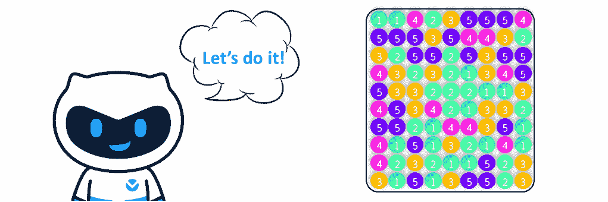

# vivo 2020 届校招在线编程笔试 A 卷

## 1

小 v 是公司的运维工程师，现有一个有关应用程序部署的任务如下：

> 1、一台服务器的**磁盘空间**、**内存**是固定的，现在有 N 个应用程序要部署；2、每个应用程序所需要的**磁盘、内存**不同，每个应用程序**允许访问的用户数**也不同，且同一个应用程序不能在一台服务器上部署多个。

对于一台服务器而言，如何组合部署应用程序能够使得单台服务器允许访问的用户数**最多**？

本题知识点

Java 工程师 C++工程师 iOS 工程师 安卓工程师 运维工程师 前端工程师 算法工程师 PHP 工程师 测试工程师 安全工程师 c#工程师 数据库工程师 大数据开发工程师 嵌入式工程师 数据挖掘工程师 测试开发工程师 vivo 2020

讨论

[道可道非常道嘤](https://www.nowcoder.com/profile/646612786)

//题目 C++接口都写好了，直接在对应地方补这段代码看到这个题目我第一反应就是背包问题，奈何之前见得都是二维背包，一时脑子转不过弯😣三维背包这个我是抄的下面某位 java 大佬的答案然后翻译成 C++；很清晰简洁，我很喜欢😊

```cpp
//write code here
vector<vector<vector<int>>> dp(countOfApp + 1,vector<vector<int>>(disk+1,vector<int>(mem+1)));
    for(int i = 1; i <= countOfApp; i++){
        for(int j = disk; j > 0; j--){
            for(int k = mem; k > 0; k--){
                if(j >= disks[i-1] && k >= mems[i-1]){
                    dp[i][j][k] = max(dp[i - 1][j][k],dp[i - 1][j - disks[i-1]][k - mems[i-1]]+ users[i-1]);
                }else{
                    dp[i][j][k] = dp[i - 1][j][k];
                }
            }
        }
    }
	return dp[countOfApp][disk][mem];
```

编辑于 2020-03-07 22:23:16

* * *

[无言の西月](https://www.nowcoder.com/profile/3674345)

```cpp
#回溯
while True:
    try:

        string = input().split(" ")
        m, n = int(string[0]), int(string[1])
        apps = [[int(y) for y in x.split(",")] for x in string[-1].split("(1569)#")]
        res = []
        def backtrack(apps,m,n,users):
            if m<0&nbs***bsp;n<0:
                return
            elif apps==[]:
                res.append(users)
                return
            else:
                for i in range(len(apps)):
                    if m-apps[i][0]<0&nbs***bsp;n-apps[i][1]<0:
                        res.append(users)
                    backtrack(apps[:i]+apps[i+1:],m-apps[i][0],n-apps[i][1],users+apps[i][2])
        backtrack(apps,m,n,0)
        print(max(res))
    except:
        break
```

发表于 2020-03-06 17:18:48

* * *

[仰望星空的雪](https://www.nowcoder.com/profile/689968942)

简单的背包问题，直接 DP 解决。

```cpp
import java.io.*;
import java.util.*;

/**
 * Welcome to vivo !
 */

public class Main {

    public static void main(String[] args) throws Exception {
        BufferedReader br = new BufferedReader(new InputStreamReader(System.in));
        String inputStr = br.readLine();
        String[] input = inputStr.split(" ");
        int totalDisk = Integer.parseInt(input[0]);
        int totalMemory = Integer.parseInt(input[1]);
        List<Service> services = parseServices(input[2].split("#"));
        int output = solution(totalDisk, totalMemory, services);
        System.out.println(output);
    }

    private static int solution(int totalDisk, int totalMemory, List<Service> services) {

        // TODO Write your code here
        int len = services.size();
        int[][][] dp = new int[len + 1][totalDisk + 1][totalMemory + 1];
           for(int i = 1; i <= len; i++)
                 for(int j = totalDisk; j > 0; j--)
                     for(int k = totalMemory; k > 0; k--){
           if(j >= services.get(i - 1).getDisk() && k >= services.get(i - 1).getMemory()){
                    dp[i][j][k] = Math.max(dp[i - 1][j][k],
                    dp[i - 1][j - services.get(i - 1).getDisk()][k - services.get(i - 1).getMemory()]
                    + services.get(i - 1).getusers());
           }else{
                    dp[i][j][k] = dp[i - 1][j][k];
           }
        }
        return dp[len][totalDisk][totalMemory];
    }

    private static List<Service> parseServices(String[] strArr) {
        if (strArr == null || strArr.length == 0) {
            return new ArrayList<Service>(0);
        }
        List<Service> services = new ArrayList<>(strArr.length);
        for (int i = 0; i < strArr.length; i++) {
            String[] serviceArr = strArr[i].split(",");
            int disk = Integer.parseInt(serviceArr[0]);
            int memory = Integer.parseInt(serviceArr[1]);
            int users = Integer.parseInt(serviceArr[2]);
            services.add(new Service(disk, memory, users));
        }
        return services;
    }

    static class Service {
        private int disk;

        private int memory;

        private int users;

        public Service(int disk, int memory, int users) {
            this.disk = disk;
            this.memory = memory;
            this.users = users;
        }

        public int getDisk() {
            return disk;
        }

        public void setDisk(int disk) {
            this.disk = disk;
        }

        public int getMemory() {
            return memory;
        }

        public void setMemory(int memory) {
            this.memory = memory;
        }

        public int getusers() {
            return users;
        }

        public void setusers(int users) {
            this.users = users;
        }
    }
}
```

发表于 2020-01-03 20:46:22

* * *

## 2

小 v 在 vivo 手机的应用商店中下载了一款名为“**一维消消乐**”的游戏，介绍如下：

> 1、给出一些不同颜色的豆子，豆子的颜色用数字（0-9）表示，即不同的数字表示不同的颜色；2、通过不断地按行消除相同颜色且连续的豆子来积分，直到所有的豆子都消掉为止；3、假如每一轮可以消除相同颜色的连续 k 个豆子（k >= 1），这样一轮之后小 v 将得到 k*k 个积分；4、由于仅可按行消除，不可跨行或按列消除，因此谓之“一维消消乐”。

请你帮助小 v 计算出最终能获得的**最大**积分。

本题知识点

Java 工程师 C++工程师 iOS 工程师 安卓工程师 前端工程师 算法工程师 大数据开发工程师 数据挖掘工程师 测试开发工程师 vivo 运维工程师 测试工程师 PHP 工程师 安全工程师 c#工程师 数据库工程师 嵌入式工程师 2020

讨论

[蓝胖子 k](https://www.nowcoder.com/profile/604741539)

[`blog.csdn.net/STILLxjy/article/details/85106608 这个讲解的比较清楚`](https://blog.csdn.net/STILLxjy/article/details/85106608)

发表于 2020-06-06 21:45:21

* * *

[零葬](https://www.nowcoder.com/profile/75718849)

leetcode 第 546 题“移除盒子”原题：[`leetcode-cn.com/problems/remove-boxes/solution/yi-chu-he-zi-by-leetcode-solution/`](https://leetcode-cn.com/problems/remove-boxes/solution/yi-chu-he-zi-by-leetcode-solution/)使用动态规划求解

```cpp
import java.io.*;

/**
 * Welcome to vivo !
 */

public class Main {
    private static int[][][] dp;
    public static void main(String[] args) throws Exception {
        BufferedReader br = new BufferedReader(new InputStreamReader(System.in));
        String inputStr = br.readLine();
        int input[] = parseInts(inputStr.split(" "));
        int output = solution(input);
        System.out.println(output);
    }

    private static int[] parseInts(String[] strArr) {
        if (strArr == null || strArr.length == 0) {
            return new int[0];
        }
        int[] intArr = new int[strArr.length];
        for (int i = 0; i < intArr.length; i++) {
            intArr[i] = Integer.parseInt(strArr[i]);
        }
        return intArr;
    }

    private static int solution(int[] input) {
        // TODO Write your code here
        int length = input.length;
        dp = new int[length][length][length];
        return calculatePoints(input, 0, length - 1, 0);
    }

    public static int calculatePoints(int[] boxes, int l, int r, int k) {
        if (l > r) return 0;
        if (dp[l][r][k] == 0) {
            dp[l][r][k] = calculatePoints(boxes, l, r - 1, 0) + (k + 1) * (k + 1);
            for (int i = l; i < r; i++) {
                if (boxes[i] == boxes[r])
                    dp[l][r][k] = Math.max(dp[l][r][k], calculatePoints(boxes, l, i, k + 1) + calculatePoints(boxes, i + 1, r - 1, 0));
            }
        }
        return dp[l][r][k];
    }
}
```

发表于 2021-02-09 17:22:09

* * *

[xhd2015_the](https://www.nowcoder.com/profile/3342798)

人在 vivo，刚刷完自己公司的题目。这题是 Leetcode 原题：[`leetcode.com/problems/remove-boxes/`](https://leetcode.com/problems/remove-boxes/)高效的解法应当是动态规划，但是没那么多时间想，这里使用 dancing links 的思想，使用一个链表记录数组，然后回溯即可

```cpp
import java.io.*;

/**
 * Welcome to vivo !
 */

public class Main {

    public static void main(String[] args) throws Exception {
        BufferedReader br = new BufferedReader(new InputStreamReader(System.in));
        String inputStr = br.readLine();
        int input[] = parseInts(inputStr.split(" "));
        int output = solution(input);
        System.out.println(output);
    }

    private static int[] parseInts(String[] strArr) {
        if (strArr == null || strArr.length == 0) {
            return new int[0];
        }
        int[] intArr = new int[strArr.length];
        for (int i = 0; i < intArr.length; i++) {
            intArr[i] = Integer.parseInt(strArr[i]);
        }
        return intArr;
    }

    static class Node {
        Node prev;
        Node next;
        int val;
        Node(int val){
            this.val = val;
        }
    }

    private static int solution(int[] input) {
        // TODO Write your code here
        Node head = new Node(0);
        Node node = head;
        for(int i=0;i<input.length;++i){
            Node  p = new  Node(input[i]);
            p.prev = node;
            node.next = p;
            node = p;
        }
        return search(head);
    }
    static int search(Node head){
        if(head.next == null)return 0;

        int max = 0;
        Node p=head.next;
        while(p!=null){
            Node r=p;
            int c=1;
            while(r.next!=null && r.next.val==r.val){ r=r.next; ++c;} 
            // remove
            p.prev.next = r.next;
            if(r.next!=null)r.next.prev=p.prev;
            int val = c*c + search(head);
            // restore
            p.prev.next = p;
            if(r.next!=null)r.next.prev=r;
            max = Math.max(max,val);

            p = r.next;
        }

        return max;
    }
}
```

Leetcode 原题的 dp 解法：

```cpp
class Solution {
        int n;
        int[][] F;
        int[] prev;

        public int removeBoxes(int[] boxes) {
            n = boxes.length;
            prev = new int[n];
            F = new int[n][n];
            for (int i = 0; i < n; i++) {
                prev[i] = -1;
                for (int j = 0; j < n; j++) {
                    F[i][j] = -1;
                }
                for (int j = i - 1; j >= 0; --j) {
                    if (boxes[i] == boxes[j]) {
                        prev[i] = j;
                        break;
                    }
                }
            }
            return f(0, n - 1);
        }

        public int f(int i, int j) {
            if (i > j) {
                return 0;
            }
            if (F[i][j] != -1) {
                return F[i][j];
            }
            if (i == j) {
                return F[i][j] = 1;
            }
            return F[i][j] = g(i, j, prev[j], 1);
        }

        public int g(int i, int j, int r, int m) {
            if (i > j) {
                return 0;
            }
            if (r < i) {
                return f(i, j - 1) + m * m;
            }
            // 如果相邻，可以消除许多中间状态
            if (r + 1 == j) {
                return g(i, r, prev[r], m + 1);
            }
            int rv = prev[r];
            return Math.max(
                    g(i, r, rv, m + 1) + f(r + 1, j - 1),
                    g(i, j, rv, m)
            );
        }
    }
```

编辑于 2020-03-01 13:00:56

* * *

## 3

小 v 所在的公司即将举行年会，年会方案设计过程中必不可少的一项就是抽奖活动。小 v 在本次活动中被委以重任，负责抽奖活动的策划；为了让中奖的礼物更加精美且富有神秘感，打算采用礼品盒来包装奖品，此时小 v 发挥了自己的创意想捉弄一下获奖的同事，便采取了多重包装来包装奖品。现给出一个字符串，并假定用一对圆括号( )表示一个**礼品盒**，0 表示**奖品**，你能据此帮获奖者算出**最少**要拆多少个礼品盒才能拿到奖品吗？

本题知识点

Java 工程师 C++工程师 iOS 工程师 安卓工程师 运维工程师 前端工程师 算法工程师 PHP 工程师 测试工程师 安全工程师 c#工程师 数据库工程师 大数据开发工程师 嵌入式工程师 数据挖掘工程师 测试开发工程师 vivo 2020

讨论

[零葬](https://www.nowcoder.com/profile/75718849)

0 左边成对的括号都不用拆，因为这样的括号代表的是空礼品盒；未成对的都要拆，因为它们包着 0，与之成对的括号在 0 的右边。因此只考虑 0 左边左括号，对未成对的括号进行计数，遇到左括号加 1，遇到右括号减 1，平衡掉一个左括号，最后剩下的左括号数就是最少要拆的礼品盒数目。

```cpp
private static int solution(String str) {
    // TODO Write your code here 
    int count = 0;
    for(int i = 0; i < str.length(); i++){
        if(str.charAt(i) == '(')
            count ++;
        if(str.charAt(i) == ')')
            count --;
        if(str.charAt(i) == '0')
            break;
    }
    return count;
}
```

发表于 2021-02-09 14:15:27

* * *

[霍格抓根宝](https://www.nowcoder.com/profile/817105678)

(()(()()(((()(())))))()()()(()()()))()()()((((0))))()()()(()()()()()()))这个用例左右括号数量不一样，由开始到礼物位置得到的结果和由礼物位置到结束的结果不一样

发表于 2020-03-09 13:09:55

* * *

[青春逐梦 ty](https://www.nowcoder.com/profile/225001967)

```cpp
def solution(s):

    # 0 左边的左右括号数目的差值不就是答案吗，因为右括号肯定有左括号对应，直接抵消了
    a = s.split('0')[0]
    b = a.count('(')
    c = a.count(')')
    return abs(b - c)
    pass

if __name__ == '__main__':
    input = input()
    print(solution(input))
```

编辑于 2020-12-09 16:52:32

* * *