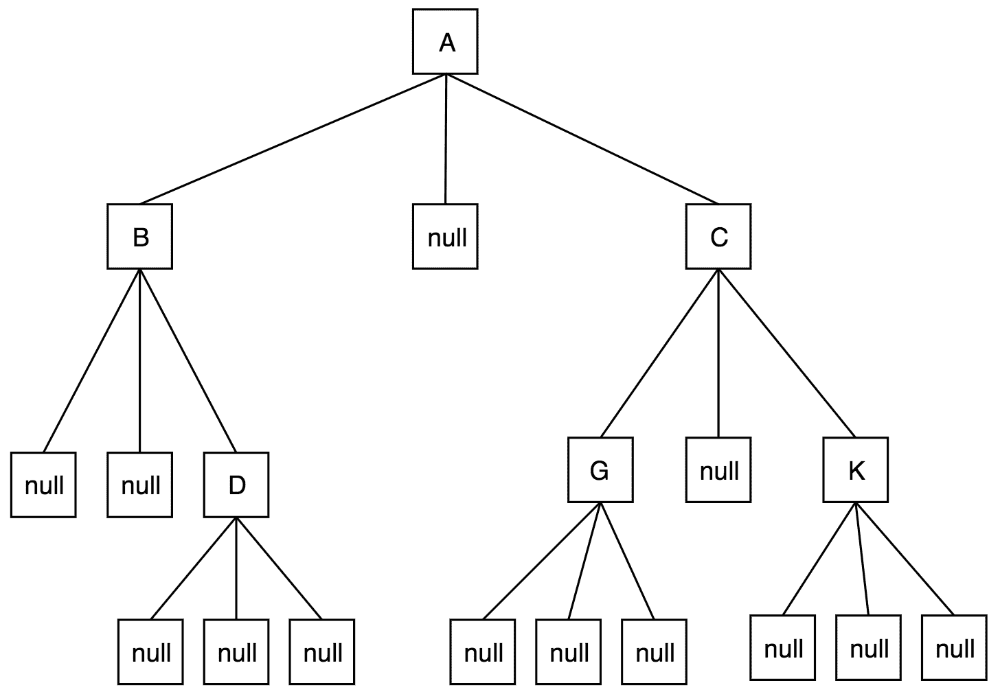
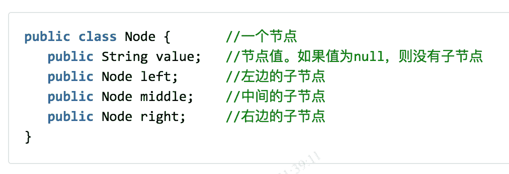
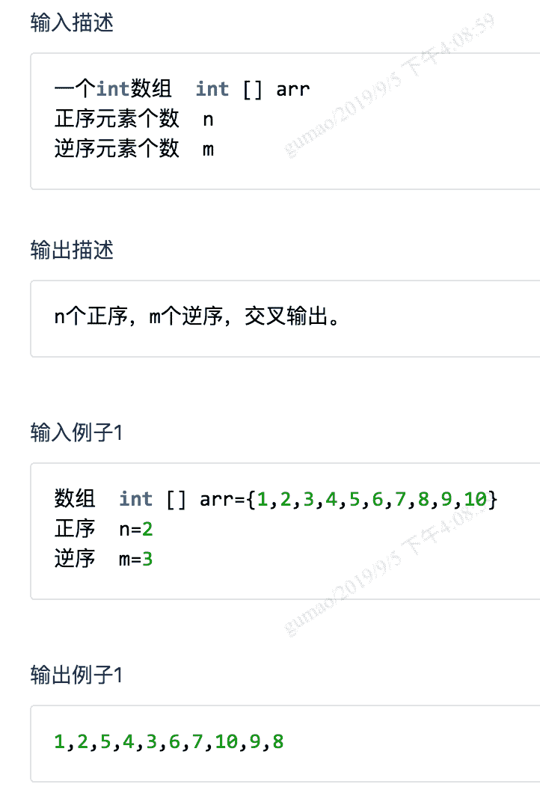

# 酷家乐 2020 校园招聘-后端 A 卷

## 1

关于排序算法，下列描述正确的是：

正确答案: A   你的答案: 空 (错误)

```cpp
快速排序和堆排序的平均时间复杂度都是 O(nlogn)
```

```cpp
快速排序和归并排序的最劣时间复杂度都是 O(n²)
```

```cpp
快速排序和堆排序的空间复杂度都是 O(1)
```

```cpp
快速排序和希尔排序的最优时间复杂度都是 O(nlogn)
```

本题知识点

Java 工程师 C++工程师 酷家乐 2020

讨论

[是瑶瑶公主呀](https://www.nowcoder.com/profile/592649258)

B 快速排序最差 n 平方 归并排序最差 nlognC 快速排序空间复杂度 logn 堆排序 1D 快速排序最好复杂度 nlogn 希尔排序 n 的 1.3-2 次方

发表于 2019-11-24 20:09:45

* * *

## 2

下面哪一层不属于计算机网络的 7 层模型中：

正确答案: D   你的答案: 空 (错误)

```cpp
物理层
```

```cpp
数据链路层
```

```cpp
网络层
```

```cpp
网际层
```

本题知识点

Java 工程师 C++工程师 酷家乐 前端工程师 2020 牛客

讨论

[是瑶瑶公主呀](https://www.nowcoder.com/profile/592649258)

网际层是 TCP/IP 中的网络层

发表于 2019-11-24 20:10:01

* * *

[SupeRcl✿҉](https://www.nowcoder.com/profile/695396552)

应用层 表示层 会话层 传输层 网络层 数据链路层 物理层

发表于 2020-12-27 22:18:03

* * *

## 3

将下列存储设备按访问速度从低到高排序：内存、磁盘、SSD、寄存器：

正确答案: B   你的答案: 空 (错误)

```cpp
磁盘，SSD，寄存器，内存
```

```cpp
磁盘，SSD，内存 ，寄存器
```

```cpp
SSD，磁盘，寄存器，内存
```

```cpp
磁盘，内存，SSD，寄存器
```

本题知识点

Java 工程师 C++工程师 酷家乐 前端工程师 2020

讨论

[Decisivem](https://www.nowcoder.com/profile/7879048)

磁盘最慢，ssd 是固态硬盘 固态比磁盘快，然后寄存器最接近 cpu 所以比内存快

发表于 2019-11-27 07:52:37

* * *

[是瑶瑶公主呀](https://www.nowcoder.com/profile/592649258)

磁盘最慢 下来是硬盘 内存比较块 寄存器最快

发表于 2019-11-24 20:11:05

* * *

## 4

已经获得除 CPU 以外的所有所需资源的进程处于（   ）状态。

正确答案: B   你的答案: 空 (错误)

```cpp
运行状态
```

```cpp
就绪状态
```

```cpp
自由状态
```

```cpp
阻塞状态
```

本题知识点

Java 工程师 C++工程师 酷家乐 2020

讨论

[Albattoss1997](https://www.nowcoder.com/profile/838625042)

等待 CPU 处于就绪状态 获得时间片后进入运行态

发表于 2019-12-11 10:24:52

* * *

## 5

下列关于分布式系统的理解你觉得正确的是：

正确答案: C   你的答案: 空 (错误)

```cpp
在分布式系统中，服务器出现故障的概率会大大降低
```

```cpp
在分布式系统中，网络总是可靠的，消息总能按设计的顺序传达
```

```cpp
大部分的分布式系统都是为了提高系统稳定性、可扩展性和性能
```

```cpp
存在一个同时满足一致性、可用性和分区容错性的分布式系统
```

本题知识点

Java 工程师 C++工程师 酷家乐 2020

## 6

在下⾯面关于并发性的叙述众正确的是：

正确答案: C   你的答案: 空 (错误)

```cpp
并发性是指若干事件在同一时刻发生
```

```cpp
并发性是指若干事件在不同时刻发生
```

```cpp
并发性是指若干事件在同一时间间隔发生
```

```cpp
并发性是指若干事件在不同时间间隔发生
```

本题知识点

Java 工程师 C++工程师 酷家乐 2020

## 7

下述哪一条是顺序存储结构的优点?

正确答案: D   你的答案: 空 (错误)

```cpp
存储密度⼤
```

```cpp
插入运算⽅便
```

```cpp
删除运算⽅便
```

```cpp
可⽅便地⽤于各种逻辑结构的存储表示
```

本题知识点

Java 工程师 C++工程师 酷家乐 2020

讨论

[朝云织鹤](https://www.nowcoder.com/profile/614073615)

这题为啥不是 A 呀 懵了存储密度不是说的 有效数据所占空间/一个元素所占空间吗

发表于 2020-09-23 17:02:35

* * *

[_ooops_](https://www.nowcoder.com/profile/756272361)

链表相较于顺序表来说，他的插入和删除会更方便一些

发表于 2020-02-14 10:01:13

* * *

[牛客 842227512 号](https://www.nowcoder.com/profile/842227512)

C

发表于 2019-12-29 10:20:17

* * *

## 8

关于 TCP 与 UDP 下⾯面哪⼀一项描述是错误的?

正确答案: D   你的答案: 空 (错误)

```cpp
TCP 面向连接，UDP⾯向非连接即发送数据前不需要建立链接
```

```cpp
TCP 提供可靠的服务(数据传输)，UDP 无法保证
```

```cpp
TCP 面向字节流，UDP 面向报文
```

```cpp
TCP 数据传输快，UDP 数据传输慢
```

本题知识点

Java 工程师 C++工程师 酷家乐 2020

讨论

[秋分 201811031958543](https://www.nowcoder.com/profile/296809826)

D

发表于 2019-12-18 13:10:15

* * *

[Decisivem](https://www.nowcoder.com/profile/7879048)

个人认为，tcp 有拥塞控制和流量控制，所以是面向字节流。udp 功能比较简单所以直接发送报文，由应用层来进行划分

发表于 2019-11-27 07:57:43

* * *

## 9

元素 ABCDE 依次入栈，则以下（）是不可能的出栈次序

正确答案: C   你的答案: 空 (错误)

```cpp
ABCDE
```

```cpp
EDCBA
```

```cpp
DABCE
```

```cpp
ACBDE
```

本题知识点

Java 工程师 C++工程师 酷家乐 前端工程师 2020

讨论

[轻羽西风里](https://www.nowcoder.com/profile/921470956)

先给入栈元素标记 12345，理想状态出栈顺序是 54321，但是出栈是随机的，可能会在入栈的时候有些元素就开始出栈了，但是，当前出栈元素前面未出栈的元素一定会在其后面出栈，且遵守先入后出的原则，因此，答案 C 中，D 出栈后，其前面的元素还没有出栈的是 ABC，ABC 应该按照先入后出的原则以 CBA 的顺序出栈。

发表于 2020-10-26 20:04:35

* * *

[随机变量 i](https://www.nowcoder.com/profile/899442621)

答案中出栈的第一个元素是在原来的次序中是第几个，那么他的前面的元素必然都还在栈中。

发表于 2020-02-23 07:48:21

* * *

## 10

以下哪个是 UDP 协议的特点

正确答案: B   你的答案: 空 (错误)

```cpp
面向连接
```

```cpp
没有拥塞控制
```

```cpp
字节流传输
```

```cpp
传输可靠
```

本题知识点

Java 工程师 C++工程师 酷家乐 前端工程师 2020

讨论

[是瑶瑶公主呀](https://www.nowcoder.com/profile/592649258)

拥塞控制是 tcp 的

发表于 2019-11-26 19:07:20

* * *

## 11

不能用来修饰 interface 的有

正确答案: A C D   你的答案: 空 (错误)

```cpp
private
```

```cpp
public
```

```cpp
protected
```

```cpp
static
```

本题知识点

Java 工程师 C++工程师 酷家乐 2020

## 12

下列排序算法空间复杂度最小的是：

正确答案: A B C   你的答案: 空 (错误)

```cpp
插入排序
```

```cpp
冒泡排序
```

```cpp
堆排序
```

```cpp
快速排序
```

本题知识点

Java 工程师 C++工程师 酷家乐 2020

讨论

[一鹤排云上](https://www.nowcoder.com/profile/549263312)

快速排序递归函数栈空间复杂度 logN

发表于 2020-05-25 14:24:35

* * *

[青春渐离](https://www.nowcoder.com/profile/883163570)

快速排序虽然也不需要额外数组，但是需要左指针，右指针，base 和空值，四个空间。

发表于 2020-03-10 11:37:02

* * *

## 13

图的应用算法有：

正确答案: A C D   你的答案: 空 (错误)

```cpp
克鲁斯卡尔算法（Kruskal）
```

```cpp
哈夫曼算法
```

```cpp
狄杰斯特拉算法
```

```cpp
拓扑排序算法
```

本题知识点

Java 工程师 C++工程师 酷家乐 2020

## 14

下面关于垃圾收集的说法不正确的是

正确答案: A B C   你的答案: 空 (错误)

```cpp
一旦一个对象成为垃圾，就立刻被收集掉
```

```cpp
对象空间被收集掉之后，会执行该对象的 finalize 方法
```

```cpp
finalize 方法和 C++的析构函数是完全一回事情
```

```cpp
一个对象成为垃圾是因为不再有引用指着它，但是线程并非如此
```

本题知识点

Java 工程师 C++工程师 酷家乐 2020

讨论

[青春渐离](https://www.nowcoder.com/profile/883163570)

A 成为垃圾后不会立刻收集，可能要等待一次垃圾回收一起回收，总之不会立刻回收。Bfinalize 是自救方法，是在回收之前开始执行。C 不知道。

发表于 2020-03-10 11:40:40

* * *

## 15

在一颗平衡树中，下列说法错误的是

正确答案: A B C   你的答案: 空 (错误)

```cpp
它不能用顺序存储结构存储
```

```cpp
顺序存储结构和链式存储结构都不能使用
```

```cpp
它不能用链式存储结构存储
```

```cpp
顺序存储结构和链式存储结构都能存储
```

本题知识点

Java 工程师 C++工程师 酷家乐 2020

## 16

三叉树的水平输出


三叉树的结构如上图。
要求：1、任选一种编程语言，写代码，实现功能。 写函数，水平输出元素值。A,
B,C,
D,G,K,

你的答案

本题知识点

Java 工程师 C++工程师 酷家乐 前端工程师 2020

讨论

[NIU21](https://www.nowcoder.com/profile/586989219)

```cpp
    //其实也可以用 dfs 只要用两层 list 记录层数 h 即可
    public void out(Node root){
        List<List<String>> list = new ArrayList<>();
        levelHelper(list, root, 0);
        for (List<String> strs : list) {
            for (String str : strs) {
                System.out.print(str + ",");
            }
            System.out.println();
        }
    }

    private void levelHelper(List<List<String>> list, Node root, int h) {
        if (root == null) return;
        if (list.size() <= h) list.add(new ArrayList<>());
        list.get(h).add(root.value);
        levelHelper(list, root.left, h + 1);
        levelHelper(list, root.middle, h + 1);
        levelHelper(list, root.right, h + 1);
    }
```

编辑于 2020-09-08 15:33:02

* * *

[选择不错过你](https://www.nowcoder.com/profile/49756113)

```cpp
public static void printTreePlane(Node node){
        if (node == null){
            return;
        }
        Queue<Node> queue = new LinkedList<>();
        queue.offer(node);
        while (!queue.isEmpty()){
            // 这里的 size 相当与当前层的节点数量
            int size = queue.size();
            // 这里就是遍历当前层节点，输出结果
            while (size > 0){
                Node root = queue.poll();
                System.out.print(root.value+",");
                if(root.left != null){
                    queue.offer(root.left);
                }
                if (root.right != null){
                    queue.offer(root.right);
                }
                size--;
            }
            System.out.print("\n");
        }

    }
```

编辑于 2020-09-09 12:53:12

* * *

[丄 sea 丶 yu 丅](https://www.nowcoder.com/profile/2428446)

 ```cpp
import java.util.*;

public class Test{
    public static void main(String[] args) {
        Node node = new Node("A");
        node.left = new Node("B");
        node.left.right = new Node("D");
        node.right = new Node("C");
        node.right.left = new Node("G");
        node.right.right = new Node("K");
        solve(node);
    }

    public static class Node{
        public String value;
        public Node left;
        public Node middle;
        public Node right;
        public Node(String value) {
            this.value = value;
        }
    }

    private static void solve(Node root){
        Queue<Node> queue = new ArrayDeque<>();
        queue.add(root);
        int size = 1;
        int after = 0;
        while (!queue.isEmpty()){
            Node poll = queue.poll();
            System.out.print(poll.value+",");
            if(poll.left != null){
                queue.add(poll.left);
                after ++;
            }

            if(poll.middle != null){
                queue.add(poll.middle);
                after ++;
            }

            if(poll.right != null){
                queue.add(poll.right);
                after ++;
            }
            size--;
            if(size == 0){
                System.out.println();
                size = after;
                after = 0;
            }
        }
    }
}
``` 

发表于 2020-08-13 15:35:12

* * *

## 17

数组的交叉输出

要求：1、任选一种编程语言，写代码，实现功能。有个 int 数组，int[]。

n 个元素为一组，正序输出。

m 个元素为一组，逆序输出。

然后重复上面 2 步。



你的答案

本题知识点

Java 工程师 C++工程师 酷家乐 前端工程师 2020

讨论

[七七 201907182000497](https://www.nowcoder.com/profile/779114942)

```cpp
 public static List<Integer> crossOutput(int[] arr,int n,int m){
        int len = arr.length;
        List<Integer> ans = new ArrayList<>();
        List<Integer> reverseSubArray = new ArrayList<>();//倒序子数组
        List<Integer> subArray = new ArrayList<>();//正序子数组
        int i = 0;
        while(i<len){
            while(subArray.size()<n){
                subArray.add(arr[i]);
                i++;
            }
            while(reverseSubArray.size()<m){
                reverseSubArray.add(0,arr[i]);
                i++;
            }
            ans.addAll(subArray);
            ans.addAll(reverseSubArray);
            subArray.clear();
            reverseSubArray.clear();
        }
        return ans;
    }

```

发表于 2020-07-04 17:23:48

* * *

[牛客 352531753 号](https://www.nowcoder.com/profile/352531753)

```cpp
const splice = (array, by) => {
    if(!array.length) return []
    return array.splice(0, by)
}

const reverseSplice = (array, by) => {
    if(!array.length) return []
    return array.splice(0, by).reverse()
}

const processInput = (array = []) => {
    let result = []
    while(array.length){
        result = result.concat(splice(array,2))
        result = result.concat(reverseSplice(array,3))
    }
    return result
}

console.log(processInput([1,2,3,4,5,6,7,8,9,10]))

```

发表于 2021-07-10 22:49:32

* * *

[牛客 135467187 号](https://www.nowcoder.com/profile/135467187)

```cpp
function crossOut(array){
    let n = 2;
    let m = 3;
    let result = [];
    while( array.length != 0 ){
        let n_arr = array.slice(0, n)
        let m_arr = array.slice(n, n + m).reverse();
        result.push( ...n_arr, ...m_arr );
        array.splice(0, n + m);
    }
    return result.join(",");
}
```

发表于 2021-06-30 11:36:11

* * *