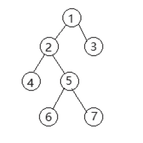

# 酷家乐 2020 校园招聘-后端 B 卷

## 1

关于平衡二叉搜索树一下说法错误的是：

正确答案: B   你的答案: 空 (错误)

```cpp
AVL Tree 是平衡二叉搜索树
```

```cpp
平衡二叉搜索树的高度差可能为 2
```

```cpp
最优可以在 O(logn)复杂度下完成删除
```

```cpp
B+树不属于平衡二叉搜索树
```

本题知识点

Java 工程师 C++工程师 酷家乐 2020

讨论

[是瑶瑶公主呀](https://www.nowcoder.com/profile/592649258)

平衡二叉树的高度差最大为 1

发表于 2019-11-26 19:03:27

* * *

## 2

下面哪一个描述不正确：

正确答案: C   你的答案: 空 (错误)

```cpp
ICMP 协议是 因特网控制报文协议，用于在 IP 主机、路由器之间传递控制消息
```

```cpp
HTTP 协议是超文本传输协议，是一个属于应用层的面向对象的协议
```

```cpp
DHCP 协议是动态主机配置协议，用于为主机分配 MAC 地址
```

```cpp
NAT 协议是一种将私有（保留）地址转化为合法 IP 地址的转换技术
```

本题知识点

Java 工程师 C++工程师 酷家乐 前端工程师 2020

讨论

[是瑶瑶公主呀](https://www.nowcoder.com/profile/592649258)

DHCP 是动态分配 ip 地址的

发表于 2019-11-26 19:03:49

* * *

## 3

考虑一个 cache 中 有 64 个块，每块大小为 16 字节，那么字节地址 1200 将被映射到 cache 中的哪一块：

正确答案: A   你的答案: 空 (错误)

```cpp
11
```

```cpp
10
```

```cpp
9
```

```cpp
8
```

本题知识点

Java 工程师 C++工程师 酷家乐 前端工程师 2020

讨论

[Neflibata](https://www.nowcoder.com/profile/301920619)

1200/16=7575-64=11

发表于 2020-03-12 22:58:37

* * *

[是瑶瑶公主呀](https://www.nowcoder.com/profile/592649258)

64*16=1024

1200-1024=176

176/16=11

发表于 2019-11-26 19:04:28

* * *

## 4

采用轮转法调度是为了

正确答案: A   你的答案: 空 (错误)

```cpp
多个终端都能得到系统的及时响应
```

```cpp
先来先服务
```

```cpp
优先级较高的进程得到及时调度
```

```cpp
需 CPU 最短的进程先做
```

本题知识点

Java 工程师 C++工程师 酷家乐 前端工程师 2020

讨论

[公众号-产品 offer 看我](https://www.nowcoder.com/profile/454963084)

轮转法调度：每个进程将得到小单位的 CPU 时间。 时间片用完该进程将被抢占并插入就绪队列末尾。所以目的是为了多个终端都能得到时间片，而每个终端系统的及时响应.

发表于 2020-03-07 11:07:53

* * *

## 5

下列关于流处理和批处理的理解你觉得正确的是：

正确答案: D   你的答案: 空 (错误)

```cpp
批处理可以处理无界的数据集
```

```cpp
Apache Hadoop 非常擅长处理流处理任务
```

```cpp
流处理任务出现异常时完全无法恢复，只能看着数据丢失。
```

```cpp
批处理不擅长处理需要实时计算的任务
```

本题知识点

Java 工程师 C++工程师 酷家乐 2020

讨论

[_ooops_](https://www.nowcoder.com/profile/756272361)

批处理不具有实时性

发表于 2020-02-15 11:43:51

* * *

[是瑶瑶公主呀](https://www.nowcoder.com/profile/592649258)

批处理是处理一批定死的任务

没有实时性

发表于 2019-11-26 19:05:27

* * *

## 6

操作系统的主要功能有

正确答案: C   你的答案: 空 (错误)

```cpp
进程管理、存储器管理、设备管理、处理机管理
```

```cpp
虚拟存储管理、处理机管理、进程调度、文件系统
```

```cpp
处理机管理、存储器器管理、设备管理、⽂件系统
```

```cpp
进程管理、中断管理、设备管理、⽂件系统
```

本题知识点

Java 工程师 C++工程师 酷家乐 2020

讨论

[bukun](https://www.nowcoder.com/profile/514169517)

操作系统的主要功能有： 处理器管理、存储管理、设备管理、作业管理、文件管理。

发表于 2020-07-13 16:47:59

* * *

## 7

线性表若采⽤用链式存储结构时，要求内存中可用存储单元的地址 ___

正确答案: D   你的答案: 空 (错误)

```cpp
必须是连续的
```

```cpp
部分地址必须是连续的
```

```cpp
一定是不连续的
```

```cpp
连续或不连续都可以
```

本题知识点

Java 工程师 C++工程师 酷家乐 2020

讨论

[是瑶瑶公主呀](https://www.nowcoder.com/profile/592649258)

链表逻辑连续就可以 物理随意

发表于 2019-11-26 19:06:03

* * *

## 8

域名服务 DNS 的正向解析是:

正确答案: B   你的答案: 空 (错误)

```cpp
将域名转换为物理地址
```

```cpp
将域名转换为 IP 地址
```

```cpp
将 IP 地址转换为物理地址
```

```cpp
将 IP 地址转换为域名
```

本题知识点

Java 工程师 C++工程师 酷家乐 2020

讨论

[是瑶瑶公主呀](https://www.nowcoder.com/profile/592649258)

域名解析把域名解析为 ip 地址

发表于 2019-11-26 19:06:31

* * *

## 9

给定二叉树如图所示。设 N 代表二叉树的根，L 代表根节点的左子树，R 代表根节点的右子树。。若遍历后的结点序列为 3,1,7,5,6,2,4，则其遍历方式是（ ）

正确答案: D   你的答案: 空 (错误)

```cpp
LRN
```

```cpp
NRL
```

```cpp
RLN
```

```cpp
RNL
```

本题知识点

Java 工程师 C++工程师 酷家乐 2020

讨论

[是瑶瑶公主呀](https://www.nowcoder.com/profile/592649258)

右 根 左

RNL

发表于 2019-11-26 19:06:53

* * *

## 10

以下哪个是 UDP 协议的特点

正确答案: B   你的答案: 空 (错误)

```cpp
面向连接
```

```cpp
没有拥塞控制
```

```cpp
字节流传输
```

```cpp
传输可靠
```

本题知识点

Java 工程师 C++工程师 酷家乐 前端工程师 2020

讨论

[是瑶瑶公主呀](https://www.nowcoder.com/profile/592649258)

拥塞控制是 tcp 的

发表于 2019-11-26 19:07:20

* * *

## 11

以下描述正确的是：

正确答案: C D   你的答案: 空 (错误)

```cpp
HTTP 和 HTTPS 协议的默认端口分别是 80 和 8080
```

```cpp
linux 操作系统中使用 df 和 du 命令查看进程相关信息
```

```cpp
线程是程序执行时的最小单位，它是进程的一个执行流，是 CPU 调度和分派的基本单位
```

```cpp
已知二叉树的前序遍历序列和中序遍历序列，可构造唯一的一棵二叉树
```

本题知识点

Java 工程师 C++工程师 酷家乐 2020

讨论

[_201909041942296](https://www.nowcoder.com/profile/788532760)

跟进程相关的有 ps top pgrep pstree

发表于 2019-11-27 02:28:01

* * *

[是瑶瑶公主呀](https://www.nowcoder.com/profile/592649258)

https 端口是 443

发表于 2019-11-26 19:07:43

* * *

[选择不错过你](https://www.nowcoder.com/profile/49756113)

df 用来操作磁盘的命令
前序+中序，中序+后序可以唯一构建树，前序+后序不能唯一构建

发表于 2020-09-09 22:28:24

* * *

## 12

以下哪几种 Java 原生数据结构是排序的：

正确答案: B   你的答案: 空 (错误)

```cpp
LinkedHashMap
```

```cpp
TreeMap
```

```cpp
ConcurrentTreeMap
```

```cpp
HashSet
```

本题知识点

Java 工程师 C++工程师 酷家乐 2020

讨论

[是瑶瑶公主呀](https://www.nowcoder.com/profile/592649258)

a 无序 c 不是原生 d 无序

发表于 2019-11-26 19:08:25

* * *

## 13

选项中哪一行代码可以替换题目中//add code here 而不产生编译错误？（）
public abstract class MyClass {
     public int constInt = 5;
     //add code here
     public void method() {
     }
}

正确答案: A   你的答案: 空 (错误)

```cpp
public abstract void method(int a);
```

```cpp
constInt = constInt + 5;
```

```cpp
public int method();
```

```cpp
public abstract void anotherMethod() {}
```

本题知识点

Java 工程师 C++工程师 酷家乐 2020

讨论

[青春渐离](https://www.nowcoder.com/profile/883163570)

B 应该大括号包裹，作为代码块 C 不加 abstract 不是抽象方法，需要方法体，且与下 method 方法冲突 D 抽象方法没有方法体

发表于 2020-03-10 11:54:24

* * *

[是瑶瑶公主呀](https://www.nowcoder.com/profile/592649258)

c 参数列表一样不能重载

d 抽象方法无方法体

发表于 2019-11-26 19:09:27

* * *

## 14

有 5 个元素，A, B, C, D, E, 依次按顺序进栈，进栈过程中允许出栈，以下序列中可能是该序列的出栈顺序的有（）

正确答案: A C D   你的答案: 空 (错误)

```cpp
CDBAE
```

```cpp
ADBCE
```

```cpp
ABCDE
```

```cpp
CDBEA
```

本题知识点

Java 工程师 C++工程师 酷家乐 2020

讨论

[yidingyidin](https://www.nowcoder.com/profile/82057810)

感觉 A，C，D 都是可以的啊

发表于 2019-11-27 11:47:27

* * *

[是瑶瑶公主呀](https://www.nowcoder.com/profile/592649258)

B 选项 d 出说明 bc 已进 b 没法比 c 先出

发表于 2019-11-26 19:10:10

* * *

## 15

关键字序列 T=(49, 38, 65, 97, 76, 13, 27, 49），对其从小到大排序，以第一个关键字为枢轴（支点）,以下序列可能出现在快速排序的过程中的有

正确答案: A   你的答案: 空 (错误)

```cpp
27 38 13 49 76 97 65 49
```

```cpp
13 27 49 38 49 65 76 97
```

```cpp
13 27 49 49 38 65 76 97
```

```cpp
13 27 49 38 49 65 97 76
```

本题知识点

Java 工程师 C++工程师 酷家乐 2020

讨论

[牛客 470433695 号](https://www.nowcoder.com/profile/470433695)

49 左边的一定小于等于 49  49 右边的一定大于等于 49

发表于 2021-04-17 13:30:11

* * *

## 16

三叉树的垂直输出


三叉树的结构如上图。
要求：1、任选一种编程语言，写代码，实现功能。写函数，垂直输出元素值。A,B,D,
A,C,G,
A,C,K,

你的答案

本题知识点

Java 工程师 C++工程师 酷家乐 前端工程师 2020

讨论

[月亮和西多士](https://www.nowcoder.com/profile/7099214)

```cpp
public class Main {
    public static void main(String[] args) {

        Node node = new Node("A");
        node.left = new Node("B");
        node.right = new Node("C");
        node.left.right = new Node("D");
        node.right.left = new Node("G");
        node.right.right = new Node("k");

        dfs(node,"");
    }

    private static class Node {
        public String value;
        public Node left;
        public Node middle;
        public Node right;
        public Node(String value) {
            this.value = value;
        }
    }

    static void dfs(Node node, String prefix) {
        if (node.left != null)dfs(node.left, prefix + node.value);
        if (node.middle != null) dfs(node.middle, prefix + node.value);
        if (node.right != null)dfs(node.right, prefix + node.value);
        if (node.left == null && node.middle == null && node.right == null)
            System.out.println(prefix + node.value);
    }
}
```

发表于 2021-03-06 12:08:56

* * *

[还是种田适合老子](https://www.nowcoder.com/profile/838883008)

```cpp
  //回溯法
  public void vertical(node root){
        Set<String> res = new HashSet<>();
        travel(root,new StringBuilder(), res,0);
        for(String s : res){
            for(char c : s.toCharArray()){
                System.out.print(c + ",");
            }
            System.out.println();
        }
    }

    public void travel(node node, StringBuilder sb, Set<String> res, int layer){
        if(node==null){
            return;
        }

        sb.append(node.value);
        if(node.left==null && node.middle==null && node.right==null){
            res.add(sb.toString());
            sb.deleteCharAt(layer);
            return;
        }

        travel(node.left, sb, res,layer+1);
        travel(node.middle, sb, res,layer+1);
        travel(node.right, sb, res,layer+1);
        sb.deleteCharAt(layer);
    }
```

 发表于 2020-09-05 21:56:55

* * *

## 17

字符串，找子串的个数

要求：1、任选一种编程语言，写代码，实现功能。
给定一个字符串和一个子串。子串中的字符可能重复。

输出子串出现的次数。

输入描述

| 一个字符串  str 一个子串    substr 的长度大于 sub 的长度 |

输出描述

| 输出子串出现的次数。 |

输入例子 1

| 字符串="today is nice . may nice day you have "子串="nice" |

输出例子 1

| 2 |

输入例子 2

| 字符串="abcabcabca"子串="abca" |

输出例子 2

| 3 |

你的答案

本题知识点

Java 工程师 C++工程师 酷家乐 前端工程师 2020

讨论

[Neflibata](https://www.nowcoder.com/profile/301920619)

```cpp
int find(const string &str, const string &sub){
    int len1=str.size();
    int len2=sub.size();
    int cnt=0;
    for(int i=0;i<len1;i++){
        int j=0,k=i;
        while(j<len2 && str[k++]==sub[j++]);
        if(j==len2)
            cnt++;
    }
    return cnt;
}

```

发表于 2020-03-12 22:56:30

* * *

[牛客 836671233 号](https://www.nowcoder.com/profile/836671233)

function(str1, str2) {let longStr = str1;let shortStr = str2;longStr = longStr.replace(/ /g, "");shortStr = shortStr.replace(/ /g, "");let matchCount = 0;while (longStr) {let index = longStr.indexOf(shortStr);if(index>-1){matchCount++;longStr = longStr.substring(index+1);}else{break;}}return matchCount;}

发表于 2020-04-13 00:16:05

* * *