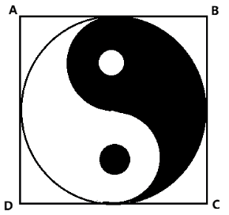
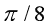
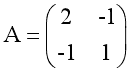
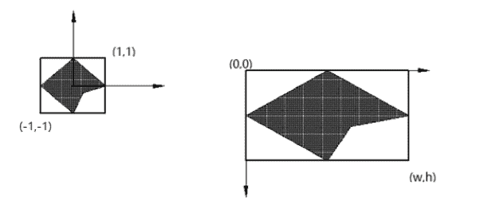
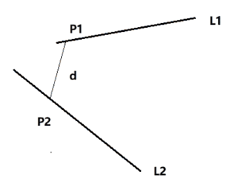
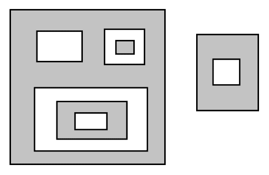

# 酷家乐 2020 校园招聘-几何算法 A 卷

## 1

设栈的最大长度为 3，入栈顺序为 1，2，3，4，5，6，且任意时刻可入栈可出栈，则不可能得出的栈序列是?

正确答案: D   你的答案: 空 (错误)

```cpp
1, 2, 3, 4, 5, 6
```

```cpp
2, 1, 3, 4, 5, 6
```

```cpp
3, 4, 2, 1, 5, 6
```

```cpp
4, 3, 2, 1, 5, 6
```

本题知识点

算法工程师 酷家乐 2020

## 2

已知一个算法的复杂度 C^N 随输入数据的数量 N 的变化公式为：C^N = C^(N-1) + N，那么这个算法的复杂度为？

正确答案: A   你的答案: 空 (错误)

```cpp
O(N2)
```

```cpp
O(N)
```

```cpp
O(logN)
```

```cpp
O(NlogN)
```

本题知识点

算法工程师 酷家乐 2020

## 3

如图，正方形 ABCD 内的图形来自中国古代的太极图，且是中心对称的。那么在正方形内随机取一点，此点落在黑色区域内的概率为？

正确答案: C   你的答案: 空 (错误)

```cpp
1/4
```

```cpp
1/2
```

```cpp

```

本题知识点

算法工程师 酷家乐 2020

讨论

[零葬](https://www.nowcoder.com/profile/75718849)

其实太极图的黑色部分面积就为圆面积的 1/2，然后令正方形边长为 2，就能通过几何概型求得概率

发表于 2020-10-13 15:11:47

* * *

## 4

已知点 A,B,C 在圆 x²+y²=1 上面运动，且 AB 垂直 BC，若点 P 的坐标为（2, 0），则三个向量和的模长（|PA +PB +PC|）最大值为 

正确答案: B   你的答案: 空 (错误)

```cpp
6
```

```cpp
7
```

```cpp
8
```

```cpp
9
```

本题知识点

算法工程师 酷家乐 2020

讨论

[零葬](https://www.nowcoder.com/profile/75718849)

AB 垂直 BC，说明角 ABC 始终为直角，即 AC 为圆的直径，向量 PA+PC 的长度应该与向量 AC 的长度相等。当 PA+PC 与 PB 共线的时候最大，将 B 取到圆上距离 P 最远的位置(-1,0)，此时不妨取 A(0,1)，B(0, -1)，此时 PA+PB = 2PO，|PA+PB+PC|=7

发表于 2020-10-13 15:08:53

* * *

## 5

已知向量 a,b 的夹角为 60 度，|a|=2，|b|=1，则|a+2b|等于？

正确答案: A   你的答案: 空 (错误)

```cpp
4
```

```cpp
5
```

本题知识点

算法工程师 酷家乐 2020

## 6

已知抛物线的方程为：y = 2x² + 3x + 5，则 x = 1 处抛物线上的单位切向量：

正确答案: B   你的答案: 空 (错误)

```cpp
(1/8, 7/8)
```

本题知识点

算法工程师 酷家乐 2020

## 7

设矩阵，则 A^(-1)=   

正确答案: A   你的答案: 空 (错误)

本题知识点

算法工程师 酷家乐 2020

讨论

[isAlina](https://www.nowcoder.com/profile/409124834)

A 乘 A 逆 = E，代入选项找就行了。

发表于 2021-04-09 16:04:16

* * *

## 8

将下图中左边范围在(-1, -1) ~ (1,1)范围内的图形显示在右边的显示器坐标系中(显示器的宽度为 w,高度为 h)，请写出图形中任意一点(x, y)转换为显示器内的坐标表达式：



正确答案: D   你的答案: 空 (错误)

```cpp
x’=w(x-1)/2, y’=h(1-y)/2
```

```cpp
x’=w(x+1)/2, y’=h(1+y)/2
```

```cpp
x’=w(x+1), y’=h(1-y)
```

```cpp
x’=w(x+1)/2, y’=h(1-y)/2
```

本题知识点

算法工程师 酷家乐 2020

讨论

[零葬](https://www.nowcoder.com/profile/75718849)

代入法求解最方便了

发表于 2020-10-13 19:13:10

* * *

## 9

求三维空间中两直线 L1, L2 之间的最短距离 d 及相应的点对（P1, P2）。要求：

a.用伪代码描述算法流程

示例图：



你的答案

本题知识点

算法工程师 酷家乐 2020

## 10

已知平面上的 N 个封闭环 L，环与环之间不相交。依据从外到内的包含关系，在平面上形成了多个封闭区域，封闭区域定义为 A<OuterLoop, InnerLoops>，即 OuterLoop 为一个环，InnerLoops 是被 OuterLoop 所直接包含的环，可能有多个。

请设计并实现算法，输入 N 个环，输出所有的封闭区域（已知检测环与环之间的包含关系的函数 F）。

示例：如下图所示，共有 9 个环。

图中阴影部分为所求的封闭区域，共有 4 个区域。

你的答案

本题知识点

算法工程师 酷家乐 2020