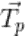
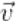
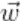
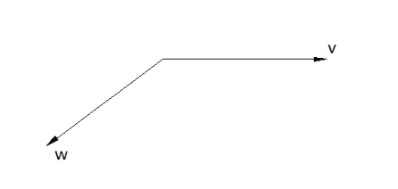
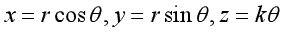
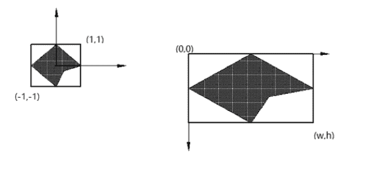
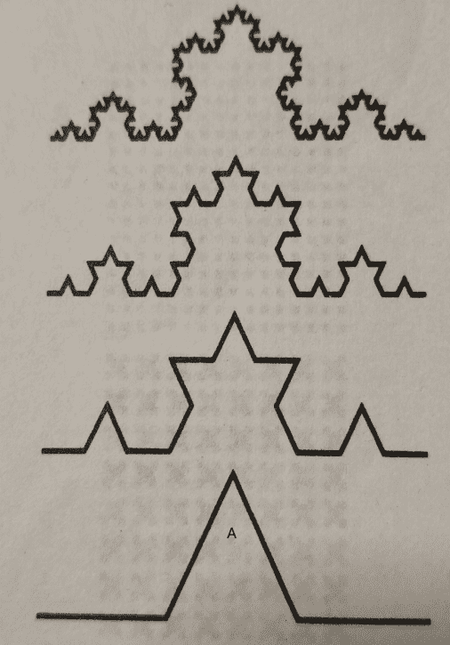

# 酷家乐 2020 校园招聘-几何算法 B 卷

## 1

平面方程 x + 2y + 3z + 4 = 0,点(1, 1, 1)在平面的 ___.

正确答案: A   你的答案: 空 (错误)

```cpp
上方
```

```cpp
下方
```

```cpp
平面上
```

本题知识点

算法工程师 酷家乐 2020

## 2

矩阵 A = BC, A^(-1) = ___

正确答案: B   你的答案: 空 (错误)

```cpp
B^(-1)C^(-1)
```

```cpp
C^(-1)B^(-1) 
```

```cpp
B^TC^T
```

```cpp
 (C^T)^(-1)(B^T)^(-1)
```

本题知识点

算法工程师 酷家乐 2020

## 3

已知空间曲线的参数化方程为：x = x(t), y=y(t), z=z(t)，曲线上任一点 P 的切向量为，曲线的参数为 t，p 点处曲线的长度为 s(t)，下面描述 P 点处曲率公式哪一个是正确的？

正确答案: B   你的答案: 空 (错误)

本题知识点

算法工程师 酷家乐 2020

## 4

已知一个算法的复杂度 C[N]随输入数据的数量 N 的变化公式为：C[N] = C[N-1] + [N]，那么这个算法的复杂度为 ___

正确答案: A   你的答案: 空 (错误)

```cpp
O(N²)
```

```cpp
O(N)
```

```cpp
O(logN)
```

```cpp
O(NlogN)
```

本题知识点

算法工程师 酷家乐 2020

## 5

已知抛物线的方程为：y = 2x² + 3x + 5，则 x = 1 处抛物线上的单位切向量：

正确答案: B   你的答案: 空 (错误)

```cpp
(1/8, 7/8)
```

本题知识点

算法工程师 酷家乐 2020

## 6

下图中向量沿逆时针方向到向量的角度为

正确答案: A   你的答案: 空 (错误)

本题知识点

算法工程师 酷家乐 2020

## 7

已知圆柱面上的等距螺旋线参数化表达形式为:

则下图圆锥面上的等距螺旋线的参数化表达形式：


正确答案: B   你的答案: 空 (错误)

本题知识点

算法工程师 酷家乐 2020

## 8

将下图中左边范围在(-1, -1)~(1,1)范围内的图形显示在右边的显示器坐标系中(显示器的宽度为 w,高度为 h)，请写出图形中任意一点(x, y)转换为显示器内的坐标表达式：

正确答案: D   你的答案: 空 (错误)

```cpp
x’=w(x-1)/2, y’=h(1-y)/2
```

```cpp
x’=w(x+1)/2, y’=h(1+y)/2
```

```cpp
x’=w(x+1), y’=h(1-y)
```

```cpp
x’=w(x+1)/2, y’=h(1-y)/2
```

本题知识点

算法工程师 酷家乐 2020

## 9

根据下图中分形的生成原理，用伪代码写出分形的的生成过程（注：要求包括生成过程和顶点的计算过程）

你的答案

本题知识点

算法工程师 酷家乐 2020

## 10

一个团队有 N 个人选举领导，他们排成一队，从左向右数，每数到 5，这个人自动退出队列，然后继续向前数，数到队列最后一位时，接着从队列的开始处数（计数不重新开始），直到队列中剩下最后一个人，这个人便成为团队的领导。请写出代码计算领导选举的结果。

本题知识点

算法工程师 酷家乐 2020

讨论

[国企求求了](https://www.nowcoder.com/profile/674826497)

循环链表完事儿 class Link:    def __init__(self, val):
        self.val = val
        self.next =None
N = list(map(int, input().split()))[0]
#print(N)

head = Link(0)
cur = head
for i in range(1, N):
    new  = Link(i)
    head.next = new
    head = new
head.next = cur
while cur.next!=cur:
    for i in range(4):
        pre=cur
        cur=cur.next
    pre.next = cur.next
    cur = pre.next
print(cur.val)

发表于 2020-05-30 02:56:52

* * *