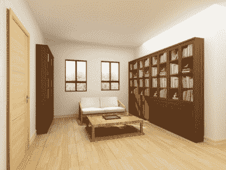

# 酷家乐 2020 校园招聘-图形图像 A 卷

## 1

设栈的最大长度为 3，入栈顺序为 1，2，3，4，5，6，且任意时刻可入栈可出栈，则不可能得出的栈序列是

正确答案: D   你的答案: 空 (错误)

```cpp
1, 2, 3, 4, 5, 6
```

```cpp
2, 1, 3, 4, 5, 6
```

```cpp
3, 4, 2, 1, 5, 6
```

```cpp
4, 3, 2, 1, 5, 6
```

本题知识点

算法工程师 酷家乐 2020

讨论

[zt_xcyk](https://www.nowcoder.com/profile/839070)

**选 D；**A 是: 每个元素按顺序进栈后再出站 栈序列(1 进 1 出、2 进 2 出、3 进 3 出....)B 是：1 进 2 进 [1 2]、2 出 1 出 []、3 4 5 6 每个元素依次进栈后出站(类似答案 A）
C 是：1 进 2 进 3 进[1 2 3]、3 出[1 2]、4 进 4 出[1 2]、2 出 1 出[ ]、5 进 5 出、6 进 6 出。**D：[1 2 3 4 ]、4 出。 栈长度超了，此时已经是 4 了。**

发表于 2020-07-29 14:59:00

* * *

[奋斗的蚂蚁 gy](https://www.nowcoder.com/profile/644856837)

D 已经超出最大的盏长度

发表于 2020-07-28 00:26:57

* * *

## 2

有 100 盏灯，从 1-100 编号，开始时所有的灯都是关着的。第一次，把所有编号是 1 的倍数的灯的开关状态改变一次；第二次，把所有编号是 2 的倍数的灯的开关状态改变一次；依次类推，直到把所有编号是 100 的倍数的灯的开关状态改变一次。此时所有开着的灯的编号有哪些？

正确答案: B   你的答案: 空 (错误)

```cpp
1, 3, 5, 7, 11, 23, 37, 47, 53, 83
```

```cpp
1, 4, 9, 16, 25, 36, 49, 64, 81, 100
```

```cpp
1, 5, 16, 25, 36, 41, 79, 83, 91, 93
```

```cpp
1, 5, 11, 17, 23, 37, 49, 64, 81, 100
```

本题知识点

算法工程师 酷家乐 2020

讨论

[牛客 961119396](https://www.nowcoder.com/profile/961119396)

排除掉质数

发表于 2021-06-13 17:09:29

* * *

[whikqp](https://www.nowcoder.com/profile/4739130)

分析状态
第一次 灯全部打开
第二次 偶数灯全部关闭，奇数灯全部打开第三次 3 的倍数的灯都关闭第四次 4 号灯会打开，分析此后 4 号灯将不会再关闭，查看答案只有 B 符合

发表于 2021-06-09 13:06:11

* * *

[奋斗的蚂蚁 gy](https://www.nowcoder.com/profile/644856837)

不怕费事，直接检验 0-10 盏灯

发表于 2020-07-28 00:27:39

* * *

## 3

以下那个排序复杂度最差情况下时间复杂度是 O(nlogn) ?

正确答案: B   你的答案: 空 (错误)

```cpp
快速排序
```

```cpp
堆排序（优先队列）
```

```cpp
插入排序
```

```cpp
桶排序
```

本题知识点

算法工程师 酷家乐 2020

## 4

设有一个含有 13 个元素的 Hash 表(0~12),Hash 函数是:H(key)=key % 13,其中% 是求余数运算。用线性探查法解决冲突,则对于序列(2、８、31、20、19、18、53、27),18 应放在第几号格中?

正确答案: B   你的答案: 空 (错误)

```cpp
5
```

```cpp
9
```

```cpp
4
```

```cpp
0
```

本题知识点

算法工程师 酷家乐 2020

## 5

以下哪种滤波器具有保边去噪的效果？

正确答案: A   你的答案: 空 (错误)

```cpp
双边滤波
```

```cpp
高斯滤波
```

```cpp
均值滤波
```

```cpp
中值滤波
```

本题知识点

算法工程师 酷家乐 2020

## 6

CNN 中某卷积层有 100 组 filter，卷积核的大小为 5*5，该层的输入为 300*300 的 RGB 图像，请问该层有多少个参数? 

正确答案: B   你的答案: 空 (错误)

```cpp
2501
```

```cpp
2600
```

```cpp
7500
```

```cpp
7600
```

本题知识点

算法工程师 酷家乐 2020

讨论

[来个 offerrrrr 吧](https://www.nowcoder.com/profile/646284804)

2600 怎么来的

发表于 2021-08-17 16:08:06

* * *

[放弃幻想，准备战斗](https://www.nowcoder.com/profile/6544134)

RGB 不是三个通道吗，为什么只算一个通道

发表于 2020-06-25 14:02:20

* * *

## 7

通过半边结构（Half Edge）查询顶点邻近边的复杂度为

正确答案: D   你的答案: 空 (错误)

```cpp
O(n)
```

```cpp
O(n log n)
```

```cpp
O(log n)
```

```cpp
O (1)
```

本题知识点

算法工程师 酷家乐 2020

## 8

现代 OpenGL 渲染管线中不可编程的是

正确答案: D   你的答案: 空 (错误)

```cpp
Vertex Shader
```

```cpp
Fragment Shader
```

```cpp
Geometry Shader
```

```cpp
Face Shader
```

本题知识点

算法工程师 酷家乐 2020

## 9

给一个 10 进制的数字，长度最多 100 位。我们将这个数字看成一个字符串，判断是否存在一个子序列（将子序列的字符提取出来，顺序不变，连成一个新的数字）是 8 的整数倍。请用文字或者伪代码描述你的算法，判断存在或者不存在（注意算法的时空复杂度）。

你的答案

本题知识点

算法工程师 酷家乐 2020

## 10

请从图像分割/图像识别/物体追踪中选择一个领域，列举一到两种经典算法并简要描述。

你的答案

本题知识点

算法工程师 酷家乐 2020

讨论

[ZhanL](https://www.nowcoder.com/profile/80015856)

图像分割：GMM 图像分割，基于深度学习的图像分割，基于马尔可夫随机场图像分割

发表于 2021-07-17 11:43:47

* * *

## 11

（本科生选答，研究生必答）

请使用深度学习设计一套家具检测和识别系统，系统的输入是酷家乐家装渲染图，系统的输出是识别出的家具标签和对应的家具位置（用家具的包围框顶点坐标表示）。

例：输入：



输出：

{

    'sofa': [(281, 342), (452, 430)],

    'desk': [(301, 404), (516, 487)],

    'bookcase': [(452, 202), (717, 507)],

}

请画出系统框图（深度神经网络内部结构无需展开），并对主要模块进行简要说明。

你的答案

本题知识点

算法工程师 酷家乐 2020

## 12

试描述现代 OpenGL 渲染管线。

你的答案

本题知识点

算法工程师 酷家乐 2020

## 13

（本科生选答，研究生必答）

试推导光线与三角形求交算法。

你的答案

本题知识点

算法工程师 酷家乐 2020