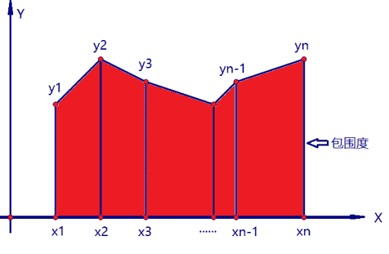

# 酷家乐 2020 校园招聘-图形图像 B 卷

## 1

在一棵二叉树上第 5 层的节点数最多是？

正确答案: C   你的答案: 空 (错误)

```cpp
8
```

```cpp
10
```

```cpp
16
```

```cpp
32
```

本题知识点

算法工程师 酷家乐 2020

## 2

有四个大小相同的球，分别为甲，乙，丙，丁。将甲和乙放在天平的一边，丙和丁在另一边，天平基本保持平衡。乙和丙调换，乙和丁较重。若一边是甲、丁，另一边是乙，则乙重。4 个球的重量由大到小为？

正确答案: C   你的答案: 空 (错误)

```cpp
甲，乙，丙，丁
```

```cpp
乙，丁，丙，甲
```

```cpp
乙，丙，丁，甲
```

```cpp
丙，丁，甲，乙
```

本题知识点

算法工程师 酷家乐 2020

## 3

下面哪种排序算法对数列 1, 2, 3, 5, 4 进行排序是最快的？

正确答案: B   你的答案: 空 (错误)

```cpp
快速排序
```

```cpp
冒泡排序
```

```cpp
堆排序
```

```cpp
归并排序
```

本题知识点

算法工程师 酷家乐 2020

## 4

1024 的阶乘，用二进制表示，末尾有多少个 0？

正确答案: C   你的答案: 空 (错误)

```cpp
1021
```

```cpp
1022
```

```cpp
1023
```

```cpp
1024
```

本题知识点

算法工程师 酷家乐 2020

## 5

以下哪种算子可用于计算图像水平方向上的梯度？

正确答案: A   你的答案: 空 (错误)

```cpp
1     0     -1
2     0    -2
1     0    -1
```

```cpp
1        1    1
1        -9    1
1        1    1
```

```cpp
1        1    1
0        0    0
-1    -1    -1
```

```cpp
0        1    2
-1    0    1
-2    -1    0
```

本题知识点

算法工程师 酷家乐 2020

## 6

 CNN 中某卷积层有 32 组 filter，卷积核大小为 7*7，stride=2，padding=0，该层输入为 63*63*16，请问输出的大小是？

正确答案: C   你的答案: 空 (错误)

```cpp
29*29*16
```

```cpp
16*16*32
```

```cpp
29*29*32
```

```cpp
16*16*16
```

本题知识点

算法工程师 酷家乐 2020

## 7

常见的三维空间剖分结构不包括

正确答案: A   你的答案: 空 (错误)

```cpp
四叉树
```

```cpp
KD Tree
```

```cpp
八叉树
```

```cpp
BSP Tree
```

本题知识点

算法工程师 酷家乐 2020

## 8

以下不是全局光照明方法的是

正确答案: D   你的答案: 空 (错误)

```cpp
Ray Tracing
```

```cpp
Photon Mapping
```

```cpp
Radiosity
```

```cpp
Ray Casting
```

本题知识点

算法工程师 酷家乐 2020

## 9

给出二维平面上的 n (n<=10000) 个点 (xi,yi) (i=1,2...n) (1<=xi<=100000, 1<=yi<=100000)，每个点的 xi 都是不一样的。按照 xi 的从小到大的顺序依次连接每个点，与 x 轴构成一个包围的区域，称为“包围度”，如下图红色区域。

如果你可以任意交换所有点的 y 值，请设计一种算法使“包围度”最大。请用文字或者伪代码描述你的算法，输出最大的“包围度”（注意算法的时空复杂度）。

你的答案

本题知识点

算法工程师 酷家乐 2020

## 10

在深度学习中，什么是欠拟合和过拟合，如何应对欠拟合和过拟合？

你的答案

本题知识点

算法工程师 酷家乐 2020

## 11

（本科生选答，研究生必答）

请设计一套墙体结构提取系统，能从普通的户型图（左图）生成墙体结构图（右图）。


要求：1\. 墙体结构图是二值化的图像；2\. 墙体结构图中只包含墙体信息，不包含家具等额外信息。

请注意，户型图配色不固定，图例只是一种可能的配色。

请详细介绍你设计的系统，及系统在实际应用中可能遇到的问题和解决方案。

你的答案

本题知识点

算法工程师 酷家乐 2020

## 12

请简要概述 Monte Carlo Path Tracing 算法，并使用伪代码描述。

你的答案

本题知识点

算法工程师 酷家乐 2020

## 13

（本科生选答，研究生必答）

实时渲染中，阴影生成是一个很重要的组成部分，请介绍聚光灯下阴影生成算法？

你的答案

本题知识点

算法工程师 酷家乐 2020