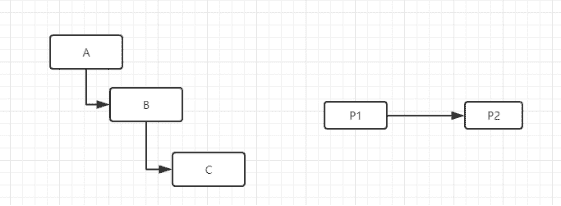

# 酷家乐 2020 校园招聘-图形渲染算法（EGS）B 卷

## 1

在一棵二叉树上第 5 层的节点数最多是

正确答案: C   你的答案: 空 (错误)

```cpp
8
```

```cpp
10
```

```cpp
16
```

```cpp
32
```

本题知识点

算法工程师 酷家乐 2020

## 2

有四个大小相同的球，分别为甲，乙，丙，丁。将甲和乙放在天平的一边，丙和丁在另一边，天平基本保持平衡。乙和丙调换，乙和丁较重。若一边是甲、丁，另一边是乙，则乙重。4 个球的重量由大到小为?

正确答案: C   你的答案: 空 (错误)

```cpp
甲，乙，丙，丁
```

```cpp
乙，丁，丙，甲
```

```cpp
乙，丙，丁，甲
```

```cpp
丙，丁，甲，乙
```

本题知识点

算法工程师 酷家乐 2020

## 3

下面哪种排序算法对数列 1, 2, 3, 5, 4 进行排序是最快的？

正确答案: B   你的答案: 空 (错误)

```cpp
快速排序
```

```cpp
冒泡排序
```

```cpp
堆排序
```

```cpp
归并排序
```

本题知识点

算法工程师 酷家乐 2020

## 4

1024 的阶乘，用二进制表示，末尾有多少个 0？

正确答案: C   你的答案: 空 (错误)

```cpp
1021
```

```cpp
1022
```

```cpp
1023
```

```cpp
1024
```

本题知识点

算法工程师 酷家乐 2020

## 5

二叉树先序序列 ABCDEFGH，中序序 BDCEAFGH，后序序列是？

正确答案: C   你的答案: 空 (错误)

```cpp
ABDGHCEF
```

```cpp
GDHBAECI
```

```cpp
DECBHGFA
```

```cpp
HGFEDCBA
```

本题知识点

算法工程师 酷家乐 2020

讨论

[12345677654321](https://www.nowcoder.com/profile/489984324)

为什么我做出来的答案是 C 啊

发表于 2020-04-01 01:23:34

* * *

## 6

常见的三维空间剖分结构不包括

正确答案: A   你的答案: 空 (错误)

```cpp
四叉树
```

```cpp
KD Tree
```

```cpp
八叉树
```

```cpp
BSP Tree
```

本题知识点

算法工程师 酷家乐 2020

## 7

以下不是全局光照明方法的是

正确答案: D   你的答案: 空 (错误)

```cpp
Ray Tracing
```

```cpp
Photon Mapping
```

```cpp
Radiosity
```

```cpp
Ray Casting
```

本题知识点

算法工程师 酷家乐 2020

## 8

以下哪些矩阵用于变换到屏幕空间？

正确答案: A B D   你的答案: 空 (错误)

```cpp
视口变换
```

```cpp
视图变换
```

```cpp
四元素变换
```

```cpp
模型变换
```

本题知识点

算法工程师 酷家乐 2020

## 9

给出二维平面上的 n (n<=10000) 个点 (xi,yi) (i=1,2...n) (1<=xi<=100000, 1<=yi<=100000)，每个点的 xi 都是不一样的。按照 xi 的从小到大的顺序依次连接每个点，与 x 轴构成一个包围的区域，称为“包围度”，如下图红色区域。

如果你可以任意交换所有点的 y 值，请设计一种算法使“包围度”最大。请用文字或者伪代码描述你的算法，输出最大的“包围度”（注意算法的时空复杂度）。

你的答案

本题知识点

算法工程师 酷家乐 2020

## 10

三维场景结构如下图所示：

A 是场景根节点，A、B、C 在模型坐标系下的矩阵是 MA、MB、MC，现在用鼠标在世界坐标系下把 C 对象从 P1 位置移动到 P2 位置，假设移动的矩阵是 T，求 C 对象现在的矩阵。

你的答案

本题知识点

算法工程师 酷家乐 2020

## 11

请简要概述 Monte Carlo Path Tracing 算法，并使用伪代码描述。

你的答案

本题知识点

算法工程师 酷家乐 2020