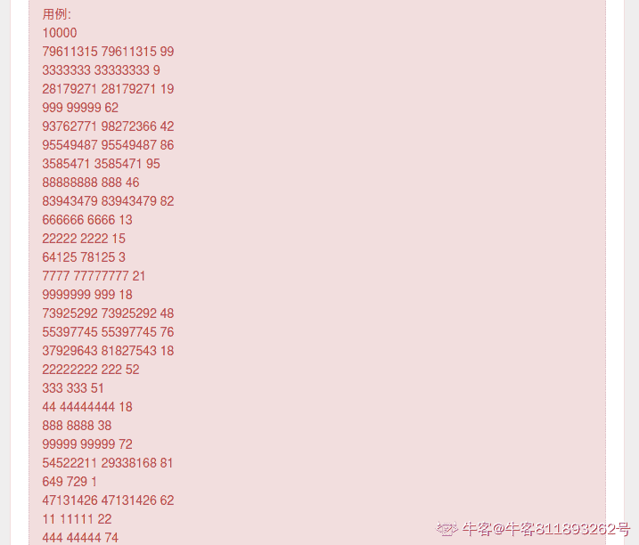

# 图森未来 2020 校招笔试卷（一）

## 1

小图（Tu）和小森（Simple）最近发现了一个有趣的游戏。

在游戏的一开始，小图和小森会分别获得一个初始数字 t 和 s，10 < t, s < 10⁹。之后，他们会从初始数字开始，不停地将自己数字的第一位移动到最后一位。例如，初始数字是 123 的时候，数字的变化是：123 -> 231 -> 312 -> 123 -> ...

在这之后，他们需要把每一个数字依次接到前一个数字**最高位的前面**，构成一列无限长的数字。例如，对于上面的例子，构成的数字是：

... 231123312231123312231123

假设小森拿到的数字是 31321，那么他构成的数字是：

... 1313221313321311321331321

接下来，他们会选择一个 k 值，并比较他们自己数字的后 k 位，较大的人会赢得最终的胜利。

小图和小森有他们进行的若干局游戏的记录，每局游戏都记录了 t、s 和 k 的值。他们希望知道，在这些游戏中，分别是谁获得了胜利？

本题知识点

Java 工程师 C++工程师 iOS 工程师 安卓工程师 运维工程师 前端工程师 算法工程师 PHP 工程师 测试工程师 安全工程师 c#工程师 大数据开发工程师 图森未来 2020

讨论

[牛客 811893262 号](https://www.nowcoder.com/profile/811893262)



```cpp
#include <bits/stdc++.h>

using namespace std;

void get_re(string& temp,string tmp, int k)
{
    temp = tmp;
    while (temp.size() < k)
    {
        tmp.push_back(tmp[0]);
        tmp.erase(tmp.begin());
        // const string tmp2 = tmp.substr(1, tmp.size() - 1);
        temp = tmp + temp;
    }
    temp=temp.substr(temp.size() - k, temp.size());
}

int main()
{
    int n;

    cin >> n;
    string t[n], s[n], k[n];
    for (int i = 0; i < n; ++i)
    {
        cin >> t[i] >> s[i] >> k[i];

        int ki = stoi(k[i]);
        string t_tmp;
        get_re(t_tmp,t[i], ki);
        string s_tmp;
        get_re(s_tmp,s[i], ki);
        if (t_tmp > s_tmp)
        {
            cout << "Tu" << endl;
        }
        else if (t_tmp < s_tmp)
        {
            cout << "Simple" << endl;
        }
        else
        {
            cout << "Draw" << endl;
        }
    }
    return 0;
}
```

代码应该是对的，运行超时。如上边截图，测试数据集很大

编辑于 2020-05-15 11:54:43

* * *

[肥肥的哈哈](https://www.nowcoder.com/profile/60080625)

#include <iostream>#include <algorithm>
#include <string>
using namespace std;
int getIndex(string &s, int k){
    int n = s.size();
    return ((((k - 1) / n) % n) + (n - k % n)) % n;
}
int gcd(int a, int b){
    while(b){
        int temp = a % b;
        a = b;
        b = temp;
    }
    return a;
}
int lcm(int a, int b){
    return a / gcd(a, b) * b;
}
int main(){
    int n;
    cin >> n;
    while (n--){
        string t, s; 
        int k;
        cin >> t >> s >> k;
        if (t == s){
            cout << "Draw" << endl;
            continue;
        }
        int flag = 0;
        int a = t.size();
        int b = s.size();
        int cnt = lcm(max(a,b) * max(a, b), min(a,b) * min(a,b));
        while (k && cnt--){
            int i = getIndex(t, k);
            int j = getIndex(s, k);
            if (t[i] > s[j]){
                flag = 1;
                break;
            }else if (t[i] < s[j]){
                flag = 2;
                break;  
            }else{
                --k;
            }
        }
        if (flag == 0){
            cout << "Draw" << endl;
        }else if (flag == 1){
            cout << "Tu" << endl;
        }else{
            cout << "Simple" << endl;
        }
    }
    return 0;
}

发表于 2021-10-17 12:15:04

* * *

[一只小大象](https://www.nowcoder.com/profile/871322677)

分为以下几种情况：1.判断是否为 AAA,BBB 类 2.判断是否为 ABC,ABC 两个输入相等 3.一般情况 class Solution:    def sol(self, sample):
        t,s,k = list(sample[0]), list(sample[1]), int(sample[2])

        t_same = all(w == t[0] for w in t)
        s_same = all(w == s[0] for w in s)

        if t_same and s_same:
            t = int(t[0])
            s = int(s[0])
            if t == s:
                return 'Draw'
            if t > s:
                return 'Tu'
            if t < s:
                return 'Simple'

        elif sample[0]==sample[1]:
            return 'Draw'

        else:
            t = self.snack(t)
            s = self.snack(s)
            long_t_v = self.str_to_num(t)
            long_s_v = self.str_to_num(s)
            num_t = int(k/len(str(long_t_v)))
            num_s = int(k/len(str(long_s_v)))

            for j in range(num_t):
                t += t
            for j in range(num_s):
                s += s

            t = self.str_to_num(t,k)
            s = self.str_to_num(s,k)
            if t == s:
                return 'Draw'
            if t > s:
                return 'Tu'
            if t < s:
                return 'Simple'

    def str_to_num(self,s,num=None):
        list = []
        if num == None:
            num = len(s)
        list += s[-num:]
        restlt = 0
        for i in range(num):
            w = int(list.pop(0))
            restlt = restlt*10+w
        return restlt

    def snack(self,string):
        longstr = []
        longstr = longstr+string
        for i in range(len(string)-1):
            w = string.pop(0)
            string.append(w)
            longstr = string + longstr
        return longstr

        # write code here

S = Solution()
num = int(input())
_samples=[]

for i in range(num):
    string = input()
    _s,_t,_k = [str(n) for n in string.split()]
    _samples.append([_s,_t,_k])

del _s,_t,_k

for _sample in _samples:
    dance = (S.sol(_sample))
    print(dance)

发表于 2020-07-12 22:16:10

* * *

## 2

图森未来的自动驾驶小卡车今天被派到了一个陌生的迷宫内部运输一些货物。

工程师小图已经提前拿到了这个迷宫的地图，地图是一个 n*m 的字符矩阵，上面包含四种不同的字符："."，"#"，"S"和"E"。其中"S"和"E"分别代表运货的起点和终点，"."为可行驶区域，"#"为不可行驶区域。每个可行驶区域都可以移动到上、下、左、右相邻的可行驶区域，且四种移动的距离都为 1。

为了估算运输的成本，小图希望你可以帮助他计算从起点到终点的最短行驶距离。

例如，对于下方的输入样例 1，从起点到终点有且仅有一条路径，路径的长度为 15（最开始卡车在 S 的位置，需要经过 15 次移动才能到达 E 的位置）。所以，最短行驶距离也为 15。
而输入样例 2，因为多出了一条直接从 S 到 E 的路径，所以最短行驶距离会减少到 7。

本题知识点

Java 工程师 C++工程师 iOS 工程师 安卓工程师 运维工程师 前端工程师 算法工程师 PHP 工程师 测试工程师 安全工程师 c#工程师 大数据开发工程师 图森未来 2020

讨论

[牛客 438614504 号](https://www.nowcoder.com/profile/438614504)

#include <iostream>#include<queue>
#include<vector>
#include<string>
using namespace std;
struct Node
{
    int x;
    int y;
    int step;
}S, E, node;

int row, colum;
int cx[] = { 0,0,-1,1 };
int cy[] = { 1,-1,0,0 };

bool judge(int x, int y, vector<vector<bool>> &visit, vector<vector<char>> &martix)
{
    if (x < 0 || x >= row || y < 0 || y >= colum)
    {
        return false;
    }

    if (visit[x][y] || martix[x][y] == '#')
    {
        return false;
    }

    return true;
}

//从起点 S 开始进行广度优先遍历(BFS) 
int BFS(vector<vector<bool>> &visit,vector<vector<char>> &martix)
{
    queue<Node> MyQueue;//辅助队列，用于存储遍历过程中遇到的点；
    S.step = 0;
    MyQueue.push(S);
    visit[S.x][S.y] = true;
    while (!MyQueue.empty())
    {
        Node top = MyQueue.front();
        MyQueue.pop();
        if (top.x == E.x && top.y == E.y)
        {
            return top.step;
        }

        for (int i = 0; i < 4; i++)
        {
            int tempx = top.x + cx[i];
            int tempy = top.y + cy[i];
            if (judge(tempx, tempy,visit,martix))
            {
                node.x = tempx;
                node.y = tempy;
                node.step = top.step + 1;
                MyQueue.push(node);
                visit[tempx][tempy] = true;
            }
        }
    }

    return -1;
}

void getmartix(vector<vector<char>> &martix)
{

    for (int i = 0; i < row; i++)
    {
        for (int j = 0; j < colum; j++)
        {
            cin >> martix[i][j];
            if (martix[i][j] == 'S')
            {
                S.x = i;
                S.y = j;
            }
            if (martix[i][j] == 'E')
            {
                E.x = i;
                E.y = j;
            }
        }
    }

}

int main()
{

    cin >> row >> colum;
    vector<vector<char>> martix(row, vector<char>(colum));
    vector<vector<bool>> visit(row, vector<bool>(colum));
    getmartix(martix);
    cout << BFS(visit,martix);
    return 0;
}

发表于 2021-04-26 14:06:28

* * *

[317102060740 王逸伦](https://www.nowcoder.com/profile/6926405)

```cpp
#include<iostream>
#include<string>
using namespace std;
bool vis[1000][1000];
int n,m;
string maze[1000];
int ans=100000;
int dir[4][2]={{1,0},{0,1},{-1,0},{0,-1}};
bool in(int x,int y){
    return x>=0&&x<n&&y>=0&&y<m;
}
void dfs(int x,int y,int step){
     vis[x][y]=1;
    if(maze[x][y]=='E'){
        if(step<ans){
            ans=step;
        }
    }
    for(int i=0;i<4;i++){
        int tx=x+dir[i][0];
        int ty=y+dir[i][1];
        if(in(tx,ty)&&maze[tx][ty]!='#'&&!vis[tx][ty]){
            dfs(tx,ty,step+1);
        }
    }
    vis[x][y]=0;
}
int main(){
    cin>>n>>m;
    for(int i=0;i<n;i++){
        cin>>maze[i];
    }
    int x,y;
    for(int i=0;i<n;i++){
        for(int j=0;j<m;j++){
            if(maze[i][j]=='S'){
                x=i,y=j;
            }
        }
    }
    dfs(x,y,0);
    cout<<ans;
    return 0;
}
```

发表于 2019-12-12 19:55:04

* * *

## 3

小森最近在工作上遇到了一些麻烦，他需要在许多矩阵上计算卷积的结果，希望你能够帮助他写一个程序简化计算。小森已经将他要计算的卷积处理成了如下的简化形式，以便即使不了解卷积的人也可以进行计算：给出一个 n*m 的矩阵 A 和一个 3*3 的矩阵 B，A 和 B 的计算结果是一个(n-2)*(m-2)的矩阵 C，满足：
请按照以上公式，根据给出的矩阵 A 和 B 计算出矩阵 C。

本题知识点

Java 工程师 C++工程师 iOS 工程师 安卓工程师 运维工程师 前端工程师 算法工程师 PHP 工程师 测试工程师 安全工程师 c#工程师 大数据开发工程师 图森未来 2020

讨论

[是梦扰了她](https://www.nowcoder.com/profile/591888895)

```cpp
#include <iostream>
using namespace std;
int main()
{
    int n,m;
    cin>>n>>m;
    int matrix[n][m];
    for(int i=0;i<n;i++)
    {
        for(int j=0;j<m;j++)
        {
            cin>>matrix[i][j];
        }
    }
    int kernl[3][3];
    for(int i=0;i<3;i++)
    {
        for(int j=0;j<3;j++)
        {
            cin>>kernl[i][j];
        }
    }
    for(int i=0;i<n-2;i++)
    {
        for(int j=0;j<m-2;j++)
        {
            int res=0;
            for(int k=0;k<=2;k++)
            {
                for(int l=0;l<=2;l++)
                {
                    res+=matrix[i+k][j+l]*kernl[k][l];
                }
            }
        cout<<res<<" ";
        }
        cout<<endl;
    }
    return 0;
 }
```

发表于 2020-03-18 11:00:39

* * *</iostream></iostream>