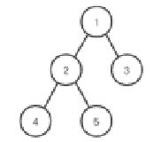

# 哔哩哔哩 2020 校园招聘 iOS 方向笔试卷（一）

## 1

在一棵二叉树上，第 5 层最多拥有多少个结点

正确答案: D   你的答案: 空 (错误)

```cpp
8
```

```cpp
32
```

```cpp
10
```

```cpp
16
```

本题知识点

安卓工程师 哔哩哔哩 iOS 工程师 2020

讨论

[牛客 612151804 号](https://www.nowcoder.com/profile/612151804)

第 i 层最多有 2（i-1）次方个节点 2(5-1)次方=16

发表于 2020-09-03 21:24:20

* * *

## 2

对于以下二叉树，哪个是不可能遍历出的结果

正确答案: C   你的答案: 空 (错误)

```cpp
42513
```

```cpp
12453
```

```cpp
45213
```

```cpp
13254
```

本题知识点

安卓工程师 哔哩哔哩 iOS 工程师 2020

## 3

12345 五个数字入栈的顺序一定是从前往后的，出栈的时机不确定，以下哪个是不可能的出栈顺序

正确答案: B   你的答案: 空 (错误)

```cpp
54321
```

```cpp
43512
```

```cpp
43251
```

```cpp
12345
```

本题知识点

安卓工程师 哔哩哔哩 iOS 工程师 2020

讨论

[牛客 669521889 号](https://www.nowcoder.com/profile/669521889)

B 应该是 43521

发表于 2021-09-08 16:41:02

* * *

[一万只煎饺](https://www.nowcoder.com/profile/816755493)

出栈顺序先进后出 A 就是依次入栈出栈；C 就是 1234 入，432 出，5 入，5 出，1 出，因为 1 最先入，和 5 相比的话是最后出；D 就是单个入单个就出，所以出入栈顺序一致；B 就是 1234 入，43 出，5 入，5 出，21 出，所以顺序应该是 43521 才对，B 错了。

发表于 2021-09-07 21:09:40

* * *

## 4

n 层的二叉树，最少拥有多少个结点

正确答案: A   你的答案: 空 (错误)

```cpp
n
```

```cpp
2 的 n 次方减 1
```

```cpp
2n
```

```cpp
2 的 n 减一次方
```

本题知识点

安卓工程师 哔哩哔哩 iOS 工程师 2020

讨论

[Wayne_Sun](https://www.nowcoder.com/profile/975854345)

？

发表于 2020-03-25 11:54:47

* * *

## 5

就平均性能而言，下列排序算法中哪种排序最快？

正确答案: D   你的答案: 空 (错误)

```cpp
希尔
```

```cpp
冒泡
```

```cpp
交换
```

```cpp
快速
```

本题知识点

安卓工程师 哔哩哔哩 iOS 工程师 2020

## 6

表序列为 (b c d e f g q r s)， 则在二分法查找关键字 b 的过程中，先后进行比较的关键字依次是

正确答案: B   你的答案: 空 (错误)

```cpp
f c b
```

```cpp
f d b
```

```cpp
g c b
```

```cpp
g d b
```

本题知识点

安卓工程师 哔哩哔哩 iOS 工程师 2020

讨论

[TimberChi](https://www.nowcoder.com/profile/6407439)

……答案对吗……答案要是 b 的话，比较 d 时向上取整，比较 b 时又向下取整，不太对吧……

发表于 2020-02-06 11:49:58

* * *

## 7

以下哪种语言移植性最好？

正确答案: C   你的答案: 空 (错误)

```cpp
机器语言
```

```cpp
汇编语言
```

```cpp
高级语言
```

```cpp
自然语言
```

本题知识点

安卓工程师 哔哩哔哩 iOS 工程师 2020

## 8

以下哪条 SQL 语句可以删除数据库中的表 table？

正确答案: C   你的答案: 空 (错误)

```cpp
DELETE TABLE table
```

```cpp
DELETE table
```

```cpp
DROP TABLE table
```

```cpp
DROP table
```

本题知识点

安卓工程师 哔哩哔哩 iOS 工程师 2020

讨论

[zhenchaochaochao](https://www.nowcoder.com/profile/779483920)

DELETE 用于删除表中的行 语法： DELETE FROM “table name” WHERE "condition"DROP 用于删除表                语法： DROP TABLE "table name"TRUNCATE 用于删除表中的数据  语法： TRUNCATE TABLE "table name"

发表于 2019-11-25 06:00:48

* * *

## 9

以下关于操作系统说法错误的是？

正确答案: C   你的答案: 空 (错误)

```cpp
操作系统提供了编程接口和命令接口
```

```cpp
系统调用是通过中断来实现的，当发生系统调用，处理器会从用户态变为内核态
```

```cpp
微内核操作系统提供消息机制，比整体内核执行效率高
```

```cpp
操作系统不关心高级语言的编译器实现
```

本题知识点

安卓工程师 哔哩哔哩 iOS 工程师 2020 C++工程师 牛客

## 10

IPv4 的地址长度是 ____ 位。

正确答案: B   你的答案: 空 (错误)

```cpp
16
```

```cpp
32
```

```cpp
64
```

```cpp
128
```

本题知识点

安卓工程师 哔哩哔哩 iOS 工程师 2020

## 11

以下哪个关于 iOS 操作系统的描述是错误的？

正确答案: A   你的答案: 空 (错误)

```cpp
iOS 是单任务操作系统
```

```cpp
iOS 提供了多种用于应用间共享数据的能力
```

```cpp
iOS 提供了完整的应用程序生命周期相关的 API
```

```cpp
iOS 应用程序通过 App Store 发布前需要经过审核
```

本题知识点

iOS 工程师 哔哩哔哩 2020

## 12

以下哪个关键字用于声明协议？

正确答案: C   你的答案: 空 (错误)

```cpp
@interface
```

```cpp
@implementation
```

```cpp
@protocol
```

```cpp
@property
```

本题知识点

iOS 工程师 哔哩哔哩 2020

## 13

以下哪个选项用于模态视图呈现样式列表中？

正确答案: D   你的答案: 空 (错误)

```cpp
UIModalTransitionStyleCoverVertical
```

```cpp
UIModalTransitionStyleFlipHorizontal
```

```cpp
UIModalTransitionStyleCrossDissolve
```

```cpp
UIModalPresentationNone
```

本题知识点

iOS 工程师 哔哩哔哩 2020

## 14

以下哪段代码能正常运行？

正确答案: C   你的答案: 空 (错误)

```cpp
NSArray *array = @[1，2，3]; NSNumber * number=array[3];
```

```cpp
NSDictionary *dict = @{@"key":nil};
```

```cpp
NSString *str = nil; NSString *str2 = [str substringFromIndex:3];
```

```cpp
NSString *str = @"hi"; NSString *str2 = [str substringFromIndex:3];
```

本题知识点

iOS 工程师 哔哩哔哩 2020

## 15

以下哪种技术不能用于 iOS 应用程序的数据持久化？

正确答案: C   你的答案: 空 (错误)

```cpp
JSON
```

```cpp
XML
```

```cpp
DLL
```

```cpp
Protocol Buffers
```

本题知识点

iOS 工程师 哔哩哔哩 2020

## 16

目前的主流 PC 设备上，对 500 万个随机整数数组进行排序，需要花费的 CPU 时间量级是

正确答案: B   你的答案: 空 (错误)

```cpp
0.01 秒
```

```cpp
1 秒
```

```cpp
100 秒
```

```cpp
10 天
```

本题知识点

安卓工程师 哔哩哔哩 iOS 工程师 2020

## 17

C 语言中，在语句 if (/* condition */) 的条件表达式中，下列条件会被当作真的是

正确答案: B   你的答案: 空 (错误)

```cpp
(int)0
```

```cpp
(int)-1
```

```cpp
*(const char *)" "
```

```cpp
(void *)NULL
```

本题知识点

安卓工程师 哔哩哔哩 iOS 工程师 2020

## 18

C 语言中，对于 8 位有符号整数类型 int8_t，其有效取值范围是

正确答案: A   你的答案: 空 (错误)

```cpp
[-128, 127]
```

```cpp
[-128, 128]
```

```cpp
[-256, 255]
```

```cpp
[-255, 256]
```

本题知识点

安卓工程师 哔哩哔哩 iOS 工程师 2020

## 19

C 语言中，对于多位数组 int a[2][3]，下列表达式中，与 a[1][2] 等价的是

正确答案: D   你的答案: 空 (错误)

```cpp
*(a + 5)
```

```cpp
*(*(a + 3) + 2))
```

```cpp
*(a[3] + 2)
```

```cpp
*(a[1] +2 )
```

本题知识点

安卓工程师 哔哩哔哩 iOS 工程师 2020

## 20

C 语言中，对于无符号整数 n，下列表达式不能用来确定 n 为偶数的是

正确答案: C   你的答案: 空 (错误)

```cpp
n % 2 == 0
```

```cpp
n & 0x1 == 0
```

```cpp
n | 0x1 == n
```

```cpp
n / 2 * 2 == n
```

本题知识点

安卓工程师 哔哩哔哩 iOS 工程师 2020

讨论

[Honokia](https://www.nowcoder.com/profile/157722496)

难道不需要加括号吗

发表于 2021-08-25 00:21:43

* * *

## 21

C 语言中，声明语句 int (*pf)(); 定义了什么

正确答案: D   你的答案: 空 (错误)

```cpp
定义了一个指向 int 类型变量的指针
```

```cpp
定义了一个指向 int 数组的指针
```

```cpp
定义了一个返回值为 int 的函数
```

```cpp
定义了一个指向返回值类型为 int 的函数的函数指针
```

本题知识点

安卓工程师 哔哩哔哩 iOS 工程师 2020

## 22

C 语言中，下面程序的输出结果为

```cpp
#include <stdio.h>
char *get_slogan() {
  char str[512];
  strcpy(str, "bilibili cheers");
  return str;
}
int main() {
  printf("%s", get_slogan());
  return 0;
}
```

正确答案: C   你的答案: 空 (错误)

```cpp
程序不会崩溃，并且会输出 bilibili cheers
```

```cpp
程序不会崩溃，但也不会输出任何字符
```

```cpp
程序可能输出任意字符串，也可能崩溃
```

```cpp
程序一定会崩溃
```

本题知识点

安卓工程师 哔哩哔哩 iOS 工程师 2020

## 23

C 语言中，下面程序的输出结果为

```cpp
#include <stdio.h>
int fib(int n) {
  if (n == 0 || n == 1) return 1;
  return fib(n - 1) + fib(n - 2);
}
int main() {
  printf("%d", fib(8));
  return 0;
}
```

正确答案: C   你的答案: 空 (错误)

```cpp
1
```

```cpp
21
```

```cpp
34
```

```cpp
程序永远无法结束
```

本题知识点

安卓工程师 哔哩哔哩 iOS 工程师 2020

讨论

[芋頃](https://www.nowcoder.com/profile/270196056)

一个数列，第一项和第二项是 1，从第三项起，每一项是前两项的和，叫费波拉契数列，1，1，2，3，5，8，13，21，34，题中要求的就是第九项

发表于 2020-02-23 22:17:09

* * *

[fengtangfaye](https://www.nowcoder.com/profile/402663234)

只有我一个人算到 34 了吗，我怎么算都是 34

发表于 2019-12-21 20:44:45

* * *

[〽](https://www.nowcoder.com/profile/965405644)

f(7)+f(6) f(6)+f(5) ： f(2)+f(1) 此时 f (1)=1 f(1)+f(0) 此时 f(2)=f(1)+f(0)=1+1=2 以此向上推 f(8)=f(7)+f(6)=34

发表于 2020-03-30 21:30:59

* * *

## 24

C++ 语言中，下列说法错误的是

正确答案: A   你的答案: 空 (错误)

```cpp
不应在类的构造函数中若抛出异常（防止产生未完全构造的对象），构造函数中任何未捕获的异常均会终结程序
```

```cpp
如果需要自定义类的析构函数来管理资源，我们往往也需要自定义该类的复制构造函数以及赋值运算符
```

```cpp
不建议在构造函数和析构函数中调用虚函数，因为此时对象可能不完整，无法多态地调用原本类型中定义的虚函数
```

```cpp
即使一个用户自定义类型 T，未定义任何成员 class T {}，为了保证能获得实例的内存地址 sizeof(T) 也不会为 0
```

本题知识点

安卓工程师 哔哩哔哩 iOS 工程师 2020

## 25

C++ 语言中，对于自定义类 T，可以使用 STL 容器 std::set<t>的前提是

正确答案: C   你的答案: 空 (错误)

```cpp
自定义类型 T 必须存在无参数的构造函数
```

```cpp
自定义类型 T 是平凡的，可二进制直接复制的 (POD 类型)
```

```cpp
自定义类型 T 之间的大小关系有良定义 (如重载了 < 运算符)
```

```cpp
自定义类型 `T` 的哈希值有良定义 (定义了 `std::hash<T>`)
```

本题知识点

安卓工程师 哔哩哔哩 iOS 工程师 2020

## 26

C++ 语言中，下面程序的输出结果为

```cpp
#include <iostream>
struct B {
  virtual int foo() { return 0; }
  int bar() { return 0; }
};
struct D : B {
  int foo() override { return 1; }
  int bar() { return 1; }
};
int main() {
  int result = 0;
  B obj1 = D();
  D obj2 = D();
  B *obj3 = &obj2;
  B &obj4 = obj2;
  result += obj1.foo() + obj1.bar();
  result += obj3->foo() + obj3->bar();
  result += obj4.foo() + obj4.bar();

  std::cout << result << std::endl;
  return 0;
}
```

正确答案: A   你的答案: 空 (错误)

```cpp
2
```

```cpp
3
```

```cpp
4
```

```cpp
6
```

本题知识点

安卓工程师 哔哩哔哩 iOS 工程师 2020

## 27

定义 3 个变量 double a ; unsigned int b ; long c ; 则表达式 a + b + c 的值的类型是？

正确答案: D   你的答案: 空 (错误)

```cpp
long
```

```cpp
unsigned long
```

```cpp
unsigned int
```

```cpp
double
```

本题知识点

安卓工程师 哔哩哔哩 iOS 工程师 2020

## 28

默认的 class 成员的访问级别是

正确答案: B   你的答案: 空 (错误)

```cpp
public
```

```cpp
private
```

```cpp
protected
```

```cpp
其他都不是
```

本题知识点

安卓工程师 哔哩哔哩 iOS 工程师 2020

## 29

exception 是 ( )

正确答案: A   你的答案: 空 (错误)

```cpp
运行时错误
```

```cpp
编译时错误
```

```cpp
逻辑错误
```

```cpp
其他都不是
```

本题知识点

安卓工程师 哔哩哔哩 iOS 工程师 2020

## 30

以下程序的输出结果是

```cpp
#include<stdio.h>
void main() {
  int i;
  float a = 5.2;
  char *ptr;
  ptr = (char *)&a;
  for (i = 0; i <= 3; i++)
    printf(“%d “, *ptr++);
}
```

正确答案: D   你的答案: 空 (错误)

```cpp
0 0 0 0
```

```cpp
-102 56 80 32
```

```cpp
131 102 -90 60
```

```cpp
其他都不是
```

本题知识点

安卓工程师 哔哩哔哩 iOS 工程师 2020

## 31

给定字串 A 和字符集 B，求在 A 中包含了 B 所有字符的最小子串

本题知识点

安卓工程师 哔哩哔哩 iOS 工程师 测试工程师 测试开发工程师 2020

讨论

[没有 offer 的大咸鱼](https://www.nowcoder.com/profile/6826169)

```cpp
import collections
s = input()
t = input()
size = len(t) #目标字符串的大小
dic = collections.Counter(t)
length = float('inf')
start, end = 0, 0
head = 0
while end < len(s):
    if dic[s[end]] > 0: #命中目标函数字符
        size -=1 
    dic[s[end]] -=1
    end +=1 #滑动右边边界，扩大窗口
    while size == 0:  #全部命中，符合条件
        if end - start < length:
            length = end -start
            head = start

        dic[s[start]] +=1 #滑动左边边界，缩小窗口
        if dic[s[start]] > 0: #为目标函数中的字母
            size += 1
        start +=1

print("#") if length == float('inf') else print(s[head: head + length])
```

发表于 2019-12-19 22:07:00

* * *

[大脸猫要开心鸭](https://www.nowcoder.com/profile/522637757)

```cpp
str1 = input()
str2 = input()
ans = []

for i in range(len(str2), len(str1)):
    for j in range(len(str1)):
        count = 0
        des_str = str1[j:j+i]
        for s in str2:
            if s in des_str:
                count += 1
            else:
                break
        if count == len(str2):
            ans.append(des_str)
if str1 == str2:
    print(str2)
elif len(ans) != 0:
    print(ans[0])
else:
    print("#")
```

发表于 2020-08-13 00:01:44

* * *

[rjchern](https://www.nowcoder.com/profile/3498767)

```cpp
import java.util.*;

public class Main{
    public static void main(String[] args) {
        Scanner sc = new Scanner(System.in);
        String str = sc.next(); // 字符串
        String ref = sc.next(); // 字符集
        System.out.println(helper(str, ref));
    }

    static String helper(String str, String ref) {
        String res = "#";
        int n = ref.length();
        HashSet<Character> s = new HashSet<>();
        for (int i = 0; i < ref.length(); i++)
            s.add(ref.charAt(i));

        for(int i = 0; i < str.length(); i++){ // 扫描给定字符串
            if(!s.contains(str.charAt(i))) continue;
            // str[i]与 ref 的某个字符匹配上了
            HashSet<Character> visited = new HashSet<>();
            for(int j = i; j < str.length(); j++){
                if(s.contains(str.charAt(j)) && !visited.contains(str.charAt(j))){
                    visited.add(str.charAt(j));
                    if(visited.size() == n){
                        if(res.equals("#")) res = str.substring(i, j + 1);
                        else res = j - i + 1 < res.length() ? str.substring(i, j + 1) : res;
                    }
                }
            }
        }
        return res;
    }
}
```

发表于 2020-08-25 14:52:58

* * *

## 32

大数指超过 int64_t 可承载范围的数字

本题知识点

安卓工程师 哔哩哔哩 iOS 工程师 测试工程师 测试开发工程师 2020

讨论

[skyyi](https://www.nowcoder.com/profile/2384102)

```cpp
/**
 * 两个大数相乘
 */
public class Main {
    public static void main(String[] args){
        Scanner sc = new Scanner(System.in);
        BigInteger num1 = new BigInteger(sc.nextLine());
        BigInteger num2 = new BigInteger(sc.nextLine());
        BigInteger result = num1.multiply(num2);
        System.out.println(result);
    }
}

```

发表于 2020-07-03 11:36:27

* * *

[渣渣辉 20180813164197](https://www.nowcoder.com/profile/96390950)

```cpp
#include<iostream>
#include<string>
#include<algorithm>
using namespace std;

int main(){
    string num1, num2;
    cin>>num1>>num2;
    reverse(num1.begin(),num1.end());
    reverse(num2.begin(),num2.end());
    // cout<<num1.length()+num2.length();
    int *num = new int[num1.length()+num2.length()];
    for(int i=0;i<(num1.length()+num2.length());i++)
        num[i]=0;
    int carry = 0;
    int ind = 0;
    for(int i=0; i<num1.length(); i++){
        for(int j=0; j<num2.length(); j++){
            num[j+i] = (num1[i]-'0') * (num2[j]-'0') + num[j+i];
            for(int k=j+i;k<i+j+2;k++){
                if(num[k]>=10){
                    carry = num[k]/10;
                    num[k] = num[k]%10;
                    num[k+1] = carry + num[k+1];
                    if(k+1>ind)
                        ind=k+1;
                }
            }
            if(i+j>ind)
               ind=i+j;
        }
    }
    for(int i=ind;i>=0;i--)
        cout<<num[i];
    system("pause");
    return 0;
}

```

 编辑于 2020-08-25 11:36:08

* * *

[Fannia](https://www.nowcoder.com/profile/536797874)

```cpp
思路: 按照人工算数的逻辑进行推算
多位大数相乘 拆分为 多位大数与一位数相乘, 不补上 0, 得出的结果相加
因此需要添加两个辅助函数
两位大数相加 Add
大数乘一位数 Multi

// 大数相加 92233720 + 3422337 > 95656057
function Add(n1, n2) {
  if (n2 == '0') {
    return n1;
  }
  if (n1 == '0') {
    return n2;
  }
  let res = [];
  let last = 0;
  let long = n1, short = n2;
  if (n2.length > n1.length) {
    long = n2;
    short = n1;
  }
  long = long.split('').reverse().join('');
  short = short.split('').reverse().join('');
  for (let i = 0; i <= long.length - 1; i++) {
    const sum = last + parseInt(long[i]) + parseInt(short[i] || 0);
    res.unshift(sum % 10); // 个位数
    last = Math.floor(sum / 10); // 十位数
  }
  if (last) {
    res.unshift(last);
  }
  // console.log('Add', n1, '+', n2, '=', res.join(''));
  return res.join('');
}

// n2 是长度为 1 的数 9223372024429430685 * 3
function Multi(n1, n2) {
  if (n1 == '0' || n2 == '0') {
    return '0';
  }
  if (n2 == '1') {
    return n1;
  }
  if (n1 == '1') {
    return n2;
  }
  let res = [];
  let last = 0;
  for(let i = n1.length - 1; i >= 0; i--) {
    const mul = n1[i] * n2 + last;
    res.unshift(mul % 10); // 个位数
    last = Math.floor(mul/10); // 十位数
  }
  if (last) {
    res.unshift(last);
  }
  // console.log('Multi', n1, '*', n2, '=', res.join(''));
  return res.join('');
}

function BigNum(n1, n2) {
  if (n1 == '0' || n2 == '0') {
    return '0';
  }
  if (n2 == '1') {
    return n1;
  }
  if (n1 == '1') {
    return n2;
  }
  let res = '0';
  for(let i = 0; i < n2.length; i++) {
    res = Add(res, Multi(n1, n2[i]) + (new Array(n2.length - 1 - i).fill(0).join('')))
  }
  return res;
}

let line;
let lines = [];
while (line = readline()) {
  lines.push(line);
}
const [n1, n2] = lines;
print(BigNum(n1, n2));

```

发表于 2020-02-12 12:02:09

* * *

## 33

 给定一个字符串 S，如果 S 满足以下要求中的任意一个则返回 true，否则返回 false:
1\. 全部都是大写字母，比如 "BILIBILI"
2\. 全部都是小写字母，比如 "bilibili"
3\. 首字母大写，比如 "Bilibili"

本题知识点

安卓工程师 哔哩哔哩 iOS 工程师 测试工程师 测试开发工程师 2020

讨论

[牛客 436063922 号](https://www.nowcoder.com/profile/436063922)

```cpp
num = input() if num.islower() or num.isupper() or num.istitle(): print('true') else: print('false') 
```

用 python 更简单吧

发表于 2020-07-27 15:38:23

* * *

[牛客 967181795 号](https://www.nowcoder.com/profile/967181795)

正则表达式

```cpp
import java.io.BufferedReader;
import java.io.InputStreamReader;
import java.io.IOException;
public class Main{
  public static void main(String args[]) throws IOException{
    BufferedReader br=new BufferedReader(new InputStreamReader(System.in));
    String str=null;
    while((str=br.readLine())!=null){
      if(str.matches("[a-z]+")||str.matches("[A-Z]+")||str.matches("^[A-Z][a-z]+")){
        System.out.println("true");
      }else{
        System.out.println("false");
      }
    }
  }
}
```

发表于 2020-08-19 10:22:56

* * *

[折纸鹤](https://www.nowcoder.com/profile/5822083)

```cpp
import java.util.Scanner;

public class Main {
    public static void main(String[] args) {
        Scanner sc = new Scanner(System.in);
        String input = sc.nextLine();
        Boolean flag1=true;//全大写判定
        Boolean flag2=true;//全小写判定
        Boolean flag3=true;//首字母大写判定
        if (input.charAt(0) < 'A' || input.charAt(0) > 'Z') {
            flag3=false;
        }
        for (int i = 0; i < input.length(); i++) {
            char c = input.charAt(i);
            if (c < 'A' || c > 'Z') {//小写
                flag1 = false;
            } else {//大写
                flag2=false;
                if (i>0)flag3=false;
            }
            if (!(flag1 || flag2 || flag3)) {
                System.out.println(false);
                return;
            }
        }
        System.out.println(true);

    }
}

```

发表于 2020-08-13 16:15:26

* * *</t>