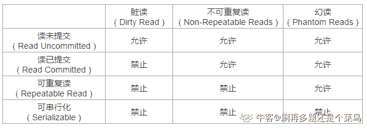
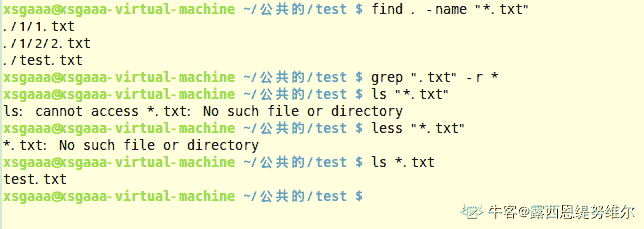

# 哔哩哔哩 2020 校园招聘后端笔试卷（一）

## 1

在 Java 中下面哪个对类的声明是错误的？

正确答案: C   你的答案: 空 (错误)

```cpp
public class MyClass{}
```

```cpp
class MyClass extends MySuperClass implements YourInterface {}
```

```cpp
class MyClass extends MySuperClass1, MySupperClass2 {}
```

```cpp
abstract class MyClass implements YourInterface1, Youriterface2 {}
```

本题知识点

Java 工程师 C++工程师 哔哩哔哩 2020

讨论

[爱吃蘑菇的麒麟](https://www.nowcoder.com/profile/7034395)

答案 C. Java 是 单继承，多接口

发表于 2019-11-29 18:39:13

* * *

[是瑶瑶公主呀](https://www.nowcoder.com/profile/592649258)

Java 中不允许多继承，最多继承一个类，所以 C 错。

发表于 2019-11-23 23:19:31

* * *

[我是复读机](https://www.nowcoder.com/profile/162099353)

针对 D 选项来说一嘴。implements 必须实现接口中所有的方法，但是这并不妨碍 MyClass 是一个抽象类。MyClass 中可以额外定义一些抽象方法，甚至压根就没有抽象方法，也能直接声明成 abstract 类！所以，D 选项的声明是正确的。

发表于 2020-10-23 10:20:21

* * *

## 2

以下哪个选项不是单例模式的优点？

正确答案: D   你的答案: 空 (错误)

```cpp
减少内存开支
```

```cpp
减少系统调用
```

```cpp
避免资源的多重占用
```

```cpp
线程安全
```

本题知识点

Java 工程师 C++工程师 哔哩哔哩 2020

讨论

[是瑶瑶公主呀](https://www.nowcoder.com/profile/592649258)

单例中的懒汉模式存在线程安全问题，属于延迟加载，在需要时才创建对象，不安全。单例的饿汉模式是安全的。

发表于 2019-11-23 23:21:40

* * *

[掌心里的小雨](https://www.nowcoder.com/profile/86073671)

*   单例模式定义：单例模式确保其某**一个类只有一个实例**，而且自行实例化并向整个系统提供这个实例，这个类称为单例类；

*   单例模式的特点：

    *   单例类只能有一个实例。
    *   单例类必须自己创建自己的唯一实例。
    *   单例类必须给所有其他对象提供这一实例。
*   单例模式实现方式：

    *   **饿汉式（线程安全）**：顾名思义，饿汉式，就是使用类的时候**不管用的是不是类中的单例部分，都直接创建出单例类**，线程不安全问题主要是由于对象被实例化多次，采取直接实例化对象的方式就不会产生线程不安全问题。但是直接实例化的方式也丢失了延迟实例化带来的节约资源的好处。

    *   **懒汉式（线程不安全）**：顾名思义，这个人比较懒，只有当单例类用到的时候才会去创建这个单例类

        ```cpp
        public class LazySingleton
        {
        private static LazySingleton instance = null;

        private LazySingleton()
        {

        }

        public static LazySingleton getInstance()
        {
          if (instance == null)
              instance = new LazySingleton();
          return instance;
        }
        }
        ```

        > 这是一种线程非安全的写法,线程 A 初次调用`getInstance()`方法，代码走到第 12 行，线程此时切换到线程 B，线程 B 走到 12 行，看到 instance 是 null，就 new 了一个 LazySingleton 出来，这时切换回线程 A，线程 A 继续走，也 new 了一个 LazySingleton 出来。这样，单例类 LazySingleton 在内存中就有两份引用了，这就违背了单例模式的本意了

*   单例模式的好处

    *   1、控制资源的使用，通过线程同步来控制资源的并发访问

    *   2、控制实例的产生，以达到节约资源的目的

    *   3、控制数据的共享，在不建立直接关联的条件下，让多个不相关的进程或线程之间实现通信

发表于 2020-08-14 13:25:42

* * *

[牛客 926775315 号](https://www.nowcoder.com/profile/926775315)

三长一短选最短

发表于 2019-12-05 10:04:34

* * *

## 3

某台计算机连接了 8 个相同的设备，有 N 个进程在竞争使用，每个进程最多会同时占用 3 个设备，请问当 N 大于等于多少时，系统可能发生死锁？

正确答案: C   你的答案: 空 (错误)

```cpp
2
```

```cpp
3
```

```cpp
4
```

```cpp
5
```

本题知识点

Java 工程师 C++工程师 哔哩哔哩 操作系统 2020

讨论

[UMA201908211309710](https://www.nowcoder.com/profile/341876954)

每个进程 3 台，不会产生死锁；对于三个进程，可以有两个进程分别获得 3 台，使其执行完释放后让第三个进程获得 3 台，所以也不会产生死锁；对于四个进程，假若每个进程各获得 2 台而同时需要另外一台，产生了死锁，所以产生死锁的最小值是 4。
类似题型(1)：假设现在有 P 个进程，每个进程最多需要 m 个资源，并且有 r 个资源可用。什么样的条件可以保证死锁不会发生
解：如果一个进程有 m 个资源它就能够结束，不会使自己陷入死锁中。因此最差情况是每个进程有 m-1 个资源并且需要另外一个资源。如果留下有一个资源可用，那么其中某个进程就能够结束并释放它的所有资源．使其它进程也能够结束。所以避免死锁的条件是：
r≥p(m-1)+1。
由此条件解上题：r=8，m=3，带入公式得：2p≤7。即当 P 小于等于 3 时才可保证死锁不会发生，所以可能会产生死锁的最小值是 4。
类似题型(2)：某系统中有 3 个并发进程，都需要同类资源 4 个，试问该系统不会发生死锁的最少资源数是多少
解：带入上述条件公式：r≥3*(4-1)+1=10。所以答案为 10 个。   来源：[`wenku.baidu.com/view/af762dca27fff705cc1755270722192e4536583e.html`](https://wenku.baidu.com/view/af762dca27fff705cc1755270722192e4536583e.html)

发表于 2019-11-24 12:19:54

* * *

[牛客 933495161 号](https://www.nowcoder.com/profile/933495161)

死锁问题：设备 m=3，进程 p，资源 r=8;

solution:p•(m-1)+1>r; p=4;

编辑于 2020-05-26 05:27:00

* * *

[不会骗你的 s](https://www.nowcoder.com/profile/558161)

三个的时候，不满足死锁的循环等待条件，最坏的情况就是无限等待前两个进程释放设备。

四个的时候，两个进程各占有三个，另外两个进城各占有两个设备，现在所有进程都不释放设备，那么后两个进程就互相等待对方释放设备，满足循环等待的条件，形成死锁。

发表于 2020-12-02 13:51:07

* * *

## 4

以下哪种操作不会导致计算机从用户态切换至内核态？

正确答案: B   你的答案: 空 (错误)

```cpp
访问内存时出现缺页异常
```

```cpp
对一个变量进行取模运算
```

```cpp
创建一个子进程
```

```cpp
读取硬盘中文件的内容
```

本题知识点

Java 工程师 C++工程师 哔哩哔哩 2020

讨论

[UMA201908211309710](https://www.nowcoder.com/profile/341876954)

用户态切换到内核态的三种方式：1\. 系统调用 2\. 异常 3\. 外围设备中断

发表于 2019-11-24 12:21:35

* * *

[qiao_](https://www.nowcoder.com/profile/9978308)

但用户调用一个操作系统服务或中断来除法系统例程的执行是 执行模式被切换为内核模式 但从系统服务返回用户进程时 执行模式置为用户模式操作系统内核的典型功能：进程管理：进程创建，终止，调度，分派，切换，同步，通信，管理进程控制块内存管理：为进程分配地址空间，交换，页和段的管理 IO 管理：缓冲区管理，为进程分配 IO 通道和设备支持功能：中断处理 记账 监视---《操作系统精髓与设计原理》

发表于 2019-11-26 20:53:42

* * *

[露西恩缇努维尔](https://www.nowcoder.com/profile/408614969)

除 0 运算会引发异常，从而进入内核态，但取模操作不会引发异常。

发表于 2020-09-03 18:23:47

* * *

## 5

TCP 协议在常见的七层网络模型中属于哪一层？

正确答案: A   你的答案: 空 (错误)

```cpp
传输层
```

```cpp
网络层
```

```cpp
会话层
```

```cpp
数据链路层
```

本题知识点

Java 工程师 C++工程师 哔哩哔哩 2020

讨论

[223s](https://www.nowcoder.com/profile/641616950)

传输控制协议（TCP，Transmission Control Protocol），看名字

发表于 2020-07-16 19:06:03

* * *

[是瑶瑶公主呀](https://www.nowcoder.com/profile/592649258)

TCP 传输控制协议，属于传输层。

发表于 2019-11-23 23:23:58

* * *

## 6

UDP 是一种无连接的网络协议，那么一下哪个选项不是 UDP 协议报头的内容？

正确答案: A   你的答案: 空 (错误)

```cpp
序号（Sequence Number）
```

```cpp
源端口号（Source port）和目标端口号（Destination port）
```

```cpp
报文长度（Length）
```

```cpp
校验和（Checksum）
```

本题知识点

Java 工程师 C++工程师 哔哩哔哩 2020

讨论

[成长 201811112227824](https://www.nowcoder.com/profile/792343554)

TCP 是可靠性传输，需要精确控制报文的 完整性，所以需要排序（序列号）；UDP 是是无连接的不可靠信息传送服务协议，不需要对报文做完整性的拼接；

发表于 2020-08-15 19:58:53

* * *

[是瑶瑶公主呀](https://www.nowcoder.com/profile/592649258)

序号是 TCP 中的，UDP 不是面向连接的，不需要序号。

发表于 2019-11-23 23:24:49

* * *

## 7

以下哪个排序算法是稳定的

正确答案: C   你的答案: 空 (错误)

```cpp
快速排序
```

```cpp
选择排序
```

```cpp
冒泡排序
```

```cpp
堆排序
```

本题知识点

Java 工程师 C++工程师 哔哩哔哩 2020

讨论

[是瑶瑶公主呀](https://www.nowcoder.com/profile/592649258)

**稳定排序算法**

冒泡排序  插入排序  桶排序  归并排序

**不稳定排序算法**

选择排序 希尔排序 堆排序 快速排序

发表于 2019-11-23 23:26:18

* * *

[ecjtu-16-软工 4 班华园林](https://www.nowcoder.com/profile/711641324)

相同元素排序的时候不会交换就是稳定的，所以冒泡排序是

发表于 2019-11-27 18:13:46

* * *

[青梅煮酒不说话](https://www.nowcoder.com/profile/886848908)

选择排序也是可以稳定的吧？

发表于 2020-03-23 16:13:29

* * *

## 8

一颗有 512 个节点的完全二叉树的高度是多少

正确答案: B   你的答案: 空 (错误)

```cpp
9
```

```cpp
10
```

```cpp
11
```

```cpp
12
```

本题知识点

Java 工程师 C++工程师 哔哩哔哩 2020

讨论

[牛客 269610901 号](https://www.nowcoder.com/profile/269610901)

树的高度是根节点到最远叶节点的路径长度啊。。层数才是 10，高度应该是 9 的

发表于 2020-09-04 00:41:54

* * *

[陆云幽](https://www.nowcoder.com/profile/133870043)

二叉树的标准定义里，一个两层的完全二叉树高度应该是 1，这题该选 A 的。

发表于 2020-08-12 21:00:55

* * *

[是瑶瑶公主呀](https://www.nowcoder.com/profile/592649258)

9 层的时候 2 的 9 次方-1 有 511 个所以 10 层

发表于 2019-11-23 23:26:56

* * *

## 9

以下数据库事务的隔离级别中哪一个可能造成脏读

正确答案: A   你的答案: 空 (错误)

```cpp
读取未提交内容（Read Uncommited）
```

```cpp
读取提交内容（Read Committed)
```

```cpp
可重复读（Repeatable Read)
```

```cpp
可串行化（Serializable)
```

本题知识点

Java 工程师 C++工程师 哔哩哔哩 2020

讨论

[我就是个废物](https://www.nowcoder.com/profile/547101875)



发表于 2020-05-15 10:47:02

* * *

[是瑶瑶公主呀](https://www.nowcoder.com/profile/592649258)

读未提交有脏读  不可重复读 幻读读取提交有不可重复读 幻读可重复读有幻读可串行化都没用

发表于 2019-11-23 23:28:24

* * *

[露西恩缇努维尔](https://www.nowcoder.com/profile/408614969)

所有的并发性问题在未提交读的情况下都会发生。

发表于 2020-09-03 18:37:39

* * *

## 10

如果想列出当前目录以及子目录下所有扩展名为“.txt”的文件，那么可以使用以下哪个命令？

正确答案: A   你的答案: 空 (错误)

```cpp
find . -name "*.txt"
```

```cpp
grep ".txt" -r *
```

```cpp
ls "*.txt"
```

```cpp
less "*.txt"
```

本题知识点

Java 工程师 C++工程师 哔哩哔哩 2020

讨论

[咕咕 Corn](https://www.nowcoder.com/profile/6866427)

Linux find 命令用来在指定目录下查找文件。任何位于参数之前的字符串都将被视为欲查找的目录名。如果使用该命令时，不设置任何参数，则 find 命令将在当前目录下查找子目录与文件。并且将查找到的子目录和文件全部进行显示。grep 指令用于查找内容包含指定的范本样式的文件，如果发现某文件的内容符合所指定的范本样式，预设 grep 指令会把含有范本样式的那一列显示出来。若不指定任何文件名称，或是所给予的文件名为 -，则 grep 指令会从标准输入设备读取数据。 

发表于 2020-09-05 16:10:32

* * *

[露西恩缇努维尔](https://www.nowcoder.com/profile/408614969)

实测 A 选项正确。

编辑于 2020-09-03 18:50:28

* * *

[223s](https://www.nowcoder.com/profile/641616950)

grep 需要连接其他指令的结果

发表于 2020-07-16 19:12:37

* * *

## 11

以下哪一项不是 c++11 新引入的容器

正确答案: B   你的答案: 空 (错误)

```cpp
std::array
```

```cpp
std::map
```

```cpp
std::unordered_map
```

```cpp
std::forward_list
```

本题知识点

Java 工程师 C++工程师 哔哩哔哩 2020

讨论

[Linda033](https://www.nowcoder.com/profile/966086948)

Java 工程师也要考吗

发表于 2020-06-20 10:11:11

* * *

[春月古林](https://www.nowcoder.com/profile/599572)

C++新添加的容器：详细可参考[`www.cnblogs.com/xenny/p/9689784.html`](https://www.cnblogs.com/xenny/p/9689784.html)

*   unordered_map
*   unordered_set
*   unordered_multimap
*   unordered_multiset
*   array
*   forward_list
*   tuple

发表于 2019-11-26 23:35:19

* * *

[成长 201811112227824](https://www.nowcoder.com/profile/792343554)

你在搞我心态

发表于 2020-08-15 20:10:30

* * *

## 12

使用 gcc 编译一份 C 代码的过程，报错提示"undefined reference to 'XXXXX'"，这是哪个阶段出错了？

正确答案: D   你的答案: 空 (错误)

```cpp
预处理
```

```cpp
编译
```

```cpp
汇编
```

```cpp
链接
```

本题知识点

Java 工程师 C++工程师 哔哩哔哩 2020

讨论

[水华月夜](https://www.nowcoder.com/profile/846402631)

c 我不清楚，但 Java 里累了加载分为加载，链接，初始化三个步骤，链接就做了上述的事

发表于 2020-07-21 08:27:44

* * *

[窝在角落的小伙](https://www.nowcoder.com/profile/409062417)

[`blog.csdn.net/aiwoziji13/article/details/7330333`](https://blog.csdn.net/aiwoziji13/article/details/7330333)1.  链接时缺失了相关目标文件（.o）2.    链接时缺少相关的库文件（.a/.so）
3.    链接的库文件中又使用了另一个库文件 4      多个库文件链接顺序问题
5.      在 c++代码中链接 c 语言的库

发表于 2020-09-04 09:08:11

* * *

## 13

在以下哪种容器上，不能应用二分查找算法？

正确答案: C   你的答案: 空 (错误)

```cpp
std::vector
```

```cpp
std::deque
```

```cpp
std::list
```

```cpp
std::array
```

本题知识点

Java 工程师 C++工程师 哔哩哔哩 2020

讨论

[青梅煮酒不说话](https://www.nowcoder.com/profile/886848908)

td::list 底层是双向链表，二分查找要求是有序数组

发表于 2020-03-23 16:16:31

* * *

[Himly℡](https://www.nowcoder.com/profile/466837407)

二分查找法：先排序 后折半，每次取中间值与两边指针所指向的值作对比，中间值比目标值小，则左指针右移至中间值右侧，反之，右指针左移至中间值左侧，直到目标值和左右指针指向同一个值，查找结束。
deque 双队列和 array，vector 自然适用。

发表于 2019-12-05 20:40:47

* * *

## 14

访问主存上的数据，大概需要多少个机器时钟？

正确答案: C   你的答案: 空 (错误)

```cpp
2
```

```cpp
10
```

```cpp
100
```

```cpp
10000
```

本题知识点

Java 工程师 C++工程师 哔哩哔哩 2020

讨论

[牛客 926775315 号](https://www.nowcoder.com/profile/926775315)

参差不齐就选 C

发表于 2019-12-05 10:28:45

* * *

[Himly℡](https://www.nowcoder.com/profile/466837407)

单字宽主存，读写周期=1+4+1=6 个时钟周期，16 个字共需 16*6=96 个[时钟周期](https://www.baidu.com/s?wd=%E6%97%B6%E9%92%9F%E5%91%A8%E6%9C%9F&tn=SE_PcZhidaonwhc_ngpagmjz&rsv_dl=gh_pc_zhidao)
4 字宽主存一次可读写 4 字，16 个字需要四次，但最后一次读出还需要增加 3 个[时钟周期](https://www.baidu.com/s?wd=%E6%97%B6%E9%92%9F%E5%91%A8%E6%9C%9F&tn=SE_PcZhidaonwhc_ngpagmjz&rsv_dl=gh_pc_zhidao)才能将数据送到 CPU，总共需要 6*4+3=27 个周期
4 体交叉存储，每个体访问四次，最后再加上 3 个时钟传输数据，总共需要 6*4+3=27 个时钟周期

发表于 2019-12-05 20:42:35

* * *

## 15

以下哪一项不能有效利用程序的局部性？

正确答案: B   你的答案: 空 (错误)

```cpp
顺序读取数据对象
```

```cpp
将相关代码拆散到多个 C 文件中
```

```cpp
精简程序 binary 的大小
```

```cpp
将主要的计算逻辑集中在内部循环并做优化
```

本题知识点

Java 工程师 C++工程师 哔哩哔哩 2020

讨论

[羡-安逸](https://www.nowcoder.com/profile/227571569)

*   将注意力集中在内部循环上，大部分计算与存储器访问都放生在那里
*   按照数据在存储器的顺序读，是空间局部性最大
*   一旦读入某数据，尽可能多的使用它，使时间局部性最大
*   缓存命中率只是影响性能的一个重要因素，存储器访问数量也很重要，两者需要折中考虑

      摘自《深入理解计算机系统》第六章

发表于 2019-11-26 10:54:27

* * *

## 16

以下哪一项不会导致 C 程序发生“段错误”？

正确答案: A   你的答案: 空 (错误)

```cpp
忘记释放已分配的内存块
```

```cpp
引用不存在的变量
```

```cpp
引用已经被释放的内存块
```

```cpp
访问数组越界
```

本题知识点

Java 工程师 C++工程师 哔哩哔哩 2020

讨论

[Gamigo](https://www.nowcoder.com/profile/488577982)

段错误：指访问的内存超出了系统所给这个程序的内存空间。

发表于 2020-02-12 15:37:43

* * *

## 17

“定义了一系列算法，并将每个算法封装起来，使它们可以相互替换”是指以下哪种设计模式？

正确答案: B   你的答案: 空 (错误)

```cpp
模板模式
```

```cpp
策略模式
```

```cpp
状态模式
```

```cpp
命令模式
```

本题知识点

Java 工程师 C++工程师 哔哩哔哩 2020

讨论

[是瑶瑶公主呀](https://www.nowcoder.com/profile/592649258)

在策略模式（Strategy Pattern）中，一个类的行为或其算法可以在运行时更改。在策略模式中，我们创建表示各种策略的对象和一个行为随着策略对象改变而改变的 context 对象。策略对象改变 context 对象的执行算法。 

发表于 2019-11-23 23:33:07

* * *

## 18

2019! 的末尾有多少个零？

正确答案: B   你的答案: 空 (错误)

```cpp
501
```

```cpp
502
```

```cpp
503
```

```cpp
504
```

本题知识点

Java 工程师 C++工程师 哔哩哔哩 2020

讨论

[寒炎](https://www.nowcoder.com/profile/829797027)

2019！=1*2*3*4*5*......*2019 ——什么时候会计算结果的末尾增加 0？2*5，10,15*2 也就是 5 的倍数乘一个偶数时（10 的倍数自带 0），其中 25*4x 又会加两个 0，125*8x 会加三个 0，5，25，125 又分别有 1,2,3,个因子五.即 0 的数量取决于共有多少个因子 5（例如：50=5*5*2 有两个因子 5）2019/5=403,有 403 个数至少有一个因子 5，可以和偶数凑 0 在这 403 个数中 403/5=80 有 80 个数有两个因子 5，即可以跟偶数再凑一个 0 依次类推 80/5=16 16/5=3
403+80+76+3=502
可以凑 502 个数

发表于 2019-11-26 15:43:21

* * *

[LMH_ 指间的盛夏](https://www.nowcoder.com/profile/2911145)

403+80+ 16+3=502

发表于 2019-11-27 22:21:09

* * *

[浩枝繁叶茂](https://www.nowcoder.com/profile/2048633)

2019/5=403…4 403/5=80…3 80/5=16 16/5=3…1 403+80+76+3=502

发表于 2019-11-26 10:16:25

* * *

## 19

tcp 连接建立需要几次握手

正确答案: C   你的答案: 空 (错误)

```cpp
1
```

```cpp
2
```

```cpp
3
```

```cpp
4
```

本题知识点

Java 工程师 C++工程师 哔哩哔哩 2020

讨论

[是瑶瑶公主呀](https://www.nowcoder.com/profile/592649258)

建立连接 3 次握手释放连接 4 次挥手

发表于 2019-11-23 23:34:15

* * *

[牛客 369295838 号](https://www.nowcoder.com/profile/369295838)

建立连接需要三次，释放连接需要四次

发表于 2020-03-01 20:41:47

* * *

## 20

以下哪种 TCP 状态需要等待 2MSL

正确答案: A   你的答案: 空 (错误)

```cpp
TIME_WAIT
```

```cpp
CLOSE_WAIT
```

```cpp
CLOSING
```

```cpp
FIN_WAIT
```

本题知识点

Java 工程师 C++工程师 哔哩哔哩 2020

讨论

[是瑶瑶公主呀](https://www.nowcoder.com/profile/592649258)

假设 A 主动发起关闭开始时 A 向 B 发送连接释放报文  A 进入 FINWAIT-1 B 收到后进入 CLOSEWAITB 向 A 确认 A 收到后进入 FINWAIT-2 AB 之间半关闭状态 B 向 A 发送连接释放 进入 LASTWAIT A 收到后进入 TIMEWAITA 向 B 确认 B 收到后 CLOSED  A 等待 2MSL 关闭 MSL 是最长报文寿命 等待是为了保证 A 最后发送的报文 B 能收到（来回所以是 2）

发表于 2019-11-23 23:38:47

* * *

## 21

路由器工作在网络协议的哪一层

正确答案: C   你的答案: 空 (错误)

```cpp
物理层
```

```cpp
链路层
```

```cpp
网络层
```

```cpp
应用层
```

本题知识点

Java 工程师 C++工程师 哔哩哔哩 2020

讨论

[是瑶瑶公主呀](https://www.nowcoder.com/profile/592649258)

路由器工作在网络层，进行分组转发。物理层主要是集线器数据链路层是交换机

编辑于 2019-11-23 23:39:36

* * *

## 22

虚拟内存的容量只受()的限制

正确答案: D   你的答案: 空 (错误)

```cpp
物理内存的大小
```

```cpp
磁盘空间的大小
```

```cpp
数据存放的实际地址
```

```cpp
计算机地址位数
```

本题知识点

Java 工程师 C++工程师 哔哩哔哩 2020

讨论

[是瑶瑶公主呀](https://www.nowcoder.com/profile/592649258)

虚拟内存的容量只守计算机地址位数的影响。

发表于 2019-11-23 23:40:06

* * *

[Himly℡](https://www.nowcoder.com/profile/466837407)

2 的位数次方

发表于 2019-12-05 22:24:57

* * *

## 23

以下哪个步骤会产生汇编代码文件

正确答案: B   你的答案: 空 (错误)

```cpp
预处理
```

```cpp
编译
```

```cpp
汇编
```

```cpp
链接
```

本题知识点

Java 工程师 C++工程师 哔哩哔哩 2020

讨论

[浩枝繁叶茂](https://www.nowcoder.com/profile/2048633)

编译生成汇编代码，汇编对汇编代码进行处理，生成机器语言代码。

发表于 2019-11-26 10:24:35

* * *

## 24

若处理器有 32 位地址，则它的虚拟地址空间为( )

正确答案: B   你的答案: 空 (错误)

```cpp
2G
```

```cpp
4G
```

```cpp
512M
```

```cpp
256M
```

本题知识点

Java 工程师 C++工程师 哔哩哔哩 2020

讨论

[牛客 174868322 号](https://www.nowcoder.com/profile/174868322)

2¹⁰ = 1k2³² = 2¹⁰ * 2¹⁰ * 2¹⁰ * 2² = 4G

发表于 2020-03-12 17:34:34

* * *

[是瑶瑶公主呀](https://www.nowcoder.com/profile/592649258)

2 的 32 次方=4G

发表于 2019-11-23 23:44:05

* * *

## 25

按照二叉树的定义,具有 3 个结点的二叉树有几种。

正确答案: C   你的答案: 空 (错误)

```cpp
3
```

```cpp
4
```

```cpp
5
```

```cpp
6
```

本题知识点

Java 工程师 C++工程师 哔哩哔哩 2020

讨论

[ecjtu-16-软工 4 班华园林](https://www.nowcoder.com/profile/711641324)

高度 2 有一个，3 有 4 个

发表于 2019-11-27 18:17:37

* * *

## 26

以下哪个不是栈的基本操作

正确答案: A   你的答案: 空 (错误)

```cpp
删除栈底的元素
```

```cpp
删除栈顶元素
```

```cpp
判断栈是否为空
```

```cpp
栈置空
```

本题知识点

Java 工程师 C++工程师 哔哩哔哩 2020

讨论

[Gaozy499](https://www.nowcoder.com/profile/779588984)

栈最上面是栈顶，最下面是栈底，出栈和入栈都是操作的栈顶元素。

发表于 2020-08-08 11:54:06

* * *

[223s](https://www.nowcoder.com/profile/641616950)

栈只能操作栈顶元素

发表于 2020-07-16 19:38:13

* * *

[Himly℡](https://www.nowcoder.com/profile/466837407)

假设 a 栈底元素是最先插入的，随后插入另一个 b，在操作完成后，先删除栈顶元素也就是 a，最后删除的是栈底 b

发表于 2019-12-05 22:30:45

* * *

## 27

堆排序的时间复杂度为

正确答案: B   你的答案: 空 (错误)

```cpp
n
```

```cpp
nlogn
```

```cpp
logn
```

```cpp
n²
```

本题知识点

Java 工程师 C++工程师 哔哩哔哩 2020

讨论

[关机自闭的么么哒](https://www.nowcoder.com/profile/285701669)

需要维护 n-1 次堆的性质，每次维护需要的时间为 lg n.

发表于 2020-03-17 20:31:57

* * *

## 28

有 6 个元素 6,5,4,3,2,1 的顺序进栈，问下列哪一个不是合法的出栈序列

正确答案: C   你的答案: 空 (错误)

```cpp
5,4,3,6,1,2
```

```cpp
4,5,3,1,2,6
```

```cpp
3,4,6,5,2,1
```

```cpp
2,3,4,1,5,6
```

本题知识点

Java 工程师 C++工程师 哔哩哔哩 2020

讨论

[NeverLand_](https://www.nowcoder.com/profile/503309565)

此题考查堆栈“后进先出”的特点。对选项 A 来说，第一个出栈元素是 5，因为 6 先于 5 进栈，所以必定在 5 之后出栈，其余的元素出栈顺序任意；
对选项 B 来说，第一个出栈元素是 4，所以 5 和 6 两个元素必定在 4 之后依次出栈；对选项 C 来说，第一个出栈元素是 3，则必有 4、5、6 三个元素依次在 3 后面出栈，但是选项 C 中的顺序是 3、4、6、5，这是不符合要求的；
对选项 D 来说，第一个出栈元素是 2，则必有 3、4、5、6 依次在 2 后面出栈，D 也是符合要求的，因此答案选 C。

总结：这种问题如何解决呢我们看第一个出栈元素，然后确定先于第一个元素进栈的所有其他元素，这些元素一定在第一个出栈元素之后顺序出栈。如果第一个元素仍然无法判断出来，可继续看后面的元素，依次类推。
举例如下：
假设第一个出栈的元素是 1，则进栈顺序一定是 6、5、4、3、2、1，没有其他情况。
假设第一个出栈的元素是 2，则出栈顺序可能有：
213456；231456；234156； 234516； 234561
(可首先把 23456 写出，然后可将 1 插到 2 之后的任意位置)
假设第一个出栈的元素是 3，则出栈顺序可能有：
3 12 456；34 12 56； 345 12 6； 3456 12
但是 314526 是不能的。
因为 3 出栈之后，当前栈中仍有 4、5、6 三个元素，如果下一个是 1 出栈，则肯定先让 2 进栈，再让 1 进栈，然后 1 出栈，此时栈顶就变成 2 了，则下一个出栈的只能是 2，而不能是 4。

编辑于 2019-11-28 10:17:57

* * *

## 29

```cpp
原地翻转句子中单词的顺序，但单词内字符的顺序不变。要求：空间复杂度 O(1)，时间复杂度 O(n)。
```

本题知识点

Java 工程师 C++工程师 哔哩哔哩 2020

讨论

[菜鸟 201711052124359](https://www.nowcoder.com/profile/8470692)

```cpp
//参考《剑指 offter》第 48 题，翻转字符串
//时间复杂度 O（n），空间复杂度 O（1）

#include<iostream>
(720)#include<string>
using namespace std;
void Reverse(string &s, int left, int right)
{
	if (s.empty())
		return;
	while (left<right)
	{
		char temp = s[left];
		s[left] = s[right];
		s[right] = temp;
		left++, right--;
	}
}
void ReverseSentence(string &s)
{
	if (s.empty())
		return;

	int left = 0, right = s.size() - 1;

	//反转整个句子
	Reverse(s, left, right);

	//翻转句子中的每个单词
	left = right = 0;
	while (left<s.size())
	{
		if (s[left] == ' ')
		{
			left++;
			right++;
		}
		else if (s[right] == ' ' || right == s.size())
		{
			Reverse(s, left, --right);
			left = ++right;
		}
		else {
			right++;
		}
	}
}
int main()
{
	string s;
	getline(cin, s);
	ReverseSentence(s);
	cout << s;
}

```

发表于 2020-02-29 18:22:43

* * *

[xingderyfun](https://www.nowcoder.com/profile/424842588)

 ```cpp
import java.util.*;

public class EnglishWords {

	public static void main(String[] args) {

		Scanner sc = new Scanner(System.in);
		String str = sc.nextLine();
		String[] strs = str.split(" ");
		for(int i=strs.length-1;i>0;i--) {
			System.out.print(strs[i]+" ");
		}
		System.out.println(strs[0]);
	}

}
```

发表于 2020-08-10 00:47:32

* * *

[零落惜疯](https://www.nowcoder.com/profile/245148549)

这道题关键是切分数组，可以利用 java 里面 String 的 split 方法切分成一个数组，然后把数组倒过来遍历，当然也可以自己写一个方法切分数组，不难，只需要用 charAt（）得到数组每一个字符然后用 StringBuffer 拼接成一个字符串，放进数组里面，遇到空格就跳过即可

```cpp
import java.util.Scanner;
public class Main {

    public static String reserve(String str){
        String[] ss = str.split(" ");
        StringBuffer s = new StringBuffer("");
        for(int i = ss.length-1; i>=0;i--){
            s.append(ss[i]+" ");
        }
        return s.toString();
    }

    public static void main(String[] args) {
        Scanner in = new Scanner(System.in);
        String str = in.nextLine();
        String reserve = reserve(str);
        System.out.println(reserve);
    }

}
```

发表于 2019-12-05 20:49:26

* * *

## 30

输入一个正整数数组，将它们连接起来排成一个数，输出能排出的所有数字中最小的一个。

本题知识点

Java 工程师 C++工程师 哔哩哔哩 2020

讨论

[morooi](https://www.nowcoder.com/profile/54246941)

```cpp
import java.util.Arrays;
import java.util.Scanner;

public class Main {
    public static void main(String[] args) {
        Scanner sc = new Scanner(System.in);
        String[] strings = sc.nextLine().split(",");
        Arrays.sort(strings, (s1, s2) -> (s1 + s2).compareTo((s2 + s1)));
        for (String s : strings) {
            System.out.print(s);
        }
    }
}
```

发表于 2020-08-13 14:00:40

* * *

[bukun](https://www.nowcoder.com/profile/514169517)

**之前代码有误，参考楼下@morooi 写法😂😂😂**

```cpp
import java.util.*;

public class Test {
    public static void main(String[] args) {
        Scanner sc = new Scanner(System.in);
        String input = sc.next();
        String[] arr = input.split(",");
        Arrays.sort(arr, new Comparator<String>() {
            @Override
            public int compare(String o1, String o2) {
                return (o1 + o2).compareTo(o2 + o1);
            }
        });
        for (int i = 0; i < arr.length; i++) {
            System.out.print(arr[i]);
        }
    }
}
```

编辑于 2020-08-14 08:39:04

* * *

[有点小菜哦](https://www.nowcoder.com/profile/583877946)

```cpp
import java.util.*;
public class Main {
    public static void main(String[] args) {
        Scanner scanner = new Scanner(System.in);
        String s = scanner.nextLine();
        String[] strs = s.split(",");
        Arrays.sort(strs, new Comparator<String>() {
				public int compare(String a, String b){
                     for (int i = 0; i < a.length() || i < b.length(); i++) {
                        char aa = i < a.length() ? a.charAt(i):a.charAt(0);
                        char bb = i < b.length() ? b.charAt(i):b.charAt(0);
                        if (aa > bb) {
                            return 1;
                        } else if (aa < bb) {
                            return -1;
                        }
                    }
                    return 0;
				}
			});
        StringBuilder res = new StringBuilder();
        for (String s1 : strs) {
            res.append(s1);
        }
        System.out.println(res);
    }
}
```

发表于 2020-06-08 20:54:04

* * *

## 31

有为 N 件物品，它们的重量 w 分别是 w1,w2,...,wn，它们的价值 v 分别是 v1,v2,...,vn，每件物品数量有且仅有一个，现在给你个承重为 M 的背包，求背包里装入的物品具有的价值最大总和？

本题知识点

Java 工程师 C++工程师 哔哩哔哩 2020

讨论

[华科不平凡](https://www.nowcoder.com/profile/1834507)

“求价值最大和”，毋庸置疑，用动态规划。此类题目属于动态规划中的一个特殊类别——“背包问题”。

PS：背包问题可以分为三种——

1.  0/1 背包问题——物品只有选/不选两种状态，求最大价值和
2.  子集背包问题——分割等和子集问题
3.  完全背包问题——物品可以无限选，求可以组合成目标值的选法

设当前个数为 i，当前最大背包容量为 j，那么 dp[i][j]表示“背包容量为 j 时，在前 i 个物品中选择的最大价值和”。有如下状态公式(设 w 为重量数组，v 为价值数组)：

1.  如果 j-w[i-1]>=0，dp[i][j] = max(dp[i-1][j-w[i-1]]+v[i-1], dp[i-1][j])
2.  如果 j-w[i-1]<0，dp[i][j] = dp[i-1][j]
3.  基准 1: dp[0][..]=0
4.  基准 2: dp[..][0]=0

解释状态公式：

1.  如果当前背包重量减去当前物品重量后还有余地，那么当前最大价值和为“选当前物品”和“不选当前物品”两种情况的较大值
2.  如果当前背包重量减去当前物品重量后没有剩余空间了，那么当前最大价值和为“不选当前物品”的最大价值和
3.  基准 1: 在物品数量为 0 的情况下，最大价值和永远为 0
4.  基准 2: 在背包容量为 0 的情况下，最大价值和也永远为 0

代码如下：

```cpp
//
// Created by jt on 2020/8/26.
//
#include <iostream>
#include <vector>
#include <algorithm>
using namespace std;

int main() {
    int N, M;
    cin >> N >> M;
    vector<int> w, v;
    for (int i = 0; i < N; ++i) { int a; cin >> a; w.push_back(a); }
    for (int i = 0; i < N; ++i) { int a; cin >> a; v.push_back(a); }
    vector<vector<int>> dp(N+1, vector<int>(M+1, 0));
    for (int i = 1; i <= N; ++i) {
        for (int j = 1; j <= M; ++j) {
            dp[i][j] = j-w[i-1] >= 0 ? max(dp[i-1][j-w[i-1]]+v[i-1], dp[i-1][j]) : dp[i-1][j];
        }
    }
    cout << dp[N][M] << endl;
}
```

编辑于 2020-08-26 11:14:57

* * *

[内推荐秒回](https://www.nowcoder.com/profile/3348368)

import java.util.Scanner;

public class Main{
    public static void main(String[] args){
        Scanner scan=new Scanner(System.in);
        int n=scan.nextInt();
        int m=scan.nextInt();
        int[] w =new int[n+1];
        int[] v=new int[n+1];
        for(int i=1; i<=n;i++){
          w[i]=scan.nextInt();
         }
         for(int i=1; i<=n;i++){
          v[i]=scan.nextInt();
        }

        int[] temp = new int[m + 1];
        for (int i = 1; i <=n; i++) {
            for (int j = m; j >0 ; j--) {
                if (j >= w[i]){
                    temp[j] = Math.max(temp[j], temp[j-w[i]] + v[i]);
                }
            }
        }
        System.out.println(temp[m]);

    }
}

发表于 2020-07-28 21:35:24

* * *

[湮灭丶星空](https://www.nowcoder.com/profile/256159168)

经典 01 背包模板题(JAVA 实现)使用动态规划

```cpp
 ```
import java.util.Scanner;
```cpp

 public class Main {
    static int w[];
    static int v[];
    static int dp[];
    public static void main(String[] args) {
        Scanner scanner=new Scanner(System.in);
        int N=scanner.nextInt();
        w=new int[N];
        v=new int[N];
        int C=scanner.nextInt();
        dp=new int[C+1];
        for (int i = 0; i < N; i++) {
            w[i]=scanner.nextInt();
        }
        for (int i = 0; i < N; i++) {
            v[i]=scanner.nextInt();
        }
        for (int i = 0; i < N; i++) {   //物品
            for (int j = C; j >=w[i]; j--) {   //容量
                dp[j]=Math.max(dp[j],dp[j-w[i]]+v[i]);
            }
        }
        System.out.println(dp[C]);
    }
}
```

使用递归+记忆化数组

```cpp
import java.util.Scanner;

public class Main {
    static int N;
    static int W;
    static int w[];
    static int v[];
    static int a[][];
    static int dfs(int index,int C){  //C 表示当前容量
        if(index>N)return 0;
        if(C<0)return 0;
        if(a[index][C]!=0)return a[index][C];
        if(C-w[index]<0) {

            a[index][C]= dfs(index + 1, C);
        }else {
            a[index][C]= Math.max(v[index] + dfs(index + 1, C - w[index]), dfs(index + 1, C));
        }
        return a[index][C];
    }
    public static void main(String[] args) {
        Scanner reader=new Scanner(System.in);
        N= reader.nextInt();
        W= reader.nextInt();
        w=new int[N+1];
        v=new int[N+1];
        a=new int[N+1][W+1];
        for (int i = 0; i < N; i++) {
            w[i]= reader.nextInt();
        }
        for (int i = 0; i < N; i++) {
            v[i]= reader.nextInt();
        }
        System.out.println(dfs(0,W));
    }

}
```

发表于 2021-04-20 23:42:23

* * *