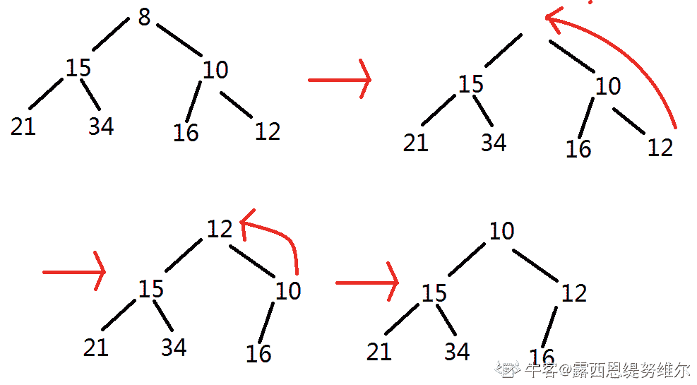
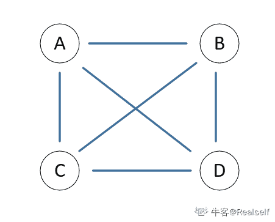
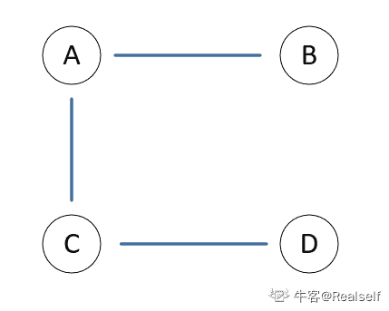
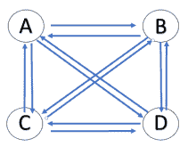
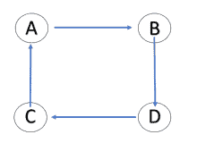

# 哔哩哔哩 2020 校园招聘后端笔试卷（二）

## 1

以下哪个 Linux 命令可以一次显示一页内容？

正确答案: B   你的答案: 空 (错误)

```cpp
pause
```

```cpp
more
```

```cpp
cat
```

```cpp
grep
```

本题知识点

Java 工程师 C++工程师 哔哩哔哩 2020

讨论

[是瑶瑶公主呀](https://www.nowcoder.com/profile/592649258)

cat 是把内容全部显示出来 more 是显示一页 

发表于 2019-11-24 16:11:52

* * *

[Chen 的 offer 快快来](https://www.nowcoder.com/profile/843699874)

A. 如其直译，暂停命令 B. 以一页一页的形式显示 C.cat 命令用于连接文件并打印到标准输出设备上。D.grep 命令用于查找文件里符合条件的字符串。

发表于 2020-08-16 21:45:07

* * *

[南茶居士](https://www.nowcoder.com/profile/941602304)

 more 命令类似 cat ，不过会以一页一页的形式显示，更方便使用者逐页阅读，而最基本的指令就是按空白键（space）就往下一页显示，按 b 键就会往回（back）一页显示

编辑于 2020-08-13 16:09:58

* * *

## 2

在系统内存中设置磁盘缓冲区的主要目的是

正确答案: A   你的答案: 空 (错误)

```cpp
减少磁盘 I/O 次数
```

```cpp
减少平均寻道时间
```

```cpp
实现设备无关性
```

```cpp
提高磁盘数据可靠性
```

本题知识点

Java 工程师 C++工程师 哔哩哔哩 2020

讨论

[猫儿抓](https://www.nowcoder.com/profile/65135905)

为了弥补 cpu 和 io 外设之间的速度差

发表于 2019-12-03 14:29:41

* * *

[Cyberpunk2077](https://www.nowcoder.com/profile/515947802)

弥补速度差，减少不了磁盘 IO 次数吧。应该是缓存热点数据，下次直接读取缓冲区的数据，所以才可以减少读取磁盘次数。

发表于 2020-08-13 16:33:11

* * *

## 3

在虚拟页式存储系统中，下面那部分完成将页面调入内存

正确答案: A   你的答案: 空 (错误)

```cpp
缺页中断
```

```cpp
页面淘汰
```

```cpp
工作集模型应用
```

```cpp
紧缩技术利用
```

本题知识点

Java 工程师 C++工程师 哔哩哔哩 2020

讨论

[牛客 772413086 号](https://www.nowcoder.com/profile/772413086)

当内存空间已被占满而又要调入新页时,必须把已在内存的某一页面淘汰掉.如果被淘汰的页面曾被修改过,还要将此页写回到外存,再换进新的页面.这一过程称为页面淘汰.——百度百科这里是要将页面调入内存，缺页中断任务就是将缺失的页面调入内存。

发表于 2020-08-01 09:13:24

* * *

## 4

计算机能直接识别和执行的语言是

正确答案: B   你的答案: 空 (错误)

```cpp
高级语言
```

```cpp
机器语言
```

```cpp
汇编语言
```

```cpp
C++
```

本题知识点

Java 工程师 C++工程师 哔哩哔哩 2020

讨论

[乂人](https://www.nowcoder.com/profile/7517518)

机器语言 0 1 代码

汇编语言 指令助记符

发表于 2020-08-18 08:38:46

* * *

## 5

下面哪种存储器，存取周期最短

正确答案: D   你的答案: 空 (错误)

```cpp
软盘
```

```cpp
硬盘
```

```cpp
光盘
```

```cpp
内存
```

本题知识点

Java 工程师 C++工程师 哔哩哔哩 2020

讨论

[_ooops_](https://www.nowcoder.com/profile/756272361)

内存是计算机写入和读取数据的中转站，它的速度是最快的。存取周期最短的是内存，其次是硬盘，再次是光盘，最慢的是软盘。

发表于 2020-02-13 10:40:54

* * *

## 6

hash table 不具备以下哪项特性？

正确答案: D   你的答案: 空 (错误)

```cpp
插入元素时间复杂度 O(1)
```

```cpp
删除元素时间复杂度 O(1)
```

```cpp
查找元素时间复杂度 O(1)
```

```cpp
随机定位元素时间复杂度 O(1)
```

本题知识点

Java 工程师 C++工程师 哔哩哔哩 2020

讨论

[牛客 772413086 号](https://www.nowcoder.com/profile/772413086)

来源 ： [`www.cnblogs.com/aspirant/p/8902285.html`](https://www.cnblogs.com/aspirant/p/8902285.html)**常用数据结构的时间复杂度**

| Data Structure | 新增 | **查询/Find** | 删除/Delete | GetByIndex |
|    数组  Array (T[]) | O(n) | **O(n)** | O(n) | O(1) |
|    链表 Linked list (LinkedList<T>) | O(1) | **O(n)** | O(n) | O(n) |
| Resizable array list (List<T>) | O(1) | **O(n)** | O(n) | O(1) |
| Stack (Stack<T>) | O(1) | **-** | O(1) | - |
| Queue (Queue<T>) | O(1) | **-** | O(1) | - |
| Hash table (Dictionary<K,T>) | O(1) | **O(1)** | O(1) | - |
| Tree-based dictionary(SortedDictionary<K,T>) | O(log n) | **O(log n)** | O(log n) | - |
| Hash table based set (HashSet<T>) | O(1) | **O(1)** | O(1) | - |
| Tree based set (SortedSet<T>) | O(log n) | **O(log n)** | O(log n) | - |

发表于 2020-08-01 09:18:38

* * *

[精益求精 BKB](https://www.nowcoder.com/profile/363685504)

如果出现冲突，如何保证是 O(1) 的时间 查找、删除、插入

发表于 2020-04-11 20:45:47

* * *

[蓝色幻影](https://www.nowcoder.com/profile/781449560)

依靠 hash 函数，能够实现 key 和位置的映射。

发表于 2020-03-08 17:23:55

* * *

## 7

已知小根堆为 8,15,10,21,34,16,12，删除关键字 8 之后需重建堆，最后的叶子节点为

正确答案: D   你的答案: 空 (错误)

```cpp
21
```

```cpp
34
```

```cpp
12
```

```cpp
16
```

本题知识点

Java 工程师 C++工程师 哔哩哔哩 2020

讨论

[露西恩缇努维尔](https://www.nowcoder.com/profile/408614969)

****

编辑于 2020-09-04 11:07:51

* * *

[KanisoVok](https://www.nowcoder.com/profile/492396434)

12 替换到 8 的位置后，12 和左右分别一次共两次，然后 10 上位，再和 15 比一次就结束了，共三次

发表于 2021-02-20 22:01:13

* * *

[南茶居士](https://www.nowcoder.com/profile/941602304)

堆的 remove 操作：[`www.cnblogs.com/wangchaowei/p/8288216.html`](https://www.cnblogs.com/wangchaowei/p/8288216.html)

发表于 2020-08-13 15:55:52

* * *

## 8

下列数据中,哪项是非线性数据结构

正确答案: D   你的答案: 空 (错误)

```cpp
栈
```

```cpp
堆
```

```cpp
队列
```

```cpp
完全二叉树
```

本题知识点

Java 工程师 C++工程师 哔哩哔哩 2020

讨论

[牛客 772413086 号](https://www.nowcoder.com/profile/772413086)

堆虽然画成二叉树的样子，但是还是用顺序表的方式存储的。

发表于 2020-08-01 09:21:35

* * *

[牛客 562332466 号](https://www.nowcoder.com/profile/562332466)

线性结构至多有一个后继，而二叉树会有多个后继。

发表于 2019-12-21 09:56:33

* * *

[牛客 49322034 号](https://www.nowcoder.com/profile/49322034)

完全二叉树也可以用线性结构实现，这个题为什么不行呢？

发表于 2020-08-09 11:40:11

* * *

## 9

设完全无向图中有 n 个顶点，则该完全无向图中有多少条边

正确答案: A   你的答案: 空 (错误)

```cpp
n(n-1)/2 
```

```cpp
n(n-1)
```

```cpp
n(n+1)/2
```

```cpp
(n-1)/2
```

本题知识点

Java 工程师 C++工程师 哔哩哔哩 2020

讨论

[Realself](https://www.nowcoder.com/profile/831729261)

*   **连通图**：在一个无向图中，从每一个顶点到每一个其它顶点都存在一条路径，则此**无向图**是连通的

    **有 n 个顶点的连通图最多有 n（n-1）/2 条边，最少有 n-1 条边**

    举例说明：如图所示，设 ABCD 四个点构成强连通图，则：

    1.  边数最多有(4×3)/2=6 条，如图所示

        

    2.  边数最少有 3 条，如图所示

        

*   **强连通图**：满足此连通条件的**有向图**叫做强连通图

    **有 n 个顶点的强连通图最多有 n（n-1）条边，最少有 n 条边**

    举例说明：如图所示，设 ABCD 四个点构成强连通图，则：

    1.  边数最多有 4×3=12 条，如图所示
        
    2.  边数最少有 4 条，如图所示
        
*   **完全图：每一对顶点间都存在一条边**

发表于 2020-05-06 16:56:32

* * *

[我是郑姐](https://www.nowcoder.com/profile/210791643)

无向图  n(n-1)/2  条有向图  n(n-1)  条

发表于 2019-11-29 19:29:35

* * *

## 10

数组 A 为有 18 个元素的有序数组，第一个元素放 A[1]中，现进行二分查找，则查找 A[3]时需要访问的数组下标依次为

正确答案: D   你的答案: 空 (错误)

```cpp
1，2，3 
```

```cpp
 9，5，2，3
```

```cpp
9，5，3
```

```cpp
9，4，2，3
```

本题知识点

Java 工程师 C++工程师 哔哩哔哩 2020

讨论

[牛客 772413086 号](https://www.nowcoder.com/profile/772413086)

每次取 mid 值：**mid = left + (right - left) / 2 **，并且不断更新 left 和 right 值，如果在 mid 左边 right=mid-1，如果在 mid 右边 left=mid+1 第一次：left：1，right：18，mid：1+(18-1)/2=9right->mid-1 第二次：left：1，right：9-1=8，mid：1+(8-1)/2=4right->mid-1 第三次：left：1，right：4-1=3，mid：1+(3-1)/2=2left->mid+1 第四次：left：2+1=3，right=3，mid=3

发表于 2020-08-01 09:33:19

* * *

[蓝色幻影](https://www.nowcoder.com/profile/781449560)

1 18：91  9：51 5：3

发表于 2020-03-08 17:25:31

* * *

[BloodCrystal](https://www.nowcoder.com/profile/544596576)

难道是这样？
0 - 18 : 90 - 9 : 40 - 4 : 22 - 4 : 3

发表于 2020-03-31 00:15:09

* * *

## 11

用 0,1,2,3,4,5 组成一个 4 位数，要求每一位都不一样，请问能组成多少个四位数

正确答案: C   你的答案: 空 (错误)

```cpp
240
```

```cpp
280
```

```cpp
300
```

```cpp
360
```

本题知识点

Java 工程师 C++工程师 哔哩哔哩 2020

讨论

[我是郑姐](https://www.nowcoder.com/profile/210791643)

千位：除了零有五种选择---->5 百位：除了千位选的，有五种选择---->5 十位：除了千位百位，还有四种可选---->4 个位：除了千百十位，还剩三种可选---->3 所以：5*5*4*3 = 300

发表于 2019-11-29 19:37:36

* * *

[Gamigo](https://www.nowcoder.com/profile/488577982)

5*5*4*3 //首位数字不能是 0

发表于 2019-11-27 20:57:37

* * *

[牛客 643562034 号](https://www.nowcoder.com/profile/643562034)

A¹[5]*A¹[5]*A¹[4]*A¹[3]

发表于 2020-10-07 19:50:17

* * *

## 12

判断有向图是否存在回路，利用()方法最佳

正确答案: A   你的答案: 空 (错误)

```cpp
拓扑排序
```

```cpp
求最短路径
```

```cpp
求关键路径
```

```cpp
广度优先遍历
```

本题知识点

Java 工程师 C++工程师 哔哩哔哩 2020

讨论

[蓝色幻影](https://www.nowcoder.com/profile/781449560)

拓扑排序是根据入度=0 来进行出队，如果当队列不为空而且没有入度=0 的元素，说明有环

发表于 2020-03-08 17:28:05

* * *

## 13

如果有#define AREA(a,b) a+b，则语句 int s=AREA(3,4)*AREA(3,4) 执行后变量 s 值为

正确答案: C   你的答案: 空 (错误)

```cpp
49
```

```cpp
24
```

```cpp
19
```

```cpp
144
```

本题知识点

Java 工程师 C++工程师 哔哩哔哩 2020

讨论

[223s](https://www.nowcoder.com/profile/641616950)

宏定义相当于是文本替换，所以 s=AREA(3,4)*AREA(3,4) 即 s=3+4*3+4=19

发表于 2020-07-15 15:56:14

* * *

[Gamigo](https://www.nowcoder.com/profile/488577982)

s=AREA(3,4)*AREA(3,4)=3+4*3+4=19

发表于 2019-11-27 21:01:27

* * *

## 14

以下哪个排序的平均速度最快？

正确答案: B   你的答案: 空 (错误)

```cpp
希尔
```

```cpp
快速
```

```cpp
冒泡
```

```cpp
插入
```

本题知识点

Java 工程师 C++工程师 哔哩哔哩 2020

讨论

[牛客 178575441 号](https://www.nowcoder.com/profile/178575441)

希尔排序时间复杂度 O{n^(3/2)}快速排序时间复杂度 O{nlogn}

发表于 2020-08-24 20:33:15

* * *

[sungalaxy](https://www.nowcoder.com/profile/720122324)

？？？不是希尔？希尔平均场景下比快排好啊？

发表于 2021-09-12 20:58:43

* * *

[我是郑姐](https://www.nowcoder.com/profile/210791643)

顾名思义，快速排序，快速

发表于 2019-11-29 19:40:57

* * *

## 15

下面关于 JAVA 继承的描述正确的是

正确答案: B   你的答案: 空 (错误)

```cpp
一个类只能实现一个接口
```

```cpp
只允许单一继承
```

```cpp
一个类不能同时继承一个类和实现一个接口
```

```cpp
单一继承使代码不可靠
```

本题知识点

Java 工程师 C++工程师 哔哩哔哩 2020

讨论

[_ 向 offer 冲锋-](https://www.nowcoder.com/profile/227731021)

单继承，多接口

发表于 2020-03-19 08:00:47

* * *

[是瑶瑶公主呀](https://www.nowcoder.com/profile/592649258)

A 一个类可以实现多个接口 C 一个类可以同时继承一个类，实现多接口 D 可靠

发表于 2019-11-24 16:13:28

* * *

## 16

下列关于修饰符混用的说法，错误的是

正确答案: D   你的答案: 空 (错误)

```cpp
abstract 不能与 final 并列修饰同一个类
```

```cpp
abstract 类中可以有 private 的成员
```

```cpp
abstract 方法必须在 abstract 类中
```

```cpp
static 方法中能处理非 static 的属性
```

本题知识点

Java 工程师 C++工程师 哔哩哔哩 2020

讨论

[是瑶瑶公主呀](https://www.nowcoder.com/profile/592649258)

静态方法不能处理非静态属性 D 错抽象类可以被继承 final 类不能被继承 A 对抽象类中成员访问修饰符没限制 B 对抽象类中可以无抽象方法 有抽象方法一定是抽象类 C 对

发表于 2019-11-24 16:14:59

* * *

[_ooops_](https://www.nowcoder.com/profile/756272361)

静态不能处理非静态的

发表于 2020-02-13 14:22:24

* * *

[牛客 178575441 号](https://www.nowcoder.com/profile/178575441)

接口不也有抽象方法吗

发表于 2020-08-24 20:34:45

* * *

## 17

从以下哪一个选项中可以获得 Servlet 的初始化参数

正确答案: C   你的答案: 空 (错误)

```cpp
Servlet
```

```cpp
ServletContext
```

```cpp
ServletConfig
```

```cpp
GenericServlet
```

本题知识点

Java 工程师 C++工程师 哔哩哔哩 2020

讨论

[我是郑姐](https://www.nowcoder.com/profile/210791643)

servletContext 上下文对象，全局程序共享 servletConfig 用于加载 Servlet 的初始化参数最后一个不太清楚，顺便帮你们查了：GenericServlet 是 Servlet 接口的 实现类，我们可以继承 GenericServlet 来编写自己的 Servlet

发表于 2019-11-29 19:48:29

* * *

## 18

同一进程下的线程可以共享以下

正确答案: B   你的答案: 空 (错误)

```cpp
线程的堆栈
```

```cpp
文件描述符
```

```cpp
错误返回码
```

```cpp
寄存器组的值
```

本题知识点

Java 工程师 C++工程师 哔哩哔哩 2020

讨论

[Chen 的 offer 快快来](https://www.nowcoder.com/profile/843699874)

线程共享的内容包括：

1.  进程代码段
2.  进程的公有数据(利用这些共享的数据，线程很容易的实现相互之间的通讯)、
3.  进程打开的文件描述符、
4.  信号的处理器、
5.  进程的当前目录和
6.  进程用户 ID 与进程组 ID   

线程独有的内容包括：

1.  线程 ID
2.  寄存器组的值
3.  线程的堆栈
4.  错误返回码
5.  线程的信号屏蔽码

发表于 2020-08-16 22:02:30

* * *

[offer 快来球球了](https://www.nowcoder.com/profile/243031380)

同一进程内的线程共享 1 代码段 2 数据段 3 打开文件列表 4 堆  线程私有 1 线程 id 2 寄存器 （用于暂时存放数据）3 工作栈

编辑于 2020-02-25 13:45:13

* * *

## 19

如何减少缺页错误？

正确答案: B   你的答案: 空 (错误)

```cpp
进程倾向于占用 CPU
```

```cpp
访问局部性（locality of reference）满足进程要求
```

```cpp
进程倾向于占用 I/O
```

```cpp
使用基于最短剩余时间（shortest remaining time）的调度机制
```

本题知识点

Java 工程师 C++工程师 哔哩哔哩 2020

讨论

[露西恩缇努维尔](https://www.nowcoder.com/profile/408614969)

局部性，就是指程序要访问的数据是相邻的。比如我访问了一块数据，然后接着访问其周围的数据。在局部性的情况下，只需要将页读进内存，接着大概率会继续访问该页的数据，所以缺页中断减少了。

发表于 2020-09-03 14:48:46

* * *

## 20

进程进入等待状态有哪几种方式

正确答案: D   你的答案: 空 (错误)

```cpp
CPU 调度给优先级更高的线程
```

```cpp
阻塞的线程获得资源或者信号
```

```cpp
在时间片轮转的情况下，如果时间片到了
```

```cpp
获得 spinlock 未果
```

本题知识点

Java 工程师 C++工程师 哔哩哔哩 2020

讨论

[神韵 499](https://www.nowcoder.com/profile/663125690)

链接：[`www.nowcoder.com/questionTerminal/343674d5143744f48c6027b981c1222a?orderByHotValue=2&done=0&pos=11&onlyReference=false`](https://www.nowcoder.com/questionTerminal/343674d5143744f48c6027b981c1222a?orderByHotValue=2&done=0&pos=11&onlyReference=false)
来源：牛客网
进程分为基本的三个状态：运行、就绪、阻塞/等待。A. 高优先级的抢占 CPU，使得原来处于运行状态的进程转变为就绪状态。B. 阻塞的进程等待某件事情的发生，一旦发生则它的运行条件已经满足，从阻塞进入就绪状态。
C. 时间片轮转使得每个进程都有一小片时间来获得 CPU 运行，当时间片到时从运行状态变为就绪状态。D. 自旋锁（spinlock）是一种保护临界区最常见的技术。在同一时刻只能有一个进程获得自旋锁，其他企图获得自旋锁的任何进程将一直进行尝试（即自旋，不断地测试变量），除此以外不能做任何事情。因此没有获得自旋锁的进程在获取锁之前处于忙等（阻塞状态）。

发表于 2020-01-30 12:29:42

* * *

[谁都不许动我的砖](https://www.nowcoder.com/profile/4677166)

在时间片轮转的情况下,如果时间片到了，会由运行态，转化为就绪态

发表于 2020-09-27 16:53:50

* * *

[_ 向 offer 冲锋-](https://www.nowcoder.com/profile/227731021)

spinlock 称为自旋锁

发表于 2020-03-19 08:03:10

* * *

## 21

编译过程中，语法分析器的任务是

正确答案: B   你的答案: 空 (错误)

```cpp
分析单词是怎样构成的
```

```cpp
根据构词规则识别单词
```

```cpp
判断程序在结构上是否正确
```

```cpp
赋值语句左右端类型匹配问题
```

本题知识点

Java 工程师 C++工程师 哔哩哔哩 2020

讨论

[蓝色幻影](https://www.nowcoder.com/profile/781449560)

词法分析器：分析单词的构成 （class, const , static）语法分析器：一个句子的构成。（单词组合）语义分析器：判断程序的结构。

发表于 2020-03-08 17:34:12

* * *

[狂奔的菜鸡](https://www.nowcoder.com/profile/419358164)

链接：[`www.nowcoder.com/questionTerminal/23680593a74f431c8f94f5655ed983c9?from=relative`](https://www.nowcoder.com/questionTerminal/23680593a74f431c8f94f5655ed983c9?from=relative)
来源：牛客网
词法分析（lexical analysis）词法分析是编译过程的第一个阶段。这个阶段的任务是从左到右的读取每个字符，然后根据构词规则识别单词。词法分析可以用 lex 等工具自动生成。语法分析（syntax analysis）语法分析是编译过程的一个逻辑阶段。语法分析在词法分析的基础上，将单词序列组合成各类语法短语，如“程序”，“语句”，“表达式”等等。语法分析程序判断程序在结构上是否正确。语义分析（semantic analysis）属于逻辑阶段。对源程序进行上下文有关性质的审查，类型检查。如赋值语句左右端类型匹配问题。

发表于 2020-09-04 17:06:33

* * *

[你的 offer 对我打了烊](https://www.nowcoder.com/profile/598309941)

这个是啥？咋没评论

发表于 2020-02-25 17:13:05

* * *

## 22

数据库操作中，当关系 S 自然联接时，能够把 S 本该舍弃的元组放到结果关系中的操作是

正确答案: A   你的答案: 空 (错误)

```cpp
外联接
```

```cpp
左外联接
```

```cpp
右外联接
```

```cpp
外部并
```

本题知识点

Java 工程师 C++工程师 哔哩哔哩 2020

讨论

[带带搬砖工](https://www.nowcoder.com/profile/323678054)

左外有错吗

发表于 2020-03-08 23:26:58

* * *

[南茶居士](https://www.nowcoder.com/profile/941602304)

外连接：通常的连接操作中，只有满足连接条件的元组才能作为结果输出。如果 想要列出表中每个元组观察状态，即便某条记录不满足条件，在属性上填 Null,需要用外连接。

发表于 2020-08-13 15:23:36

* * *

## 23

SELECT 语句中与 HAVING 子句通常同时使用什么语句

正确答案: C   你的答案: 空 (错误)

```cpp
ORDER BY
```

```cpp
WHERE
```

```cpp
GROUP BY
```

```cpp
无需配合 
```

本题知识点

Java 工程师 C++工程师 哔哩哔哩 2020

讨论

[咕咕 Corn](https://www.nowcoder.com/profile/6866427)

GROUP BY 子句可以将查询结果表按某一列或多列值分组，值相等的一组。分组后，可以用 HAVING 短语指定筛选条件，对这些组进行筛选。WHERE 子句与 HAVING 短语的区别在于作用对象不同。WHERE 子句作用域基本表或试图，而 HAVING 短语作用于组。

发表于 2020-09-04 14:42:55

* * *

## 24

下面关于 UPDATE 语句的说法正确的是

正确答案: C   你的答案: 空 (错误)

```cpp
通过它可以修改数据库表的列名与数据类型
```

```cpp
通过它只能修改数据库表的列名 
```

```cpp
通过它可以一次修改表中所有的行
```

```cpp
通过它不能一次修改表中所有的行 
```

本题知识点

Java 工程师 C++工程师 哔哩哔哩 2020

讨论

[Antonio.D](https://www.nowcoder.com/profile/969653988)

怎么我感觉选 a 呢

发表于 2019-11-24 23:42:50

* * *

## 25

同一个关系模型的任两个元组值

正确答案: A   你的答案: 空 (错误)

```cpp
不能全同
```

```cpp
可以全同
```

```cpp
必须全同
```

```cpp
其他都不是
```

本题知识点

Java 工程师 C++工程师 哔哩哔哩 2020

讨论

[柳上原](https://www.nowcoder.com/profile/7159693)

这里的元组应该是包含主键在内的所有数据列

发表于 2019-11-26 21:22:32

* * *

[咕咕 Corn](https://www.nowcoder.com/profile/6866427)

关系模型是对一类实体特征的结构性描述，也是对关系的结构性描述，该描述一般包括关系名、属性名、属性域的类型和长度，属性之间固有的依赖联系等。

发表于 2020-09-04 14:53:34

* * *

[HopeAbounds](https://www.nowcoder.com/profile/585716702)

在 InnoDB 中如果不显式设置主键，应该可以设置两个完全相同的元组吧？

发表于 2020-07-21 20:27:13

* * *

## 26

下面有关重载函数的说法中正确的是

正确答案: C   你的答案: 空 (错误)

```cpp
重载函数必须具有不同的返回值类型
```

```cpp
重载函数形参个数必须不同
```

```cpp
重载函数必须有不同的形参列表
```

```cpp
重载函数名可以不同
```

本题知识点

Java 工程师 C++工程师 哔哩哔哩 2020

讨论

[牛客 719981121 号](https://www.nowcoder.com/profile/719981121)

返回值类型不同不能当作重载的条件

发表于 2021-04-01 15:01:42

* * *

[是瑶瑶公主呀](https://www.nowcoder.com/profile/592649258)

重载 同方法名 不同参数列表重写 同方法名 返回类型小于等于父类 访问修饰大于等于父类 参数列表一样

发表于 2019-11-24 16:16:12

* * *

## 27

在一个 cpp 文件里面，定义了一个 static 类型的全局变量，下面一个正确的描述是

正确答案: A   你的答案: 空 (错误)

```cpp
只能在该 cpp 所在的编译模块中使用该变量
```

```cpp
该变量的值是不可改变的
```

```cpp
该变量不能在类的成员函数中引用
```

```cpp
这种变量只能是基本类型(如 int，char)不能是 C++类型
```

本题知识点

Java 工程师 C++工程师 哔哩哔哩 2020

## 28

Web 使用什么进行信息传送

正确答案: A   你的答案: 空 (错误)

```cpp
HTTP
```

```cpp
HTML
```

```cpp
FTP
```

```cpp
TELNET
```

本题知识点

Java 工程师 C++工程师 哔哩哔哩 2020

讨论

[露西恩缇努维尔](https://www.nowcoder.com/profile/408614969)

Web 页面是用 HTML 写出来的。使用的是 HTTP 协议进行发送。

发表于 2020-09-03 15:02:58

* * *

## 29

某网络的 IP 地址空间为 192.168.5.0/24，采用定长子网划分，子网掩码为 255.255.255.248，则该网络的最大子网个数、每个子网内最大可分配地址个数

正确答案: C   你的答案: 空 (错误)

```cpp
8,32
```

```cpp
32,8
```

```cpp
32,6
```

```cpp
8,30
```

本题知识点

Java 工程师 C++工程师 哔哩哔哩 2020

讨论

[是瑶瑶公主呀](https://www.nowcoder.com/profile/592649258)

248 是 11111 000 前面 5 个 1 划分 32 个子网 3 个 0 划分 8 个主机 去掉 000 和 111 就是 6 个

发表于 2019-11-24 16:17:16

* * *

[疼先生](https://www.nowcoder.com/profile/818767892)

[`wenku.baidu.com/view/4c4a8ecfb8f3f90f76c66137ee06eff9aef84935.html`](https://wenku.baidu.com/view/4c4a8ecfb8f3f90f76c66137ee06eff9aef84935.html)

发表于 2020-05-20 16:36:04

* * *

## 30

下列协议中，把 MAC 地址映射成 IP 地址的是

正确答案: B   你的答案: 空 (错误)

```cpp
ARP
```

```cpp
RARP
```

```cpp
ARQ
```

```cpp
ICMP
```

本题知识点

Java 工程师 C++工程师 哔哩哔哩 2020

讨论

[是瑶瑶公主呀](https://www.nowcoder.com/profile/592649258)

ARP 地址解析 ip 到 macmac 到 ip RARP 逆地址解析协议

发表于 2019-11-24 16:17:59

* * *

## 31

给出两个单词 word1 和 word2，计算出将 word1 转换为 word2 的最少操作次数。

你总共三种操作方法：

*   插入一个字符
*   删除一个字符
*   替换一个字符

本题知识点

Java 工程师 C++工程师 哔哩哔哩 2020

讨论

[🐠👑阿阳](https://www.nowcoder.com/profile/56623706)

动态规划法

```cpp
import java.util.Scanner;

public class Main {
    public static void main(String[] args){
        Scanner input = new Scanner(System.in);
        String word1 = input.nextLine();
        String word2 = input.nextLine();
        int len1 = word1.length();
        int len2 = word2.length();
        int[][] DP = new int[len1+1][len2+1];
        for(int i = 0; i <= len2; i++){
            DP[0][i] = i;
        }
        for(int i = 0; i <= len1; i++){
            DP[i][0] = i;
        }

        for(int i = 1; i <= len1; i++)
            for(int j = 1; j <= len2; j++){
                if(word1.charAt(i-1) == word2.charAt(j-1)) {
                    DP[i][j] = DP[i-1][j-1];
                } else {
                    int add = DP[i-1][j] + 1;
                    int del = DP[i][j-1] + 1;
                    int upd = DP[i-1][j-1] + 1;
                    DP[i][j] = Math.min(Math.min(add,del),upd);
                }

            }
        System.out.println(DP[len1][len2]);

    }
}
```

发表于 2020-07-22 15:15:09

* * *

[蓝色幻影](https://www.nowcoder.com/profile/781449560)

```cpp
#include<bits/stdc++.h>
using namespace std;

int main(){
    string word1,word2;
    while(cin>>word1){
        cin>>word2;

        int m=word1.size(),n=word2.size();
        if(m==0 || n==0){
            return max(m,n);
        }

        vector<vector<int>> dp(m+1,vector<int>(n+1,0));
        for(int i=0;i<=m;i++){
            dp[i][0]=i;
        }
        for(int j=0;j<=n;j++){
            dp[0][j]=j;
        }

        for(int i=1;i<=m;i++){
            for(int j=1;j<=n;j++){
                if(word1[i-1]==word2[j-1]){
                    int tmp=min(dp[i-1][j-1],dp[i-1][j]+1);
                    dp[i][j]=min(tmp,dp[i][j-1]+1);
                }
                else{
                    int tmp=min(dp[i-1][j-1]+1,dp[i-1][j]+1);
                    dp[i][j]=min(tmp,dp[i][j-1]+1);
                }
            }
        }
        cout<<dp[m][n]<<endl;
    }
}
```

发表于 2020-03-08 17:42:32

* * *

[找个工作也太难了](https://www.nowcoder.com/profile/312726511)

（1）先使用动态规划求出源字符串和目的字符串的最长公共子序列（不需要改动地部分）（2）再用两个串中的最大长度减去（1）中求出的值，得到需要改动的次数

```cpp
import java.util.*;
public class Main{
    public static void main(String[] args){
        Scanner sc=new Scanner(System.in);
        String sourceWord=sc.next();
        String targetWord=sc.next();

        int n=sourceWord.length();
        int m=targetWord.length();
        int[][] dp=new int[n+1][m+1];
        for(int i=1;i<=n;++i){
            for(int j=1;j<=m;++j){
                if(sourceWord.charAt(i-1)==targetWord.charAt(j-1))
                    dp[i][j]=dp[i-1][j-1]+1;
                else
                    dp[i][j]=Math.max(dp[i-1][j],dp[i][j-1]);
            }
        }
        System.out.println(Math.max(n,m)-dp[n][m]);
    }
}
```

发表于 2021-07-27 16:17:24

* * *

## 32

给定一个正整数 N，试求有多少组连续正整数满足所有数字之和为 N? (1 <= N <= 10 ^ 9)

本题知识点

Java 工程师 C++工程师 哔哩哔哩 2020

讨论

[一线绝缘体](https://www.nowcoder.com/profile/585932497)

题目中说给定一个正整数，测试用例中竟然给了一个 0. 😣😣😣

发表于 2019-11-27 20:50:39

* * *

[露西恩缇努维尔](https://www.nowcoder.com/profile/408614969)

```cpp
#include<bits/stdc++.h>
using namespace std;

int main()
{
    int n;
    while(cin>>n)
    {
        if(n==0)
        {
            cout<<1<<endl;
            continue;
        }
        int N=sqrt(2*n);
        int cnt=0;
        for(int i=1;i<=N;i++)
        {
            int tmp=n-(i-1)*i/2.0;
            if(tmp%i==0)
                cnt++;
        }
        cout<<cnt<<endl;
    }
    return 0;
}
```

 发表于 2020-09-03 11:22:53

* * *

[🐠👑阿阳](https://www.nowcoder.com/profile/56623706)

等差数列求和公式: (首项 + 末项) * 项数 / 2 因为题意是连续的数 故 末项 = 首项 + 项数 - 1N = (首项 + 首项 + 项数 - 1) / 2 * 项数   = (首项 + (项数 - 1) / 2) * 项数 N / 项数 = 首项 + (项数 - 1) / 2 根据上式对 N % 项数 分析可得
1\. 当 项数 为奇数时，N % 项数 = 0
2\. 当 项数 为偶数时，N % 项数 = 项数 / 2 已知 N > (项数 - 1) * 项数 / 2， 故项数 < sqrt(2 * N) + 1

```cpp
import java.util.Scanner;

public class Main{
        public static void main(String[] args){
        Scanner input = new Scanner(System.in);
        int N = input.nextInt();
        int ans = 1;
        int sqrtN = (int)Math.sqrt((double)N*2);//项数 < sqrt(2 * N) + 1
        for(int i = 2;i < sqrtN + 1;i++){
           if(i%2==1) {
               if (N % i == 0) ans++; //1\. 当 项数 为奇数时，N % 项数 = 0
           }else {
               if (N % i == i/2) ans++;//2\. 当 项数 为偶数时，N % 项数 = 项数 / 2
           }
        }
        System.out.println(ans);
    }
}
```

发表于 2020-07-22 12:59:21

* * *

## 33

从标准输入读取字符串，按照指定的两层分隔符切分成多对 key-value，依次输出到标准输出中。注意：仅输出 key 和 value 都为非空串的 pair。

本题知识点

Java 工程师 C++工程师 哔哩哔哩 2020

讨论

[morooi](https://www.nowcoder.com/profile/54246941)

```cpp
import java.util.ArrayList;
import java.util.Scanner;

public class Main {

    public static void main(String[] args) {
        Scanner sc = new Scanner(System.in);
        String[] strings = sc.nextLine().split(" ");  // # : a:3#b:8#c:9
        // 注意对输入做校验
        if (strings.length < 3) {
            System.out.println(0);
        } else {
            String a = strings[0], b = strings[1];
            String[] splitString = strings[2].split(a);
            ArrayList<String> res = new ArrayList<>();
            for (String s : splitString) {
                if (s.contains(b)) {
                    res.add(s);
                }
            }
            if (!res.isEmpty()) {
                System.out.println(res.size());
                for (String re : res) {
                    System.out.println(re.replace(b, " "));
                }
            } else System.out.println(0);
        }
    }
}

```

注意对输入数据做校验，要不然提示数组可能越界，通过率一直卡在 80%

发表于 2020-08-13 15:53:44

* * *

[🐠👑阿阳](https://www.nowcoder.com/profile/56623706)

1\. 先获取间隔符和关系符 2\. 用 split(间隔符)得到分离后的字符串数组 3\. 用 contains(关系符)检验各个字符串是否标准 4\. 用 replace(关系符, 空格)输出

```cpp
import java.util.*;
public class Main{
    public static void main(String[] args){
        Scanner input = new Scanner(System.in);
        String str = input.nextLine();
        if(str.length()<4){
            System.out.println(0);
        } else {
        char sc = str.charAt(0);
        char xc = str.charAt(2);//1\. 先获取间隔符和关系符
        String[] ans = str.substring(4).split(sc+"");//2\. 用 split(间隔符)得到分离后的字符串数组
        int ansnum = ans.length;
        for(String s : ans){
            if(!s.contains(xc+"")) ansnum--;
        }
        System.out.println(ansnum);
        if(ansnum>0){
            for(String s : ans){
                if(s.contains(xc+"")){//3\. 用 contains(关系符)检验各个字符串是否标准
                    System.out.println(s.replace(xc,' '));//4\. 用 replace(关系符, 空格)输出
                }
            }
        }
    }}
}
```

发表于 2020-07-22 13:09:01

* * *

[小布点猫](https://www.nowcoder.com/profile/257739550)

请教一下我这个代码，5 个例子只能通过两个，实在不知道哪有问题了

```cpp
#include<iostream>
#include<string>
#include<vector>
#include<sstream>
#include<istream>
using namespace std;
int main() {
    char a, b; string c,p;
    cin >> a >> b;
    getline(cin, c);
    vector<string>s, q;
    stringstream ss(c);
    while (getline(ss, c, a)) //第一次分割
        s.push_back(c);
    cout << s.size() << endl;
    for (int i = 0; i < s.size(); i++) {
        stringstream tmp(s[i]);
        while (getline(tmp, c, b)) //第二次分割
            q.push_back(c);
        for (int i = 0; i < q.size(); i++) { //把空格去掉
           stringstream tmpq(q[i]);
           while (getline(tmpq, c, ' '))
               p += c;
           if (i != q.size())
               cout << p << ' ';
           else
               cout << p;
           p = "";     
        }
        q.clear();
        cout << endl;
    }
    s.clear();

}
```

发表于 2021-09-11 20:25:41

* * *