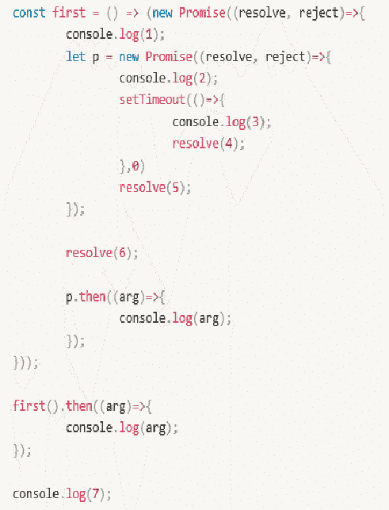

# 哔哩哔哩 2020 校园招聘技术类笔试卷（二）

## 1

关于 canvas 和 svg 说法正确的是？

正确答案: C   你的答案: 空 (错误)

```cpp
canvas 支持事件处理器
```

```cpp
canvas 不依赖分辨率，缩放不失真
```

```cpp
svg 不依赖分辨率，缩放不失真
```

```cpp
svg 适合图像密集型的游戏
```

本题知识点

Java 工程师 C++工程师 iOS 工程师 安卓工程师 运维工程师 前端工程师 算法工程师 PHP 工程师 测试工程师 安全工程师 c#工程师 数据库工程师 大数据开发工程师 数据分析工程师 数据挖掘工程师 测试开发工程师 哔哩哔哩 2020

讨论

[sherryXue](https://www.nowcoder.com/profile/741476208)

| Canvas | SVG |
|  
*   通过 Javascript 来绘制 2D 图形。
*   是逐像素进行渲染的。
*   其**位置发生改变**，会重新进行绘制。

 | *   一种使用 XML 描述的 2D 图形的语言*   SVG 基于 XML 意味着，SVG DOM 中的每个元素都是可用的，可以为某个元素附加 Javascript 事件处理器。*   在 SVG 中，每个被绘制的图形均被视为对象。如果 SVG 对象的**属性发生变化**，那么浏览器能够自动重现图形。 |
|  
*   **依赖**分辨率
*   不支持事件处理器
*   弱的文本渲染能力
*   能够以 .png 或 .jpg 格式保存结果图像
*   最**适合图像密集型**的游戏，其中的许多对象会被频繁重绘

 |  
*   **不依赖**分辨率
*   支持事件处理器
*   **最适合****带有大型渲染**区域的应用程序（比如谷歌地图）
*   复杂度高会减慢渲染速度（任何过度使用 DOM 的应用都不快）
*   **不适合游戏应用**

 |

 发表于 2019-11-24 11:02:43

* * *

[帮辅导保姆式内推字节](https://www.nowcoder.com/profile/4490016)

*   svg 矢量图（由基本图形构成：点、线、圆）缩放不会失真。

疫情期间没事，录了一些课程都是，牛客的真题，欢迎查看：
[`www.bilibili.com/video/av86538323?from=search&seid=9536990268235052712`](https://www.bilibili.com/video/av86538323?from=search&seid=9536990268235052712)

发表于 2020-02-03 20:42:04

* * *

## 2

a 标签的 href 和 onclick 属性同时存在时哪个先触发？

正确答案: B   你的答案: 空 (错误)

```cpp
href 先执行 onclick 先执行
```

```cpp
同时执行
```

```cpp
只执行 href
```

本题知识点

Java 工程师 C++工程师 iOS 工程师 安卓工程师 运维工程师 前端工程师 算法工程师 大数据开发工程师 测试开发工程师 哔哩哔哩 测试工程师 PHP 工程师 安全工程师 c#工程师 数据库工程师 数据分析工程师 数据挖掘工程师 2020

讨论

[桃枝](https://www.nowcoder.com/profile/902835698)

应该是题出错了,只能看到三个选项,并且题目后面写了 B,而选项中的 B 是同时执行;事实上应该是 onclick 先于 href 执行;可以通过 onclick 的函数中,设置 return false;阻止默认的点击跳转事件;

发表于 2019-11-26 08:02:01

* * *

## 3

以下关于跨域说法错误的是？

正确答案: D   你的答案: 空 (错误)

```cpp
Cookie，LocalStorage 和 IndexedDB 都会受到同源策略的限制
```

```cpp
postMessage，JSONP，WebSocket 都是常用的解决跨域的方案
```

```cpp
跨域资源共享规范中规定了除了 GET 之外的 HTTP 请求，或者搭配某些 MINE 类型的 POST 请求，浏览器都需要先发一个 OPTIONS 请求
```

```cpp
http://www.bilibili.com 和 https://www.bilibili.com 是相同的域名，属于同源
```

本题知识点

Java 工程师 C++工程师 iOS 工程师 安卓工程师 运维工程师 前端工程师 算法工程师 PHP 工程师 测试工程师 安全工程师 c#工程师 数据库工程师 大数据开发工程师 数据分析工程师 数据挖掘工程师 测试开发工程师 哔哩哔哩 2020 途虎 2021

讨论

[swallowblank](https://www.nowcoder.com/profile/8147847)

答案不严谨，虽然 D 错的最明显。但是 HEAD 请求，也不需要发送预检请求。

发表于 2021-02-20 15:51:57

* * *

[阿德在学习](https://www.nowcoder.com/profile/992192426)

不同协议 ( https 和 http )

发表于 2019-11-29 19:31:39

* * *

## 4

下列资源加载顺序哪种是不可能的出现的？

正确答案: C   你的答案: 空 (错误)

```cpp
d.css, b.css, c.js, a.js
```

```cpp
b.css, d.css, c.js, a.js
```

```cpp
a.js, b.css, c.js, d.css
```

```cpp
c.js, d.css, b.css, a.js
```

本题知识点

Java 工程师 C++工程师 iOS 工程师 安卓工程师 运维工程师 前端工程师 算法工程师 PHP 工程师 测试工程师 安全工程师 c#工程师 数据库工程师 大数据开发工程师 数据分析工程师 数据挖掘工程师 测试开发工程师 哔哩哔哩 2020

讨论

[可口 coco](https://www.nowcoder.com/profile/263662460)

prefetch 是告诉浏览器加载下一页可能会用到的资源，是下一页面不是当前页面，所以 prefetch 优先级非常低，该方式的作用是加速下一个页面的加载速度，因此 a.js 应该是最后一个。

发表于 2019-12-24 08:51:58

* * *

[林深时见鹿 201909041630838](https://www.nowcoder.com/profile/760597409)

此题考验的是 rel 后面的三个属性**preload**是在页面加载的**生命周期的早期阶段**就开始获取**prefetch**是预加载**stylesheet**是声明此文件为样式表文件

发表于 2019-12-04 14:04:15

* * *

## 5

选择语义与其他三项明显不同的标签

正确答案: C   你的答案: 空 (错误)

```cpp
<aside>
```

```cpp
<footer>
```

```cpp
<area>
```

```cpp
<summary>
```

本题知识点

Java 工程师 C++工程师 iOS 工程师 安卓工程师 运维工程师 前端工程师 算法工程师 大数据开发工程师 测试开发工程师 哔哩哔哩 测试工程师 PHP 工程师 安全工程师 c#工程师 数据库工程师 数据分析工程师 数据挖掘工程师 2020

讨论

[帮辅导保姆式内推字节](https://www.nowcoder.com/profile/4490016)

area 针对图像
关于这些题的讲解，我还准备了视屏版本。你可以在 b 站上观看我的视屏讲解：[`www.bilibili.com/video/av83427212?p=6`](https://www.bilibili.com/video/av83427212?p=6)

发表于 2020-02-04 19:44:23

* * *

[阿德在学习](https://www.nowcoder.com/profile/992192426)

四个答案都是空白的怎么答对的？？？

发表于 2019-11-29 19:33:29

* * *

## 6

CSS 中不支持样式子元素继承的是？

正确答案: C   你的答案: 空 (错误)

```cpp
font-size
```

```cpp
color
```

```cpp
margin
```

```cpp
cursor
```

本题知识点

Java 工程师 C++工程师 iOS 工程师 安卓工程师 运维工程师 前端工程师 算法工程师 PHP 工程师 测试工程师 安全工程师 c#工程师 数据库工程师 大数据开发工程师 数据分析工程师 数据挖掘工程师 测试开发工程师 哔哩哔哩 2020

## 7

样式权重的优先级下面正确的是？

正确答案: A   你的答案: 空 (错误)

```cpp
!important > 行内样式(style) > id > class > tag
```

```cpp
行内样式(style) > !important > id > tag > class
```

```cpp
id > 行内样式(style) > !important > class > tag
```

```cpp
id > !important > 行内样式(style) > tag > class
```

本题知识点

Java 工程师 C++工程师 iOS 工程师 安卓工程师 运维工程师 前端工程师 算法工程师 大数据开发工程师 测试开发工程师 哔哩哔哩 测试工程师 PHP 工程师 安全工程师 c#工程师 数据库工程师 数据分析工程师 数据挖掘工程师 2020

讨论

[牛客 749499445 号](https://www.nowcoder.com/profile/749499445)

!important > 行内样式(style) > id > class > tag 识记方式：除了前面两个，越准确优先级越高，如：id 能够识别唯一一个元素，优先级最高，类选择器 比标签选择器更准确一些所以优先级高一些。

发表于 2020-04-10 15:40:18

* * *

## 8

根据下面代码所述，点击 area ，box 高度的表现是？

正确答案: D   你的答案: 空 (错误)

```cpp
高度保持 100 不变
```

```cpp
高度保持 0 不变
```

```cpp
高度从 0 渐变为 100
```

```cpp
高度从 0 瞬变为 100
```

本题知识点

Java 工程师 C++工程师 iOS 工程师 安卓工程师 运维工程师 前端工程师 算法工程师 PHP 工程师 测试工程师 安全工程师 c#工程师 数据库工程师 大数据开发工程师 数据分析工程师 数据挖掘工程师 测试开发工程师 哔哩哔哩 2020

讨论

[Dream_Cocoa](https://www.nowcoder.com/profile/58607747)

box 没有原始高度

发表于 2019-12-03 11:20:07

* * *

[骑牛看太阳](https://www.nowcoder.com/profile/305171768)

因为 box 原来没有高度，所以 transition 的过渡效果并不生效

发表于 2020-09-13 17:28:21

* * *

## 9

关于页面重绘和回流说法错误的是？

正确答案: B   你的答案: 空 (错误)

```cpp
添加和删除元素会触发页面回流和重绘
```

```cpp
对 style 的操作改变 color、background-color 会回流，改变 padding、margin 会重绘
```

```cpp
display:none 隐藏元素会触发页面回流和重绘
```

```cpp
浏览器大小改变 resize、font-size 会触发页面回流和重绘
```

本题知识点

Java 工程师 C++工程师 iOS 工程师 安卓工程师 运维工程师 前端工程师 算法工程师 PHP 工程师 测试工程师 安全工程师 c#工程师 数据库工程师 大数据开发工程师 数据分析工程师 数据挖掘工程师 测试开发工程师 哔哩哔哩 2020

讨论

[零界梦(忆)](https://www.nowcoder.com/profile/1344779)

1\. 当 render tree 中的一部分(或全部)因为元素的规模尺寸，布局，隐藏等改变而需要重新构建。这就称为回流。每个页面至少需要一次回流，就是在页面第一次加载的时候。

2\. 当 render tree 中的一些元素需要更新属性，而这些属性只是影响元素的外观，风格，而不会影响布局的，比如 background-color。则就叫称为重绘。

注：回流必将引起重绘，而重绘不一定会引起回流。

发表于 2019-12-06 11:30:29

* * *

[可口 coco](https://www.nowcoder.com/profile/263662460)

js 中的 display：none 不仅隐藏了元素，还删除了这个节点，另外 visibility 是隐藏不删除，所以 c 会重排（回流）和重绘

发表于 2019-12-24 10:45:12

* * *

[alingNeverGiveUp](https://www.nowcoder.com/profile/810413620)

```cpp
b 选项 对 style 的操作改变 color、background-color 会回流，改变 padding、margin 会重绘  这个为什么错了?
```

发表于 2020-11-07 23:33:37

* * *

## 10

数组以下哪个方法会影响原数组？

正确答案: B   你的答案: 空 (错误)

```cpp
concat
```

```cpp
splice
```

```cpp
slice
```

```cpp
join
```

本题知识点

Java 工程师 C++工程师 iOS 工程师 安卓工程师 运维工程师 前端工程师 算法工程师 PHP 工程师 测试工程师 安全工程师 c#工程师 数据库工程师 大数据开发工程师 数据分析工程师 数据挖掘工程师 测试开发工程师 哔哩哔哩 2020 golang 工程师 2021

讨论

[last、kiss](https://www.nowcoder.com/profile/482456741)

slice 截取数组的一部分 返回新数组 splice 直接操作原数组

发表于 2021-08-31 13:41:49

* * *

[uesugieriislf](https://www.nowcoder.com/profile/34068835)

concat：concat() 连接两个或者更多地数组，并返回结果。不改变原数组。 splice：可以删除、添加、替换原数组的元素。直接操作原数组。slice：复制出一个新数组 split：它通过给定的分隔符 delim 将字符串分割成一个数组。
join：与 split 相反。它会在它们之间创建一串由 glue 粘合的 arr 项。

发表于 2021-06-25 08:51:24

* * *

[可口 coco](https://www.nowcoder.com/profile/263662460)

*请注意，该方法并不会修改数组，而是返回一个子数组。如果想删除数组中的一段元素，应该使用方法 Array.splice()。* 发表于 2019-12-24 10:54:18

* * *

## 11

下面关于节流和防抖说法正确的是？

正确答案: D   你的答案: 空 (错误)

```cpp
防抖是规定在一个单位时间内，只能触发一次函数
```

```cpp
节流在事件被触发 n 秒后再执行回调，如果在这 n 秒内又被触发，则重新计时
```

```cpp
节流函数的实现必须依赖于 setTimeout 来实现
```

```cpp
在做图片按需懒加载的场景里，我们一般用防抖的方式来优化加载图片
```

本题知识点

Java 工程师 C++工程师 iOS 工程师 安卓工程师 运维工程师 前端工程师 算法工程师 PHP 工程师 测试工程师 安全工程师 c#工程师 数据库工程师 大数据开发工程师 数据分析工程师 数据挖掘工程师 测试开发工程师 哔哩哔哩 2020

讨论

[🎈201907021343529](https://www.nowcoder.com/profile/990036156)

有点问题吧这题

发表于 2019-12-04 20:18:19

* * *

## 12

关于 null 和 undefined 下面输出错误的是？

正确答案: C   你的答案: 空 (错误)

```cpp
+null 输出为 0
```

```cpp
+undefined 输出为 NaN
```

```cpp
JSON.stringify({a:undefined}) 输出为 {"a":"undefined"}
```

```cpp
JSON.stringify({a:null}) 输出为 {"a":null}
```

本题知识点

Java 工程师 C++工程师 iOS 工程师 安卓工程师 运维工程师 前端工程师 算法工程师 大数据开发工程师 测试开发工程师 哔哩哔哩 测试工程师 PHP 工程师 安全工程师 c#工程师 数据库工程师 数据分析工程师 数据挖掘工程师 2020

讨论

[牛客 413175 号](https://www.nowcoder.com/profile/413175)

非数组对象中，value 是 Undefined 的属性会被忽略，所以 JSON.stringify({a:undefined}) 输出{}

编辑于 2020-01-05 11:24:10

* * *

## 13

下列代码的运行输出结果是?

正确答案: D   你的答案: 空 (错误)

```cpp
{key: 'b'}
```

```cpp
{key: 'c'}
```

```cpp
b
```

```cpp
c
```

本题知识点

Java 工程师 C++工程师 iOS 工程师 安卓工程师 运维工程师 前端工程师 算法工程师 PHP 工程师 测试工程师 安全工程师 c#工程师 数据库工程师 大数据开发工程师 数据分析工程师 数据挖掘工程师 测试开发工程师 哔哩哔哩 2020

讨论

[陆仁甲 201909230019506](https://www.nowcoder.com/profile/705178831)

```cpp
var a = {},b={key:'b'},c={key:'c'}
a[b] = 'b'
// a  = {[object Object]: "b"}
a[c] = 'c'
//a = {[object Object]: "c"}
a[b]
// "c",实际打印的是 a["[object Object]"]
```

发表于 2019-12-08 14:46:46

* * *

[骑牛看太阳](https://www.nowcoder.com/profile/305171768)

对象的 key 值只能是 String 或者 symbol，其他的话就会使用 toString

发表于 2020-09-13 17:43:23

* * *

[EnzoClyde](https://www.nowcoder.com/profile/384703594)

在本题中，事先没有使用 toString（）方法把 b 和 c 转化成字符串，而是使用 a[b]强行将其转换，会自动调用 Object.prototype.toString.call(),结果为[object Object]

发表于 2020-05-16 21:15:59

* * *

## 14

-1 >> 32 的值为? 

正确答案: A   你的答案: 空 (错误)

```cpp
-1
```

```cpp
1
```

```cpp
0
```

```cpp
2³²-1
```

本题知识点

Java 工程师 C++工程师 iOS 工程师 安卓工程师 运维工程师 前端工程师 算法工程师 PHP 工程师 测试工程师 安全工程师 c#工程师 数据库工程师 大数据开发工程师 数据分析工程师 数据挖掘工程师 测试开发工程师 哔哩哔哩 2020

讨论

[早晨六点不想起](https://www.nowcoder.com/profile/132330835)

负数右移还是负数，-1 源码：10000000 00000000 00000000 00000001，反码：11111111 11111111 11111111 11111110 补码+1：11111111 11111111 11111111 11111111，补码负数右移 32 位高位都补 1：同上反码：11111111 11111111 111111111 11111110 原码：10000000 00000000 00000000 00000001-1

发表于 2020-08-12 20:23:44

* * *

[Chris_Pan](https://www.nowcoder.com/profile/987124751)

我的理解是-1 二进制补码：111……11（32 个 1），>>表示算术右移（原先高位是 1，所以右移高位补 1），移动完以后还是全 1，按照补码的规则就依然是-1 了？

发表于 2020-05-16 21:28:17

* * *

[EnzoClyde](https://www.nowcoder.com/profile/384703594)

不应该是 - 2³¹-1 吗

发表于 2020-05-16 21:24:14

* * *

## 15

['10', '10', '10', '10', '10'].map(parseInt);

正确答案: D   你的答案: 空 (错误)

```cpp
[NaN, NaN, NaN, NaN]
```

```cpp
[10, 10, 10, 10, 10]
```

```cpp
[NaN, 2, 3, 4, 5]
```

```cpp
[10, NaN, 2, 3, 4]
```

本题知识点

Java 工程师 C++工程师 iOS 工程师 安卓工程师 运维工程师 前端工程师 算法工程师 PHP 工程师 测试工程师 安全工程师 c#工程师 数据库工程师 大数据开发工程师 数据分析工程师 数据挖掘工程师 测试开发工程师 哔哩哔哩 2020

讨论

[夜寻极光。](https://www.nowcoder.com/profile/868966489)

详解如下：首先，map（（item,index,array）=> （newArray））map 有三个参数，item：数组当前元素；index：数组当前元素下标；array：当前整个数组；它将返回一个新数组。数组中的元素为原始数组元素调用函数处理后的值。parseInt(string, radix)  string 要被解析的字符串。radix 表示要解析的数字的基数，该值介于 2 ~ 36 之间，相对于你原来是几进制的数将转换为 2 进制。
题目['10', '10', '10', '10', '10'].map(parseInt);第一次，将第一个元素和第一个下标和整个数组传给 parseInt，因为 parseInt 只接受两个参数所以第三个无效。这样相当于 parseInt（‘10’，0）；第二次相当于：parseInt（‘10’，1）；第三次相当于：parseInt（‘10’，2）； 。。。。以此类推其中第一次 parseInt（‘10’，0）；中，radix 为 0，默认十进制，所以为 10 其中第二次 parseInt（‘10’，1）；中，radix 为 1，但规定其应该介于 2 ~ 36 之间，所以返回 NAN 以此类推，radix 介于 2 ~ 36 之间的都有效。

发表于 2021-09-03 16:03:11

* * *

[W/Run](https://www.nowcoder.com/profile/116243217)

应该是这样？parseInt(10,index)参数 2 表示进制 0：默认输出 101：1 进制没有 1、所以 NaN2：2 进制 10=23：3 进制 10=34：4 进制 10=4

发表于 2021-04-16 15:42:52

* * *

[牛客 886609224 号](https://www.nowcoder.com/profile/886609224)

前人总结：[`www.cnblogs.com/wx1993/p/8417817.html`](https://www.cnblogs.com/wx1993/p/8417817.html)

发表于 2021-01-09 00:26:43

* * *

## 16

下列代码运行结果正确的是？

正确答案: B   你的答案: 空 (错误)

```cpp
function
```

```cpp
string
```

```cpp
number
```

```cpp
undefined
```

本题知识点

Java 工程师 C++工程师 iOS 工程师 安卓工程师 运维工程师 前端工程师 算法工程师 PHP 工程师 测试工程师 安全工程师 c#工程师 数据库工程师 大数据开发工程师 数据分析工程师 数据挖掘工程师 测试开发工程师 哔哩哔哩 2020

讨论

[没有昵称 _](https://www.nowcoder.com/profile/858934475)

答案：B string 一个自调用的匿名函数，匿名函数需要 a b 两个参数，而自调的时候并没有传这两个参数，所以 a 和 b 都是 undefined。+undefined 得 undefined ， undefined + 'b' 会的 ‘undefinedb', 所以 fn = ’undefinedb' , typeof fn === ‘string'

发表于 2020-09-04 16:29:37

* * *

[Dream_Cocoa](https://www.nowcoder.com/profile/58607747)

匿名函数自调，返回值给了 fn

发表于 2019-12-03 11:24:37

* * *

## 17

下面代码运行结果正确的是？

正确答案: B   你的答案: 空 (错误)

```cpp
1 7 1
```

```cpp
6 7 1
```

```cpp
1 2 8
```

```cpp
6 7 8
```

本题知识点

Java 工程师 C++工程师 iOS 工程师 安卓工程师 运维工程师 前端工程师 算法工程师 PHP 工程师 测试工程师 安全工程师 c#工程师 数据库工程师 大数据开发工程师 数据分析工程师 数据挖掘工程师 测试开发工程师 哔哩哔哩 2020

讨论

[Dream_Cocoa](https://www.nowcoder.com/profile/58607747)

引用类型的赋与地址，原始类型是复制文本

发表于 2019-12-03 11:26:09

* * *

## 18

下列代码的运行输出结果是? 

正确答案: A   你的答案: 空 (错误)

```cpp
1 2 7 5 6 3
```

```cpp
7 1 2 5 6 3
```

```cpp
1 2 3 4 6 7
```

```cpp
1 2 7 4 6 3
```

本题知识点

Java 工程师 C++工程师 iOS 工程师 安卓工程师 运维工程师 前端工程师 算法工程师 PHP 工程师 测试工程师 安全工程师 c#工程师 数据库工程师 大数据开发工程师 数据分析工程师 数据挖掘工程师 测试开发工程师 哔哩哔哩 2020

讨论

[没有昵称 _](https://www.nowcoder.com/profile/858934475)

答案：A：1 2 7 5 6 3 这里涉及到微观任务和宏观任务，JavaScript 首先执行主线程上的所有代码，等主线程的代码都执行完了再执行异步代码。异步代码分为宏观任务（setTimeout）、微观任务（Promise），微观任务的优先级比宏观任务大，所以他们的调用顺序是 微观任务 -> 宏观任务。回到本题：不难看出 1 2 7 都是运行在主线程上，所以先输出 1 2 7 。主线程代码执行完毕后执行微观任务（promise），第一个 promise 应该是 p，所以 输出 5，再到 first(), 输出 6。所有微观任务执行完毕，再执行宏观任务（setTimeout），最后输出 3 。而 setTimeout 中的 resolve(4) 为什么不会输出？因为每个 promise 只会执行一次 resolve 函数，之前已经执行过了，所以不会再调用这个 resolve 函数了。

编辑于 2020-09-04 16:26:03

* * *

## 19

下列代码的运行输出结果是?

正确答案: D   你的答案: 空 (错误)

```cpp
6
```

```cpp
30
```

```cpp
报错: Uncaught SyntaxError: Identifier ‘age’ has already been declared
```

```cpp
报错: Uncaught SyntaxError: Identifier 'years' has already been declared
```

本题知识点

Java 工程师 C++工程师 iOS 工程师 安卓工程师 运维工程师 前端工程师 算法工程师 PHP 工程师 测试工程师 安全工程师 c#工程师 数据库工程师 大数据开发工程师 数据分析工程师 数据挖掘工程师 测试开发工程师 哔哩哔哩 2020

讨论

[Curren](https://www.nowcoder.com/profile/481252459)

let 定义的变量在其作用域内不能被重复定义。var 作用域为全局，与 let years = 6 的作用域有重合，所以发生了冲突。

编辑于 2020-08-12 21:39:04

* * *

## 20

如下题正确的是？

正确答案: A   你的答案: 空 (错误)

```cpp
"https%3A//www.bilibili.com/text.html"

"https://www.bilibili.com/text.html"

"https%3A%2F%2Fwww.bilibili.com%2Ftext.html"
```

```cpp
"https://www.bilibili.com/text.html"

"https%3A//www.bilibili.com/text.html"

"https%3A%2F%2Fwww.bilibili.com%2Ftext.html"
```

```cpp
"https%3A%2F%2Fwww.bilibili.com%2Ftext.html"

"https%3A//www.bilibili.com/text.html"

"https://www.bilibili.com/text.html"
```

```cpp
"https%3A//www.bilibili.com/text.html"

"https%3A%2F%2Fwww.bilibili.com%2Ftext.html"

"https://www.bilibili.com/text.html"
```

本题知识点

Java 工程师 C++工程师 iOS 工程师 安卓工程师 运维工程师 前端工程师 算法工程师 大数据开发工程师 测试开发工程师 哔哩哔哩 测试工程师 PHP 工程师 安全工程师 c#工程师 数据库工程师 数据分析工程师 数据挖掘工程师 2020

讨论

[许世流年 201711051007842](https://www.nowcoder.com/profile/8865229)

encodeURI：可把字符串作为 URI 进行编码。
对以下在 URI 中具有特殊含义的 ASCII 标点符号，encodeURI() 函数是不会进行转义的： , / ? : @ & = + $ #
(可以使用 encodeURIComponent() 方法分别对特殊含义的 ASCII 标点符号进行编码。).
encodeURIComponent：可把字符串作为 URI 组件进行编码。
该方法不会对 ASCII 字母和数字进行编码，也不会对这些 ASCII 标点符号进行编码： - _ . ! ~ * ' ( ) 。
对于其他字符（比如 ：;/?:@&=+$,# 这些用于分隔 URI 组件的标点符号），都是由一个或多个十六进制的转义序列替换的。

发表于 2020-02-04 17:47:35

* * *

[ll201902271528145](https://www.nowcoder.com/profile/499834189)

escape 函数没有正确的将中文编码，所以实际上在 url encode 时并没有什么用
encodeURI 和 encodeURIComponent 的区别是只将 url 的参数编码，还是把 url 作为一个整体编码，例如：
我们需要在一个网站后面附加一个 redirect_uri 的参数时，这个作为参数的 url 就显然应该用 encodeURIComponent 来编码

发表于 2019-12-25 22:05:07

* * *

[牛客 749499445 号](https://www.nowcoder.com/profile/749499445)

博客源地址：[`blog.csdn.net/yesman317/article/details/84478946`](https://blog.csdn.net/yesman317/article/details/84478946)

发表于 2020-04-10 16:01:51

* * *

## 21

输入两个表示复数的字符串，输出它们相乘的结果的字符串复数字符串用 a+bi 表示(a, b 为整数, i 为虚数单位，i²=1)

本题知识点

Java 工程师 C++工程师 iOS 工程师 安卓工程师 运维工程师 前端工程师 算法工程师 PHP 工程师 测试工程师 安全工程师 c#工程师 数据库工程师 大数据开发工程师 数据分析工程师 数据挖掘工程师 测试开发工程师 哔哩哔哩 2020

讨论

[帮辅导保姆式内推字节](https://www.nowcoder.com/profile/4490016)

```cpp
/**

*/
const readline = require('readline');
const rl = readline.createInterface({
  input: process.stdin,
  output: process.stdout
})
const maxLine = 2;
let input = [];
function parse(str) {
  const arr = str.split('+');
  const a = parseInt(arr[0]);
  let b;
  if (arr[1] === '1') {
    b = 1;
  } else {
    b = parseInt(arr[1].slice(0, -1));
  }
  return {a, b}
}
function solution(input) {
  const num1 = parse(input[0]);
  const num2 = parse(input[1]);
  return `${num1.a * num2.a - num1.b * num2.b}+${num1.b*num2.a + num1.a*num2.b}i`
}
rl.on('line', (line) => {
  input.push(line);
  if (input.length === maxLine) {
    console.log(solution(input));
    rl.close();
  }
})
```

发表于 2020-02-03 16:50:41

* * *

[牛客 320316989 号](https://www.nowcoder.com/profile/320316989)

```cpp
#include "stdio.h"
#include "stdlib.h"
#include "string.h"

typedef struct
{
    int a;
    int b;
}complex;

complex cmp_mul(complex cmp1,complex cmp2)
{
    complex tmp;
    tmp.a = cmp1.a * cmp2.a - cmp1.b * cmp2.b;
    tmp.b = cmp1.a * cmp2.b + cmp1.b * cmp2.a;
    return tmp;
}

int main()
{
    complex cmp1,cmp2,cmp3;

    scanf("%d+%di",&cmp1.a,&cmp1.b);
    scanf("%d+%di",&cmp2.a,&cmp2.b);
    cmp3 = cmp_mul(cmp1,cmp2);

    printf("%d+%di\n",cmp3.a,cmp3.b);
    return 0;
}
```

发表于 2020-02-02 03:32:20

* * *

[萌萌萌哒](https://www.nowcoder.com/profile/248105111)

JavaScript(Node) 😎题目:bilibili📺-复数字符串(parseInt+拼接+数学) ```cpp
const readline = require('readline')
const rl = readline.createInterface({
    input: process.stdin,
    ouput: process.stdout
})
let inArr = []
rl.on('line',line=>{
    if(!line) return
    inArr.push(line.trim())
    if(inArr.length === 2){
        let a = inArr[0].split('+').map(e=>parseInt(e))
        let b = inArr[1].split('+').map(e=>parseInt(e))
        let res = a[0]*b[0] - a[1]*b[1] +'+'+((a[0]*b[1]+a[1]*b[0])+'i')
        console.log(res)

    }
})
``` 

发表于 2020-02-27 14:56:09

* * *

## 22

输入一个"YYYY-MM-dd"格式的日期字符串，输出该天是当年的第几天（1 月 1 日是每年的第 1 天）

本题知识点

Java 工程师 C++工程师 iOS 工程师 安卓工程师 运维工程师 前端工程师 算法工程师 PHP 工程师 测试工程师 安全工程师 c#工程师 数据库工程师 大数据开发工程师 数据分析工程师 数据挖掘工程师 测试开发工程师 哔哩哔哩 2020

讨论

[牛客 775346014 号](https://www.nowcoder.com/profile/775346014)

```cpp
var line = readline();
var time = line.split("-");
var year = parseInt(time[0]),
    month = parseInt(time[1]),
    day = parseInt(time[2]);
const arr = [0,31,28,31,30,31,30,31,31,30,31,30]
var mid = 0, result = 0;
for(let i=0; i<month; i++) {
  if(year%4==0 && year%100!=0 || year%400==0){
    arr[2] = 29;
    mid += arr[i];
  }
  else {
    mid += arr[i];
  }
}
result = mid + day;
print(result);
```

发表于 2020-08-19 14:27:02

* * *

[萌萌萌哒](https://www.nowcoder.com/profile/248105111)

JavaScript(Node) 😎题目:bilibili📺-日期字符串 leetcode 1360 daysbetweenDate 绝对值（时间戳相减） / 每天的毫秒数 ```cpp
// leetcode 1360 daysbetweenDate
// 绝对值（时间戳相减） / 每天的毫秒数
const readline = require('readline')
const rl = readline.createInterface({
    input: process.stdin,
    ouput: process.stdout
})
let inArr = []
rl.on('line',line=>{
    if(!line) return
    inArr.push(line.trim())
    if(inArr.length === 1){
        let str = inArr[0]
        let year = inArr[0].split('-').map(e=>+e)[0]
        let baseYear = year+'-01-01'
        let res = daysBetweenDates(str,baseYear)
        console.log(res+1)

    }
})
var daysBetweenDates = function(date1, date2) {
    return Math.abs( (+new Date(date1)) - (+new Date(date2)) ) / (24 * 60 * 60 * 1000);
  };

``` 

发表于 2020-02-27 14:57:14

* * *

[牛客 4787](https://www.nowcoder.com/profile/478741515)

```cpp
#include <iostream>
#include <string>

using namespace std;

static int month_days[] = {0, 31, 28, 31, 30, 31, 30, 31, 31, 30, 31, 30, 31};
bool is_true(int& year){
    if (year % 400 == 0 || (year % 4 == 0 && year % 100 != 0))
        return true;
    return false;
}

int handle(string& str){
    int year = 0, month = 0, day = 0;
    int flag = 1;
    for (int i = 0; i < str.size(); ++i){
        if (str[i] == '-'){
            ++flag;
            continue;
        }
        if (flag == 1)
            year = year * 10 + (str[i] - '0');
        else if (flag == 2)
            month = month * 10 + (str[i] - '0');
        else if (flag == 3)
            day = day * 10 + (str[i] - '0');
    }

    int result = 0;
    for (int j = 1; j < month; ++j){
        result += month_days[j];
        if (j == 2 && is_true(year)) ++result;
    }
    result += day;
    return result;
}

int main(){
    string str;
    cin >> str;
    cout << handle(str) << endl;

    return 0;
}

```

发表于 2022-01-26 18:00:39

* * *

## 23

给你一个链表，每 k 个节点一组进行翻转，请返回翻转后的链表。
如果节点总数不是 k 的整数倍，那么请将最后剩余的节点保持原有顺序。示例 :
给定这个链表：1->2->3->4->5
当 k = 2 时，应当返回: 2->1->4->3->5
当 k = 3 时，应当返回: 3->2->1->4->5

本题知识点

Java 工程师 C++工程师 iOS 工程师 安卓工程师 运维工程师 前端工程师 算法工程师 PHP 工程师 测试工程师 安全工程师 c#工程师 数据库工程师 大数据开发工程师 数据分析工程师 数据挖掘工程师 测试开发工程师 哔哩哔哩 2020

讨论

[萌萌萌哒](https://www.nowcoder.com/profile/248105111)

JavaScript(Node) 😎题目:bilibili📺- k 个一组翻转（slice+reverse）leetcode25. K 个一组翻转链表 ```cpp
//leetcode25. K 个一组翻转链表
const readline = require('readline')
const rl = readline.createInterface({
    input: process.stdin,
    ouput: process.stdout
})
let inArr = []
rl.on('line',line=>{
    if(!line) return
    inArr.push(line.trim())
    if(inArr.length === 2){
        let arr = inArr[0].split(' ').map(e=>+e)
        arr.pop()
        let k = +inArr[1]
        let res= reverseKGroup(arr, k).join('->')
        console.log(res)
    }
})
var reverseKGroup = function(arr, k) {
    let len = arr.length
    let cnt = Math.floor(len/k)
    let curArr  = [...arr]
    for (let i = 0; i < cnt; i++) {
        let lastArr = curArr.slice(k*(i+1))
        curArr = curArr.slice(0,i*k).concat(curArr.slice(i*k,k*(i+1)).reverse(),lastArr)
    }
    return curArr
};
``` 

发表于 2020-02-27 14:59:20

* * *

[宇宙警备队](https://www.nowcoder.com/profile/799389321)

```cpp
import java.util.*;

public class Main {
    static class ListNode{
        int val;
        ListNode next;
        ListNode(int val){
            this.val = val;
        }
    }
        // 这里全是输入处理
    public static void main(String[] args) {
        Scanner in = new Scanner(System.in);
        while(in.hasNext()){
            String str = in.nextLine();
            int k = in.nextInt();
            ListNode head = new ListNode(-1);
            ListNode p = head;
            String[] strArray = str.split(" ");
            for(int i = 0; i < strArray.length - 1; i++){
                p.next = new ListNode(Integer.parseInt(strArray[i]));
                p = p.next;
            }
            head = reverseK(head.next, k);
            printList(head);
        }
    }
        // 输出处理
    private static void printList(ListNode head) {
        while(head != null){
            System.out.print(head.val);
            if(head.next != null){
                System.out.print("->");
            }
            head = head.next;
        }
    }
        // 核心程序
    private static ListNode reverseK(ListNode head, int k) {
        if(k == 1 || head == null || head.next == null){
            return head;
        }
        ListNode a = head, b = head;
        for(int i = 0; i < k; i++){
            if(b == null){
                return head;
            }
            b = b.next;
        }
        ListNode newHead = reverse(a, b);
        head.next = reverseK(b, k);
        return newHead;
    }

    private static ListNode reverse(ListNode a, ListNode b) {
        ListNode pre = null, cur = a;
        while(cur != b){
            ListNode next = cur.next;
            cur.next = pre;
            pre = cur;
            cur = next;
        }
        return  pre;
    }
}
```

编辑于 2021-05-25 22:01:12

* * *

[牛客 4787](https://www.nowcoder.com/profile/478741515)

#include <iostream>#include <string>#include <vector>#include <algorithm>using namespace std;int main(){    vector<string> arr;    string ch;    while(cin >> ch){        if (ch == "#"){            break;        }        arr.emplace_back(ch);    }    int k = 0;    cin >> k;    int start = 0;    while(start + k <= (int)arr.size()){        reverse(arr.begin() + start, arr.begin() + start + k);        start += k;    }    cout << arr[0];    for (unsigned long i = 1; i < arr.size(); ++i){        cout << "->" << arr[i];    }    cout << endl;    return 0;} 发表于 2022-01-26 18:00:10

* * *