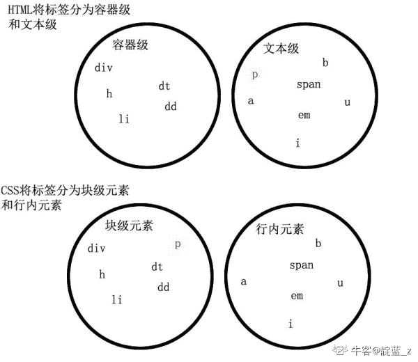
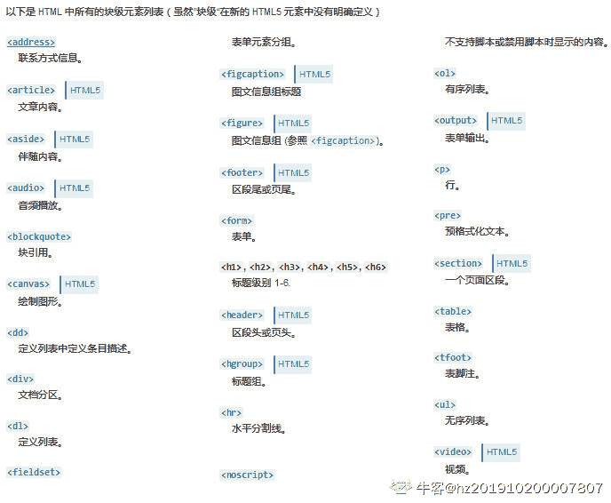
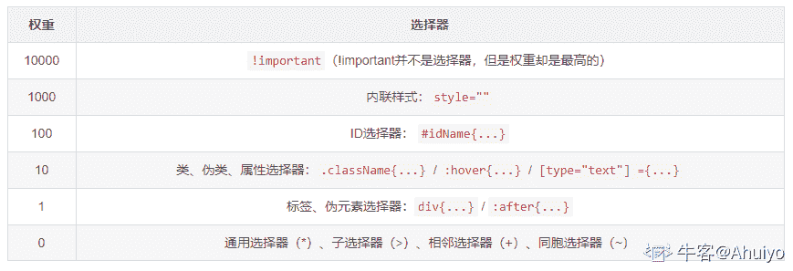
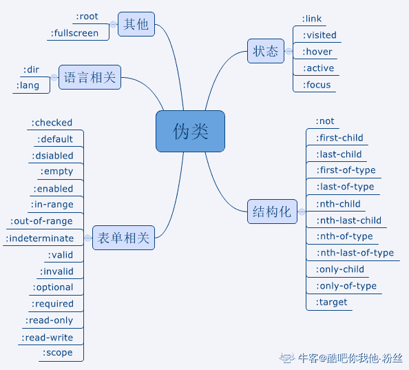
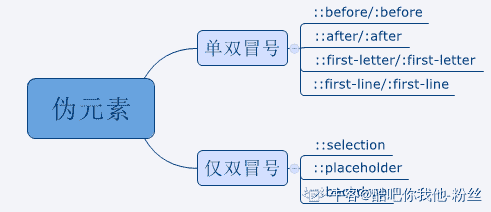
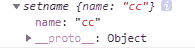
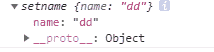
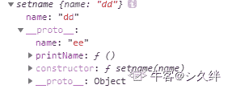

# 哔哩哔哩 2020 校园招聘前端笔试卷（一）

## 1

下面哪几个和 [`store.company.com/dir/page.html`](http://store.company.com/dir/page.html) 符合同源策略？( )

正确答案: A   你的答案: 空 (错误)

```cpp
http://store.company.com/dir2/other.htm
```

```cpp
https://store.company.com/dir/secure.html
```

```cpp
http://store.company.com:81/dir/etc.html
```

```cpp
http://news.company.com/dir/other.html
```

本题知识点

前端工程师 哔哩哔哩 2020

讨论

[周天鹏鹏鹏鹏](https://www.nowcoder.com/profile/458879727)

这道题的答案是应该是 A 吧

发表于 2019-11-23 22:34:52

* * *

[帮辅导保姆式内推字节](https://www.nowcoder.com/profile/4490016)

同源：协议、域名、端口号 本试卷的视屏解答版本：欢迎观看 b 站：[`www.bilibili.com/video/av83427212?p=6`](https://www.bilibili.com/video/av83427212)

发表于 2020-02-03 14:59:52

* * *

[浪险](https://www.nowcoder.com/profile/683173318)

同源策略：协议、域名、端口号一致
[MDN 文档链接](https://developer.mozilla.org/zh-CN/docs/Web/Security/Same-origin_policy)

发表于 2020-01-29 13:01:36

* * *

## 2

关于 DOMContentLoaded 和 load 事件说法正确的是？

正确答案: A   你的答案: 空 (错误)

```cpp
DOMContentLoaded 事件比 load 事件更早执行
```

```cpp
load 事件比 DOMContentLoaded 事件更早执行
```

```cpp
按监听代码从上到下先后执行
```

```cpp
dom 文档完全加载完后执行 load 事件
```

本题知识点

前端工程师 哔哩哔哩 2020

讨论

[浪险](https://www.nowcoder.com/profile/683173318)

1.  DOMContentLoaded
    当纯 HTML 被完全加载以及解析时，DOMContentLoaded 事件会被触发，而不必等待样式表，图片或者子框架完成加载。
2.  Load
    当一个资源及其依赖资源已完成加载时，将触发 load 事件。
    [MDN 链接](https://developer.mozilla.org/zh-CN/docs/Web/API/Document/DOMContentLoaded_event)

发表于 2020-01-29 13:07:50

* * *

[123qwer.1](https://www.nowcoder.com/profile/567724293)

在任何情况下，DOMContentLoaded 的触发不需要等待图片等其他资源加载完成。页面上所有的资源（图片，音频，视频等）被加载以后才会触发 load 事件 

发表于 2019-11-26 19:56:04

* * *

[想要 offer 的小张](https://www.nowcoder.com/profile/383142212)

求大神解答下 ，假如页面中有 defer 属性的 script 标签，这两个事件也是严格按照 A 答案吗

发表于 2019-12-31 12:19:30

* * *

## 3

如何在 div 容器里展示  这几个字符？

正确答案: C   你的答案: 空 (错误)

```cpp
<div><div></div></div>
```

```cpp
<div>"<div></div>"</div>
```

```cpp
document.querySelector('div').innerText = "<div></div>"
```

```cpp
document.querySelector('div').innerHTML = "<div>sssssss</div>"
```

本题知识点

前端工程师 哔哩哔哩 2020

讨论

[酸梅汁](https://www.nowcoder.com/profile/377380844)

innerHTML：设置或获取标签所包含的 HTML 与文本信息。（不含标签本身）innerText：设置或获取标签所包含的文本信息。（不含标签本身）outerHTML：设置或获取标签本身以及所包含的 HTML 与文本信息。（包含标签本身）outerText：设置或获取标签本身以及所包含的文本信息。（包含标签本身）例如：<div id="div1">
        <p id="p1">this is text</p>
</div>
    <script>
        var div=document.getElementsByTagName("div");
        console.log(div[0].innerHTML);      //  <p id="p1">this is text</p>
        console.log(div[0].innerText);         //  this is text
        console.log(div[0].outerHTML);     // <div id="div1"><p id="p1">this is text</p></div>
        console.log(div[0].outerText);        //  this is text
    </script>

发表于 2020-02-24 15:26:57

* * *

## 4

以下是哪一组全是块级元素？

正确答案: B   你的答案: 空 (错误)

```cpp
div i h2 li
```

```cpp
div p h1 ul
```

```cpp
li ul h3 span
```

```cpp
p h4 canvas em
```

本题知识点

前端工程师 哔哩哔哩 2020

讨论

[靛蓝 _z](https://www.nowcoder.com/profile/585869957)



发表于 2020-02-14 18:54:53

* * *

[hz201910200007807](https://www.nowcoder.com/profile/814729905)



发表于 2019-11-27 12:58:57

* * *

## 5

hello, 
这个 div 里面最终的字体颜色是什么？
.box{
  color:#999;
}

.box{
  color:#333 !important;
}

.box2{
  color:#666
}

正确答案: C   你的答案: 空 (错误)

```cpp
#999
```

```cpp
#222
```

```cpp
#333
```

```cpp
#666
```

本题知识点

前端工程师 哔哩哔哩 2020

讨论

[Ahuiyo](https://www.nowcoder.com/profile/443955132)

本题涉及到 CSS 权重等级的比较

**css 选择器权重列表如下：**


发表于 2020-01-13 10:38:54

* * *

[阿德在学习](https://www.nowcoder.com/profile/992192426)

!important 优先级最高，所以选择 C

发表于 2019-11-29 18:05:50

* * *

[发飙的喜羊羊](https://www.nowcoder.com/profile/454681667)

！important 表示优先  box 在第一个

发表于 2019-11-25 15:38:37

* * *

## 6

以下不是 box-sizing 的属性是？

正确答案: B   你的答案: 空 (错误)

```cpp
border-box
```

```cpp
auto
```

```cpp
content-box
```

```cpp
inherit
```

本题知识点

前端工程师 哔哩哔哩 2020

讨论

[钢铁·爱德华](https://www.nowcoder.com/profile/339727659)

| content-box |     这是由 CSS2.1 规定的宽度高度行为。    宽度和高度分别应用到元素的内容框。    在宽度和高度之外绘制元素的内边距和边框。 |
| border-box |     为元素设定的宽度和高度决定了元素的边框盒。    就是说，为元素指定的任何内边距和边框都将在已设定的宽度和高度内进行绘制。    通过从已设定的宽度和高度分别减去边框和内边距才能得到内容的宽度和高度。 |
| inherit | 规定应从父元素继承 box-sizing 属性的值。 |

发表于 2019-12-06 12:16:53

* * *

## 7

以下不是 CSS 伪类选择器的是？

正确答案: C   你的答案: 空 (错误)

```cpp
:first-child()
```

```cpp
:before
```

```cpp
:center
```

```cpp
:after
```

本题知识点

前端工程师 哔哩哔哩 2020

讨论

[帮辅导保姆式内推字节](https://www.nowcoder.com/profile/4490016)

伪元素和伪类： 本试卷的视屏解答版本：欢迎观看 b 站：[`www.bilibili.com/video/av83427212?p=6`](https://www.bilibili.com/video/av83427212)

发表于 2020-02-03 15:02:10

* * *

[123qwer.1](https://www.nowcoder.com/profile/567724293)

伪元素和伪类也不同呀。，。这个题谁出的 拖出去加班 不过利用小学老师讲的两个错的选那个更错的的做法，答案没啥毛病

编辑于 2020-11-22 15:08:45

* * *

[WEBJ2EE](https://www.nowcoder.com/profile/3930151)

同意楼上。。。这个题有小瑕疵。。 选 C 是没毛病

发表于 2020-01-11 19:23:33

* * *

## 8

‘-1 >>> 32 的值为(  )’

正确答案: D   你的答案: 空 (错误)

```cpp
-1
```

```cpp
1
```

```cpp
0
```

```cpp
2³²-1
```

本题知识点

前端工程师 哔哩哔哩 2020

讨论

[hz201910200007807](https://www.nowcoder.com/profile/814729905)

>>这个是带符号右移
>>> 这个是无符号右移

无符号右移运算符（>>>）

> 按二进制形式把所有的数字向右移动对应位数，低位移出(舍弃)，高位的空位补零。对于正数来说和带符号右移（>>） 相同，但是对于负数来说不同。

正数

例：20 >> 2
1、首先转化为二进制，20 的二进制为 0001 0100
2、将二进制数向右移两位，高位补符号位（0），得到 0000 0101
3、最后将二进制数转化成十进制数，0000 0101 转化为十进制为 5
所以，20 >> 2 = 5
负数

例：-20 >> 2
1、首先转化为二进制，20 的二进制为 1110 1100   //取反加 1  20 的二进制为 0001 0100 取反得到 1110 1011 加 1 后得到 1110 1100
2、将二进制数向右移两位，高位补符号位（1），得到 1111 1011
3、最后将二进制数转化成十进制数，1111 1011 转化为十进制为-5  //取反 0000 0100 加 1   0000 0101 因为是负数，也就是 1000 0101 也就是 2 的 2 次方加 2 的零次方 等于-5
所以，-20 >> 2 = -5
————————————————
版权声明：本文为 CSDN 博主「伏都哥哥」的原创文章，遵循 CC 4.0 BY-SA 版权协议，转载请附上原文出处链接及本声明。
原文链接：[`blog.csdn.net/engerla/article/details/90115168`](https://blog.csdn.net/engerla/article/details/90115168)1 的二进制 00000000 00000000 00000000 00000001-1 的二进制 10000000 00000000 00000000 00000001 取反加 1 得到补码 11111111 11111111 11111111 11111111  //首位不变，其余为取反右移 32 位（高位补符号位 1） 也就是 11111111 11111111 11111111 11111111  //32 位
假设该数值加上一也就是变成 1 00000000 00000000 00000000 00000000  //1 后面有 32 个 0
那就把刚才加上的 1 减掉也就是结果 2³²-1
欢迎指正若有说的不对的地方，或是更好的方法，欢迎留言指教，共同学习

发表于 2019-11-27 13:36:22

* * *

[浪险](https://www.nowcoder.com/profile/683173318)

| 符号 | 功能 | 补位 |
| >> | 有符号右移 | 正补 0，负补 1 |
| >>> | 无符号右移 | 正负皆补 0，且结果必为正数 |

1.  MDN 文档介绍说右操作数应小于 32，而通过网上资料表明，不小于 32 时，实际的右移位数为 d=d%32(d 为右操作数)，故可得本例子实际右移位数 32%32=0，相当于没有移动

2.  负数的二进制为正数的二进制取反加 1

    | 10 进制 | 2 进制 |
    | 1 | 0000 0000 0000 0000 0000 0000 0000 0001 |
    | -1 | 1111 1111 1111 1111 1111 1111 1111 1111 |

由序号 1 说明-1 没有移动，因此-1 的二进制就是结果
为了便于表示，进行+1 操作得：
1 0000 0000 0000 0000 0000 0000 0000 0000 -> 2³²
再进行-1 得：2³²-1
所以最终选 D

详细请参考[MDN 按位操作符](https://developer.mozilla.org/zh-CN/docs/Web/JavaScript/Reference/Operators/Bitwise_Operators#Unsigned_right_shift)

编辑于 2020-01-29 21:40:10

* * *

[阿德在学习](https://www.nowcoder.com/profile/992192426)

懵对的

发表于 2019-11-29 18:14:57

* * *

## 9

[1 正确答案: A   你的答案: 空 (错误)

```cpp
[true, true]
```

```cpp
[true, false]
```

```cpp
[false, true]
```

```cpp
[false, false]
```

本题知识点

前端工程师 哔哩哔哩 2020

讨论

[鸽子球](https://www.nowcoder.com/profile/1182263)

[1 < 2 < 3, 3 < 2 < 1]1<2 => truetrue < 3 => true // true 自动转换为 13<2 => falsefalse < 1 =>  true //false 自动转换为 0answer: [true, true]

发表于 2019-11-24 14:10:50

* * *

[奋斗:-)](https://www.nowcoder.com/profile/961875745)

true 为 1，false 为 0
[1 < 2 < 3, 3 < 2 < 1]
[true < 3, false < 1]
[1 < 3, 0 < 1]
[true, true]

发表于 2020-04-23 16:34:09

* * *

[Jachin-x](https://www.nowcoder.com/profile/519689225)

[true<3]=>[true];[false<1]=>[true];不赞同

编辑于 2020-12-17 09:25:56

* * *

## 10

['1', '2', '3'].map(parseInt) ( )

正确答案: D   你的答案: 空 (错误)

```cpp
[1, 2, 3]
```

```cpp
[0, 1, 2]
```

```cpp
[NaN, NaN, NaN]
```

```cpp
[1, NaN, NaN]
```

本题知识点

前端工程师 哔哩哔哩 2020

讨论

[123qwer.1](https://www.nowcoder.com/profile/567724293)

```cpp
['1', '2', '3'].map((item, index) => {
	return parseInt(item, index)
})
parseInt('1', 0) // 1  默认十进制的 1
parseInt('2', 1) // NaN 1 进制没有 2
parseInt('3', 2) // NaN,2 进制逢 2 进 1

ps 啥是 parseInt
parseInt('11',2) //二进制的 11 转换成十进制应该是 3
ppppps
['10','10','10','10','10'].map(parseInt); // [10, NaN, 2, 3, 4]
意思是 0(默认 0 是十进制)进制的十转换成十进制是多少 1 进制的十转换成十进制是多少 二进制的 10 转换成十进制是多少 。。。。。。。。。
```

编辑于 2019-12-04 13:42:53

* * *

[acxc](https://www.nowcoder.com/profile/232958856)

答案解析参考：[`www.cnblogs.com/wx1993/p/8417817.html`](https://www.cnblogs.com/wx1993/p/8417817.html)

发表于 2019-11-27 11:51:26

* * *

[君临天下 233](https://www.nowcoder.com/profile/6096500)

调用一个数组的 map 函数会将三个参数传给某个函数，也就是当前遍历的元素值，当前遍历的索引值，以及数组本身。parseint 函数可以有一个或两个参数，一个参数代表的是将当前的字符串转化成整数，第一个参数代表的 N 进制下代表的数字，第二个参数就是 N 进制里的 N（2-36），由于 parseint 至多有两个形参，所以将第三个参数忽略，只获取 map 函数传过来的前两个参数；由于数组的长度为 3，所以 parseint 函数会执行 3 次，并返回一个数组。

发表于 2020-02-10 19:55:34

* * *

## 11

let a = { c:1 }
let b = a
a = 1
b.c = 2
a.c = (?) 

正确答案: C   你的答案: 空 (错误)

```cpp
1
```

```cpp
2
```

```cpp
undefined
```

```cpp
NaN
```

本题知识点

前端工程师 哔哩哔哩 2020

讨论

[巴巴巴巴哈](https://www.nowcoder.com/profile/7943867)

let a = { c:1 }  //a 的作用域指向 {c:1} 这个地址
let b = a //b 的作用域指向 {c:1} 这个地址
a = 1 // a 指向的作用域发生改变，指向 1，但是{c:1} 这个地址还存在
b.c = 2 //改变{c:1} 这个地址中 c 的值为 2
a.c = (?) //a 指向的地址已经发生改变，没有 c 这个变量，所以返回 undefined

发表于 2019-11-27 21:59:18

* * *

[夏花爱秋叶](https://www.nowcoder.com/profile/4085682)

## 改变浅拷贝(修改对象为普通数据类型)
```cpp
            // 改变浅拷贝
            var a={c:1};
            var b=a;//浅拷贝，仅仅指向 a 所在的地址
            console.log(b===a);//true,因为指向的是同一个对象
            a=1;//a 变成了 Number 数据类型
            console.log(a);//1
            console.log(b);//{c:1};
            b.c=3;//b 变成了引用对象类型
            console.log(b);//{c:3}
            console.log(a);//1
            // 但是在 a 不再是对象之后，对 b 使用 b.c=1 就是把 b 变成了对象，a 还是一个数字，所以 b 不再等于 a
            console.log(b===a);//false
            console.log(b instanceof Object);//true
```

发表于 2020-01-12 23:22:16

* * *

[Jachin-x](https://www.nowcoder.com/profile/519689225)

let b=a,进行浅拷贝，b 指向 a 的内存地址，b 可以调用 a 对象中的 c，同时可以进行修改；a=1;a 指向的内存地址发生了变化，所以新的内存地址中没有 c 这个属性，所以访问不了，输出 undefined；

发表于 2020-12-17 09:42:30

* * *

## 12

console.log(1);
setTimeout(() => {console.log(2)}, 0);
console.log(3);
Promise.resolve(4).then(b => {
console.log(b);
});
console.log(5);

正确答案: B   你的答案: 空 (错误)

```cpp
1 2 3 4 5
```

```cpp
1 3 5 4 2
```

```cpp
1 4 2 3 5
```

```cpp
1 3 5 2 4
```

本题知识点

前端工程师 哔哩哔哩 2020

讨论

[persele](https://www.nowcoder.com/profile/256305280)

console.log() -> 同步 promise -> 异步，微任务 setTimeout ->  异步，宏任务
执行顺序: 同步 > 异步,微任务 > 异步，宏任务

发表于 2020-02-10 12:35:37

* * *

[Jachin-x](https://www.nowcoder.com/profile/519689225)

执行顺序，同步>异步(setTimeOut,Promise);其中异步又分为宏任务(setTimeOut)和微任务(Promise),微任务>宏任务；

发表于 2020-12-17 09:45:37

* * *

[hz201910200007807](https://www.nowcoder.com/profile/814729905)

js 执行机制（promise,setTimeout 执行顺序）

[`www.jianshu.com/p/b8234b3314c8`](https://www.jianshu.com/p/b8234b3314c8)

发表于 2019-11-27 14:14:00

* * *

## 13

Math.abs(-6.666) 的结果是多少?

正确答案: D   你的答案: 空 (错误)

```cpp
-6.666
```

```cpp
6
```

```cpp
-6
```

```cpp
6.666
```

本题知识点

前端工程师 哔哩哔哩 2020

讨论

[木贝](https://www.nowcoder.com/profile/975623271)

Math.abs() 转为为绝对值

发表于 2019-11-27 13:46:29

* * *

[hz201910200007807](https://www.nowcoder.com/profile/814729905)

         [js 小数取整的函数](https://www.cnblogs.com/diony/p/8630789.html)    

1.丢弃小数部分,保留整数部分

js:parseInt(7/2)

2.向上取整,有小数就整数部分加 1

js: Math.ceil(7/2)

3,四舍五入.
js: Math.round(7/2)

4,向下取整

js: Math.floor(7/2)

发表于 2019-11-27 14:15:09

* * *

[yzl520](https://www.nowcoder.com/profile/936059832)

Math.abs(*x*) 返回*x*的绝对值

Math.pow(*x*, *power*) 返回*x*的 power 次幂

Math.pow(*...nums*) 返回 nums 中每个数平方和的平方根

Math.sign(*x*) 返回表示*x*符号的 1、0、-0 或-1

Math.trunc(*x*) 返回*x*的整数部分，删除所有小数

Math.sqrt(*x*) 返回*x*的平方根

Math.cbrt(*x*) 返回*x*的立方根

Math.acos(*x*) 返回*x*的反余弦

Math.asin(*x*) 返回*x*的反正弦

Math.atan(*x*) 返回*x*的反正切

Math.cos(*x*) 返回*x*的余弦

Math.sin(*x*) 返回*x*的正弦

Math.tan(*x*) 返回*x*的正切

编辑于 2020-09-20 23:47:50

* * *

## 14

替换字符串 bilibili 替换字符串中所有的 b 变成大写 B 

正确答案: B   你的答案: 空 (错误)

```cpp
'bilibili'.delete('b', 'B')
```

```cpp
'bilibili'.replace(/b/g, 'B')
```

```cpp
'bilibili'.replace('b', 'B')
```

```cpp
'bilibili'.toUpperCase()
```

本题知识点

前端工程师 哔哩哔哩 2020

讨论

[牛客 777459450 号](https://www.nowcoder.com/profile/777459450)

replace()第一个参数可以是正则表达式/b/g 的意思是：匹配所有的 b 字符

发表于 2019-12-20 20:57:42

* * *

[hz201910200007807](https://www.nowcoder.com/profile/814729905)

```cpp
stringObject.replace(*regexp/substr*,*replacement*)
```

字符串 stringObject 的 replace() 方法执行的是查找并替换的操作。它将在 stringObject 中查找与 regexp 相匹配的子字符串，然后用 *replacement* 来替换这些子串。如果 regexp 具有全局标志 g，那么 replace() 方法将替换所有匹配的子串。否则，它只替换第一个匹配子串。

*replacement* 可以是字符串，也可以是函数。如果它是字符串，那么每个匹配都将由字符串替换。但是 replacement 中的 $ 字符具有特定的含义。如下表所示，它说明从模式匹配得到的字符串将用于替换。

发表于 2019-11-27 14:17:28

* * *

[怡儿呦呦呦](https://www.nowcoder.com/profile/916623844)

还是不太明白/b/g

发表于 2020-09-27 17:04:55

* * *

## 15

[1,2,3,4,5] 的数组的基础上 删除第一个 和 最后一位

正确答案: D   你的答案: 空 (错误)

```cpp
[1,2,3,4,5].replace(1, -1)
```

```cpp
[1,2,3,4,5].reverse(1，-1)
```

```cpp
[1,2,3,4,5].toString(-1，1)
```

```cpp
[1,2,3,4,5].slice(1, -1)
```

本题知识点

前端工程师 哔哩哔哩 2020

讨论

[piu~~](https://www.nowcoder.com/profile/77423681)

slice(1,-1)   slice 不会操作原数组，会返回一个新数组 。 表示从索引为 0 开始截取，-1 表示截取到倒数第二个，并将这个新数组返回。

发表于 2019-11-30 20:04:31

* * *

[Wang🍂201904101811603](https://www.nowcoder.com/profile/395703141)

应该是 splice

发表于 2019-11-30 00:06:15

* * *

[歪瓜 w](https://www.nowcoder.com/profile/525435279)

其实应该是，slice 的参数中只要有负数，就用数组的长度加上这个负数来确定位置。因为 slice 的第一个参数也可以是负数，同样加上数组长度。（JavaScript 高级程序设计这本书有说到这个）

发表于 2021-03-17 03:27:14

* * *

## 16

function setname(name){
 this.name = name
}
setname.prototype.printName = function(){ console.log(this.name) }
let a = new setname("cc")
a.name = "dd"
a.__proto__.name = "ee"

a.__proto__.printName()  // ?
a.printName() // ?

正确答案: A   你的答案: 空 (错误)

```cpp
ee dd
```

```cpp
cc dd
```

```cpp
ee cc
```

```cpp
ee Error
```

本题知识点

前端工程师 哔哩哔哩 2020

讨论

[迷途小学生](https://www.nowcoder.com/profile/246775)

隐式的 this 绑定。this 指向调用对象。简单来说就是看 getName()前的. 。.前面的对象就是 this 指向的方向。a.__proto__.printName()  -> this 指向 a._proto_
a.printName() -> this 指向 a

发表于 2021-07-15 14:53:21

* * *

[シ久绊](https://www.nowcoder.com/profile/902354413)

首先定义了一个函数 setname（）接下来定义了一个方法 printname
调用 new 方法生成对象传参 “cc” 此时 a 对象上面的 name 属性为 cc

接下来通过 a.name 修改属性 此时 a 对象的 name 属性为 dd

最后修改通过 a 修改构造函数中的属性 --proto--


发表于 2019-11-27 10:08:50

* * *

## 17

const players = [ {name: 'UZI', team: 'RNG', position: 'ADC'}, 
{name: 'theshy', team: 'IG', position: 'TOP'}, 
{name: 'Metoer', team: 'BLG', position: 'Jungle'},
{name: 'ADD', team: 'BLG', position: 'TOP'},
{name: 'Scout', team: 'EDG', position: 'Middle'},
{name: 'iBoy', team: 'EDG', position: 'ADC'},
{name: 'Baolan', team: 'IG', position: 'Support'}, 
{name: 'Xiaohu', team: 'RNG', position: 'Middle'}] 
获取列表中战队名是 BLG 位置上路的 选手对象？

正确答案: A   你的答案: 空 (错误)

```cpp
players.filter(x=&gt; x.position === 'TOP' &amp;&amp; x.team === 'BLG')
```

```cpp
players.get(position='TOP', team='BLG')
```

```cpp
players.find(position='TOP', team='BLG')
```

```cpp
players.findOne(position='TOP', team='BLG')
```

本题知识点

前端工程师 哔哩哔哩 2020

讨论

[offer 快到我碗里来-](https://www.nowcoder.com/profile/383052911)

players.filter(item=>item.position === 'TOP'  && item.team === 'BLG')[{name: "ADD", team: "BLG", position: "TOP"}]players.find(item=> item.position==='TOP' && item.team === 'BLG'){name: "ADD", team: "BLG", position: "TOP"}

发表于 2019-12-01 18:33:34

* * *

[不会切图的前端仔](https://www.nowcoder.com/profile/170329612)

看到 c 选项以为新用法，因为题目要求是一个对象

发表于 2020-10-19 14:03:22

* * *

[Sky 传说](https://www.nowcoder.com/profile/954076163)

&gt 换成>号，&amp 就是&符号，就是一个箭头函数。这是题目本身就故意写成这样？还是放到牛客上转码有问题导致的？

发表于 2022-03-15 17:25:35

* * *

## 18

找出有序数组（从小到大排列）中和为 sum 的两个数，要求复杂度为 O(n)，找到一组即可

本题知识点

前端工程师 哔哩哔哩 2020

讨论

[牛客 522196877 号](https://www.nowcoder.com/profile/522196877)

```cpp
function solve (arr, target) {
  let i = 0
  let j = arr.length - 1
  let first, last

  while (i < j) {
    first = arr[i]
    last = arr[j]
    const sum = first + last
    if (sum === target) return [first, last]
    else if (sum > target) j--
    else i++
  }

  return null
}
```

发表于 2020-03-03 15:47:52

* * *

[牛客 137496344 号](https://www.nowcoder.com/profile/137496344)

```cpp
var n = parseInt(readline());
var line = readline().split(" ");
var arr = [];
for(var i=0;i<n;i++){
    arr[i] = parseInt(line[i]);
}
var sum = parseInt(readline());
var left = 0,right = n-1;
var str = "";
while(left<right){
    var temp = arr[left]+arr[right];
    if(temp<sum){
        left++;
    }else if(temp>sum){
        right--;
    }else{
        str = arr[left] + " " + arr[right];
        break;
    }
}
if(str){
    console.log(str);
}else{
    console.log("notfound");
}
```

发表于 2020-08-13 14:47:11

* * *

[饮风醉上眸](https://www.nowcoder.com/profile/511761712)

javascript(V8) 58ms
实现思路：用一个对象的 key 来存储遍历过的数字（value 值任意，这里用的是 0），每次循环只需判断(sum-当前值)的 key 值对应的 value 是不是为 0（为 0 就代表之前遍历过这个数字）因为只用到一个 for 循环，时间复杂度为 O(n)

```cpp
let length = parseInt(readline()),
    arg = readline().split(" "),
    sum = parseInt(readline()),
    temp = {},// 用来存储遍历过的数字的对象
     flag = 0;

for(let i = 0; i < length; i++) {
    let a = arg[i];
    let b = sum - a;
    temp[a] = 0;
    if(temp[b] === 0) {
        console.log(b+" "+a);
        flag = 1;
        break;
    }
}
if(flag === 0) {
    console.log("notfound");
}
```

发表于 2020-04-15 21:47:46

* * *

## 19

判断由"()[]{}"6 种括号组成的字符串是否合法 1\. 所有括号必须闭合 2\. 左括号必须在正确的位置闭合

本题知识点

前端工程师 哔哩哔哩 2020

讨论

[spring-breeze](https://www.nowcoder.com/profile/688356177)

```cpp
function check(str) {
  const ary = [];
  const map = {
    '[': ']',
    '{': '}',
    '(': ')',
  };
  for(let v of str) {
    if(v === '['|| v === '{'|| v === '(') {
      ary.push(v);
    } else{
      if(map[ary.pop()] !== v) {
        return false;
      }
    }
  }
  if(ary.length === 0) {
    return true;
  }
  return false;
}
```

编辑于 2020-06-24 20:57:17

* * *

[牛客 137496344 号](https://www.nowcoder.com/profile/137496344)

不利用其他函数，直接判断，简单容易理解

```cpp
var str = readline();
var n = str.length;
var arr = [];
var j=0;
for(var i=0;i<n;i++){
    switch(str[i]){
        case '(':
            arr[j++] = '(';
            break;
        case '[':
            arr[j++] = '[';
            break;
        case '{':
            arr[j++] = '{';
            break;
        case ')':
            if(arr[j-1]=='('){
                j--;
            }else{
                i=n;//跳出
            }
            break;
        case ']':
            if(arr[j-1]=='['){
                j--;
            }else{
                i=n;//跳出
            }
            break;
        case '}':
            if(arr[j-1]=='{'){
                j--;
            }else{
                i=n;//跳出
            }
            break;
    }
}
if(j==0){
    console.log("true");
}else{
    console.log("false");
}
```

发表于 2020-08-13 14:48:42

* * *

[千叶风行者](https://www.nowcoder.com/profile/89377108)

1.利用 map 实现一一对应 2.利用栈

```cpp
function IsValue(str) {
    let map = new Map([
        ['(',')'],
        ['{','}'],
        ['[',']']
    ])
    let stack = [];
    for(let i = 0 ; i < str.length ; i ++) {
        if(map.has(str[i])) { // 在左边
            stack.push(str[i])
        } else { // 在右边
            if(stack.length == 0) return false;
            let top = stack[stack.length - 1]; // 栈顶元素
            if(map.get(top) == str[i]) {
                stack.pop()
            } else {
                return false;
            }
        }
    }
    return true;
}

while(line = readline()) {
    var str = line;
    print(IsValue(str))
}
```

发表于 2020-02-05 02:48:38

* * *

## 20

有 n 级台阶，每一步可以走 1 级或 2 级，问一共有多少种走法

本题知识点

前端工程师 哔哩哔哩 2020

讨论

[persele](https://www.nowcoder.com/profile/256305280)

使用数组保存变量。比使用递归节省时间。。。 ```cpp
    function NumberOf1(number) {
      // write code here
      var arr = [1, 2]
      for (var i = 2; i < number; i++) {
        arr[i] = arr[i - 1] + arr[i - 2]
      }
      return arr[number - 1]
    }
```  发表于 2020-02-10 12:14:59

* * *

[AllWeKnow](https://www.nowcoder.com/profile/113464962)

共 n 个楼梯，第一次跳 1 阶，后面还有 n-1，有 n-1 种跳法；第一次跳两个台阶，后面还有 n-2，有 n-2 种跳法。所以递归方式是 f(n-1)+f(n-2)

```cpp
function getStairs(stair) {
    if(stair <= 0) {
        return0
    }
    if(stair === 1) {
        return1
    }
    if(stair === 2) {
        return2
    }

    return getStairs(stair - 1) + getStairs(stair - 2)
}

conststair = parseInt(readline())
console.log(getStairs(stair))

```

编辑于 2020-07-02 11:10:40

* * *

[牛客 570032122 号](https://www.nowcoder.com/profile/570032122)

```cpp
function getCount(n) {
  let count = 1
  for (let i = n - 1; i >= 1; i--) {
    if (i * 2 < n) {
      return count
    }
    if (i * 2 === n) {
      return count += 1
    }
    count += i
  }
  return count
}
```

发表于 2020-05-20 19:23:23

* * *