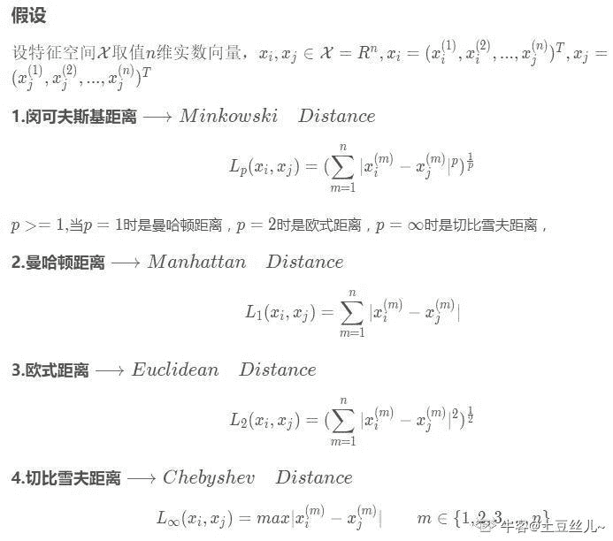
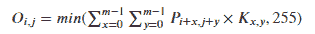

# 哔哩哔哩 2020 校园招聘算法笔试卷（一）

## 1

设已有说明语句“int a=5;”，则执行语句“a+=a*=a%=3;”后，a 的值为

正确答案: A   你的答案: 空 (错误)

```cpp
8
```

```cpp
18
```

```cpp
0
```

```cpp
2
```

本题知识点

数据分析工程师 数据挖掘工程师 哔哩哔哩 算法工程师 2020

讨论

[tpg](https://www.nowcoder.com/profile/110132000)

原式：a+=a*=a%=3a%=3 等价于：a=a%3，a=2，a%3=2a*=a%=3 等价于：a=a*(a%=3)，a=a*2，因上式 a=2，所以，a=2*2，a=4，a*(a%=3)=4a+=a*=a%=3 等价于：a=a+a*(a%=3)，因上式 a*(a%=3)=4，a=4 所以，a=4+4a=8

发表于 2019-11-24 16:58:53

* * *

[向代码进击的小怪兽](https://www.nowcoder.com/profile/463075916)

从右往左运算

发表于 2020-08-13 11:06:19

* * *

## 2

以下关于 this 指针的叙述中正确的是

正确答案: D   你的答案: 空 (错误)

```cpp
任何与类相关的函数都有 this 指针
```

```cpp
类的成员函数都有 this 指针
```

```cpp
类的友元函数都有 this 指针
```

```cpp
类的非静态成员函数才有 this 指针
```

本题知识点

数据分析工程师 数据挖掘工程师 哔哩哔哩 算法工程师 2020

讨论

[Shenxzhen](https://www.nowcoder.com/profile/412704699)

this 是 C++中的一个关键字，也是一个 const 指针，它指向当前对象，通过它可以访问当前对象的所有成员；（1）this 可以访问类的所有成员，包括 private、protected、public；（2）this 是 const 指针，它的值不能被修改的。（3）this 只能在成员函数内部使用，不能在其他地方使用。（4）只有当对象被创建后 this 才有意义，因此不能在 static 成员函数中使用。（6）友元函数没有 this，要访问非 static 成员时，需要对象做参数；要访问 static 成员或全局变量时，则不需要对象做参数；

发表于 2020-09-03 10:04:17

* * *

## 3

以下程序存在的问题是：

```cpp
void fun() 
{
 int *num1, *num2; 
 num1 = new int[10]; 
 num2 = new int[20]; 
 num1[0] = 100; 
 num2[0] = 300; 
 num1 = num2; 
 delete [] num1; 
}
```

正确答案: C   你的答案: 空 (错误)

```cpp
num2 不能给 num1 赋值
```

```cpp
num2 最初指向的空间没有释放
```

```cpp
num1 最初指向的空间没有释放
```

```cpp
程序没有问题
```

本题知识点

数据分析工程师 数据挖掘工程师 哔哩哔哩 算法工程师 2020

讨论

[Shenxzhen](https://www.nowcoder.com/profile/412704699)

指针问题；用同类型的指针 num2 对 num1 进行赋值，则 num1 指向 num2 的地址；所以释放 num1 的空间也就是释放了 num2，而之前 num1 的空间未得到释放。

发表于 2020-09-03 10:00:03

* * *

## 4

一个数组长度为 n。指定数组内的一个元素，把数组内小等于该元素的，放在该元素左边，把数组内大于该元素的，放在该元素右边。这个需要多少次操作

正确答案: A   你的答案: 空 (错误)

```cpp
O(n)
```

```cpp
O(log n)
```

```cpp
O(nlogn)
```

```cpp
O(n²)
```

本题知识点

数据分析工程师 数据挖掘工程师 哔哩哔哩 算法工程师 2020

讨论

[想冬眠的老鼠](https://www.nowcoder.com/profile/898770422)

因为根本就不是完完全全的排序问题，只是一次遍历然后挪位置

发表于 2021-07-20 22:07:16

* * *

[_wzd](https://www.nowcoder.com/profile/239531910)

A， 可以用一个双端队列的结构来实现，因为没有要求对元素排序，所以可以实现，将小于该元素的值加入队首，大于该元素的值压入队尾

发表于 2020-12-18 22:03:52

* * *

[金龙月轩寰语唐舞麟](https://www.nowcoder.com/profile/460271330)

选 A

发表于 2020-12-18 15:25:39

* * *

## 5

如果只用比较、交互、赋值等操作，而不能使用算数操作（加减乘除等），将一个数组排序，最少需要多少次操作？

正确答案: C   你的答案: 空 (错误)

```cpp
Ω(log n)
```

```cpp
Ω(n)
```

```cpp
Ω(nlogn)
```

```cpp
Ω(nloglogn)
```

本题知识点

数据分析工程师 数据挖掘工程师 哔哩哔哩 算法工程师 2020

讨论

[放弃幻想，准备战斗](https://www.nowcoder.com/profile/6544134)

不能用加减乘除，说明不能用线性排序，如桶排序等。基于比较的排序算法性能最好是 O(nlogn)

发表于 2020-06-23 21:34:10

* * *

[艾沃鹿森](https://www.nowcoder.com/profile/640241259)

选择排序最小时间复杂度

发表于 2019-11-25 17:41:14

* * *

## 6

以下哪个集合不是凸(convex)的?

正确答案: C   你的答案: 空 (错误)

```cpp
{ (x, y) | (x -2)² + (y-2)² <= 2}
```

```cpp
空集合
```

```cpp
{x | ||x|| >= 1}， ||x||表示 x 的绝对值
```

```cpp
{(x, y) | x + y = 2}
```

本题知识点

数据分析工程师 数据挖掘工程师 哔哩哔哩 算法工程师 2020

讨论

[北美蔡徐坤](https://www.nowcoder.com/profile/956831750)

凸集合定义：集合中的任意两点连线的点都在该集合中，则称该集合为凸集；凹集为非凸集。

发表于 2020-09-04 13:06:32

* * *

## 7

假设每天投稿池中，每 1000 个视频中会有 1 个营销号视频，为了净化社区环境，b 站同事训练了一个检测营销号视频的模型。模型评估结果如下：如果某视频是营销号视频，就一定会被模型检测出来，但是如果某视频是正常视频，也会有 1%的概率被误判成营销号视频。提问：现在有一个新投稿的视频，被模型判定成了营销号视频，那么它原本真正是营销号视频的概率是多少（）

正确答案: B   你的答案: 空 (错误)

```cpp
0.01099
```

```cpp
0.09099
```

```cpp
0.001
```

```cpp
0.99 
```

本题知识点

数据分析工程师 数据挖掘工程师 哔哩哔哩 算法工程师 2020

讨论

[zxbzsb](https://www.nowcoder.com/profile/703541613)

事件 A = 原本是营销号  P（A） = 0.001；事件 B = 原本是正常号 P(B)=0.999；事件 C = 判定为营销号 P（C）= P（A）*P（C|A）+P（B）*P（C|B）=0.01099【P（C|A）=1；P（C|B）=0.01】P（A|C）=P（A*C）/P（C）P（A*C）= P（A）*P（C|A） 

发表于 2020-05-09 16:33:03

* * *

[lovecci](https://www.nowcoder.com/profile/754651731)

1000 个中被检测出来的有 1+9.99 个视频，所以 1/10.99=0.09099

编辑于 2019-11-25 19:42:29

* * *

[面试官，您看我还有机会吗](https://www.nowcoder.com/profile/582749953)

X：是否为营销号 Y：预测为营销号由题意有 P(X = 1) = 0.001、P(X = 0) = 0.999、P(Y = 1 | X = 1) = 1、P(Y = 1 | X = 0) = 0.01；由贝叶斯公式有：P(X = 1 | Y = 1) = [P(Y = 1 | X = 1) P(X = 1) ] /**P(Y = 1)** = (1*0.001) / **(0.01*0.999+1*0.001)** = 1 / 10.99 = 0.09099 注：**P(Y = 1) **= P(Y = 1 | X = 0) P(X = 0)  + P(Y = 1| X = 1) P(X = 1) 

发表于 2020-08-30 10:30:59

* * *

## 8

神经网络中的 dropout 的效果跟以下哪种机器学习方法的效果类似

正确答案: B   你的答案: 空 (错误)

```cpp
Boostraping
```

```cpp
Bagging
```

```cpp
Boosting
```

```cpp
Stacking
```

本题知识点

数据分析工程师 数据挖掘工程师 哔哩哔哩 算法工程师 2020

讨论

[绿蚁红泥](https://www.nowcoder.com/profile/426128312)

dropout 可以看作是多个模型的平均

发表于 2020-04-01 11:29:02

* * *

## 9

向量 A=[1, 3, 6, 4, -9, 0]的 L1 范数为

正确答案: B   你的答案: 空 (错误)

```cpp
1
```

```cpp
23
```

```cpp
5
```

```cpp
12
```

本题知识点

数据分析工程师 数据挖掘工程师 哔哩哔哩 算法工程师 2020

讨论

[yuh](https://www.nowcoder.com/profile/562983728)

L1 范数，是指向量中各个元素绝对值之和。

发表于 2019-11-25 17:23:21

* * *

## 10

给定一个离散型随机变量 x 的分布 P(x)，这个变量的熵(entropy)定义为 sum-P(xi)*log(P(xi))，那么当熵的值逐渐升高时，说明:

正确答案: B   你的答案: 空 (错误)

```cpp
变量的分布逐渐突出化
```

```cpp
变量的分布逐步平均化
```

```cpp
变量的分布维持不变
```

```cpp
变量的分布随机变化
```

本题知识点

数据分析工程师 数据挖掘工程师 哔哩哔哩 算法工程师 2020

讨论

[向代码进击的小怪兽](https://www.nowcoder.com/profile/463075916)

熵(entropy)一般刻画数据的混乱程度（分布平均情况）。熵越高,说明分布越均匀。

发表于 2020-08-13 11:52:01

* * *

## 11

在神经网络中，第一层的激活函数为 Relu：f(t) = max(0, t)，其中 t = w*x + b，x 为 instance 输入，w 和 b 为模型参数，如果一个 instance 在这里的输入值对应 t=-1，那么在 backpropagate 计算参数的梯度时，对于这个 instance 来说，传过这个激活函数的梯度值为

正确答案: B   你的答案: 空 (错误)

```cpp
1
```

```cpp
0
```

```cpp
-1
```

```cpp
2
```

本题知识点

数据分析工程师 数据挖掘工程师 哔哩哔哩 算法工程师 2020

讨论

[零葬](https://www.nowcoder.com/profile/75718849)

instance 已经小于 0 了，relu 激活函数在小于 0 的部分梯度为 0

发表于 2020-12-28 18:10:36

* * *

[lovecci](https://www.nowcoder.com/profile/754651731)

这个激活函数类似 ReLU 函数，小于 0 的话梯度为 0

发表于 2019-11-25 19:46:50

* * *

## 12

强化学习中一般会加入 explore 策略，以避免 agent 过早陷入到局部最优解，以下哪个不是常用的 explore 策略

正确答案: C   你的答案: 空 (错误)

```cpp
epsilon greedy
```

```cpp
entropy regulation
```

```cpp
dropout
```

```cpp
curiosity reward
```

本题知识点

数据分析工程师 数据挖掘工程师 哔哩哔哩 算法工程师 2020

讨论

[tingfx4yu](https://www.nowcoder.com/profile/477160860)

a 是 off policy 的探索方法，b 用熵也是很经典的探索，比较出名的 sac 算法用的这个 dropout 就完全不是这里得了，d 只要有好奇心就必定是探索来的

发表于 2020-04-30 08:36:13

* * *

[钟如劼](https://www.nowcoder.com/profile/7952877)

Dropout as posterior approximation 不是也用到了 dropout 来做 exploration 吗

发表于 2021-09-15 23:23:41

* * *

## 13

对参数 w 的 L1 正则等价于 w 的先验服从

正确答案: D   你的答案: 空 (错误)

```cpp
高斯分布
```

```cpp
泊松分布
```

```cpp
伯努利分布
```

```cpp
拉普拉斯分布
```

本题知识点

数据分析工程师 数据挖掘工程师 哔哩哔哩 算法工程师 2020

讨论

[牛客 733689857 号](https://www.nowcoder.com/profile/733689857)

L1 遵从拉普拉斯分布，L2 遵从高斯分布

发表于 2020-07-25 20:09:10

* * *

## 14

以下只需要局部拟合监督数据的算法是

正确答案: C   你的答案: 空 (错误)

```cpp
SVM
```

```cpp
Logistic Regression
```

```cpp
kNN
```

```cpp
Decision Tree
```

本题知识点

数据分析工程师 数据挖掘工程师 哔哩哔哩 算法工程师 2020

## 15

模型的 bias 过高，如何降低

正确答案: B   你的答案: 空 (错误)

```cpp
在特征空间中减少特征
```

```cpp
在特征空间中增加特征
```

```cpp
增加数据点
```

```cpp
在特征空间中增加特征，和增加数据点
```

本题知识点

数据分析工程师 数据挖掘工程师 哔哩哔哩 算法工程师 2020

讨论

[面试官，您看我还有机会吗](https://www.nowcoder.com/profile/582749953)

偏差高 <=> 欠拟合。故而需要添加特征，以增强模型学习能力。

编辑于 2020-08-30 10:39:52

* * *

## 16

以下关于 Logistic Regression(LR) 与 SVM 的联系和区别的说法中, 错误的是

正确答案: D   你的答案: 空 (错误)

```cpp
LR 可以产生概率输出, SVM 不能产生概率输出
```

```cpp
SVM 可以处理非线性分类任务
```

```cpp
LR 和 SVM 损失函数不同
```

```cpp
SVM 是经验风险最小化，LR 是结构风险最小化
```

本题知识点

数据分析工程师 数据挖掘工程师 哔哩哔哩 算法工程师 2020

讨论

[狂奔的菜鸡](https://www.nowcoder.com/profile/419358164)

```cpp
LR 是经验风险最小化，SVM 是结构风险最小化
```

发表于 2020-09-03 19:27:28

* * *

## 17

不属于判别模型的算法是:

正确答案: B   你的答案: 空 (错误)

```cpp
k 近邻法
```

```cpp
朴素贝叶斯
```

```cpp
决策树
```

```cpp
条件随机场
```

本题知识点

数据分析工程师 数据挖掘工程师 哔哩哔哩 算法工程师 2020

讨论

[向代码进击的小怪兽](https://www.nowcoder.com/profile/463075916)

涉及到联合概率分布的，都属于生成模型，比如朴素贝叶斯、隐马尔科夫模型。朴素贝叶斯的模型特点就是采用特征与类别的联合概率分布，条件独立假设。k 近邻法、决策树、条件随机场都属于判别模型。

发表于 2020-08-13 12:06:08

* * *

## 18

现有 6 个相同的抽屉，一个小球等可能得存在于其中任何一个抽屉，也可能隐藏于抽屉之外(其概率为 1/8)。一个人检查完前 5 个抽屉，都没有发现该小球，那么此时小球在第 6 个抽屉的概率是多少?

正确答案: C   你的答案: 空 (错误)

```cpp
1/6
```

```cpp
5/13
```

```cpp
7/13
```

```cpp
7/8
```

本题知识点

数据分析工程师 数据挖掘工程师 哔哩哔哩 算法工程师 2020

讨论

[XzlXcc](https://www.nowcoder.com/profile/824891608)

假设 A=小球在第 6 个抽屉的概率，B=小球不在前 5 个抽屉的概率。P(A)=P(AB)=(1-1/8)/6=7/48, P(B)=(1-1/8)/6+1/8=13/48, 所以 P(A|B)=P(AB)/P(B)=7/13。

发表于 2020-07-19 21:00:10

* * *

## 19

关于 L1、L2 正则化下列说法正确的是

正确答案: C   你的答案: 空 (错误)

```cpp
L2 正则化能防止过拟合，提升模型的泛化能力，但 L1 做不到这点
```

```cpp
L2 正则化技术又称为 Lasso Regularization
```

```cpp
L1 正则化得到的解更加稀疏
```

```cpp
L2 正则化得到的解更加稀疏
```

本题知识点

数据分析工程师 数据挖掘工程师 哔哩哔哩 算法工程师 2020

讨论

[斑海铭](https://www.nowcoder.com/profile/253983355)

加上 L2 范数惩罚项以后，较突出的参数在平方过后会更加突出（要么是自己更大了，要么别人更小了），所以 L2 范数会更大，为了防止这种情况发生，参数会训练得较为扁平

发表于 2020-09-03 09:55:05

* * *

## 20

下列哪一项在神经网络中引入了非线性

正确答案: B   你的答案: 空 (错误)

```cpp
随机梯度下降
```

```cpp
修正线性单元（ReLU）
```

```cpp
卷积函数
```

```cpp
其他都不正确
```

本题知识点

数据分析工程师 数据挖掘工程师 哔哩哔哩 算法工程师 2020

讨论

[狂奔的菜鸡](https://www.nowcoder.com/profile/419358164)

```cpp
relu 一阶导数不是常数，非线性
```

发表于 2020-09-03 20:16:10

* * *

## 21

下面关于 Minkowski distance 的表述，错误的是

正确答案: B   你的答案: 空 (错误)

```cpp
p=1 时，Minkowski distance 即 Manhattan distance
```

```cpp
对于任意的 p > 0, Minkowski distance 满足三角不等式：distance（x，z）<= distance(x,y) + distance(y,z)
```

```cpp
p=2 时， Minkowski distance 即经典的欧式距离
```

```cpp
p->+∞时，Minkowski distance 等于对应分量的最大绝对距离
```

本题知识点

数据分析工程师 数据挖掘工程师 哔哩哔哩 算法工程师 2020

讨论

[零葬](https://www.nowcoder.com/profile/75718849)

0

发表于 2020-10-13 16:57:11

* * *

[向代码进击的小怪兽](https://www.nowcoder.com/profile/463075916)



发表于 2020-08-13 12:21:00

* * *

## 22

下列聚类算法，需要使用样本 label 信息的算法是

正确答案: C   你的答案: 空 (错误)

```cpp
K-Means
```

```cpp
DBSCAN
```

```cpp
Learning Vector Quantization
```

```cpp
高斯混合聚类
```

本题知识点

数据分析工程师 数据挖掘工程师 哔哩哔哩 算法工程师 2020

讨论

[m22453](https://www.nowcoder.com/profile/888770998)

K-Means、DBSCAN、GMM 三个选项都是聚类中的经典算法

发表于 2020-02-23 09:20:51

* * *

[tiffanysun](https://www.nowcoder.com/profile/356557876)

学习矢量量化(Learning Vector Quantization,LVQ),是一种用于模式分类的有监督的学习算法,也是一种结构简单、功能强大的有监督的神经网络分类算法

发表于 2020-02-08 14:02:46

* * *

## 23

长度为 N 的字符串匹配长度为 M 的子串的算法复杂度是：

正确答案: B   你的答案: 空 (错误)

```cpp
O(N)
```

```cpp
O(M+N)
```

```cpp
O(N+logM)
```

```cpp
O(M+logN)
```

本题知识点

数据分析工程师 数据挖掘工程师 哔哩哔哩 算法工程师 2020

讨论

[牛客 946458706 号](https://www.nowcoder.com/profile/946458706)

BKMP 算法

发表于 2020-03-23 22:41:29

* * *

[艾沃鹿森](https://www.nowcoder.com/profile/640241259)

KMP 算法

发表于 2019-11-25 17:40:25

* * *

## 24

假设现在需要对一串数字字符串进行解码，我们知道该字符串的编码规则是

1->A

2->B

...

26->Z

输出数字 N 代表有多少种可能的结果

本题知识点

数据分析工程师 数据挖掘工程师 哔哩哔哩 算法工程师 2020

讨论

[CharlesKung](https://www.nowcoder.com/profile/801924572)

```cpp
encode = input().strip()

def insert_incep(s,count):
    #final char
    if len(s) == 1 and s != '0':
        count.append(1)
    #left 2 char
    elif len(s) == 2:
        if 0 < int(s) <= 26 and (s[0] == '0'&nbs***bsp;s[1] == '0'):
            count.append(1)
        elif 0 < int(s) <= 26:
            count.append(2)
        elif int(s) > 26 :
            count.append(1)
    else:
        if int(s[0:2]) <= 26 and (s[0] != '0' and s[1] != '0'):
            insert_incep(s[2:],count)
            insert_incep(s[1:],count)
        else :
            insert_incep(s[1:],count)

count = []

insert_incep(encode,count)

print(sum(count))
```

发表于 2020-11-05 17:09:00

* * *

[零葬](https://www.nowcoder.com/profile/75718849)

```cpp
import java.io.BufferedReader;
import java.io.InputStreamReader;
import java.io.IOException;

public class Main {
    public static void main(String[] args) throws IOException {
        BufferedReader br = new BufferedReader(new InputStreamReader(System.in));
        String num;
        while((num = br.readLine()) != null){
            System.out.println(numDecodings(num));
        }
    }

    // 动态规划求解
    private static int numDecodings(String s) {
        if(s.length() == 0 || s.charAt(0) == '0') return 0;
        int dp[] = new int[s.length() + 1];
        dp[0] = 1;
        dp[1] = 1;
        for(int i = 2; i <= s.length(); i++){
            // 先考虑一位数的状态转移
            if(s.charAt(i - 1) != '0')
                dp[i] += dp[i - 1];
            // 再考虑两位数的状态转移
            if(Integer.valueOf(s.substring(i - 2,i)) >= 10
               && Integer.valueOf(s.substring(i - 2,i)) <= 26){
                dp[i] += dp[i - 2];
            }
        }
        return dp[s.length()];
    }
}
```

 发表于 2020-10-13 16:59:15

* * *

[MathStarry](https://www.nowcoder.com/profile/198506783)

```cpp
s = input()
n = len(s)
dp = [0] * (n+2)
dp[0] = dp[1] = 1
for i in range(n):
    if '1' <= s[i] <= '9':
        dp[i+2] += dp[i+1]
    if i > 0 and '10' <= s[i-1:i+1] <= '26':
        dp[i+2] += dp[i]
print(dp[-1])
```

发表于 2020-09-04 16:16:20

* * *

## 25

在图像处理中，卷积是常用的技术，现有 P(h,w)的的图片，像素值为[0, 255]的整数。卷积核为 K(m, m)的矩阵，元素值为[0, 1.]的浮点数，输出图像大小为 O(h - m + 1, w - m + 1)，其中 h>=m, w>=m。卷积后中的图片 O 元素值计算如下，其中最后的输出像素值为向下取整的整数



现输入图片 P 和卷积核 K，输出卷积后的图片 O，图片按行输出，行内空格分隔。

第 1 行输入图片的大小 h、w 由空格分隔。

第 2 行到 h+1 行输入由空格分隔的 w 个像素值。

第 h+2 输入卷积核大小 m。

第 h+3 行到 h+2+m 行输入由空格分隔的 m 卷积核值

本题知识点

数据分析工程师 数据挖掘工程师 哔哩哔哩 算法工程师 2020

讨论

[零葬](https://www.nowcoder.com/profile/75718849)

```cpp
import java.io.BufferedReader;
import java.io.InputStreamReader;
import java.io.IOException;
import java.util.ArrayList;

public class Main {
    public static void main(String[] args) throws IOException {
        BufferedReader br = new BufferedReader(new InputStreamReader(System.in));
        String line;
        while((line = br.readLine()) != null){
            // 获得图片尺寸
            String[] imageSize = line.split(" ");
            int h = Integer.parseInt(imageSize[0]);
            int w = Integer.parseInt(imageSize[1]);
            int[][] image = new int[h][w];
            String[] row;
            // 获得图片数组
            for(int i = 0; i < h; i++){
                row = br.readLine().trim().split(" ");
                for(int j = 0; j < w; j++)
                    image[i][j] = Integer.parseInt(row[j]);
            }
            // 获得卷积核大小
            int k = Integer.parseInt(br.readLine());
            // 获得卷积核
            double[][] kernel = new double[k][k];
            for(int i = 0; i < k; i++){
                row = br.readLine().trim().split(" ");
                for(int j = 0; j < k; j++)
                    kernel[i][j] = Double.parseDouble(row[j]);
            }
            // 卷积
            convolution(image, kernel, h, w, k);
        }
    }

    // 卷积函数
    private static void convolution(int[][] image, double[][] kernel, int h, int w, int k) {
        // 滑窗
        for(int i = 0; i < h - k + 1; i++){
            StringBuilder row = new StringBuilder();
            for(int j = 0; j < w - k + 1; j++)
                row.append(weightSum(image, kernel, i, j) + " ");
            System.out.println(row.toString().trim());
        }
    }

    // 加权求和
    private static int weightSum(int[][] image, double[][] kernel, int rowStart, int colStart) {
        double result = 0;
        for(int i = rowStart; i < rowStart + kernel.length; i++){
            for(int j = colStart; j < colStart + kernel.length; j++)
                result += image[i][j]*kernel[i - rowStart][j - colStart];
        }
        return (int)result;
    }
}
```

 发表于 2020-10-13 17:00:22

* * *

[牛客 700653989 号](https://www.nowcoder.com/profile/700653989)

```cpp
import math
h, w = list(map(int, input().split()))
graph = []
for _ in range(h):
    graph.append(list(map(int, input().split())))
m = int(input())
kernel = []
for _ in range(m):
    kernel.append(list(map(float, input().split())))
result = [[0 for _ in range(w - m + 1)] for _ in range(h - m + 1)]
def cnn(i, j, m):
    result = 0
    for ii in range(m):
        for jj in range(m):
            result += graph[i + ii][j + jj] * kernel[ii][jj]
    return min(math.floor(result), 255)
for i in range(h - m + 1):
    for j in range(w - m + 1):
        result[i][j] = cnn(i, j, m)
for i in range(h - m + 1):
    for j in range(w - m + 1):
        if j != w - m:
            print(result[i][j], end = " ")
        else:
            print(result[i][j])
```

发表于 2020-04-06 19:10:17

* * *

[RegenFallen](https://www.nowcoder.com/profile/1909946)

 [](../../C%3A/Users/Administrator/Desktop/out//subject/index/794b355e120c4bf29aaa091d8e4c682f) 

```cpp
int a[1005][1005];
double b[1005][1005];
int ans[1005][1005];
int main() {
    ios::sync_with_stdio(0);
    int n,m,k;
    cin>>n>>m;

    forn(i,n){
        forn(j,m){
            cin>>a[i][j];
        }
    }
    cin>>k;

    forn(i,k){
        forn(j,k){
            cin>>b[i][j];
        }
    }

    for (int i = 0; i <= n - k + 1; i++){
        for (int j = 0; j <= m - k + 1; j++){
            double temp = 0;
            for(int u = 0; u <= m - 1; u++){
                for (int v = 0; v <= m - 1; v++){
                    temp += a[i+u][j+v] * b[u][v];
                }
            }
            ans[i][j] = min(int(temp), 255);

        }
    }
    for (int i =0 ;i < n - k + 1;i++){
        for (int j = 0; j < m - k + 1; j++){
            cout<<ans[i][j]<<" ";
        }
        cout<<endl;
    }
}

```

暴力模拟即可

编辑于 2020-03-24 08:57:15

* * *

## 26

复读机自从发明以来，就深受广大朋友的喜爱，并逐渐成长为人类的三大本质、灵魂属性之一。然而，在一片毫无感情的复读声中，如何优雅的复读，是立志成为高级复读机的我们的追求。例如，我们可以将复读的句子做一些简单的变换再复读出来，就可以既不打乱队形，又可以让人摸不着头脑。输入每行是一个正在被复读的句子：“qian fang gao neng"，那么我们将有奇数个字母的单词做反转，再复读出去就是："qian fang oag neng" 

本题知识点

数据分析工程师 数据挖掘工程师 哔哩哔哩 算法工程师 2020

讨论

[a_consultant](https://www.nowcoder.com/profile/288015939)

```cpp
x = input().split()
length = len(x)
x_new = []
for i in range(length):
    length_i = len(x[i])
    if length_i % 2 == 0:  # 偶数
        x_new += [x[i]]
    else:  # 奇数
        x_i_reverse = ""
        for j in range(length_i):
            x_i_reverse += x[i][length_i - j - 1]
            x_i_reverse = str(x_i_reverse)
        x_new += [x_i_reverse]
print(" ".join(x_new))
```

编辑于 2020-08-06 12:31:56

* * *

[零葬](https://www.nowcoder.com/profile/75718849)

```cpp
import java.io.BufferedReader;
import java.io.InputStreamReader;
import java.io.IOException;
import java.util.ArrayList;

public class Main {
    public static void main(String[] args) throws IOException {
        BufferedReader br = new BufferedReader(new InputStreamReader(System.in));
        String line;
        while((line = br.readLine()) != null){
            String[] words = line.trim().split(" ");
            StringBuilder sb = new StringBuilder();
            for(int i = 0; i < words.length; i++){
                if(words[i].length() % 2 == 1){
                    sb.append(reverse(words[i]) + " ");
                }else{
                    sb.append(words[i] + " ");
                }
            }
            System.out.println(sb.toString().trim());
        }
    }

    private static String reverse(String word) {
        char[] chars = word.toCharArray();
        for(int i = 0; i < chars.length / 2; i++){
            char temp = chars[i];
            chars[i] = chars[chars.length - 1 - i];
            chars[chars.length - 1 - i] = temp;
        }
        return String.valueOf(chars);
    }
}
```

发表于 2020-10-13 17:01:03

* * *

[Clannad 丶 Fan](https://www.nowcoder.com/profile/636713593)

temp =input()result =temp.split(' ')fori inrange(len(result)):    if(len(result[i]) %2):        result[i] =result[i][::-1]res =' '.join(result)print(res)

发表于 2020-09-10 09:36:21

* * *