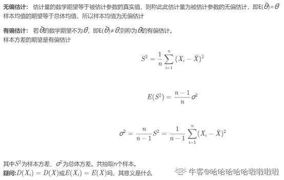
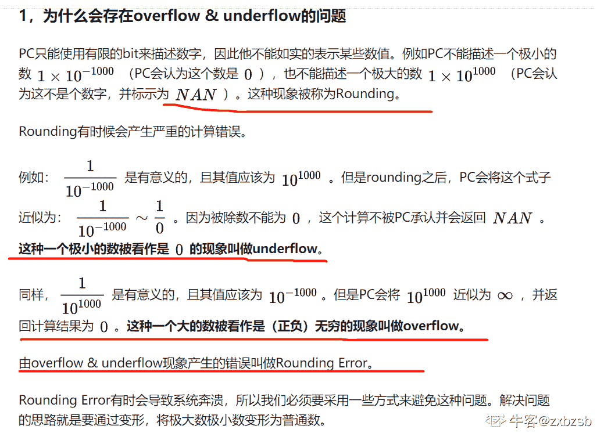

# 哔哩哔哩 2020 校园招聘算法笔试卷（二）

## 1

下列聚类算法，需要使用样本 label 信息的算法是

正确答案: C   你的答案: 空 (错误)

```cpp
K-Means
```

```cpp
DBSCAN
```

```cpp
Learning Vector Quantization
```

```cpp
高斯混合聚类
```

本题知识点

数据分析工程师 数据挖掘工程师 哔哩哔哩 算法工程师 2020

讨论

[m22453](https://www.nowcoder.com/profile/888770998)

K-Means、DBSCAN、GMM 三个选项都是聚类中的经典算法

发表于 2020-02-23 09:20:51

* * *

[tiffanysun](https://www.nowcoder.com/profile/356557876)

学习矢量量化(Learning Vector Quantization,LVQ),是一种用于模式分类的有监督的学习算法,也是一种结构简单、功能强大的有监督的神经网络分类算法

发表于 2020-02-08 14:02:46

* * *

## 2

有一观测数据集 X:{x1, x2, ..., xn}, 假设其真实分布为 N(μ，σ²)  简记其为 f(x); 现有一近似模型 h(x), 以下说法正确的是:

正确答案: D   你的答案: 空 (错误)

```cpp
近似模型的 bias 为 E[h(x) - E[h(x)]]²
```

```cpp
近似模型的 variance 为 E[h(x)] - f(x)
```

```cpp
μ为 f(x)的有偏估计
```

```cpp
σ² 为 f(x)的有偏估计
```

本题知识点

算法工程师 哔哩哔哩 2020

讨论

[哈哈哈哈哈啦啦啦啦](https://www.nowcoder.com/profile/699771332)



发表于 2020-08-13 10:51:46

* * *

## 3

以下关于贪心算法说法不正确的是:

正确答案: C   你的答案: 空 (错误)

```cpp
待求解问题必须可以分解为若干子问题
```

```cpp
每一子问题, 都可以得到局部最优解
```

```cpp
解决问题通常自底向上
```

```cpp
Dijkstra 单源最短路径算法是贪心算法
```

本题知识点

算法工程师 哔哩哔哩 2020

讨论

[一颗小虎牙](https://www.nowcoder.com/profile/544623175)

贪心算法往往是这种自顶向下的设计，先做出一个选择，然后再求解下一个问题，而不是自底向上解出许多子问题，然后再做出选择。

发表于 2020-03-12 09:13:15

* * *

[M1d](https://www.nowcoder.com/profile/451120905)

解决问题自底向上的是哪种算法啊，回溯吗

发表于 2020-03-12 10:54:41

* * *

## 4

以下哪个关于术语的描述是正确的

正确答案: B   你的答案: 空 (错误)

```cpp
数值计算中, overflow 通常是指待存储数据超过指定类型变量能表示的范围的上界
```

```cpp
数值计算中, underflow 通常是指待存储变量无限接近于 0 而指定类型变量精度不足
```

```cpp
机器学习中, overfitting 是因为模型训练数据太少
```

```cpp
机器学习中, underfitting 往往是因为模型比较弱, 使用 bagging 能有效帮助降低预估偏差
```

本题知识点

算法工程师 哔哩哔哩 2020

讨论

[zxbzsb](https://www.nowcoder.com/profile/703541613)



发表于 2020-06-04 20:46:09

* * *

[tiffanysun](https://www.nowcoder.com/profile/356557876)

```cpp
数值计算中, overflow 通常是指待存储数据超级无敌大  没边界
```

发表于 2020-02-08 14:14:21

* * *

[汪中博](https://www.nowcoder.com/profile/744319785)

C,D 怎么不对？

发表于 2020-08-13 17:50:13

* * *

## 5

快速排序的平均时间复杂度和最坏时间复杂度分别是

正确答案: B   你的答案: 空 (错误)

```cpp
O(nlogn), O(nlogn)
```

```cpp
O(nlogn), O(n²)
```

```cpp
O(nlogn), O(n*(logn)²)
```

```cpp
O(n), O(n*(logn)²)
```

本题知识点

算法工程师 哔哩哔哩 2020

## 6

以下方法不可以用于特征降维的有

正确答案: D   你的答案: 空 (错误)

```cpp
Linear Discriminant Analysis
```

```cpp
Principal Component Analysis
```

```cpp
Singular Value Decomposition
```

```cpp
Monte Carlo method
```

本题知识点

算法工程师 哔哩哔哩 2020

## 7

以下关于 ROC 曲线和 AUC 概念错误的是

正确答案: B   你的答案: 空 (错误)

```cpp
AUC 是 ROC 曲线和 x 轴围成的面积
```

```cpp
AUC 取值范围在 0.5~1 之间
```

```cpp
AUC 可以用来判断模型的优劣
```

```cpp
ROC 曲线是 FPR 和 TPR 的点连成的线
```

本题知识点

算法工程师 哔哩哔哩 2020

讨论

[茛苕叶](https://www.nowcoder.com/profile/85722243)

AUC 取值范围就是 0.5-1 之间

发表于 2020-03-26 11:14:15

* * *

[零葬](https://www.nowcoder.com/profile/75718849)

不应该是 ROC 曲线与 x 轴和 x=1 所围成的面积吗

发表于 2020-10-14 16:13:23

* * *

[方长江](https://www.nowcoder.com/profile/544787306)

AUG 定义为 ROC 去线下的面积，即 ROC 与 x 轴围城的面积，A 正确；由于 ROC 曲线一般都处于 y=x 这条直线的上方，所以 AUC 的取值范围一般在 0.5 和 1 之间，但是不排除 AUC 在 y=x 曲线下的情况；使用 AUC 值作为评价标准是因为很多时候 ROC 曲线并不能清晰的说明哪个分类器的效果更好，而作为一个数值，对应 AUC 更大的分类器效果更好。故可以用来判断模型优劣，c 正确；D 为定义

发表于 2020-08-13 11:23:00

* * *

## 8

有 8 个球，其中 7 个球等重，只有一个球比其它的球要轻。给你一个天平，要找出这个轻的球，最少要称几次？

正确答案: A   你的答案: 空 (错误)

```cpp
2
```

```cpp
3
```

```cpp
4
```

```cpp
5
```

本题知识点

算法工程师 哔哩哔哩 2020

讨论

[yuh](https://www.nowcoder.com/profile/562983728)

第一步：首先拿出 6 个球，假设为 123，456 去天平称重，剩下 7，8 出现 2 种情况第一种，一样重，则轻的出现在 7，8 当中的一个第二种，如果 123 重，则又拿出 1，2 继续称重，剩下 3 又会出现 2 种情况 1，2 一样重，则 3 为轻 1，2 不一样重，则出现在 1，2 当中的一个

编辑于 2019-11-25 20:54:23

* * *

[牛客 67699571 号](https://www.nowcoder.com/profile/67699571)

最好的情况，称一次吧，天平还不能知道左右哪个球更轻么

发表于 2020-09-04 12:41:09

* * *

## 9

以下数据结构体在 64 位机器上占用的内存（sizeof(data)）是多少：

```cpp
typedef struct _data
{
      int id;
      char name[6];
      long long time;
      char add[4];
}data
```

正确答案: B   你的答案: 空 (错误)

```cpp
16 字节
```

```cpp
32 字节
```

```cpp
64 字节
```

```cpp
128 字节
```

本题知识点

算法工程师 哔哩哔哩 2020

讨论

[牛客 734679688 号](https://www.nowcoder.com/profile/734679688)

链接：[`www.nowcoder.com/questionTerminal/e364954b58db4929a9db8a6845380c74?toCommentId=124956`](https://www.nowcoder.com/questionTerminal/e364954b58db4929a9db8a6845380c74?toCommentId=124956)
来源：牛客网
字节大小 32 位系统 64 位系统 char 1 1 short 2 2 int 4 4 **指针** 4 **8** **long** 4 **8** float 4 4 double 8 8 long long 8 8 链接：[`www.nowcoder.com/questionTerminal/e364954b58db4929a9db8a6845380c74?toCommentId=124956`](https://www.nowcoder.com/questionTerminal/e364954b58db4929a9db8a6845380c74?toCommentId=124956)
来源：牛客网
**对齐规则** :

 1.  结构体的起始存储位置必须是能够被该结构体中最大的数据类型所整除。
1.  每个数据成员存储的起始位置是自身大小的整数倍(比如 int 在 32 位机为 4 字节，则 int 型成员要从 4 的整数倍地址开始存储)。
1.  结构体总大小（也就是 sizeof 的结果），必须是该结构体成员中最大的对齐模数的整数倍。若不满足，会根据需要自动填充空缺的字节。
1.  结构体包含另一个结构体成员，则被包含的结构体成员要从其原始结构体内部最大对齐模数的整数倍地址开始存储。(比如 struct a 里存有 struct b，b 里有 char,int,double 等元素,那 b 应该从 8 的整数倍开始存储。)
1.  结构体包含数组成员，比如 char a[3],它的对齐方式和分别写 3 个 char 是一样的，也就是说它还是按一个字节对齐。如果写：typedef char Array[3],Array 这种类型的对齐方式还是按一个字节对齐，而不是按它的长度 3 对齐。
1.  结构体包含共用体成员，则该共用体成员要从其原始共用体内部最大对齐模数的整数倍地址开始存储。

发表于 2020-07-25 22:43:38

* * *

[gcchacker](https://www.nowcoder.com/profile/470012742)

| 字节大小 | 32 位系统 | 64 位系统 |
| char | 1 | 1 |
| short | 2 | 2 |
| int | 4 | 4 |
| 指针 | 4 | 8 |
| long | 4 | 8 |
| float | 4 | 4 |
| double | 8 | 8 |
| long long | 8 | 8 |

发表于 2021-10-12 23:24:06

* * *

## 10

下面哪个算法使用的不是贪心算法 

正确答案: D   你的答案: 空 (错误)

```cpp
单源最短路径中的 Dijkstra 算法 
```

```cpp
最小生成树的 Prim 算法
```

```cpp
最小生成树的 Kruskal 算法
```

```cpp
字符串匹配中的 KMP 算法 
```

本题知识点

算法工程师 哔哩哔哩 2020

## 11

请问，在 64 位机器下，以下程序的输出是：

```cpp
int main() {
 char arr[] = {'a', 'b', '\0', 'c', 'd'};
 cout << sizeof(arr) << endl;
}
```

正确答案: C   你的答案: 空 (错误)

```cpp
4
```

```cpp
8
```

```cpp
5
```

```cpp
2
```

本题知识点

算法工程师 哔哩哔哩 2020

讨论

[a_fish](https://www.nowcoder.com/profile/534314867)

当你用 strlen 求字符长度，\0 是不包含在里面的
当你用 sizeof 求字符占用空间时，\0 要计算进去

发表于 2020-08-07 10:14:02

* * *

## 12

```cpp
class Test {
 int a;
};
```

定义上述类型，以下说法正确的是

正确答案: C   你的答案: 空 (错误)

```cpp
Test 没有默认构造函数，成员 a 的初始值没有规定
```

```cpp
Test 有默认构造函数，成员 a 会被默认初始化为 0
```

```cpp
Test 有编译器自动生成的默认构造函数，但成员 a 的初始值没有规定
```

```cpp
Test 没有默认构造函数，但成员 a 会被默认初始化为 0
```

本题知识点

算法工程师 哔哩哔哩 2020

## 13

假设你需要调整超参数来最小化代价函数（cost function），会使用下列哪项技术？

正确答案: D   你的答案: 空 (错误)

```cpp
穷举搜索
```

```cpp
随机搜索
```

```cpp
Bayesian 优化
```

```cpp
都可以
```

本题知识点

算法工程师 哔哩哔哩 2020

## 14

下列哪个函数不可以做激活函数

正确答案: D   你的答案: 空 (错误)

```cpp
y=tanh(x)
```

```cpp
y=sin(x)
```

```cpp
y=max(x,0)
```

```cpp
y=2x
```

本题知识点

算法工程师 哔哩哔哩 2020

讨论

[找工作的小菜鸟](https://www.nowcoder.com/profile/914687199)

激活函数是为了引入非线性，故不可以是线性函数

发表于 2020-06-11 20:19:53

* * *

## 15

CRF（条件随机场）和 HMM（隐马尔可夫模型）之间主要区别是什么？

正确答案: B   你的答案: 空 (错误)

```cpp
CRF 是生成式的，而 HMM 是判别式模型
```

```cpp
CRF 是判别式模型，HMM 是生成式模型
```

```cpp
CRF 和 HMM 都是生成式模型
```

```cpp
CRF 是局部最优，而 HMM 是全局最优
```

本题知识点

算法工程师 哔哩哔哩 2020

## 16

已知一个二叉树树的前序遍历结果（ABCDEFGH）和中序遍历结果（CDBAGFEH），那么其后序遍历结果为

正确答案: B   你的答案: 空 (错误)

```cpp
CDBFGHEA
```

```cpp
DCBGFHEA
```

```cpp
GDCBAFEH
```

```cpp
其他均不正确
```

本题知识点

算法工程师 哔哩哔哩 2020

讨论

[小试牛刀、](https://www.nowcoder.com/profile/183726034)

A

B G

C D H

E F

发表于 2020-03-24 16:38:05

* * *

[帅气迷死你妹](https://www.nowcoder.com/profile/700677639)

          A    B          E C           F    H    D      G  

发表于 2020-04-27 22:26:16

* * *

[梓川咲太](https://www.nowcoder.com/profile/438124472)

选 B

发表于 2021-09-14 14:20:29

* * *

## 17

下面代码的时间复杂度是：

```cpp
void func(int n) {
  int v = 1;
  while (v < n) {
    for (int i=1; i < v;) {
      i+=2;
    }
    v*=2;
  }
}
```

正确答案: D   你的答案: 空 (错误)

```cpp
O(logn)
```

```cpp
O(nlogn)
```

```cpp
O(n²)
```

```cpp
O(n)
```

本题知识点

算法工程师 哔哩哔哩 2020

讨论

[零葬](https://www.nowcoder.com/profile/75718849)

外层循环执行 log2(n)次，内层循环的循环次数是一个等比数列：1,2,4,...，因此复杂度就是对这个等比数列的前 log2(n)项进行求和，结果为(1-2^log2(n))/(1-2)=n-1，复杂度为 O(n)

发表于 2021-01-04 11:57:26

* * *

[理想汽车部门直推官](https://www.nowcoder.com/profile/953506955)

题解：首先根据外层循环可知，总共循环次数是 log[2]n 次，内层循环与第 i 次有关系，是第 i 次的 2^i/2 次，那么，就是一个等比数列求和，等比数列为 2¹/2+2²/2+2³/2+。。。。。。,就是 1,2,4,8,16，。。。。。。，所以，一共 log[2]n 项，计算可知：（1-2^log[2]n）/1-2，化简可知的 n-1，故为 O（n）次

发表于 2020-09-04 15:50:25

* * *

[(ﾟдﾟ)..](https://www.nowcoder.com/profile/371845790)

内循环执行 2^(v-1）次，外循环执行 log2(n)次

发表于 2019-12-31 14:47:47

* * *

## 18

下述关于进程和线程说法不正确的是

正确答案: B   你的答案: 空 (错误)

```cpp
进程是资源分配的最小单位，线程是系统执行调度的最小单位
```

```cpp
进程包含一个或多个线程，同一个进程下的线程间的资源是全部共享的
```

```cpp
线程拥有的内存资源全部来自于所属进程的内存空间
```

```cpp
进程比线程更安全，线程比进程更高效
```

本题知识点

算法工程师 哔哩哔哩 2020

讨论

[牛客 720535170 号](https://www.nowcoder.com/profile/720535170)

1.线程共享隶属于进程的资源，但是不共享其他线程的栈空间；2.一个进程死掉不会影响其他进程，一个线程死掉，整个进程就死掉 了（所以进程更安全）；进程要分配一大部分的内存，而线程只需要一部分的栈空间，创建、注销线程比进程的空间开销更少，也就更高效

发表于 2020-09-08 14:31:49

* * *

## 19

我们想在大数据集上训练决策树, 为了使用较少时间, 我们可以

正确答案: C   你的答案: 空 (错误)

```cpp
增加树的深度
```

```cpp
增加学习率 (learning rate)
```

```cpp
减少树的深度
```

```cpp
减少树的数量
```

本题知识点

算法工程师 哔哩哔哩 2020

## 20

对于线性回归，我们应该有以下哪些假设  1.找到离群点很重要, 因为线性回归对离群点很敏感 2.线性回归要求所有变量必须符合正态分布 3.线性回归假设数据没有多重线性相关性

正确答案: A   你的答案: 空 (错误)

```cpp
1
```

```cpp
2,3
```

```cpp
1,2,3
```

```cpp
其他都不是
```

本题知识点

算法工程师 哔哩哔哩 2020

## 21

以下不属于影响聚类算法结果的主要因素有

正确答案: A   你的答案: 空 (错误)

```cpp
已知类别的样本质量
```

```cpp
分类准则
```

```cpp
特征选取
```

```cpp
模式相似性测度
```

本题知识点

算法工程师 哔哩哔哩 2020

讨论

[理想汽车部门直推官](https://www.nowcoder.com/profile/953506955)

```cpp
已知类别的样本质量,都已知了，还需要聚类做什么
```

发表于 2020-09-04 15:26:20

* * *

## 22

对于一个[batch_size,sequence_length,dim]的矩阵来说，下面哪一种常见层是最快的？我们假设 sequence_length >> dim，对于卷积操作，另有 kernel_size <正确答案: C   你的答案: 空 (错误)

```cpp
self-attention
```

```cpp
Convolutional
```

```cpp
Recurrent
```

```cpp
其他皆可
```

本题知识点

算法工程师 哔哩哔哩 2020

讨论

[放弃幻想，准备战斗](https://www.nowcoder.com/profile/6544134)

不是 self-attention 最快吗

发表于 2020-06-24 21:56:39

* * *

[零葬](https://www.nowcoder.com/profile/75718849)

应该是 self-attention 最快

发表于 2020-12-29 14:49:12

* * *

## 23

抛硬币游戏，如果在连续抛出三次正面之前不要停下来，那么我们总计抛硬币的期望次数是

正确答案: B   你的答案: 空 (错误)

```cpp
8
```

```cpp
14
```

```cpp
16
```

```cpp
18
```

本题知识点

算法工程师 哔哩哔哩 2020

讨论

[紧张的虾米](https://www.nowcoder.com/profile/7740437)

答案是 14

假设期望是 x
假设第一抛是反面，那么就浪费了一步，平均一共需要 x+1 步(概率是 1/2)
假设第一抛是正面，在此基础上如果第二抛是反面，又浪费了，平均一共需要 x+2 步 （概率是 1/4）
在此基础上如果第二抛是正面
假设第三抛反面，浪费，平均一共 x+3 步（概率是 1/8）
假设第三抛正面，完成，只用了 3 步（概率是 1/8）
所以 x 的期望即 x=(1/2)(x+1)+(1/4)(x+2)+(1/8)(x+3)+(1/8)*3
解得 x=14

发表于 2019-11-28 21:07:39

* * *

## 24

给定一个数组由一些非负整数组成，现需要将他们进行排列并拼接，使得最后的结果最大，返回值需要是 string 类型 否则可能会溢出

本题知识点

算法工程师 哔哩哔哩 2020

讨论

[十点睡](https://www.nowcoder.com/profile/4029808)

```cpp
#include<bits/stdc++.h>
using namespace std;
bool cmp(string a,string b){
    return a+b>b+a;
}
int main(){
    string sum;
    string str;
    while(cin>>str){
    str+=',';
    int start=0;
    vector<string> res;
    for(int i=0;i<str.length();i++){
        if(str[i]==','){
            string ans=str.substr(start,i-start);
            res.push_back(ans);
            start=i+1;
        }
    }
        sort(res.begin(),res.end(),cmp);
        for(int i=0;i<res.size();i++){
            sum+=res[i];
        }
        if(sum[0]=='0') cout<<'0'<<endl;
        else cout<<sum<<endl;
        }
  }
```

 发表于 2020-08-14 10:57:54

* * *

[紧张的虾米](https://www.nowcoder.com/profile/7740437)

Python3

```cpp
s = input()
s=s.split(',')
s.sort(reverse=True)
res = ''.join(s) if res[0] == '0': print('0') else:  print(res)
```

发表于 2019-11-29 15:05:07

* * *

[凪咲](https://www.nowcoder.com/profile/726948972)

```cpp
#include <iostream>
#include <string>
#include <vector>
#include <algorithm>

using namespace std;

int main(){
    string ans;
    vector<string> nums;
    char c = '0';
    do{
        int tmp;
        cin >> tmp;
        nums.emplace_back(to_string(tmp));
        c = getchar();
        while(c == ' '){
            c = getchar();
        }
    }while(c != '\n');
    sort(nums.begin(), nums.end(),&{
        return a+b > b+a;
    });
    if(nums[0] == "0"){
        ans = "0";
    }
    else{
        for(auto ss : nums){
        ans += ss;
        }
    }

    cout << ans << endl;
    return 0;
}
```

编辑于 2021-09-09 10:49:42

* * *

## 25

在哔哩哔哩相关推荐场景下，用户在某个视频下点击相关推荐视频会产生一条（from_avid, to_avid）的日志记录，某个用户在某天产生了 n 条相关推荐点击记录，且每个点击视频的来源视频都唯一，视频可以没来源视频。可以把用户的浏览记录当作多棵多叉树树遍历的过程，点击树的根节点下面的节点都算由该视频产生的点击，现在需挖掘产生最多用户点击的视频。

本题知识点

算法工程师 哔哩哔哩 2020

讨论

[面试官，您看我还有机会吗](https://www.nowcoder.com/profile/582749953)

```cpp
import java.util.Scanner;
import java.util.HashMap;

public class Main{

    public static void main(String[] args){
        Scanner in = new Scanner(System.in);
        int n = in.nextInt();
        while(in.hasNext()){

            // 建立 tree
            HashMap<Integer, Integer> treeMap = new HashMap<>();
            for(int i=0; i<n; i++){
                int from = in.nextInt();
                int to = in.nextInt();
                treeMap.put(to, from);
            }

            // 回溯记录映射深度，加上本身的值
            HashMap<Integer, Integer> coutMap = new HashMap<>();
            for(Integer vid:treeMap.values()){
                int cot = 1;
                while(true){
                    Integer upvid = treeMap.get(vid);
                    if(upvid==null){
                        Integer tmpcot = coutMap.get(vid);
                        coutMap.put(vid, tmpcot==null?cot:tmpcot+cot);
                        break;
                    }
                    cot++;
                    vid = upvid;
                }
            }

            // 查找最大值
            int maxcot = -1;
            int maxvid = -1;
            for(Integer key:coutMap.keySet()){
                int tmpcot = coutMap.get(key);
                if(tmpcot>maxcot){
                    maxcot = tmpcot;
                    maxvid = key;
                }
            }
            System.out.print(maxvid);
        }
    }
}
```

发表于 2020-09-04 18:41:25

* * *

[0 雷电 0](https://www.nowcoder.com/profile/271835674)

```cpp
import sys
n = int(sys.stdin.readline().strip("\n"))
tree = {}
maxadv = 0
maxcnt = 0
for i in range(n):
    from_avid,to_avid = map(int,sys.stdin.readline().strip("\n").split(" "))
    tree[to_avid] = from_avid
cnt = {}
for i in tree:
    cnt[i] = cnt.get(i,0)+1
    f = tree[i]
    while f!=0:
        cnt[f] = cnt.get(f,0)+1
        f = tree.get(f,0)
for i in cnt:
    if maxcnt<=cnt[i]:
        maxadv = i if maxcnt < cnt[i] else max(maxadv,i)
        maxcnt = cnt[i]
print(maxadv)
```

思路很简单，因为父节点唯一，可以建立父节点后，更新的时候每次更新所有父节点，最后对比一下大小即可 发表于 2020-05-28 20:50:23

* * *

[gywy](https://www.nowcoder.com/profile/151698285)

```cpp
// 维护一个并查集，记录当前集合中的元素个数
#include <cstdio>
#include <algorithm>

using namespace std;

const int N = 100010;
int p[N], s[N];
int n;

int find(int x) {
    if (x != p[x]) p[x] = find(p[x]);
    return p[x];
}

int main() {
    scanf("%d", &n);
    for (int i = 1; i < N; i ++) p[i] = i, s[i] = 1;
    int x = -1, y = 0;
    while (n --) {
        int a, b;
        scanf("%d%d", &a, &b);
        int pa = find(a), pb = find(b);
        p[pb] = pa, s[pa] += s[pb];
        if (s[pa] > y) x = pa, y = s[pa];
        else if (s[pa] == y) x = max(x, pa);
    }
    printf("%d\n", x);
    return 0;
}
```

发表于 2021-02-15 22:57:18

* * *

## 26

你跟小伙伴一起去参加漫展，逛了一天之后你们准备买点手办回家。现在你们来到一排展台前，每个展台有卖不同的手办。但是当天售卖有一个特别的规矩：首先每个展台只有一个手办可买，并且只能买连续相邻某几个展台的手办。现在你跟小伙伴先从头到尾浏览了一遍，知道了总共 N 家展台，每家展台的手办价格 P[0]～P[N-1]，小伙伴说愿意资助你 S 块钱，多的你自付。所以你决定至少要花掉 S。但是逛了一天也挺累了，所以你希望能在尽量少的展台花掉小伙伴资助的 S，然后回家。 输入第一行是两个整数，分别代表展台的数量 N，和小伙伴愿意资助的 S；

输入第二行是 N 个整数，分别代表依次 N 个展台手办的价格；

你需要考虑的是如果至少要花掉 S 块（包含 S），你最少可以只逛几个展台；当然如果小伙伴是土豪，所有展台手办买一遍还是花不完 S，那么返回-1 让我们羡慕一下 

本题知识点

算法工程师 哔哩哔哩 2020

讨论

[NAFU](https://www.nowcoder.com/profile/5464892)

```cpp
#include <bits/stdc++.h>  
using namespace std;  
int main(){  
    int N, S;  
    while(cin>>N>>S){  
        vector<int> sum(N + 1, 0);  
        for(int i=1; i<=N; ++i) {  
            cin>>sum[i];  
            sum[i] += sum[i-1];  
        }  
        int ans = -1;  
        for(int len=1; len<=N; len++){  
            for(int i=0; i+len < N+1; i++){  
                if(sum[i+len] - sum[i] >= S) {  
                    ans = len;  
                    break;  
                }  
            }  
            if(ans!=-1) break;  
        }  
        cout<<ans<<endl;  
    }  
    return 0;  
}  
```

发表于 2020-07-17 17:17:33

* * *

[零葬](https://www.nowcoder.com/profile/75718849)

```cpp
import java.io.BufferedReader;
import java.io.InputStreamReader;
import java.io.IOException;

public class Main {
    public static void main(String[] args) throws IOException {
        BufferedReader br = new BufferedReader(new InputStreamReader(System.in));
        String line;
        while((line = br.readLine()) != null) {
            String[] strs1 = line.split(" ");
            int N = Integer.parseInt(strs1[0]);
            int S = Integer.parseInt(strs1[1]);
            String[] strArr = br.readLine().trim().split(" ");
            int[] P = new int[N];
            for(int i = 0; i < N; i++)
                P[i] = Integer.parseInt(strArr[i]);
            System.out.println(solve(P, S));
        }
    }

    private static int solve(int[] prices, int money) {
        int[] sum = new int[prices.length + 1];
        // 计算手办价格的累计分布
        for(int i = 1; i < sum.length; i++){
            sum[i] = prices[i - 1];
            sum[i] += sum[i - 1];
        }
        int res = -1;
        // 遍历购买手办个数的可能性
        for(int len = 1; len <= prices.length; len++){
            // 在固定展台个数的情况下遍历起始展台的可能性
            for(int i = 0; i + len <= prices.length; i++){
                // 只要钱花完了，该展台的数目就符合要求
                if(sum[i + len] - sum[i] >= money){
                    res = len;
                    break;
                }
            }
            // 如果本次遍历完了还没把钱花完，就不用往大再遍历了，钱肯定花不完
            if(res != -1)
                break;
        }
        return res;
    }
}
```

发表于 2020-10-14 16:19:54

* * *

[MathStarry](https://www.nowcoder.com/profile/198506783)

双指针

```cpp
n, s = map(int, input().split())
p = list(map(int, input().split()))
res, i, j, c = n, 0, 0, 0
while j < n&nbs***bsp;c >= s:
    if c < s:
        c += p[j]
        j += 1
    else:
        res = min(res, j - i)
        c -= p[i]
        i += 1
if i == 0 and c < s: res = -1
print(res)

```

发表于 2020-09-04 18:14:31

* * *