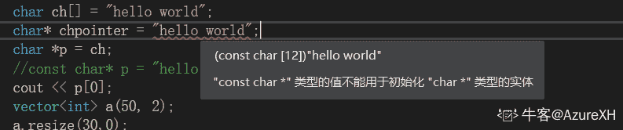
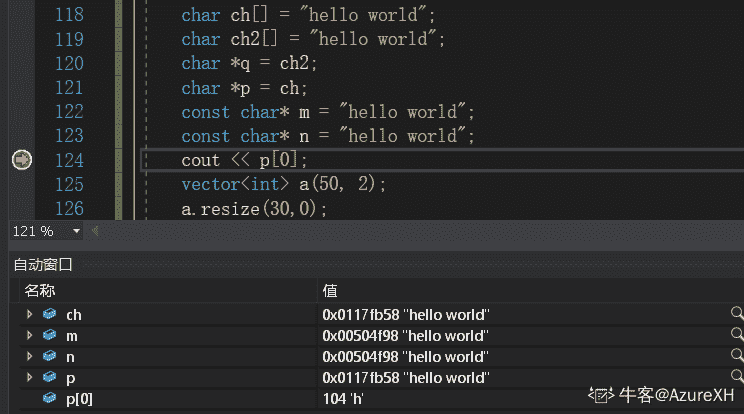
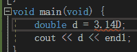

# 哔哩哔哩 2020 校园招聘游戏测试笔试卷（二）

## 1

下面的编程题目的正确答案是: 
 void main(void)  {
    int a = 0;
printf(“%d ”, a++);
printf(“%d”, ++a);
}

正确答案: B   你的答案: 空 (错误)

```cpp
0  1
```

```cpp
0  2
```

```cpp
1  2
```

```cpp
2  2
```

本题知识点

游戏研发工程师 哔哩哔哩 测试工程师 2020

讨论

[喜羊羊威利](https://www.nowcoder.com/profile/3664020)

a++ 输出 a 的原始值但 a=1
第二行++a a 的初始值为 1 ++a=2 输出 2

发表于 2019-11-28 22:29:58

* * *

[半池](https://www.nowcoder.com/profile/854563095)

a++用后+

发表于 2020-07-26 19:39:22

* * *

## 2

下面的编程题目答案是(省略 main, 下同)：
char *p = “gello, world”;
p[0] = ‘h’;
printf(“%s”, p);

正确答案: C   你的答案: 空 (错误)

```cpp
gello, world
```

```cpp
hello, world
```

```cpp
崩溃
```

```cpp
结果未知
```

本题知识点

游戏研发工程师 哔哩哔哩 测试工程师 2020

讨论

[AzureXH](https://www.nowcoder.com/profile/661054113)

这里只要记住，p 指向的是一个常量字符串，这个字符串是只读的，不可写的。vs2017 中，这样的语句是被禁止的。如果要可写的话，正常声明是 char[] ch = "hello,world";————————————————————————————————————————用 vs2017 试了一下
应该可以这样声明，const char* p = "hello world";但是无法对 p[0]进行修改，因为这个时候字符串是常量字符串。如果要按题目那样子可以修改的话，就这样子写。

```cpp
char ch[255] = "hello world";
char* p = ch;
p[0] = 'g';
```

按照题目写 char* p = "hello world";会报这样的错误再给大家看一下调试信息可以看到 m 和 n 指向的是同一个内存地址。ch 和 ch2 指向的是不同的内存地址，但是这里没有显示出来。我查到的理解大概就是，"hello world"这是个字符常量，它存储在静态存储区。而 char ch[] = "hello world";这样的语句，是将这个字符串常量赋值给 ch，然后 ch 会存储在栈中，所以 ch 的内存地址会不同。

不过话说回来 char *p = “gello, world”;这种语句，好像有的地方是可以写的。。。

编辑于 2020-04-02 01:56:54

* * *

[meigumi](https://www.nowcoder.com/profile/131688075)

这个题如果是 c，那就会奔溃，如果是 C++，第一句都不合法

发表于 2019-12-03 20:15:32

* * *

## 3

下面的编程结果是：
char *get() {
char data[16] = “hello, world”;
    return data;
}
void main(void)  {
    char *p = get();
    printf(“%s”, p);
}

正确答案: D   你的答案: 空 (错误)

```cpp
hello, world
```

```cpp
空
```

```cpp
乱码
```

```cpp
崩溃
```

本题知识点

游戏研发工程师 哔哩哔哩 测试工程师 2020

讨论

[好吧，昵称真难改](https://www.nowcoder.com/profile/3381363)

这个题目我认为答案有误，不会崩溃。首先，get 函数会返回一个地址，这个地址式指向常量的常量地址，然而由于这个地址是被创建在函数的栈里，所以函数用完之后这个地址就被销毁了，那么 p 指向的是一个毫无意义的地方，所以这个会乱码，程序不会崩溃。

发表于 2019-11-27 17:24:33

* * *

[努力的萤酱](https://www.nowcoder.com/profile/639303616)

经过 VS2019 实验，应该是乱码，

发表于 2021-04-21 12:15:31

* * *

[👼201911141747386](https://www.nowcoder.com/profile/508903088)

乱码

发表于 2020-12-29 23:38:57

* * *

## 4

c 语言的 malloc 和 c++语言的 new 的主要区别:

正确答案: C   你的答案: 空 (错误)

```cpp
分配的内存空间不同
```

```cpp
没有区别
```

```cpp
一个是内存分配，一个是对象分配
```

```cpp
分配的方式不同
```

本题知识点

游戏研发工程师 哔哩哔哩 测试工程师 2020

讨论

[牛客 720535170 号](https://www.nowcoder.com/profile/720535170)

对于普通变量申请动态空间时，malloc 和 new 都可以使用，当申请对象空间时，只能使用 new。malloc+字节大小；new+变量类型即可。比如 new int；特别 new int（5）；申请了一个 int 类型大小的空间，并将其初始化成 5

发表于 2020-06-08 22:52:29

* * *

## 5

下面的编程结果是：
class IBase {
public:
 IBase() {}
 ~IBase() {}
public:
 virtual void Out() = 0;
};
class IDerived : public IBase {
public:
 IDerived() {}
 virtual ~IDerived() {}
public:
 virtual void Out() {
  printf("hello, world");
 }
};
IBase *base = new IDerived();
base->~IBase();
base->Out();

正确答案: B   你的答案: 空 (错误)

```cpp
hello, world
```

```cpp
崩溃
```

```cpp
没有输出
```

```cpp
代码有错误
```

本题知识点

游戏研发工程师 哔哩哔哩 测试工程师 2020

讨论

[宋存哲](https://www.nowcoder.com/profile/95358863)

先析构子类再析构父类

发表于 2019-12-07 18:13:50

* * *

## 6

下面的数据库不是关系型数据库的是：

正确答案: D   你的答案: 空 (错误)

```cpp
excel
```

```cpp
Microsoft SQL
```

```cpp
mysql
```

```cpp
nosql
```

本题知识点

游戏研发工程师 哔哩哔哩 测试工程师 2020 C++工程师 牛客

讨论

[周末喝奶茶了吗](https://www.nowcoder.com/profile/859507283)

Excel 是关系型数据库?！！

发表于 2019-11-27 11:48:42

* * *

[北极熊先生 201911071151881](https://www.nowcoder.com/profile/832933456)

nosql 就是非关系型数据库

发表于 2020-04-01 09:28:33

* * *

## 7

以下算法中未用到贪心算法思想的是

正确答案: D   你的答案: 空 (错误)

```cpp
迪杰斯特拉(Dijkstra)
```

```cpp
库鲁斯卡尔(Kruskal)
```

```cpp
普里姆算法(Prim)
```

```cpp
KMP
```

本题知识点

游戏研发工程师 哔哩哔哩 测试工程师 2020

讨论

[江边鸟](https://www.nowcoder.com/profile/451872365)

迪杰斯特拉(Dijkstra)
贪心策略是每次选可达的点中距离源点最近的点进行扩展，即贪心选取最短距离的点

库鲁斯卡尔(Kruskal)
贪心策略是每次选最短的边（刨除成环的边）来作为最小生成树，即贪心最短边

普里姆算法(Prim)
贪心策略是每次选可达的点中距离曾经扩展过的点中任意点的最短距离，类似 Dij，只是不是找距离源点的最短距离

KMP
贪心策略 0.0 不是贪心
是动态规划，动态规划的是当前状态失败之后上一次匹配的位置（求的是最长的与前缀子串匹配的左子串） 

发表于 2019-11-29 15:31:29

* * *

## 8

在顺序表（3，6，8，10，12，15，16，18，21，25，30）中，用二分法查找关键码值 11，所需的关键码比较次数为

正确答案: A   你的答案: 空 (错误)

```cpp
4
```

```cpp
5
```

```cpp
2
```

```cpp
3
```

本题知识点

游戏研发工程师 哔哩哔哩 测试工程师 2020

讨论

[半池](https://www.nowcoder.com/profile/854563095)

15 8 10 12

发表于 2020-07-26 19:55:17

* * *

## 9

解决哈希冲突的链地址算法，关于插入新的数据项的时间表述正确的是

正确答案: D   你的答案: 空 (错误)

```cpp
和数组已占用单元的百分比成正比
```

```cpp
和链表数目成正比
```

```cpp
和哈希表中项数成正比
```

```cpp
随装填因子线性增长
```

本题知识点

游戏研发工程师 哔哩哔哩 测试工程师 2020

讨论

[江边鸟](https://www.nowcoder.com/profile/451872365)

装载因子越大，哈希表扩容次数少，哈希表装的越满，越容易发生冲突，插入所花时间越长

发表于 2019-11-29 15:26:15

* * *

## 10

在一台 64 位的计算机上，以下哪段 C 语言代码与代码(x[2]+4)[3]等价（x 的类型是 int **）

正确答案: B   你的答案: 空 (错误)

```cpp
*((*(x+16))+28)
```

```cpp
*((*(x+2))+7)
```

```cpp
**(x+28)
```

```cpp
*(((*x)+2)+7)
```

本题知识点

游戏研发工程师 哔哩哔哩 测试工程师 2020

讨论

[Werky](https://www.nowcoder.com/profile/3905711)

(x[2]+4)表示 x[2][4]的地址，(x[2]+4)[3]表示往后挪 3 个的值，x+2 表示二维数组的第二行，*（x+2）+7 表示 x[2][7]的地址，

```cpp
*((*(x+2))+7)
```

表示 x[2][7]的值

发表于 2020-03-13 16:27:53

* * *

## 11

一个栈的输入序列为 1 2 3 4 5，则下列序列中不可能是栈的输出序列的是

正确答案: C   你的答案: 空 (错误)

```cpp
1 5 4 3 2
```

```cpp
2 3 4 1 5
```

```cpp
4 5 1 3 2
```

```cpp
2 3 1 4 5
```

本题知识点

游戏研发工程师 哔哩哔哩 测试工程师 2020

讨论

[法式委屈](https://www.nowcoder.com/profile/164019518)

先进后出原则；a 选项：1 进 1 出，2345 进，5432 出；b 选项：12 进，2 出，此时 34 进，43 出，1 出，5 进 5 出；c 选项：1234 进，4 出，此时 5 进 5 出，321 出，故正确顺序应为 45321；d 选项：12 进 2 出，3 进 3 出，1 出，4 进 4 出，5 进 5 出。

发表于 2021-01-05 20:45:49

* * *

## 12

下列各序列中不是堆的是

正确答案: B   你的答案: 空 (错误)

```cpp
(9,8,5,3,4,2,1)
```

```cpp
(9,4,5,8,3,1,2)
```

```cpp
(9,5,8,4,3,2,1)
```

```cpp
(9,8,5,4,3,1,2)
```

本题知识点

游戏研发工程师 哔哩哔哩 测试工程师 2020

讨论

[牛客 339199068 号](https://www.nowcoder.com/profile/339199068)

当做完全二叉树，根节点不小于子节点

发表于 2020-09-20 20:21:01

* * *

[Honour 卤蛋](https://www.nowcoder.com/profile/243254038)

1.把序列按照完全二叉树的方式画出来 2.判断是否符合大根堆（根节点不小于子节点）或小根堆（根节点不大于子节点）的要求 B 选项中 8 作为 4 的子结点大于 8，而其他元素符合小根堆要求，冲突

发表于 2021-03-09 20:19:22

* * *

[小白认证](https://www.nowcoder.com/profile/75049176)

根据选项画出对应的堆结构，只有 B 选项的 4 下边有 8，不符合小堆或者大堆

发表于 2020-03-08 17:08:38

* * *

## 13

下列程序的返回值是？其中 arr[] = {9,12,2,11,2,2,10,9,12,10,9,11,2}，且 n 为 arr 的大小。

int fun(int arr[],int n){

int x = arr[0];

for(int i=1;i<n;i++)

x = x^arr[i];

return x;

}

正确答案: B   你的答案: 空 (错误)

```cpp
12
```

```cpp
9
```

```cpp
0
```

```cpp
2
```

本题知识点

游戏研发工程师 哔哩哔哩 测试工程师 2020

讨论

[江边鸟](https://www.nowcoder.com/profile/451872365)

异或运算同值相消，偶数个的数全部抵消，最后只剩一个 9

发表于 2019-11-29 15:22:59

* * *

## 14

下面的哪些赋值语句是错的

正确答案: B   你的答案: 空 (错误)

```cpp
double d = 5.3E12
```

```cpp
float f = 11.1
```

```cpp
double d = 3.14159
```

```cpp
double d = 3.14D
```

本题知识点

游戏研发工程师 哔哩哔哩 测试工程师 2020

讨论

[末夜の十字♪](https://www.nowcoder.com/profile/861637875)

放在 C#B 选项是错的，但 C++里 B 没问题，倒是 D 不太行的亚子

发表于 2020-03-28 05:08:22

* * *

[Martuil.](https://www.nowcoder.com/profile/5773704)

```cpp
float f = 11.1 
```

默认是 double，应该这么写

```cpp
float f = 11.1f
```

发表于 2020-07-26 18:20:45

* * *

[牛客 131797285 号](https://www.nowcoder.com/profile/131797285)

vs2017 中 D 是错的😂 

发表于 2021-06-30 23:31:08

* * *

## 15

下面关于变量及其范围的陈述哪些是错的

正确答案: C   你的答案: 空 (错误)

```cpp
在方法中定义的局部变量在该方法被执行时创建
```

```cpp
局部变量在使用前必须被初始化
```

```cpp
实例变量用关键字 static 声明
```

```cpp
实例变量是类的成员变量
```

本题知识点

游戏研发工程师 哔哩哔哩 测试工程师 2020

讨论

[Honour 卤蛋](https://www.nowcoder.com/profile/243254038)

实例变量就是成员变量，类变量才需要用 static 修饰

发表于 2021-03-09 20:23:41

* * *

[清雨剑圣](https://www.nowcoder.com/profile/922320116)

实例变量声明要用关键字 new。

发表于 2020-07-28 14:59:34

* * *

[pipinstallZJJ](https://www.nowcoder.com/profile/398085438)

局部变量使用前不是必须得初始化吗？为哈还是错的？

发表于 2020-08-21 18:20:27

* * *

## 16

设一棵完全二叉树共有 699 个结点，则在该二叉树中的叶子结点数为

正确答案: A   你的答案: 空 (错误)

```cpp
350
```

```cpp
349
```

```cpp
255
```

```cpp
351
```

本题知识点

游戏研发工程师 哔哩哔哩 测试工程师 2020

讨论

[Unique▼](https://www.nowcoder.com/profile/649738373)

1.假设 n0 是度为 0 的结点总数(即叶子结点数),n1 是度为 1 的结点总数,n2 是度为 2 的结点... 2.由二叉树的性质可知:n0=n2+1,则 n= n0+n1+n2(其中 n 为完全二叉树的结点... 3.由上述公式把 n2 消去得:n= 2n0+n1-1 4.由于完全二叉树中度为 1 的结点数只有两种可能 0 或 1,由此得到 n0=(n+1)/2 或 n0=n... 5.合并成一个公式:n0=(n+1)/2 ,就可根据完全二叉树的结点总数计算出叶子结点数。

发表于 2019-11-26 21:18:35

* * *

[牛客 675151467 号](https://www.nowcoder.com/profile/675151467)

一共 10 层，第 9 层 256 个节点，剩下 188 个节点接到这 256 个上，还有 256-（188/2）个节点没有子节点，所以是 188+256-（188/2）

发表于 2021-09-10 22:41:25

* * *

[上大-黄志栋](https://www.nowcoder.com/profile/553150667)

这题感觉不止一个 350 啊！首先：有 n 层的话（默认根节点属于第一层），那么前 n 层节点总数为 2^n-1、第 n 层节点数为 2^(n-1)；现在总结点 699 个，因为 9 层的话，共 2⁹-1 = 511，10 层的话，2¹⁰-1 = 1023，所以共 10 层（第 10 层未排满），那么第 10 层节点数：699-（前 9 层节点数）=699-511 = 188；假如这 188 个属于 9 层度为 2 的孩子，则 9 层有 188/2=94，也就是说第 9 层（256 个节点，最少 94 个有孩子了），这样最多叶子节点为 188+（256-94）=350。上面是把 188 都给度为 2 的节点挂着，那如果有度为 1 呢，就是说 188 不用挂在 94 个节点下面，而是 93 挂 186 个，然后 94 号挂 1 个，95 号挂 1 个，这样叶子节点就是 188+（256-95） = 349；以此类推，可能为 348、347....

发表于 2020-09-04 13:16:05

* * *

## 17

多线程的一般应用场景:

正确答案: B C D   你的答案: 空 (错误)

```cpp
随时随地
```

```cpp
系统调用
```

```cpp
高并发请求
```

```cpp
分布式计算
```

本题知识点

游戏研发工程师 哔哩哔哩 测试工程师 2020

讨论

[谁都不许动我的砖](https://www.nowcoder.com/profile/4677166)

多线程不应该密集型计算吗？分布式计算也可以的咩？

发表于 2020-10-20 21:24:11

* * *

## 18

下面是纯的脚本语言的是（有几个选几个）

正确答案: A B C   你的答案: 空 (错误)

```cpp
ruby
```

```cpp
python
```

```cpp
lua
```

```cpp
java
```

本题知识点

游戏研发工程师 哔哩哔哩 测试工程师 2020

讨论

[schenga](https://www.nowcoder.com/profile/514716408)

D 是不是应该为 iavascript

发表于 2020-07-20 21:15:01

* * *

[洗了青菜忘了烧](https://www.nowcoder.com/profile/545478649)

lua 不有虚拟机吗，也有编译成字节码的过程啊，看 lua 源码就知道了，能算纯脚本吗？

发表于 2020-03-05 15:14:14

* * *

## 19

c++11 有哪些新的特性（多选）

正确答案: A B C   你的答案: 空 (错误)

```cpp
右值引用
```

```cpp
lambda 函数
```

```cpp
using 新特性
```

```cpp
协程
```

本题知识点

游戏研发工程师 哔哩哔哩 测试工程师 2020

讨论

[孤独的游者](https://www.nowcoder.com/profile/9853356)

using 取代 typedef：的新特性

发表于 2020-02-07 19:21:31

* * *

## 20

算法复杂度是 lgn 的是(有几个选几个)

正确答案: B D   你的答案: 空 (错误)

```cpp
冒泡排序
```

```cpp
堆排序
```

```cpp
选择排序
```

```cpp
快速排序
```

本题知识点

游戏研发工程师 哔哩哔哩 测试工程师 2020

讨论

[记不住名字的阿金](https://www.nowcoder.com/profile/297306100)

冒泡排序：O（n²）

*   比较相邻的两个元素，如果前者比后者大（反之倒序），则交换。
*   对每一对相邻元素做同样的工作，从开始第一对到结尾的最后一对。
*   针对所有的元素重复以上的步骤。
*   持续每次对越来越少的元素重复上面的步骤，直到没有任何一对数字需要比较。

堆排序：O（nlog[2]n)选择排序：O（n²)

*   （1）首先从原始数组中选择最小的 1 个数据，将其和位于第 1 个位置的数据交换。
*   （2）接着从剩下的 n-1 个数据中选择次小的 1 个元素，将其和第 2 个位置的数据交换
*   （3）然后，这样不断重复，直到最后两个数据完成交换。最后，便完成了对原始数组的从小到大的排序。

快速排序：O（nlog[2]n)

发表于 2020-02-28 14:27:04

* * *

[mysterioussuperstar](https://www.nowcoder.com/profile/783604547)

快排排序时间复杂度不应该是 O(n*logn)吗

发表于 2020-08-13 00:29:47

* * *

[ZIrV_3342](https://www.nowcoder.com/profile/500932072)

快速排序的复杂度是 O(n²)，这个有严格的数学公式推导可以证明，只是它的平均复杂度是 O(nlgn)

发表于 2020-04-11 14:37:36

* * *

## 21

请为某集换式卡牌游戏（类似于万智牌或炉石传说）设计一个公平的抽卡算法，让每一张卡牌都能独立等概率的出现在每一个位置。（用语言描述或伪代码都可以）

你的答案

本题知识点

游戏研发工程师 哔哩哔哩 测试工程师 2020

讨论

[Honour 卤蛋](https://www.nowcoder.com/profile/243254038)

Fisher-Yates 洗牌算法在每次迭代中，生成一个范围在当前下标到数组末尾元素下标之间的随机整数。接下来，将当前元素和随机选出的下标所指的元素互相交换 

发表于 2021-03-09 20:35:25

* * *

[绝对零度の超音速](https://www.nowcoder.com/profile/544264958)

依然是无法理解题意的一道题？几何分布？

发表于 2019-12-24 13:50:02

* * *

## 22

全宇宙魔法少女大聚会（数量较多），如果魔法少女 A 和魔法少女 B 存在羁绊，魔法少女 B 和魔法少女 C 存在羁绊，那么魔法少女 A 和魔法少女 C 也存在羁绊；所有有羁绊关系的魔法少女形成一个结界，请计算有多少个结界并计算各个结界中的人数。（用语言描述或伪代码都可以）

你的答案

本题知识点

游戏研发工程师 哔哩哔哩 测试工程师 2020

讨论

[末夜の十字♪](https://www.nowcoder.com/profile/861637875)

Leetcode547.朋友圈问题，可以将马猴烧酒的关系圈看做几个无向连通图，用深度遍历查一下连通图个数就行了

发表于 2020-03-28 05:45:50

* * *

[rookie。](https://www.nowcoder.com/profile/412988996)

```cpp
#include<iostream>
#include<vector>
#define MAXN 10005
using namespace std;

vector<int> edge[MAXN];
int mark[MAXN];
int jn;        //结界数量
//返回 x 结点所在结界的总人数
int dfs(int x){
    if(mark[x]!=0)return 0;
    int num = 1;
    mark[x] = 1;
    for(int i = 0;i < edge[x].size();i++){
        num+=dfs(edge[x][i]);
    }
    return num;
}
int main(){
    int n,k;        //总人数,羁绊数量
    vector<int> tn;        //各结界人数
    int v,w;
    cin >> n >> k;
    while(k--){
        cin >> v >> w;
        edge[v].push_back(w);
        edge[w].push_back(v);
    }
    for(int i = 0;i < n;i++){
            if(mark[i]==0){  
                tn.push_back(dfs(i));
            }
    }
    cout << tn.size() << endl;
    for(int i = 0;i < tn.size();i++){
        cout << tn[i] << " ";
    }
    cout << endl;

    return 0;
}
```

发表于 2020-11-16 16:37:07

* * *

[白菊花瓣](https://www.nowcoder.com/profile/514499738)

将有羁绊的放入到一个哈希表中即可。当新加入一位魔法少女时，根据该魔法少女的羁绊，在哈希表中查找，如果有一个哈希表中含有该魔法少女的羁绊对象，则把她也放入该表中。否则，新建一个哈希表，作为一个新的结界。

```cpp
using System;
using System.Collections;
using System.Collections.Generic;
using System.Text;

namespace ConsoleApp1
{
    public class Program
    {
        public static void Main(string[] args)
        {
            // 输入 魔法少女数
            int n = int.Parse(Console.ReadLine());
            Dictionary<int, Hashtable> dic = new Dictionary<int, Hashtable>();
            Hashtable[] nodes = new Hashtable[n];
            for(int i = 0; i < n; ++i) nodes[i] = new Hashtable();
            HashSet<HashSet<int>> map = new HashSet<HashSet<int>>();
            // n 行输入，每行输入 id 为第 i 行的少女 她的羁绊们的 ids, -1 表示没有羁绊
            for (int i = 0; i < n; ++i)
            {      
                string[] ipts = Console.ReadLine().Split(' ');
                for(int j = 0; j < ipts.Length; ++j)
                {
                    int parent = int.Parse(ipts[j]);
                    if(parent == -1)
                    {
                        HashSet<int> _t = FindParent(map, i);
                        if(_t == null)
                        {
                            HashSet<int> group = new HashSet<int>();
                            group.Add(i);
                            map.Add(group);
                        }
                        break;
                    }
                    HashSet<int> t = FindParent(map, i);
                    if(t == null)
                    {
                        t = FindParent(map, parent);
                        if(t == null)
                        {
                            HashSet<int> group = new HashSet<int>();
                            group.Add(i);
                            group.Add(parent);
                            map.Add(group);
                        }
                        else
                        {
                            t.Add(i);
                        }
                    }
                    else
                    {
                        t.Add(parent);
                    }
                }
            }
            // 结界数
            int count = map.Count;
            Console.WriteLine(count);
            // 少女数
            int num = 0;
            foreach(HashSet<int> set in map)
            {
                num += set.Count;
            }
            Console.WriteLine(num);
        }
        private static HashSet<int> FindParent(HashSet<HashSet<int>> map, int parent)
        {
            if (map.Count == 0) return null;
            foreach(HashSet<int> table in map)
            {
                if (table.Contains(parent)) return table;
            }
            return null;
        }
    }
}
```

发表于 2020-10-17 17:38:55

* * *