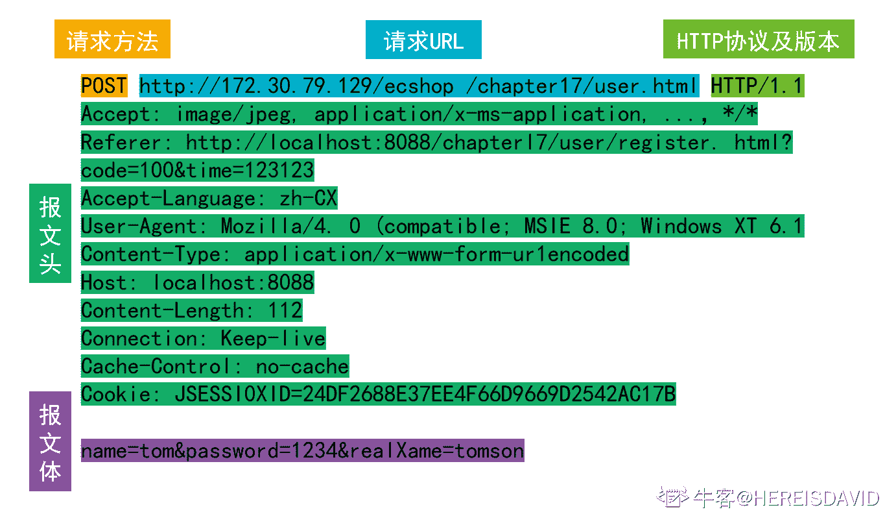

# 网易 2020 校招笔试- iOS 开发工程师（提前批）

## 1

关于 Application 的生命周期，以下说法错误的是：

正确答案: A   你的答案: 空 (错误)

```cpp
启动程序 AppDelegate 方法按以下顺序从上至下执行[AppDelegate applicationDidBecomeActive:][AppDelegate application:willFinishLaunchingWithOptions:][AppDelegate application:didFinishLaunchingWithOptions:]
```

```cpp
按下 home 键 AppDelegate 方法按以下顺序从上至下执行[AppDelegate applicationWillResignActive:][AppDelegate applicationDidEnterBackground:]
```

```cpp
app 从后台到前台 AppDelegate 方法按以下顺序从上至下执行[AppDelegate applicationWillEnterForeground:][AppDelegate applicationDidBecomeActive:]
```

```cpp
当程序被杀掉时调动下面方法：[AppDelegate applicationDidFinishLaunching:]
```

本题知识点

iOS 工程师 网易 2020

讨论

[一个帅气潇洒的豆子](https://www.nowcoder.com/profile/5874483)

```cpp

	[AppDelegate application:willFinishLaunchingWithOptions:]

	[AppDelegate application:didFinishLaunchingWithOptions:]

	[AppDelegate applicationDidBecomeActive:] 

```

发表于 2020-08-29 10:28:15

* * *

[牛客和离口 1990 号](https://www.nowcoder.com/profile/883540926)

？？？

发表于 2020-05-06 19:18:51

* * *

## 2

以下 Swift 代码打印结果为：

```cpp
var name:String? = "Lily"
let tellname = { [name] in
    print("My name is " + (name ?? "Lilei"))
}
```

name = "Lucy"tellname()

正确答案: A   你的答案: 空 (错误)

```cpp
My name is Lily
```

```cpp
My name is Lucy
```

```cpp
My name is Lilei
```

```cpp
My name is null
```

本题知识点

iOS 工程师 网易 2020

讨论

[ManTova](https://www.nowcoder.com/profile/710354599)

题目不知道是不是后面打错了，如果没错的话，应该是 A 考察的应该是可选型 optional 数据的提取，一共有三种方法，强制拆包，可选型绑定和聚合运算，这里用的是最后一种方法 当 name 里有值时，输出？？前的值，否则就输出后面的值

发表于 2021-03-19 23:24:56

* * *

## 3

下列最短路径算法的叙述中正确的是（）

正确答案: B   你的答案: 空 (错误)

```cpp
Dijkstra 算法通常用于求每一对顶点间的最短路径；
```

```cpp
Dijkstra 算法不允许图中带有负权值的边，而 Floyd 算法则可以适用；
```

```cpp
Floyd 算法通常用于求某一顶点到其他各顶点的最短路径；
```

```cpp
Floyd 算法允许有包含负权值的边组成的回路，而 Dijkstra 算法不允许；
```

本题知识点

iOS 工程师 网易 Java 工程师 前端工程师 C++工程师 算法工程师 数据分析师 数据库工程师 2020

讨论

[vicyor](https://www.nowcoder.com/profile/2210832)

```cpp
1.Dijkstra 算法是计算图中的一个点到其它点的最小路径.
  算法思路: 贪心算法.
    将图中所有点分成 S(已求出解)和 U(未求出解)2 个点集.dist[i]表示 v0 到 v[i]当前已求得得最短路径.A[n][n]为边集
    1.从剩下的边集合中选出 dist 最短的边并将边的另一顶点 vi 从 U 中加入 S.
    2.更新与 vi 连接的所有且并未在 S 中的点的 dist 矩阵值,dist[vk]=min(dist[vk],dist[vi]+A(i,k)).
    3.重复上述操作直到 U 中无与 S 中的点相连的点.
2.Floyd 算法计算图中任意一对点的最短路径.
  算法思路:  T(n)=O(n³).
   动态规划法: Dis(i,j) =min(Dis(i,j), Dis(i,k) + Dis(k,j)).

```
 for(k=0;k<n;k++)
 　　{ 
       //A[i][j]初始为每点的边长. for(i=0;i<n;i++) for(j=0;j<n;j++) if(A[i][j]>(A[i][k]+A[k][j]))
             　　{
                   　　A[i][j]=A[i][k]+A[k][j];
                   　　path[i][j]=k;
              　 } 
    　} 
```cpp

3.Dijkstra 算法为啥不能存在负数边?

Dijkstra 中 S(已求出解)中的每一个点解即最短路径是已求出的,若存在负数路径,可能存在已求出的解不是最优解.

例:

A   3    B

4     -1000 

c 

由于贪心法 B 的最终结果为 3 而不是 -996,而 C 的结果正确 -997.

```

发表于 2020-02-17 15:57:16

* * *

[offer 快来球球了](https://www.nowcoder.com/profile/243031380)

注意 floyd 能有负权值的边，不能有负权值的回路！

发表于 2020-02-24 10:43:38

* * *

[青墨山音](https://www.nowcoder.com/profile/267670990)

B

发表于 2019-12-23 02:35:08

* * *

## 4

判断一个数组或序列是正序,倒序还是乱序,需要我们将这个数组完整的遍历一遍通过构建有序序列，对于未排序数据，在已排序序列中从后向前扫描，找到相应的位置并插入的排序算法是（ ）

正确答案: C   你的答案: 空 (错误)

```cpp
选择排序
```

```cpp
希尔排序
```

```cpp
插入排序
```

```cpp
归并排序
```

本题知识点

iOS 工程师 网易 安卓工程师 C++工程师 Java 工程师 安全工程师 测试工程师 大数据开发工程师 前端工程师 算法工程师 数据分析师 数据库工程师 运维工程师 2020

讨论

[Olivia_dtt](https://www.nowcoder.com/profile/232985383)

选择排序：每次从数组中选出一个最小数（最大数）放到数组最前面，存放在序列的起始位置，直到全部待排序的数据元素排完。希尔排序：设置增量分割数组，逐步进行直接插入排序,增量逐趟减少,并最后使得整个数组基本有序,再对整体进行直接插入排序。插入排序：构建有序序列，未排序数据依次从已排序数据按从后往前比较，插入到合适的位置。归并排序：把序列分成两个长度为 n/2 的子序列，对这两个子序列分别归并排序（循环将两个数组的第一个值比较，并弹出第一个值， 直到数组长度都不存在），将两个排序好的子序列合并成一个最终的排序序列

发表于 2020-04-06 20:12:11

* * *

[牛客 929822447 号](https://www.nowcoder.com/profile/929822447)


插入排序—直接插入排序：


希尔排序：

 

选择排序：

 

归并排序：


发表于 2020-08-24 18:42:35

* * *

## 5

队列是一种特殊的线性表，特殊之处在于它只允许在表的前端（front）进行删除操作，而在表的后端（rear）进行插入操作，和栈一样，队列是一种操作受限制的线性表，进行插入操作的端称为队尾，进行删除操作的端称为队头，若用一个大小为 6 的数组来实现循环队列，数组下标为[0,5]，且当前 rear 和 front 的值分别为 0 和 3，当从队列中删除一个元素，再加入两个元素后，rear 和 front 的值分别为多少？（   ）

正确答案: B   你的答案: 空 (错误)

```cpp
1 和 5
```

```cpp
2 和 4
```

```cpp
4 和 2
```

```cpp
5 和 1
```

本题知识点

iOS 工程师 网易 Java 工程师 C++工程师 安全工程师 测试工程师 测试开发工程师 大数据开发工程师 数据分析师 数据库工程师 2020

讨论

[惠州学院 _15_ 黄洪卫](https://www.nowcoder.com/profile/8631354)

这道题目说的是当前**rear**和**fro****nt**的值分别为 0 和 3，所以当前的队列为 3  4  5  0，front 为 3，rear 为 0，又因为是用一个大小为 6 的数组来实现的循环队列，所以删除一个插入两个后为 4  5  0  1  2，此时 front 为 4，rear 为 2，即答案为 2,4

发表于 2019-12-04 11:15:44

* * *

[猫仔面](https://www.nowcoder.com/profile/4548438)

顺序队列：入队 rear += 1 出队 front += 1 队列长度 = rear - front 循环队列：入队 rear = (rear + 1) % size 出队 front  = (front + 1) % size 队列长度 = (rear - front + size) % size

发表于 2020-08-06 15:02:52

* * *

[vicyor](https://www.nowcoder.com/profile/2210832)

初始时候,front 为 3，rear 为 0 删除一个元素(首部) ， front 为 4，rear 为 0 插入 2 个元素 ,               front 为 4，rear 为 2

发表于 2020-02-17 16:02:13

* * *

## 6

死锁是指多个进程在运行过程中因争夺资源而造成的一种僵局，永远在互相等待的进程称为死锁进程，假设计算机系统中有 3 个不同的临界资源 R1、R2 和 R3，被 4 个进程 p1、p2、p3 及 p4 共享。各进程对资源的需求为：p1 申请 R1 和 R2，p2 申请 R2 和 R3，p3 申请 R1 和 R3，p4 申请 R2。若系统出现死锁，则处于死锁状态的进程数至少是（  ）

正确答案: C   你的答案: 空 (错误)

```cpp
1
```

```cpp
2
```

```cpp
3
```

```cpp
4
```

本题知识点

iOS 工程师 网易 安卓工程师 C++工程师 Java 工程师 测试工程师 测试开发工程师 大数据开发工程师 前端工程师 算法工程师 数据库工程师 2020

讨论

[彭彭の零柒](https://www.nowcoder.com/profile/390870854)

3 个.这种情况： p1 占用 r1,p2 占用 r2，p3 占用 r3，p1 申请 r2，p2 申请 r3，p3 申请 r1，无限等待释放资源

发表于 2020-02-21 21:58:02

* * *

[我是复读机](https://www.nowcoder.com/profile/162099353)

要理解死锁的概念。死锁的进程必须是已经占有了某个资源，同时在请求其他资源，而且不会主动释放已占有的资源。如果几个进程循环等待其他进程已占有的资源，就陷入了死局，就死锁了。

发表于 2020-04-21 17:16:12

* * *

[猫仔面](https://www.nowcoder.com/profile/4548438)

我的理解：对于本题，有 3 个资源，所以如果出现死锁（环形等待），必定至少需要 3 个进程来分别占有 3 个资源（感觉怪怪的）

发表于 2020-08-06 15:18:29

* * *

## 7

访问记录 visit 表中包含日期 date,用户 user_id,访问的页面 url 3 个字段，以下哪个选项不能计算'2019-03-11'这一天访问过页面的所有用户数

正确答案: D   你的答案: 空 (错误)

```cpp
SELECT count(user_id) FROM (SELECT user_id FROM visit WHERE date = '2019-03-11'  GROUP BY user_id) f
```

```cpp
SELECT count(user_id) FROM (SELECT DISTINCT user_id FROM visit WHERE date = '2019-03-11') f
```

```cpp
SELECT count(DISTINCT user_id) FROM visit WHERE date = '2019-03-11'
```

```cpp
SELECT count(user_id) FROM visit WHERE date = '2019-03-11' GROUP BY date
```

本题知识点

iOS 工程师 网易 安卓工程师 C++工程师 Java 工程师 测试工程师 测试开发工程师 大数据开发工程师 数据分析师 数据库工程师 2020

讨论

[vicyor](https://www.nowcoder.com/profile/2210832)

D . SELECT count(user_id) FROM visit WHERE date = '2019-03-11' GROUP BY date    问题: 1.user_id 未去重             2.已经通过 where 选出 date 了,group by 无意义.修改: SELECT count(user_id) FROM visit WHERE date = '2019-03-11' GROUP BY user_id

发表于 2020-02-17 16:47:43

* * *

[牛客 656547734 号](https://www.nowcoder.com/profile/656547734)

选项 A 

```cpp
SELECT count(user_id) FROM (SELECT user_id FROM visit WHERE date = '2019-03-11'  GROUP BY user_id) fK
我选这个了，这个的确无法直接得到结果，但是题目问的是无法计算，这个结果通过人工计算还是可以计算出最终结果的，我觉得迷惑性的确很大。
```

发表于 2020-04-25 16:41:28

* * *

[aruruff](https://www.nowcoder.com/profile/509544345)

```cpp
除重归纳用户 id 为表 f 再计算 A   SELECT count(user_id) FROM (SELECT user_id FROM visit WHERE date = '2019-03-11'  GROUP BY user_id) f
```

  B    SELECT count(user_id) FROM (SELECT DISTINCT user_id FROM visit WHERE date = '2019-03-11') f
C 简单的用除重函数
D

```cpp
 GROUP BY 日期再

```
WHERE 日期 nono
```cpp

```

```cpp
WHERE date = '2019-03-11' GROUP BY date  
```

发表于 2019-12-11 11:58:15

* * *

## 8

下面关于 Objective-C 内存管理的描述错误的是( )

正确答案: D   你的答案: 空 (错误)

```cpp
在 ARC 模式下编写代码时不需要再调用 release 方法
```

```cpp
在 ARC 模式下使用@autoreleasepool{}来显式地调用 AutoReleasePool
```

```cpp
在 ARC 模式下使用 block 需要注意循环引用问题
```

```cpp
在 ARC 模式下不会出现内存野指针问题
```

本题知识点

iOS 工程师 网易 2020

## 9

下面关于 HTTP 协议的说法错误的是( )

正确答案: C   你的答案: 空 (错误)

```cpp
HTTP 报文分为请求报文和响应报文
```

```cpp
HTTP 请求行由请求方法、URL 和协议版本组成
```

```cpp
每个服务器都支持包括 GET\HEAD\PUT 等 7 种请求方法
```

```cpp
HTTP 响应行由协议版本、状态码和状态描述符组成
```

本题知识点

iOS 工程师 网易 测试工程师 测试开发工程师 前端工程师 2020

讨论

[猫仔面](https://www.nowcoder.com/profile/4548438)

HTTP 请求方法有 8 种：get、post、put、delete、options、trace、connect、head，其中至少应该实现 get、head、post 方法，其他方法都是可选的。

发表于 2020-08-06 13:14:05

* * *

[HEREISDAVID](https://www.nowcoder.com/profile/864672146)

请求和响应：


编辑于 2020-09-27 20:04:09

* * *

[工作已找到](https://www.nowcoder.com/profile/52550243)

只有 6 种

发表于 2020-03-25 16:36:14

* * *

## 10

在下面的叙述中正确的是( )

正确答案: B   你的答案: 空 (错误)

```cpp
线程是比进程更小的能独立运行的基本单位
```

```cpp
引入线程可提高程序并发执行的程度，可进一步提高系统效率
```

```cpp
线程的引入增加了程序执行时时空开销
```

```cpp
一个进程一定包含多个线程
```

本题知识点

iOS 工程师 网易 2020

## 11

请简述 HTTPS 的加密过程

你的答案

本题知识点

iOS 工程师 网易 2020

## 12

请列举三种你知道的操作系统内存页面置换算法并简述每种算法的置换流程和特性

你的答案

本题知识点

iOS 工程师 网易 2020

讨论

[vector<>](https://www.nowcoder.com/profile/255171944)

 *   缺页置换算法

    *   先进先出（FIFO）：置换最先调入内存的页，（队列，删除队头，加入队尾）
    *   最近算少使用（LRU）:置换最近一段时间以来，最长时间没有访问过的页面（最常用）
    *   最佳置换算法：谁是最晚被调用就置换谁 

发表于 2020-03-26 10:23:47

* * *

## 13

小易是班级的英语课代表, 他开发了一款软件开处理他的工作。
小易的软件有一个神奇的功能，能够通过一个百分数来反应你的成绩在班上的位置。“成绩超过班级 ...% 的同学”。
设这个百分数为 p，考了 s 分，则可以通过以下式子计算得出 p：
p = ( 分数不超过 s 的人数 - 1)  班级总人数 
突然一天的英语考试之后，软件突然罢工了，这可忙坏了小易。成绩输入这些对于字写得又快又好的小易当然没有问题，但是计算这些百分数……这庞大的数据量吓坏了他。
于是他来找到你，希望他编一个程序模拟这个软件：给出班级人数 n，以及每个人的成绩，请求出某几位同学的百分数。

本题知识点

iOS 工程师 网易 Java 工程师 测试开发工程师 前端工程师 C++工程师 安卓工程师 安全工程师 2020

讨论

[Muche](https://www.nowcoder.com/profile/259486465)

前缀和即可，查询时就是 O（1）复杂度

```cpp
 import java.util.*;

public class Main{
    public static void main(String[] args) {
        Scanner in = new Scanner(System.in);
        int n = in.nextInt();
        int[] stu = new int[n];
        int[] grade = new int[151];
        int[] profix = new int[152];
        for (int i = 0; i < n; i++) {
            stu[i] = in.nextInt();
            grade[stu[i]]++;
        }
        profix[0] = grade[0];
        for (int i = 1; i <= 150; i++) {
            profix[i] = profix[i - 1] + grade[i];
        }
        int q = in.nextInt();
        for (int i = 0; i < q; i++) {
            int idx = in.nextInt();
            double x = (profix[stu[idx - 1]] - 1) / (double)n;
            System.out.println(String.format("%.6f", x * 100));
        }
    }

}
```

编辑于 2020-08-08 16:57:59

* * *

[dragonlogin](https://www.nowcoder.com/profile/2071677)

思路

发现分数最大值是 150， 题目要求每次找不超过分数 x 的人数，需要找 10000 次。

*   考虑暴力解法
    每次找不超过分数 x 的人数，都遍历一次数组，需要遍历 10000 次，肯定超时
*   优化
    优化可以优先考虑空间换时间， 所以可以用 map 存每个分数的人数，然后遍历分数就可以了，最多只需要遍历 150 次

```cpp
#include <bits/stdc++.h>
using namespace std;
const int N = 10010, M = 160;
int a[N], mp[M];
int n, q;
int main() {
    scanf("%d", &n);
    memset(mp, 0, sizeof mp);
    for (int i = 1; i <= n; ++ i) {
        scanf("%d", &a[i]);
        mp[a[i]] ++ ;
    }
    scanf("%d", &q);
    int x;
    while (q -- ) {
        scanf("%d", &x);
        int cnt = 0;
        for (int i = 0; i <= a[x]; ++ i) {
            cnt += mp[i] ;
        }
        // 必须用 double，用 float 错误
        double ret = (cnt - 1) * 100.0 / n ;
        printf("%.6lf\n", ret);
    }

    return 0;
}

```

发表于 2020-07-30 18:17:51

* * *

[牛客 717970517 号](https://www.nowcoder.com/profile/717970517)

```cpp
#include<iostream>
#include<algorithm>
#include<vector>
using namespace std;
int main()
{
	vector<int>scores;
	int n;  //班级人数
	cin >> n;
	int* a = new int[n];
	for (int i = 0; i < n; i++)
	{
		cin >> a[i];        //每个学生的分数
	}
	int q;   //询问的次数
	cin >> q;
	for (int i = 0; i < q; i++)
	{
		int bianhao;
		cin >> bianhao;      //询问的是哪个学生
		scores.push_back(a[bianhao-1]);       //q 个学生的成绩放入 vector 中
	}
	sort(a, a + n);
	for (int i = 0; i < q; i++)
	{
		for (int j = n - 1; j >= 0; j--)
		{
			if (a[j] == scores[i])
			{

				double percent = j*100.0 / n;
				printf("%.6lf\n", percent);
				break;
			}
		}
	}
}
```

发表于 2020-08-07 15:47:08

* * *

## 14

给定 01 序列 S, 序列 S 是优秀的 01 序列，优秀的 01 序列定义如下:
1、如果序列 S,T 是优秀的，则序列 S+T 是优秀的，+被定义为按顺序连接两个序列，即"010"+"110"="010110"。
2、如果序列 S 是优秀的，则序列 rev(S)也是优秀的。rev(S)被定义为按位翻转(0 变 1,1 变 0)序列 S，并删去前导零。例如 rev("1100101")="11010"。

现在请你判断序列 T 是不是优秀的

本题知识点

iOS 工程师 网易 C++工程师 测试开发工程师 大数据开发工程师 算法工程师 Java 工程师 2020

讨论

[零葬](https://www.nowcoder.com/profile/75718849)

```cpp
def reverse(s):
    rev = []
    for c in s:
        if c == '0':
            rev.append('1')
        else:
            rev.append('0')
    return ''.join(rev).lstrip('0')

T = int(input())
for _ in range(T):
    s = input()
    t = input()
    # 根据判别条件构造可能的优秀序列
    result_pool = set()
    # 反转得到的优秀序列
    while s:
        result_pool.add(s)
        s = reverse(s)
    # "1"可以生成任意序列，因此单独拿出来判断一下，反转中有"1"T 一定是优秀序列
    if '1' in result_pool&nbs***bsp;t in result_pool:
        # 如果 T 在反转的优秀序列中，则输出 YES
        print('YES')
    else:
        # 否则检查拼接得到的序列是否优秀
        result_pool = list(result_pool)
        # 拼接得到优秀序列
        flag = False
        for i in range(len(result_pool) - 1):
            for j in range(i, len(result_pool)):
                if result_pool[i] + result_pool[j] == t&nbs***bsp;result_pool[j] + result_pool[i] == t:
                    flag = True
                    print('YES')
                    break
            if flag:
                break
        else:
            print('NO')
```

编辑于 2021-04-08 14:38:38

* * *

[靳伟昭](https://www.nowcoder.com/profile/222160049)

```cpp
#python3
"""
rev----将序列 x 取反并将前置 0 去掉
cur----判断 t 是否存在于 s 及 rev（s）的集合中或者 s 及 rev（s）的两两拼接是否等于 t
"""
def rev(x):
    j = 0
    y = ""
    for i in x:
        if i == "1" and j == 0:
            continue
        j += 1
        if i =="0":
            y += "1"
        else:
            y += "0"
    return y
def cur(s,t):
    tmp = set()
    while s:
        tmp.add(s)
        s1 = rev(s)
        s = s1
    if "1" in tmp or t in tmp:
        return("YES")
    tmp = list(tmp)
    for i in range(len(tmp)-1):
        for j in range(i,len(tmp)):
            if tmp[i]+tmp[j] == t and tmp[j]+tmp[i] == t:
                return("YES")
    return("NO")
n = int(input())
for _ in range(n):
    s = input()
    t = input()
    print(cur(s,t))
```

编辑于 2020-08-08 18:01:34

* * *

[字节内推.](https://www.nowcoder.com/profile/9955061)

```cpp
import java.util.ArrayList;
import java.util.Scanner;

public class Main {
    public static void main(String[] args) {
        Scanner sc = new Scanner(System.in);
        int T = sc.nextInt();
        sc.nextLine();
        for (int i = 0; i < T; i++) {
            String s1 = sc.nextLine();
            String s2 = sc.nextLine();
            System.out.println(solution(s1, s2));
        }
    }

    public static String solution (String s1, String s2) {
        ArrayList<String> list = new ArrayList<String>();
        String tmp = s1;
        while (tmp.length() > 1) {
            StringBuilder rev = new StringBuilder();
            for (int i = 0; i < tmp.length(); i++) {
                if (tmp.charAt(i) == '0')
                    rev.append('1');
                else
                    rev.append('0');
            }
            while (rev.length() > 1 && rev.charAt(0) == '0') {
                rev.deleteCharAt(0);
            }
            String l = rev.toString();
            tmp = l;
            if (!l.equals(""))
                list.add(l);
        }
        //如果出现了“1”,那么就需要额外加上一个“0”
        if (list.contains("1"))
            list.add("0");

        int index = 0;
        while (index < s2.length()) {
            int n = 0;
            if (index + s1.length() <= s2.length() && s2.substring(index, index + s1.length()).equals(s1))
                index += s1.length();
            else if (index < s2.length()) {
                for (int i = 0; i < list.size(); i++) {
                    String ss = list.get(i);
                    if (index + ss.length() <= s2.length() && s2.substring(index, index + ss.length()).equals(ss)) {
                        index += ss.length();
                        break;
                    }
                    else
                        n++;
                }
                if (n == list.size())
                    return "NO";
            }
            else
                return "NO";
        }
        return "YES";
    }
}
```

 发表于 2020-04-06 18:07:33

* * *

## 15

小易有一个体积巨大的货物，具体来说，是个在二维平面上占地的货物。
小易有一个的广场，想把货物放在这个广场上。不幸的是，广场上已经有了一些障碍物，障碍物所在的格子不能放置你的货物。小易现在想知道能否成功地放置货物。

本题知识点

iOS 工程师 网易 Java 工程师 C++工程师 安全工程师 算法工程师 运维工程师 2020

讨论

[dragonlogin](https://www.nowcoder.com/profile/2071677)

思路

就是力扣 85 题最大矩阵和的思路。
把障碍点设为 1，非障碍点设为 0，跑一遍求最大矩阵的代码，同时记录最大矩阵面积为 eara，长和宽最大值 maxv 和最小值 minv，
如果 eara > c * d && maxv > max(c, d) && minv > min(c, d), 返回 YES，否则 NO

```cpp
#include <bits/stdc++.h>
using namespace std;
const int N = 1010, M = 160;

int t, n, m, k, c, d;

char mat[N][N];
int help(vector<int>& a,int &minv, int& maxv) {
    int n = a.size();

    int tt = 0;
    vector<int> stk(n + 10), left(n), right(n);

    for (int i = 0; i < n; ++ i) {
        while (tt && a[stk[tt]] >= a[i]) tt--;

        if (tt) left[i] = stk[tt];
        else left[i] = -1;

        stk[++ tt] = i;
    }

    tt = 0;

    for (int i = n - 1; ~i; -- i) {
        while (tt && a[stk[tt]] >= a[i]) tt--;

        if (tt) right[i] = stk[tt];
        else right[i] = n;

        stk[++ tt] = i;
    }

    int ret = 0;
    for (int i = 0; i < n; ++ i) {

        int erea = (right[i] - left[i] - 1) * a[i];
        if (ret < erea) {
            ret = erea;
            minv = min({a[i], right[i] - left[i] - 1});
            maxv = max({a[i], right[i] - left[i] - 1});
        }
    }

    return ret;
}
int main() {
    cin >> t;
    while (t -- ) {
        cin >> n >> m >> k;
        int x, y;
        memset(mat, 0, sizeof mat);
        for (int i = 1; i <= k ; ++i ) {
            cin >> x >> y;
            mat[x - 1][y - 1] = '1';
        }
        cin >> c >> d;

        vector<int> a(m + 1);
        int ret = 0;
        bool f = false;
        for (int i = 0; i < n; ++ i) {
            for (int j = 0; j < m; ++ j) {
                if (mat[i][j] == '1')
                    a[j] = 0;
                else
                    a[j] ++ ;
            }
            int minv = 0, maxv = 0;
            int ans = help(a, minv, maxv);

            if (ans >= c * d && minv >= (min(c, d)) && (maxv >= (max(d,c)))) {
                f = true;
                break;
            }

        }
        if (f)
            cout << "YES" <<endl;
        else
            cout << "NO" << endl;
    }

    return 0;
}
```

发表于 2020-07-30 14:57:47

* * *

[远征的梦想](https://www.nowcoder.com/profile/216070581)

抄 [NotDeep](https://www.nowcoder.com/profile/906271) 大佬的答案

```cpp
import java.util.Scanner;

public class Main {

    private static Scanner sc;

    public static void main(String[] args) {
        sc = new Scanner(System.in);
        int t = sc.nextInt();//组数
        for (int a = 0; a < t; a++) {
            int n = sc.nextInt();//广场长(宽)
            int m = sc.nextInt();//广场长(宽)
            int k = sc.nextInt();//障碍物个数
            int[][] grid = new int[n + 10][m + 10];
            for (int i = 0; i < k; i++) {//填入障碍物坐标
                grid[sc.nextInt()][sc.nextInt()] = 1;
            }
            for (int row = 1; row < n; row++) {
                for (int col = 1; col < m; col++) {
                    grid[row][col] += grid[row - 1][col] + grid[row][col - 1] - grid[row - 1][col - 1];
                }
            }
            int c = sc.nextInt();//货物长(宽)
            int d = sc.nextInt();//货物长(宽)
            boolean findPosition = false;
            for (int row = 1; row < n - c + 1; row++) {
                for (int col = 1; col < m - d + 1; col++) {
                    int ok = grid[row + c - 1][col + d - 1] - grid[row + c - 1][col - 1] - grid[row - 1][col + d - 1] + grid[row - 1][col - 1];
                    if (ok == 0) {
                        System.out.println("YES");
                        findPosition = true;
                        break;
                    }
                }
                if (findPosition) {
                    break;
                }
            }
            if (!findPosition) {
                System.out.println("NO");
            }
        }
    }
}
```

发表于 2020-04-04 02:03:48

* * *

[华科菜菜子](https://www.nowcoder.com/profile/296943498)

对于一个 m*n 的货物，检测其能否放在 x,y 处，只需检测在(x,y)到（x+m,y+n）(竖着放)或者（x+n,y+m）（横着放）两点构成的矩形范围内有没有障碍物，且在范围内。

发表于 2020-12-10 11:03:32

* * *

## 16

小易有一个初始为空的数字集合，支持两种操作：
1、加入数字 x 到集合中。
2、询问集合中是否存在一个子集，满足子集中所有数字的 Or 值恰好为 k。Or 为二进制按位或操作，C++中表示为"|"。
小易希望你能解决这个问题。

本题知识点

iOS 工程师 网易 安卓工程师 C++工程师 Java 工程师 安全工程师 测试工程师 大数据开发工程师 数据分析师 2020

讨论

[dragonlogin](https://www.nowcoder.com/profile/2071677)

思路

难点就是：怎么在一个集合 a 中判断是否存在一个子集，使得子集中所有元素 或运算后的结果为 x

*   暴力想法
    找到集合 a 中的所有子集，然后一一判断是否满足条件。
    子集个数一共有 2^n,n 为集合元素个数。所以肯定超时

*   优化
    有没有可能遍历一遍集合，就可以完成。
    假设元素 x 的二进制为 100100101
    如果存在 a1 | a2 | a3 | 。。。 | an = x
    根据 | 的特点，
    0 | 0 = 0,
    1 | 0 = 1,
    0 | 1 = 1,
    1 | 1 = 1
    如果我 x 的倒数第二位是 0，那么 a1, a2,…,an 的倒数第二位肯定不能为 1
    所以，需要满足 a1 | x = x, a2 | x = x,可以用反证法证明。

```cpp
#include <bits/stdc++.h>
using namespace std;
const int N = 100010;
bool st[N];
int q, o, x;

int main() {
    scanf("%d", &q);
    vector<int> a;
    while (q --) {
        scanf("%d%d", &o, &x);
        if (o == 1) {
            if (st[x] == false)
                a.push_back(x);
                st[x] = true;
        }
        else {
            int y = 0;
            for (int v : a) {
                if ((v | x) == x)
                    y |= v;
            }

            if (y == x) {
                printf("YES\n");
            }
            else {
                printf("NO\n");
            }
        }
    }
    return 0;
}

```

发表于 2020-07-30 18:20:07

* * *

[Fzldq](https://www.nowcoder.com/profile/209755777)

```cpp
import sys

def main():

    def exist(x):
        y = 0
        for i in lst:
            if i | x == x:
                y |= i
                if x == y:
                    return True
        else:
            return False

    lst = set()
    res = []
    q = int(sys.stdin.readline().strip())
    m = map(int, sys.stdin.read().split())
    xlst = list(zip(m, m))
    for i, j in xlst:
        if i == 1:
            lst.add(j)
        else:
            res += ['YES' if exist(j) else 'NO']
    print(*res, sep='\n')

if __name__ == '__main__':
    main()
```

Python 玩这种题就是亏，只能过 60%

编辑于 2020-07-20 15:51:08

* * *

[帽子短了](https://www.nowcoder.com/profile/571009756)

```cpp
#include <iostream>
#include <string>
#include <vector>
using namespace std;
bool isexist(vector<int> temp,int x)
{
	int y = 0;
	for (int i = 0; i < temp.size(); i++)
	{
		if ((x | temp[i]) == x)
			y = y | temp[i];
	}
	return x == y;
}
int main()
{
	int n;
	cin >> n;
	vector<int> temp;
	while (n--)
	{
		int a, x;
		cin >> a >> x;
		if (a == 1)
			temp.push_back(x);
		else
		{
			if (isexist(temp, x))
				cout << "YES" << endl;
			else
				cout << "NO" << endl;
		}	
	}
	system("pause");
	return 0;
}
```

发表于 2020-06-17 19:47:52

* * *