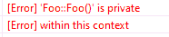
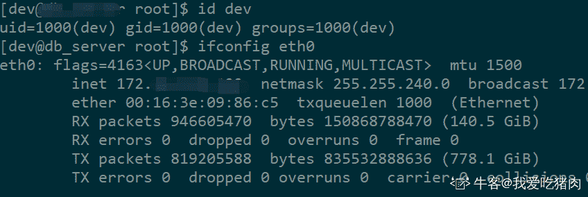

# 网易 2020 校招笔试- C 开发工程师（正式批）

## 1

在数据结构中，二叉树高度是从叶节点开始（其高度为 1）自底向上逐层累加，已知某二叉树的中序序列为 DCEBFGJ,先序序列为 BCDEFGJ,则该二叉树的高度为（  ）。

正确答案: D   你的答案: 空 (错误)

```cpp
6
```

```cpp
5
```

```cpp
3
```

```cpp
4
```

本题知识点

安卓工程师 网易 C++工程师 测试开发工程师 Java 工程师 算法工程师 2020

讨论

[岗迭尼山歌龙](https://www.nowcoder.com/profile/514863126)

树长这样, 或者 J 左也行                                            B                                        /        \
                                    C            F
                                /        \            \                            D            E            G
                                                            \
                                                               J

发表于 2020-04-06 15:22:16

* * *

[牛客 275380287 号](https://www.nowcoder.com/profile/275380287)

题目的含义为：根据中序遍历和先序遍历可以确定一棵树。同理根据中序遍历和后序遍历也可以确定一棵树。

发表于 2020-03-08 23:09:20

* * *

[逗先生](https://www.nowcoder.com/profile/968722814)

树长这样, 或者 J 左也行                                            B                                        /        \
                                    C            F
                                /        \            \                            D            E            G
                                                            \
                                                               J

发表于 2019-12-09 15:12:36

* * *

## 2

以下哪个可能会产生编译错误？

```cpp
#include<iostream>
class Foo
{
public:
    Foo(int v) :m_value(v) { } //1
    void print()
    {
        std::cout << m_value;
    }
    ~Foo() {}

private:
    Foo() { m_value = 0; }//2
    int m_value;
};
int main()
{
    Foo a;//3
    a.print();
    Foo b(1);//4
    b.print();
}
```

正确答案: C   你的答案: 空 (错误)

```cpp
1
```

```cpp
2
```

```cpp
3
```

```cpp
4
```

本题知识点

C++工程师 网易 Java 工程师 算法工程师 2020

讨论

[Lishey](https://www.nowcoder.com/profile/328175061)

是因为还没有定义变量就调用了默认构造函数的原因吗？在本地跑了一下，发现是因为声明变量 a 的时候，优先调用的是默认构造函数，而类中的默认构造函数是私有的，而访问类私有元素是不允许的，主函数中对象 a 的声明本身没有问题，因此编译报错的是 2 部分

编辑于 2019-12-10 10:58:05

* * *

[好学的小白](https://www.nowcoder.com/profile/667266513)

变量定义未初始化值

发表于 2019-12-03 10:46:54

* * *

## 3

数据结构中，沿着某条搜索路线，依次对树中每个结点均做一次且仅做一次访问。对二叉树的结点从 1 开始进行连续编号，要求每个结点的编号大于其左、右孩子的编号，同一结点的左右孩子中，其左孩子的编号小于其右孩子的编号，可采用（  ）次序的遍历实现编号。

正确答案: C   你的答案: 空 (错误)

```cpp
先序
```

```cpp
中序
```

```cpp
后序
```

```cpp
从根开始按层次遍历
```

本题知识点

C++工程师 网易 iOS 工程师 Java 工程师 测试工程师 测试开发工程师 大数据开发工程师 算法工程师 前端工程师 数据分析师 安卓工程师 安全工程师 运维工程师 2020

讨论

[繁华落尽君辞去](https://www.nowcoder.com/profile/569656804)

先序 根左右中序 左根右后序 左右根

发表于 2019-12-03 21:47:17

* * *

[MV13eard](https://www.nowcoder.com/profile/863005403)

这题要理解题意：对二叉树的结点从 1 开始进行连续编号，意思就是把 1，2，3，4....这些数按从小到大的顺序依次放到二叉树中，并要求的放法是：左孩子<右孩子<根节点；这时候再看三种次序的遍历，先序 根左右中序 左根右后序 左右根，很显然，只有后序满足条件。

发表于 2020-03-03 11:21:25

* * *

[依昂](https://www.nowcoder.com/profile/920832473)

是我的理解有问题吗，题目中说的是每个结点的编号大于其左、右孩子的编号，这个的意思难道不是根的节点编号都要大于左右孩子的编号吗

发表于 2020-09-11 14:13:24

* * *

## 4

现在假设对 N 个元素的链表做顺序查找时，若查找每个元素的概率相同，则平均查找长度为（   ）？

正确答案: A   你的答案: 空 (错误)

```cpp
(N+l)/2
```

```cpp
N/2
```

```cpp
N
```

```cpp
[(1+N)*N]／2
```

本题知识点

安卓工程师 网易 C++工程师 iOS 工程师 Java 工程师 测试工程师 测试开发工程师 大数据开发工程师 算法工程师 前端工程师 数据分析师 安全工程师 运维工程师 2020

讨论

[L201710091511469](https://www.nowcoder.com/profile/1515815)

第一个数的比较次数为 1，第二个数的比较次数为 2。。。以此类推第 N 个数的比较次数为 N，所以总的比较次数为 1+2+...+N=N(N+1)/2,平均比较次数为(N+1)/2,也即平均查找长度。

发表于 2019-12-19 17:26:33

* * *

[阳光脆薄如纸](https://www.nowcoder.com/profile/904336422)

总长度 n(n+1)/2 除以总个数 n

发表于 2019-11-28 15:57:51

* * *

[零葬](https://www.nowcoder.com/profile/75718849)

第一个数的比较次数为 1，概率为 1/N；第二个数的比较次数为 2，概率为 1/N……以此类推第 N 个数的比较次数为 N，概率为 1/N。数学期望为：1/N*1 + 1/N*2 + ... 1/N*(N-1) + 1/N*N = 1/N*(1+2+...+N-1+N) = 1/N*(N+1)*N/2 = (N+1)/2

发表于 2020-10-21 15:09:53

* * *

## 5

假设有选课表 course_relation(student_id, course_id)，其中 student_id 表示学号，course_id 表示课程编号，如果小易现在想获取每个学生所选课程的个数信息，请问如下的 sql 语句正确的是（ ）

正确答案: D   你的答案: 空 (错误)

```cpp
select student_id, sum(course_id) from course_relation;
```

```cpp
select student_id, sum(course_id) from lcourse_relation group by student_id;
```

```cpp
select student_id, count(course_id) from course_relation;
```

```cpp
select student_id, count(course_id) from course_relation group by student_id;
```

本题知识点

SQL 数据分析师 牛客 2021 数据库

讨论

[MapleAndJoker](https://www.nowcoder.com/profile/310356190)

求和用累加 sum(),求行的个数用累计 count()。（复制粘贴的）

发表于 2020-02-25 19:24:05

* * *

[筱妉儿](https://www.nowcoder.com/profile/5411729)

group by 更多的起到了同类对应求和，不加的话只会机械式的把所有的求和，对数据的查询提取无法实现。

发表于 2021-07-15 16:28:45

* * *

[Lucval](https://www.nowcoder.com/profile/300108835)

要注意区分 sum()和 count()的用法区别。假如有有三门课程及其编号：语文-A，数学-B，英语-C 而 sum(course_id)=A+B+C，并非题目所求 

发表于 2020-07-24 15:48:29

* * *

## 6

关于 Linux 下面说法正确的是？

正确答案: A C   你的答案: 空 (错误)

```cpp
可以使用一般身份用户执行 ifconfig eth0 指令
```

```cpp
可以将“.”加入到 PATH 的查询目录中
```

```cpp
find ./ -name XXX 命令可以查找当前目录以及子目录有没有 XXX 文件
```

```cpp
linux 操作系统可以对目录进行硬链接
```

本题知识点

安卓工程师 网易 C++工程师 iOS 工程师 Java 工程师 大数据开发工程师 算法工程师 安全工程师 运维工程师 2020

讨论

[牛客 964288520 号](https://www.nowcoder.com/profile/964288520)

硬链接只能在同一文件系统中的文件之间进行链接，不能对目录进行创建。

发表于 2020-08-07 14:56:59

* * *

[NetWorker](https://www.nowcoder.com/profile/705946083)

这道题选 A  一般用户也可以执行 ifconfig 指令 至于 eth0 如果没这个网卡的话用 root 用户也查看不了啊 C init.d 是 linux7.0 之前首先启动的进程，在 rhel7.0 之后的版本首先启动的是 systemd

发表于 2020-02-27 10:39:15

* * *

[我爱吃猪肉](https://www.nowcoder.com/profile/3015445)

C 肯定对的，但亲测 A 也是对的，题库可以更新答案了~

发表于 2019-12-20 16:54:26

* * *

## 7

有关 c++语言的引用，以下选项正确的是：

正确答案: C   你的答案: 空 (错误)

```cpp
引用不需要初始化；
```

```cpp
引用初始化后，可以重新绑定到另外一个对象；
```

```cpp
引用本身不是一个对象，所以不能定义引用的引用；
```

```cpp
引用本身不是一个对象，但是可以定义指向引用的指针；
```

本题知识点

C++工程师 网易 Java 工程师 算法工程师 2020

讨论

[MapleAndJoker](https://www.nowcoder.com/profile/310356190)

A C++引用需要初始化，不然定义的引用无地址无内容 B 简单易懂 https://blog.csdn.net/wu_123_456/article/details/39929003 C 引用一但定义后就不能再改变 D 指针需要指向一个对象。引用不是对象

发表于 2020-02-25 19:49:15

* * *

## 8

设文件 F1 的当前引用计数值为 2，先建立 F1 的符号链接（软链接）文件 F2，再建立 F1 的硬链接文件 F3，此时，F2 和 F3 的引用计数值分别是?

正确答案: A   你的答案: 空 (错误)

```cpp
2，3
```

```cpp
3，3
```

```cpp
1，2
```

```cpp
2，2
```

```cpp
0，3
```

本题知识点

安卓工程师 网易 C++工程师 iOS 工程师 Java 工程师 算法工程师 2020

讨论

[悠悠的晚空](https://www.nowcoder.com/profile/714364801)

引用计数值记录共享该文件的目录数，建立文件时为 count = 1，每建立一个硬链接 count++，建立[软链接](https://www.baidu.com/s?wd=%E8%BD%AF%E9%93%BE%E6%8E%A5&tn=SE_PcZhidaonwhc_ngpagmjz&rsv_dl=gh_pc_zhidao)count 值不变，删除链接时软硬 count 都会减 1

发表于 2020-01-03 11:46:55

* * *

[PiggyFlowers](https://www.nowcoder.com/profile/632996406)

软连接的 count 为什么是 2

发表于 2021-12-19 21:43:18

* * *

[岗迭尼山歌龙](https://www.nowcoder.com/profile/514863126)

为了使文件实现共享，通常在文件的索引节点中设置一个链接计数字段，用来表示链接到本文件的用户目录项的数目(引用计数值)。当新文件建立时，一般默认引用计数值为 1。
硬链接可以看作是已存在文件的另一个名字，新文件和被链接文件指向同一个节点，引用计数值加 1。当删除被链接文件时，只是把引用计数值减 1，直到引用计数值为 0 时，才能真正删除文件

发表于 2020-04-06 15:50:38

* * *

## 9

以下 C++代码输出几个"1"？

```cpp
#include<iostream> 
using namespace std;
class TestClass {
private:
    int number;
public:
    TestClass(int n)
    {
        number = n;
    }
    TestClass(const TestClass& rhs)
    {
        number = rhs.number;
        std::cout << "1" << std::endl;
    }
    TestClass operator=(const TestClass& rhs) {
        number = rhs.number;
        return *this;
    }
};
int main()
{
    TestClass a(1),b(2),c(3);
    a = b = c;
    return 0;
}
```

正确答案: C   你的答案: 空 (错误)

```cpp
0
```

```cpp
1
```

```cpp
2
```

```cpp
3
```

```cpp
4
```

本题知识点

C++工程师 网易 Java 工程师 算法工程师 2020

讨论

[扬子居 1](https://www.nowcoder.com/profile/620013238)

重载=函数的返回值应该为类型的引用 否则会调用拷贝构造函数

发表于 2020-02-03 13:16:56

* * *

[AngusKK](https://www.nowcoder.com/profile/69577881)

因为复制构造函数不是以引用的形式返回，所以他会在返回的时候调用拷贝构造函数构造一次，所以调了两次.长见识了！！！

发表于 2020-08-01 09:30:09

* * *

[good_study](https://www.nowcoder.com/profile/997305769)

因为复制构造函数不是以引用的形式返回，所以他会在返回的时候调用拷贝构造函数构造一次，所以调了两次

发表于 2020-08-01 00:11:55

* * *

## 10

小易有个 32G 字节的文件，需要从电脑 1 传送到电脑 2，假设两者之间是 1024Mbit/s 的网络，那么需要多久能传输完

正确答案: C   你的答案: 空 (错误)

```cpp
32 秒
```

```cpp
128 秒
```

```cpp
256 秒
```

```cpp
512 秒
```

本题知识点

安卓工程师 网易 C++工程师 iOS 工程师 Java 工程师 测试工程师 测试开发工程师 大数据开发工程师 算法工程师 前端工程师 安全工程师 2020

讨论

[小柒~](https://www.nowcoder.com/profile/280179381)

一字节等于 8 位 32 * 8 * 1024 M bit /1024Mbit/s = 256s

发表于 2019-12-02 10:03:46

* * *

[我是郑姐](https://www.nowcoder.com/profile/210791643)

注意 Mbit/s 和 Mbyte/s 一字节等于八位

发表于 2019-11-28 20:53:51

* * *

[牛客 988596129 号](https://www.nowcoder.com/profile/988596129)

bit   byte 看准确

发表于 2021-01-12 10:41:30

* * *

## 11

int8 量化：32 位浮点数 float32 转化成 8 位定点数 int8 一维 float(32bit)数组，N 个元素，元素值相对比较集中（如值从-0.5 到 1.0），如何压缩成大小同样为 N 的 int8(8bit)数组。

你的答案

本题知识点

C++工程师 网易 Java 工程师 算法工程师 2020

## 12

你在近两三年的学习生涯中，在哪方面能力提高最多？和同龄人比你最擅长的是什么？在技术上你的优势是什么？列举事实例子述说。

你的答案

本题知识点

C++工程师 网易 Java 工程师 算法工程师 2020

## 13

小易给定你一个长度为的正整数序列，你每次可以使用的代价将某个数加一或者减一，你希望用最少的代价使得所有数的乘积等于，求最小代价（操作结束后每个数也必须是正整数）。

本题知识点

C++工程师 网易 Java 工程师 算法工程师 2020

讨论

[淘系搜推](https://www.nowcoder.com/profile/746687677)

使用动态规划方法：dp[i][j] 表示前 i 个数的乘积等于 j 时所需要进行的变换的最小代价。例如

```cpp
dp[n][12] = min(

    // dp[n-1][12]表示前 n-1 个数（从 1 开始计数）乘积变为 12 的最小代价数，
    // abs(h[n-1] - 1) 表示 h 中的第 n 个数（索引为 n-1）变为 1 的代价
    dp[n-1][12] + abs(h[n-1] - 1),
    // dp[n-1][6]表示前 n-1 个数（从 1 开始计数）乘积变为 6 的最小代价数，
    // abs(h[n-1] - 2) 表示 h 中的第 n 个数（索引为 n-1）变为 2 的代价
    dp[n-1][6]  + abs(h[n-1] - 2),

    dp[n-1][4]  + abs(h[n-1] - 3),

    dp[n-1][3]  + abs(h[n-1] - 4),

    dp[n-1][2]  + abs(h[n-1] - 6),

    dp[n-1][1]  + abs(h[n-1] - 12)

)

```

这样就建立起了 dp[n][] 和 dp[n-1][]的关系

```cpp
import java.util.Scanner;
public class Main{

    public static void main(String[] args) {
        Scanner scanner = new Scanner(System.in);
        int n = scanner.nextInt();
        int target = scanner.nextInt();

        int[] h = new int[n];
        for(int i = 0; i < n; i++) {
            h[i] = scanner.nextInt();
        }

        //dp[i][j] 表示前 i 个数字 使得为 j 所需要的代价
        Integer[][] dp = new Integer[n+1][target + 1];

        int sum = 0;
        for(int i = 1; i <= n; i++) {
            sum += h[i-1] - 1;
            dp[i][1] = sum;
        }

        for (int j = 1; j <= target; j++) {
            dp[1][j] = Math.abs(j - h[1-1]);
        }

        int result = doCheck(dp, n, target, h);

        System.out.println(result);

    }

    private static int doCheck(Integer[][] dp, int n, int target, int[] h) {
        if (dp[n][target] != null) {
            return  dp[n][target];
        }

        //dp[n][target] == null

        int min = Integer.MAX_VALUE;
        for (int i = 1; i <= target; i++) {
            if (target % i != 0) {
                continue;
            }

            int j = target / i;
            min = Math.min(min, doCheck(dp, n-1, j, h) + Math.abs(h[n-1] - i));
        }

        return dp[n][target] = min;
    }
}
```

发表于 2020-04-06 15:46:43

* * *

[cdf](https://www.nowcoder.com/profile/7051860)

c++通过百分之百，1000*100000 的数据量不知道为什么也过了。由于直接开数组超内存了，所以就开 map 了。记忆化搜索，dp[i][j]代表操作前 i 位数字的乘积为 j 的代价。

```cpp
#include <bits/stdc++.h>
using namespace std;
int n,b;
const int maxn=1e5+5;
int nums[1010];
//int dp[101][maxn];
map<int ,map<int ,int>> dp;
int dfs(int i,int x){
    if(i==0) return abs(nums[i]-x);
    if(dp.count(i) && dp[i].count(x)) return dp[i][x];
    int ans=INT_MAX-100000;
    for (int j=1;j*j<=x;j++){
        //cout<<j<<" ";
        if (x%j!=0) continue;
        int k=x/j;
        ans=min(ans,dfs(i-1,j)+abs(k-nums[i]));
        ans=min(ans,dfs(i-1,k)+abs(j-nums[i]));
    }
    return dp[i][x]=ans;
}

int main(){
    ios::sync_with_stdio(0);
    cin>>n>>b;
    //memset(dp,-1,sizeof(dp));
    for (int i=0;i<n;i++){
        cin>>nums[i];
    }
    cout<<dfs(n-1,b)<<endl;
}

```

编辑于 2020-08-06 21:41:07

* * *

[不啻逍遥然](https://www.nowcoder.com/profile/109768474)

```cpp
n,target=list(map(int,input().split()))
nums=list(map(int,input().split()))

tar=target
nums.sort(reverse=True)
left=[]
for i in range(len(nums)):
    if tar%nums[i]==0 and nums[i]!=1:
        tar//=nums[i]
    else:
        left.append(nums[i])
count1=abs(left.pop(0)-tar) if tar!=1 else 0
for each in left:
    count1+=abs(each-1)

count2=0
for i in range(len(nums)):
    if abs(nums[i]-target)==1:
        nums.pop(i)
        count2+=1
        break
for each in nums:
    count2+=abs(each-1)

if count2==0:#说明 count2 部分并未满足上述条件
    print(count1)
else:#若 count2!=0，则比较哪种更小
    print(min(count1,count2))
```

发表于 2020-08-09 16:48:44

* * *

## 14

小易定义一个数字序列是完美的，当且仅当对于任意，都满足，即每个数字都要大于等于前面所有数字的和。
现在给定数字序列，小易想请你从中找出最长的一段连续子序列，满足它是完美的。

本题知识点

C++工程师 网易 iOS 工程师 Java 工程师 测试开发工程师 算法工程师 数据分析师 安卓工程师 安全工程师 2020

讨论

[牛客 364917519 号](https://www.nowcoder.com/profile/364917519)

```cpp
import sys

def find_longest(l):
    i, j = 0, 1
    cur = 0
    while j < len(l) and i < len(l):
        while j < len(l) and sum(l[i:j]) <= l[j]:
            j += 1
        cur = max(cur, j - i)

        i = j
        j = i + 1

    return cur

n = int(sys.stdin.readline())
for i in range(n):
    size = int(sys.stdin.readline())
    a = list(map(int, sys.stdin.readline().split()))
    print(find_longest(a))
```

发表于 2020-03-30 06:28:38

* * *

[零葬](https://www.nowcoder.com/profile/75718849)

采用双指针滑动窗口来求解

```cpp
import java.util.*;

public class Main {
    public static void main(String[] args) {
        Scanner sc = new Scanner(System.in);
        int T = sc.nextInt();
        while(T-- > 0){
            int n = sc.nextInt();
            int[] nums = new int[n];
            for(int i = 0; i < n; i++) nums[i] = sc.nextInt();
            System.out.println(solve(nums));
        }
    }

    // 直接用滑动窗口计算窗口内的元素之和来判断
    private static int solve(int[] nums) {
        int left = 0, right = 1;
        long sum = nums[0];
        int maxLen = 0;
        while(right < nums.length){
            if(nums[right] >= sum){
                maxLen = Math.max(maxLen, right - left + 1);
                sum += nums[right];
                right ++;
            }else{
                sum -= nums[left];
                left ++;
            }
        }
        return maxLen;
    }
}
```

发表于 2020-10-22 15:52:04

* * *

[酷宝向前冲](https://www.nowcoder.com/profile/6803063)

双指针滑动窗口 AC

```cpp
public static void main(String[] args) {
    Scanner sc = new Scanner(System.in);
    int m = sc.nextInt();
    while(m-- > 0) {
        int n = sc.nextInt();
        int[] nums = new int[n];
        for(int i = 0; i < n; i++) {
            nums[i] = sc.nextInt();
        }
        System.out.println(longestSub(nums));
    }
}

public static int longestSub(int[] nums) {
    int i = 0, j = 1, max = 0, sum = nums[0],n = nums.length;
    while(j < n) {
        if(nums[j] >= sum) {
            sum += nums[j];
            max = Math.max(max, j-i+1);
            j++;
        } else {
            sum -= nums[i];
            i++;
        }
    }
    return max;
}
```

编辑于 2020-08-07 14:52:51

* * *

## 15

小易的公司一共有名员工, 第个人每个月的薪酬是万元。
现在小易的老板向小易提了次询问, 每次询问老板都会给出一个整数, 小易要快速回答老板工资等于的员工的数量。

本题知识点

安卓工程师 网易 C++工程师 Java 工程师 测试工程师 大数据开发工程师 算法工程师 数据分析师 运维工程师 2020

讨论

[4399 内推](https://www.nowcoder.com/profile/932711750)

```cpp
/**
hashmap 记录当前输入的数字和数量，判断是否存在。
如已存在，则直接数量加 1，否则放入数字，数量设为 1.
最后根据 map.get(key)判断是否存在该数字，存在则返回 value，否则返回 0.
*/

import java.util.HashMap;
import java.util.Scanner;
public class Main{
    public static void main(String[] args){
        int n,m;
        int input;
        Scanner sc = new Scanner(System.in);
        n=sc.nextInt();
        m=sc.nextInt();
        int a;
        HashMap<Integer,Integer> hm = new HashMap();
        for(int i=0;i<n;i++){
            a=sc.nextInt();
            if(hm.containsKey(a)){
                hm.put(a,hm.get(a)+1);
            }else{
                hm.put(a,1);
            }
        }
        while(m--!=0){
            input=sc.nextInt();
            if(hm.get(input)!=null){
                System.out.println(hm.get(input));
            }else{
                System.out.println(0);
            }
        }

    }
}
```

 编辑于 2020-08-07 15:24:59

* * *

[牛客 364917519 号](https://www.nowcoder.com/profile/364917519)

```cpp
from collections import Counter
n,m = map(int,input().split())
salary = list(map(int,input().split()))
frequency_dict = dict(Counter(salary))

for i in range(m):
    question = int(input())
    print(frequency_dict.get(question,0))
```

发表于 2020-03-30 06:53:25

* * *

[零葬](https://www.nowcoder.com/profile/75718849)

直接用哈希表来进行计数，在老板给出 query 时直接查询哈希表

```cpp
import java.io.BufferedReader;
import java.io.InputStreamReader;
import java.io.IOException;
import java.util.HashMap;

public class Main {
    public static void main(String[] args) throws IOException {
        BufferedReader br = new BufferedReader(new InputStreamReader(System.in));
        String start;
        while((start = br.readLine()) != null) {
            String[] strNM = start.trim().split(" ");
            int n = Integer.parseInt(strNM[0]), m = Integer.parseInt(strNM[1]);
            String[] strArr = br.readLine().trim().split(" ");
            // 直接用哈希表来计数
            HashMap<String, Integer> map = new HashMap<>();
            for(int i = 0; i < n; i++){
                if(map.containsKey(strArr[i]))
                    map.put(strArr[i], map.get(strArr[i]) + 1);
                else
                    map.put(strArr[i], 1);
            }
            for(int i = 0; i < m; i++)
                System.out.println(map.getOrDefault(br.readLine().trim(), 0));
        }
    }
}
```

发表于 2020-10-22 15:53:30

* * *

## 16

小易有堆积木，第堆积木有块。小易还拥有一个容量无限的背包。
一开始小易站在第一堆积木旁边。每次小易可以选择进行下列三种操作中的一种：
1、从背包里掏出一块积木（如果有的话）放到当前这一堆里
2、从当前这一堆积木里掏出一块塞到背包里(如果当前积木堆不为空的话)
3、从当前这一堆走到下一堆。
一开始小易的背包里有块积木。小易希望把这些个积木变成严格递增的（即。小易希望知道这是否有可能能完成。（所有操作结束后不需要保证背包里没有积木了，可以有积木堆为空）。

本题知识点

安卓工程师 网易 C++工程师 iOS 工程师 大数据开发工程师 Java 工程师 算法工程师 前端工程师 运维工程师 2020

讨论

[安静 wsno1](https://www.nowcoder.com/profile/105030908)

所有的积木都按照 0，1，2，3...这样排，所以只需要判断到第 i 个积木时，前面 i 个积木堆加上背包里的 m 大于等于 i*(i+1)/2 就行了 T =int(input())for t in range(T):    nm =[int(n) for n in input().split()]    n =nm[0]    m =nm[1]    h =[int(n) for n in input().split()]    number =m    result =True    for i in range(n):        number =number+h[i]        if(number<(i*(i+1)/2)):            result =False            break    if(result ==True):        print("YES")    else:        print("NO")

发表于 2020-03-27 18:02:41

* * *

[大口饭团](https://www.nowcoder.com/profile/146611959)

这题描述不是贼烂？？只能从这三种选择里选的话，拿或者放了一个就不能走了？（意味着我只能改动一次）。。。如果说是拿或者放一个还能走。。示例 1 都过不了。。。。

```cpp
1
5 3
2 2 3 3 1
```

比如 1，2，3，3，1 。m=41，2，3，3，1。m=41，2，3，4，1。m=31，2，3，4，4。m=0 最后一个无论如何你都搞不了。。。实际上题目的意思是拿或者放了可以不走，继续拿或者放（实际就是你能无限拿，无限放。）。。。。

```cpp
noOfdata = int(input())
for _ in range(noOfdata):
    n, m = map(int, input().split(' '))
    items = list(map(int, input().split(' ')))
    m += items[0]
    items[0] = 0 
    prevItem = items[0]
    ok = True
    for idx in range(1, len(items)):
        if items[idx] > idx:
            m += items[idx] - idx
            items[idx] = idx
        elif items[idx] == idx:
            prevItem = items[idx]
        elif items[idx] < idx:
            placeItems = idx - items[idx]
            if m >= placeItems:
                m -= placeItems
                items[idx] = idx
            else:
                ok = False
                break
    if ok:
        print("YES")
    else:
        print("NO")
```

发表于 2020-02-27 13:55:23

* * *

[零葬](https://www.nowcoder.com/profile/75718849)

将积木调整为 0,1,2,3,...，当第 i 堆积木大于 i 时，从堆中拿积木放入包里；当第 i 堆积木小于 i 时，从背包里拿出积木放入堆中，如果在进行这个操作时没包里有积木了，就无法完成，直接返回 NO。如果遍历完之后都没有跳出，则表示可以完成，返回 YES。

```cpp
import java.util.Scanner;

public class Main {
    public static void main(String[] args) {
        Scanner sc = new Scanner(System.in);
        int T = sc.nextInt();
        while(T-- >0){
            int n = sc.nextInt(), m = sc.nextInt();
            int[] arr = new int[n];
            for(int i = 0; i < n; i++) arr[i] = sc.nextInt();
            System.out.println(solve(arr, m));
        }
    }

    // 为了留下的积木少，积木堆就按照 0,1,2,...的方式排
    private static String solve(int[] arr, int m) {
        boolean flag = true;
        long bagHeapNum = m;
        for(int i = 0; i < arr.length; i++){
            if(arr[i] > i) {
                bagHeapNum += arr[i] - i;
            }else if(arr[i] < i){
                if(bagHeapNum >= i - arr[i])
                    bagHeapNum -= i - arr[i];
                else
                    return "NO";
            }
            arr[i] = i;        // 这一句可写可不写，因为并不需要返回调整后的积木堆数组，只要知道能否调整即可
        }
        return "YES";
    }
}
```

发表于 2020-10-22 15:57:16

* * *