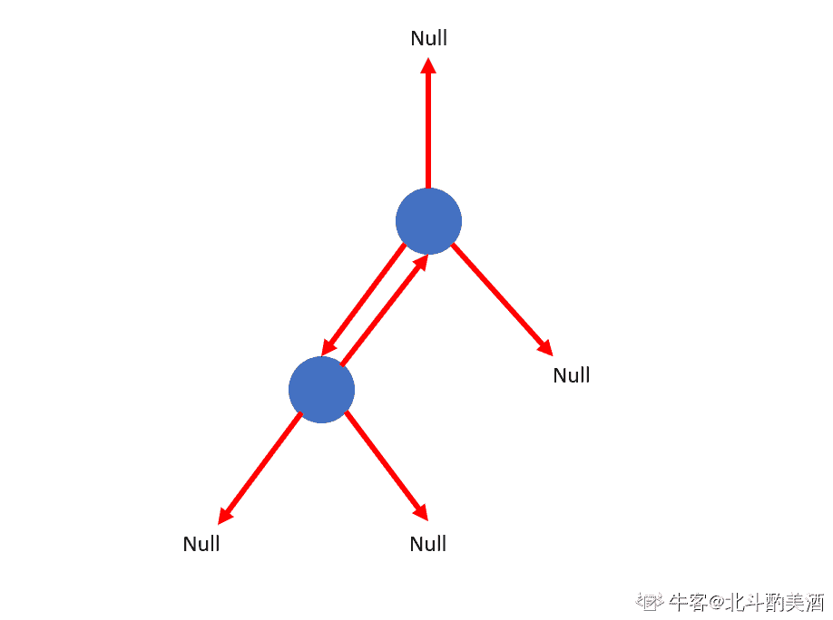
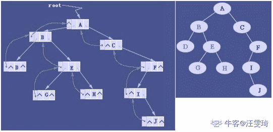

# 网易 2020 校招笔试- Unity3D 开发工程师（提前批）

## 1

电子邮件系统中，用户代理把邮件发往发送发邮件服务器、发送方邮件服务器把邮件发往接收方邮件服务器以及用户使用用户代理从接收方邮件服务器上读取邮件时，使用的协议可能是以下的哪种情形（）

正确答案: D   你的答案: 空 (错误)

```cpp
IMAP 、SMTP、POP3
```

```cpp
MIME、SMTP、POP3
```

```cpp
SMTP、IMAP、POP3
```

```cpp
SMTP、SMTP、IMAP
```

本题知识点

安卓工程师 网易 C++工程师 Java 工程师 大数据开发工程师 2020

讨论

[等一手 offer](https://www.nowcoder.com/profile/123605437)

邮件服务需要两种不同的协议。一种是用户代理向邮件服务器发送邮件或在邮件服务器之间发送邮件，如 SMTP 协议；另外一种是用于用户代理从邮件服务器读取邮件，如邮局协议 POP3

编辑于 2021-04-14 15:36:52

* * *

[夏目川城](https://www.nowcoder.com/profile/713197505)

SMTP：发件人用户代理 ----发送邮件---> 发送方邮件服务器            发送方邮件服务器 ----发送邮件---> 接收方邮件服务器 POP3/IMAP：接受方邮件服务器----读取邮件---> 收件人用户代理

发表于 2020-04-07 15:23:34

* * *

[掌心里的小雨](https://www.nowcoder.com/profile/86073671)

考点：计算机网路--网络层--电子邮件
知识点：

*   一个电子邮件系统由三部分组成：用户代理、邮件服务器以及邮件协议。
*   **用户代理**：用户代理允许用户阅读、回复、转发、保存或撰写，如网易 163 邮箱等；
*   **邮件服务器**：是电子邮件结构的核心，分为发送方邮件服务器和接收方邮件服务器，用户发邮件需要邮件代理向邮件发送方服务器发送邮件，而用户想阅读邮件需要用户代理在邮件服务器中取得邮件，邮件服务器通过用户名和口令鉴别用户；
*   **邮件协议**：邮件协议包含发送协议和读取协议，**发送协议常用 SMTP**，**读取协议常用 POP3 和 IMAP。**
*   **SMTP：** 只能发送 7 比特 ASCII 码格式，而互联网邮件扩充 MIME 可以发送二进制文件。MIME 并没有改动或者取代 SMTP，而是增加邮件主体的结构，定义了非 ASCII 码的编码规则。
*   **POP3**的特点是只要用户从服务器上读取了邮件，就把该邮件删除。
*   **IMAP 协议**中客户端和服务器上的邮件保持同步，如果不手动删除邮件，那么服务器上的邮件也不会被删除。IMAP 这种做法可以让用户随时随地从任何一台机器去访问服务器上的邮件。
    

> 引用《计算机网络自顶向下方法》

发表于 2020-08-04 11:29:40

* * *

## 2

有一类二叉树用三叉链表来存储的时候除了带有指向左右孩子节点的两个指针，还有指向父节点的指针，那么这样一棵二叉树有 2 个节点，那么有多少指针指向 NULL（注：根节点的父指针指向 NULL，对于不存在的节点表示为 NULL）？

正确答案: D   你的答案: 空 (错误)

```cpp
1
```

```cpp
2
```

```cpp
3
```

```cpp
4
```

```cpp
5
```

本题知识点

Java 工程师 C++工程师 网易 安全工程师 测试开发工程师 前端工程师 数据分析师 数据库工程师 算法工程师 iOS 工程师 安卓工程师 运维工程师 2020

讨论

[北斗酌美酒](https://www.nowcoder.com/profile/170736954)



发表于 2020-04-11 11:37:30

* * *

[流浪者 201907280945510](https://www.nowcoder.com/profile/60649645)

每个节点有 3 个指针，两个节点一共 6 个指针，其中 A 节点父节点指向 B 节点， B 节点子节点指向 A 节点，剩下的 4 个节点全部是 NULL

发表于 2020-02-17 09:51:27

* * *

[小水滴真的是太可爱了吧](https://www.nowcoder.com/profile/742091450)

**三叉链表存储表示**

改进于二叉链表，增加指向父节点的指针，能更好地实现结点间的访问。



发表于 2020-04-07 10:38:28

* * *

## 3

图 N 是有 7 个顶点的强连通图，那么 N 是有向图，那么 N 最少有（）条边?如 N 为无向图，N 最少有（）条边？

正确答案: D   你的答案: 空 (错误)

```cpp
21,21
```

```cpp
21,20
```

```cpp
7,7
```

```cpp
7,6
```

```cpp
8,7
```

本题知识点

C++工程师 网易 Java 工程师 测试工程师 测试开发工程师 算法工程师 2020 2021

讨论

[猫仔面](https://www.nowcoder.com/profile/4548438)

强连通图：在 G 中，如果对于每一对 vi、vj（vi≠vj），从 vi 到 vj 和从 vj 到 vi 都存在路径。n 个顶点的有向强连通图：至少 n 条边（形成一个环）；至多 n(n-1)条边 n 个顶点的无向强连通图：至少 n-1 条边（形成一条直线）；至多 n(n-1)/2 条边

发表于 2020-08-06 13:04:57

* * *

[牛客 142348115 号](https://www.nowcoder.com/profile/142348115)

N 为有向图则为一个环，N 为无向图则为一条线

发表于 2019-12-13 16:37:42

* * *

[牛客 221048556 号](https://www.nowcoder.com/profile/221048556)

如果是无向图，可以是 7 个顶点连成一条直线，也可以是 1 个中心顶点与周围 6 个顶点分别连接。

发表于 2020-08-07 12:59:44

* * *

## 4

判断一个数组或序列是正序,倒序还是乱序,需要我们将这个数组完整的遍历一遍通过构建有序序列，对于未排序数据，在已排序序列中从后向前扫描，找到相应的位置并插入的排序算法是（ ）

正确答案: C   你的答案: 空 (错误)

```cpp
选择排序
```

```cpp
希尔排序
```

```cpp
插入排序
```

```cpp
归并排序
```

本题知识点

iOS 工程师 网易 安卓工程师 C++工程师 Java 工程师 安全工程师 测试工程师 大数据开发工程师 前端工程师 算法工程师 数据分析师 数据库工程师 运维工程师 2020

讨论

[Olivia_dtt](https://www.nowcoder.com/profile/232985383)

选择排序：每次从数组中选出一个最小数（最大数）放到数组最前面，存放在序列的起始位置，直到全部待排序的数据元素排完。希尔排序：设置增量分割数组，逐步进行直接插入排序,增量逐趟减少,并最后使得整个数组基本有序,再对整体进行直接插入排序。插入排序：构建有序序列，未排序数据依次从已排序数据按从后往前比较，插入到合适的位置。归并排序：把序列分成两个长度为 n/2 的子序列，对这两个子序列分别归并排序（循环将两个数组的第一个值比较，并弹出第一个值， 直到数组长度都不存在），将两个排序好的子序列合并成一个最终的排序序列

发表于 2020-04-06 20:12:11

* * *

[牛客 929822447 号](https://www.nowcoder.com/profile/929822447)


插入排序—直接插入排序：


希尔排序：

 

选择排序：

 

归并排序：


发表于 2020-08-24 18:42:35

* * *

## 5

队列是一种特殊的线性表，特殊之处在于它只允许在表的前端（front）进行删除操作，而在表的后端（rear）进行插入操作，和栈一样，队列是一种操作受限制的线性表，进行插入操作的端称为队尾，进行删除操作的端称为队头，若用一个大小为 6 的数组来实现循环队列，数组下标为[0,5]，且当前 rear 和 front 的值分别为 0 和 3，当从队列中删除一个元素，再加入两个元素后，rear 和 front 的值分别为多少？（   ）

正确答案: B   你的答案: 空 (错误)

```cpp
1 和 5
```

```cpp
2 和 4
```

```cpp
4 和 2
```

```cpp
5 和 1
```

本题知识点

iOS 工程师 网易 Java 工程师 C++工程师 安全工程师 测试工程师 测试开发工程师 大数据开发工程师 数据分析师 数据库工程师 2020

讨论

[惠州学院 _15_ 黄洪卫](https://www.nowcoder.com/profile/8631354)

这道题目说的是当前**rear**和**fro****nt**的值分别为 0 和 3，所以当前的队列为 3  4  5  0，front 为 3，rear 为 0，又因为是用一个大小为 6 的数组来实现的循环队列，所以删除一个插入两个后为 4  5  0  1  2，此时 front 为 4，rear 为 2，即答案为 2,4

发表于 2019-12-04 11:15:44

* * *

[猫仔面](https://www.nowcoder.com/profile/4548438)

顺序队列：入队 rear += 1 出队 front += 1 队列长度 = rear - front 循环队列：入队 rear = (rear + 1) % size 出队 front  = (front + 1) % size 队列长度 = (rear - front + size) % size

发表于 2020-08-06 15:02:52

* * *

[vicyor](https://www.nowcoder.com/profile/2210832)

初始时候,front 为 3，rear 为 0 删除一个元素(首部) ， front 为 4，rear 为 0 插入 2 个元素 ,               front 为 4，rear 为 2

发表于 2020-02-17 16:02:13

* * *

## 6

死锁是指多个进程在运行过程中因争夺资源而造成的一种僵局，永远在互相等待的进程称为死锁进程，假设计算机系统中有 3 个不同的临界资源 R1、R2 和 R3，被 4 个进程 p1、p2、p3 及 p4 共享。各进程对资源的需求为：p1 申请 R1 和 R2，p2 申请 R2 和 R3，p3 申请 R1 和 R3，p4 申请 R2。若系统出现死锁，则处于死锁状态的进程数至少是（  ）

正确答案: C   你的答案: 空 (错误)

```cpp
1
```

```cpp
2
```

```cpp
3
```

```cpp
4
```

本题知识点

iOS 工程师 网易 安卓工程师 C++工程师 Java 工程师 测试工程师 测试开发工程师 大数据开发工程师 前端工程师 算法工程师 数据库工程师 2020

讨论

[彭彭の零柒](https://www.nowcoder.com/profile/390870854)

3 个.这种情况： p1 占用 r1,p2 占用 r2，p3 占用 r3，p1 申请 r2，p2 申请 r3，p3 申请 r1，无限等待释放资源

发表于 2020-02-21 21:58:02

* * *

[我是复读机](https://www.nowcoder.com/profile/162099353)

要理解死锁的概念。死锁的进程必须是已经占有了某个资源，同时在请求其他资源，而且不会主动释放已占有的资源。如果几个进程循环等待其他进程已占有的资源，就陷入了死局，就死锁了。

发表于 2020-04-21 17:16:12

* * *

[猫仔面](https://www.nowcoder.com/profile/4548438)

我的理解：对于本题，有 3 个资源，所以如果出现死锁（环形等待），必定至少需要 3 个进程来分别占有 3 个资源（感觉怪怪的）

发表于 2020-08-06 15:18:29

* * *

## 7

ls -l 命令有以下输出，描述正确的是

正确答案: D   你的答案: 空 (错误)

```cpp
default.etcd 为可执行文件，只能被 root 执行
```

```cpp
go 目录占的磁盘空间大小为 4KB
```

```cpp
install-client.sh 脚本可以用./install-client.sh 命令执行
```

```cpp
go 文件夹可以被任意用户浏览
```

本题知识点

安卓工程师 网易 C++工程师 Java 工程师 安全工程师 测试工程师 测试开发工程师 大数据开发工程师 前端工程师 数据库工程师 iOS 工程师 运维工程师 2020

讨论

[我是复读机](https://www.nowcoder.com/profile/162099353)

A 是目录，不是文件；B 也是目录，所以 4096 表示的是该目录符所占的大小（注意，4096 不表示该目录下所有文件的大小）；C 没有 x 权限，不能直接./运行，但可以用 sh 运行；D 正确

发表于 2020-04-21 19:41:36

* * *

[offer-冲鸭](https://www.nowcoder.com/profile/447104610)

首先 d 表示这个文件是一个文件夹，然后文件的权限用其后一共有 9 个字符表示，分成三组，分别表示文件所属用户的权限，文件所属用户组的权限，其他人的权限，r 表示读权限, w 表示写权限， x 表示执行权限，你给的这个例子就是说 这是个文件夹，并且此文件所属用户拥有读、写、执行三项权限，其余的用户组，其他用户不拥有任何权限（全部都是-）--转

发表于 2020-04-03 22:52:49

* * *

[HEREISDAVID](https://www.nowcoder.com/profile/864672146)


发表于 2020-09-27 20:12:49

* * *

## 8

关于 C# 中的虚方法，以下说法中正确的是（ ）

正确答案: B   你的答案: 空 (错误)

```cpp
使用 static 修饰
```

```cpp
可以有方法体
```

```cpp
不可以被子类重写
```

```cpp
使用 abstract 修饰
```

本题知识点

Java 工程师 C++工程师 网易 2020

## 9

在 C#中，下列数据类型属于引用类型的是（ ）。

正确答案: C   你的答案: 空 (错误)

```cpp
整型（int）
```

```cpp
结构（struct）
```

```cpp
接口（interface）
```

```cpp
枚举（enum）
```

本题知识点

Java 工程师 C++工程师 网易 2020

讨论

[专业打假](https://www.nowcoder.com/profile/120779627)

C

发表于 2020-05-07 12:14:16

* * *

[牛客 350464883 号](https://www.nowcoder.com/profile/350464883)

C

发表于 2020-02-23 19:02:34

* * *

## 10

下列对 C#属性叙述正确的是（）

正确答案: D   你的答案: 空 (错误)

```cpp
C#中定义时 get 和 set 必须同时出现，访问时用.号即可，不用 get，set
```

```cpp
C#中定义和访问均要用 get 和 set 方法，可以不成对出现
```

```cpp
C#中访问时 get 和 set 必须同时出现
```

```cpp
C#中定义时 get 和 set 不用同时出现
```

本题知识点

Java 工程师 C++工程师 网易 2020

讨论

[归零 201810050845776](https://www.nowcoder.com/profile/35746792)

D,可以只有 Get()方法 或者 只有 Set()方法， 也可以 Get 和 Set 都有；只有 get 表示只能读取；只有 set 表示只能写入。

发表于 2021-10-14 16:30:45

* * *

[牛客 250320717 号](https://www.nowcoder.com/profile/250320717)

D

发表于 2021-01-14 21:25:20

* * *

[牛客 979550 号](https://www.nowcoder.com/profile/979550)

D，get 返回此变量，set value 赋值此变量，用啥写啥

发表于 2020-11-19 18:11:04

* * *

## 11

Unity3d 动态加载资源的方式有哪些，有什么区别？各举一个典型场景案例进行阐述。

你的答案

本题知识点

Java 工程师 C++工程师 网易 2020

讨论

[asdl6](https://www.nowcoder.com/profile/910480342)

1.  AssetDataBase.LoadAssetAtPath<T>()
2.  Resources.Load()
3.  AssetBundle.Load()
4.  UnityWebRequest

发表于 2021-04-07 14:29:37

* * *

[keyber](https://www.nowcoder.com/profile/989566955)

1.Resources.Load()方式加载 2.instaniate()加载 3.打包 AB 包，assetsbundle.load 加载

发表于 2021-02-21 10:50:41

* * *

## 12

你在近两三年的学习生涯中，在哪方面能力提高最多？和同龄人比你最擅长的是什么？在技术上你的优势是什么？列举事实例子述说。

你的答案

本题知识点

Java 工程师 C++工程师 网易 2020

## 13

小易学习了辗转相除法之后，就开始实践这个算法在求解最大公约数上。牛牛给小易出了一道不同寻常的求解最大公约数: 求解 a 和 b 的最大公约数，但是 a 和 b 的范围特别大。小易遇到了困难，向聪明的你寻求帮助，希望你能帮帮他。

本题知识点

C++工程师 网易 Java 工程师 大数据开发工程师 前端工程师 数据分析师 2020

讨论

[牛客 864355626 号](https://www.nowcoder.com/profile/864355626)

```cpp
def hcf(a, b):
    a, b = min(a, b), max(a, b)
    if b % a == 0:
        return a
    else:
        return hcf(a, b % a)

a = int(input())
b = int(input())
print(hcf(a, b))
```

 发表于 2020-01-03 17:54:37

* * *

[FengxiuLi](https://www.nowcoder.com/profile/766054702)

```cpp
//我看到没有人使用 JS 做，我来解决一下
let bfc = (a, b) => {
	if (b === 0) {
		return a
	} else {
		return bfc(b, parseInt(a % b))
	}
}
console.log(bfc(9, 6))
```

发表于 2020-04-11 16:24:52

* * *

[gerizeman](https://www.nowcoder.com/profile/370793879)

```cpp
a_temp = int(input())
b_temp = int(input())

a = max(a_temp, b_temp)
b = min(a_temp, b_temp)

while a % b != 0:
    temp = a % b
    a = b
    b = temp

print(b)
```

编辑于 2020-04-10 23:31:34

* * *

## 14

有一天，小易把 1 到 n 的所有排列按字典序排成一排。小易从中选出了一个排列，假设它是正数第 Q 个排列，小易希望你能回答他倒数第 Q 个排列是什么。
例如 1 到 3 的所有排列是：
1 2 3
1 3 2
2 1 3
2 3 1
3 1 2
3 2 1
若小易选出的排列是 1 2 3，则 Q = 1，而你应该输出排列 3 2 1

本题知识点

安卓工程师 网易 Java 工程师 C++工程师 安全工程师 测试工程师 算法工程师 2020

讨论

[Sheltonyang](https://www.nowcoder.com/profile/834925814)

//通过分析可以看出来，位置相对称的两个排列，对应位数字之和为 n+1，直接计算输出就行了#include<iostream>using namespace std;void change(){
    int n;
    cin>>n;
    int innum[n];
    for(int i =0;i<n;i++){
        cin>>innum[i];
    }
    for(int i=0;i<n;i++){
        cout<<n-innum[i]+1<<" ";
    }
}

int main(){
    change();
}

发表于 2020-04-11 14:40:10

* * *

[牛客 864355626 号](https://www.nowcoder.com/profile/864355626)

```cpp
n = int(input())
a = list(map(int, input().split()))
for i in a:
    print(n+1-i, end=' ')
```

发表于 2020-01-03 18:57:32

* * *

[零葬](https://www.nowcoder.com/profile/75718849)

根据用例得到规律：倒数第 Q 个排列的第 i 个数字 = n - 正数第 Q 个排列的第 i 个数字 + 1

```cpp
n = int(input())
arr = list(map(int, input().split()))
result = []
# 规律：倒数第 Q 个排列的第 i 个数字 = n - 正数第 Q 个排列的第 i 个数字 + 1
for oddNum in arr:
    newNum = n - oddNum + 1
    result.append(str(newNum))
print(" ".join(result).strip())
```

发表于 2020-10-22 10:36:25

* * *

## 15

小易有一个初始为空的数字集合，支持两种操作：
1、加入数字 x 到集合中。
2、询问集合中是否存在一个子集，满足子集中所有数字的 Or 值恰好为 k。Or 为二进制按位或操作，C++中表示为"|"。
小易希望你能解决这个问题。

本题知识点

iOS 工程师 网易 安卓工程师 C++工程师 Java 工程师 安全工程师 测试工程师 大数据开发工程师 数据分析师 2020

讨论

[dragonlogin](https://www.nowcoder.com/profile/2071677)

思路

难点就是：怎么在一个集合 a 中判断是否存在一个子集，使得子集中所有元素 或运算后的结果为 x

*   暴力想法
    找到集合 a 中的所有子集，然后一一判断是否满足条件。
    子集个数一共有 2^n,n 为集合元素个数。所以肯定超时

*   优化
    有没有可能遍历一遍集合，就可以完成。
    假设元素 x 的二进制为 100100101
    如果存在 a1 | a2 | a3 | 。。。 | an = x
    根据 | 的特点，
    0 | 0 = 0,
    1 | 0 = 1,
    0 | 1 = 1,
    1 | 1 = 1
    如果我 x 的倒数第二位是 0，那么 a1, a2,…,an 的倒数第二位肯定不能为 1
    所以，需要满足 a1 | x = x, a2 | x = x,可以用反证法证明。

```cpp
#include <bits/stdc++.h>
using namespace std;
const int N = 100010;
bool st[N];
int q, o, x;

int main() {
    scanf("%d", &q);
    vector<int> a;
    while (q --) {
        scanf("%d%d", &o, &x);
        if (o == 1) {
            if (st[x] == false)
                a.push_back(x);
                st[x] = true;
        }
        else {
            int y = 0;
            for (int v : a) {
                if ((v | x) == x)
                    y |= v;
            }

            if (y == x) {
                printf("YES\n");
            }
            else {
                printf("NO\n");
            }
        }
    }
    return 0;
}

```

发表于 2020-07-30 18:20:07

* * *

[Fzldq](https://www.nowcoder.com/profile/209755777)

```cpp
import sys

def main():

    def exist(x):
        y = 0
        for i in lst:
            if i | x == x:
                y |= i
                if x == y:
                    return True
        else:
            return False

    lst = set()
    res = []
    q = int(sys.stdin.readline().strip())
    m = map(int, sys.stdin.read().split())
    xlst = list(zip(m, m))
    for i, j in xlst:
        if i == 1:
            lst.add(j)
        else:
            res += ['YES' if exist(j) else 'NO']
    print(*res, sep='\n')

if __name__ == '__main__':
    main()
```

Python 玩这种题就是亏，只能过 60%

编辑于 2020-07-20 15:51:08

* * *

[帽子短了](https://www.nowcoder.com/profile/571009756)

```cpp
#include <iostream>
#include <string>
#include <vector>
using namespace std;
bool isexist(vector<int> temp,int x)
{
	int y = 0;
	for (int i = 0; i < temp.size(); i++)
	{
		if ((x | temp[i]) == x)
			y = y | temp[i];
	}
	return x == y;
}
int main()
{
	int n;
	cin >> n;
	vector<int> temp;
	while (n--)
	{
		int a, x;
		cin >> a >> x;
		if (a == 1)
			temp.push_back(x);
		else
		{
			if (isexist(temp, x))
				cout << "YES" << endl;
			else
				cout << "NO" << endl;
		}	
	}
	system("pause");
	return 0;
}
```

发表于 2020-06-17 19:47:52

* * *

## 16

小易给定了一个长度为 n 的数字序列，对于每一个，小易希望能求解出所有长度为 k 的连续子序列的最大值中的最小值。

本题知识点

安卓工程师 网易 C++工程师 Java 工程师 安全工程师 测试工程师 大数据开发工程师 前端工程师 算法工程师 数据分析师 2020

讨论

[牛客 188000430 号](https://www.nowcoder.com/profile/188000430)

```cpp
def mininmax(nums):
    dp=[]
    for i in range(len(nums)-1):
        dp.append(max(nums[i],nums[i+1]))
    return dp
n=int(input())
nums=list(map(int,input().split()))
res=[]
while nums:
    res.append(min(nums))
    nums=mininmax(nums)
print(" ".join(str(i) for i in res))
```

60%,还有更好的方法嘛！

发表于 2020-06-30 17:36:53

* * *

[鹿鸣松](https://www.nowcoder.com/profile/646250553)

我用的是 python3.8 ```cpp
def myfunction(n,s):
    s=s.split(' ')
    s=list(map(int,s))
    count_list=[]
    for k in range(1,n+1):
        temp_list=[]
        for i in range(n):
            if i+k<=n:
                temp_list.append(max(s[i:i+k]))
        count_list.append(min(temp_list))
    return count_list

print(myfunction(6,'1 3 2 4 6 5'))
```

这个在我自己 pycharm 上跑通了（包括那个 100 的元素的例子），但是在这上面没有，我一开始的输入是直接用列表的，我以为这个有问题，就换成 string 转 int 型列表，但还是不行，难道是 n 他没给我？whatever🙄
我的思路是用两个空列表分别取承接第一个循环下来的最大值列表和第二个循环下来的最小值列表，值得注意的是当取列表的长度不满足大小为 k 的时候，是需要跳出循环或者不加最大值计算的，不然后面会出一些奇怪的结果。核心是两个 for 循环，其他没什么。写解析的时候看了下评论区，嗯，python 真好用🙃

发表于 2020-12-22 22:23:42

* * *

[Pauline677](https://www.nowcoder.com/profile/897067998)

请问用 R 的小伙伴吗？我的结果一摸一样，一直显示格式错误。cat 的'\n'，'\b'都试过还是不行

```cpp
inputs = readLines("stdin")
n = as.numeric(inputs[1])
seq = as.numeric(unlist(strsplit(inputs[2]," ",fixed = T)))

check = function(start,k,n) { # k <= n-start+1
  if (k<=n-start+1) {
    x = rep(NA,n-k-start+2)
    for (i in start:(n-k+1)){
      x[i-start+1] = max(seq[i:(i+k-1)])
    }
    return(min(x))
  } else {
    return(NA)
  }
}

for (k in 1:n){
  x = rep(NA,n)
  for (i in 1:n) {
    x[i] = check(i,k,n)
  }
  cat(min(x,na.rm =T),'\b')
}
```

发表于 2020-08-07 17:16:00

* * *