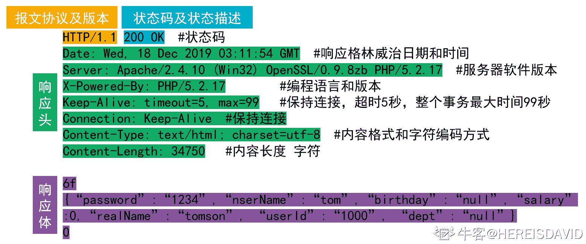

# 网易 2020 校招笔试- 测试工程师（提前批）

## 1

图 N 是有 7 个顶点的强连通图，那么 N 是有向图，那么 N 最少有（）条边?如 N 为无向图，N 最少有（）条边？

正确答案: D   你的答案: 空 (错误)

```cpp
21,21
```

```cpp
21,20
```

```cpp
7,7
```

```cpp
7,6
```

```cpp
8,7
```

本题知识点

C++工程师 网易 Java 工程师 测试工程师 测试开发工程师 算法工程师 2020 2021

讨论

[猫仔面](https://www.nowcoder.com/profile/4548438)

强连通图：在 G 中，如果对于每一对 vi、vj（vi≠vj），从 vi 到 vj 和从 vj 到 vi 都存在路径。n 个顶点的有向强连通图：至少 n 条边（形成一个环）；至多 n(n-1)条边 n 个顶点的无向强连通图：至少 n-1 条边（形成一条直线）；至多 n(n-1)/2 条边

发表于 2020-08-06 13:04:57

* * *

[牛客 142348115 号](https://www.nowcoder.com/profile/142348115)

N 为有向图则为一个环，N 为无向图则为一条线

发表于 2019-12-13 16:37:42

* * *

[牛客 221048556 号](https://www.nowcoder.com/profile/221048556)

如果是无向图，可以是 7 个顶点连成一条直线，也可以是 1 个中心顶点与周围 6 个顶点分别连接。

发表于 2020-08-07 12:59:44

* * *

## 2

下面关于 HTTP 协议的说法错误的是( )

正确答案: C   你的答案: 空 (错误)

```cpp
HTTP 报文分为请求报文和响应报文
```

```cpp
HTTP 请求行由请求方法、URL 和协议版本组成
```

```cpp
每个服务器都支持包括 GET\HEAD\PUT 等 7 种请求方法
```

```cpp
HTTP 响应行由协议版本、状态码和状态描述符组成
```

本题知识点

iOS 工程师 网易 测试工程师 测试开发工程师 前端工程师 2020

讨论

[猫仔面](https://www.nowcoder.com/profile/4548438)

HTTP 请求方法有 8 种：get、post、put、delete、options、trace、connect、head，其中至少应该实现 get、head、post 方法，其他方法都是可选的。

发表于 2020-08-06 13:14:05

* * *

[HEREISDAVID](https://www.nowcoder.com/profile/864672146)

请求和响应：


编辑于 2020-09-27 20:04:09

* * *

[工作已找到](https://www.nowcoder.com/profile/52550243)

只有 6 种

发表于 2020-03-25 16:36:14

* * *

## 3

判断一个数组或序列是正序,倒序还是乱序,需要我们将这个数组完整的遍历一遍通过构建有序序列，对于未排序数据，在已排序序列中从后向前扫描，找到相应的位置并插入的排序算法是（ ）

正确答案: C   你的答案: 空 (错误)

```cpp
选择排序
```

```cpp
希尔排序
```

```cpp
插入排序
```

```cpp
归并排序
```

本题知识点

iOS 工程师 网易 安卓工程师 C++工程师 Java 工程师 安全工程师 测试工程师 大数据开发工程师 前端工程师 算法工程师 数据分析师 数据库工程师 运维工程师 2020

讨论

[Olivia_dtt](https://www.nowcoder.com/profile/232985383)

选择排序：每次从数组中选出一个最小数（最大数）放到数组最前面，存放在序列的起始位置，直到全部待排序的数据元素排完。希尔排序：设置增量分割数组，逐步进行直接插入排序,增量逐趟减少,并最后使得整个数组基本有序,再对整体进行直接插入排序。插入排序：构建有序序列，未排序数据依次从已排序数据按从后往前比较，插入到合适的位置。归并排序：把序列分成两个长度为 n/2 的子序列，对这两个子序列分别归并排序（循环将两个数组的第一个值比较，并弹出第一个值， 直到数组长度都不存在），将两个排序好的子序列合并成一个最终的排序序列

发表于 2020-04-06 20:12:11

* * *

[牛客 929822447 号](https://www.nowcoder.com/profile/929822447)


插入排序—直接插入排序：


希尔排序：

 

选择排序：

 

归并排序：


发表于 2020-08-24 18:42:35

* * *

## 4

队列是一种特殊的线性表，特殊之处在于它只允许在表的前端（front）进行删除操作，而在表的后端（rear）进行插入操作，和栈一样，队列是一种操作受限制的线性表，进行插入操作的端称为队尾，进行删除操作的端称为队头，若用一个大小为 6 的数组来实现循环队列，数组下标为[0,5]，且当前 rear 和 front 的值分别为 0 和 3，当从队列中删除一个元素，再加入两个元素后，rear 和 front 的值分别为多少？（   ）

正确答案: B   你的答案: 空 (错误)

```cpp
1 和 5
```

```cpp
2 和 4
```

```cpp
4 和 2
```

```cpp
5 和 1
```

本题知识点

iOS 工程师 网易 Java 工程师 C++工程师 安全工程师 测试工程师 测试开发工程师 大数据开发工程师 数据分析师 数据库工程师 2020

讨论

[惠州学院 _15_ 黄洪卫](https://www.nowcoder.com/profile/8631354)

这道题目说的是当前**rear**和**fro****nt**的值分别为 0 和 3，所以当前的队列为 3  4  5  0，front 为 3，rear 为 0，又因为是用一个大小为 6 的数组来实现的循环队列，所以删除一个插入两个后为 4  5  0  1  2，此时 front 为 4，rear 为 2，即答案为 2,4

发表于 2019-12-04 11:15:44

* * *

[猫仔面](https://www.nowcoder.com/profile/4548438)

顺序队列：入队 rear += 1 出队 front += 1 队列长度 = rear - front 循环队列：入队 rear = (rear + 1) % size 出队 front  = (front + 1) % size 队列长度 = (rear - front + size) % size

发表于 2020-08-06 15:02:52

* * *

[vicyor](https://www.nowcoder.com/profile/2210832)

初始时候,front 为 3，rear 为 0 删除一个元素(首部) ， front 为 4，rear 为 0 插入 2 个元素 ,               front 为 4，rear 为 2

发表于 2020-02-17 16:02:13

* * *

## 5

死锁是指多个进程在运行过程中因争夺资源而造成的一种僵局，永远在互相等待的进程称为死锁进程，假设计算机系统中有 3 个不同的临界资源 R1、R2 和 R3，被 4 个进程 p1、p2、p3 及 p4 共享。各进程对资源的需求为：p1 申请 R1 和 R2，p2 申请 R2 和 R3，p3 申请 R1 和 R3，p4 申请 R2。若系统出现死锁，则处于死锁状态的进程数至少是（  ）

正确答案: C   你的答案: 空 (错误)

```cpp
1
```

```cpp
2
```

```cpp
3
```

```cpp
4
```

本题知识点

iOS 工程师 网易 安卓工程师 C++工程师 Java 工程师 测试工程师 测试开发工程师 大数据开发工程师 前端工程师 算法工程师 数据库工程师 2020

讨论

[彭彭の零柒](https://www.nowcoder.com/profile/390870854)

3 个.这种情况： p1 占用 r1,p2 占用 r2，p3 占用 r3，p1 申请 r2，p2 申请 r3，p3 申请 r1，无限等待释放资源

发表于 2020-02-21 21:58:02

* * *

[我是复读机](https://www.nowcoder.com/profile/162099353)

要理解死锁的概念。死锁的进程必须是已经占有了某个资源，同时在请求其他资源，而且不会主动释放已占有的资源。如果几个进程循环等待其他进程已占有的资源，就陷入了死局，就死锁了。

发表于 2020-04-21 17:16:12

* * *

[猫仔面](https://www.nowcoder.com/profile/4548438)

我的理解：对于本题，有 3 个资源，所以如果出现死锁（环形等待），必定至少需要 3 个进程来分别占有 3 个资源（感觉怪怪的）

发表于 2020-08-06 15:18:29

* * *

## 6

关于 APP 测试，下列哪个说法是错误的.

正确答案: C   你的答案: 空 (错误)

```cpp
APP 是否会闪退需要测试。
```

```cpp
都是根据 UI 设计做的产品，需要进行用户友好性、人性化、易操作性需要测试。
```

```cpp
都是根据 UI 设计做的产品，无需进行用户友好性、人性化测试。
```

```cpp
都是根据 UI 设计做的产品，页面是否能自适应所有的屏幕界面需要测试。
```

本题知识点

测试工程师 网易 2020

## 7

关于回归测试的策略，以下哪个描述是错误的.

正确答案: D   你的答案: 空 (错误)

```cpp
要从原基线测试用例库中找出并更新有效的测试用例。
```

```cpp
需要识别出哪些是软件中被修改的部分。
```

```cpp
需要判断当前修改的代码是否破坏了原有的功能。
```

```cpp
回归测试只测和修改工作本身有关的功能。
```

本题知识点

测试工程师 网易 2020

## 8

关于众测，以下哪个说法是不正确的.

正确答案: D   你的答案: 空 (错误)

```cpp
利用大众的测试能力和测试资源，在短时间内完成大量的体验测试。
```

```cpp
可以通过用户体验对产品找茬，由用户提出产品 BUG 或建议。
```

```cpp
APP 评测类项目，用户可以在第一时间体验最新的 APP 后对该 APP 进行评分。
```

```cpp
众测结果里，用户不能提出关于页面布局相关的体验结果。
```

本题知识点

测试工程师 网易 测试开发工程师 2020

讨论

[晓晓会找到好工作的](https://www.nowcoder.com/profile/213803012)

不懂，C 为啥是对的

发表于 2020-09-23 14:44:51

* * *

## 9

ls -l 命令有以下输出，描述正确的是

正确答案: D   你的答案: 空 (错误)

```cpp
default.etcd 为可执行文件，只能被 root 执行
```

```cpp
go 目录占的磁盘空间大小为 4KB
```

```cpp
install-client.sh 脚本可以用./install-client.sh 命令执行
```

```cpp
go 文件夹可以被任意用户浏览
```

本题知识点

安卓工程师 网易 C++工程师 Java 工程师 安全工程师 测试工程师 测试开发工程师 大数据开发工程师 前端工程师 数据库工程师 iOS 工程师 运维工程师 2020

讨论

[我是复读机](https://www.nowcoder.com/profile/162099353)

A 是目录，不是文件；B 也是目录，所以 4096 表示的是该目录符所占的大小（注意，4096 不表示该目录下所有文件的大小）；C 没有 x 权限，不能直接./运行，但可以用 sh 运行；D 正确

发表于 2020-04-21 19:41:36

* * *

[offer-冲鸭](https://www.nowcoder.com/profile/447104610)

首先 d 表示这个文件是一个文件夹，然后文件的权限用其后一共有 9 个字符表示，分成三组，分别表示文件所属用户的权限，文件所属用户组的权限，其他人的权限，r 表示读权限, w 表示写权限， x 表示执行权限，你给的这个例子就是说 这是个文件夹，并且此文件所属用户拥有读、写、执行三项权限，其余的用户组，其他用户不拥有任何权限（全部都是-）--转

发表于 2020-04-03 22:52:49

* * *

[HEREISDAVID](https://www.nowcoder.com/profile/864672146)


发表于 2020-09-27 20:12:49

* * *

## 10

访问记录 visit 表中包含日期 date,用户 user_id,访问的页面 url 3 个字段，以下哪个选项不能计算'2019-03-11'这一天访问过页面的所有用户数

正确答案: D   你的答案: 空 (错误)

```cpp
SELECT count(user_id) FROM (SELECT user_id FROM visit WHERE date = '2019-03-11'  GROUP BY user_id) f
```

```cpp
SELECT count(user_id) FROM (SELECT DISTINCT user_id FROM visit WHERE date = '2019-03-11') f
```

```cpp
SELECT count(DISTINCT user_id) FROM visit WHERE date = '2019-03-11'
```

```cpp
SELECT count(user_id) FROM visit WHERE date = '2019-03-11' GROUP BY date
```

本题知识点

iOS 工程师 网易 安卓工程师 C++工程师 Java 工程师 测试工程师 测试开发工程师 大数据开发工程师 数据分析师 数据库工程师 2020

讨论

[vicyor](https://www.nowcoder.com/profile/2210832)

D . SELECT count(user_id) FROM visit WHERE date = '2019-03-11' GROUP BY date    问题: 1.user_id 未去重             2.已经通过 where 选出 date 了,group by 无意义.修改: SELECT count(user_id) FROM visit WHERE date = '2019-03-11' GROUP BY user_id

发表于 2020-02-17 16:47:43

* * *

[牛客 656547734 号](https://www.nowcoder.com/profile/656547734)

选项 A 

```cpp
SELECT count(user_id) FROM (SELECT user_id FROM visit WHERE date = '2019-03-11'  GROUP BY user_id) fK
我选这个了，这个的确无法直接得到结果，但是题目问的是无法计算，这个结果通过人工计算还是可以计算出最终结果的，我觉得迷惑性的确很大。
```

发表于 2020-04-25 16:41:28

* * *

[aruruff](https://www.nowcoder.com/profile/509544345)

```cpp
除重归纳用户 id 为表 f 再计算 A   SELECT count(user_id) FROM (SELECT user_id FROM visit WHERE date = '2019-03-11'  GROUP BY user_id) f
```

  B    SELECT count(user_id) FROM (SELECT DISTINCT user_id FROM visit WHERE date = '2019-03-11') f
C 简单的用除重函数
D

```cpp
 GROUP BY 日期再

```
WHERE 日期 nono
```cpp

```

```cpp
WHERE date = '2019-03-11' GROUP BY date  
```

发表于 2019-12-11 11:58:15

* * *

## 11

**用例题**商品详情页里有个视频播放模块，请根据需求设计用例：

需求点：

1.  未播放前，视频模块上有暂停按钮；
2.  不会自动播放，WiFi 下点击按钮正常播放；非 WiFi 下点击按钮有非 WiFi 将消耗流量的提示框，提示框上有【取消】及【继续观看】按钮；
3.  播放时有全屏按钮，全屏时退出全屏按钮有视频播放完后有退出全屏按钮
4.  有视频播放完后自动暂停

你的答案

本题知识点

测试工程师 网易 2020

讨论

[YSL20190819145047](https://www.nowcoder.com/profile/237490231)

题目给的需求点不多，测试用例的测试点可是真多，不能全按题目来！要有自己的想法

发表于 2020-01-16 15:00:28

* * *

## 12

小易在维护数据的时候遇到一个需求，具体来说小易有一系列数据，这些数据了构成一个长度为 n 的数字序列，接下来小易会在这个序列上进行 q 次操作。
每次操作有一个查询的数字 x，小易需要将序列数据中所有大于等于 x 的数字都减一，并输出在本次操作中有多少个数字被减一了。
小易犯了难，希望你能帮帮他。

本题知识点

安卓工程师 网易 Java 工程师 测试工程师 前端工程师 C++工程师 算法工程师 数据分析师 2020

讨论

[dragonlogin](https://www.nowcoder.com/profile/2071677)

思路

*   暴力解法
    暴力解法很容易想到，直接按题目说的来做就可以了
*   优化
    这个数据量，显然需要用 O(nlogn)或者 O(n)算法，则会想到排序，如果从大到小排，那么每次查询一个数字 x，使得大于等于 x 的数字都会-1，那么数列还是有序的。也就是数列始终都是有序的，这样就可以进行剪枝了，遍历到小于 x 的直接 break 跳出循环即可。

```cpp
#include <bits/stdc++.h>
using namespace std;
const int N = 200010;
int a[N], hs[N];
int n, q, x;

int main() {
    scanf("%d%d", &n, &q);
    int x;
    for (int i = 1; i <= n; ++ i) {
        scanf("%d", &a[i]);
    }
    sort(a + 1, a + n + 1, greater<int>());

    while (q -- ) {
        scanf("%d", &x);
        int ret = 0;
        for (int i = 1; i <= n; ++ i) {
            if (a[i] >= x) {
                a[i] -= 1;
                ret ++ ;
            } else {
                break;
            }
        }
        printf("%d\n", ret);
    }
    return 0;
}

```

发表于 2020-07-30 18:19:16

* * *

[孝陵卫的风](https://www.nowcoder.com/profile/645847812)

```cpp
import java.util.Arrays;
import java.util.Scanner;

public class Main {
    public static void main(String[] args) {
        Scanner scanner = new Scanner(System.in);
        int n = scanner.nextInt();
        int q = scanner.nextInt();
        int[] arr = new int[n];
        //将数字录入数组
        for (int i = 0; i < n; i++) {
            int num = scanner.nextInt();
            arr[i] = num;
        }
        //先将数组排序
        Arrays.sort(arr);
        //查询次数
        for (int i = 0; i < q; i++) {
            //需要查询的数字
            int x = scanner.nextInt();
            System.out.println(demo4(arr, x));
        }
    }

    public static int demo4(int[] arr, int x) {
        int count = 0;
        //从大往小比较，碰到小于 x 的及时终止循环，能优化时间
        for (int i = arr.length-1; i >= 0; i--) {
            if (arr[i] >= x) {
                arr[i]--;
                count++;
            } else {
                break;
            }
        }
        return count;
    }
}

```

编辑于 2020-04-06 16:21:20

* * *

[miraclequester](https://www.nowcoder.com/profile/347359971)

线段树+二分，O（n (logn)²）

```cpp
#include<bits/stdc++.h>
using namespace std;
#define inf 0x3f3f3f3f
#define ll long long
const int N=2e5+5;
const double eps=1e-8;
const double PI = acos(-1.0);
#define lowbit(x) (x&(-x))
int sum[N<<2],add[N<<2];
int a[N];
void pushUp(int rt)
{
    sum[rt]=sum[rt<<1]+sum[rt<<1|1];
}
void build(int l,int r,int rt)
{
    if(l==r)
    {
        sum[rt]=a[l];
        return;
    }
    int m=(l+r)>>1;
    build(l,m,rt<<1);
    build(m+1,r,rt<<1|1);
    pushUp(rt);
}
void pushDown(int rt,int ln,int rn)
{
    if(add[rt])
    {
        add[rt<<1]+=add[rt];
        add[rt<<1|1]+=add[rt];
        sum[rt<<1]+=add[rt]*ln;
        sum[rt<<1|1]+=add[rt]*rn;
        add[rt]=0;
    }
}
void update(int L,int R,int C,int l,int r,int rt)
{
    if(L <= l && r <= R)
    {
        sum[rt]+=C*(r-l+1);
        add[rt]+=C;
        return ;
    }
    int m=(l+r)>>1;
    pushDown(rt,m-l+1,r-m);
    if(L <= m) update(L,R,C,l,m,rt<<1);
    if(R >  m) update(L,R,C,m+1,r,rt<<1|1);
    pushUp(rt);
}
int query(int L,int R,int l,int r,int rt)
{
    if(L <= l && r <= R)
    {
        return sum[rt];
    }
    int m=(l+r)>>1;
    pushDown(rt,m-l+1,r-m);
    int ans=0;
    if(L <= m) ans+=query(L,R,l,m,rt<<1);
    if(R >  m) ans+=query(L,R,m+1,r,rt<<1|1);
    return ans;
}
int main()
{
    std::ios::sync_with_stdio(false);
    int n,q;
    while(cin>>n>>q)
    {
        memset(add,0,sizeof(add));
        for(int i=1; i<=n; i++)
        {
            cin>>a[i];
        }
        sort(a+1,a+1+n);
        build(1,n,1);
        while(q--)
        {
            int l=1,r=n,m,ans=-1,x;
            cin>>x;
            while(l<=r)
            {
                m=(l+r)>>1;
                if(query(m,m,1,n,1)>=x)
                {
                    r=m-1;
                    ans=m;
                }
                else
                {
                    l=m+1;
                }
            }
            if(ans==-1)
            {
                cout<<0<<endl;
            }
            else
            {
                cout<<n-ans+1<<endl;
                update(ans,n,-1,1,n,1);
            }
        }
    }
    return 0;
}

```

编辑于 2020-04-04 20:47:09

* * *

## 13

有一天，小易把 1 到 n 的所有排列按字典序排成一排。小易从中选出了一个排列，假设它是正数第 Q 个排列，小易希望你能回答他倒数第 Q 个排列是什么。
例如 1 到 3 的所有排列是：
1 2 3
1 3 2
2 1 3
2 3 1
3 1 2
3 2 1
若小易选出的排列是 1 2 3，则 Q = 1，而你应该输出排列 3 2 1

本题知识点

安卓工程师 网易 Java 工程师 C++工程师 安全工程师 测试工程师 算法工程师 2020

讨论

[Sheltonyang](https://www.nowcoder.com/profile/834925814)

//通过分析可以看出来，位置相对称的两个排列，对应位数字之和为 n+1，直接计算输出就行了#include<iostream>using namespace std;void change(){
    int n;
    cin>>n;
    int innum[n];
    for(int i =0;i<n;i++){
        cin>>innum[i];
    }
    for(int i=0;i<n;i++){
        cout<<n-innum[i]+1<<" ";
    }
}

int main(){
    change();
}

发表于 2020-04-11 14:40:10

* * *

[牛客 864355626 号](https://www.nowcoder.com/profile/864355626)

```cpp
n = int(input())
a = list(map(int, input().split()))
for i in a:
    print(n+1-i, end=' ')
```

发表于 2020-01-03 18:57:32

* * *

[零葬](https://www.nowcoder.com/profile/75718849)

根据用例得到规律：倒数第 Q 个排列的第 i 个数字 = n - 正数第 Q 个排列的第 i 个数字 + 1

```cpp
n = int(input())
arr = list(map(int, input().split()))
result = []
# 规律：倒数第 Q 个排列的第 i 个数字 = n - 正数第 Q 个排列的第 i 个数字 + 1
for oddNum in arr:
    newNum = n - oddNum + 1
    result.append(str(newNum))
print(" ".join(result).strip())
```

发表于 2020-10-22 10:36:25

* * *

## 14

小易有一个初始为空的数字集合，支持两种操作：
1、加入数字 x 到集合中。
2、询问集合中是否存在一个子集，满足子集中所有数字的 Or 值恰好为 k。Or 为二进制按位或操作，C++中表示为"|"。
小易希望你能解决这个问题。

本题知识点

iOS 工程师 网易 安卓工程师 C++工程师 Java 工程师 安全工程师 测试工程师 大数据开发工程师 数据分析师 2020

讨论

[dragonlogin](https://www.nowcoder.com/profile/2071677)

思路

难点就是：怎么在一个集合 a 中判断是否存在一个子集，使得子集中所有元素 或运算后的结果为 x

*   暴力想法
    找到集合 a 中的所有子集，然后一一判断是否满足条件。
    子集个数一共有 2^n,n 为集合元素个数。所以肯定超时

*   优化
    有没有可能遍历一遍集合，就可以完成。
    假设元素 x 的二进制为 100100101
    如果存在 a1 | a2 | a3 | 。。。 | an = x
    根据 | 的特点，
    0 | 0 = 0,
    1 | 0 = 1,
    0 | 1 = 1,
    1 | 1 = 1
    如果我 x 的倒数第二位是 0，那么 a1, a2,…,an 的倒数第二位肯定不能为 1
    所以，需要满足 a1 | x = x, a2 | x = x,可以用反证法证明。

```cpp
#include <bits/stdc++.h>
using namespace std;
const int N = 100010;
bool st[N];
int q, o, x;

int main() {
    scanf("%d", &q);
    vector<int> a;
    while (q --) {
        scanf("%d%d", &o, &x);
        if (o == 1) {
            if (st[x] == false)
                a.push_back(x);
                st[x] = true;
        }
        else {
            int y = 0;
            for (int v : a) {
                if ((v | x) == x)
                    y |= v;
            }

            if (y == x) {
                printf("YES\n");
            }
            else {
                printf("NO\n");
            }
        }
    }
    return 0;
}

```

发表于 2020-07-30 18:20:07

* * *

[Fzldq](https://www.nowcoder.com/profile/209755777)

```cpp
import sys

def main():

    def exist(x):
        y = 0
        for i in lst:
            if i | x == x:
                y |= i
                if x == y:
                    return True
        else:
            return False

    lst = set()
    res = []
    q = int(sys.stdin.readline().strip())
    m = map(int, sys.stdin.read().split())
    xlst = list(zip(m, m))
    for i, j in xlst:
        if i == 1:
            lst.add(j)
        else:
            res += ['YES' if exist(j) else 'NO']
    print(*res, sep='\n')

if __name__ == '__main__':
    main()
```

Python 玩这种题就是亏，只能过 60%

编辑于 2020-07-20 15:51:08

* * *

[帽子短了](https://www.nowcoder.com/profile/571009756)

```cpp
#include <iostream>
#include <string>
#include <vector>
using namespace std;
bool isexist(vector<int> temp,int x)
{
	int y = 0;
	for (int i = 0; i < temp.size(); i++)
	{
		if ((x | temp[i]) == x)
			y = y | temp[i];
	}
	return x == y;
}
int main()
{
	int n;
	cin >> n;
	vector<int> temp;
	while (n--)
	{
		int a, x;
		cin >> a >> x;
		if (a == 1)
			temp.push_back(x);
		else
		{
			if (isexist(temp, x))
				cout << "YES" << endl;
			else
				cout << "NO" << endl;
		}	
	}
	system("pause");
	return 0;
}
```

发表于 2020-06-17 19:47:52

* * *

## 15

小易给定了一个长度为 n 的数字序列，对于每一个，小易希望能求解出所有长度为 k 的连续子序列的最大值中的最小值。

本题知识点

安卓工程师 网易 C++工程师 Java 工程师 安全工程师 测试工程师 大数据开发工程师 前端工程师 算法工程师 数据分析师 2020

讨论

[牛客 188000430 号](https://www.nowcoder.com/profile/188000430)

```cpp
def mininmax(nums):
    dp=[]
    for i in range(len(nums)-1):
        dp.append(max(nums[i],nums[i+1]))
    return dp
n=int(input())
nums=list(map(int,input().split()))
res=[]
while nums:
    res.append(min(nums))
    nums=mininmax(nums)
print(" ".join(str(i) for i in res))
```

60%,还有更好的方法嘛！

发表于 2020-06-30 17:36:53

* * *

[鹿鸣松](https://www.nowcoder.com/profile/646250553)

我用的是 python3.8 ```cpp
def myfunction(n,s):
    s=s.split(' ')
    s=list(map(int,s))
    count_list=[]
    for k in range(1,n+1):
        temp_list=[]
        for i in range(n):
            if i+k<=n:
                temp_list.append(max(s[i:i+k]))
        count_list.append(min(temp_list))
    return count_list

print(myfunction(6,'1 3 2 4 6 5'))
```

这个在我自己 pycharm 上跑通了（包括那个 100 的元素的例子），但是在这上面没有，我一开始的输入是直接用列表的，我以为这个有问题，就换成 string 转 int 型列表，但还是不行，难道是 n 他没给我？whatever🙄
我的思路是用两个空列表分别取承接第一个循环下来的最大值列表和第二个循环下来的最小值列表，值得注意的是当取列表的长度不满足大小为 k 的时候，是需要跳出循环或者不加最大值计算的，不然后面会出一些奇怪的结果。核心是两个 for 循环，其他没什么。写解析的时候看了下评论区，嗯，python 真好用🙃

发表于 2020-12-22 22:23:42

* * *

[Pauline677](https://www.nowcoder.com/profile/897067998)

请问用 R 的小伙伴吗？我的结果一摸一样，一直显示格式错误。cat 的'\n'，'\b'都试过还是不行

```cpp
inputs = readLines("stdin")
n = as.numeric(inputs[1])
seq = as.numeric(unlist(strsplit(inputs[2]," ",fixed = T)))

check = function(start,k,n) { # k <= n-start+1
  if (k<=n-start+1) {
    x = rep(NA,n-k-start+2)
    for (i in start:(n-k+1)){
      x[i-start+1] = max(seq[i:(i+k-1)])
    }
    return(min(x))
  } else {
    return(NA)
  }
}

for (k in 1:n){
  x = rep(NA,n)
  for (i in 1:n) {
    x[i] = check(i,k,n)
  }
  cat(min(x,na.rm =T),'\b')
}
```

发表于 2020-08-07 17:16:00

* * *