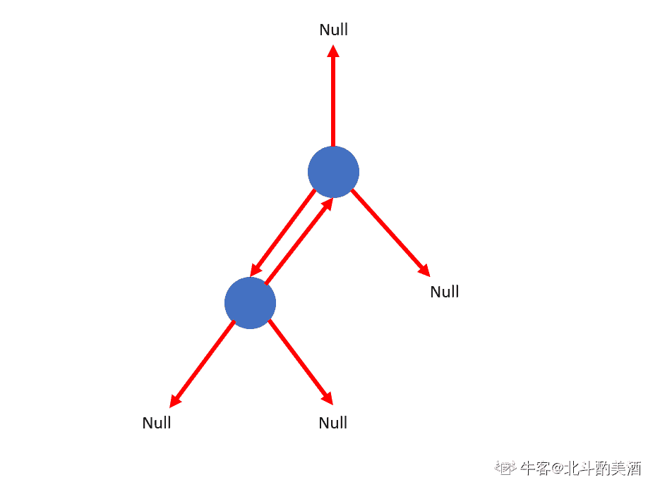
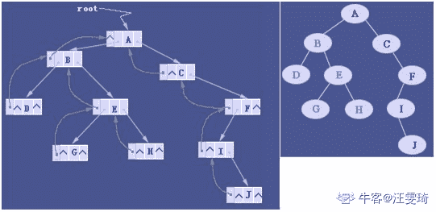
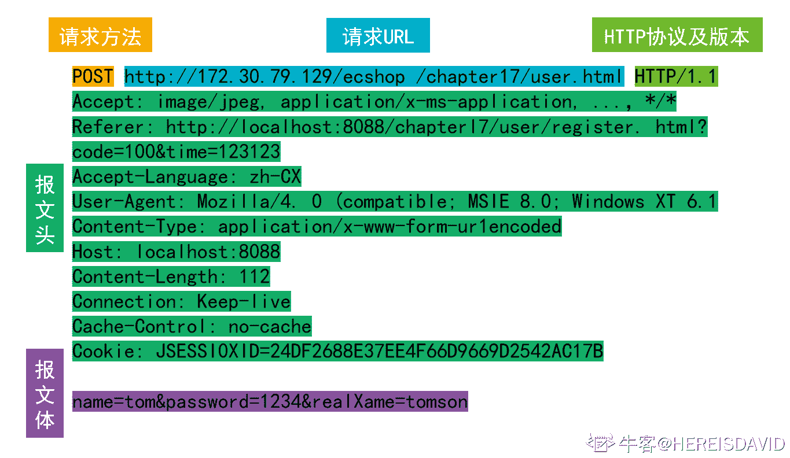
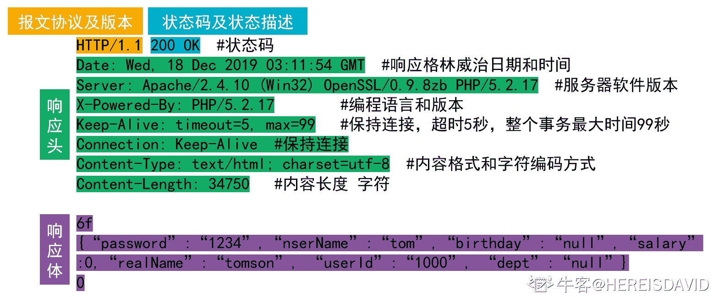
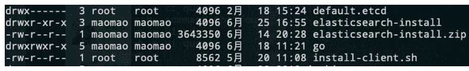
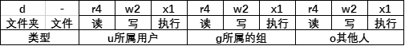

# 网易 2020 校招笔试- 测试开发工程师（提前批）

## 1

有一类二叉树用三叉链表来存储的时候除了带有指向左右孩子节点的两个指针，还有指向父节点的指针，那么这样一棵二叉树有 2 个节点，那么有多少指针指向 NULL（注：根节点的父指针指向 NULL，对于不存在的节点表示为 NULL）？

正确答案: D   你的答案: 空 (错误)

```cpp
1
```

```cpp
2
```

```cpp
3
```

```cpp
4
```

```cpp
5
```

本题知识点

Java 工程师 C++工程师 网易 安全工程师 测试开发工程师 前端工程师 数据分析师 数据库工程师 算法工程师 iOS 工程师 安卓工程师 运维工程师 2020

讨论

[北斗酌美酒](https://www.nowcoder.com/profile/170736954)



发表于 2020-04-11 11:37:30

* * *

[流浪者 201907280945510](https://www.nowcoder.com/profile/60649645)

每个节点有 3 个指针，两个节点一共 6 个指针，其中 A 节点父节点指向 B 节点， B 节点子节点指向 A 节点，剩下的 4 个节点全部是 NULL

发表于 2020-02-17 09:51:27

* * *

[小水滴真的是太可爱了吧](https://www.nowcoder.com/profile/742091450)

**三叉链表存储表示**

改进于二叉链表，增加指向父节点的指针，能更好地实现结点间的访问。



发表于 2020-04-07 10:38:28

* * *

## 2

图 N 是有 7 个顶点的强连通图，那么 N 是有向图，那么 N 最少有（）条边?如 N 为无向图，N 最少有（）条边？

正确答案: D   你的答案: 空 (错误)

```cpp
21,21
```

```cpp
21,20
```

```cpp
7,7
```

```cpp
7,6
```

```cpp
8,7
```

本题知识点

C++工程师 网易 Java 工程师 测试工程师 测试开发工程师 算法工程师 2020 2021

讨论

[猫仔面](https://www.nowcoder.com/profile/4548438)

强连通图：在 G 中，如果对于每一对 vi、vj（vi≠vj），从 vi 到 vj 和从 vj 到 vi 都存在路径。n 个顶点的有向强连通图：至少 n 条边（形成一个环）；至多 n(n-1)条边 n 个顶点的无向强连通图：至少 n-1 条边（形成一条直线）；至多 n(n-1)/2 条边

发表于 2020-08-06 13:04:57

* * *

[牛客 142348115 号](https://www.nowcoder.com/profile/142348115)

N 为有向图则为一个环，N 为无向图则为一条线

发表于 2019-12-13 16:37:42

* * *

[牛客 221048556 号](https://www.nowcoder.com/profile/221048556)

如果是无向图，可以是 7 个顶点连成一条直线，也可以是 1 个中心顶点与周围 6 个顶点分别连接。

发表于 2020-08-07 12:59:44

* * *

## 3

如果已知数字有{1,2,5,10}，每个数字可以无限次使用，构造出数字 100，编程解决用到的编程思想有（）

正确答案: B   你的答案: 空 (错误)

```cpp
递归
```

```cpp
动态规划
```

```cpp
排列组合
```

```cpp
回溯法
```

本题知识点

测试开发工程师 网易 2020

讨论

[牛客 998256699 号](https://www.nowcoder.com/profile/998256699)

这题我觉得是递归和 dp 都可行的，但是这是道单选题

发表于 2020-08-11 14:56:56

* * *

## 4

下面关于 HTTP 协议的说法错误的是( )

正确答案: C   你的答案: 空 (错误)

```cpp
HTTP 报文分为请求报文和响应报文
```

```cpp
HTTP 请求行由请求方法、URL 和协议版本组成
```

```cpp
每个服务器都支持包括 GET\HEAD\PUT 等 7 种请求方法
```

```cpp
HTTP 响应行由协议版本、状态码和状态描述符组成
```

本题知识点

iOS 工程师 网易 测试工程师 测试开发工程师 前端工程师 2020

讨论

[猫仔面](https://www.nowcoder.com/profile/4548438)

HTTP 请求方法有 8 种：get、post、put、delete、options、trace、connect、head，其中至少应该实现 get、head、post 方法，其他方法都是可选的。

发表于 2020-08-06 13:14:05

* * *

[HEREISDAVID](https://www.nowcoder.com/profile/864672146)

请求和响应：


编辑于 2020-09-27 20:04:09

* * *

[工作已找到](https://www.nowcoder.com/profile/52550243)

只有 6 种

发表于 2020-03-25 16:36:14

* * *

## 5

下列排序算法中，初始数据集合对排序性能无影响的是？

正确答案: A   你的答案: 空 (错误)

```cpp
堆排序
```

```cpp
插入排序
```

```cpp
冒泡排序
```

```cpp
快速排序
```

本题知识点

测试开发工程师 网易 2020

讨论

[猫仔面](https://www.nowcoder.com/profile/4548438)

**有影响：**冒泡排序：arr[j] < arr[j+1]则不交换。插入排序：看能滑动到哪个位置，所以初始数组的排列顺序会有影响。快速排序：数组有序（正序/逆序）时，选最后一个数作为 num，时间复杂度会变为 O(N²)；如果 Num 正好在中间则是 O(NlogN)。
**无影响：**归并排序：递归的过程选择排序：不管怎样都要遍历整个数组，每次找到 1 个位置的最小值。堆排序：先将数组组织成大根堆，然后每次将堆顶与数组最后一个元素交换。

发表于 2020-08-06 14:34:28

* * *

[每天都在努力笑出腹肌的胖杭](https://www.nowcoder.com/profile/514792823)

&

初始数据集排列顺序与比较次数无关的有：堆排序，归并排序，选择排序。

发表于 2020-04-06 17:23:21

* * *

## 6

队列是一种特殊的线性表，特殊之处在于它只允许在表的前端（front）进行删除操作，而在表的后端（rear）进行插入操作，和栈一样，队列是一种操作受限制的线性表，进行插入操作的端称为队尾，进行删除操作的端称为队头，若用一个大小为 6 的数组来实现循环队列，数组下标为[0,5]，且当前 rear 和 front 的值分别为 0 和 3，当从队列中删除一个元素，再加入两个元素后，rear 和 front 的值分别为多少？（   ）

正确答案: B   你的答案: 空 (错误)

```cpp
1 和 5
```

```cpp
2 和 4
```

```cpp
4 和 2
```

```cpp
5 和 1
```

本题知识点

iOS 工程师 网易 Java 工程师 C++工程师 安全工程师 测试工程师 测试开发工程师 大数据开发工程师 数据分析师 数据库工程师 2020

讨论

[惠州学院 _15_ 黄洪卫](https://www.nowcoder.com/profile/8631354)

这道题目说的是当前**rear**和**fro****nt**的值分别为 0 和 3，所以当前的队列为 3  4  5  0，front 为 3，rear 为 0，又因为是用一个大小为 6 的数组来实现的循环队列，所以删除一个插入两个后为 4  5  0  1  2，此时 front 为 4，rear 为 2，即答案为 2,4

发表于 2019-12-04 11:15:44

* * *

[猫仔面](https://www.nowcoder.com/profile/4548438)

顺序队列：入队 rear += 1 出队 front += 1 队列长度 = rear - front 循环队列：入队 rear = (rear + 1) % size 出队 front  = (front + 1) % size 队列长度 = (rear - front + size) % size

发表于 2020-08-06 15:02:52

* * *

[vicyor](https://www.nowcoder.com/profile/2210832)

初始时候,front 为 3，rear 为 0 删除一个元素(首部) ， front 为 4，rear 为 0 插入 2 个元素 ,               front 为 4，rear 为 2

发表于 2020-02-17 16:02:13

* * *

## 7

死锁是指多个进程在运行过程中因争夺资源而造成的一种僵局，永远在互相等待的进程称为死锁进程，假设计算机系统中有 3 个不同的临界资源 R1、R2 和 R3，被 4 个进程 p1、p2、p3 及 p4 共享。各进程对资源的需求为：p1 申请 R1 和 R2，p2 申请 R2 和 R3，p3 申请 R1 和 R3，p4 申请 R2。若系统出现死锁，则处于死锁状态的进程数至少是（  ）

正确答案: C   你的答案: 空 (错误)

```cpp
1
```

```cpp
2
```

```cpp
3
```

```cpp
4
```

本题知识点

iOS 工程师 网易 安卓工程师 C++工程师 Java 工程师 测试工程师 测试开发工程师 大数据开发工程师 前端工程师 算法工程师 数据库工程师 2020

讨论

[彭彭の零柒](https://www.nowcoder.com/profile/390870854)

3 个.这种情况： p1 占用 r1,p2 占用 r2，p3 占用 r3，p1 申请 r2，p2 申请 r3，p3 申请 r1，无限等待释放资源

发表于 2020-02-21 21:58:02

* * *

[我是复读机](https://www.nowcoder.com/profile/162099353)

要理解死锁的概念。死锁的进程必须是已经占有了某个资源，同时在请求其他资源，而且不会主动释放已占有的资源。如果几个进程循环等待其他进程已占有的资源，就陷入了死局，就死锁了。

发表于 2020-04-21 17:16:12

* * *

[猫仔面](https://www.nowcoder.com/profile/4548438)

我的理解：对于本题，有 3 个资源，所以如果出现死锁（环形等待），必定至少需要 3 个进程来分别占有 3 个资源（感觉怪怪的）

发表于 2020-08-06 15:18:29

* * *

## 8

关于众测，以下哪个说法是不正确的.

正确答案: D   你的答案: 空 (错误)

```cpp
利用大众的测试能力和测试资源，在短时间内完成大量的体验测试。
```

```cpp
可以通过用户体验对产品找茬，由用户提出产品 BUG 或建议。
```

```cpp
APP 评测类项目，用户可以在第一时间体验最新的 APP 后对该 APP 进行评分。
```

```cpp
众测结果里，用户不能提出关于页面布局相关的体验结果。
```

本题知识点

测试工程师 网易 测试开发工程师 2020

讨论

[晓晓会找到好工作的](https://www.nowcoder.com/profile/213803012)

不懂，C 为啥是对的

发表于 2020-09-23 14:44:51

* * *

## 9

ls -l 命令有以下输出，描述正确的是

正确答案: D   你的答案: 空 (错误)

```cpp
default.etcd 为可执行文件，只能被 root 执行
```

```cpp
go 目录占的磁盘空间大小为 4KB
```

```cpp
install-client.sh 脚本可以用./install-client.sh 命令执行
```

```cpp
go 文件夹可以被任意用户浏览
```

本题知识点

安卓工程师 网易 C++工程师 Java 工程师 安全工程师 测试工程师 测试开发工程师 大数据开发工程师 前端工程师 数据库工程师 iOS 工程师 运维工程师 2020

讨论

[我是复读机](https://www.nowcoder.com/profile/162099353)

A 是目录，不是文件；B 也是目录，所以 4096 表示的是该目录符所占的大小（注意，4096 不表示该目录下所有文件的大小）；C 没有 x 权限，不能直接./运行，但可以用 sh 运行；D 正确

发表于 2020-04-21 19:41:36

* * *

[offer-冲鸭](https://www.nowcoder.com/profile/447104610)

首先 d 表示这个文件是一个文件夹，然后文件的权限用其后一共有 9 个字符表示，分成三组，分别表示文件所属用户的权限，文件所属用户组的权限，其他人的权限，r 表示读权限, w 表示写权限， x 表示执行权限，你给的这个例子就是说 这是个文件夹，并且此文件所属用户拥有读、写、执行三项权限，其余的用户组，其他用户不拥有任何权限（全部都是-）--转

发表于 2020-04-03 22:52:49

* * *

[HEREISDAVID](https://www.nowcoder.com/profile/864672146)



发表于 2020-09-27 20:12:49

* * *

## 10

访问记录 visit 表中包含日期 date,用户 user_id,访问的页面 url 3 个字段，以下哪个选项不能计算'2019-03-11'这一天访问过页面的所有用户数

正确答案: D   你的答案: 空 (错误)

```cpp
SELECT count(user_id) FROM (SELECT user_id FROM visit WHERE date = '2019-03-11'  GROUP BY user_id) f
```

```cpp
SELECT count(user_id) FROM (SELECT DISTINCT user_id FROM visit WHERE date = '2019-03-11') f
```

```cpp
SELECT count(DISTINCT user_id) FROM visit WHERE date = '2019-03-11'
```

```cpp
SELECT count(user_id) FROM visit WHERE date = '2019-03-11' GROUP BY date
```

本题知识点

iOS 工程师 网易 安卓工程师 C++工程师 Java 工程师 测试工程师 测试开发工程师 大数据开发工程师 数据分析师 数据库工程师 2020

讨论

[vicyor](https://www.nowcoder.com/profile/2210832)

D . SELECT count(user_id) FROM visit WHERE date = '2019-03-11' GROUP BY date    问题: 1.user_id 未去重             2.已经通过 where 选出 date 了,group by 无意义.修改: SELECT count(user_id) FROM visit WHERE date = '2019-03-11' GROUP BY user_id

发表于 2020-02-17 16:47:43

* * *

[牛客 656547734 号](https://www.nowcoder.com/profile/656547734)

选项 A 

```cpp
SELECT count(user_id) FROM (SELECT user_id FROM visit WHERE date = '2019-03-11'  GROUP BY user_id) fK
我选这个了，这个的确无法直接得到结果，但是题目问的是无法计算，这个结果通过人工计算还是可以计算出最终结果的，我觉得迷惑性的确很大。
```

发表于 2020-04-25 16:41:28

* * *

[aruruff](https://www.nowcoder.com/profile/509544345)

```cpp
除重归纳用户 id 为表 f 再计算 A   SELECT count(user_id) FROM (SELECT user_id FROM visit WHERE date = '2019-03-11'  GROUP BY user_id) f
```

  B    SELECT count(user_id) FROM (SELECT DISTINCT user_id FROM visit WHERE date = '2019-03-11') f
C 简单的用除重函数
D

```cpp
 GROUP BY 日期再

```
WHERE 日期 nono
```cpp

```

```cpp
WHERE date = '2019-03-11' GROUP BY date  
```

发表于 2019-12-11 11:58:15

* * *

## 11

某城市部分移动用户反馈在浏览云音乐视频时概率出现服务器错误。 可能是什么原因导致的，请简述排查思路？

你的答案

本题知识点

测试开发工程师 网易 2020

讨论

[牛客 160791277 号](https://www.nowcoder.com/profile/160791277)

1，使用抓包工具 2，在服务器错误时查看请求及响应，如果是响应 404 等，是服务端问题 3，如果是 200 等正常响应，是前端错误，再根据具体的响应代码逐一排查

发表于 2020-03-08 11:00:11

* * *

[牛客 518936588 号](https://www.nowcoder.com/profile/518936588)

1，使用抓包工具 2，在服务器错误时查看请求及响应，如果是响应 404 等，是服务端问题 3，如果是 200 等正常响应，是前端错误，再根据具体的响应代码逐一排查

发表于 2020-08-08 13:33:54

* * *

## 12

创建一张员工表，表明 EMPLOYEES,有四个字段，EMPLOYEE_ID:员工表(主键)、DEPT_ID:部门号、 EMPLOYEE_NAME:员工姓名、EMPLOYEE_SALARY:员工工资。（1）写出建表语句（2）检索出员工工资最高的员工姓名和工资（3）检索出部门中员工最多的部门号和此部门员工数量

你的答案

本题知识点

测试开发工程师 网易 2020

讨论

[牛客 212919125 号](https://www.nowcoder.com/profile/212919125)

create Tabel EMPLOYEES {    EMPLOYEE_ID int not null primary key,    DEPT_ID int,     EMPLOYEE_NAME char(40),EMPLOYEE_SALARY double };select * from EMPLOYEES where EMPLOYEE_SALARY  =(select max(EMPLOYEE_SALARY ) from EMPLOYEES )select DEPT_ID,count(*) from EMPLOYEES  group by DEPT_ID desc limit 1

发表于 2020-03-18 17:15:04

* * *

[FanFan520](https://www.nowcoder.com/profile/652481055)

第一题：CREATE TABLE EMPLOYEES(    EMPLOYEE_ID int NOT NULL AUTO_INCREMENT,    DEPT_ID int,    EMPLOYEE_NAME varchar,    EMPLOYEE_SALARY decimal
);第二题：select  EM.EMPLOYEE_NAME, EM.EMPLOYEE_SALARY from EMPLOYEES EM where EM.EMPLOYEE_SALARY = (select max(EMPLOYEE_SALARY) from EMPLOYEES);第三题：select DEPT_ID, count(EMPLOYEE_ID ) from (select max(count(EMPLOYEE_ID )) from EMPLOYEES group by DEPT_ID); 

发表于 2020-08-08 11:29:59

* * *

## 13

小易给你一个包含 n 个数字的数组。你可以对这个数组执行任意次以下交换操作：
对于数组中的两个下标 i,j(1<=i,j<=n)，如果为奇数，就可以交换和。现在允许你使用操作次数不限，小易希望你能求出在所有能通过若干次操作可以得到的数组中，字典序最小的一个是什么。

本题知识点

Java 工程师 网易 测试开发工程师 前端工程师 C++工程师 数据库工程师 算法工程师 iOS 工程师 安卓工程师 安全工程师 2020

讨论

[mynamewali](https://www.nowcoder.com/profile/524066618)

只要不全是奇数或者全是偶数，就进行排序

```cpp
#include<iostream>
#include<algorithm>
using namespace std;
int main(){
    int n;
    cin>>n;
    long int a[n];
    int odd_num = 0;
    for(int i=0;i<n;i++) cin>>a[i];
    for(int i=0;i<n;i++){
        if(a[i]&1) odd_num += 1;
    }
    if(odd_num==0 || odd_num==n){
        for(int i=0;i<n-1;i++) cout<<a[i]<<" ";
        cout<<a[n-1]<<endl;
    }
    else{
        sort(a,a+n);
        for(int i=0;i<n-1;i++) cout<<a[i]<<" ";
        cout<<a[n-1]<<endl;
    }

}
```

编辑于 2020-03-13 09:50:08

* * *

[孝陵卫的风](https://www.nowcoder.com/profile/645847812)

```cpp
import java.util.Arrays;
import java.util.Scanner;

public class Main {
    public static void main(String[] args) {
        Scanner scanner = new Scanner(System.in);
        while (scanner.hasNext()) {
            int n = scanner.nextInt();
            long[] arr = new long[n];
            for (int i = 0; i < n; i++) {
                arr[i] = scanner.nextLong();
            }
            demo1(arr);
            return;
        }
    }

    public static void demo1(long[] arr) {
        //奇数数量
        int oddSum = 0;
        for (int i = 0; i < arr.length; i++) {
            if (arr[i] % 2 == 1) {
                oddSum++;
            }
        }
        //如果全是偶数或者全是奇数则无法排序，直接输出
        if (oddSum == 0 || oddSum == arr.length) {
            for (int i = 0; i < arr.length; i++) {
                System.out.print(arr[i] + " ");
            }
            return;
        }
        //如果至少存在一对奇偶数，则可以将序列全部从小到大排列
        Arrays.sort(arr);
        for (int i = 0; i < arr.length; i++) {
            System.out.print(arr[i] + " ");
        }
    }
}

```

发表于 2020-04-05 22:06:52

* * *

[牛客 438821193 号](https://www.nowcoder.com/profile/438821193)

```cpp
var n = parseInt(readline())
var arr = readline().split(" ")
var ji = arr.every(item=>Number(item)%2) //判断是否全是奇数
var ou = arr.every(item=>Number(item)%2===0) //判断是否全是偶数
if(ji||ou){
    console.log(arr.join(" "))
}else{
    arr.sort((a,b)=>a-b)
    console.log(arr.join(" "))
}
```

怎么简洁怎么来 发表于 2021-08-28 14:16:50

* * *

## 14

小易有一个长度为 n 的数字数组, , …, 。

问你是否能用这 n 个数字构成一个**环(****首尾连接)**，使得环中的每一个数字都小于它相邻的两个数字的和(**每个数字都必须使用并且每个数字只能使用一次**)。

本题知识点

Java 工程师 网易 测试开发工程师 前端工程师 C++工程师 数据库工程师 算法工程师 iOS 工程师 安卓工程师 安全工程师 运维工程师 2020

讨论

[暮成](https://www.nowcoder.com/profile/220765575)

```cpp
#include <iostream>
using namespace std;
int main()
{
    int t ;
    cin >> t;
    while(t>0)
    {
    long long  n ;
    cin >> n;
        if(n<=2)
            cout << "NO" << endl;
        else
        {
        long long a[n];
        for(long long i =0;i<n;i++)
        cin >> a[i];

        //直接找最大值 次最大值 次次最大值
        long long max = a[0];
        long long ccmax = 0;
        long long cmax = 0;
        for(long long i=1;i<n;i++)
        {
            if(a[i]>=max)
            {
                ccmax = cmax;
                cmax = max;
                max = a[i];
            }
            else if (a[i] >= cmax)
               {
                ccmax = cmax;
                cmax = a[i];             
            }              
       else if (a[i] >= ccmax)    
            {                 
                ccmax = a[i];             
            }

        }

        if(ccmax+cmax>max)    //最大值小于后两个之和  则所有都满足条件
            cout << "YES" << endl;
        else
            cout << "NO" << endl;
        }
     t--;
    }
}

```

编辑于 2020-08-19 08:52:42

* * *

[黑暗过后会是晨曦](https://www.nowcoder.com/profile/128285448)

因为每个数字小于相邻只和，直接排序数组，然后只要操作最大数左右两边之和大于最大数，此时只需要将最大数和第二大数交换位置即可。

发表于 2020-02-26 10:22:10

* * *

[祈求 offer](https://www.nowcoder.com/profile/894067753)

```cpp
import java.util.Arrays;
import java.util.Scanner;

public class Main {
    public static void main(String[] args) {
        Scanner cin = new Scanner(System.in);
        int t = cin.nextInt();
        while (t-- != 0) {
            int n = cin.nextInt();
            long[] a = new long[n];
            for (int i = 0; i < n; i++) {
                a[i] = cin.nextLong();
            }
            Arrays.sort(a);
            if (a[n-2] + a[n-3] > a[n-1]){ //只要只要最后二个和第一个加起来大于最后一个
                                                        //可以考虑将最后一个往前交换一位，这样都能满足条件
                System.out.println("YES");
            }else {
                System.out.println("NO");
            }
        }
    }
}
```

编辑于 2020-08-07 11:29:39

* * *

## 15

小易是班级的英语课代表, 他开发了一款软件开处理他的工作。
小易的软件有一个神奇的功能，能够通过一个百分数来反应你的成绩在班上的位置。“成绩超过班级 ...% 的同学”。
设这个百分数为 p，考了 s 分，则可以通过以下式子计算得出 p：
p = ( 分数不超过 s 的人数 - 1)  班级总人数 
突然一天的英语考试之后，软件突然罢工了，这可忙坏了小易。成绩输入这些对于字写得又快又好的小易当然没有问题，但是计算这些百分数……这庞大的数据量吓坏了他。
于是他来找到你，希望他编一个程序模拟这个软件：给出班级人数 n，以及每个人的成绩，请求出某几位同学的百分数。

本题知识点

iOS 工程师 网易 Java 工程师 测试开发工程师 前端工程师 C++工程师 安卓工程师 安全工程师 2020

讨论

[Muche](https://www.nowcoder.com/profile/259486465)

前缀和即可，查询时就是 O（1）复杂度

```cpp
 import java.util.*;

public class Main{
    public static void main(String[] args) {
        Scanner in = new Scanner(System.in);
        int n = in.nextInt();
        int[] stu = new int[n];
        int[] grade = new int[151];
        int[] profix = new int[152];
        for (int i = 0; i < n; i++) {
            stu[i] = in.nextInt();
            grade[stu[i]]++;
        }
        profix[0] = grade[0];
        for (int i = 1; i <= 150; i++) {
            profix[i] = profix[i - 1] + grade[i];
        }
        int q = in.nextInt();
        for (int i = 0; i < q; i++) {
            int idx = in.nextInt();
            double x = (profix[stu[idx - 1]] - 1) / (double)n;
            System.out.println(String.format("%.6f", x * 100));
        }
    }

}
```

编辑于 2020-08-08 16:57:59

* * *

[dragonlogin](https://www.nowcoder.com/profile/2071677)

思路

发现分数最大值是 150， 题目要求每次找不超过分数 x 的人数，需要找 10000 次。

*   考虑暴力解法
    每次找不超过分数 x 的人数，都遍历一次数组，需要遍历 10000 次，肯定超时
*   优化
    优化可以优先考虑空间换时间， 所以可以用 map 存每个分数的人数，然后遍历分数就可以了，最多只需要遍历 150 次

```cpp
#include <bits/stdc++.h>
using namespace std;
const int N = 10010, M = 160;
int a[N], mp[M];
int n, q;
int main() {
    scanf("%d", &n);
    memset(mp, 0, sizeof mp);
    for (int i = 1; i <= n; ++ i) {
        scanf("%d", &a[i]);
        mp[a[i]] ++ ;
    }
    scanf("%d", &q);
    int x;
    while (q -- ) {
        scanf("%d", &x);
        int cnt = 0;
        for (int i = 0; i <= a[x]; ++ i) {
            cnt += mp[i] ;
        }
        // 必须用 double，用 float 错误
        double ret = (cnt - 1) * 100.0 / n ;
        printf("%.6lf\n", ret);
    }

    return 0;
}

```

发表于 2020-07-30 18:17:51

* * *

[牛客 717970517 号](https://www.nowcoder.com/profile/717970517)

```cpp
#include<iostream>
#include<algorithm>
#include<vector>
using namespace std;
int main()
{
	vector<int>scores;
	int n;  //班级人数
	cin >> n;
	int* a = new int[n];
	for (int i = 0; i < n; i++)
	{
		cin >> a[i];        //每个学生的分数
	}
	int q;   //询问的次数
	cin >> q;
	for (int i = 0; i < q; i++)
	{
		int bianhao;
		cin >> bianhao;      //询问的是哪个学生
		scores.push_back(a[bianhao-1]);       //q 个学生的成绩放入 vector 中
	}
	sort(a, a + n);
	for (int i = 0; i < q; i++)
	{
		for (int j = n - 1; j >= 0; j--)
		{
			if (a[j] == scores[i])
			{

				double percent = j*100.0 / n;
				printf("%.6lf\n", percent);
				break;
			}
		}
	}
}
```

发表于 2020-08-07 15:47:08

* * *

## 16

给定 01 序列 S, 序列 S 是优秀的 01 序列，优秀的 01 序列定义如下:
1、如果序列 S,T 是优秀的，则序列 S+T 是优秀的，+被定义为按顺序连接两个序列，即"010"+"110"="010110"。
2、如果序列 S 是优秀的，则序列 rev(S)也是优秀的。rev(S)被定义为按位翻转(0 变 1,1 变 0)序列 S，并删去前导零。例如 rev("1100101")="11010"。

现在请你判断序列 T 是不是优秀的

本题知识点

iOS 工程师 网易 C++工程师 测试开发工程师 大数据开发工程师 算法工程师 Java 工程师 2020

讨论

[零葬](https://www.nowcoder.com/profile/75718849)

```cpp
def reverse(s):
    rev = []
    for c in s:
        if c == '0':
            rev.append('1')
        else:
            rev.append('0')
    return ''.join(rev).lstrip('0')

T = int(input())
for _ in range(T):
    s = input()
    t = input()
    # 根据判别条件构造可能的优秀序列
    result_pool = set()
    # 反转得到的优秀序列
    while s:
        result_pool.add(s)
        s = reverse(s)
    # "1"可以生成任意序列，因此单独拿出来判断一下，反转中有"1"T 一定是优秀序列
    if '1' in result_pool&nbs***bsp;t in result_pool:
        # 如果 T 在反转的优秀序列中，则输出 YES
        print('YES')
    else:
        # 否则检查拼接得到的序列是否优秀
        result_pool = list(result_pool)
        # 拼接得到优秀序列
        flag = False
        for i in range(len(result_pool) - 1):
            for j in range(i, len(result_pool)):
                if result_pool[i] + result_pool[j] == t&nbs***bsp;result_pool[j] + result_pool[i] == t:
                    flag = True
                    print('YES')
                    break
            if flag:
                break
        else:
            print('NO')
```

编辑于 2021-04-08 14:38:38

* * *

[靳伟昭](https://www.nowcoder.com/profile/222160049)

```cpp
#python3
"""
rev----将序列 x 取反并将前置 0 去掉
cur----判断 t 是否存在于 s 及 rev（s）的集合中或者 s 及 rev（s）的两两拼接是否等于 t
"""
def rev(x):
    j = 0
    y = ""
    for i in x:
        if i == "1" and j == 0:
            continue
        j += 1
        if i =="0":
            y += "1"
        else:
            y += "0"
    return y
def cur(s,t):
    tmp = set()
    while s:
        tmp.add(s)
        s1 = rev(s)
        s = s1
    if "1" in tmp or t in tmp:
        return("YES")
    tmp = list(tmp)
    for i in range(len(tmp)-1):
        for j in range(i,len(tmp)):
            if tmp[i]+tmp[j] == t and tmp[j]+tmp[i] == t:
                return("YES")
    return("NO")
n = int(input())
for _ in range(n):
    s = input()
    t = input()
    print(cur(s,t))
```

编辑于 2020-08-08 18:01:34

* * *

[字节内推.](https://www.nowcoder.com/profile/9955061)

```cpp
import java.util.ArrayList;
import java.util.Scanner;

public class Main {
    public static void main(String[] args) {
        Scanner sc = new Scanner(System.in);
        int T = sc.nextInt();
        sc.nextLine();
        for (int i = 0; i < T; i++) {
            String s1 = sc.nextLine();
            String s2 = sc.nextLine();
            System.out.println(solution(s1, s2));
        }
    }

    public static String solution (String s1, String s2) {
        ArrayList<String> list = new ArrayList<String>();
        String tmp = s1;
        while (tmp.length() > 1) {
            StringBuilder rev = new StringBuilder();
            for (int i = 0; i < tmp.length(); i++) {
                if (tmp.charAt(i) == '0')
                    rev.append('1');
                else
                    rev.append('0');
            }
            while (rev.length() > 1 && rev.charAt(0) == '0') {
                rev.deleteCharAt(0);
            }
            String l = rev.toString();
            tmp = l;
            if (!l.equals(""))
                list.add(l);
        }
        //如果出现了“1”,那么就需要额外加上一个“0”
        if (list.contains("1"))
            list.add("0");

        int index = 0;
        while (index < s2.length()) {
            int n = 0;
            if (index + s1.length() <= s2.length() && s2.substring(index, index + s1.length()).equals(s1))
                index += s1.length();
            else if (index < s2.length()) {
                for (int i = 0; i < list.size(); i++) {
                    String ss = list.get(i);
                    if (index + ss.length() <= s2.length() && s2.substring(index, index + ss.length()).equals(ss)) {
                        index += ss.length();
                        break;
                    }
                    else
                        n++;
                }
                if (n == list.size())
                    return "NO";
            }
            else
                return "NO";
        }
        return "YES";
    }
}
```

 发表于 2020-04-06 18:07:33

* * *