# 网易 2020 校招笔试- 计算机视觉算法工程师（正式批）

## 1

2 个盒子被小牛分别放入中有两个大小相同的球，这两个球只可能是红和蓝两种颜色，并且一个球是红的还是蓝的是等可能的。小牛让小客来猜盒子里球的颜色分别是什么样颜色。在小客猜的过程中，小牛告诉小客其中一个是盒子里面是红色的小球，那么另一个盒子里球还是红色的概率是多少（ ）

正确答案: A   你的答案: 空 (错误)

```cpp
1/3
```

```cpp
1/2
```

```cpp
1/6
```

```cpp
1/4
```

本题知识点

算法工程师 网易 数据分析师 2020

讨论

[小明同学。](https://www.nowcoder.com/profile/313041855)

这题咋读的这么费劲啊。语言描述准确一点呀，要不是做过类似的，我都不知道这题在说啥。

发表于 2020-03-05 00:02:16

* * *

[阳光脆薄如纸](https://www.nowcoder.com/profile/904336422)

样本空间为 红红、蓝蓝、红蓝、蓝红。告诉一个红球后，排除蓝蓝。

发表于 2019-11-28 15:46:31

* * *

[PKU_xiaowei](https://www.nowcoder.com/profile/291394677)

研表究明,汉字的序顺并不定一能影阅响读这是因为人一次并不是只读取一个汉字

发表于 2020-08-08 11:08:54

* * *

## 2

线性表是最基本、最简单、也是最常用的一种数据结构，线性表是数据结构的一种，一个线性表是 n 个具有相同特性的数据元素的有限序列，对于线性表（7，34，55，25，64，64，20，10）进行散列存储时，若选用 H（K）=K%9 作为散列函数，则散列地址为 1 的元素有（  ）个。

正确答案: C   你的答案: 空 (错误)

```cpp
2
```

```cpp
3
```

```cpp
4
```

```cpp
5
```

本题知识点

安卓工程师 网易 测试工程师 算法工程师 2020

讨论

[雷霆 16](https://www.nowcoder.com/profile/4717637)

7，34，55，25，64，64，20，10 先对所有数据进行取余：K%9 结果是 7,7,1,7,1,1,2,1 线性表的结构是：每一个地址下面会挂有一个链表。对于有相同的 hash 值，他们就在同一个列表中。所以应该是 55，64，64，10 所以答案应该是 B 如果觉得回答对你有帮助，望采纳！！谢谢

发表于 2019-12-21 09:27:32

* * *

[牛客 246310335 号](https://www.nowcoder.com/profile/246310335)

55，64，64，10 ？

发表于 2019-12-21 00:08:33

* * *

[牛客 696566138 号](https://www.nowcoder.com/profile/696566138)

55，64，10 答案不应该是 b 吗

发表于 2020-03-05 23:55:43

* * *

## 3

数据结构中，沿着某条搜索路线，依次对树中每个结点均做一次且仅做一次访问。对二叉树的结点从 1 开始进行连续编号，要求每个结点的编号大于其左、右孩子的编号，同一结点的左右孩子中，其左孩子的编号小于其右孩子的编号，可采用（  ）次序的遍历实现编号。

正确答案: C   你的答案: 空 (错误)

```cpp
先序
```

```cpp
中序
```

```cpp
后序
```

```cpp
从根开始按层次遍历
```

本题知识点

C++工程师 网易 iOS 工程师 Java 工程师 测试工程师 测试开发工程师 大数据开发工程师 算法工程师 前端工程师 数据分析师 安卓工程师 安全工程师 运维工程师 2020

讨论

[繁华落尽君辞去](https://www.nowcoder.com/profile/569656804)

先序 根左右中序 左根右后序 左右根

发表于 2019-12-03 21:47:17

* * *

[MV13eard](https://www.nowcoder.com/profile/863005403)

这题要理解题意：对二叉树的结点从 1 开始进行连续编号，意思就是把 1，2，3，4....这些数按从小到大的顺序依次放到二叉树中，并要求的放法是：左孩子<右孩子<根节点；这时候再看三种次序的遍历，先序 根左右中序 左根右后序 左右根，很显然，只有后序满足条件。

发表于 2020-03-03 11:21:25

* * *

[依昂](https://www.nowcoder.com/profile/920832473)

是我的理解有问题吗，题目中说的是每个结点的编号大于其左、右孩子的编号，这个的意思难道不是根的节点编号都要大于左右孩子的编号吗

发表于 2020-09-11 14:13:24

* * *

## 4

现在假设对 N 个元素的链表做顺序查找时，若查找每个元素的概率相同，则平均查找长度为（   ）？

正确答案: A   你的答案: 空 (错误)

```cpp
(N+l)/2
```

```cpp
N/2
```

```cpp
N
```

```cpp
[(1+N)*N]／2
```

本题知识点

安卓工程师 网易 C++工程师 iOS 工程师 Java 工程师 测试工程师 测试开发工程师 大数据开发工程师 算法工程师 前端工程师 数据分析师 安全工程师 运维工程师 2020

讨论

[L201710091511469](https://www.nowcoder.com/profile/1515815)

第一个数的比较次数为 1，第二个数的比较次数为 2。。。以此类推第 N 个数的比较次数为 N，所以总的比较次数为 1+2+...+N=N(N+1)/2,平均比较次数为(N+1)/2,也即平均查找长度。

发表于 2019-12-19 17:26:33

* * *

[阳光脆薄如纸](https://www.nowcoder.com/profile/904336422)

总长度 n(n+1)/2 除以总个数 n

发表于 2019-11-28 15:57:51

* * *

[零葬](https://www.nowcoder.com/profile/75718849)

第一个数的比较次数为 1，概率为 1/N；第二个数的比较次数为 2，概率为 1/N……以此类推第 N 个数的比较次数为 N，概率为 1/N。数学期望为：1/N*1 + 1/N*2 + ... 1/N*(N-1) + 1/N*N = 1/N*(1+2+...+N-1+N) = 1/N*(N+1)*N/2 = (N+1)/2

发表于 2020-10-21 15:09:53

* * *

## 5

完全二叉树是指深度为 K 的，有 n 个结点的二叉树，当且仅当其每一个结点都与深度为 K 的满二叉树中编号从 1 至 n 的结点一 一对应将一棵有 50 个结点的完全二叉树按节点编号，如根节点的编号为 1，那么编号为 25 的结点是（    ）？

正确答案: B   你的答案: 空 (错误)

```cpp
无左、右孩子
```

```cpp
有左孩子，无右孩子
```

```cpp
有右孩子，无左孩子
```

```cpp
有左、右孩子
```

本题知识点

Java 工程师 网易 C++工程师 算法工程师 数据分析师 iOS 工程师 安卓工程师 安全工程师 2020

讨论

[change201810181615924](https://www.nowcoder.com/profile/349349644)

题上说了是完全二叉树，而且与深度为 K 的满二叉树中编号从 1 至 n 的结点一 一对应，说明满足每层从左到右都是按编号顺序排列的，**根节点的编号为 1****，**对于编号为 M 的结点，其左孩子编号为 2M , 右孩子编号为 2M+1。M=25 代入，发现选 B

发表于 2020-01-13 09:43:08

* * *

[Lucval](https://www.nowcoder.com/profile/300108835)

（1）顺序存储：将二叉树从上至下、从左至右地存储进数组中。（2）当数组的下标从 0 开始时，如果某个节点在数组中所在位置的下标为 n，则其左子节点在数组中的位置下标为 2n+1，其右子节点在数组中的位置下标为 2n+2，其父节点在数组中位置的下标为(n-1)/2；（3）题目中给出某个节点在数组中的下标为 25，按正常来说，其左子节点在数组中的下标将为 51，右子节点在数组中的下标为 52，即该节点没有左右子节点；但是题目中又告知，数组下标是从 1 开始的，因此，刚好能有一个左子节点，但无右子节点

发表于 2020-07-24 15:45:38

* * *

[若白 201903062322772](https://www.nowcoder.com/profile/427833125)

画出来，一个个数

发表于 2019-12-06 11:36:50

* * *

## 6

以下关于正交分解 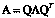 ， 以下说法正确的是

正确答案: C   你的答案: 空 (错误)

```cpp
任意矩阵都可以
```

```cpp
任意满秩矩阵都可以
```

```cpp
任何实对称矩阵都可以
```

```cpp
任何正定矩阵都可以
```

本题知识点

算法工程师 网易 2020

讨论

[岗迭尼山歌龙](https://www.nowcoder.com/profile/514863126)

矩阵的正交分解又称为 QR 分解，是将矩阵分解为一个正交矩阵 Q 和一个上三角矩阵的乘积的形式。

任意实数方阵 A，都能被分解。

发表于 2020-04-03 22:14:45

* * *

[歌尔德蒙的诗](https://www.nowcoder.com/profile/379555887)

只有实对称矩阵才能相似对角化

发表于 2020-08-08 00:33:26

* * *

## 7

以下关于卷积神经网络，说法正确的是

正确答案: C   你的答案: 空 (错误)

```cpp
卷积神经网络只能有一个卷积核
```

```cpp
卷积神经网络可以有多个卷积核，但是必须同大小
```

```cpp
卷积神经网络可以有多个卷积核，可以不同大小
```

```cpp
卷积神经网络不能使用在文本这种序列数据中
```

本题知识点

算法工程师 网易 2020

讨论

[努力成为程序媛鸭](https://www.nowcoder.com/profile/574902823)

同一层 feature map 可以分别使用多个不同尺寸的卷积核，以获得不同尺度的特征，再把这些特征结合起来，得到的特征往往比使用单一卷积核的要好，谷歌的 GoogLeNet，或者说 Inception 系列的网络，就使用了多个卷积核的结构。

发表于 2020-02-08 10:18:09

* * *

## 8

LR 模型的损失函数是

正确答案: A   你的答案: 空 (错误)

```cpp
交叉熵
```

```cpp
均方误差
```

```cpp
Hinge loss
```

```cpp
分类准确率
```

本题知识点

算法工程师 网易 2020

讨论

[FantDing_nk](https://www.nowcoder.com/profile/848375)

LR 是逻辑回归，不是线形回归

发表于 2020-03-22 14:54:35

* * *

[L201710091511469](https://www.nowcoder.com/profile/1515815)

为什么 LR 模型损失函数使用交叉熵不用均方差？

MSE（均方误差）对于每一个输出的结果都非常看重，而交叉熵只对正确分类的结果看重。
例如：在一个三分类模型中，模型的输出结果为（a,b,c)，而真实的输出结果为(1,0,0)，那么 MSE 与 cross-entropy 相对应的损失函数的值如下：
MSE：
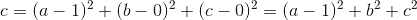
cross-entropy：
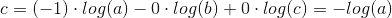
从上述的公式可以看出，交叉熵的损失函数只和分类正确的预测结果有关系，而 MSE 的损失函数还和错误的分类有关系，该分类函数除了让正确的分类尽量变大，还会让错误的分类变得平均，但实际在分类问题中这个调整是没有必要的。但是对于回归问题来说，这样的考虑就显得很重要了。所以，回归问题熵使用交叉上并不合适。

编辑于 2019-12-21 09:36:39

* * *

[小矮子 Estelle](https://www.nowcoder.com/profile/35128905)

svm 使用 hinge loss

发表于 2020-03-20 23:14:15

* * *

## 9

以下聚类方法中， 哪个是基于图理论的

正确答案: A   你的答案: 空 (错误)

```cpp
谱聚类
```

```cpp
Kmeans
```

```cpp
层次聚类
```

```cpp
基于密度的聚类
```

本题知识点

算法工程师 网易 2020

讨论

[岗迭尼山歌龙](https://www.nowcoder.com/profile/514863126)

谱聚类是一种基于数据相似度矩阵的聚类方法，它定义了子图划分的优化目标函数，并作出改进（RatioCut 和 NCut），引入指示变量，将划分问题转化为求解最优的指示变量矩阵 HH。然后利用瑞利熵的性质，将该问题进一步转化为求解拉普拉斯矩阵的 kk 个最小特征值，最后将 HH 作为样本的某种表达，使用传统的聚类方法进行聚类。 
我对于谱聚类的理解是，原本相似度矩阵就是对样本点的一种特征表达（特征维数等于样本数），现在进行了谱聚类求得的特征值矩阵，实际上是对原始特征矩阵的一种降维（也可能是升维），总之就是将样本从原始空间变换（可能是线性的也可能是非线性的）到另一个空间，在这个空间中具有良好的全局欧式性。

发表于 2020-04-04 09:01:57

* * *

## 10

gru 和 lstm 的说法正确的是：

正确答案: D   你的答案: 空 (错误)

```cpp
gru 通过 output gate 控制 memory；
```

```cpp
lstm 对 memory 不做控制，直接传递给下一个 unit
```

```cpp
gru 不对上一时刻的信息做任何控制；
```

```cpp
gru 的参数比 lstm 的参数少；
```

本题知识点

算法工程师 网易 2020

讨论

[ella70](https://www.nowcoder.com/profile/997991932)

GRU 是 LSTM 的一种变体，综合来看：
1、两者的性能在很多任务上不分伯仲。
2、GRU 参数相对少更容易收敛，但是在数据集较大的情况下，LSTM 性能更好。
3、GRU 只有两个门（update 和 reset），LSTM 有三个门（forget，input，output）
LSTM 还有许多变体，但不管是何种变体，都是对输入和隐层状态做一个线性映射后加非线性激活函数，重点在于额外的门控机制是如何设计，用以控制梯度信息传播从而缓解梯度消失现象

发表于 2020-08-07 16:22:04

* * *

[zzgforever](https://www.nowcoder.com/profile/903712532)

GRU 的构造更简单：比 LSTM 少一个 gate，这样就少几个矩阵乘法。在训练数据很大的情况下 GRU 能节省很多时间

发表于 2020-04-11 11:50:12

* * *

## 11

互联网平台中经常出现广告图片（不良信息推广、办假证、网络兼职等），为了保证平台内容质量我们需要对这样的图片进行拦截，我们可以通过计算机视觉技术实现广告内容的自动识别，使用的技术包括了图像分类、目标检测、OCR、特征检索等。然而，一些恶意用户为了绕过广告识别系统，会使用涂鸦、文字扭曲、文字透明化等 PS 手段增加广告图片的干扰信息，从而绕过广告识别系统的拦截，这是恶意用户对广告识别系统的攻击行为。请问从算法角度出发，有什么技术方案或思路可以对抗这一类攻击行为？可以是提前进行技术布控，也可以是发现攻击后进行快速处理。

你的答案

本题知识点

算法工程师 网易 2020

讨论

[牛客 Cver](https://www.nowcoder.com/profile/1897620)

1\. 可以采取神经网络对抗算法对攻击样本进行学习得到反攻击数据，从而达到反攻击的目的；2.可以使用一种基于深度学习的重获取取证算法。该工作从算法安全性的角度出发,能够有效抵抗对抗样本攻击的方案。

发表于 2020-02-25 13:45:42

* * *

## 12

近年来目标检测技术发展非常迅速，在时间开销、多尺度、小目标等问题上实现了一定的突破。请描述一个目标检测算法中最令你印象深刻的改进点，并聊一聊在解决实际问题中可能的应用价值。

你的答案

本题知识点

算法工程师 网易 2020

讨论

[牛客 Cver](https://www.nowcoder.com/profile/1897620)

RFCN 算法模型。改进：对于图像分类问题，translation-invariance 处于重要因素，对于检测识别问题，translation-variance 则要求快速响应。针对这个问题，RFCN 提出了一种敏感性网络结构，在做到快速响应的同时不会产生额外的计算开销，相比较于 Faster RCNN 而言，RFCN 的检测速度比较快。应用：在动作识别研究领域，有些场景要求检测网络需要对动作的平移性比较敏感，能够快速检测当前动作的变化，识别出动作的类型。

发表于 2020-02-25 13:54:23

* * *

[云淡风轻 43](https://www.nowcoder.com/profile/7098613)

AAA

发表于 2020-02-24 15:08:59

* * *

## 13

SIFT 是传统计算机视觉中非常好用的图像特征；而随着近年来深度学习的发展 CNN 特征方兴未艾，在人脸、图像检索、特定物体识别等领域发挥了重要作用。请描述一下两类特征各自的特点和适用场景，并试想一下两类特征结合使用的可能性。

你的答案

本题知识点

算法工程师 网易 2020

讨论

[牛客 Cver](https://www.nowcoder.com/profile/1897620)

特点：SIFT：

*   图像的局部特征，对旋转、尺度缩放、亮度变化保持不变，对视角变化、仿射变换、噪声也保持一定程度的稳定性。
*   独特性好，信息量丰富，适用于海量特征库进行快速、准确的匹配。
*   多量性，即使是很少几个物体也可以产生大量的 SIFT 特征
*   高速性，经优化的 SIFT 匹配算法甚至可以达到实时性
*   扩招性，可以很方便的与其他的特征向量进行联合。

CNN：

*   能够有效的将大数据量的图片降维成小数据量
*   能够有效的保留图片特征，符合图片处理的原则

使用场景：SIFT：

*   场景图像的预处理,即将彩色图像变成灰度图像；
*   将图像缩放到相同大小尺寸。

CNN：

*   特征提取
*   降维

结合使用的可能性：在特征提取方面进行结合，比如用模板匹配+CNN 结合做模型学习，从而提高准确率。

发表于 2020-02-25 14:03:36

* * *

## 14

有三种葡萄，每种分别有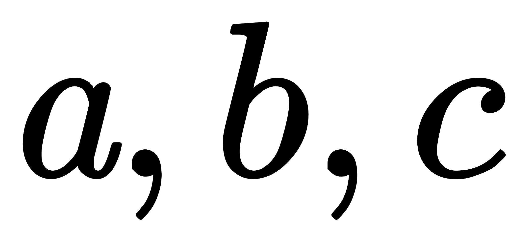颗。有三个人，第一个人只吃第种葡萄，第二个人只吃第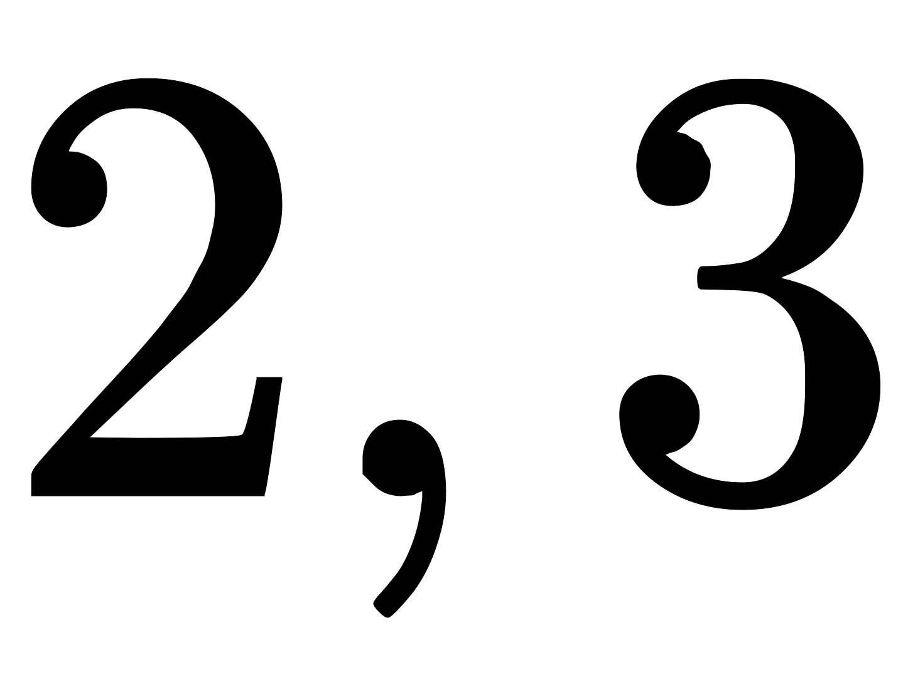种葡萄，第三个人只吃第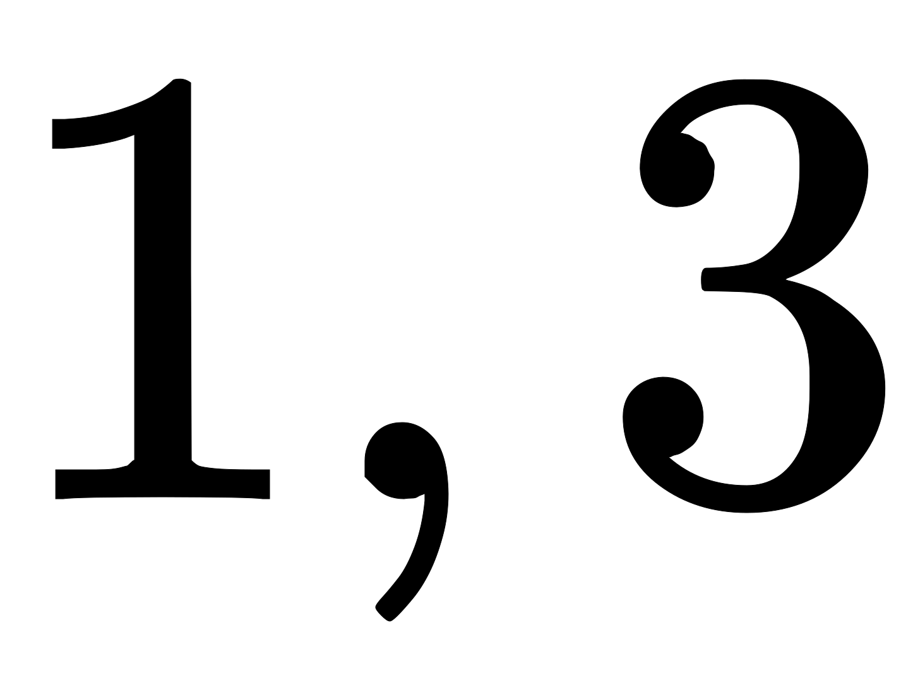种葡萄。
适当安排三个人使得吃完所有的葡萄,并且且三个人中吃的最多的那个人吃得尽量少。

本题知识点

iOS 工程师 网易 测试开发工程师 算法工程师 Java 工程师 C++工程师 数据分析师 安卓工程师 安全工程师 运维工程师 2020

讨论

[missingdaysqxy](https://www.nowcoder.com/profile/981730683)

平均 5ms，412K 占用将一组三个葡萄数想像成三条线段，如果能构成三角形（符合两短相加大于长），则三个人一人吃掉相邻两条边的一半就可以；如果不能构成三角形（即有一超长边），那么要把超长边平分给两个人吃，相当于折断长边，现在有 4 条边肯定能构成四边形，那么有两种情况：

1.  两个人吃完长边后不再吃短边，第三人吃完短边也没有超出另两个人；
2.  两人吃完长边后，如果不帮第三人吃两个短边，会使第三人吃的超过 2 人。

第一种情况的输出就是长边的 1/2；第二种情况则与三角形情况相同，需要所有人均分。
因此，综合来看只有两种情况：所有人平分，或者其中两人平分最多的那种葡萄。这两个哪个大，输出哪个。

```cpp
#include <iostream>
#include <cmath>
using namespace std;
void sort(long list[3]) // 手动冒泡排序
{
    if (list[0]<list[1]) swap(list[0],list[1]);
    if (list[0]<list[2]) swap(list[0],list[2]);
    if (list[1]<list[2]) swap(list[1],list[2]);
}

int main()
{
    int n;
    long l[3], sum;
    cin >> n;
    for (int i = 0; i < n; i++)
    {
        cin >> l[0] >> l[1] >> l[2];
        sort(l);
        sum = l[0] + l[1] + l[2];
        cout << max((sum + 2) / 3, (l[0] + 1) / 2) << endl;//加 2 与加 1 是为上取整
    }
}

```

编辑于 2019-12-16 21:40:40

* * *

[天上白云蓝湛湛～](https://www.nowcoder.com/profile/341340582)

可以看成是三个人分别站在三角形的顶点（假定可以形成三角形）。设三角形两个短边是 a,b，长边是 c。则，若两短边之和大于等于长边的一半，可实现总数平分；反之，则结果为长边的一半。最终结果为全部通过。

```cpp
T = int(input())
for _ in range(T):
    x,y,z = map(int,input().split())
    food = [x,y,z]
    max_v,sum_v = max(food),sum(food)
    ans = 0
    if sum_v-max_v>=max_v//2:
        ans =(sum_v+2)//3
    else:
        ans = (max_v+1)//2
    print(ans)
```

发表于 2020-05-19 15:52:09

* * *

[小厂大锅](https://www.nowcoder.com/profile/9185846)

python3

```cpp
t=int(input())
for _ in range(t):
    a,b,c=map(int,input().split())
    maxnum=max(a,b,c)
    total=a+b+c
    if maxnum//2>=total-maxnum:
        if maxnum%2==0:
            print(maxnum//2)
        else:
            print((maxnum+1)//2)
    else:
        if total%3==0:
            print(total//3)
        elif total%3==1:
            print((total+2)//3)
        else:
            print((total+1)//3)
```

发表于 2020-04-07 18:33:27

* * *

## 15

小易给定一个到的排列，希望你能求出这个序列中所有逆序对的距离和。
下标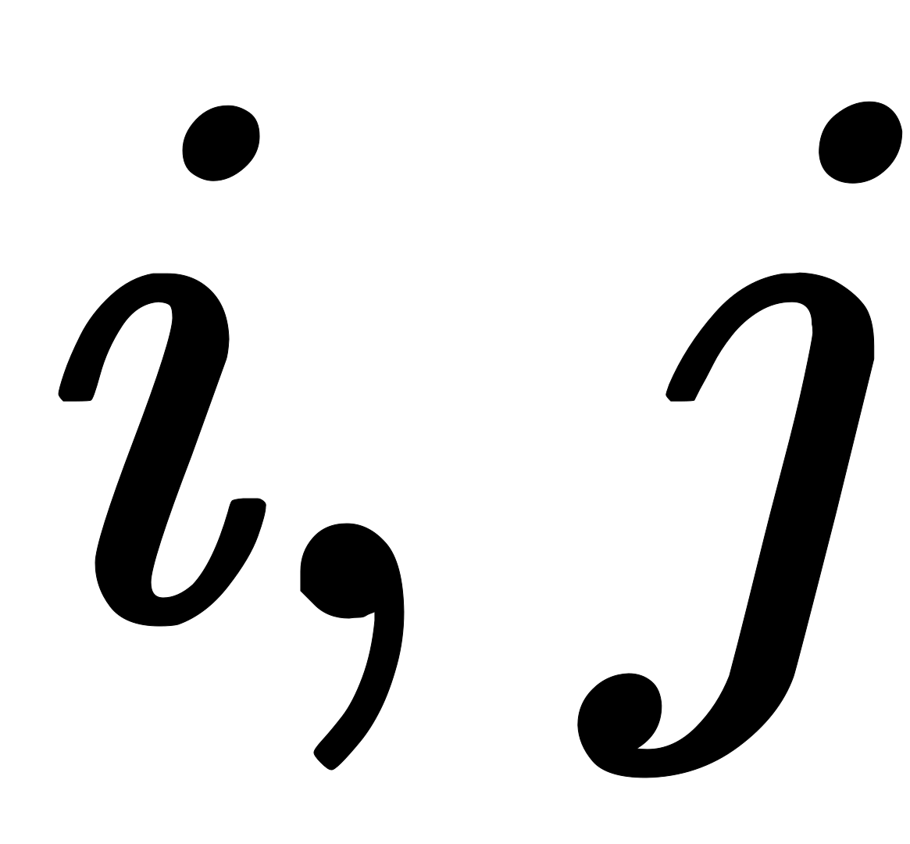的距离为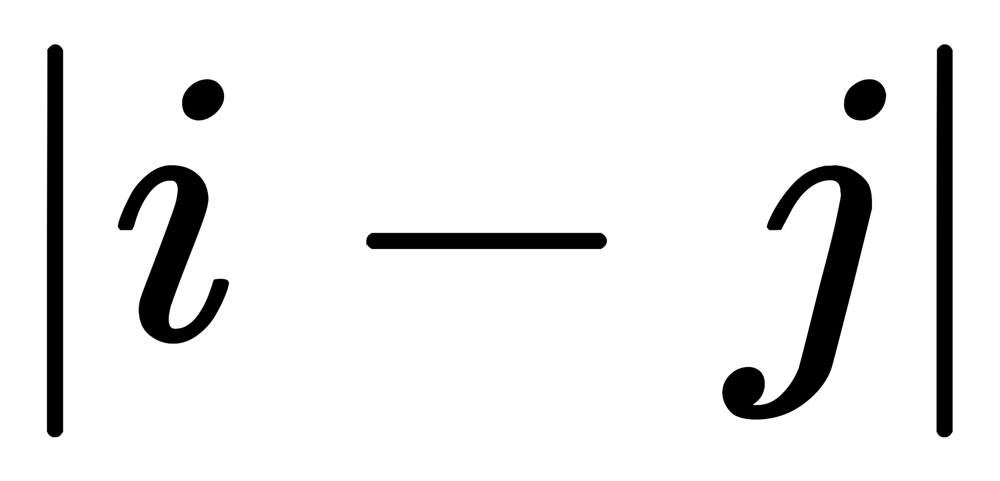，逆序对是指序列中一对下标满足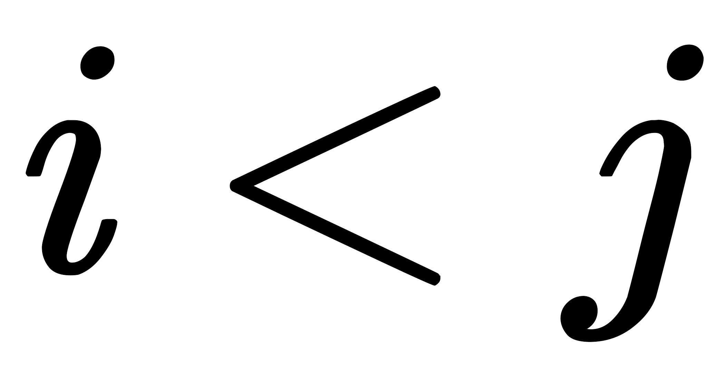且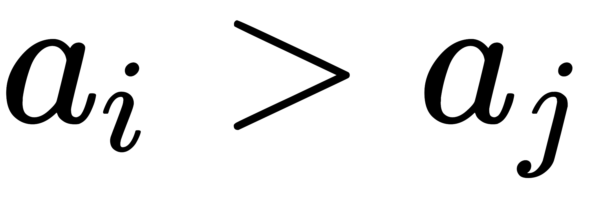 .

本题知识点

Java 工程师 网易 算法工程师 2020

讨论

[悦兮](https://www.nowcoder.com/profile/336153)

暴力***超时，普遍只有 60% 的通过率

使用归并排序，在合并时统计距离，能降低时间复杂度

首先题目明确说明是计算***坐标***之间的距离，例子中的说明也表明了这一点。

但是呢，题目也说了，输入的数组是一个 1 到 n 的排列，这会导致逆序对距离之和等于逆序对元素差（大的减小的）的和。

逆序对：
(3, 2)差为 1
(4, 2)差为 2
总和为 3

归并排序不说了，下面合并时如何统计逆序对的元素差。

将 left 与 right 数组合并，left 中的元素与 right 中的元素都是已排序的。

这时，如果遇到 left[i] > right[j]，不仅仅表明 i, j 是一个逆序对，i + 1, j 也是，i + 2, j 也是 ...

如果只是单纯将 left[i] - right[j]加到总距离中，然后 j 指针后移，显然，i + 1, j 等逆序对的距离就被忽略了。

“正确”的做法，需要从 i 开始遍历 left，计算所有的距离差，并加到总距离中，即：

dis += left[i] - right[j] + left[i + 1] - right[j] + ... + left[len(left) - 1] - right[j]

当然，如何使用遍历，那么时间复杂度是无法降低的。所以，观察上述式子，我们可以得出

dis += sum(left[i] ... left[len(left) - 1]) - right[j] * (len(left) - i)

使用一个变量记录 sum(left[i] ... left[len(left) - 1])的值即可，之后每次发现逆序对们，只需要 O(1) 的时间即可计算出所有逆序对间的距离的和。

贴上代码：

```cpp
n = int(input())
nums = list(map(int, input().split()))
ans = 0
def mergesort(arr, left, right):
    global ans
    if left >= right:
        return
    mid = (left + right) // 2
    mergesort(arr, left, mid)
    mergesort(arr, mid + 1, right)
    # merge
    res = []
    i, j = left, mid + 1
    sum_left = sum(arr[left:mid + 1])
    while i < mid + 1 and j < right + 1:
        if arr[i] > arr[j]:
            ans += sum_left - (mid + 1 - i) * arr[j]
            res.append(arr[j])
            j += 1
        else:
            sum_left -= arr[i]
            res.append(arr[i])
            i += 1
    if i < mid + 1:
        res.extend(arr[i:mid + 1])
    elif j < right + 1:
        res.extend(arr[j:right + 1])
    arr[left:right + 1] = res
mergesort(nums, 0, n - 1)
print(ans)
```

编辑于 2020-08-07 12:53:33

* * *

[酷宝向前冲](https://www.nowcoder.com/profile/6803063)

```cpp
import java.util.Scanner;

public class Main {

    static long ans = 0;

    public static void main(String[] args) {
        Scanner sc = new Scanner(System.in);
        int n = sc.nextInt();
        int[] nums = new int[n];
        for(int i = 0; i < n; i++) {
           nums[i] = sc.nextInt();   
        }
        mergerSort(nums, 0, nums.length - 1);
        System.out.println(ans);
    }

    public static void mergerSort(int[] nums, int l, int r) {
        if (l >= r) {
            return;
        }
        int m = l + (r - l) / 2;
        mergerSort(nums, l, m);
        mergerSort(nums, m + 1, r);
        if(nums[m] >= nums[m+1]) {
            merger(nums, l, m, r);
        }
    }

    private static void merger(int[] nums, int l, int m, int r) {
        int[] temp = new int[r - l + 1];
        int i = l, j = m + 1, k = 0;
        while (i <= m && j <= r) {
            if (nums[i] > nums[j]) {
                // 产生了 j-i+1 对逆序对
                int t = i;
                while(t <= m) {
                    ans += (nums[t++] - nums[j]);
                }
                temp[k++] = nums[j++];
            } else {
                temp[k++] = nums[i++];
            }
        }
        while(i <= m) {
            temp[k++] = nums[i++];
        }
        while(j <= r) {
            temp[k++] = nums[j++];
        }
        for(int a = 0; a < temp.length; a++) {
            nums[l+a] = temp[a];
        }
    }
}
```

发表于 2020-08-07 14:21:12

* * *

[paperman201910261445664](https://www.nowcoder.com/profile/558061840)

```cpp
import java.util.*;

public class Main{
    public static void main(String[] args){
        Scanner sc = new Scanner(System.in);
        int n = sc.nextInt();
        int[][] arr = new int[n][2];
        for(int i=0;i<n;i++){
            arr[i][0] = sc.nextInt();
            arr[i][1] = i;
        }
        long res = getAns(arr,n);
        System.out.println(res);
    }

    public static long getAns(int[][] arr,int n){
        int[][] tmp = new int[n][2];
        return reverse(arr,0,n-1,tmp);
    }

    public static long reverse(int[][] arr,int left,int right,int[][] tmp){
        if(left>=right)
            return 0;
        int mid = (left+right)>>>1;
        long leftDistance = reverse(arr,left,mid,tmp);
        long rightDistance = reverse(arr,mid+1,right,tmp);
        if(arr[mid][0]<=arr[mid+1][0])
            return leftDistance+rightDistance;
        long crossDistance = reverseCross(arr,left,mid,right,tmp);
        return crossDistance+leftDistance+rightDistance;
    }

    public static long reverseCross(int[][] arr,int left,int mid,int right,int[][] tmp){
        for(int i=left;i<=right;i++){
            tmp[i][0] = arr[i][0];
            tmp[i][1] = arr[i][1];
        }
        int i = left,j = mid+1;
        long count = 0;
        for(int k=left;k<=right;k++){
            if(i==mid+1){
                arr[k][0] = tmp[j][0];
                arr[k][1] = tmp[j][1];
                j++;
            }else if(j==right+1){
                arr[k][0] = tmp[i][0];
                arr[k][1] = tmp[i][1];
                i++;
            }else if(tmp[i][0]<=tmp[j][0]){
                arr[k][0] = tmp[i][0];
                arr[k][1] = tmp[i][1];
                i++;
            }else if(tmp[i][0]>tmp[j][0]){
                arr[k][0] = tmp[j][0];
                arr[k][1] = tmp[j][1];
                for(int l=i;l<=mid;l++){
                    count+=tmp[j][1]-tmp[l][1];
                }
                j++;
            }
        }
        return count;
    }
}
```

Java 代码，用的归并排序方法，用二维数组分别记录值和索引，注意 count 要用 long 类型。

发表于 2020-08-06 12:13:09

* * *

## 16

小易有根柱子，第根柱子的高度为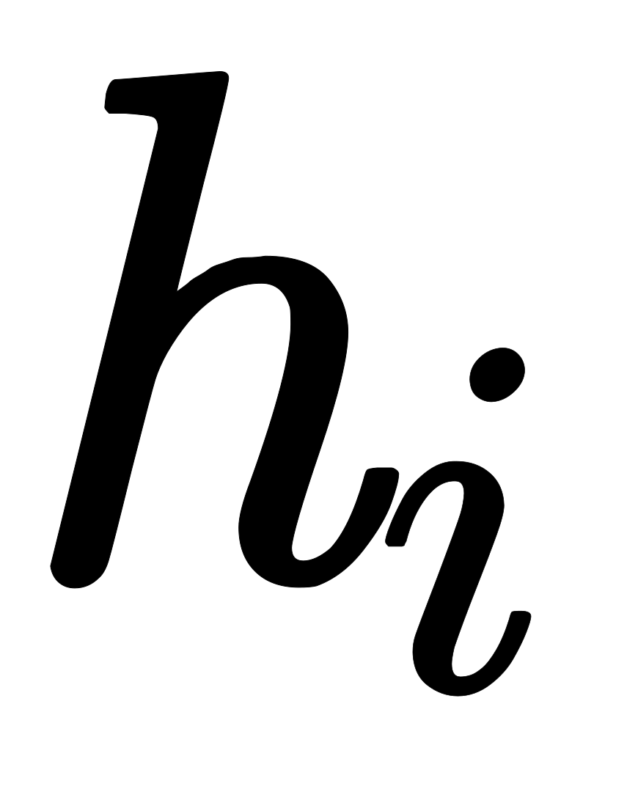。一开始小易站在第一根柱子上。小易能从第根柱子跳到第根柱子，当且仅当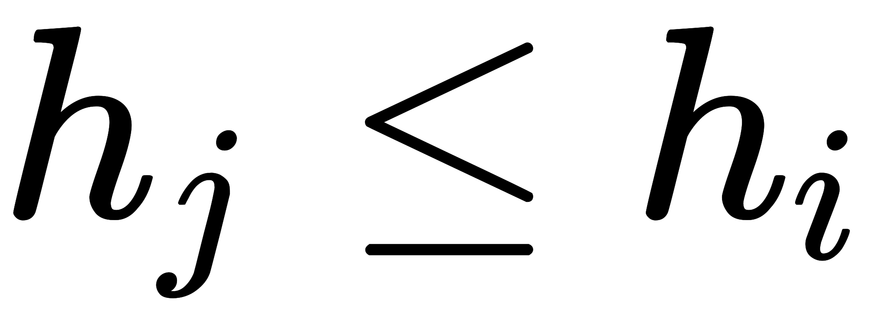且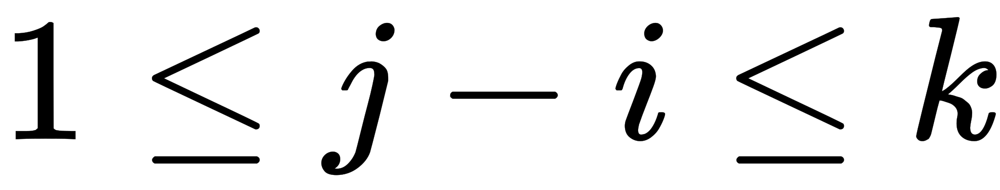。其中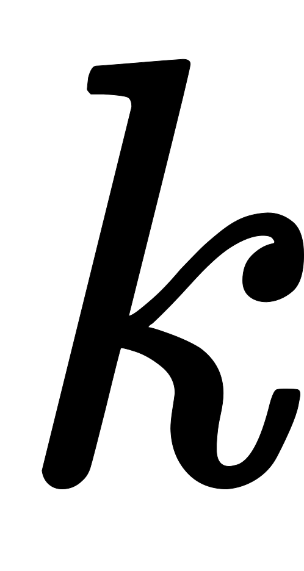为指定的一个数字。
另外小易拥有一次释放超能力的机会。这个超能力能让小易从柱子跳到任意满足的柱子而无视柱子高度的限制。
现在小易想知道，小易是否能到达第根柱子。

本题知识点

安卓工程师 网易 大数据开发工程师 算法工程师 前端工程师 Java 工程师 C++工程师 iOS 工程师 安全工程师 运维工程师 2020

讨论

[牛客 700653989 号](https://www.nowcoder.com/profile/700653989)

```cpp
t = int(input())
for _ in range(t):
    n, k = list(map(int, input().split()))
    li = list(map(int, input().split()))
    dp = [[False, 1] for _ in range(n)]
    dp[0][0] = True
    for i in range(1, n):
        flag = False
        max1 = 0
        for j in range(max(0, i - k), i):
            if dp[j][0] == False:
                continue
            elif li[j] >= li[i]:
                dp[i] = dp[j].copy()
                max1 = max(max1, dp[j][1])
                dp[i][1] = max1
                flag = True
            elif li[j] < li[i] and not flag and dp[j][1]:
                dp[i] = dp[j].copy()
                dp[i][1] = 0
    if dp[-1][0]:
        print('YES')
    else:
        print('NO')
```

发表于 2020-04-04 13:20:19

* * *

[爱吃咸鱼的喵](https://www.nowcoder.com/profile/620626456)

```cpp
#include <cstdio>
#include <cstring>
#include <algorithm>

#define MAX_N 1000+100
int T;
int N, k;
int H[MAX_N];
int dp[MAX_N][3];

int main()
{

	scanf("%d", &T);
	while (T--)
	{
		memset(dp, 0, sizeof(dp));
		dp[0][1] = 1;
		dp[0][0] = 1;
		scanf("%d%d", &N, &k);
		for (int i = 0; i < N; i++)
		{
			scanf("%d", &H[i]);
		}

		for (int i = 1; i < N; i++)
		{
			for (int j = 1; j <= k; j++)
			{
				if (i - j >= 0 && H[i] <= H[i-j]) {
					dp[i][0] |= dp[i - j][0];
					dp[i][1] |= dp[i - j][1];
				}

				dp[i][1] |= dp[i - j][0];

			}
		}

		if (dp[N - 1][0] || dp[N - 1][1])
			printf("YES\n");
		else
			printf("NO\n");
	}

	return 0;
}
```

 发表于 2020-01-08 20:18:45

* * *

[字节内推.](https://www.nowcoder.com/profile/9955061)

 ```cpp
import java.util.Scanner;

public class Main{
    public static void main(String[] args) {
        Scanner sc = new Scanner(System.in);
        int T = sc.nextInt();
        int n = 0, k = 0;
        for (int i = 0; i < T; i++) {
            n = sc.nextInt();
            k = sc.nextInt();
            int[] nums = new int[n];
            for (int j = 0; j < n; j++)
                nums[j] = sc.nextInt();
            System.out.println(solution(n, k, nums));
        }
    }

    public static String solution(int n, int k, int[] nums) {
        int big = 1;
        int index = 0;
        while (index < nums.length - 1) {
            int tmp = index;
            int max = 0, max_index = index;
            for (int j = index + 1; j < index + 1 + k && j < nums.length; j++) {
                if (nums[j] < nums[index]) {
                    max_index = (max > nums[j]) ? max_index : j;
                    max = Math.max(nums[j], max);
                }
            }
            index = max_index;
            if (tmp == index && big > 0) {
                big--;
                max = 0;
                max_index = index;
                for (int j = index + 1; j < index + 1 + k && j < nums.length; j++) {
                    max_index = (max > nums[j])? max_index : j;
                    max = Math.max(nums[j], max);
                }
                index = max_index;
            }
            else if (tmp == index && big <= 0)
                return "NO";
        }
        return "YES";
    }
}
```

编辑于 2020-04-05 19:10:36

* * *