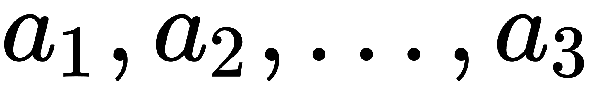

# 网易 2020 校招笔试- 前端开发工程师（提前批）

## 1

有一类二叉树用三叉链表来存储的时候除了带有指向左右孩子节点的两个指针，还有指向父节点的指针，那么这样一棵二叉树有 2 个节点，那么有多少指针指向 NULL（注：根节点的父指针指向 NULL，对于不存在的节点表示为 NULL）？

正确答案: D   你的答案: 空 (错误)

```cpp
1
```

```cpp
2
```

```cpp
3
```

```cpp
4
```

```cpp
5
```

本题知识点

Java 工程师 C++工程师 网易 安全工程师 测试开发工程师 前端工程师 数据分析师 数据库工程师 算法工程师 iOS 工程师 安卓工程师 运维工程师 2020

讨论

[北斗酌美酒](https://www.nowcoder.com/profile/170736954)


发表于 2020-04-11 11:37:30

* * *

[流浪者 201907280945510](https://www.nowcoder.com/profile/60649645)

每个节点有 3 个指针，两个节点一共 6 个指针，其中 A 节点父节点指向 B 节点， B 节点子节点指向 A 节点，剩下的 4 个节点全部是 NULL

发表于 2020-02-17 09:51:27

* * *

[小水滴真的是太可爱了吧](https://www.nowcoder.com/profile/742091450)

**三叉链表存储表示**

改进于二叉链表，增加指向父节点的指针，能更好地实现结点间的访问。


发表于 2020-04-07 10:38:28

* * *

## 2

下面关于 HTTP 协议的说法错误的是( )

正确答案: C   你的答案: 空 (错误)

```cpp
HTTP 报文分为请求报文和响应报文
```

```cpp
HTTP 请求行由请求方法、URL 和协议版本组成
```

```cpp
每个服务器都支持包括 GET\HEAD\PUT 等 7 种请求方法
```

```cpp
HTTP 响应行由协议版本、状态码和状态描述符组成
```

本题知识点

iOS 工程师 网易 测试工程师 测试开发工程师 前端工程师 2020

讨论

[猫仔面](https://www.nowcoder.com/profile/4548438)

HTTP 请求方法有 8 种：get、post、put、delete、options、trace、connect、head，其中至少应该实现 get、head、post 方法，其他方法都是可选的。

发表于 2020-08-06 13:14:05

* * *

[HEREISDAVID](https://www.nowcoder.com/profile/864672146)

请求和响应：


编辑于 2020-09-27 20:04:09

* * *

[工作已找到](https://www.nowcoder.com/profile/52550243)

只有 6 种

发表于 2020-03-25 16:36:14

* * *

## 3

判断一个数组或序列是正序,倒序还是乱序,需要我们将这个数组完整的遍历一遍通过构建有序序列，对于未排序数据，在已排序序列中从后向前扫描，找到相应的位置并插入的排序算法是（ ）

正确答案: C   你的答案: 空 (错误)

```cpp
选择排序
```

```cpp
希尔排序
```

```cpp
插入排序
```

```cpp
归并排序
```

本题知识点

iOS 工程师 网易 安卓工程师 C++工程师 Java 工程师 安全工程师 测试工程师 大数据开发工程师 前端工程师 算法工程师 数据分析师 数据库工程师 运维工程师 2020

讨论

[Olivia_dtt](https://www.nowcoder.com/profile/232985383)

选择排序：每次从数组中选出一个最小数（最大数）放到数组最前面，存放在序列的起始位置，直到全部待排序的数据元素排完。希尔排序：设置增量分割数组，逐步进行直接插入排序,增量逐趟减少,并最后使得整个数组基本有序,再对整体进行直接插入排序。插入排序：构建有序序列，未排序数据依次从已排序数据按从后往前比较，插入到合适的位置。归并排序：把序列分成两个长度为 n/2 的子序列，对这两个子序列分别归并排序（循环将两个数组的第一个值比较，并弹出第一个值， 直到数组长度都不存在），将两个排序好的子序列合并成一个最终的排序序列

发表于 2020-04-06 20:12:11

* * *

[牛客 929822447 号](https://www.nowcoder.com/profile/929822447)


插入排序—直接插入排序：


希尔排序：

 

选择排序：

 

归并排序：


发表于 2020-08-24 18:42:35

* * *

## 4

下面代码的输出是：

```cpp
const arr = [];
const testObj = {};
console.log(arr === "");
console.log(arr == "");
arr.toString = () => 1;
console.log(arr === 1);
console.log(arr == 1);
arr.valueOf = () => 2;
console.log(arr == 2);
arr.valueOf = () => testObj;
console.log(arr == testObj);
```

正确答案: A   你的答案: 空 (错误)

```cpp
false true false true true false
```

```cpp
false false false true false false
```

```cpp
false true false false true true
```

```cpp
false true true true true false
```

本题知识点

前端工程师 网易 2020

讨论

[可口 coco](https://www.nowcoder.com/profile/263662460)

做题必备小知识

==和===的区别：

*   出现==：
    我们可以将===看作==的严格模式，当==的时候如果数据类型相同那么就会转换成===；如果数据类型不同那么会自动的进行一次类型转换，转换成相同的类型后进行比较。
*   出现===：出现三个等号的时候，首先判断的是类型是否相等，如果不相等就会返回 false

valueOf 方法和 toString 方法默认调用 toString 方法

*   这是为什么呢，我看的有些博客直接说默认调用 toString 并没有说明原理。其实是这样的，我们看下面的一个例子，虽然 colors.valueOf()方法返回的还是一个数组，但是在 alert 输出的时候隐式调用了 toString 方法，所以结果是相同的。
*   但是如果是数值运算优先调用 valueOf()方法。

```cpp
var colors = ["red", "blue", "green"]; // 创建一个包含 3 个字符串的数组  
alert(colors.toString()); // red,blue,green  
alert(colors.valueOf()); // red,blue,green  
alert(colors); // red,blue,green 
```

解析

*   第一次输出：arr==="";类型都不同，不会调用 toString 也不会调用 valueOf。返回 false
*   第二次输出：arr=="";类型不同但是调用 toSrting 再进行比较。最后返回 true
*   第三次输出：arr===1；结果是 false 道理同第一次输出
*   第四次输出：arr==1；结果是 true，道理同第二次输出，两个方法不是都被重写，调用的是 toString 方法。
*   第五次输出：arr == 2；结果是 true，调用 valueOf 方法。
*   第六次输出：类型都是同样的 object，但是值不相同，所以返回的结果是 false

发表于 2020-01-19 17:24:57

* * *

[Offer 正在向你奔来](https://www.nowcoder.com/profile/958634941)

隐性类型转换步骤

一、首先看双等号前后有没有 NaN，如果存在 NaN，一律返回 false。

二、再看双等号前后有没有布尔，有布尔就将布尔转换为数字。（false 是 0，true 是 1）

三、接着看双等号前后有没有字符串, 有三种情况：

1、对方是对象，对象使用 toString()或者 valueOf()进行转换；

2、对方是数字，字符串转数字；（前面已经举例）

3、对方是字符串，直接比较；

4、其他返回 false

四、如果是数字，对方是对象，对象取 valueOf()或者 toString()进行比较, 其他一律返回 false

五、null, undefined 不会进行类型转换, 但它们俩相等

发表于 2020-03-04 15:30:57

* * *

[爱养猪的皮卡丘](https://www.nowcoder.com/profile/4992825)

对于最后一个：基本数据类型的值不可变,而引用数据类型的值是可变的

所以当你比较数组和对象时,都是 false;除非你是克隆的原份数据

即: var a = { name: "李四" }; var b = a;

大家通常称对象为引用类型,以此来和基本类型进行区分; 而对象值都是引用,所以的对象的比较也叫引用的比较,当且当他们都指向同一个引用时,即都引用的同一个基对象时,它们才相等.

编辑于 2020-08-17 22:08:58

* * *

## 5

下面代码的输出是：

```cpp
let a = 0;
const obj = {
    a: 1,
    b: function() {
    console.log(this.a);
    }
}
const obj1 = {
    a: 2
}
const fun = obj.b;
fun(); 
fun.apply(obj); 
fun.bind(obj1).apply(obj); 
const fun1 = fun.bind(obj1);
new fun(); 
```

正确答案: C   你的答案: 空 (错误)

```cpp
0 1 2 2
```

```cpp
0 1 2 undefined
```

```cpp
undefined 1 2 undefined
```

```cpp
undefined 1 2 2
```

本题知识点

前端工程师 网易 2020

讨论

[time201805161936661](https://www.nowcoder.com/profile/5058342)

十二行代码执行：    函数中的 this 是 window，但是，**ES6 中，有所改变：var、function 声明的全局变量，依然是顶层对象的属性；let、const、class 声明的全局变量不属于顶层对象的属性****。所以在 window 中找不到，undefined;**
**十三行代码执行不用说。****十四行代码执行：****bind 和 apply，call 区别之一是 bind 绑定的时候不会执行。另一个是 bind 绑定的 this 执行不会改变。** **十六行代码执行：new 一个函数产生的对象，里面的 this 是产生的对象，其中并没有 a，所以是 undefined**

发表于 2020-02-04 17:21:49

* * *

[liyuabc](https://www.nowcoder.com/profile/598834952)

fun(),执行的是 obj.b()，此时的 this.a 中的 this 是指向 window 的，而全局变量的没有定义，let a =0; 在 ES6 中不是申明为全局对象的变量，（如果是 use strict 情况下）,所以第一个 fun()的输出是 undefined
fun.apply(obj)，把 obj 对象传进去，这相当于执行 fun（）的时候，this.a 其实是 obj.a，this 指向 obj，所以输出是 1
fun.bind(obj1).apply(obj); bind 函数有个特点，绑定之后永久生效，因为先执行 fun.bind(obj1)，所以 this 指向 obj1，this.a 其实是 obj1.a，输出为 2.
new fun()，新建了一个对象，this 指向的是 new 的对象，而这个 new 的对象并没有属性 a 的，所以输出 undefined.

发表于 2020-02-14 21:48:11

* * *

## 6

下面代码的输出是：

```cpp
function func() {
    this.name = "Hellen";
}
console.log(typeof func.prototype);
func.prototype.getName = function() {
    console.log(this.name);
}
const Obj = {};
Obj.__proto__ = func.prototype;
func.call(Obj);
if (Obj.getName) {
    console.log("yes");
    Obj.getName();
}
console.log("end");
```

正确答案: C   你的答案: 空 (错误)

```cpp
function end
```

```cpp
function yes Hellen end
```

```cpp
object yes Hellen end
```

```cpp
Object end
```

本题知识点

前端工程师 网易 2020

讨论

[FengxiuLi](https://www.nowcoder.com/profile/766054702)

这一题主要考察得是原型链以及继承得知识
typeof 的作用：用于判断数据类型，返回值为 6 个字符串，分别为 string、Boolean、number、function、object、undefined。
此题如果 typeof func，那么返回的是 function;而此题 func.prototype，返回的是其原型，所以返回 object。
第五行是在 func 的原型上添加了一个方法
第八行创建了一个空对象
第九行将空对象的隐式原型指向 func 的显示原型，实现了原型链的继承，所以 func 中的所有的属性和方法也都继承过来（包括原型的方法）
所以可以访问 getName 方法，执行 11-14 行语句

发表于 2020-04-11 08:23:57

* * *

[uqral](https://www.nowcoder.com/profile/507910591)

前端小白在学，如有错漏，欢迎指正。

发表于 2020-09-22 23:46:42

* * *

## 7

Funtion.prototype 的原型链最终指向的哪？

正确答案: B   你的答案: 空 (错误)

```cpp
Funtion
```

```cpp
Object
```

```cpp
Null
```

```cpp
Array
```

本题知识点

前端工程师 网易 2020

讨论

[可口 coco](https://www.nowcoder.com/profile/263662460)

1.  原型链最终的指向是 Object 的 prototype, 而 Object 中的 __proto__ 是 null

发表于 2020-01-19 17:28:10

* * *

## 8

下面代码的输出是：

```cpp
function func(source) { 
    var target = {}; 
    for (var key in source) { 
        if (Object.prototype.hasOwnProperty.call(source, key)) {
             if (typeof source[key] === 'object') { 
                target[key] = func(source[key]); 
             } else { 
                target[key] = source[key]; 
             }
        } 
    } 
    return target; 
}
var a = { a1: "a1", a2: { b1: "b1", b2: "b2" }, a3: undefined, a4: null, a5: 1 };
var b = func(a); 
console.log(b);
```

正确答案: A   你的答案: 空 (错误)

```cpp
{a1: "a1", a2: {b1: "b1", b2: "b2"}, a3: undefined, a4: {}, a5: 1}
```

```cpp
{a1: "a1", a2: {b1: "b1", b2: "b2"}, a3: null, a4: null, a5: 1}
```

```cpp
{a1: "a1", a2: {b1: "b1", b2: "b2"}, a3: undefined, a4: undefined, a5: 1}
```

```cpp
{a1: "a1", a2: {b1: "b1", b2: "b2"}, a3: undefined, a4: null, a5: 1}
```

本题知识点

前端工程师 网易 2020

讨论

[FengxiuLi](https://www.nowcoder.com/profile/766054702)

解决这种分析题目的关键在于清楚整个代码的执行过程，执行过程如下：

1.  定义了一个 func，将函数的定义分配给他；
2.  定义了一个变量 a，将对象赋值给 a；
3.  定义了一个变量 b,当我们看到一个变量后面加一个（）的时候，那么便是调用这个函数，不管函数最终返回什么结果，都是将最终的结果赋值给 b；
4.  将 func()函数推送到执行栈中，函数的执行环境由全局上下文交给函数上下文；
5.  func()函数中，首先将对象 a 传入;
6.  定义一个 target 对象；
7.  遍历对象 a,使用 Object 的原型上的 prototype 属性来判断 a 中是否拥有该属性；
8.  如果该属性是一个对象，继续递归循环以上步骤；
9.  否则将该属性赋值给 target 对象；
10.  将 target 对象返回，赋值给 b;
11.  最后将 b 输出。

注意点

*   hasOwnProperty：表示对象中是否拥有该属性，返回的是一个布尔值；此处使用 Object.prototype.hasOwnProperty.call(source, key)表示的是使用的原型链中真正的 hasOwnProperty 方法来判断 source 对象中是否拥有 key 这个属性，也可以写成({}).hasOwnProperty.call(source, key);  JavaScript 并没有保护 hasOwnProperty 这个属性名，因此，当某个对象可能自有一个占用该属性名的属性时，就需要使用 Object.prototype.hasOwnProperty.call(source, key)或者({}).hasOwnProperty.call(source, key)获得正确的结果。
*   因为 typeof 无法判断 object 的具体类型，当判断 array、object、null 时结果都为 object 对象，所以 a4 为 {}

发表于 2020-04-11 09:56:03

* * *

[夏花爱秋叶](https://www.nowcoder.com/profile/4085682)

            function func(source) { 
                var target = {}; 
                for (var key in source) { 
                    // key==a1,
                    if (Object.prototype.hasOwnProperty.call(source, key)) {
                        // 判断是否有 a1 该属性
                        // console.log(source[key]) 键的值
                        // console.log(typeof null);//object
                         if (typeof source[key] === 'object') { 
                             // 若有则键的值是对象，则返回函数之后的数据
                             // 但是由于 js 的一个 bug,typeof null==object,所以还会调用 func(null)返回的是初始的 target,{}
                            target[key] = func(source[key]); 
                         } else { 
                            target[key] = source[key]; 
                         }
                    } 
                } 
                return target; 
            }
            var a = { a1: "a1", a2: { b1: "b1", b2: "b2" }, a3: undefined, a4: null, a5: 1 };
            var b = func(a); 
            console.log(b);

发表于 2019-12-29 22:50:59

* * *

[前端小窝](https://www.nowcoder.com/profile/522760159)

深拷贝，其中 typeof 判断 null 时结果为 object 对象，所以

```cpp
a4: {}
```

发表于 2020-04-07 16:37:46

* * *

## 9

<canvas width="250" height="250">，有个矩形长 20px，高 10px，css 中 width:250px，height:500px;  请问这个矩形渲染出来的面际是多少？

正确答案: C   你的答案: 空 (错误)

```cpp
200
```

```cpp
300
```

```cpp
400
```

```cpp
800
```

本题知识点

前端工程师 网易 2020

讨论

[Olivia_dtt](https://www.nowcoder.com/profile/232985383)

canvas 里面的宽高比为 1:1 css 里面的宽高比为 1：2， 因此画板宽高 1:1 画纸宽高 1:2， 画板高度不够，这时候高度就需要拉伸，增加一倍，所以矩形的高度会变成 20px

发表于 2020-04-06 20:37:05

* * *

[夏花爱秋叶](https://www.nowcoder.com/profile/4085682)

由于 canvas 元素的属性 width,height 设置了，而 css 中设置的宽高分别是 1:1，2:1，所以 canvas 实际渲染的大小应该是 20px,10*2px，也就是 20*20=400

发表于 2020-03-01 16:13:10

* * *

## 10

下列布局在页面上的宽度比是多少？// css.flex {display: flex;width: 200px;height: 100px;}.left {flex: 3 0 50px;background: red;}.right {flex: 2 0 100px;background: blue;}// html<div class="flex">
    <div class="left"></div>
    <div class="right"></div>
</div>

正确答案: A   你的答案: 空 (错误)

```cpp
2:3
```

```cpp
1:3
```

```cpp
3:2
```

```cpp
1:5
```

本题知识点

前端工程师 网易 2020

讨论

[正义 de 键盘侠](https://www.nowcoder.com/profile/839451883)

先计算基础值，left 占 50，right 占 100，剩下 50, 50 按比例分配，left 占 3 份，right 占 2 份，所以 left 的宽度为 50+50*5/3 = 80,right 的宽度为 100+50*5/2 = 120, left:right = 80:120=2:3

发表于 2019-12-02 23:41:19

* * *

[FengxiuLi](https://www.nowcoder.com/profile/766054702)

*   **flex-grow**属性定义项目的放大比例，默认为 0，即如果存在剩余空间，也不放大。
*   **flex-shrink**属性定义了项目的缩小比例，默认为 1，即如果空间不足，该项目将缩小。如果一个项目的 flex-shrink 属性为 0，则空间不足时不缩小。
*   **flex-basis**属性定义了在分配多余空间之前，项目占据的主轴空间。
*   **flex**属性是 flex-grow, flex-shrink 和 flex-basis 的简写，默认值为 0 1 auto。
*   **在本题中**先计算基础值，left 占 50px，right 占 100px，总的值为 200px,所以剩下 200-50-100=50px, 50 按比例分配，left 占 3 份，right 占 2 份，所以 left 的宽度为 50+50*3/5 = 80px,right 的宽度为 100+50*2/5 = 120px, left:right = 80:120=2:3

发表于 2020-04-11 10:27:16

* * *

## 11

如下图所示，请实现如下功能，当鼠标移到黑底客户服务区块后，出来白底卡片内容，鼠标移出后，卡片内容消失，并且当鼠标在白色部分上移动时白色框不能消失。

要求实现该功能完整的 html、css 及 js 代码

参考：三角形图标的样式为 trangle-down 如下：

```cpp
.triangle-down{
width：0；
height：0；
border-left：5pxsolidtransparent；
border-right:5pxsolidtransparent;
border-top:5pxsolidblack;
}
```

你的答案

本题知识点

前端工程师 网易 2020

讨论

[牛客 755955048 号](https://www.nowcoder.com/profile/755955048)

```cpp
<!DOCTYPE html>
<html>
<head>
	<title>任务-4</title>
	<style type="text/css">
		*{
			margin:0;
			padding:0;
		}
		html,body{
			height:100%;
			width:100%;
		}
        #container{
        	width:200px;
        	height:200px;
        	padding:20px;
        	border:1px solid #666;
        	margin:50px 0 0 50px;
        }
        #box{
        	height:30px;
        	line-height:30px;
        	width:100%;
        	background-color:black;
        	color:white;
        	text-align:center;
        	width:120px;
        	cursor:pointer;
        	border-bottom:1px solid rgba(0,0,0,.2);
        	position:relative;
        }
        .before{
        	width:0;
        	height:0;
        	border-top:6px solid white;
        	border-left:6px solid rgba(0,0,0,0);
        	border-right:6px solid rgba(0,0,0,0);
        	border-bottom:6px solid rgba(0,0,0,0);
        	position:absolute;
        	top:12px;
        	right:10px;
        	display:block;
        }
        .after{
        	width:0;
        	height:0;
        	border-top:6px solid rgba(0,0,0,0);
        	border-left:6px solid rgba(0,0,0,0);
        	border-right:6px solid rgba(0,0,0,0);
        	border-bottom:6px solid #f60;
        	position:absolute;
        	bottom:12px;
        	right:10px;
        	display:none;
        }
        .active{
        	background-color:rgba(0,0,0,.1) !important;
        	color:#f60 !important;
        }
        ul{
        	list-style:none;
        	width:80%;
        	height:auto;
        	background-color:rgba(0,0,0,.1);
        	padding:6px;
        	display:none;
        }
        ul li{
        	height:25px;
        	line-height:25px;
        	margin-left:15px;
        	font-size:14px;
        	cursor:pointer;
        	color:rgba(0,0,0,.5);
        }
        ul li:hover{
        	color:black;
        }
	</style>
</head>
<body>
<div id="container">
	<div id="box"><span class="before"></span>客户服务<span class="after"></span></div>
<ul>
	<li>> 联系客服</li>
	<li>> 帮助中心</li>
	<li>> 知识产权保护</li>
	<li>> 规则中心</li>
</ul>
	</div>

<script type="text/javascript">
	let oDiv = document.querySelector('#box');
	let oUl = document.querySelector('ul');
	let box_before = document.querySelector('.before');
	let box_after = document.querySelector('.after');
	oDiv.onmouseenter = function(){
		oUl.style.display = 'block';
		oDiv.className = 'active';
		box_before.style.display = 'none';
		box_after.style.display = 'block';
	}
	oUl.onmouseenter = function(){
		oUl.style.display = 'block';
		oDiv.className = 'active';
		box_before.style.display = 'none';
		box_after.style.display = 'block';
	}
	oDiv.onmouseleave = function(){
		oUl.style.display = 'none';
		oDiv.className = '';
		box_before.style.display = 'block';
		box_after.style.display = 'none';
	}
	oUl.onmouseleave = function(){
		oUl.style.display = 'none';
		oDiv.className = '';
		box_before.style.display = 'block';
		box_after.style.display = 'none';
	}
</script>
</body>
</html>
```

发表于 2020-05-25 22:33:08

* * *

[Morpwin](https://www.nowcoder.com/profile/178294206)

```cpp
<!DOCTYPE html>
<html lang="zh">
    <head>
        <title>task</title>
        <style>
            * {
                padding: 0;
                margin: 0;
            }
            ul {
                list-style: none;
            }
            .triangle-down, .triangle-up{
                width:0;
                height:0;
                border-left:5px solid transparent;
                border-right:5px solid transparent;
                border-top:5px solid #ccc;
                position: relative;
                top: 11px;
                left: 5px;
            }
            .triangle-up {
                border-bottom:5px solid red;
                top: -11px;
            }
            nav {
                width: 100%;
                height: 60px;
                font-size: 14px;
            }
            .nav-ul {
                display: flex;
                align-items: flex-start;
            }
            .nav-ul li {
                width: 100px;
                line-height: 60px;
                text-align: center;
                background-color: #000000;
                color: #fff;
            }
            .nav-ul .hover {
                background-color: #fff;
                color: red;
            }
            .concat-ul {
                display: flex;
                flex-direction: column;
                align-items: center;
                display: none;
            }
            .concat-ul li {
                background-color: #fff;
                color: #000;
                line-height: 40px;
            }
    </style>
    </head>
    <body>
        <header>
            <nav>
                <ul class="nav-ul">
                    <li>
                        <span>客服服务</span>
                        <i class="triangle-down"></i>
                        <ul class="concat-ul">
                            <li>
                                
                                <span>联系客服</span>
                            </li>
                            <li>
                                
                                <span>帮助中心</span>
                            </li>
                            <li>
                                
                                <span>知识产权保护</span>
                            </li>
                            <li>
                                
                                <span>规则中心</span>
                            </li>
                        </ul>
                    </li>
                    <li>
                        <span>充值服务</span>
                        <i class="triangle-down"></i>
                    </li>
                </ul>
            </nav>
        </header>
    </body>
    <script type="text/javascript">
        let ul = document.querySelector(".nav-ul")
        let tri = document.querySelector(".triangle-down")
        let lis = ul.children
        console.log(lis)
        for (let i = 0; i < lis.length; i++) {
            lis[i].addEventListener("mouseover", function(e) {
                if (lis[i].children[2]) {
                    lis[i].children[2].style.display = "block"
                    lis[i].className = "hover"
                    tri.className = "triangle-up"
                }
            })
            lis[i].addEventListener("mouseout", function(e) {
                if (lis[i].children[2]) {
                    lis[i].children[2].style.display = "none"
                    lis[i].className = ""
                    tri.className = "triangle-down"
                }
            })
        }
    </script>
</html>

```

编辑于 2020-09-16 17:35:47

* * *

[FengxiuLi](https://www.nowcoder.com/profile/766054702)

```cpp
<!DOCTYPE html>
<html lang="en">
<head>
	<meta charset="UTF-8">
	<title>由于有代码字数限制，所以去掉 CSS 代码</title>

</head>
<body>
	<section>
		<div class="div1">
			<span>客户服务</span>
			<span class="triangle-down"></span>

		</div>
		<div class="div2">
			<dl>
				<dd>
					<span class="servce2">客户服务</span>
					<span class="triangle-up"></span>
				</dd>
				<dt>联系客服</dt>
				<dt>帮助中心</dt>
				<dt>知识产权保护</dt>
				<dt>规则中心</dt>
			</dl>
		</div>
	</section>
	<script>
		let div1 = document.querySelector('.div1')
		let div2 = document.querySelector('.div2')
		let timer
		div1.onmousemove = function() {
			div2.style.display = 'block'
			console.log(1)
		}
		div1.onmouseout = function() {
			 timer = setTimeout(() => {
				div2.style.display = 'none'
				console.log(2)
			},2000)

		}
		div2.onmousemove = function() {
			clearTimeout(timer)
			console.log(3)
		}
		div2.onmouseout = function() {
				div2.style.display = 'none'
		}
	</script>
</body>
</html>
```

 编辑于 2020-04-11 15:20:20

* * *

## 12

设计一个 uniqueify 函数，可以根据用户自定义的 重复判定规则 进行数组元素去重，举个例子：

```cpp
//情况一：
letarr0 = [1,1,1,0,5,6];
uniqueify(arr0);
//输出：[1,0,5,6]

//情况二：
letarr1 = [
    {id: 1, name:'xx'},
    {id: 1, name:'xx'},
    {id: 2, name:'xx'},
    {id: 1, name:'xx'},
    {id: 1, name:'xx'}
];
uniqueify(arr1, a=>a.id);//假如这里的去重规则依据为 id
//输出：
[
    {id: 1, name:'xx'},
    {id: 2, name:'xx'}
];

//情况三：
letarr2 = [
    {name:'xx',sex:'male'},
    {name:'xx',sex:'female'},
    {name:'xx',sex:'male'},
    {name:'aa',sex:'male'},
    {name:'aa',sex:'male'}
];
uniqueify(arr2, a=>(a.name+a.sex));//假如这里的去重规则依据为名字和性别均相同，才算是相同
//输出：
[
    {name:'xx',sex:'male'},
    {name:'xx',sex:'female'},
    {name:'aa',sex:'male'}
];
```

你的答案

本题知识点

前端工程师 网易 2020

讨论

[nordon.wang](https://www.nowcoder.com/profile/829883776)

```cpp
function uniqueify(arr, cb) {
  let newArr = [];
  if (!cb) {
    //cb 不存在, 直接数组去重
    newArr = [...new Set(arr)];
  } else {
    // cb 存在
    let obj = {};
    arr.forEach(item => {
      if (!obj[cb(item)]) {
        obj[cb(item)] = item;
        newArr.push(item);
      }
    });
  }

  console.log(newArr);
}
```

发表于 2020-01-03 19:02:16

* * *

[老哇](https://www.nowcoder.com/profile/9050155)

```cpp
function uniqueify(data=[],callback = e=>e){
   let resArr = data.reduce((result,cur)=>{
    let value = callback(cur)
    if(!result.get(value)){
        result.set(value,cur)
    }
    return result
  },new Map())
  return Array.from(resArr.values())
}
```

编辑于 2020-08-07 22:33:27

* * *

[JuiceReal](https://www.nowcoder.com/profile/116362121)

```cpp
function uniqueify (arr, fn=item => item) {
  if(!Array.isArray(arr) || 
    typeof fn != "function") return;
  let obj = {};
  for(let i=0; i<arr.length; ++i) {
    let key = fn(arr[i]);
    if(!(key in obj)) {
      obj[key] = arr[i];
    }
  }
  return Object.values(obj);
}
```

发表于 2020-06-03 13:45:57

* * *

## 13

小易给你一个包含 n 个数字的数组。你可以对这个数组执行任意次以下交换操作：
对于数组中的两个下标 i,j(1<=i,j<=n)，如果为奇数，就可以交换和。现在允许你使用操作次数不限，小易希望你能求出在所有能通过若干次操作可以得到的数组中，字典序最小的一个是什么。

本题知识点

Java 工程师 网易 测试开发工程师 前端工程师 C++工程师 数据库工程师 算法工程师 iOS 工程师 安卓工程师 安全工程师 2020

讨论

[mynamewali](https://www.nowcoder.com/profile/524066618)

只要不全是奇数或者全是偶数，就进行排序

```cpp
#include<iostream>
#include<algorithm>
using namespace std;
int main(){
    int n;
    cin>>n;
    long int a[n];
    int odd_num = 0;
    for(int i=0;i<n;i++) cin>>a[i];
    for(int i=0;i<n;i++){
        if(a[i]&1) odd_num += 1;
    }
    if(odd_num==0 || odd_num==n){
        for(int i=0;i<n-1;i++) cout<<a[i]<<" ";
        cout<<a[n-1]<<endl;
    }
    else{
        sort(a,a+n);
        for(int i=0;i<n-1;i++) cout<<a[i]<<" ";
        cout<<a[n-1]<<endl;
    }

}
```

编辑于 2020-03-13 09:50:08

* * *

[孝陵卫的风](https://www.nowcoder.com/profile/645847812)

```cpp
import java.util.Arrays;
import java.util.Scanner;

public class Main {
    public static void main(String[] args) {
        Scanner scanner = new Scanner(System.in);
        while (scanner.hasNext()) {
            int n = scanner.nextInt();
            long[] arr = new long[n];
            for (int i = 0; i < n; i++) {
                arr[i] = scanner.nextLong();
            }
            demo1(arr);
            return;
        }
    }

    public static void demo1(long[] arr) {
        //奇数数量
        int oddSum = 0;
        for (int i = 0; i < arr.length; i++) {
            if (arr[i] % 2 == 1) {
                oddSum++;
            }
        }
        //如果全是偶数或者全是奇数则无法排序，直接输出
        if (oddSum == 0 || oddSum == arr.length) {
            for (int i = 0; i < arr.length; i++) {
                System.out.print(arr[i] + " ");
            }
            return;
        }
        //如果至少存在一对奇偶数，则可以将序列全部从小到大排列
        Arrays.sort(arr);
        for (int i = 0; i < arr.length; i++) {
            System.out.print(arr[i] + " ");
        }
    }
}

```

发表于 2020-04-05 22:06:52

* * *

[牛客 438821193 号](https://www.nowcoder.com/profile/438821193)

```cpp
var n = parseInt(readline())
var arr = readline().split(" ")
var ji = arr.every(item=>Number(item)%2) //判断是否全是奇数
var ou = arr.every(item=>Number(item)%2===0) //判断是否全是偶数
if(ji||ou){
    console.log(arr.join(" "))
}else{
    arr.sort((a,b)=>a-b)
    console.log(arr.join(" "))
}
```

怎么简洁怎么来 发表于 2021-08-28 14:16:50

* * *

## 14

小易在维护数据的时候遇到一个需求，具体来说小易有一系列数据，这些数据了构成一个长度为 n 的数字序列，接下来小易会在这个序列上进行 q 次操作。
每次操作有一个查询的数字 x，小易需要将序列数据中所有大于等于 x 的数字都减一，并输出在本次操作中有多少个数字被减一了。
小易犯了难，希望你能帮帮他。

本题知识点

安卓工程师 网易 Java 工程师 测试工程师 前端工程师 C++工程师 算法工程师 数据分析师 2020

讨论

[dragonlogin](https://www.nowcoder.com/profile/2071677)

思路

*   暴力解法
    暴力解法很容易想到，直接按题目说的来做就可以了
*   优化
    这个数据量，显然需要用 O(nlogn)或者 O(n)算法，则会想到排序，如果从大到小排，那么每次查询一个数字 x，使得大于等于 x 的数字都会-1，那么数列还是有序的。也就是数列始终都是有序的，这样就可以进行剪枝了，遍历到小于 x 的直接 break 跳出循环即可。

```cpp
#include <bits/stdc++.h>
using namespace std;
const int N = 200010;
int a[N], hs[N];
int n, q, x;

int main() {
    scanf("%d%d", &n, &q);
    int x;
    for (int i = 1; i <= n; ++ i) {
        scanf("%d", &a[i]);
    }
    sort(a + 1, a + n + 1, greater<int>());

    while (q -- ) {
        scanf("%d", &x);
        int ret = 0;
        for (int i = 1; i <= n; ++ i) {
            if (a[i] >= x) {
                a[i] -= 1;
                ret ++ ;
            } else {
                break;
            }
        }
        printf("%d\n", ret);
    }
    return 0;
}

```

发表于 2020-07-30 18:19:16

* * *

[孝陵卫的风](https://www.nowcoder.com/profile/645847812)

```cpp
import java.util.Arrays;
import java.util.Scanner;

public class Main {
    public static void main(String[] args) {
        Scanner scanner = new Scanner(System.in);
        int n = scanner.nextInt();
        int q = scanner.nextInt();
        int[] arr = new int[n];
        //将数字录入数组
        for (int i = 0; i < n; i++) {
            int num = scanner.nextInt();
            arr[i] = num;
        }
        //先将数组排序
        Arrays.sort(arr);
        //查询次数
        for (int i = 0; i < q; i++) {
            //需要查询的数字
            int x = scanner.nextInt();
            System.out.println(demo4(arr, x));
        }
    }

    public static int demo4(int[] arr, int x) {
        int count = 0;
        //从大往小比较，碰到小于 x 的及时终止循环，能优化时间
        for (int i = arr.length-1; i >= 0; i--) {
            if (arr[i] >= x) {
                arr[i]--;
                count++;
            } else {
                break;
            }
        }
        return count;
    }
}

```

编辑于 2020-04-06 16:21:20

* * *

[miraclequester](https://www.nowcoder.com/profile/347359971)

线段树+二分，O（n (logn)²）

```cpp
#include<bits/stdc++.h>
using namespace std;
#define inf 0x3f3f3f3f
#define ll long long
const int N=2e5+5;
const double eps=1e-8;
const double PI = acos(-1.0);
#define lowbit(x) (x&(-x))
int sum[N<<2],add[N<<2];
int a[N];
void pushUp(int rt)
{
    sum[rt]=sum[rt<<1]+sum[rt<<1|1];
}
void build(int l,int r,int rt)
{
    if(l==r)
    {
        sum[rt]=a[l];
        return;
    }
    int m=(l+r)>>1;
    build(l,m,rt<<1);
    build(m+1,r,rt<<1|1);
    pushUp(rt);
}
void pushDown(int rt,int ln,int rn)
{
    if(add[rt])
    {
        add[rt<<1]+=add[rt];
        add[rt<<1|1]+=add[rt];
        sum[rt<<1]+=add[rt]*ln;
        sum[rt<<1|1]+=add[rt]*rn;
        add[rt]=0;
    }
}
void update(int L,int R,int C,int l,int r,int rt)
{
    if(L <= l && r <= R)
    {
        sum[rt]+=C*(r-l+1);
        add[rt]+=C;
        return ;
    }
    int m=(l+r)>>1;
    pushDown(rt,m-l+1,r-m);
    if(L <= m) update(L,R,C,l,m,rt<<1);
    if(R >  m) update(L,R,C,m+1,r,rt<<1|1);
    pushUp(rt);
}
int query(int L,int R,int l,int r,int rt)
{
    if(L <= l && r <= R)
    {
        return sum[rt];
    }
    int m=(l+r)>>1;
    pushDown(rt,m-l+1,r-m);
    int ans=0;
    if(L <= m) ans+=query(L,R,l,m,rt<<1);
    if(R >  m) ans+=query(L,R,m+1,r,rt<<1|1);
    return ans;
}
int main()
{
    std::ios::sync_with_stdio(false);
    int n,q;
    while(cin>>n>>q)
    {
        memset(add,0,sizeof(add));
        for(int i=1; i<=n; i++)
        {
            cin>>a[i];
        }
        sort(a+1,a+1+n);
        build(1,n,1);
        while(q--)
        {
            int l=1,r=n,m,ans=-1,x;
            cin>>x;
            while(l<=r)
            {
                m=(l+r)>>1;
                if(query(m,m,1,n,1)>=x)
                {
                    r=m-1;
                    ans=m;
                }
                else
                {
                    l=m+1;
                }
            }
            if(ans==-1)
            {
                cout<<0<<endl;
            }
            else
            {
                cout<<n-ans+1<<endl;
                update(ans,n,-1,1,n,1);
            }
        }
    }
    return 0;
}

```

编辑于 2020-04-04 20:47:09

* * *

## 15

小易学习了辗转相除法之后，就开始实践这个算法在求解最大公约数上。牛牛给小易出了一道不同寻常的求解最大公约数: 求解 a 和 b 的最大公约数，但是 a 和 b 的范围特别大。小易遇到了困难，向聪明的你寻求帮助，希望你能帮帮他。

本题知识点

C++工程师 网易 Java 工程师 大数据开发工程师 前端工程师 数据分析师 2020

讨论

[牛客 864355626 号](https://www.nowcoder.com/profile/864355626)

```cpp
def hcf(a, b):
    a, b = min(a, b), max(a, b)
    if b % a == 0:
        return a
    else:
        return hcf(a, b % a)

a = int(input())
b = int(input())
print(hcf(a, b))
```

 发表于 2020-01-03 17:54:37

* * *

[FengxiuLi](https://www.nowcoder.com/profile/766054702)

```cpp
//我看到没有人使用 JS 做，我来解决一下
let bfc = (a, b) => {
	if (b === 0) {
		return a
	} else {
		return bfc(b, parseInt(a % b))
	}
}
console.log(bfc(9, 6))
```

发表于 2020-04-11 16:24:52

* * *

[gerizeman](https://www.nowcoder.com/profile/370793879)

```cpp
a_temp = int(input())
b_temp = int(input())

a = max(a_temp, b_temp)
b = min(a_temp, b_temp)

while a % b != 0:
    temp = a % b
    a = b
    b = temp

print(b)
```

编辑于 2020-04-10 23:31:34

* * *

## 16

小易给定了一个长度为 n 的数字序列，对于每一个，小易希望能求解出所有长度为 k 的连续子序列的最大值中的最小值。

本题知识点

安卓工程师 网易 C++工程师 Java 工程师 安全工程师 测试工程师 大数据开发工程师 前端工程师 算法工程师 数据分析师 2020

讨论

[牛客 188000430 号](https://www.nowcoder.com/profile/188000430)

```cpp
def mininmax(nums):
    dp=[]
    for i in range(len(nums)-1):
        dp.append(max(nums[i],nums[i+1]))
    return dp
n=int(input())
nums=list(map(int,input().split()))
res=[]
while nums:
    res.append(min(nums))
    nums=mininmax(nums)
print(" ".join(str(i) for i in res))
```

60%,还有更好的方法嘛！

发表于 2020-06-30 17:36:53

* * *

[鹿鸣松](https://www.nowcoder.com/profile/646250553)

我用的是 python3.8 ```cpp
def myfunction(n,s):
    s=s.split(' ')
    s=list(map(int,s))
    count_list=[]
    for k in range(1,n+1):
        temp_list=[]
        for i in range(n):
            if i+k<=n:
                temp_list.append(max(s[i:i+k]))
        count_list.append(min(temp_list))
    return count_list

print(myfunction(6,'1 3 2 4 6 5'))
```

这个在我自己 pycharm 上跑通了（包括那个 100 的元素的例子），但是在这上面没有，我一开始的输入是直接用列表的，我以为这个有问题，就换成 string 转 int 型列表，但还是不行，难道是 n 他没给我？whatever🙄
我的思路是用两个空列表分别取承接第一个循环下来的最大值列表和第二个循环下来的最小值列表，值得注意的是当取列表的长度不满足大小为 k 的时候，是需要跳出循环或者不加最大值计算的，不然后面会出一些奇怪的结果。核心是两个 for 循环，其他没什么。写解析的时候看了下评论区，嗯，python 真好用🙃

发表于 2020-12-22 22:23:42

* * *

[Pauline677](https://www.nowcoder.com/profile/897067998)

请问用 R 的小伙伴吗？我的结果一摸一样，一直显示格式错误。cat 的'\n'，'\b'都试过还是不行

```cpp
inputs = readLines("stdin")
n = as.numeric(inputs[1])
seq = as.numeric(unlist(strsplit(inputs[2]," ",fixed = T)))

check = function(start,k,n) { # k <= n-start+1
  if (k<=n-start+1) {
    x = rep(NA,n-k-start+2)
    for (i in start:(n-k+1)){
      x[i-start+1] = max(seq[i:(i+k-1)])
    }
    return(min(x))
  } else {
    return(NA)
  }
}

for (k in 1:n){
  x = rep(NA,n)
  for (i in 1:n) {
    x[i] = check(i,k,n)
  }
  cat(min(x,na.rm =T),'\b')
}
```

发表于 2020-08-07 17:16:00

* * * </canvas>