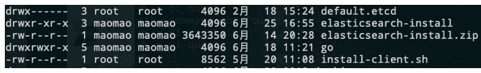

# 网易 2020 校招笔试- 嵌入式软件工程师（提前批）

## 1

一棵二叉树有 8 个度为 2 的节点，5 个度为 1 的节点，那么度为 0 的节点个数为?

正确答案: D   你的答案: 空 (错误)

```cpp
不确定
```

```cpp
7
```

```cpp
8
```

```cpp
9
```

```cpp
6
```

本题知识点

安卓工程师 网易 C++工程师 前端工程师 Java 工程师 算法工程师 2020

讨论

[大熊猫 520](https://www.nowcoder.com/profile/969525822)

任一棵树中，结点总数=度数+1

n0+5+8=（n0*0+1*5+8*2）+1

n0=9

发表于 2020-03-23 10:35:26

* * *

[牛客 425148523 号](https://www.nowcoder.com/profile/425148523)

我是最笨的办法，直接画图解决，可以牛客不能传图片

发表于 2020-04-11 13:39:41

* * *

[张富林](https://www.nowcoder.com/profile/242596196)

边数=n2+n1+n0-1=n2+n1; n0=n2+1

发表于 2019-12-01 17:06:22

* * *

## 2

下列最短路径算法的叙述中正确的是（）

正确答案: B   你的答案: 空 (错误)

```cpp
Dijkstra 算法通常用于求每一对顶点间的最短路径；
```

```cpp
Dijkstra 算法不允许图中带有负权值的边，而 Floyd 算法则可以适用；
```

```cpp
Floyd 算法通常用于求某一顶点到其他各顶点的最短路径；
```

```cpp
Floyd 算法允许有包含负权值的边组成的回路，而 Dijkstra 算法不允许；
```

本题知识点

iOS 工程师 网易 Java 工程师 前端工程师 C++工程师 算法工程师 数据分析师 数据库工程师 2020

讨论

[vicyor](https://www.nowcoder.com/profile/2210832)

```cpp
1.Dijkstra 算法是计算图中的一个点到其它点的最小路径.
  算法思路: 贪心算法.
    将图中所有点分成 S(已求出解)和 U(未求出解)2 个点集.dist[i]表示 v0 到 v[i]当前已求得得最短路径.A[n][n]为边集
    1.从剩下的边集合中选出 dist 最短的边并将边的另一顶点 vi 从 U 中加入 S.
    2.更新与 vi 连接的所有且并未在 S 中的点的 dist 矩阵值,dist[vk]=min(dist[vk],dist[vi]+A(i,k)).
    3.重复上述操作直到 U 中无与 S 中的点相连的点.
2.Floyd 算法计算图中任意一对点的最短路径.
  算法思路:  T(n)=O(n³).
   动态规划法: Dis(i,j) =min(Dis(i,j), Dis(i,k) + Dis(k,j)).

```
 for(k=0;k<n;k++)
 　　{ 
       //A[i][j]初始为每点的边长. for(i=0;i<n;i++) for(j=0;j<n;j++) if(A[i][j]>(A[i][k]+A[k][j]))
             　　{
                   　　A[i][j]=A[i][k]+A[k][j];
                   　　path[i][j]=k;
              　 } 
    　} 
```cpp

3.Dijkstra 算法为啥不能存在负数边?

Dijkstra 中 S(已求出解)中的每一个点解即最短路径是已求出的,若存在负数路径,可能存在已求出的解不是最优解.

例:

A   3    B

4     -1000 

c 

由于贪心法 B 的最终结果为 3 而不是 -996,而 C 的结果正确 -997.

```

发表于 2020-02-17 15:57:16

* * *

[offer 快来球球了](https://www.nowcoder.com/profile/243031380)

注意 floyd 能有负权值的边，不能有负权值的回路！

发表于 2020-02-24 10:43:38

* * *

[青墨山音](https://www.nowcoder.com/profile/267670990)

B

发表于 2019-12-23 02:35:08

* * *

## 3

计算机操作系统中，索引顺序文件是顺序文件的扩展，各类记录为顺序排列，现假设牛客网人力资源部门某个文件为索引顺序文件，由 5 个逻辑记录组成，每个逻辑记录的大小与磁盘块的大小相等，均为 512B，并依次存放在 50、121、75、80、63 号磁盘块上。若要存取文件的第 1569 逻辑字节处的信息，则要访问（   ）号磁盘块。

正确答案: C   你的答案: 空 (错误)

```cpp
3
```

```cpp
75
```

```cpp
80
```

```cpp
63
```

本题知识点

Java 工程师 C++工程师 网易 安全工程师 前端工程师 iOS 工程师 安卓工程师 运维工程师 2020

讨论

[小生哥](https://www.nowcoder.com/profile/6980746)

1569/512=3...33 要访问字节的逻辑记录号为 3,对应的物理磁盘块号为 80。

发表于 2019-12-31 13:22:47

* * *

[Fat-Tiger](https://www.nowcoder.com/profile/8187487)

一块一块地读，一块大小 512B

发表于 2019-11-30 16:03:04

* * *

## 4

牛客网的某一网络的一台主机产生了一个 IP 数据报，头部长度为 20 字节，数据部分长度为 2000 字节，该数据报需要经过两个网络到达目的主机，这两个网络所允许的最大传输单位 MTU 分别为 1500 字节和 576 字节。那么原 IP 数据报到达目的主机时分成了（   ）IP 小报文？

正确答案: C   你的答案: 空 (错误)

```cpp
2
```

```cpp
3
```

```cpp
4
```

```cpp
5
```

本题知识点

Java 工程师 C++工程师 网易 安全工程师 大数据开发工程师 前端工程师 算法工程师 运维工程师 2020

讨论

[梦醒时分 2019](https://www.nowcoder.com/profile/477996513)

一个链路层帧能承载的最大数据量叫做最大传送单元（MTU）头部长度为 20 字节，数据部分长度为 2000 字节，该数据报需要经过两个网络到达目的主机，这两个网络所允许的最大传输单位 MTU 分别为 1500 字节和 576 字节。1、2000 字节（加上头部一共 2020 字节）的数据经过第一个 MTU 为 1500 字节的网络时，分为 2 个分片,分片 1（1500 字节）携带 1480 字节的数据，分片 2（540 字节）携带剩下的 520 字节的数据。2.分片 1（1480 字节的数据）经过第二个 MTU 为 576 字节的网络时，需要继续分片为 3 个 IP 小报文（分片 3、4、5），分片 3 和 4 各自携带 556（576-20=556）字节的数据，分片 5 携带剩下的 368 字节的数据。那么，总共分为了 4 个 IP 小报文

编辑于 2020-08-08 22:17:33

* * *

## 5

判断一个数组或序列是正序,倒序还是乱序,需要我们将这个数组完整的遍历一遍通过构建有序序列，对于未排序数据，在已排序序列中从后向前扫描，找到相应的位置并插入的排序算法是（ ）

正确答案: C   你的答案: 空 (错误)

```cpp
选择排序
```

```cpp
希尔排序
```

```cpp
插入排序
```

```cpp
归并排序
```

本题知识点

iOS 工程师 网易 安卓工程师 C++工程师 Java 工程师 安全工程师 测试工程师 大数据开发工程师 前端工程师 算法工程师 数据分析师 数据库工程师 运维工程师 2020

讨论

[Olivia_dtt](https://www.nowcoder.com/profile/232985383)

选择排序：每次从数组中选出一个最小数（最大数）放到数组最前面，存放在序列的起始位置，直到全部待排序的数据元素排完。希尔排序：设置增量分割数组，逐步进行直接插入排序,增量逐趟减少,并最后使得整个数组基本有序,再对整体进行直接插入排序。插入排序：构建有序序列，未排序数据依次从已排序数据按从后往前比较，插入到合适的位置。归并排序：把序列分成两个长度为 n/2 的子序列，对这两个子序列分别归并排序（循环将两个数组的第一个值比较，并弹出第一个值， 直到数组长度都不存在），将两个排序好的子序列合并成一个最终的排序序列

发表于 2020-04-06 20:12:11

* * *

[牛客 929822447 号](https://www.nowcoder.com/profile/929822447)


插入排序—直接插入排序：


希尔排序：

 

选择排序：

 

归并排序：


发表于 2020-08-24 18:42:35

* * *

## 6

死锁是指多个进程在运行过程中因争夺资源而造成的一种僵局，永远在互相等待的进程称为死锁进程，假设计算机系统中有 3 个不同的临界资源 R1、R2 和 R3，被 4 个进程 p1、p2、p3 及 p4 共享。各进程对资源的需求为：p1 申请 R1 和 R2，p2 申请 R2 和 R3，p3 申请 R1 和 R3，p4 申请 R2。若系统出现死锁，则处于死锁状态的进程数至少是（  ）

正确答案: C   你的答案: 空 (错误)

```cpp
1
```

```cpp
2
```

```cpp
3
```

```cpp
4
```

本题知识点

iOS 工程师 网易 安卓工程师 C++工程师 Java 工程师 测试工程师 测试开发工程师 大数据开发工程师 前端工程师 算法工程师 数据库工程师 2020

讨论

[彭彭の零柒](https://www.nowcoder.com/profile/390870854)

3 个.这种情况： p1 占用 r1,p2 占用 r2，p3 占用 r3，p1 申请 r2，p2 申请 r3，p3 申请 r1，无限等待释放资源

发表于 2020-02-21 21:58:02

* * *

[我是复读机](https://www.nowcoder.com/profile/162099353)

要理解死锁的概念。死锁的进程必须是已经占有了某个资源，同时在请求其他资源，而且不会主动释放已占有的资源。如果几个进程循环等待其他进程已占有的资源，就陷入了死局，就死锁了。

发表于 2020-04-21 17:16:12

* * *

[猫仔面](https://www.nowcoder.com/profile/4548438)

我的理解：对于本题，有 3 个资源，所以如果出现死锁（环形等待），必定至少需要 3 个进程来分别占有 3 个资源（感觉怪怪的）

发表于 2020-08-06 15:18:29

* * *

## 7

运行以下 python 代码输>>> map(lambda x: x+1, range(6))输出正确的是

正确答案: C   你的答案: 空 (错误)

```cpp
[6, 5, 4, 3, 2, 1]
```

```cpp
[5, 4, 3, 2, 1, 0]
```

```cpp
[1, 2, 3, 4, 5, 6]
```

```cpp
[0, 1, 2, 3, 4, 5]
```

本题知识点

前端工程师 网易 Java 工程师 C++工程师 算法工程师 运维工程师 2020

讨论

[齐广博 18130041519](https://www.nowcoder.com/profile/902438906)

map()函数：*接收一个函数和一个可迭代对象（可以理解为 list），将函数依次作用在每个元素上，得到一个新的 list。**lambda x: x+1：表示匿名函数，将元素加一**range()：表示一个整数列表，默认从 0 开始。* *例如：range(6)，表示：0,1,2,3,4,5。**          最后结果为：1，2,3,4,5,6。*

发表于 2020-09-08 23:25:04

* * *

## 8

请选择以下命令后 file1 和 file2 的权限 chmod 755 file1chmod 644 file2

正确答案: B   你的答案: 空 (错误)

```cpp
-rw-r--r--  file1

-rw-r--r--  file2
```

```cpp
-rwxr-xr-x  file1

-rw-r--r--  file2
```

```cpp
-rw-r--r--  file1

-rwxr-xr-x  file2
```

```cpp
-rwxr-xr-x  file1

-rw-rw-rw-  file2
```

本题知识点

Java 工程师 C++工程师 网易 安全工程师 大数据开发工程师 前端工程师 数据库工程师 运维工程师 2020

讨论

[Aiqing](https://www.nowcoder.com/profile/814029247)

**chmod**是 Linux 下设置文件权限的命令，后面的数字表示不同用户或用户组的权限。

一般是三个数字：

第一个数字表示文件所有者的权限

第二个数字表示与文件所有者同属一个用户组的其他用户的权限

第三个数字表示其它用户组的权限。

权限分为三种：读（r=4），写（w=2），执行（x=1）。综合起来还有可读可执行（rx=5=4+1）、可读可写（rw=6=4+2）、可读可写可执行(rwx=7=4+2+1)。

所以，**chmod 755** 设置用户的权限为：

1.文件所有者可读可写可执行

2.与文件所有者同属一个用户组的其他用户可读可执行

3.其它用户组可读可执行-rwx-r--r-- (一共 10 个参数) 表示文件所属组和用户的对应权限。
第一个跟参数属于管理员，跟 chmod 无关,先不管.
2-4 参数:属于 user
5-7 参数:属于 group
8-10 参数:属于 others
接下来就简单了:r==>可读 w==>可写 x==>可执行
r=4 w=2 x=1
所以 755 代表 rwxr-xr-x  注意是前三个字母为 7 然后两个 r-x 为 5 r-x 为 5

777 代表 rwxr-rwx-rwx 所有用户都可读可写可执行。644 为 -rw-r-r-

发表于 2019-12-20 17:28:38

* * *

[牛客 380846183 号](https://www.nowcoder.com/profile/380846183)

参考了楼上同学的解析，分享一点自己的领悟：10 个参数，第一个属于管理员，用“-”表示 234，567，8910 均以 rwx 的形式表示，不存在的权限用“-”代替比如 755 为“-rwxr-xr-x”第一个参数：-对应管理员 234 个参数：rwx，即为 user 权限 567 个参数：r-x，为 group 权限，此处没有可写权限，所以 w 用“-”代替 8910 个参数：r-x，同理。和楼上不同的看法（不确定对不对，但应该是对的）644“- rw- r-- r--”777“- rwx rwx rwx”

发表于 2020-08-07 11:05:19

* * *

## 9

ls -l 命令有以下输出，描述正确的是

正确答案: D   你的答案: 空 (错误)

```cpp
default.etcd 为可执行文件，只能被 root 执行
```

```cpp
go 目录占的磁盘空间大小为 4KB
```

```cpp
install-client.sh 脚本可以用./install-client.sh 命令执行
```

```cpp
go 文件夹可以被任意用户浏览
```

本题知识点

安卓工程师 网易 C++工程师 Java 工程师 安全工程师 测试工程师 测试开发工程师 大数据开发工程师 前端工程师 数据库工程师 iOS 工程师 运维工程师 2020

讨论

[我是复读机](https://www.nowcoder.com/profile/162099353)

A 是目录，不是文件；B 也是目录，所以 4096 表示的是该目录符所占的大小（注意，4096 不表示该目录下所有文件的大小）；C 没有 x 权限，不能直接./运行，但可以用 sh 运行；D 正确

发表于 2020-04-21 19:41:36

* * *

[offer-冲鸭](https://www.nowcoder.com/profile/447104610)

首先 d 表示这个文件是一个文件夹，然后文件的权限用其后一共有 9 个字符表示，分成三组，分别表示文件所属用户的权限，文件所属用户组的权限，其他人的权限，r 表示读权限, w 表示写权限， x 表示执行权限，你给的这个例子就是说 这是个文件夹，并且此文件所属用户拥有读、写、执行三项权限，其余的用户组，其他用户不拥有任何权限（全部都是-）--转

发表于 2020-04-03 22:52:49

* * *

[HEREISDAVID](https://www.nowcoder.com/profile/864672146)


发表于 2020-09-27 20:12:49

* * *

## 10

两条命令分别会有怎样的输出 echo hello 1>&2 |grep aaaecho hello 2>&1 |grep aaa

正确答案: A   你的答案: 空 (错误)

```cpp
第一个输出 hello， 第二个无输出
```

```cpp
第一个无输出，第二个输出 hello
```

```cpp
第一个无输出，第二个无输出
```

```cpp
第一个输出 hello，第二个输出 aaa
```

本题知识点

前端工程师 网易 Java 工程师 C++工程师 数据库工程师 iOS 工程师 安卓工程师 安全工程师 运维工程师 2020

讨论

[Offer 眷顾眷顾我吧](https://www.nowcoder.com/profile/836317992)

参考这个博主的解析[`www.cnblogs.com/cyyz-le/p/11305004.html`](https://www.cnblogs.com/cyyz-le/p/11305004.html)

发表于 2020-04-07 18:07:41

* * *

## 11

讲一下实习/参赛项目中，主要负责的部分，该部分在整个系统中的位置和功用，项目难点是什么。

你的答案

本题知识点

前端工程师 网易 Java 工程师 C++工程师 2020

## 12

团队合作中，对一个任务的实现方式上，你与另一个同事有分歧，你将如何处理这种情况。

你的答案

本题知识点

前端工程师 网易 Java 工程师 C++工程师 2020

## 13

小易给你一个包含 n 个数字的数组。你可以对这个数组执行任意次以下交换操作：
对于数组中的两个下标 i,j(1<=i,j<=n)，如果为奇数，就可以交换和。现在允许你使用操作次数不限，小易希望你能求出在所有能通过若干次操作可以得到的数组中，字典序最小的一个是什么。

本题知识点

Java 工程师 网易 测试开发工程师 前端工程师 C++工程师 数据库工程师 算法工程师 iOS 工程师 安卓工程师 安全工程师 2020

讨论

[mynamewali](https://www.nowcoder.com/profile/524066618)

只要不全是奇数或者全是偶数，就进行排序

```cpp
#include<iostream>
#include<algorithm>
using namespace std;
int main(){
    int n;
    cin>>n;
    long int a[n];
    int odd_num = 0;
    for(int i=0;i<n;i++) cin>>a[i];
    for(int i=0;i<n;i++){
        if(a[i]&1) odd_num += 1;
    }
    if(odd_num==0 || odd_num==n){
        for(int i=0;i<n-1;i++) cout<<a[i]<<" ";
        cout<<a[n-1]<<endl;
    }
    else{
        sort(a,a+n);
        for(int i=0;i<n-1;i++) cout<<a[i]<<" ";
        cout<<a[n-1]<<endl;
    }

}
```

编辑于 2020-03-13 09:50:08

* * *

[孝陵卫的风](https://www.nowcoder.com/profile/645847812)

```cpp
import java.util.Arrays;
import java.util.Scanner;

public class Main {
    public static void main(String[] args) {
        Scanner scanner = new Scanner(System.in);
        while (scanner.hasNext()) {
            int n = scanner.nextInt();
            long[] arr = new long[n];
            for (int i = 0; i < n; i++) {
                arr[i] = scanner.nextLong();
            }
            demo1(arr);
            return;
        }
    }

    public static void demo1(long[] arr) {
        //奇数数量
        int oddSum = 0;
        for (int i = 0; i < arr.length; i++) {
            if (arr[i] % 2 == 1) {
                oddSum++;
            }
        }
        //如果全是偶数或者全是奇数则无法排序，直接输出
        if (oddSum == 0 || oddSum == arr.length) {
            for (int i = 0; i < arr.length; i++) {
                System.out.print(arr[i] + " ");
            }
            return;
        }
        //如果至少存在一对奇偶数，则可以将序列全部从小到大排列
        Arrays.sort(arr);
        for (int i = 0; i < arr.length; i++) {
            System.out.print(arr[i] + " ");
        }
    }
}

```

发表于 2020-04-05 22:06:52

* * *

[牛客 438821193 号](https://www.nowcoder.com/profile/438821193)

```cpp
var n = parseInt(readline())
var arr = readline().split(" ")
var ji = arr.every(item=>Number(item)%2) //判断是否全是奇数
var ou = arr.every(item=>Number(item)%2===0) //判断是否全是偶数
if(ji||ou){
    console.log(arr.join(" "))
}else{
    arr.sort((a,b)=>a-b)
    console.log(arr.join(" "))
}
```

怎么简洁怎么来 发表于 2021-08-28 14:16:50

* * *

## 14

小易有一个长度为 n 的数字数组, , …, 。

问你是否能用这 n 个数字构成一个**环(****首尾连接)**，使得环中的每一个数字都小于它相邻的两个数字的和(**每个数字都必须使用并且每个数字只能使用一次**)。

本题知识点

Java 工程师 网易 测试开发工程师 前端工程师 C++工程师 数据库工程师 算法工程师 iOS 工程师 安卓工程师 安全工程师 运维工程师 2020

讨论

[暮成](https://www.nowcoder.com/profile/220765575)

```cpp
#include <iostream>
using namespace std;
int main()
{
    int t ;
    cin >> t;
    while(t>0)
    {
    long long  n ;
    cin >> n;
        if(n<=2)
            cout << "NO" << endl;
        else
        {
        long long a[n];
        for(long long i =0;i<n;i++)
        cin >> a[i];

        //直接找最大值 次最大值 次次最大值
        long long max = a[0];
        long long ccmax = 0;
        long long cmax = 0;
        for(long long i=1;i<n;i++)
        {
            if(a[i]>=max)
            {
                ccmax = cmax;
                cmax = max;
                max = a[i];
            }
            else if (a[i] >= cmax)
               {
                ccmax = cmax;
                cmax = a[i];             
            }              
       else if (a[i] >= ccmax)    
            {                 
                ccmax = a[i];             
            }

        }

        if(ccmax+cmax>max)    //最大值小于后两个之和  则所有都满足条件
            cout << "YES" << endl;
        else
            cout << "NO" << endl;
        }
     t--;
    }
}

```

编辑于 2020-08-19 08:52:42

* * *

[黑暗过后会是晨曦](https://www.nowcoder.com/profile/128285448)

因为每个数字小于相邻只和，直接排序数组，然后只要操作最大数左右两边之和大于最大数，此时只需要将最大数和第二大数交换位置即可。

发表于 2020-02-26 10:22:10

* * *

[祈求 offer](https://www.nowcoder.com/profile/894067753)

```cpp
import java.util.Arrays;
import java.util.Scanner;

public class Main {
    public static void main(String[] args) {
        Scanner cin = new Scanner(System.in);
        int t = cin.nextInt();
        while (t-- != 0) {
            int n = cin.nextInt();
            long[] a = new long[n];
            for (int i = 0; i < n; i++) {
                a[i] = cin.nextLong();
            }
            Arrays.sort(a);
            if (a[n-2] + a[n-3] > a[n-1]){ //只要只要最后二个和第一个加起来大于最后一个
                                                        //可以考虑将最后一个往前交换一位，这样都能满足条件
                System.out.println("YES");
            }else {
                System.out.println("NO");
            }
        }
    }
}
```

编辑于 2020-08-07 11:29:39

* * *

## 15

小易是班级的英语课代表, 他开发了一款软件开处理他的工作。
小易的软件有一个神奇的功能，能够通过一个百分数来反应你的成绩在班上的位置。“成绩超过班级 ...% 的同学”。
设这个百分数为 p，考了 s 分，则可以通过以下式子计算得出 p：
p = ( 分数不超过 s 的人数 - 1)  班级总人数 
突然一天的英语考试之后，软件突然罢工了，这可忙坏了小易。成绩输入这些对于字写得又快又好的小易当然没有问题，但是计算这些百分数……这庞大的数据量吓坏了他。
于是他来找到你，希望他编一个程序模拟这个软件：给出班级人数 n，以及每个人的成绩，请求出某几位同学的百分数。

本题知识点

iOS 工程师 网易 Java 工程师 测试开发工程师 前端工程师 C++工程师 安卓工程师 安全工程师 2020

讨论

[Muche](https://www.nowcoder.com/profile/259486465)

前缀和即可，查询时就是 O（1）复杂度

```cpp
 import java.util.*;

public class Main{
    public static void main(String[] args) {
        Scanner in = new Scanner(System.in);
        int n = in.nextInt();
        int[] stu = new int[n];
        int[] grade = new int[151];
        int[] profix = new int[152];
        for (int i = 0; i < n; i++) {
            stu[i] = in.nextInt();
            grade[stu[i]]++;
        }
        profix[0] = grade[0];
        for (int i = 1; i <= 150; i++) {
            profix[i] = profix[i - 1] + grade[i];
        }
        int q = in.nextInt();
        for (int i = 0; i < q; i++) {
            int idx = in.nextInt();
            double x = (profix[stu[idx - 1]] - 1) / (double)n;
            System.out.println(String.format("%.6f", x * 100));
        }
    }

}
```

编辑于 2020-08-08 16:57:59

* * *

[dragonlogin](https://www.nowcoder.com/profile/2071677)

思路

发现分数最大值是 150， 题目要求每次找不超过分数 x 的人数，需要找 10000 次。

*   考虑暴力解法
    每次找不超过分数 x 的人数，都遍历一次数组，需要遍历 10000 次，肯定超时
*   优化
    优化可以优先考虑空间换时间， 所以可以用 map 存每个分数的人数，然后遍历分数就可以了，最多只需要遍历 150 次

```cpp
#include <bits/stdc++.h>
using namespace std;
const int N = 10010, M = 160;
int a[N], mp[M];
int n, q;
int main() {
    scanf("%d", &n);
    memset(mp, 0, sizeof mp);
    for (int i = 1; i <= n; ++ i) {
        scanf("%d", &a[i]);
        mp[a[i]] ++ ;
    }
    scanf("%d", &q);
    int x;
    while (q -- ) {
        scanf("%d", &x);
        int cnt = 0;
        for (int i = 0; i <= a[x]; ++ i) {
            cnt += mp[i] ;
        }
        // 必须用 double，用 float 错误
        double ret = (cnt - 1) * 100.0 / n ;
        printf("%.6lf\n", ret);
    }

    return 0;
}

```

发表于 2020-07-30 18:17:51

* * *

[牛客 717970517 号](https://www.nowcoder.com/profile/717970517)

```cpp
#include<iostream>
#include<algorithm>
#include<vector>
using namespace std;
int main()
{
	vector<int>scores;
	int n;  //班级人数
	cin >> n;
	int* a = new int[n];
	for (int i = 0; i < n; i++)
	{
		cin >> a[i];        //每个学生的分数
	}
	int q;   //询问的次数
	cin >> q;
	for (int i = 0; i < q; i++)
	{
		int bianhao;
		cin >> bianhao;      //询问的是哪个学生
		scores.push_back(a[bianhao-1]);       //q 个学生的成绩放入 vector 中
	}
	sort(a, a + n);
	for (int i = 0; i < q; i++)
	{
		for (int j = n - 1; j >= 0; j--)
		{
			if (a[j] == scores[i])
			{

				double percent = j*100.0 / n;
				printf("%.6lf\n", percent);
				break;
			}
		}
	}
}
```

发表于 2020-08-07 15:47:08

* * *

## 16

小易学习了辗转相除法之后，就开始实践这个算法在求解最大公约数上。牛牛给小易出了一道不同寻常的求解最大公约数: 求解 a 和 b 的最大公约数，但是 a 和 b 的范围特别大。小易遇到了困难，向聪明的你寻求帮助，希望你能帮帮他。

本题知识点

C++工程师 网易 Java 工程师 大数据开发工程师 前端工程师 数据分析师 2020

讨论

[牛客 864355626 号](https://www.nowcoder.com/profile/864355626)

```cpp
def hcf(a, b):
    a, b = min(a, b), max(a, b)
    if b % a == 0:
        return a
    else:
        return hcf(a, b % a)

a = int(input())
b = int(input())
print(hcf(a, b))
```

 发表于 2020-01-03 17:54:37

* * *

[FengxiuLi](https://www.nowcoder.com/profile/766054702)

```cpp
//我看到没有人使用 JS 做，我来解决一下
let bfc = (a, b) => {
	if (b === 0) {
		return a
	} else {
		return bfc(b, parseInt(a % b))
	}
}
console.log(bfc(9, 6))
```

发表于 2020-04-11 16:24:52

* * *

[gerizeman](https://www.nowcoder.com/profile/370793879)

```cpp
a_temp = int(input())
b_temp = int(input())

a = max(a_temp, b_temp)
b = min(a_temp, b_temp)

while a % b != 0:
    temp = a % b
    a = b
    b = temp

print(b)
```

编辑于 2020-04-10 23:31:34

* * *