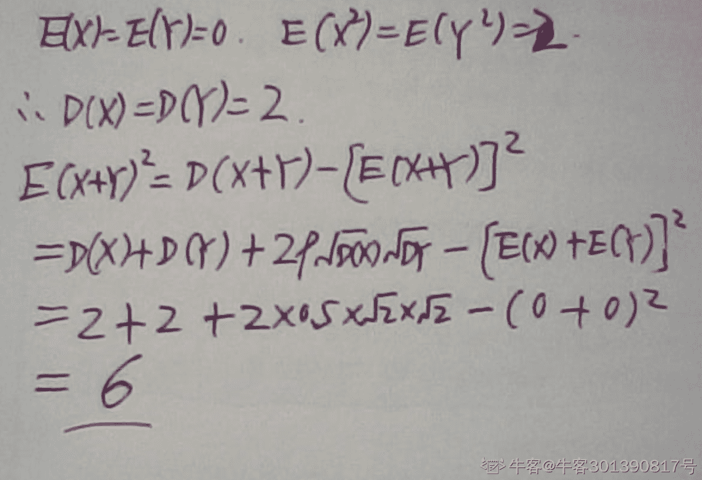
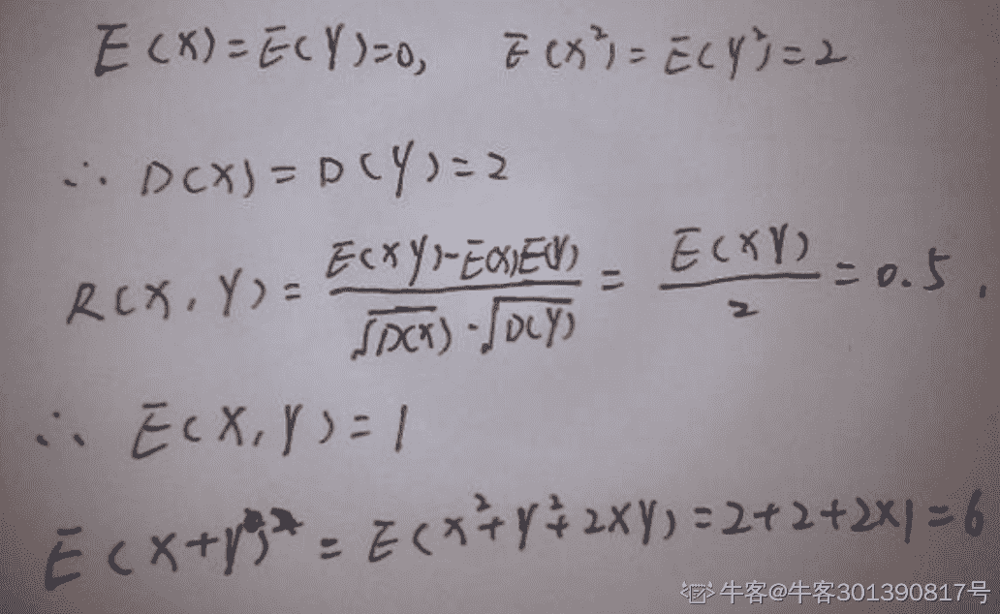

# 网易 2020 校招笔试- 数据分析师（考拉）提前批

## 1

x+y+z+m=10，其中 x,y,z,m 都是正整数，那么 x,y,z,m 有多少种不同的取值组合?

正确答案: A   你的答案: 空 (错误)

```cpp
84
```

```cpp
165
```

```cpp
220
```

```cpp
112
```

```cpp
64
```

本题知识点

数据分析师 网易 2020

讨论

[Raven_Lee](https://www.nowcoder.com/profile/96659304)

可以想象成插空问题。一共有 10 个小球排成一排，用 3 个挡板将其分成 4 份。由于 x,y,z,m 都是正整数，不能存在有 0 的情况，所以不可以将挡板放在小球的两端。那么可分的方法就是在 10 个小球形成的 9 个空位里任选 3 个位置插入挡板，C[9]³ =84。

发表于 2020-02-19 16:05:59

* * *

[我就是个弟弟 1](https://www.nowcoder.com/profile/91794472)

**求四个数之和，可以先求两个数之和**两个数和从 2 到 9 有多少个组合（两个正整数的和不可能为 1）x+y=2  有 1 个组合 x+y=3 有 2 个组合...x+y=8 有 7 个组合 x+y=9 有 8 个组合其实就是减一就行了 x+y=2，z+m=8 组合有 1*7=7 个 x+y=3，z+m=7 组合有 2*6=12 个 x+y=4，z+m=6 组合有 3*5=15 个**x+y=5，z+m=5 组合有 4*4=16 个（此处上下对称）**x+y=6，z+m=4 组合有 5*3=15 个 x+y=7，z+m=3 组合有 6*2=12 个 x+y=8，z+m=2 组合有 7*1=7 个
所以共(7+12+15)*2+16=84 个

编辑于 2019-12-02 21:34:08

* * *

[Dame、CX](https://www.nowcoder.com/profile/255407225)

python 写了个代码跑

```cpp
s = 0
for x in range(1,8,1):
    for y in range(1,9-x,1):
        for z in range(1,10-x-y,1):
            for m in range(1,11-x-y-z,1):
                if x+y+z+m == 10:
                    s = s+1
```

最后跑出结果 s=84 发表于 2021-07-28 16:39:37

* * *

## 2

有无限多水源，一个 4L 无刻度桶和一个 9L 无刻度桶，只利用这 2 个无刻度桶，将不可能获得 ____L 水。

正确答案: F   你的答案: 空 (错误)

```cpp
1
```

```cpp
3
```

```cpp
8
```

```cpp
7
```

```cpp
11
```

```cpp
所有选项均能获得
```

本题知识点

数据分析师 网易 2020

讨论

[Raven_Lee](https://www.nowcoder.com/profile/96659304)

1L ：9L 满桶倒 4L 空桶，9L 桶剩 5L, 5L 水倒 4L 空桶，9L 桶剩 1L 水。3L ：4L 水倒 9L 空桶倒 3 次，4L 桶还剩 3L 水。（4*3 - 9 = 3）8L ：2 个 4L 。7L ：3 + 1*4 。11L：3 + 2*4 。

发表于 2020-02-19 16:14:42

* * *

[拿 offer 吧](https://www.nowcoder.com/profile/477548067)

贝祖定理告诉我们，ax+by =z 有解当且仅当 z 是 x, y 的最大公约数的倍数。因此我们只需要找到 x, y 的最大公约数并判断 z 是否是它的倍数即可。在这题 4x+9y=z (z=1,3,8,7,11)

发表于 2020-04-06 14:23:09

* * *

[一行一个](https://www.nowcoder.com/profile/786941518)

这道题有 F 选项？？？emmmm

发表于 2020-09-04 22:47:54

* * *

## 3

有一堆石子，共 80 颗，甲，乙轮流从该堆中取石子，每次可以取 2,4 或者 6 颗，取得最后的石子的玩家为赢家，甲乙都足够聪明都想赢，若甲先取，则 ____。

正确答案: B   你的答案: 空 (错误)

```cpp
甲必胜
```

```cpp
乙必胜
```

```cpp
甲乙都是 50%几率获胜
```

```cpp
其他说法都不正确
```

本题知识点

数据分析师 网易 2020

讨论

[食屈米](https://www.nowcoder.com/profile/725102165)

首先 2，4，6 中甲任取一个，乙都可以取一个数组成 8，即每一轮甲加乙都可以等于 8 而 80%8 =0，即无论甲怎么取，在乙的控制下，甲每一个新循环面临的剩余数都是 8 的倍数！这样最后一轮甲面对的是剩下 8 个石头的石堆，它无论怎么取都不可能取完这 8 个石头，所以必定是乙取完剩余石头。此题属于简单的 Nim 问题。

发表于 2020-03-13 10:05:00

* * *

[我就是个弟弟 1](https://www.nowcoder.com/profile/91794472)

80 = 2 + 13*6 第一次取时，无论甲取多少，比如说 n，乙取 6-(n-2) = 8-n 个之后每次无论甲取多少个，比如说 m，乙取 6-m 个就可以了，特殊情况如果 m 为 6，乙也取 6 个。即乙取 6-m%6 个这样每次甲乙取的石子之和都是 6 的倍数，最后一定是乙取到最后一个。**这类问题都是拿总个数除以取得最大的个数，得到余数。****之后每两次甲乙取的数量之和等于最大的个数就行了，所以在确定了谁先取之后，已经确定了赢家了。**

编辑于 2019-12-02 21:14:46

* * *

[不能如期而至](https://www.nowcoder.com/profile/589050880)

这是个典型的递归问题：我们要逆向思考，为了抢到 80 ，我们必须抢到 72，因为抢到 72，无论对方取 2,4,6 的哪个，我都可直接到 80\. 为了抢 72，就必须抢 64，以此类推需要抢到 56、48、40、32、24、16、8 所以只要对方先取，我就可以赢。类似的问题还有：如果双方可以取 1,2 谁先到 20 谁赢的。

发表于 2020-11-14 18:37:00

* * *

## 4

设随机变量 X 和 Y 都服从正态分布,且它们不相关，则（ ）

正确答案: C   你的答案: 空 (错误)

```cpp
X 与 Y 一定独立
```

```cpp
(X, Y)服从二维正态分布
```

```cpp
X 与 Y 未必独立
```

```cpp
X + Y 服从一维正态分布
```

本题知识点

数据分析师 网易 2020

讨论

[野猪佩奇 24](https://www.nowcoder.com/profile/124728150)

独立一定不相关，不相关不一定独立。独立的充要条件 E(XY)=E(X)E(Y);不相关的充要条件ρ(XY)=(E(XY)-E(X)E(Y))/sqrt(D(X)*D(Y))

发表于 2020-04-09 17:30:02

* * *

[牛客 808407885 号](https://www.nowcoder.com/profile/808407885)

相关性是指两个随机变量之间的线性关系，不相关只是说明它们之间不具有线性关系，但是可以有别的关系，所以不一定相互独立。如果两个随机变量独立，就是说它们之间没有任何关系，自然也不会有线性关系，所以它们不相关。反过来说如果两个随机变量相关，也就是说它们之间有线性关系，自然不独立。来自：[`zhidao.baidu.com/question/876841558655230132.html`](https://zhidao.baidu.com/question/876841558655230132.html)

发表于 2020-08-03 17:37:34

* * *

## 5

若总体 X～N(µ,δ²),其中δ² 已知，当样本容量保持不变时，如果置信度减小，则的置信区间（ ）.

正确答案: B   你的答案: 空 (错误)

```cpp
长度变大
```

```cpp
长度变小
```

```cpp
长度不变
```

```cpp
都有可能
```

本题知识点

数据分析师 网易 2020

讨论

[一个面试都没有呜呜呜](https://www.nowcoder.com/profile/660821636)

此题答案应该为变小

发表于 2020-04-04 22:14:29

* * *

[颖子颖子小颖子](https://www.nowcoder.com/profile/301390817)

置信区间与置信水平、样本量等因素均有关系，其中[样本量](https://baike.baidu.com/item/%E6%A0%B7%E6%9C%AC%E9%87%8F)对置信区间的影响为：在[置信水平](https://baike.baidu.com/item/%E7%BD%AE%E4%BF%A1%E6%B0%B4%E5%B9%B3)固定的情况下，样本量越多，置信区间越窄。其次，在[样本量](https://baike.baidu.com/item/%E6%A0%B7%E6%9C%AC%E9%87%8F)相同的情况下，置信水平越高，置信区间越宽。

发表于 2020-02-16 12:23:04

* * *

[食屈米](https://www.nowcoder.com/profile/725102165)

样本量不变，置信度下降，则置信区间长度减少啊，。。。

发表于 2020-03-13 10:09:50

* * *

## 6

设随机变量 X 和 Y 的相关系数为 0.5，E(X) = E(Y) = 0, E(X²) = E(Y²) = 2, 则 E[(X +Y)²] = ( ).

正确答案: B   你的答案: 空 (错误)

```cpp
4
```

```cpp
6
```

```cpp
8
```

```cpp
2
```

本题知识点

数据分析师 网易 2020

讨论

[颖子颖子小颖子](https://www.nowcoder.com/profile/301390817)

题目应该给过了，第二个 E(X²) = E(Y²) = 2或者

发表于 2020-02-16 12:34:05

* * *

[牛客 456186772 号](https://www.nowcoder.com/profile/456186772)

考察相关系数，期望，方差，协方差的定义与简单性质，方差 DX=E(X-EX)²=E(X²)-(EX)²  （涉及到 EX 与 E(X)²）协方差 Cov(X,Y)=E[(X-EX)(Y-EY)]  可进一步分解相关系数 p=Cov(X,Y)/(sqrt(DX*DY))

编辑于 2020-02-17 22:33:31

* * *

[kkY_](https://www.nowcoder.com/profile/223655133)

[牛客 301390817 号](https://www.nowcoder.com/profile/301390817) 的第一个解决方法 应该是 E(X+Y)² = d(x+y) + [e(x+y)]²

发表于 2020-08-08 11:16:42

* * *

## 7

某电灯泡生产商声称，它们生产的电灯泡的平均使用时间为 85 小时。质检部门抽取 20 个电灯泡的随机样本，在的显著性水平下，检验结果是未能拒绝原假设，这意味着()

正确答案: D   你的答案: 空 (错误)

```cpp
该企业生产的电灯泡的平均使用时间是 85 小时
```

```cpp
该企业生产的电灯泡的平均使用时间不是 85 小时
```

```cpp
没有证据证明该企业生产的电灯泡的平均使用时间是 85 小时
```

```cpp
没有证据证明该企业生产的电灯泡的平均使用时间不是 85 小时
```

本题知识点

数据分析师 网易 2020

讨论

[蹦蹦糖](https://www.nowcoder.com/profile/102431135)

原假设为虚无假设：则 h0：该企业生产的电灯泡平均使用时间是 85 小时。那么无法拒绝 h0 假设，就是没办法证明该企业生产的电灯泡平均使用时间不是 85 小时。

发表于 2020-05-29 11:32:15

* * *

## 8

如下哪些 sql 语句能查询出每门课都都大于 80 分的学生姓名,部分数据如下表(student_score)所示,

| stu_no | stu_name | sub_no | sub_name | score |
| 1 | 张三 | 001 | 语文 | 90 |
| 1 | 张三 | 002 | 数学 | 60 |
| 2 | 李四 | 001 | 语文 | 89 |
| 2 | 李四 | 002 | 数学 | 86 |

正确答案: A   你的答案: 空 (错误)

```cpp
select distinct stu_name from student_score where stu_name not in (select distinct stu_name from student_score where score <= 80)
```

```cpp
select stu_name from student_score group by stu_name having min(score) > 80
```

```cpp
select distinct stu_name from student_score where score > 80
```

```cpp
select stu_name from student_score group by sub_name having min(score) > 80
```

本题知识点

数据分析师 网易 2020

讨论

[一个面试都没有呜呜呜](https://www.nowcoder.com/profile/660821636)

此题答案应为 A.B 

发表于 2020-04-04 22:12:20

* * *

[田竣仁 1997](https://www.nowcoder.com/profile/936128561)

对于选项 B，如果有同名的人，明明他成绩都在 80 以上，却在 group by stu_name 时，因为另一个同名的人其中一门分数低于 80，被 group by stu_name having min(score) > 80 这个语句筛选出去了。但其实应该有他名字。（这个解释是我猜的）

发表于 2021-03-27 10:37:49

* * *

[suo_li](https://www.nowcoder.com/profile/707593730)

自己建了个表，A、B 都是对的

发表于 2021-02-10 21:13:58

* * *

## 9

以下不是稳定的排序算法的是（）

正确答案: C   你的答案: 空 (错误)

```cpp
冒泡排序
```

```cpp
插入排序
```

```cpp
快速排序
```

```cpp
归并排序
```

本题知识点

数据分析师 网易 2020

讨论

[大橙子啾啾啾](https://www.nowcoder.com/profile/138016546)

BC

发表于 2019-12-17 21:36:25

* * *

[田竣仁 1997](https://www.nowcoder.com/profile/936128561)

稳定算法是指：如果待排序的序列中存在值相等的元素，经过排序之后，相等元素之间原有的先后顺序不变。在快排中，采用了二分的思想，当相同元素被选为划分点，有可能因为＞还是≥存在顺序改变。

发表于 2021-03-27 10:43:11

* * *

[To0z3](https://www.nowcoder.com/profile/965712617)

A

发表于 2020-07-31 19:40:45

* * *

## 10

一个盒子中有三个大小相同的球，这三个球可能是红和蓝两种颜色，并且一个球是红的还是蓝的是等可能的。已知其中有一个是红色的，那么至少有一个球是蓝色的概率是多少（ ）

正确答案: C   你的答案: 空 (错误)

```cpp
7/8
```

```cpp
3/4
```

```cpp
6/7
```

```cpp
1/3
```

本题知识点

数据分析师 网易 2020

讨论

[颖子颖子小颖子](https://www.nowcoder.com/profile/301390817)

总共 8 种组合方法，其中一个为红色则除去三个蓝色，还剩 7 种，那么至少有一个为蓝色话，7 种种有 6 种都可以（除去三个红色），所以为 6/7

发表于 2020-02-16 18:57:13

* * *

[我就是个弟弟 1](https://www.nowcoder.com/profile/91794472)

主要是条件概率**有一个是红色**可以理解为**至少有一个为红色**，概率 P(A)为
至少有一个球为红色，且另外两个球至少有一个为蓝色的概率 P(AB)是所以在至少有一个为红色的前提下，另外两个球至少有一个为蓝色的条件概率 P(B|A) 是

编辑于 2020-04-19 22:41:26

* * *

[冯吃吃呀](https://www.nowcoder.com/profile/976546407)

这里解释一下，在一个盒子里面，如果区分顺序和不区分顺序的解题思路应该是怎么样的，看到有小姐妹有疑惑。（1）如果**区分顺序**，这里就很好理解了。总共有八种情况，分别为：（红红红）、（红红蓝）、（红蓝红）、（蓝红红）、（蓝蓝红）、（蓝红蓝）、（红蓝蓝）、（蓝蓝蓝）；每一种情况的概率都是均等的 1/8。
因此，没有红色的概率为 1/8，只有一个红色的概率为：3/8，只有两个红色的概率为 3/8，有三个红色的概率为 1/8。（2）如果**不区分顺序**一共有四种情况，分别为 红红红、红红蓝、红蓝蓝、蓝蓝蓝。计算过程应该为：**红蓝蓝**： 解释：从三个位置里面挑选一个位置放置红色，另外两个位置放置蓝色，1/2 是红色的概率；同理：蓝红红的计算也是如此；**红红红**：解释：从三个位置里面挑选三个位置放置红色，1/2 是红色的概率；同理：蓝蓝蓝红的计算也是如此接下来可以用条件概率的方法去计算。解题里有，我就不赘述了。

编辑于 2020-04-02 15:28:51

* * *

## 11

在 10 件产品中有五件是残次品，从中任取五件，求其中至少有两件是残次品的概率( )

正确答案: B   你的答案: 空 (错误)

```cpp
4/5
```

```cpp
113/126
```

```cpp
105/126
```

```cpp
1/12
```

本题知识点

数据分析师 网易 2020

讨论

[加油牛牛](https://www.nowcoder.com/profile/39638914)

请问为什么不能用二项分布来理解？

发表于 2020-08-08 11:05:16

* * *

[1584807567](https://www.nowcoder.com/profile/552018906)

反向求，至少两个的反面”至多一个“（0 个残次、没有残次）1 - （C5 1 * C5 4 + C5 5）/ C10 5 = 113/126

发表于 2019-12-20 21:22:42

* * *

[aruruff](https://www.nowcoder.com/profile/509544345)

1-（C5 1*C5 4+C5 5）/C10 5

发表于 2019-12-11 11:37:29

* * *

## 12

小明在玩掷骰子的游戏，将一颗骰子掷了两次，两次骰子的点数之和为 7，求其中一次掷到 6 点的概率 ( )

正确答案: D   你的答案: 空 (错误)

```cpp
1/6
```

```cpp
1/18
```

```cpp
1/12
```

```cpp
1/3
```

本题知识点

数据分析师 网易 2020

讨论

[木木姐](https://www.nowcoder.com/profile/46765056)

将 7 想象成一排七棵树，七棵树之间有 6 个空，随便找一个空将树切成两排有 6 种切法，切成其中有一排有六棵树的有两种，故 2/6=1/3.

发表于 2020-03-21 11:16:51

* * *

[是要成为 datascientist 的人](https://www.nowcoder.com/profile/77963746)

扔 2 次骰子点数之和为 7 的可能组合是 2+5， 3+4， 1+6，且这三种情况各有 2 种搭配的可能，所以一共 6 种可能（因为两次的位置可以交换）其中 6+1 的可能有 2 种，所以是 2/6=1/3

发表于 2020-06-19 11:25:58

* * *

[黑衣骑士 naruto](https://www.nowcoder.com/profile/790752147)

1 2 3 4 5 6，要满足和为 7，需要 1-6，2-5，3-4，要出现 6，则为 3 种情况种的 1 种，所以是 1/3。不知道对不对~~~

发表于 2020-03-14 17:03:24

* * *

## 13

在 5 张卡片上按顺序写上 laval 这五个字母，并依次放入 5 个盒中，有人从中任意取出两张卡片使用，但是在放回时，忘记了两张卡片各自的位置，求此人将卡片随意放回两个空盒子后卡片顺序仍为 laval 的概率 ( )

正确答案: A   你的答案: 空 (错误)

```cpp
3/5
```

```cpp
1/2
```

```cpp
1/5
```

```cpp
2/5
```

本题知识点

数据分析师 网易 2020

讨论

[我就是个弟弟 1](https://www.nowcoder.com/profile/91794472)

取两个卡片可能会出现种情况因为 a 和 l 都出现了两次，所以其中有两种情况取出的字母是相同的，此时顺序仍为 laval 的概率均为 1；其他 8 种情况两个字母不同，概率均为 0.5 所以为

发表于 2019-12-02 22:12:00

* * *

[牛客 615700769 号](https://www.nowcoder.com/profile/615700769)

如果选的两个相同字母，不管怎么放都行。如果选到不同字母，有 1/2 的几率能和原理顺序一样。所以总体来看，放回还能保持原来顺序的概率必然大于 1/2，直接选 A

发表于 2020-04-05 22:57:22

* * *

[FairyTale⚖](https://www.nowcoder.com/profile/367082209)

哇，这个题我想多了，我以为取出来两个卡片后，往回放的时候，不知道放在五个位置中的哪两个。算了半天。其实是，知道是哪两个位置时空的，而不知道这两个位置上应该怎么放。好吧，别骂我。楼下说得很好

发表于 2020-03-04 16:11:56

* * *

## 14

以下是泊松分布概率密度函数的是

正确答案: B   你的答案: 空 (错误)

本题知识点

数据分析师 网易 算法工程师 2020

讨论

[流浪者 201907280945510](https://www.nowcoder.com/profile/60649645)

其中 A 是伯努利分布， B 是泊松分布，D 是均匀分布

发表于 2020-02-17 09:56:38

* * *

[牛客 745266709 号](https://www.nowcoder.com/profile/745266709)

C 是指数分布密度函数

发表于 2020-08-08 02:00:24

* * *

[小甘 0821](https://www.nowcoder.com/profile/335247139)

泊松分布作为 discrete variable distribution,根本没有密度函数啊，这样的说法太不严谨了

发表于 2020-03-08 07:25:05

* * *

## 15

访问记录 visit 表中包含日期 date,用户 user_id,访问的页面 url 3 个字段，以下哪个选项不能计算'2019-03-11'这一天访问过页面的所有用户数

正确答案: D   你的答案: 空 (错误)

```cpp
SELECT count(user_id) FROM (SELECT user_id FROM visit WHERE date = '2019-03-11'  GROUP BY user_id) f
```

```cpp
SELECT count(user_id) FROM (SELECT DISTINCT user_id FROM visit WHERE date = '2019-03-11') f
```

```cpp
SELECT count(DISTINCT user_id) FROM visit WHERE date = '2019-03-11'
```

```cpp
SELECT count(user_id) FROM visit WHERE date = '2019-03-11' GROUP BY date
```

本题知识点

iOS 工程师 网易 安卓工程师 C++工程师 Java 工程师 测试工程师 测试开发工程师 大数据开发工程师 数据分析师 数据库工程师 2020

讨论

[vicyor](https://www.nowcoder.com/profile/2210832)

D . SELECT count(user_id) FROM visit WHERE date = '2019-03-11' GROUP BY date    问题: 1.user_id 未去重             2.已经通过 where 选出 date 了,group by 无意义.修改: SELECT count(user_id) FROM visit WHERE date = '2019-03-11' GROUP BY user_id

发表于 2020-02-17 16:47:43

* * *

[牛客 656547734 号](https://www.nowcoder.com/profile/656547734)

选项 A 

```cpp
SELECT count(user_id) FROM (SELECT user_id FROM visit WHERE date = '2019-03-11'  GROUP BY user_id) fK
我选这个了，这个的确无法直接得到结果，但是题目问的是无法计算，这个结果通过人工计算还是可以计算出最终结果的，我觉得迷惑性的确很大。
```

发表于 2020-04-25 16:41:28

* * *

[aruruff](https://www.nowcoder.com/profile/509544345)

```cpp
除重归纳用户 id 为表 f 再计算 A   SELECT count(user_id) FROM (SELECT user_id FROM visit WHERE date = '2019-03-11'  GROUP BY user_id) f
```

  B    SELECT count(user_id) FROM (SELECT DISTINCT user_id FROM visit WHERE date = '2019-03-11') f
C 简单的用除重函数
D

```cpp
 GROUP BY 日期再

```
WHERE 日期 nono
```cpp

```

```cpp
WHERE date = '2019-03-11' GROUP BY date  
```

发表于 2019-12-11 11:58:15

* * *

## 16

网易考拉一直关注用户的体验，并且个性化关注每个用户的需求；请问：如果你作为数据分析师，将如何对用户进行分层，起到提升用户体验的作用。请写出你的思路。

你的答案

本题知识点

数据分析师 网易 2020

讨论

[Echo_Kang](https://www.nowcoder.com/profile/770748564)

1.用户分层是根据用户不同的消费倾向和消费偏好，针对性的提供营销和服务，以极化用户价值。在具体的场景中，应该根据具体的业务需求、有针对性地做分层，是一个带着问题寻找答案的过程。在本题中，用户分层的目的是，个性化的关注每个用户的需求，提升用户体验，进而提升网易考拉的流水。2.用户行为中的冲突（比如强烈的下单需求 VS 未下单）反映了用户的需求，那么针对用户购物模式分层就可以起到对症下药的效果。用户获得了好的购物体验、买到了心仪的商品，商家获得了利润，平台流水也提升了，这是用户分层的目标所在。分层指标如下（括号内的为冲突）：① 客单≥500，购买频次大于 10，近九十天未访（忠实用户 VS 流失） ②进三十天购买频次≥3，近 7 天未访问（近期购买旺盛 VS 活跃下降） ③近 7 天访问频次≥5，近 7 天未购买（强烈的下单需求 VS 未下单） ④高单价又常常买的活跃用户（维持优质用户，避免流失）3.或者可以根据用户画像进行分层。目的是给用户个性化的购物页面，根据用户画像智能推荐用户感兴趣的购物品类，推荐满足用户需求或者符合用户审美的商品可以提高用户满意度，进而提高平台流水。比如根据用户的年龄、性别、职业、地区、最常购物商品、浏览次数最多的商品等特征，运用 K-means 聚类方法给用户进行分类。可以使用 R 语言进行 K-means 聚类。首先要导入 fpc 库为计算轮廓系数做准备，然后用 apply()进行迭代把枚举的 K 值的轮廓系数分别计算出来，取轮廓系数平均值最大时的 K 值；然后使用 kmeans()函数聚类，用 plot()作图。

发表于 2020-04-01 21:13:27

* * *

[数据小宅宅求 offer](https://www.nowcoder.com/profile/104699648)

首先，结合年龄、性别、城市等用户属性特征，用户消费等级、会员积分、购买品类的用户行为特征，两大维度、六个特征来细分用户画像，进行用户分层 1.按用户年平 GMV 划分用户消费等级，需要得到总体用户年 GMV 的分布直方图 2.用户年订单中各品类交易总额、交易订单数量、收藏物品、购物车看出用户的购物喜好及品类支出占比，如母婴用品、早教、书籍、美妆护肤类、服饰鞋包类、零食日用类、电子产品等品类，横向比较用户自身各个品类的消费占比，纵向比较该用户在该品类的支出占总体该品类消费的水平（偏好平价类或中高端产品）3.构造用户层级划分模型，用多项回归模型，用户层级=各个品类的消费品级乘以权重（权重取决于当年网易考拉的各品类营业额占比 )+年 GMV 常数等级最后，得到用户的消费层级，根据消费层级推送相应低、中、高端的商品；根据用户各个品类的消费占比，优先推荐占比大的品类。

发表于 2020-08-20 21:55:26

* * *

[ph0enix1](https://www.nowcoder.com/profile/76831400)

1、按年龄段分；利于产品类目设置；2、按使用时长分，设置奖励推广；3、按消费能力分，选择不同的购物形式，省钱，会员制；4、按性别分，推荐不同的产品信息；5、针对特定人群进行分类，比如美妆、婴儿、运动、数码、保健等；

发表于 2020-03-04 13:23:06

* * *

## 17

小易有一个初始为空的数字集合，支持两种操作：
1、加入数字 x 到集合中。
2、询问集合中是否存在一个子集，满足子集中所有数字的 Or 值恰好为 k。Or 为二进制按位或操作，C++中表示为"|"。
小易希望你能解决这个问题。

本题知识点

iOS 工程师 网易 安卓工程师 C++工程师 Java 工程师 安全工程师 测试工程师 大数据开发工程师 数据分析师 2020

讨论

[dragonlogin](https://www.nowcoder.com/profile/2071677)

思路

难点就是：怎么在一个集合 a 中判断是否存在一个子集，使得子集中所有元素 或运算后的结果为 x

*   暴力想法
    找到集合 a 中的所有子集，然后一一判断是否满足条件。
    子集个数一共有 2^n,n 为集合元素个数。所以肯定超时

*   优化
    有没有可能遍历一遍集合，就可以完成。
    假设元素 x 的二进制为 100100101
    如果存在 a1 | a2 | a3 | 。。。 | an = x
    根据 | 的特点，
    0 | 0 = 0,
    1 | 0 = 1,
    0 | 1 = 1,
    1 | 1 = 1
    如果我 x 的倒数第二位是 0，那么 a1, a2,…,an 的倒数第二位肯定不能为 1
    所以，需要满足 a1 | x = x, a2 | x = x,可以用反证法证明。

```cpp
#include <bits/stdc++.h>
using namespace std;
const int N = 100010;
bool st[N];
int q, o, x;

int main() {
    scanf("%d", &q);
    vector<int> a;
    while (q --) {
        scanf("%d%d", &o, &x);
        if (o == 1) {
            if (st[x] == false)
                a.push_back(x);
                st[x] = true;
        }
        else {
            int y = 0;
            for (int v : a) {
                if ((v | x) == x)
                    y |= v;
            }

            if (y == x) {
                printf("YES\n");
            }
            else {
                printf("NO\n");
            }
        }
    }
    return 0;
}

```

发表于 2020-07-30 18:20:07

* * *

[Fzldq](https://www.nowcoder.com/profile/209755777)

```cpp
import sys

def main():

    def exist(x):
        y = 0
        for i in lst:
            if i | x == x:
                y |= i
                if x == y:
                    return True
        else:
            return False

    lst = set()
    res = []
    q = int(sys.stdin.readline().strip())
    m = map(int, sys.stdin.read().split())
    xlst = list(zip(m, m))
    for i, j in xlst:
        if i == 1:
            lst.add(j)
        else:
            res += ['YES' if exist(j) else 'NO']
    print(*res, sep='\n')

if __name__ == '__main__':
    main()
```

Python 玩这种题就是亏，只能过 60%

编辑于 2020-07-20 15:51:08

* * *

[帽子短了](https://www.nowcoder.com/profile/571009756)

```cpp
#include <iostream>
#include <string>
#include <vector>
using namespace std;
bool isexist(vector<int> temp,int x)
{
	int y = 0;
	for (int i = 0; i < temp.size(); i++)
	{
		if ((x | temp[i]) == x)
			y = y | temp[i];
	}
	return x == y;
}
int main()
{
	int n;
	cin >> n;
	vector<int> temp;
	while (n--)
	{
		int a, x;
		cin >> a >> x;
		if (a == 1)
			temp.push_back(x);
		else
		{
			if (isexist(temp, x))
				cout << "YES" << endl;
			else
				cout << "NO" << endl;
		}	
	}
	system("pause");
	return 0;
}
```

发表于 2020-06-17 19:47:52

* * *

## 18

小易给定了一个长度为 n 的数字序列，对于每一个，小易希望能求解出所有长度为 k 的连续子序列的最大值中的最小值。

本题知识点

安卓工程师 网易 C++工程师 Java 工程师 安全工程师 测试工程师 大数据开发工程师 前端工程师 算法工程师 数据分析师 2020

讨论

[牛客 188000430 号](https://www.nowcoder.com/profile/188000430)

```cpp
def mininmax(nums):
    dp=[]
    for i in range(len(nums)-1):
        dp.append(max(nums[i],nums[i+1]))
    return dp
n=int(input())
nums=list(map(int,input().split()))
res=[]
while nums:
    res.append(min(nums))
    nums=mininmax(nums)
print(" ".join(str(i) for i in res))
```

60%,还有更好的方法嘛！

发表于 2020-06-30 17:36:53

* * *

[鹿鸣松](https://www.nowcoder.com/profile/646250553)

我用的是 python3.8 ```cpp
def myfunction(n,s):
    s=s.split(' ')
    s=list(map(int,s))
    count_list=[]
    for k in range(1,n+1):
        temp_list=[]
        for i in range(n):
            if i+k<=n:
                temp_list.append(max(s[i:i+k]))
        count_list.append(min(temp_list))
    return count_list

print(myfunction(6,'1 3 2 4 6 5'))
```

这个在我自己 pycharm 上跑通了（包括那个 100 的元素的例子），但是在这上面没有，我一开始的输入是直接用列表的，我以为这个有问题，就换成 string 转 int 型列表，但还是不行，难道是 n 他没给我？whatever🙄
我的思路是用两个空列表分别取承接第一个循环下来的最大值列表和第二个循环下来的最小值列表，值得注意的是当取列表的长度不满足大小为 k 的时候，是需要跳出循环或者不加最大值计算的，不然后面会出一些奇怪的结果。核心是两个 for 循环，其他没什么。写解析的时候看了下评论区，嗯，python 真好用🙃

发表于 2020-12-22 22:23:42

* * *

[Pauline677](https://www.nowcoder.com/profile/897067998)

请问用 R 的小伙伴吗？我的结果一摸一样，一直显示格式错误。cat 的'\n'，'\b'都试过还是不行

```cpp
inputs = readLines("stdin")
n = as.numeric(inputs[1])
seq = as.numeric(unlist(strsplit(inputs[2]," ",fixed = T)))

check = function(start,k,n) { # k <= n-start+1
  if (k<=n-start+1) {
    x = rep(NA,n-k-start+2)
    for (i in start:(n-k+1)){
      x[i-start+1] = max(seq[i:(i+k-1)])
    }
    return(min(x))
  } else {
    return(NA)
  }
}

for (k in 1:n){
  x = rep(NA,n)
  for (i in 1:n) {
    x[i] = check(i,k,n)
  }
  cat(min(x,na.rm =T),'\b')
}
```

发表于 2020-08-07 17:16:00

* * *