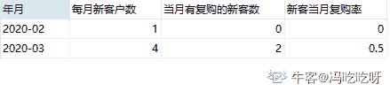

# 网易 2020 校招笔试- 数据分析师（正式批）

## 1

以下关于主成分分析说法错误的是

正确答案: C   你的答案: 空 (错误)

```cpp
PCA 可以用来降维处理
```

```cpp
PCA 可以通过 SVD 来实现
```

```cpp
PCA 实现线性组合最小化样本方差
```

```cpp
PCA 可以通过特征值分解来实现
```

本题知识点

数据分析师 网易 2020

讨论

[千钰丶](https://www.nowcoder.com/profile/620190159)

C 错，PCA 把原先的 n 个特征用数目更少的 k 个特征取代，新特征是旧特征的线性组合，这些线性组合最大化样本方差，尽量使新的 k 个特征互不相关。

发表于 2020-04-02 15:29:15

* * *

## 2

2 个盒子被小牛分别放入中有两个大小相同的球，这两个球只可能是红和蓝两种颜色，并且一个球是红的还是蓝的是等可能的。小牛让小客来猜盒子里球的颜色分别是什么样颜色。在小客猜的过程中，小牛告诉小客其中一个是盒子里面是红色的小球，那么另一个盒子里球还是红色的概率是多少（ ）

正确答案: A   你的答案: 空 (错误)

```cpp
1/3
```

```cpp
1/2
```

```cpp
1/6
```

```cpp
1/4
```

本题知识点

算法工程师 网易 数据分析师 2020

讨论

[小明同学。](https://www.nowcoder.com/profile/313041855)

这题咋读的这么费劲啊。语言描述准确一点呀，要不是做过类似的，我都不知道这题在说啥。

发表于 2020-03-05 00:02:16

* * *

[阳光脆薄如纸](https://www.nowcoder.com/profile/904336422)

样本空间为 红红、蓝蓝、红蓝、蓝红。告诉一个红球后，排除蓝蓝。

发表于 2019-11-28 15:46:31

* * *

[PKU_xiaowei](https://www.nowcoder.com/profile/291394677)

研表究明,汉字的序顺并不定一能影阅响读这是因为人一次并不是只读取一个汉字

发表于 2020-08-08 11:08:54

* * *

## 3


正确答案: C   你的答案: 空 (错误)

```cpp
0.5
```

```cpp
1
```

```cpp
1.5
```

```cpp
2
```

```cpp
0
```

本题知识点

数据分析师 网易 2020

讨论

[暴躁牛友](https://www.nowcoder.com/profile/3525832)

令，则.

.


发表于 2020-01-29 15:56:24

* * *

[小夭想找工作](https://www.nowcoder.com/profile/512274239)

就是换元法  推出 f 解析式的时候 不要忘记不定积分+c  就应该没什么问题

发表于 2020-04-06 16:51:36

* * *

[Maple_2005](https://www.nowcoder.com/profile/203246634)

我头一次见计算题还有不定项的

发表于 2020-06-02 13:16:08

* * *

## 4

数据结构中，沿着某条搜索路线，依次对树中每个结点均做一次且仅做一次访问。对二叉树的结点从 1 开始进行连续编号，要求每个结点的编号大于其左、右孩子的编号，同一结点的左右孩子中，其左孩子的编号小于其右孩子的编号，可采用（  ）次序的遍历实现编号。

正确答案: C   你的答案: 空 (错误)

```cpp
先序
```

```cpp
中序
```

```cpp
后序
```

```cpp
从根开始按层次遍历
```

本题知识点

C++工程师 网易 iOS 工程师 Java 工程师 测试工程师 测试开发工程师 大数据开发工程师 算法工程师 前端工程师 数据分析师 安卓工程师 安全工程师 运维工程师 2020

讨论

[繁华落尽君辞去](https://www.nowcoder.com/profile/569656804)

先序 根左右中序 左根右后序 左右根

发表于 2019-12-03 21:47:17

* * *

[MV13eard](https://www.nowcoder.com/profile/863005403)

这题要理解题意：对二叉树的结点从 1 开始进行连续编号，意思就是把 1，2，3，4....这些数按从小到大的顺序依次放到二叉树中，并要求的放法是：左孩子<右孩子<根节点；这时候再看三种次序的遍历，先序 根左右中序 左根右后序 左右根，很显然，只有后序满足条件。

发表于 2020-03-03 11:21:25

* * *

[依昂](https://www.nowcoder.com/profile/920832473)

是我的理解有问题吗，题目中说的是每个结点的编号大于其左、右孩子的编号，这个的意思难道不是根的节点编号都要大于左右孩子的编号吗

发表于 2020-09-11 14:13:24

* * *

## 5

现在假设 F 是一个森林，B 是由 F 转换得到的二叉树，F 中有 n 个非终端结点，B 中右指针域为空的结点有（    ）个?

正确答案: A   你的答案: 空 (错误)

```cpp
N+1
```

```cpp
N-1
```

```cpp
N+2
```

```cpp
N
```

本题知识点

Java 工程师 C++工程师 网易 数据分析师 算法工程师 2020

讨论

[冯吃吃呀](https://www.nowcoder.com/profile/976546407)

根据森林转换为二叉树的“**左孩子右兄弟**”的表示法，即对于每棵二叉树，每个结点的**右指针**指向其**右邻兄弟。**针对每一个非终端结点，一定会**有且仅有一个**孩子结点没有右邻兄弟，即右指针领域为空。因此 N 个非终端结点，就有 N 个右指针域为空。看完单棵二叉树，再来看这些二叉树是怎么连接成一棵二叉树的。原理是：将后一棵二叉树的**根节点**作为前一棵二叉树的**右孩子**连接起来，所以只有最后一棵二叉树的根结点没有右孩子，即右指针域为空。因此综上：***N***个非终端结点，就有***(******N+1)***个结点的右指针域为空。

编辑于 2020-04-03 21:01:04

* * *

[PKU_xiaowei](https://www.nowcoder.com/profile/291394677)

举个例子：

```cpp
   1
 /   \
2     3
```

发表于 2020-04-11 15:58:39

* * *

## 6

现在假设对 N 个元素的链表做顺序查找时，若查找每个元素的概率相同，则平均查找长度为（   ）？

正确答案: A   你的答案: 空 (错误)

```cpp
(N+l)/2
```

```cpp
N/2
```

```cpp
N
```

```cpp
[(1+N)*N]／2
```

本题知识点

安卓工程师 网易 C++工程师 iOS 工程师 Java 工程师 测试工程师 测试开发工程师 大数据开发工程师 算法工程师 前端工程师 数据分析师 安全工程师 运维工程师 2020

讨论

[L201710091511469](https://www.nowcoder.com/profile/1515815)

第一个数的比较次数为 1，第二个数的比较次数为 2。。。以此类推第 N 个数的比较次数为 N，所以总的比较次数为 1+2+...+N=N(N+1)/2,平均比较次数为(N+1)/2,也即平均查找长度。

发表于 2019-12-19 17:26:33

* * *

[阳光脆薄如纸](https://www.nowcoder.com/profile/904336422)

总长度 n(n+1)/2 除以总个数 n

发表于 2019-11-28 15:57:51

* * *

[零葬](https://www.nowcoder.com/profile/75718849)

第一个数的比较次数为 1，概率为 1/N；第二个数的比较次数为 2，概率为 1/N……以此类推第 N 个数的比较次数为 N，概率为 1/N。数学期望为：1/N*1 + 1/N*2 + ... 1/N*(N-1) + 1/N*N = 1/N*(1+2+...+N-1+N) = 1/N*(N+1)*N/2 = (N+1)/2

发表于 2020-10-21 15:09:53

* * *

## 7

完全二叉树是指深度为 K 的，有 n 个结点的二叉树，当且仅当其每一个结点都与深度为 K 的满二叉树中编号从 1 至 n 的结点一 一对应将一棵有 50 个结点的完全二叉树按节点编号，如根节点的编号为 1，那么编号为 25 的结点是（    ）？

正确答案: B   你的答案: 空 (错误)

```cpp
无左、右孩子
```

```cpp
有左孩子，无右孩子
```

```cpp
有右孩子，无左孩子
```

```cpp
有左、右孩子
```

本题知识点

Java 工程师 网易 C++工程师 算法工程师 数据分析师 iOS 工程师 安卓工程师 安全工程师 2020

讨论

[change201810181615924](https://www.nowcoder.com/profile/349349644)

题上说了是完全二叉树，而且与深度为 K 的满二叉树中编号从 1 至 n 的结点一 一对应，说明满足每层从左到右都是按编号顺序排列的，**根节点的编号为 1****，**对于编号为 M 的结点，其左孩子编号为 2M , 右孩子编号为 2M+1。M=25 代入，发现选 B

发表于 2020-01-13 09:43:08

* * *

[Lucval](https://www.nowcoder.com/profile/300108835)

（1）顺序存储：将二叉树从上至下、从左至右地存储进数组中。（2）当数组的下标从 0 开始时，如果某个节点在数组中所在位置的下标为 n，则其左子节点在数组中的位置下标为 2n+1，其右子节点在数组中的位置下标为 2n+2，其父节点在数组中位置的下标为(n-1)/2；（3）题目中给出某个节点在数组中的下标为 25，按正常来说，其左子节点在数组中的下标将为 51，右子节点在数组中的下标为 52，即该节点没有左右子节点；但是题目中又告知，数组下标是从 1 开始的，因此，刚好能有一个左子节点，但无右子节点

发表于 2020-07-24 15:45:38

* * *

[若白 201903062322772](https://www.nowcoder.com/profile/427833125)

画出来，一个个数

发表于 2019-12-06 11:36:50

* * *

## 8

假设有选课表 course_relation(student_id, course_id)，其中 student_id 表示学号，course_id 表示课程编号，如果小易现在想获取每个学生所选课程的个数信息，请问如下的 sql 语句正确的是（ ）

正确答案: D   你的答案: 空 (错误)

```cpp
select student_id, sum(course_id) from course_relation;
```

```cpp
select student_id, sum(course_id) from lcourse_relation group by student_id;
```

```cpp
select student_id, count(course_id) from course_relation;
```

```cpp
select student_id, count(course_id) from course_relation group by student_id;
```

本题知识点

SQL 数据分析师 牛客 2021 数据库

讨论

[MapleAndJoker](https://www.nowcoder.com/profile/310356190)

求和用累加 sum(),求行的个数用累计 count()。（复制粘贴的）

发表于 2020-02-25 19:24:05

* * *

[筱妉儿](https://www.nowcoder.com/profile/5411729)

group by 更多的起到了同类对应求和，不加的话只会机械式的把所有的求和，对数据的查询提取无法实现。

发表于 2021-07-15 16:28:45

* * *

[Lucval](https://www.nowcoder.com/profile/300108835)

要注意区分 sum()和 count()的用法区别。假如有有三门课程及其编号：语文-A，数学-B，英语-C 而 sum(course_id)=A+B+C，并非题目所求 

发表于 2020-07-24 15:48:29

* * *

## 9

城市 A 当前剩余的车牌号为 70000-99999 之间，假设不能有两个相同的数字，那么剩余车牌号有(  )个.

正确答案: B   你的答案: 空 (错误)

```cpp
9056
```

```cpp
9072
```

```cpp
9080
```

```cpp
9094
```

本题知识点

数据分析师 网易 2020

讨论

[牛客 210264894 号](https://www.nowcoder.com/profile/210264894)

这道题其实最简单的解法是第一位为 7 或 8 或 9，所以知道这个数值一定是 3 的倍数，排除法秒选。

发表于 2020-04-01 17:37:40

* * *

[小夭想找工作](https://www.nowcoder.com/profile/512274239)

总共有五个数字，分为五步完成：第一个数字只有三种选法：7,8,9   c31 第二个数字在保证与第一个数字不重复的情况下有九种选法：0  1 2 3 4 5 6 7 8 9 （7,8,9 只能三选一）  c91 以此类推,得出：c31*c91*c81*c71*c61

发表于 2020-04-06 17:13:00

* * *

[_ 猪猪猪八戒](https://www.nowcoder.com/profile/8046431)

A(4,9)*3

发表于 2020-04-06 11:21:43

* * *

## 10

15 个阶梯，你一次可以上一阶或两阶，走上去，共有多少种走法？

正确答案: B   你的答案: 空 (错误)

```cpp
967
```

```cpp
987
```

```cpp
1007
```

```cpp
1027
```

本题知识点

数据分析师 网易 2020

讨论

[Carmen_Leung](https://www.nowcoder.com/profile/434494195)

 | 走 1 个阶梯的次数 | 走 2 个阶梯的次数 | 总次数 | 走法（总次数中，挑 k 次走 2 个阶梯） |
| 15 | 0 | 15 | 1 种 |
| 13 | 1 | 14 | C(14,1) |
| 11 | 2 | 13 | C(13,2) |
| 9 | 3 | 12 | C(12,3) |
| 7 | 4 | 11 | C(11,4)     |
| 5 | 5 | 10 | C(10,5) |
| 3 | 6  | 9 | C(9,6) |
| 1 | 7 | 8 | C(8,7) |

走法全部相加=987

发表于 2020-04-17 18:48:02

* * *

[牛客 864358559 号](https://www.nowcoder.com/profile/864358559)

一个阶梯    1    种走法；二个阶梯    2    种走法；三个阶梯    3    种走法；四个阶梯    5    种走法；五个阶梯    8    种走法；。。。。。。。。。斐波拉西数列。即 n 个阶梯就是 n-1 个阶梯和 n-2 个阶梯的走法和。

发表于 2019-12-09 17:27:33

* * *

[零葬](https://www.nowcoder.com/profile/75718849)

f(n) = f(n - 1) + f(n - 2)，且 f(1) = 1，f(2) = 2

发表于 2020-12-21 18:10:37

* * *

## 11

用户分析是电商数据分析中重要的模块，在对用户特征深度理解和用户需求充分挖掘基础上，进行全生命周期的运营管理（拉新—>活跃—>留存—>价值提升—>忠诚），请尝试回答以下 3 个问题：

① 现在数据库中有一张用户交易表 order，其中有 userid（用户 ID）、orderid（订单 ID）、amount（订单金额）、paytime（支付时间），请写出对应的 SQL 语句，查出每个月的新客数（新客指在严选首次支付的用户），当月有复购的新客数，新客当月复购率（公式=当月有复购的新客数/月总新客数）。

② 当你发现最近一周 APP 端新访用户当天转化率（公式=新访当天支付人数/新访用户数，新访是指首次访问严选 APP 的设备）环比最近 4 周日均转化率大幅下跌（超 30%），你会如何去探查背后的原因？请描述你的思路和其中涉及的关键指标

③ 在进行用户运营之前，我们通常会对用户进行分层，针对不同类型用户实施差异化的运营策略和资源投入，请你帮助设计严选用户分层的方案，包括关键特征的选择，分层的方法，如涉及模型/算法，请说明选择的算法类型、基本原理和步骤

你的答案

本题知识点

数据分析师 网易 2020

讨论

[冯吃吃呀](https://www.nowcoder.com/profile/976546407)

假设时间格式为：YYYY-MM-DD （一般不可能直接为年-月的形式），因此我们需要将表中的时间转化为年-月的形式，新增一列`年月`

```cpp
alter table `order` add column `年月` varchar(255) not null;   
update `order` set 年月=DATE_FORMAT(paytime,'%Y-%m')   
```

***##data_format()函数自定义时间格式为"年-月“******下面逐步分解：***（1）找出新客户的 id 和时间

```cpp
select userid,min(paytime),年月
from `order`
group by userid;
```

（2）找出每月的新客户数

```cpp
select 年月,count(userid) as 新客户数
from(select userid,min(paytime),年月
from `order`
group by userid) as o1
group by 年月;
```

(3)当月有复购的新客户数

```cpp
select 年月,count(userid) as `有复购的新客户数`
from
(
select o2.userid,count(o2.userid) as 次数,o2.年月
from
(select userid,min(paytime),年月
from `order`
group by userid) as o1,`order` o2
where o2.userid=o1.userid and o2.年月=o1.年月
group by o2.userid) as o3 
where 次数>=2
group by 年月;
```

(4)将前面的组合在一起，表格的列依次为：年月、每月新客户数、当月有复购的新客数、新客当月复购率。

```cpp
select order1.年月,order1.新客户数 as 每月新客户数,ifnull(order2.有复购的新客户数,0) as 当月有复购的新客数,
(ifnull(order2.有复购的新客户数,0)/order1.新客户数) as 新客当月复购率
from 
(select 年月,count(userid) as 新客户数
from(select userid,min(paytime),年月
from `order`
group by userid) as o1
group by 年月) as order1 left join 
(
select 年月,count(userid) as `有复购的新客户数`
from
(
select o2.userid,count(o2.userid) as 次数,o2.年月
from
(select userid,min(paytime),年月
from `order`
group by userid) as o1,`order` o2
where o2.userid=o1.userid and o2.年月=o1.年月
group by o2.userid) as o3 
where 次数>=2
group by 年月) as order2
on order1.年月=order2.年月
order by order1.年月;
```

效果如下：

发表于 2020-04-04 16:18:49

* * *

[Echo_Kang](https://www.nowcoder.com/profile/770748564)

2\. a.由于最近一周 APP 新访用户当天转化率都大幅下跌，所以可以排除偶然事件的影响，判定是产品侧出了问题需要改进。b.根据转化率公式=新访当天支付人数/新访用户数，首先判断是不是在新访用户数不变的基础上、新访当天支付人数减少了？是哪些人群的支付人数减少了？这些人是否存在渠道的差异？如果存在，那么是哪个渠道的人群转化率降低了？是不是这个渠道的素材出了问题？不同的渠道对应不同的人群，是不是产品策略最近有改变导致这个人群下单需求降低？可以通过查看分渠道新访用户数和转化率进行判断。然后继续判断，是不是新访用户数增多，但当天支付人数没有增多。新访用户数增多是所有渠道都增多还是个别渠道增多？如果是个别渠道新访客增多，那说明产品前期运营做的不错，对用户是有一定吸引力的。但为什么选择下单的用户少?是具体哪个功能模块出了问题？是相关推荐的算法不够精确还是购物车的设计不够方便支付？可以查看各渠道的新访用户数，当天支付用户数，各渠道的用户对各功能的使用情况来排查有问题的部分。3\. a.用户分层指的是根据用户不同的消费倾向与消费偏好，针对性的提供营销和服务，以极化用户价值。这里用户分层的具体业务目标是，便于进行全生命周期的运营管理（拉新、活跃、留存、价值提升、忠诚）b.为了便于进行运营管理，根据全生命周期的几个阶段进行用户分层，以便对每个阶段的用户实施差异化的策略，将其向下个阶段转化。可以看到每个阶段都是对用户购物行为的一种描述，那么根据用户的购物模式来分层。根据用户的消费金额、最近消费频率、最近活跃天数、最近活跃行为等关键特征分为以下几层：客单≥500 且最近七天有活跃（高质量用户，防流失） 近 30 天购买频次≥3 且近 7 天未访问（活跃用户，提高留存） 近 7 天访问频次≥5 且近 7 天未购买（需要价值提升） 七天内注册用户且无下单购买（新用户需要开单） 客单≥500 且近 7 天未访问（提高活跃度）c.由于消费金额/频率/活跃天数这些都是连续型数据，且数据量较大，所以用 Kmeans 聚类算法。基本原理和步骤略

发表于 2020-04-02 19:09:42

* * *

[Darcy 好运](https://www.nowcoder.com/profile/431499385)

思路：假设时间格式为 yyyy-mm

Create view t1 as

Select userid, paytime

From order t

Where paytime = (select min(paytime) from order where userid = t.userid)

Order by t.userid

Select a.paytime, a.每月新客数, b.每月复购新客数, b.每月复购新客数/a.每月新客数 as 复购率 from

(Select paytime, count(1) as 每月新客数 from t1

Group by paytime) a,

(Select paytime, count(distinct userid) as 每月复购新客数

From order t2

Group by paytime, userid

Having userid in (select userid from t1 where paytime = t2.paytime) and count(1)>1) b

Where a.paytime = b.paytime

编辑于 2019-12-13 13:50:37

* * *

## 12

网易严选是网易旗下原创生活类自营电商品牌，深度贯彻“好的生活，没那么贵”的品牌理念。商品覆盖居家、餐厨、配件、服装、洗护、母婴、原生态饮食等几大类目，兼具品质和性价比，得到用户的广泛好评。若你是网易严选负责商品的数据分析师，当面对以下业务问题时，你会如何解决？

① 居家品类期望了解购买居家类目的用户是哪群人，期望你帮助她进行品类用户画像的构建，以作为居家品类规划和商品运营的参考，你会从哪些维度去完成类目用户的刻画？

② 如果需要选择一批商品来吸引新用户，你会从哪些维度进行选择？请写出维度，选择的原因，对应的指标

你的答案

本题知识点

数据分析师 网易 2020

讨论

[Echo_Kang](https://www.nowcoder.com/profile/770748564)

1.  a.构建居家品类用户画像的目的是，了解这类用户的特征进而了解他们的需求，从而作为参考帮助运营给用户提供区别化的对待、个性化的服务，达到提升用户购物体验进而提升平台流水的效果。b.要具体的刻画购买居家品类的用户，要从和居家有关系的方面入手，涵盖尽可能多的方面。根据以上具体业务目标，我选用以下维度描述购买居家类目的用户：①自然属性 年龄，性别；②社会属性 职业，住在哪里，婚恋状况，教育程度； 三兴趣属性 喜欢进行的活动，花费时间最多的工作之外的活动，是否养宠物 ④消费属性 消费频次，消费额，最喜欢购买哪个品牌的居家类商品，购买次数最多的居家类商品是什么。这些数据平台本身容易获得，对于个别数据如婚恋状况、教育程度等可以通过问卷的形式收集得到。2\. a.从商品品类维度选，各种品类的商品都挑选，显示出网易严选商品的齐全、种类多。涉及到的指标有，覆盖到的商品类目有多少、商品类目有哪些。b.从商品品质维度选，显示出网易严选定位的一大特点：品质优，这对于商品来说是一个硬核项。要直观的表示商品品质不太容易，可以利用品牌效应，选大牌商品，列举出网易严选平台上有多少垂直领域里的大牌，突出平台的定位。涉及到的指标有：网易严选有多少大牌/专业品牌，具体到每个领域的大牌有哪些 c.从商品性价比维度选，显示出网易严选定位的另一大特点：性价比高。涉及到的指标有：优质商品在网易严选的定价和在其他平台的定价对比 d.从商品好评率维度选，选好评率最高的，让用户的赞扬声感染更多的用户。涉及到的指标有：商品评价里好评个数/评价总数

发表于 2020-04-02 19:09:38

* * *

[Dancy_Queen](https://www.nowcoder.com/profile/820527601)

自然属性维度：年龄、性别、地区社会属性维度：学历、婚姻状况、是否有子女、职业、收入水平消费属性维度：购物偏好、浏览偏好、消费金额

发表于 2022-03-10 09:42:18

* * *

## 13

小易给定你数字和系数。每次操作你可以将变成或者将变成。问至少几次操作使得。

本题知识点

iOS 工程师 网易 Java 工程师 C++工程师 测试工程师 大数据开发工程师 前端工程师 数据分析师 2020

讨论

[是瑶瑶公主呀](https://www.nowcoder.com/profile/592649258)

```cpp
import java.util.*;

public class Main {

    public static void main(String[] args){
        Scanner input=new Scanner(System.in);
        int n=input.nextInt();
        input.nextLine();
        for(int i=0;i<n;i++){
            String[] s = input.nextLine().split(" ");
            int A=Integer.parseInt(s[0]);
            int B=Integer.parseInt(s[1]);
            int p=Integer.parseInt(s[2]);
            int q=Integer.parseInt(s[3]);
            System.out.println(count(A,B,p,q,0));
        }
    }

    private static int count(double A,double B,double p,double q,int num){
        if(B-A<=p)
            return num+1;
        else if((B-A)/p<=q)
            return num+2;
        else {
            return count(A,B,p*q*q,q,num+2);
        }
    }

}
```

发表于 2020-03-04 11:53:13

* * *

[冯吃吃呀](https://www.nowcoder.com/profile/976546407)

```cpp
n=int(input())
for i in range(n):
    a,b,p,q=map(int,input().split())
    k=0
    while(a<b):
        if(a+p>=b):
            a=a+p
        else:
            p=p*q
        k=k+1
    print(k)
```

发表于 2020-04-04 16:54:37

* * *

[cda 乔木](https://www.nowcoder.com/profile/228838489)

```cpp
import sys
t = int(sys.stdin.readline())
arr = []
for i in range(t):
    arr.append(list(map(int, sys.stdin.readline().strip().split())))
for n in range(t):
    a,b,p,q = arr[n]
    res = 1
    while a + p < b:
        p = p * q
        res += 1
    print(res)
```

发表于 2020-02-01 13:47:00

* * *

## 14

有三种葡萄，每种分别有颗。有三个人，第一个人只吃第种葡萄，第二个人只吃第种葡萄，第三个人只吃第种葡萄。
适当安排三个人使得吃完所有的葡萄,并且且三个人中吃的最多的那个人吃得尽量少。

本题知识点

iOS 工程师 网易 测试开发工程师 算法工程师 Java 工程师 C++工程师 数据分析师 安卓工程师 安全工程师 运维工程师 2020

讨论

[missingdaysqxy](https://www.nowcoder.com/profile/981730683)

平均 5ms，412K 占用将一组三个葡萄数想像成三条线段，如果能构成三角形（符合两短相加大于长），则三个人一人吃掉相邻两条边的一半就可以；如果不能构成三角形（即有一超长边），那么要把超长边平分给两个人吃，相当于折断长边，现在有 4 条边肯定能构成四边形，那么有两种情况：

1.  两个人吃完长边后不再吃短边，第三人吃完短边也没有超出另两个人；
2.  两人吃完长边后，如果不帮第三人吃两个短边，会使第三人吃的超过 2 人。

第一种情况的输出就是长边的 1/2；第二种情况则与三角形情况相同，需要所有人均分。
因此，综合来看只有两种情况：所有人平分，或者其中两人平分最多的那种葡萄。这两个哪个大，输出哪个。

```cpp
#include <iostream>
#include <cmath>
using namespace std;
void sort(long list[3]) // 手动冒泡排序
{
    if (list[0]<list[1]) swap(list[0],list[1]);
    if (list[0]<list[2]) swap(list[0],list[2]);
    if (list[1]<list[2]) swap(list[1],list[2]);
}

int main()
{
    int n;
    long l[3], sum;
    cin >> n;
    for (int i = 0; i < n; i++)
    {
        cin >> l[0] >> l[1] >> l[2];
        sort(l);
        sum = l[0] + l[1] + l[2];
        cout << max((sum + 2) / 3, (l[0] + 1) / 2) << endl;//加 2 与加 1 是为上取整
    }
}

```

编辑于 2019-12-16 21:40:40

* * *

[天上白云蓝湛湛～](https://www.nowcoder.com/profile/341340582)

可以看成是三个人分别站在三角形的顶点（假定可以形成三角形）。设三角形两个短边是 a,b，长边是 c。则，若两短边之和大于等于长边的一半，可实现总数平分；反之，则结果为长边的一半。最终结果为全部通过。

```cpp
T = int(input())
for _ in range(T):
    x,y,z = map(int,input().split())
    food = [x,y,z]
    max_v,sum_v = max(food),sum(food)
    ans = 0
    if sum_v-max_v>=max_v//2:
        ans =(sum_v+2)//3
    else:
        ans = (max_v+1)//2
    print(ans)
```

发表于 2020-05-19 15:52:09

* * *

[小厂大锅](https://www.nowcoder.com/profile/9185846)

python3

```cpp
t=int(input())
for _ in range(t):
    a,b,c=map(int,input().split())
    maxnum=max(a,b,c)
    total=a+b+c
    if maxnum//2>=total-maxnum:
        if maxnum%2==0:
            print(maxnum//2)
        else:
            print((maxnum+1)//2)
    else:
        if total%3==0:
            print(total//3)
        elif total%3==1:
            print((total+2)//3)
        else:
            print((total+1)//3)
```

发表于 2020-04-07 18:33:27

* * *

## 15

小易定义一个数字序列是完美的，当且仅当对于任意，都满足，即每个数字都要大于等于前面所有数字的和。
现在给定数字序列，小易想请你从中找出最长的一段连续子序列，满足它是完美的。

本题知识点

C++工程师 网易 iOS 工程师 Java 工程师 测试开发工程师 算法工程师 数据分析师 安卓工程师 安全工程师 2020

讨论

[牛客 364917519 号](https://www.nowcoder.com/profile/364917519)

```cpp
import sys

def find_longest(l):
    i, j = 0, 1
    cur = 0
    while j < len(l) and i < len(l):
        while j < len(l) and sum(l[i:j]) <= l[j]:
            j += 1
        cur = max(cur, j - i)

        i = j
        j = i + 1

    return cur

n = int(sys.stdin.readline())
for i in range(n):
    size = int(sys.stdin.readline())
    a = list(map(int, sys.stdin.readline().split()))
    print(find_longest(a))
```

发表于 2020-03-30 06:28:38

* * *

[零葬](https://www.nowcoder.com/profile/75718849)

采用双指针滑动窗口来求解

```cpp
import java.util.*;

public class Main {
    public static void main(String[] args) {
        Scanner sc = new Scanner(System.in);
        int T = sc.nextInt();
        while(T-- > 0){
            int n = sc.nextInt();
            int[] nums = new int[n];
            for(int i = 0; i < n; i++) nums[i] = sc.nextInt();
            System.out.println(solve(nums));
        }
    }

    // 直接用滑动窗口计算窗口内的元素之和来判断
    private static int solve(int[] nums) {
        int left = 0, right = 1;
        long sum = nums[0];
        int maxLen = 0;
        while(right < nums.length){
            if(nums[right] >= sum){
                maxLen = Math.max(maxLen, right - left + 1);
                sum += nums[right];
                right ++;
            }else{
                sum -= nums[left];
                left ++;
            }
        }
        return maxLen;
    }
}
```

发表于 2020-10-22 15:52:04

* * *

[酷宝向前冲](https://www.nowcoder.com/profile/6803063)

双指针滑动窗口 AC

```cpp
public static void main(String[] args) {
    Scanner sc = new Scanner(System.in);
    int m = sc.nextInt();
    while(m-- > 0) {
        int n = sc.nextInt();
        int[] nums = new int[n];
        for(int i = 0; i < n; i++) {
            nums[i] = sc.nextInt();
        }
        System.out.println(longestSub(nums));
    }
}

public static int longestSub(int[] nums) {
    int i = 0, j = 1, max = 0, sum = nums[0],n = nums.length;
    while(j < n) {
        if(nums[j] >= sum) {
            sum += nums[j];
            max = Math.max(max, j-i+1);
            j++;
        } else {
            sum -= nums[i];
            i++;
        }
    }
    return max;
}
```

编辑于 2020-08-07 14:52:51

* * *

## 16

小易的公司一共有名员工, 第个人每个月的薪酬是万元。
现在小易的老板向小易提了次询问, 每次询问老板都会给出一个整数, 小易要快速回答老板工资等于的员工的数量。

本题知识点

安卓工程师 网易 C++工程师 Java 工程师 测试工程师 大数据开发工程师 算法工程师 数据分析师 运维工程师 2020

讨论

[4399 内推](https://www.nowcoder.com/profile/932711750)

```cpp
/**
hashmap 记录当前输入的数字和数量，判断是否存在。
如已存在，则直接数量加 1，否则放入数字，数量设为 1.
最后根据 map.get(key)判断是否存在该数字，存在则返回 value，否则返回 0.
*/

import java.util.HashMap;
import java.util.Scanner;
public class Main{
    public static void main(String[] args){
        int n,m;
        int input;
        Scanner sc = new Scanner(System.in);
        n=sc.nextInt();
        m=sc.nextInt();
        int a;
        HashMap<Integer,Integer> hm = new HashMap();
        for(int i=0;i<n;i++){
            a=sc.nextInt();
            if(hm.containsKey(a)){
                hm.put(a,hm.get(a)+1);
            }else{
                hm.put(a,1);
            }
        }
        while(m--!=0){
            input=sc.nextInt();
            if(hm.get(input)!=null){
                System.out.println(hm.get(input));
            }else{
                System.out.println(0);
            }
        }

    }
}
```

 编辑于 2020-08-07 15:24:59

* * *

[牛客 364917519 号](https://www.nowcoder.com/profile/364917519)

```cpp
from collections import Counter
n,m = map(int,input().split())
salary = list(map(int,input().split()))
frequency_dict = dict(Counter(salary))

for i in range(m):
    question = int(input())
    print(frequency_dict.get(question,0))
```

发表于 2020-03-30 06:53:25

* * *

[零葬](https://www.nowcoder.com/profile/75718849)

直接用哈希表来进行计数，在老板给出 query 时直接查询哈希表

```cpp
import java.io.BufferedReader;
import java.io.InputStreamReader;
import java.io.IOException;
import java.util.HashMap;

public class Main {
    public static void main(String[] args) throws IOException {
        BufferedReader br = new BufferedReader(new InputStreamReader(System.in));
        String start;
        while((start = br.readLine()) != null) {
            String[] strNM = start.trim().split(" ");
            int n = Integer.parseInt(strNM[0]), m = Integer.parseInt(strNM[1]);
            String[] strArr = br.readLine().trim().split(" ");
            // 直接用哈希表来计数
            HashMap<String, Integer> map = new HashMap<>();
            for(int i = 0; i < n; i++){
                if(map.containsKey(strArr[i]))
                    map.put(strArr[i], map.get(strArr[i]) + 1);
                else
                    map.put(strArr[i], 1);
            }
            for(int i = 0; i < m; i++)
                System.out.println(map.getOrDefault(br.readLine().trim(), 0));
        }
    }
}
```

发表于 2020-10-22 15:53:30

* * *