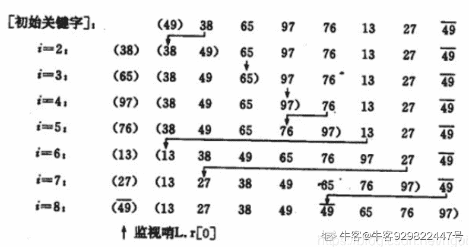

# 网易 2020 校招笔试- 数据库管理工程师（提前批）

## 1

关于存储过程，以下说法正确的是？(1)存储过程可以看成是对一系列 SQL 操作的批处理(2)把实现封装在了存储过程中，无法保证安全性(3)存储过程不是预先编译(4)命令行中创建存储过程需要自定义分隔符，因为命令行是以 ; 为结束符，而存储过程中也包含了分号，因此会错误把这部分分号当成是结束符，造成语法错误。(5)包含 out in 和 outin 三种参数(6)每次只能给一个变量赋值，不支持集合的操作。

正确答案: C   你的答案: 空 (错误)

```cpp
(1)(2)(4)
```

```cpp
(2)(4)(6)
```

```cpp
(1)(4)(6)
```

```cpp
(2)(5)(6)
```

本题知识点

数据库工程师 网易 2020

讨论

[若如初相见](https://www.nowcoder.com/profile/784019160)

存储过程都是预先编译好的；存储过程的三种参数：in、out、inout

发表于 2020-07-12 20:33:11

* * *

## 2

有一类二叉树用三叉链表来存储的时候除了带有指向左右孩子节点的两个指针，还有指向父节点的指针，那么这样一棵二叉树有 2 个节点，那么有多少指针指向 NULL（注：根节点的父指针指向 NULL，对于不存在的节点表示为 NULL）？

正确答案: D   你的答案: 空 (错误)

```cpp
1
```

```cpp
2
```

```cpp
3
```

```cpp
4
```

```cpp
5
```

本题知识点

Java 工程师 C++工程师 网易 安全工程师 测试开发工程师 前端工程师 数据分析师 数据库工程师 算法工程师 iOS 工程师 安卓工程师 运维工程师 2020

讨论

[北斗酌美酒](https://www.nowcoder.com/profile/170736954)


发表于 2020-04-11 11:37:30

* * *

[流浪者 201907280945510](https://www.nowcoder.com/profile/60649645)

每个节点有 3 个指针，两个节点一共 6 个指针，其中 A 节点父节点指向 B 节点， B 节点子节点指向 A 节点，剩下的 4 个节点全部是 NULL

发表于 2020-02-17 09:51:27

* * *

[小水滴真的是太可爱了吧](https://www.nowcoder.com/profile/742091450)

**三叉链表存储表示**

改进于二叉链表，增加指向父节点的指针，能更好地实现结点间的访问。


发表于 2020-04-07 10:38:28

* * *

## 3

下列最短路径算法的叙述中正确的是（）

正确答案: B   你的答案: 空 (错误)

```cpp
Dijkstra 算法通常用于求每一对顶点间的最短路径；
```

```cpp
Dijkstra 算法不允许图中带有负权值的边，而 Floyd 算法则可以适用；
```

```cpp
Floyd 算法通常用于求某一顶点到其他各顶点的最短路径；
```

```cpp
Floyd 算法允许有包含负权值的边组成的回路，而 Dijkstra 算法不允许；
```

本题知识点

iOS 工程师 网易 Java 工程师 前端工程师 C++工程师 算法工程师 数据分析师 数据库工程师 2020

讨论

[vicyor](https://www.nowcoder.com/profile/2210832)

```cpp
1.Dijkstra 算法是计算图中的一个点到其它点的最小路径.
  算法思路: 贪心算法.
    将图中所有点分成 S(已求出解)和 U(未求出解)2 个点集.dist[i]表示 v0 到 v[i]当前已求得得最短路径.A[n][n]为边集
    1.从剩下的边集合中选出 dist 最短的边并将边的另一顶点 vi 从 U 中加入 S.
    2.更新与 vi 连接的所有且并未在 S 中的点的 dist 矩阵值,dist[vk]=min(dist[vk],dist[vi]+A(i,k)).
    3.重复上述操作直到 U 中无与 S 中的点相连的点.
2.Floyd 算法计算图中任意一对点的最短路径.
  算法思路:  T(n)=O(n³).
   动态规划法: Dis(i,j) =min(Dis(i,j), Dis(i,k) + Dis(k,j)).

```
 for(k=0;k<n;k++)
 　　{ 
       //A[i][j]初始为每点的边长. for(i=0;i<n;i++) for(j=0;j<n;j++) if(A[i][j]>(A[i][k]+A[k][j]))
             　　{
                   　　A[i][j]=A[i][k]+A[k][j];
                   　　path[i][j]=k;
              　 } 
    　} 
```cpp

3.Dijkstra 算法为啥不能存在负数边?

Dijkstra 中 S(已求出解)中的每一个点解即最短路径是已求出的,若存在负数路径,可能存在已求出的解不是最优解.

例:

A   3    B

4     -1000 

c 

由于贪心法 B 的最终结果为 3 而不是 -996,而 C 的结果正确 -997.

```

发表于 2020-02-17 15:57:16

* * *

[offer 快来球球了](https://www.nowcoder.com/profile/243031380)

注意 floyd 能有负权值的边，不能有负权值的回路！

发表于 2020-02-24 10:43:38

* * *

[青墨山音](https://www.nowcoder.com/profile/267670990)

B

发表于 2019-12-23 02:35:08

* * *

## 4

判断一个数组或序列是正序,倒序还是乱序,需要我们将这个数组完整的遍历一遍通过构建有序序列，对于未排序数据，在已排序序列中从后向前扫描，找到相应的位置并插入的排序算法是（ ）

正确答案: C   你的答案: 空 (错误)

```cpp
选择排序
```

```cpp
希尔排序
```

```cpp
插入排序
```

```cpp
归并排序
```

本题知识点

iOS 工程师 网易 安卓工程师 C++工程师 Java 工程师 安全工程师 测试工程师 大数据开发工程师 前端工程师 算法工程师 数据分析师 数据库工程师 运维工程师 2020

讨论

[Olivia_dtt](https://www.nowcoder.com/profile/232985383)

选择排序：每次从数组中选出一个最小数（最大数）放到数组最前面，存放在序列的起始位置，直到全部待排序的数据元素排完。希尔排序：设置增量分割数组，逐步进行直接插入排序,增量逐趟减少,并最后使得整个数组基本有序,再对整体进行直接插入排序。插入排序：构建有序序列，未排序数据依次从已排序数据按从后往前比较，插入到合适的位置。归并排序：把序列分成两个长度为 n/2 的子序列，对这两个子序列分别归并排序（循环将两个数组的第一个值比较，并弹出第一个值， 直到数组长度都不存在），将两个排序好的子序列合并成一个最终的排序序列

发表于 2020-04-06 20:12:11

* * *

[牛客 929822447 号](https://www.nowcoder.com/profile/929822447)


插入排序—直接插入排序：



希尔排序：

 

选择排序：

 

归并排序：


发表于 2020-08-24 18:42:35

* * *

## 5

队列是一种特殊的线性表，特殊之处在于它只允许在表的前端（front）进行删除操作，而在表的后端（rear）进行插入操作，和栈一样，队列是一种操作受限制的线性表，进行插入操作的端称为队尾，进行删除操作的端称为队头，若用一个大小为 6 的数组来实现循环队列，数组下标为[0,5]，且当前 rear 和 front 的值分别为 0 和 3，当从队列中删除一个元素，再加入两个元素后，rear 和 front 的值分别为多少？（   ）

正确答案: B   你的答案: 空 (错误)

```cpp
1 和 5
```

```cpp
2 和 4
```

```cpp
4 和 2
```

```cpp
5 和 1
```

本题知识点

iOS 工程师 网易 Java 工程师 C++工程师 安全工程师 测试工程师 测试开发工程师 大数据开发工程师 数据分析师 数据库工程师 2020

讨论

[惠州学院 _15_ 黄洪卫](https://www.nowcoder.com/profile/8631354)

这道题目说的是当前**rear**和**fro****nt**的值分别为 0 和 3，所以当前的队列为 3  4  5  0，front 为 3，rear 为 0，又因为是用一个大小为 6 的数组来实现的循环队列，所以删除一个插入两个后为 4  5  0  1  2，此时 front 为 4，rear 为 2，即答案为 2,4

发表于 2019-12-04 11:15:44

* * *

[猫仔面](https://www.nowcoder.com/profile/4548438)

顺序队列：入队 rear += 1 出队 front += 1 队列长度 = rear - front 循环队列：入队 rear = (rear + 1) % size 出队 front  = (front + 1) % size 队列长度 = (rear - front + size) % size

发表于 2020-08-06 15:02:52

* * *

[vicyor](https://www.nowcoder.com/profile/2210832)

初始时候,front 为 3，rear 为 0 删除一个元素(首部) ， front 为 4，rear 为 0 插入 2 个元素 ,               front 为 4，rear 为 2

发表于 2020-02-17 16:02:13

* * *

## 6

死锁是指多个进程在运行过程中因争夺资源而造成的一种僵局，永远在互相等待的进程称为死锁进程，假设计算机系统中有 3 个不同的临界资源 R1、R2 和 R3，被 4 个进程 p1、p2、p3 及 p4 共享。各进程对资源的需求为：p1 申请 R1 和 R2，p2 申请 R2 和 R3，p3 申请 R1 和 R3，p4 申请 R2。若系统出现死锁，则处于死锁状态的进程数至少是（  ）

正确答案: C   你的答案: 空 (错误)

```cpp
1
```

```cpp
2
```

```cpp
3
```

```cpp
4
```

本题知识点

iOS 工程师 网易 安卓工程师 C++工程师 Java 工程师 测试工程师 测试开发工程师 大数据开发工程师 前端工程师 算法工程师 数据库工程师 2020

讨论

[彭彭の零柒](https://www.nowcoder.com/profile/390870854)

3 个.这种情况： p1 占用 r1,p2 占用 r2，p3 占用 r3，p1 申请 r2，p2 申请 r3，p3 申请 r1，无限等待释放资源

发表于 2020-02-21 21:58:02

* * *

[我是复读机](https://www.nowcoder.com/profile/162099353)

要理解死锁的概念。死锁的进程必须是已经占有了某个资源，同时在请求其他资源，而且不会主动释放已占有的资源。如果几个进程循环等待其他进程已占有的资源，就陷入了死局，就死锁了。

发表于 2020-04-21 17:16:12

* * *

[猫仔面](https://www.nowcoder.com/profile/4548438)

我的理解：对于本题，有 3 个资源，所以如果出现死锁（环形等待），必定至少需要 3 个进程来分别占有 3 个资源（感觉怪怪的）

发表于 2020-08-06 15:18:29

* * *

## 7

请选择以下命令后 file1 和 file2 的权限 chmod 755 file1chmod 644 file2

正确答案: B   你的答案: 空 (错误)

```cpp
-rw-r--r--  file1

-rw-r--r--  file2
```

```cpp
-rwxr-xr-x  file1

-rw-r--r--  file2
```

```cpp
-rw-r--r--  file1

-rwxr-xr-x  file2
```

```cpp
-rwxr-xr-x  file1

-rw-rw-rw-  file2
```

本题知识点

Java 工程师 C++工程师 网易 安全工程师 大数据开发工程师 前端工程师 数据库工程师 运维工程师 2020

讨论

[Aiqing](https://www.nowcoder.com/profile/814029247)

**chmod**是 Linux 下设置文件权限的命令，后面的数字表示不同用户或用户组的权限。

一般是三个数字：

第一个数字表示文件所有者的权限

第二个数字表示与文件所有者同属一个用户组的其他用户的权限

第三个数字表示其它用户组的权限。

权限分为三种：读（r=4），写（w=2），执行（x=1）。综合起来还有可读可执行（rx=5=4+1）、可读可写（rw=6=4+2）、可读可写可执行(rwx=7=4+2+1)。

所以，**chmod 755** 设置用户的权限为：

1.文件所有者可读可写可执行

2.与文件所有者同属一个用户组的其他用户可读可执行

3.其它用户组可读可执行-rwx-r--r-- (一共 10 个参数) 表示文件所属组和用户的对应权限。
第一个跟参数属于管理员，跟 chmod 无关,先不管.
2-4 参数:属于 user
5-7 参数:属于 group
8-10 参数:属于 others
接下来就简单了:r==>可读 w==>可写 x==>可执行
r=4 w=2 x=1
所以 755 代表 rwxr-xr-x  注意是前三个字母为 7 然后两个 r-x 为 5 r-x 为 5

777 代表 rwxr-rwx-rwx 所有用户都可读可写可执行。644 为 -rw-r-r-

发表于 2019-12-20 17:28:38

* * *

[牛客 380846183 号](https://www.nowcoder.com/profile/380846183)

参考了楼上同学的解析，分享一点自己的领悟：10 个参数，第一个属于管理员，用“-”表示 234，567，8910 均以 rwx 的形式表示，不存在的权限用“-”代替比如 755 为“-rwxr-xr-x”第一个参数：-对应管理员 234 个参数：rwx，即为 user 权限 567 个参数：r-x，为 group 权限，此处没有可写权限，所以 w 用“-”代替 8910 个参数：r-x，同理。和楼上不同的看法（不确定对不对，但应该是对的）644“- rw- r-- r--”777“- rwx rwx rwx”

发表于 2020-08-07 11:05:19

* * *

## 8

ls -l 命令有以下输出，描述正确的是

正确答案: D   你的答案: 空 (错误)

```cpp
default.etcd 为可执行文件，只能被 root 执行
```

```cpp
go 目录占的磁盘空间大小为 4KB
```

```cpp
install-client.sh 脚本可以用./install-client.sh 命令执行
```

```cpp
go 文件夹可以被任意用户浏览
```

本题知识点

安卓工程师 网易 C++工程师 Java 工程师 安全工程师 测试工程师 测试开发工程师 大数据开发工程师 前端工程师 数据库工程师 iOS 工程师 运维工程师 2020

讨论

[我是复读机](https://www.nowcoder.com/profile/162099353)

A 是目录，不是文件；B 也是目录，所以 4096 表示的是该目录符所占的大小（注意，4096 不表示该目录下所有文件的大小）；C 没有 x 权限，不能直接./运行，但可以用 sh 运行；D 正确

发表于 2020-04-21 19:41:36

* * *

[offer-冲鸭](https://www.nowcoder.com/profile/447104610)

首先 d 表示这个文件是一个文件夹，然后文件的权限用其后一共有 9 个字符表示，分成三组，分别表示文件所属用户的权限，文件所属用户组的权限，其他人的权限，r 表示读权限, w 表示写权限， x 表示执行权限，你给的这个例子就是说 这是个文件夹，并且此文件所属用户拥有读、写、执行三项权限，其余的用户组，其他用户不拥有任何权限（全部都是-）--转

发表于 2020-04-03 22:52:49

* * *

[HEREISDAVID](https://www.nowcoder.com/profile/864672146)


发表于 2020-09-27 20:12:49

* * *

## 9

两条命令分别会有怎样的输出 echo hello 1>&2 |grep aaaecho hello 2>&1 |grep aaa

正确答案: A   你的答案: 空 (错误)

```cpp
第一个输出 hello， 第二个无输出
```

```cpp
第一个无输出，第二个输出 hello
```

```cpp
第一个无输出，第二个无输出
```

```cpp
第一个输出 hello，第二个输出 aaa
```

本题知识点

前端工程师 网易 Java 工程师 C++工程师 数据库工程师 iOS 工程师 安卓工程师 安全工程师 运维工程师 2020

讨论

[Offer 眷顾眷顾我吧](https://www.nowcoder.com/profile/836317992)

参考这个博主的解析[`www.cnblogs.com/cyyz-le/p/11305004.html`](https://www.cnblogs.com/cyyz-le/p/11305004.html)

发表于 2020-04-07 18:07:41

* * *

## 10

访问记录 visit 表中包含日期 date,用户 user_id,访问的页面 url 3 个字段，以下哪个选项不能计算'2019-03-11'这一天访问过页面的所有用户数

正确答案: D   你的答案: 空 (错误)

```cpp
SELECT count(user_id) FROM (SELECT user_id FROM visit WHERE date = '2019-03-11'  GROUP BY user_id) f
```

```cpp
SELECT count(user_id) FROM (SELECT DISTINCT user_id FROM visit WHERE date = '2019-03-11') f
```

```cpp
SELECT count(DISTINCT user_id) FROM visit WHERE date = '2019-03-11'
```

```cpp
SELECT count(user_id) FROM visit WHERE date = '2019-03-11' GROUP BY date
```

本题知识点

iOS 工程师 网易 安卓工程师 C++工程师 Java 工程师 测试工程师 测试开发工程师 大数据开发工程师 数据分析师 数据库工程师 2020

讨论

[vicyor](https://www.nowcoder.com/profile/2210832)

D . SELECT count(user_id) FROM visit WHERE date = '2019-03-11' GROUP BY date    问题: 1.user_id 未去重             2.已经通过 where 选出 date 了,group by 无意义.修改: SELECT count(user_id) FROM visit WHERE date = '2019-03-11' GROUP BY user_id

发表于 2020-02-17 16:47:43

* * *

[牛客 656547734 号](https://www.nowcoder.com/profile/656547734)

选项 A 

```cpp
SELECT count(user_id) FROM (SELECT user_id FROM visit WHERE date = '2019-03-11'  GROUP BY user_id) fK
我选这个了，这个的确无法直接得到结果，但是题目问的是无法计算，这个结果通过人工计算还是可以计算出最终结果的，我觉得迷惑性的确很大。
```

发表于 2020-04-25 16:41:28

* * *

[aruruff](https://www.nowcoder.com/profile/509544345)

```cpp
除重归纳用户 id 为表 f 再计算 A   SELECT count(user_id) FROM (SELECT user_id FROM visit WHERE date = '2019-03-11'  GROUP BY user_id) f
```

  B    SELECT count(user_id) FROM (SELECT DISTINCT user_id FROM visit WHERE date = '2019-03-11') f
C 简单的用除重函数
D

```cpp
 GROUP BY 日期再

```
WHERE 日期 nono
```cpp

```

```cpp
WHERE date = '2019-03-11' GROUP BY date  
```

发表于 2019-12-11 11:58:15

* * *

## 11

将当前命令 sh test.sh 任务在后台执行，下列最优雅的的做法是

正确答案: C   你的答案: 空 (错误)

```cpp
sh test.sh &
```

```cpp
nohup sh test.sh
```

```cpp
nohup sh test.sh &
```

```cpp
nohup sh test.sh &&
```

本题知识点

数据库工程师 网易 2020

## 12

以下关于 ACID 说法正确的是?

正确答案: A   你的答案: 空 (错误)

```cpp
A 表示原子性，要么全部执行，要么全部不执行，不会存在部分执行
```

```cpp
C 表示完整性，是数据操作前后的约束
```

```cpp
I 表示读写操作的隔离性
```

```cpp
D 表示持久性，一旦事务提交，则其所做的修改不会发生变化
```

本题知识点

数据库工程师 网易 运维工程师 2020

讨论

[Offer 眷顾眷顾我吧](https://www.nowcoder.com/profile/836317992)

ACID 是[数据库事务](https://baike.sogou.com/lemma/ShowInnerLink.htm?lemmaId=298468&ss_c=ssc.citiao.link)正确执行的四个基本要素的缩写，即原子性（Atomicity）、一致性（Consistency）、隔离性（[Isolation](https://baike.sogou.com/lemma/ShowInnerLink.htm?lemmaId=70806469&ss_c=ssc.citiao.link)）、持久性（Durability）。原子性：整个事务中的所有操作，要么全部完成，要么全部不完成，不可能停滞在中间某个环节。事务在执行过程中发生错误，会被回滚（Rollback）到事务开始前的状态，就像这个事务从来没有执行过一样。 一致性：在事务开始之前和事务结束以后，数据库的完整性约束没有被破坏。数据库在事务执行前后都保持一致性状态。在一致性状态下，所有事务对一个数据的读取结果都是相同的。 隔离性：隔离状态执行事务，使它们好像是系统在给定时间内执行的唯一操作。如果有两个事务，运行在相同的时间内，执行相同的功能，事务的隔离性将确保每一事务在系统中认为只有该事务在使用系统。这种属性有时称为[串行化](https://baike.sogou.com/lemma/ShowInnerLink.htm?lemmaId=36017&ss_c=ssc.citiao.link)，为了防止事务操作间的混淆，必须串行化或[序列化](https://baike.sogou.com/lemma/ShowInnerLink.htm?lemmaId=54553&ss_c=ssc.citiao.link)请求，使得在同一时间仅有一个请求用于同一数据。一个事务所做的修改在最终提交以前，对其它事务是不可见的。 持久性：在事务完成以后，该事务所对数据库所作的更改便持久的保存在数据库之中，并不会被回滚。一旦事务提交，则其所做的修改将会永远保存到数据库中。即使系统发生崩溃，事务执行的结果也不能丢失。可以通过数据库备份和恢复来实现，在系统发生奔溃时，使用备份的数据库进行数据恢复。 

发表于 2020-04-07 18:19:51

* * *

## 13

下列关于索引创建的一般性原则，错误的是：

正确答案: D   你的答案: 空 (错误)

```cpp
在经常用作连接的列上创建索引
```

```cpp
在经常作用排序的列上创建索引
```

```cpp
在经常搜索的列上及 Where 子句的列上创建索引
```

```cpp
在定义为 text, image 和 bit 数据类型的列上创建索引
```

```cpp
在根据范围搜索的列上创建索引
```

本题知识点

数据库工程师 网易 2020

## 14

以下哪些方式可以预防 SQL 注入攻击？

正确答案: B   你的答案: 空 (错误)

```cpp
使用 JDBC
```

```cpp
使用绑定变量（参数化）
```

```cpp
对数据库查询的输出结果进行格式化
```

```cpp
加强数据库的用户权限
```

本题知识点

数据库工程师 网易 2020

## 15

以下哪个是 MySQL 的分支版本？

正确答案: A   你的答案: 空 (错误)

```cpp
MariaDB
```

```cpp
HBase
```

```cpp
MongoDB
```

```cpp
TiDB
```

本题知识点

数据库工程师 网易 2020

讨论

[野猪宫本](https://www.nowcoder.com/profile/56106287)

除了 A,其余的根本不可能和 mysql 有关系。因为 maria 是 MySQL 创始人的小女儿的名字。由于 MySQL 被 oracle 收购，可能面临闭源的危险，所以 MySQL 的一个最优秀的分支 mariaDB 诞生了。所以闭着眼睛都是 A。

发表于 2020-06-29 17:40:42

* * *

[Collinlxf](https://www.nowcoder.com/profile/685452147)

A

发表于 2020-09-05 20:48:55

* * *

[宁失天下不负卿](https://www.nowcoder.com/profile/7739018)

无脑 A

发表于 2020-08-13 16:31:21

* * *

## 16

基于 Hash 的索引与基于 B 树的索引有何区别？你还知道有其它哪些不同数据结构的索引吗？

你的答案

本题知识点

数据库工程师 网易 2020

## 17

假设音乐用户、歌曲、听歌记录的信息保存在如下的表中：

user  用户表

---------------------------

user_id 用户 id

user_name 用户名称

song  歌曲表

-----------------------

song_id  歌曲 id

song_singer 演唱者

song_name 歌曲名称

record  听歌记录表

-----------------------

user_id  用户 id

song_id  歌曲 id

listen_num  听取次数

a) 请用 SQL 给出 被所有用户听取总次数最多的 10 首歌曲 id 及其总听取次数（按照总听取次数倒序排列）。  （3 分）

b) 请用 SQL 给出 名称为'小张'的用户的所有听过的歌曲名称。（假设用户名称不重复） （3 分）

c) 为优化上面查询，需要在 3 个表建哪些索引？ （4 分）

你的答案

本题知识点

数据库工程师 网易 2020

讨论

[牛客 580315518 号](https://www.nowcoder.com/profile/580315518)

（1）select c.listen_num ,b.song_name  from  listen_num c join song b on b.song_id=c.song_idwhere c.listen_num ls top 10order by listen_num (2)select distinct  b.song_name from song b join song b on b.song_id=c.song_id join song user a  on a.user_id=c.song_id
 where a. user_name =  小张（3）user  用户表索引 user_id，song  歌曲索引 song_id，record  听歌记录表索引 user_id+song_id

发表于 2020-02-18 10:40:36

* * *

## 18

小易给你一个包含 n 个数字的数组。你可以对这个数组执行任意次以下交换操作：
对于数组中的两个下标 i,j(1<=i,j<=n)，如果为奇数，就可以交换和。现在允许你使用操作次数不限，小易希望你能求出在所有能通过若干次操作可以得到的数组中，字典序最小的一个是什么。

本题知识点

Java 工程师 网易 测试开发工程师 前端工程师 C++工程师 数据库工程师 算法工程师 iOS 工程师 安卓工程师 安全工程师 2020

讨论

[mynamewali](https://www.nowcoder.com/profile/524066618)

只要不全是奇数或者全是偶数，就进行排序

```cpp
#include<iostream>
#include<algorithm>
using namespace std;
int main(){
    int n;
    cin>>n;
    long int a[n];
    int odd_num = 0;
    for(int i=0;i<n;i++) cin>>a[i];
    for(int i=0;i<n;i++){
        if(a[i]&1) odd_num += 1;
    }
    if(odd_num==0 || odd_num==n){
        for(int i=0;i<n-1;i++) cout<<a[i]<<" ";
        cout<<a[n-1]<<endl;
    }
    else{
        sort(a,a+n);
        for(int i=0;i<n-1;i++) cout<<a[i]<<" ";
        cout<<a[n-1]<<endl;
    }

}
```

编辑于 2020-03-13 09:50:08

* * *

[孝陵卫的风](https://www.nowcoder.com/profile/645847812)

```cpp
import java.util.Arrays;
import java.util.Scanner;

public class Main {
    public static void main(String[] args) {
        Scanner scanner = new Scanner(System.in);
        while (scanner.hasNext()) {
            int n = scanner.nextInt();
            long[] arr = new long[n];
            for (int i = 0; i < n; i++) {
                arr[i] = scanner.nextLong();
            }
            demo1(arr);
            return;
        }
    }

    public static void demo1(long[] arr) {
        //奇数数量
        int oddSum = 0;
        for (int i = 0; i < arr.length; i++) {
            if (arr[i] % 2 == 1) {
                oddSum++;
            }
        }
        //如果全是偶数或者全是奇数则无法排序，直接输出
        if (oddSum == 0 || oddSum == arr.length) {
            for (int i = 0; i < arr.length; i++) {
                System.out.print(arr[i] + " ");
            }
            return;
        }
        //如果至少存在一对奇偶数，则可以将序列全部从小到大排列
        Arrays.sort(arr);
        for (int i = 0; i < arr.length; i++) {
            System.out.print(arr[i] + " ");
        }
    }
}

```

发表于 2020-04-05 22:06:52

* * *

[牛客 438821193 号](https://www.nowcoder.com/profile/438821193)

```cpp
var n = parseInt(readline())
var arr = readline().split(" ")
var ji = arr.every(item=>Number(item)%2) //判断是否全是奇数
var ou = arr.every(item=>Number(item)%2===0) //判断是否全是偶数
if(ji||ou){
    console.log(arr.join(" "))
}else{
    arr.sort((a,b)=>a-b)
    console.log(arr.join(" "))
}
```

怎么简洁怎么来 发表于 2021-08-28 14:16:50

* * *

## 19

小易有一个长度为 n 的数字数组, , …, 。

问你是否能用这 n 个数字构成一个**环(****首尾连接)**，使得环中的每一个数字都小于它相邻的两个数字的和(**每个数字都必须使用并且每个数字只能使用一次**)。

本题知识点

Java 工程师 网易 测试开发工程师 前端工程师 C++工程师 数据库工程师 算法工程师 iOS 工程师 安卓工程师 安全工程师 运维工程师 2020

讨论

[暮成](https://www.nowcoder.com/profile/220765575)

```cpp
#include <iostream>
using namespace std;
int main()
{
    int t ;
    cin >> t;
    while(t>0)
    {
    long long  n ;
    cin >> n;
        if(n<=2)
            cout << "NO" << endl;
        else
        {
        long long a[n];
        for(long long i =0;i<n;i++)
        cin >> a[i];

        //直接找最大值 次最大值 次次最大值
        long long max = a[0];
        long long ccmax = 0;
        long long cmax = 0;
        for(long long i=1;i<n;i++)
        {
            if(a[i]>=max)
            {
                ccmax = cmax;
                cmax = max;
                max = a[i];
            }
            else if (a[i] >= cmax)
               {
                ccmax = cmax;
                cmax = a[i];             
            }              
       else if (a[i] >= ccmax)    
            {                 
                ccmax = a[i];             
            }

        }

        if(ccmax+cmax>max)    //最大值小于后两个之和  则所有都满足条件
            cout << "YES" << endl;
        else
            cout << "NO" << endl;
        }
     t--;
    }
}

```

编辑于 2020-08-19 08:52:42

* * *

[黑暗过后会是晨曦](https://www.nowcoder.com/profile/128285448)

因为每个数字小于相邻只和，直接排序数组，然后只要操作最大数左右两边之和大于最大数，此时只需要将最大数和第二大数交换位置即可。

发表于 2020-02-26 10:22:10

* * *

[祈求 offer](https://www.nowcoder.com/profile/894067753)

```cpp
import java.util.Arrays;
import java.util.Scanner;

public class Main {
    public static void main(String[] args) {
        Scanner cin = new Scanner(System.in);
        int t = cin.nextInt();
        while (t-- != 0) {
            int n = cin.nextInt();
            long[] a = new long[n];
            for (int i = 0; i < n; i++) {
                a[i] = cin.nextLong();
            }
            Arrays.sort(a);
            if (a[n-2] + a[n-3] > a[n-1]){ //只要只要最后二个和第一个加起来大于最后一个
                                                        //可以考虑将最后一个往前交换一位，这样都能满足条件
                System.out.println("YES");
            }else {
                System.out.println("NO");
            }
        }
    }
}
```

编辑于 2020-08-07 11:29:39

* * *