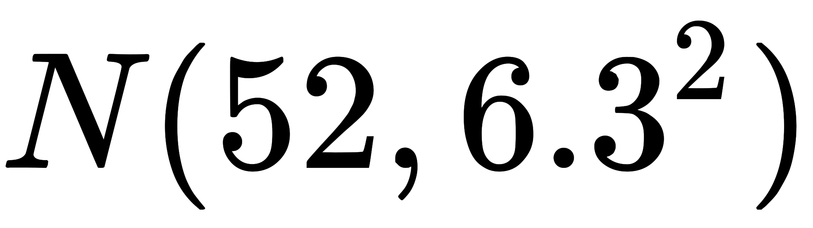
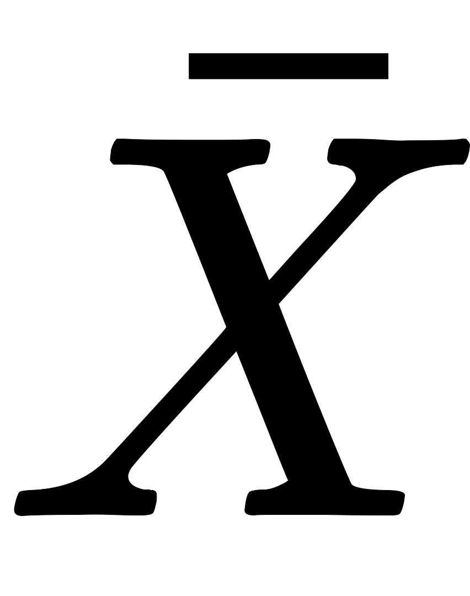

# 网易 2020 校招笔试- 算法工程师（有道）提前批

## 1

有一类二叉树用三叉链表来存储的时候除了带有指向左右孩子节点的两个指针，还有指向父节点的指针，那么这样一棵二叉树有 2 个节点，那么有多少指针指向 NULL（注：根节点的父指针指向 NULL，对于不存在的节点表示为 NULL）？

正确答案: D   你的答案: 空 (错误)

```cpp
1
```

```cpp
2
```

```cpp
3
```

```cpp
4
```

```cpp
5
```

本题知识点

Java 工程师 C++工程师 网易 安全工程师 测试开发工程师 前端工程师 数据分析师 数据库工程师 算法工程师 iOS 工程师 安卓工程师 运维工程师 2020

讨论

[北斗酌美酒](https://www.nowcoder.com/profile/170736954)


发表于 2020-04-11 11:37:30

* * *

[流浪者 201907280945510](https://www.nowcoder.com/profile/60649645)

每个节点有 3 个指针，两个节点一共 6 个指针，其中 A 节点父节点指向 B 节点， B 节点子节点指向 A 节点，剩下的 4 个节点全部是 NULL

发表于 2020-02-17 09:51:27

* * *

[小水滴真的是太可爱了吧](https://www.nowcoder.com/profile/742091450)

**三叉链表存储表示**

改进于二叉链表，增加指向父节点的指针，能更好地实现结点间的访问。


发表于 2020-04-07 10:38:28

* * *

## 2

图 N 是有 7 个顶点的强连通图，那么 N 是有向图，那么 N 最少有（）条边?如 N 为无向图，N 最少有（）条边？

正确答案: D   你的答案: 空 (错误)

```cpp
21,21
```

```cpp
21,20
```

```cpp
7,7
```

```cpp
7,6
```

```cpp
8,7
```

本题知识点

C++工程师 网易 Java 工程师 测试工程师 测试开发工程师 算法工程师 2020 2021

讨论

[猫仔面](https://www.nowcoder.com/profile/4548438)

强连通图：在 G 中，如果对于每一对 vi、vj（vi≠vj），从 vi 到 vj 和从 vj 到 vi 都存在路径。n 个顶点的有向强连通图：至少 n 条边（形成一个环）；至多 n(n-1)条边 n 个顶点的无向强连通图：至少 n-1 条边（形成一条直线）；至多 n(n-1)/2 条边

发表于 2020-08-06 13:04:57

* * *

[牛客 142348115 号](https://www.nowcoder.com/profile/142348115)

N 为有向图则为一个环，N 为无向图则为一条线

发表于 2019-12-13 16:37:42

* * *

[牛客 221048556 号](https://www.nowcoder.com/profile/221048556)

如果是无向图，可以是 7 个顶点连成一条直线，也可以是 1 个中心顶点与周围 6 个顶点分别连接。

发表于 2020-08-07 12:59:44

* * *

## 3

下列最短路径算法的叙述中正确的是（）

正确答案: B   你的答案: 空 (错误)

```cpp
Dijkstra 算法通常用于求每一对顶点间的最短路径；
```

```cpp
Dijkstra 算法不允许图中带有负权值的边，而 Floyd 算法则可以适用；
```

```cpp
Floyd 算法通常用于求某一顶点到其他各顶点的最短路径；
```

```cpp
Floyd 算法允许有包含负权值的边组成的回路，而 Dijkstra 算法不允许；
```

本题知识点

iOS 工程师 网易 Java 工程师 前端工程师 C++工程师 算法工程师 数据分析师 数据库工程师 2020

讨论

[vicyor](https://www.nowcoder.com/profile/2210832)

```cpp
1.Dijkstra 算法是计算图中的一个点到其它点的最小路径.
  算法思路: 贪心算法.
    将图中所有点分成 S(已求出解)和 U(未求出解)2 个点集.dist[i]表示 v0 到 v[i]当前已求得得最短路径.A[n][n]为边集
    1.从剩下的边集合中选出 dist 最短的边并将边的另一顶点 vi 从 U 中加入 S.
    2.更新与 vi 连接的所有且并未在 S 中的点的 dist 矩阵值,dist[vk]=min(dist[vk],dist[vi]+A(i,k)).
    3.重复上述操作直到 U 中无与 S 中的点相连的点.
2.Floyd 算法计算图中任意一对点的最短路径.
  算法思路:  T(n)=O(n³).
   动态规划法: Dis(i,j) =min(Dis(i,j), Dis(i,k) + Dis(k,j)).

```
 for(k=0;k<n;k++)
 　　{ 
       //A[i][j]初始为每点的边长. for(i=0;i<n;i++) for(j=0;j<n;j++) if(A[i][j]>(A[i][k]+A[k][j]))
             　　{
                   　　A[i][j]=A[i][k]+A[k][j];
                   　　path[i][j]=k;
              　 } 
    　} 
```cpp

3.Dijkstra 算法为啥不能存在负数边?

Dijkstra 中 S(已求出解)中的每一个点解即最短路径是已求出的,若存在负数路径,可能存在已求出的解不是最优解.

例:

A   3    B

4     -1000 

c 

由于贪心法 B 的最终结果为 3 而不是 -996,而 C 的结果正确 -997.

```

发表于 2020-02-17 15:57:16

* * *

[offer 快来球球了](https://www.nowcoder.com/profile/243031380)

注意 floyd 能有负权值的边，不能有负权值的回路！

发表于 2020-02-24 10:43:38

* * *

[青墨山音](https://www.nowcoder.com/profile/267670990)

B

发表于 2019-12-23 02:35:08

* * *

## 4

以下是泊松分布概率密度函数的是

正确答案: B   你的答案: 空 (错误)

本题知识点

数据分析师 网易 算法工程师 2020

讨论

[流浪者 201907280945510](https://www.nowcoder.com/profile/60649645)

其中 A 是伯努利分布， B 是泊松分布，D 是均匀分布

发表于 2020-02-17 09:56:38

* * *

[牛客 745266709 号](https://www.nowcoder.com/profile/745266709)

C 是指数分布密度函数

发表于 2020-08-08 02:00:24

* * *

[小甘 0821](https://www.nowcoder.com/profile/335247139)

泊松分布作为 discrete variable distribution,根本没有密度函数啊，这样的说法太不严谨了

发表于 2020-03-08 07:25:05

* * *

## 5

判断一个数组或序列是正序,倒序还是乱序,需要我们将这个数组完整的遍历一遍通过构建有序序列，对于未排序数据，在已排序序列中从后向前扫描，找到相应的位置并插入的排序算法是（ ）

正确答案: C   你的答案: 空 (错误)

```cpp
选择排序
```

```cpp
希尔排序
```

```cpp
插入排序
```

```cpp
归并排序
```

本题知识点

iOS 工程师 网易 安卓工程师 C++工程师 Java 工程师 安全工程师 测试工程师 大数据开发工程师 前端工程师 算法工程师 数据分析师 数据库工程师 运维工程师 2020

讨论

[Olivia_dtt](https://www.nowcoder.com/profile/232985383)

选择排序：每次从数组中选出一个最小数（最大数）放到数组最前面，存放在序列的起始位置，直到全部待排序的数据元素排完。希尔排序：设置增量分割数组，逐步进行直接插入排序,增量逐趟减少,并最后使得整个数组基本有序,再对整体进行直接插入排序。插入排序：构建有序序列，未排序数据依次从已排序数据按从后往前比较，插入到合适的位置。归并排序：把序列分成两个长度为 n/2 的子序列，对这两个子序列分别归并排序（循环将两个数组的第一个值比较，并弹出第一个值， 直到数组长度都不存在），将两个排序好的子序列合并成一个最终的排序序列

发表于 2020-04-06 20:12:11

* * *

[牛客 929822447 号](https://www.nowcoder.com/profile/929822447)


插入排序—直接插入排序：


希尔排序：

 

选择排序：

 

归并排序：


发表于 2020-08-24 18:42:35

* * *

## 6

在总体中随机抽取一容量为 36 的样本，求样本的均值落在 50.8 到 53.8 之间的概率。(注：,,,)

正确答案: D   你的答案: 空 (错误)

```cpp
0.5317
```

```cpp
0.1389
```

```cpp
0.4365
```

```cpp
0.8293
```

本题知识点

算法工程师 网易 2020

讨论

[牛客 ID：923045198](https://www.nowcoder.com/profile/923045198)


n 为样本数量 


发表于 2020-04-04 15:58:32

* * *

## 7

若将 KNN 看成是 kernel method 的一种实现， 则 kernel 函数为

正确答案: B   你的答案: 空 (错误)

本题知识点

算法工程师 网易 2020

讨论

[孙双运 201910171416106](https://www.nowcoder.com/profile/518283668)

KNN 的定义

发表于 2020-09-11 20:46:08

* * *

## 8

当 x 在[x1,x2]非 0，其余情况为 0，则以下是 x 的概率密度 p(x)的最大熵估计是

正确答案: A   你的答案: 空 (错误)

```cpp
均匀分布
```

```cpp
高斯分布
```

```cpp
指数分布
```

```cpp
泊松分布
```

本题知识点

算法工程师 网易 2020

讨论

[Avocador](https://www.nowcoder.com/profile/374789379)

最大熵原理使得可能结果取值均匀

发表于 2020-05-28 23:06:37

* * *

[牛客小妞号](https://www.nowcoder.com/profile/869555943)

最大熵原理使得可能结果取值均匀

发表于 2021-06-15 23:25:21

* * *

## 9

下面对机器学习算法的阐述不正确的有：

正确答案: C   你的答案: 空 (错误)

```cpp
KNN 算法不仅可以用于分类，还可以用于回归；
```

```cpp
分类树的核心思想是递归划分自变量的空间；
```

```cpp
n-gram 对长文本分类表现良好；
```

```cpp
LDA 实质是多层贝叶斯的结合；
```

本题知识点

算法工程师 网易 Java 工程师 C++工程师 2020

讨论

[绿蚁红泥](https://www.nowcoder.com/profile/426128312)

此题的 LDA 是指的狄利克雷模型

发表于 2020-04-01 11:38:46

* * *

## 10

下面对深度神经网络结构中不同层的说法不正确的是：

正确答案: C   你的答案: 空 (错误)

```cpp
Fully connected 通过非线性变化，提取特征之间的关联；
```

```cpp
Pooling 主要对卷积后的特征层进行操作，进行特征的压缩；
```

```cpp
Activation Function 可以为模型引入线性因素；
```

```cpp
Dropout 有效防止模型过拟合；
```

本题知识点

算法工程师 网易 2020

讨论

[牛客 415820493 号](https://www.nowcoder.com/profile/415820493)

第 10 题可能才是不定项选择题吧

发表于 2020-09-12 14:14:46

* * *

[12312412421](https://www.nowcoder.com/profile/684550591)

A 明显也是错的！

发表于 2020-04-06 15:52:43

* * *

[Natavidad](https://www.nowcoder.com/profile/545602555)

A 和 C 答案混了吧？？？？

发表于 2020-04-06 12:36:33

* * *

## 11

详细描述梯度下降法过程及原理；什么是梯度消失和梯度爆炸？解决梯度消失和梯度爆炸的方案都有哪些？

你的答案

本题知识点

算法工程师 网易 2020

## 12

常见的循环神经网络都有哪些？他们的优缺点及应用场景？详细描述之前其中一种网络结构及其推导过程

你的答案

本题知识点

算法工程师 网易 2020

## 13

小易给你一个包含 n 个数字的数组。你可以对这个数组执行任意次以下交换操作：
对于数组中的两个下标 i,j(1<=i,j<=n)，如果为奇数，就可以交换和。现在允许你使用操作次数不限，小易希望你能求出在所有能通过若干次操作可以得到的数组中，字典序最小的一个是什么。

本题知识点

Java 工程师 网易 测试开发工程师 前端工程师 C++工程师 数据库工程师 算法工程师 iOS 工程师 安卓工程师 安全工程师 2020

讨论

[mynamewali](https://www.nowcoder.com/profile/524066618)

只要不全是奇数或者全是偶数，就进行排序

```cpp
#include<iostream>
#include<algorithm>
using namespace std;
int main(){
    int n;
    cin>>n;
    long int a[n];
    int odd_num = 0;
    for(int i=0;i<n;i++) cin>>a[i];
    for(int i=0;i<n;i++){
        if(a[i]&1) odd_num += 1;
    }
    if(odd_num==0 || odd_num==n){
        for(int i=0;i<n-1;i++) cout<<a[i]<<" ";
        cout<<a[n-1]<<endl;
    }
    else{
        sort(a,a+n);
        for(int i=0;i<n-1;i++) cout<<a[i]<<" ";
        cout<<a[n-1]<<endl;
    }

}
```

编辑于 2020-03-13 09:50:08

* * *

[孝陵卫的风](https://www.nowcoder.com/profile/645847812)

```cpp
import java.util.Arrays;
import java.util.Scanner;

public class Main {
    public static void main(String[] args) {
        Scanner scanner = new Scanner(System.in);
        while (scanner.hasNext()) {
            int n = scanner.nextInt();
            long[] arr = new long[n];
            for (int i = 0; i < n; i++) {
                arr[i] = scanner.nextLong();
            }
            demo1(arr);
            return;
        }
    }

    public static void demo1(long[] arr) {
        //奇数数量
        int oddSum = 0;
        for (int i = 0; i < arr.length; i++) {
            if (arr[i] % 2 == 1) {
                oddSum++;
            }
        }
        //如果全是偶数或者全是奇数则无法排序，直接输出
        if (oddSum == 0 || oddSum == arr.length) {
            for (int i = 0; i < arr.length; i++) {
                System.out.print(arr[i] + " ");
            }
            return;
        }
        //如果至少存在一对奇偶数，则可以将序列全部从小到大排列
        Arrays.sort(arr);
        for (int i = 0; i < arr.length; i++) {
            System.out.print(arr[i] + " ");
        }
    }
}

```

发表于 2020-04-05 22:06:52

* * *

[牛客 438821193 号](https://www.nowcoder.com/profile/438821193)

```cpp
var n = parseInt(readline())
var arr = readline().split(" ")
var ji = arr.every(item=>Number(item)%2) //判断是否全是奇数
var ou = arr.every(item=>Number(item)%2===0) //判断是否全是偶数
if(ji||ou){
    console.log(arr.join(" "))
}else{
    arr.sort((a,b)=>a-b)
    console.log(arr.join(" "))
}
```

怎么简洁怎么来 发表于 2021-08-28 14:16:50

* * *

## 14

小易有一个长度为 n 的数字数组, , …, 。

问你是否能用这 n 个数字构成一个**环(****首尾连接)**，使得环中的每一个数字都小于它相邻的两个数字的和(**每个数字都必须使用并且每个数字只能使用一次**)。

本题知识点

Java 工程师 网易 测试开发工程师 前端工程师 C++工程师 数据库工程师 算法工程师 iOS 工程师 安卓工程师 安全工程师 运维工程师 2020

讨论

[暮成](https://www.nowcoder.com/profile/220765575)

```cpp
#include <iostream>
using namespace std;
int main()
{
    int t ;
    cin >> t;
    while(t>0)
    {
    long long  n ;
    cin >> n;
        if(n<=2)
            cout << "NO" << endl;
        else
        {
        long long a[n];
        for(long long i =0;i<n;i++)
        cin >> a[i];

        //直接找最大值 次最大值 次次最大值
        long long max = a[0];
        long long ccmax = 0;
        long long cmax = 0;
        for(long long i=1;i<n;i++)
        {
            if(a[i]>=max)
            {
                ccmax = cmax;
                cmax = max;
                max = a[i];
            }
            else if (a[i] >= cmax)
               {
                ccmax = cmax;
                cmax = a[i];             
            }              
       else if (a[i] >= ccmax)    
            {                 
                ccmax = a[i];             
            }

        }

        if(ccmax+cmax>max)    //最大值小于后两个之和  则所有都满足条件
            cout << "YES" << endl;
        else
            cout << "NO" << endl;
        }
     t--;
    }
}

```

编辑于 2020-08-19 08:52:42

* * *

[黑暗过后会是晨曦](https://www.nowcoder.com/profile/128285448)

因为每个数字小于相邻只和，直接排序数组，然后只要操作最大数左右两边之和大于最大数，此时只需要将最大数和第二大数交换位置即可。

发表于 2020-02-26 10:22:10

* * *

[祈求 offer](https://www.nowcoder.com/profile/894067753)

```cpp
import java.util.Arrays;
import java.util.Scanner;

public class Main {
    public static void main(String[] args) {
        Scanner cin = new Scanner(System.in);
        int t = cin.nextInt();
        while (t-- != 0) {
            int n = cin.nextInt();
            long[] a = new long[n];
            for (int i = 0; i < n; i++) {
                a[i] = cin.nextLong();
            }
            Arrays.sort(a);
            if (a[n-2] + a[n-3] > a[n-1]){ //只要只要最后二个和第一个加起来大于最后一个
                                                        //可以考虑将最后一个往前交换一位，这样都能满足条件
                System.out.println("YES");
            }else {
                System.out.println("NO");
            }
        }
    }
}
```

编辑于 2020-08-07 11:29:39

* * *

## 15

给定 01 序列 S, 序列 S 是优秀的 01 序列，优秀的 01 序列定义如下:
1、如果序列 S,T 是优秀的，则序列 S+T 是优秀的，+被定义为按顺序连接两个序列，即"010"+"110"="010110"。
2、如果序列 S 是优秀的，则序列 rev(S)也是优秀的。rev(S)被定义为按位翻转(0 变 1,1 变 0)序列 S，并删去前导零。例如 rev("1100101")="11010"。

现在请你判断序列 T 是不是优秀的

本题知识点

iOS 工程师 网易 C++工程师 测试开发工程师 大数据开发工程师 算法工程师 Java 工程师 2020

讨论

[零葬](https://www.nowcoder.com/profile/75718849)

```cpp
def reverse(s):
    rev = []
    for c in s:
        if c == '0':
            rev.append('1')
        else:
            rev.append('0')
    return ''.join(rev).lstrip('0')

T = int(input())
for _ in range(T):
    s = input()
    t = input()
    # 根据判别条件构造可能的优秀序列
    result_pool = set()
    # 反转得到的优秀序列
    while s:
        result_pool.add(s)
        s = reverse(s)
    # "1"可以生成任意序列，因此单独拿出来判断一下，反转中有"1"T 一定是优秀序列
    if '1' in result_pool&nbs***bsp;t in result_pool:
        # 如果 T 在反转的优秀序列中，则输出 YES
        print('YES')
    else:
        # 否则检查拼接得到的序列是否优秀
        result_pool = list(result_pool)
        # 拼接得到优秀序列
        flag = False
        for i in range(len(result_pool) - 1):
            for j in range(i, len(result_pool)):
                if result_pool[i] + result_pool[j] == t&nbs***bsp;result_pool[j] + result_pool[i] == t:
                    flag = True
                    print('YES')
                    break
            if flag:
                break
        else:
            print('NO')
```

编辑于 2021-04-08 14:38:38

* * *

[靳伟昭](https://www.nowcoder.com/profile/222160049)

```cpp
#python3
"""
rev----将序列 x 取反并将前置 0 去掉
cur----判断 t 是否存在于 s 及 rev（s）的集合中或者 s 及 rev（s）的两两拼接是否等于 t
"""
def rev(x):
    j = 0
    y = ""
    for i in x:
        if i == "1" and j == 0:
            continue
        j += 1
        if i =="0":
            y += "1"
        else:
            y += "0"
    return y
def cur(s,t):
    tmp = set()
    while s:
        tmp.add(s)
        s1 = rev(s)
        s = s1
    if "1" in tmp or t in tmp:
        return("YES")
    tmp = list(tmp)
    for i in range(len(tmp)-1):
        for j in range(i,len(tmp)):
            if tmp[i]+tmp[j] == t and tmp[j]+tmp[i] == t:
                return("YES")
    return("NO")
n = int(input())
for _ in range(n):
    s = input()
    t = input()
    print(cur(s,t))
```

编辑于 2020-08-08 18:01:34

* * *

[字节内推.](https://www.nowcoder.com/profile/9955061)

```cpp
import java.util.ArrayList;
import java.util.Scanner;

public class Main {
    public static void main(String[] args) {
        Scanner sc = new Scanner(System.in);
        int T = sc.nextInt();
        sc.nextLine();
        for (int i = 0; i < T; i++) {
            String s1 = sc.nextLine();
            String s2 = sc.nextLine();
            System.out.println(solution(s1, s2));
        }
    }

    public static String solution (String s1, String s2) {
        ArrayList<String> list = new ArrayList<String>();
        String tmp = s1;
        while (tmp.length() > 1) {
            StringBuilder rev = new StringBuilder();
            for (int i = 0; i < tmp.length(); i++) {
                if (tmp.charAt(i) == '0')
                    rev.append('1');
                else
                    rev.append('0');
            }
            while (rev.length() > 1 && rev.charAt(0) == '0') {
                rev.deleteCharAt(0);
            }
            String l = rev.toString();
            tmp = l;
            if (!l.equals(""))
                list.add(l);
        }
        //如果出现了“1”,那么就需要额外加上一个“0”
        if (list.contains("1"))
            list.add("0");

        int index = 0;
        while (index < s2.length()) {
            int n = 0;
            if (index + s1.length() <= s2.length() && s2.substring(index, index + s1.length()).equals(s1))
                index += s1.length();
            else if (index < s2.length()) {
                for (int i = 0; i < list.size(); i++) {
                    String ss = list.get(i);
                    if (index + ss.length() <= s2.length() && s2.substring(index, index + ss.length()).equals(ss)) {
                        index += ss.length();
                        break;
                    }
                    else
                        n++;
                }
                if (n == list.size())
                    return "NO";
            }
            else
                return "NO";
        }
        return "YES";
    }
}
```

 发表于 2020-04-06 18:07:33

* * *

## 16

有一天，小易把 1 到 n 的所有排列按字典序排成一排。小易从中选出了一个排列，假设它是正数第 Q 个排列，小易希望你能回答他倒数第 Q 个排列是什么。
例如 1 到 3 的所有排列是：
1 2 3
1 3 2
2 1 3
2 3 1
3 1 2
3 2 1
若小易选出的排列是 1 2 3，则 Q = 1，而你应该输出排列 3 2 1

本题知识点

安卓工程师 网易 Java 工程师 C++工程师 安全工程师 测试工程师 算法工程师 2020

讨论

[Sheltonyang](https://www.nowcoder.com/profile/834925814)

//通过分析可以看出来，位置相对称的两个排列，对应位数字之和为 n+1，直接计算输出就行了#include<iostream>using namespace std;void change(){
    int n;
    cin>>n;
    int innum[n];
    for(int i =0;i<n;i++){
        cin>>innum[i];
    }
    for(int i=0;i<n;i++){
        cout<<n-innum[i]+1<<" ";
    }
}

int main(){
    change();
}

发表于 2020-04-11 14:40:10

* * *

[牛客 864355626 号](https://www.nowcoder.com/profile/864355626)

```cpp
n = int(input())
a = list(map(int, input().split()))
for i in a:
    print(n+1-i, end=' ')
```

发表于 2020-01-03 18:57:32

* * *

[零葬](https://www.nowcoder.com/profile/75718849)

根据用例得到规律：倒数第 Q 个排列的第 i 个数字 = n - 正数第 Q 个排列的第 i 个数字 + 1

```cpp
n = int(input())
arr = list(map(int, input().split()))
result = []
# 规律：倒数第 Q 个排列的第 i 个数字 = n - 正数第 Q 个排列的第 i 个数字 + 1
for oddNum in arr:
    newNum = n - oddNum + 1
    result.append(str(newNum))
print(" ".join(result).strip())
```

发表于 2020-10-22 10:36:25

* * *