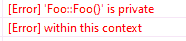

# 网易 2020 校招笔试- 算法平台工程师（正式批）

## 1

以下哪个可能会产生编译错误？

```cpp
#include<iostream>
class Foo
{
public:
    Foo(int v) :m_value(v) { } //1
    void print()
    {
        std::cout << m_value;
    }
    ~Foo() {}

private:
    Foo() { m_value = 0; }//2
    int m_value;
};
int main()
{
    Foo a;//3
    a.print();
    Foo b(1);//4
    b.print();
}
```

正确答案: C   你的答案: 空 (错误)

```cpp
1
```

```cpp
2
```

```cpp
3
```

```cpp
4
```

本题知识点

C++工程师 网易 Java 工程师 算法工程师 2020

讨论

[Lishey](https://www.nowcoder.com/profile/328175061)

是因为还没有定义变量就调用了默认构造函数的原因吗？在本地跑了一下，发现是因为声明变量 a 的时候，优先调用的是默认构造函数，而类中的默认构造函数是私有的，而访问类私有元素是不允许的，主函数中对象 a 的声明本身没有问题，因此编译报错的是 2 部分

编辑于 2019-12-10 10:58:05

* * *

[好学的小白](https://www.nowcoder.com/profile/667266513)

变量定义未初始化值

发表于 2019-12-03 10:46:54

* * *

## 2

数据结构中，沿着某条搜索路线，依次对树中每个结点均做一次且仅做一次访问。对二叉树的结点从 1 开始进行连续编号，要求每个结点的编号大于其左、右孩子的编号，同一结点的左右孩子中，其左孩子的编号小于其右孩子的编号，可采用（  ）次序的遍历实现编号。

正确答案: C   你的答案: 空 (错误)

```cpp
先序
```

```cpp
中序
```

```cpp
后序
```

```cpp
从根开始按层次遍历
```

本题知识点

C++工程师 网易 iOS 工程师 Java 工程师 测试工程师 测试开发工程师 大数据开发工程师 算法工程师 前端工程师 数据分析师 安卓工程师 安全工程师 运维工程师 2020

讨论

[繁华落尽君辞去](https://www.nowcoder.com/profile/569656804)

先序 根左右中序 左根右后序 左右根

发表于 2019-12-03 21:47:17

* * *

[MV13eard](https://www.nowcoder.com/profile/863005403)

这题要理解题意：对二叉树的结点从 1 开始进行连续编号，意思就是把 1，2，3，4....这些数按从小到大的顺序依次放到二叉树中，并要求的放法是：左孩子<右孩子<根节点；这时候再看三种次序的遍历，先序 根左右中序 左根右后序 左右根，很显然，只有后序满足条件。

发表于 2020-03-03 11:21:25

* * *

[依昂](https://www.nowcoder.com/profile/920832473)

是我的理解有问题吗，题目中说的是每个结点的编号大于其左、右孩子的编号，这个的意思难道不是根的节点编号都要大于左右孩子的编号吗

发表于 2020-09-11 14:13:24

* * *

## 3

现在假设 F 是一个森林，B 是由 F 转换得到的二叉树，F 中有 n 个非终端结点，B 中右指针域为空的结点有（    ）个?

正确答案: A   你的答案: 空 (错误)

```cpp
N+1
```

```cpp
N-1
```

```cpp
N+2
```

```cpp
N
```

本题知识点

Java 工程师 C++工程师 网易 数据分析师 算法工程师 2020

讨论

[冯吃吃呀](https://www.nowcoder.com/profile/976546407)

根据森林转换为二叉树的“**左孩子右兄弟**”的表示法，即对于每棵二叉树，每个结点的**右指针**指向其**右邻兄弟。**针对每一个非终端结点，一定会**有且仅有一个**孩子结点没有右邻兄弟，即右指针领域为空。因此 N 个非终端结点，就有 N 个右指针域为空。看完单棵二叉树，再来看这些二叉树是怎么连接成一棵二叉树的。原理是：将后一棵二叉树的**根节点**作为前一棵二叉树的**右孩子**连接起来，所以只有最后一棵二叉树的根结点没有右孩子，即右指针域为空。因此综上：***N***个非终端结点，就有***(******N+1)***个结点的右指针域为空。

编辑于 2020-04-03 21:01:04

* * *

[PKU_xiaowei](https://www.nowcoder.com/profile/291394677)

举个例子：

```cpp
   1
 /   \
2     3
```

发表于 2020-04-11 15:58:39

* * *

## 4

现在假设对 N 个元素的链表做顺序查找时，若查找每个元素的概率相同，则平均查找长度为（   ）？

正确答案: A   你的答案: 空 (错误)

```cpp
(N+l)/2
```

```cpp
N/2
```

```cpp
N
```

```cpp
[(1+N)*N]／2
```

本题知识点

安卓工程师 网易 C++工程师 iOS 工程师 Java 工程师 测试工程师 测试开发工程师 大数据开发工程师 算法工程师 前端工程师 数据分析师 安全工程师 运维工程师 2020

讨论

[L201710091511469](https://www.nowcoder.com/profile/1515815)

第一个数的比较次数为 1，第二个数的比较次数为 2。。。以此类推第 N 个数的比较次数为 N，所以总的比较次数为 1+2+...+N=N(N+1)/2,平均比较次数为(N+1)/2,也即平均查找长度。

发表于 2019-12-19 17:26:33

* * *

[阳光脆薄如纸](https://www.nowcoder.com/profile/904336422)

总长度 n(n+1)/2 除以总个数 n

发表于 2019-11-28 15:57:51

* * *

[零葬](https://www.nowcoder.com/profile/75718849)

第一个数的比较次数为 1，概率为 1/N；第二个数的比较次数为 2，概率为 1/N……以此类推第 N 个数的比较次数为 N，概率为 1/N。数学期望为：1/N*1 + 1/N*2 + ... 1/N*(N-1) + 1/N*N = 1/N*(1+2+...+N-1+N) = 1/N*(N+1)*N/2 = (N+1)/2

发表于 2020-10-21 15:09:53

* * *

## 5

完全二叉树是指深度为 K 的，有 n 个结点的二叉树，当且仅当其每一个结点都与深度为 K 的满二叉树中编号从 1 至 n 的结点一 一对应将一棵有 50 个结点的完全二叉树按节点编号，如根节点的编号为 1，那么编号为 25 的结点是（    ）？

正确答案: B   你的答案: 空 (错误)

```cpp
无左、右孩子
```

```cpp
有左孩子，无右孩子
```

```cpp
有右孩子，无左孩子
```

```cpp
有左、右孩子
```

本题知识点

Java 工程师 网易 C++工程师 算法工程师 数据分析师 iOS 工程师 安卓工程师 安全工程师 2020

讨论

[change201810181615924](https://www.nowcoder.com/profile/349349644)

题上说了是完全二叉树，而且与深度为 K 的满二叉树中编号从 1 至 n 的结点一 一对应，说明满足每层从左到右都是按编号顺序排列的，**根节点的编号为 1****，**对于编号为 M 的结点，其左孩子编号为 2M , 右孩子编号为 2M+1。M=25 代入，发现选 B

发表于 2020-01-13 09:43:08

* * *

[Lucval](https://www.nowcoder.com/profile/300108835)

（1）顺序存储：将二叉树从上至下、从左至右地存储进数组中。（2）当数组的下标从 0 开始时，如果某个节点在数组中所在位置的下标为 n，则其左子节点在数组中的位置下标为 2n+1，其右子节点在数组中的位置下标为 2n+2，其父节点在数组中位置的下标为(n-1)/2；（3）题目中给出某个节点在数组中的下标为 25，按正常来说，其左子节点在数组中的下标将为 51，右子节点在数组中的下标为 52，即该节点没有左右子节点；但是题目中又告知，数组下标是从 1 开始的，因此，刚好能有一个左子节点，但无右子节点

发表于 2020-07-24 15:45:38

* * *

[若白 201903062322772](https://www.nowcoder.com/profile/427833125)

画出来，一个个数

发表于 2019-12-06 11:36:50

* * *

## 6

下列关于 Python 的说法不正确的是：______

正确答案: B   你的答案: 空 (错误)

```cpp
Python 支持类和对象，且支持类的继承
```

```cpp
Python 使用与类相同的函数作为构造方法
```

```cpp
在继承中基类的构造方法不会被自动调用，需要在派生类的构造方法中显式调用
```

```cpp
派生类可以继承多个基类
```

本题知识点

算法工程师 网易 运维工程师 2020

讨论

[张小狗的牛客](https://www.nowcoder.com/profile/2273258)

Python 使用 _init_()作为构造方法

发表于 2020-02-25 12:32:14

* * *

## 7

以下关于卷积神经网络，说法正确的是

正确答案: C   你的答案: 空 (错误)

```cpp
卷积神经网络只能有一个卷积核
```

```cpp
卷积神经网络可以有多个卷积核，但是必须同大小
```

```cpp
卷积神经网络可以有多个卷积核，可以不同大小
```

```cpp
卷积神经网络不能使用在文本这种序列数据中
```

本题知识点

算法工程师 网易 2020

讨论

[努力成为程序媛鸭](https://www.nowcoder.com/profile/574902823)

同一层 feature map 可以分别使用多个不同尺寸的卷积核，以获得不同尺度的特征，再把这些特征结合起来，得到的特征往往比使用单一卷积核的要好，谷歌的 GoogLeNet，或者说 Inception 系列的网络，就使用了多个卷积核的结构。

发表于 2020-02-08 10:18:09

* * *

## 8

关于下面代码说法正确的是：

```cpp
public class Demo {
    private Demo() {}
    private static class Singleton {
        private static final Demo INSTANCE = new Demo();
    }
    public static Demo getInstance() {
        return Singleton.INSTANCE;
    }
}
```

正确答案: A   你的答案: 空 (错误)

```cpp
线程安全，懒加载
```

```cpp
线程安全，启动加载
```

```cpp
非线程安全，懒加载
```

```cpp
非线程安全，启动加载
```

本题知识点

Java 工程师 网易 算法工程师 C++工程师 2020

讨论

[Lucval](https://www.nowcoder.com/profile/300108835)

（1）单例模式一般有 5 种实现方式：饿汉式、懒汉式、双重检查、静态内部类、枚举。本题数据静态内部类来实现单例模式。（2）静态内部类的特点是：当主类加载时，静态内部类不会被加载；只有使用到该静态内部类时，才会加载，且在加载时，由于 JVM 类加载保护机制，会是一个线程安全的过程；且静态内部类只会被加载一次。（3）所谓的是否为懒加载，只需判断主类对象是否是在调用方法时才创建的，如果是，则为懒加载

发表于 2020-07-24 15:54:08

* * *

[人工智能的听水说山](https://www.nowcoder.com/profile/376887713)

单例模式的实现方式

懒汉式(线程安全，调用效率不高，但是能延时加载)：

```cpp
public class SingletonDemo2 { //类初始化时，不初始化这个对象(延时加载，真正用的时候再创建)  private static SingletonDemo2 instance; //构造器私有化  private SingletonDemo2(){} //方法同步，调用效率低  public static synchronized SingletonDemo2 getInstance(){ if(instance==null){
            instance=new SingletonDemo2();
        } return instance;
    }
}
```

发表于 2019-12-15 10:40:57

* * *

[别卷了别卷了](https://www.nowcoder.com/profile/48060969)

使用静态内部类的方式实现线程安全的懒加载当外部类被加载时，内部的静态类不会被加载，只有外部类调用 getInstance 方法时，内部静态类才会被加载

发表于 2020-08-13 16:56:37

* * *

## 9

(umask 022;touch a) 等价于 （touch a; chmod XXX）,请问 XXX 用哪个数字表示

正确答案: A   你的答案: 空 (错误)

```cpp
644
```

```cpp
755
```

```cpp
022
```

```cpp
700
```

本题知识点

大数据开发工程师 网易 Java 工程师 C++工程师 算法工程师 iOS 工程师 安卓工程师 安全工程师 运维工程师 2020

讨论

[牛客 80662129 号](https://www.nowcoder.com/profile/80662129)

umask 与 chmod 命令设定刚好相反，umask 用的是“补码”，而 chmod 设置的是文件的权限码。我们规定数字 4 、2 和 1 表示读、写、执行权限，即 r=4，w=2，x=1。此时其他的权限组合也可以用其他的八进制数字表示出来，如： rwx = 4 + 2 + 1 = 7 rw = 4 + 2 = 6 对于文件而言，系统不允许创建之初就对其赋予可执行权限，因此文件权限的最高限定是 6，目录为 7。将最高可选值减去 umask 中的值即是默认文件创建权限。因此当 umask 为 022 时，默认创建文件的权限为 644，而默认创建目录的权限为 755。 

发表于 2020-04-06 23:04:42

* * *

[挽一缕清风](https://www.nowcoder.com/profile/919310571)

注意创建文件权限默认权限值不是 777，目录默认是 755，文件默认是 644，所以 umask=022，文件 a 权限是 644 无疑！答案选 A！

编辑于 2020-04-29 12:05:07

* * *

[namexin](https://www.nowcoder.com/profile/886795937)

unmask 的值为 022，表示反码。反码 022 为 root 账户，创建文件权限默认权限值为 rwx-rwx-rwx(777)，减去 022，755

发表于 2019-12-09 16:52:17

* * *

## 10

假设 有个空文件 file,执行如下命令：

> echo hello >> file;echo world > file;cat file

那么输出是

正确答案: D   你的答案: 空 (错误)

```cpp
hello
```

```cpp
hello world
```

```cpp
hello

world
```

```cpp
world
```

本题知识点

测试工程师 网易 测试开发工程师 Java 工程师 C++工程师 算法工程师 运维工程师 2020

讨论

[BubbleTg](https://www.nowcoder.com/profile/3275039)

使用>>指令向文件追加内容，原内容将保存。使用>指令覆盖文件原内容并重新输入内容，若文件不存在则创建文件。

发表于 2019-12-04 11:57:13

* * *

[牛客 363689098 号](https://www.nowcoder.com/profile/363689098)

echo 导入会覆盖掉原来的文件内容

发表于 2019-12-04 09:37:14

* * *

## 11

有一个文本文件，2 亿行，每行长度 255 个字符以内，长度不定，均为可见字符。

在 16Core64G 内存的机器上，对文件进行读入，排序（字典），输出成一个文件。

要求完成整个工作的时间越短越好

int sort( const char * in_file_name, const char * out_file_name )

{

你的答案

本题知识点

算法工程师 网易 2020

## 12

有三种葡萄，每种分别有颗。有三个人，第一个人只吃第种葡萄，第二个人只吃第种葡萄，第三个人只吃第种葡萄。
适当安排三个人使得吃完所有的葡萄,并且且三个人中吃的最多的那个人吃得尽量少。

本题知识点

iOS 工程师 网易 测试开发工程师 算法工程师 Java 工程师 C++工程师 数据分析师 安卓工程师 安全工程师 运维工程师 2020

讨论

[missingdaysqxy](https://www.nowcoder.com/profile/981730683)

平均 5ms，412K 占用将一组三个葡萄数想像成三条线段，如果能构成三角形（符合两短相加大于长），则三个人一人吃掉相邻两条边的一半就可以；如果不能构成三角形（即有一超长边），那么要把超长边平分给两个人吃，相当于折断长边，现在有 4 条边肯定能构成四边形，那么有两种情况：

1.  两个人吃完长边后不再吃短边，第三人吃完短边也没有超出另两个人；
2.  两人吃完长边后，如果不帮第三人吃两个短边，会使第三人吃的超过 2 人。

第一种情况的输出就是长边的 1/2；第二种情况则与三角形情况相同，需要所有人均分。
因此，综合来看只有两种情况：所有人平分，或者其中两人平分最多的那种葡萄。这两个哪个大，输出哪个。

```cpp
#include <iostream>
#include <cmath>
using namespace std;
void sort(long list[3]) // 手动冒泡排序
{
    if (list[0]<list[1]) swap(list[0],list[1]);
    if (list[0]<list[2]) swap(list[0],list[2]);
    if (list[1]<list[2]) swap(list[1],list[2]);
}

int main()
{
    int n;
    long l[3], sum;
    cin >> n;
    for (int i = 0; i < n; i++)
    {
        cin >> l[0] >> l[1] >> l[2];
        sort(l);
        sum = l[0] + l[1] + l[2];
        cout << max((sum + 2) / 3, (l[0] + 1) / 2) << endl;//加 2 与加 1 是为上取整
    }
}

```

编辑于 2019-12-16 21:40:40

* * *

[天上白云蓝湛湛～](https://www.nowcoder.com/profile/341340582)

可以看成是三个人分别站在三角形的顶点（假定可以形成三角形）。设三角形两个短边是 a,b，长边是 c。则，若两短边之和大于等于长边的一半，可实现总数平分；反之，则结果为长边的一半。最终结果为全部通过。

```cpp
T = int(input())
for _ in range(T):
    x,y,z = map(int,input().split())
    food = [x,y,z]
    max_v,sum_v = max(food),sum(food)
    ans = 0
    if sum_v-max_v>=max_v//2:
        ans =(sum_v+2)//3
    else:
        ans = (max_v+1)//2
    print(ans)
```

发表于 2020-05-19 15:52:09

* * *

[小厂大锅](https://www.nowcoder.com/profile/9185846)

python3

```cpp
t=int(input())
for _ in range(t):
    a,b,c=map(int,input().split())
    maxnum=max(a,b,c)
    total=a+b+c
    if maxnum//2>=total-maxnum:
        if maxnum%2==0:
            print(maxnum//2)
        else:
            print((maxnum+1)//2)
    else:
        if total%3==0:
            print(total//3)
        elif total%3==1:
            print((total+2)//3)
        else:
            print((total+1)//3)
```

发表于 2020-04-07 18:33:27

* * *

## 13

小易有个数字排成一个环，你能否将它们分成连续的两个部分(即在环上必须连续)，使得两部分的和相等？

本题知识点

安卓工程师 网易 测试工程师 测试开发工程师 Java 工程师 C++工程师 算法工程师 iOS 工程师 安全工程师 2020

讨论

[萌萌仔子](https://www.nowcoder.com/profile/579702059)

```cpp
def fun(n,nums):
    # 如果为奇数肯定分不开两部分
    if sum(nums)%2 != 0:
        return 'NO'

    # 只遍历存不存在连续序列求和为总和一半的子序列
    # 双指针：i 和 j，i 表示以不同的元素开头时存在的情况，j 表示到第 j 个元素时的和
    target = sum(nums)/2
    j = 1 
    total = nums[0] 
    for i in range(0,n):
        while total < target:
            total += nums[j]
            j += 1
            if j == n:
                j = 0
        if total == target:
            return 'YES'
        total -= nums[i]
    return 'NO'

# 获取输入
t = int(input())
for i in range(t):
    n = int(input())
    nums = input().split()
    nums = [int(i) for i in nums]
    print(fun(n,nums))
```

感觉这个题其实就是滑动窗口的思想？不断滑动向后移动，添加新的元素进去。小菜鸡贡献一下自己的思路。。。 发表于 2020-08-02 15:06:14

* * *

[零葬](https://www.nowcoder.com/profile/75718849)

利用双指针控制一个窗口，判断窗口内元素的和是否为数组元素总和的一半

```cpp
T = int(input())
while T:
    n = int(input())
    loop = list(map(int, input().strip().split(" ")))
    allSum = sum(loop)
    # 总和为奇数，一定不能平分
    if allSum % 2 == 1:
        print("NO")
        T -= 1
        continue
    sumTemp = 0
    left, right = 0, 0
    while left < n and right < n:
        if sumTemp == allSum // 2:
            print("YES")
            break
        elif sumTemp < allSum // 2:
            # 小于目标值，右边界扩张
            sumTemp += loop[right]
            right += 1
        else:
            # 大于目标值，左边界收缩
            sumTemp -= loop[left]
            left += 1
    else:
        print("NO")
    T -= 1
```

发表于 2020-10-22 22:15:12

* * *

[面试官，您看我还有机会吗](https://www.nowcoder.com/profile/582749953)

一般像这种计算数组任意两个位置之间的连续和，除了简单累计求和方法外，还可通过引入一个辅助数组可加快计算。具体可看在下代码中 sumij 的计算，即第 36 行。 ```cpp
import java.util.Scanner;

public class Main {

	public static void main(String[] args) {
		Scanner in = new Scanner(System.in);
		int T = in.nextInt();
		a: while (in.hasNext()) {
			int n = in.nextInt();
			// 辅助数组，为了方便计算任意两个位置之间的和
			long[] sum = new long[n + 1];
			long tmpSum = 0;
			for (int i = 1; i <= n; i++) {
				tmpSum += in.nextInt();
				sum[i] = tmpSum;
			}

			// 总和为奇数，不可分
			if (sum[n] % 2 == 1) {
				System.out.println("NO");
				continue a;
			}

			// 总和为偶数
			long halfsum = sum[n] / 2;
			for (int i = 1; i <= n; i++) {

				// sumij=位置 i 到位置 j 的所有元素之和
				// 位置 j 用二分查找
				int l = i;
				int r = (i + n - 1) % n;
				int j = (l <= r) ? ((l + r) / 2) : ((l + r + n) / 2) % n;

				long sumij = 0;
				if (i <= j) {
					sumij = sum[j] - sum[i - 1];
				} else {
					sumij = (sum[n] - sum[i - 1]) + (sum[j] - sum[0]);
				}

				if (sumij == halfsum) {
					System.out.println("YES");
					continue a;
				} else if (sumij > halfsum) {
					l = i;
					r = j - 1;
				} else {
					l = i + 1;
					r = j;
				}
			}
			System.out.println("NO");
		}

	}
}
``` 

发表于 2020-09-01 11:26:10

* * *

## 14

小易有根柱子，第根柱子的高度为。一开始小易站在第一根柱子上。小易能从第根柱子跳到第根柱子，当且仅当且。其中为指定的一个数字。
另外小易拥有一次释放超能力的机会。这个超能力能让小易从柱子跳到任意满足的柱子而无视柱子高度的限制。
现在小易想知道，小易是否能到达第根柱子。

本题知识点

安卓工程师 网易 大数据开发工程师 算法工程师 前端工程师 Java 工程师 C++工程师 iOS 工程师 安全工程师 运维工程师 2020

讨论

[牛客 700653989 号](https://www.nowcoder.com/profile/700653989)

```cpp
t = int(input())
for _ in range(t):
    n, k = list(map(int, input().split()))
    li = list(map(int, input().split()))
    dp = [[False, 1] for _ in range(n)]
    dp[0][0] = True
    for i in range(1, n):
        flag = False
        max1 = 0
        for j in range(max(0, i - k), i):
            if dp[j][0] == False:
                continue
            elif li[j] >= li[i]:
                dp[i] = dp[j].copy()
                max1 = max(max1, dp[j][1])
                dp[i][1] = max1
                flag = True
            elif li[j] < li[i] and not flag and dp[j][1]:
                dp[i] = dp[j].copy()
                dp[i][1] = 0
    if dp[-1][0]:
        print('YES')
    else:
        print('NO')
```

发表于 2020-04-04 13:20:19

* * *

[爱吃咸鱼的喵](https://www.nowcoder.com/profile/620626456)

```cpp
#include <cstdio>
#include <cstring>
#include <algorithm>

#define MAX_N 1000+100
int T;
int N, k;
int H[MAX_N];
int dp[MAX_N][3];

int main()
{

	scanf("%d", &T);
	while (T--)
	{
		memset(dp, 0, sizeof(dp));
		dp[0][1] = 1;
		dp[0][0] = 1;
		scanf("%d%d", &N, &k);
		for (int i = 0; i < N; i++)
		{
			scanf("%d", &H[i]);
		}

		for (int i = 1; i < N; i++)
		{
			for (int j = 1; j <= k; j++)
			{
				if (i - j >= 0 && H[i] <= H[i-j]) {
					dp[i][0] |= dp[i - j][0];
					dp[i][1] |= dp[i - j][1];
				}

				dp[i][1] |= dp[i - j][0];

			}
		}

		if (dp[N - 1][0] || dp[N - 1][1])
			printf("YES\n");
		else
			printf("NO\n");
	}

	return 0;
}
```

 发表于 2020-01-08 20:18:45

* * *

[字节内推.](https://www.nowcoder.com/profile/9955061)

 ```cpp
import java.util.Scanner;

public class Main{
    public static void main(String[] args) {
        Scanner sc = new Scanner(System.in);
        int T = sc.nextInt();
        int n = 0, k = 0;
        for (int i = 0; i < T; i++) {
            n = sc.nextInt();
            k = sc.nextInt();
            int[] nums = new int[n];
            for (int j = 0; j < n; j++)
                nums[j] = sc.nextInt();
            System.out.println(solution(n, k, nums));
        }
    }

    public static String solution(int n, int k, int[] nums) {
        int big = 1;
        int index = 0;
        while (index < nums.length - 1) {
            int tmp = index;
            int max = 0, max_index = index;
            for (int j = index + 1; j < index + 1 + k && j < nums.length; j++) {
                if (nums[j] < nums[index]) {
                    max_index = (max > nums[j]) ? max_index : j;
                    max = Math.max(nums[j], max);
                }
            }
            index = max_index;
            if (tmp == index && big > 0) {
                big--;
                max = 0;
                max_index = index;
                for (int j = index + 1; j < index + 1 + k && j < nums.length; j++) {
                    max_index = (max > nums[j])? max_index : j;
                    max = Math.max(nums[j], max);
                }
                index = max_index;
            }
            else if (tmp == index && big <= 0)
                return "NO";
        }
        return "YES";
    }
}
```

编辑于 2020-04-05 19:10:36

* * *

## 15

小易的公司一共有名员工, 第个人每个月的薪酬是万元。
现在小易的老板向小易提了次询问, 每次询问老板都会给出一个整数, 小易要快速回答老板工资等于的员工的数量。

本题知识点

安卓工程师 网易 C++工程师 Java 工程师 测试工程师 大数据开发工程师 算法工程师 数据分析师 运维工程师 2020

讨论

[4399 内推](https://www.nowcoder.com/profile/932711750)

```cpp
/**
hashmap 记录当前输入的数字和数量，判断是否存在。
如已存在，则直接数量加 1，否则放入数字，数量设为 1.
最后根据 map.get(key)判断是否存在该数字，存在则返回 value，否则返回 0.
*/

import java.util.HashMap;
import java.util.Scanner;
public class Main{
    public static void main(String[] args){
        int n,m;
        int input;
        Scanner sc = new Scanner(System.in);
        n=sc.nextInt();
        m=sc.nextInt();
        int a;
        HashMap<Integer,Integer> hm = new HashMap();
        for(int i=0;i<n;i++){
            a=sc.nextInt();
            if(hm.containsKey(a)){
                hm.put(a,hm.get(a)+1);
            }else{
                hm.put(a,1);
            }
        }
        while(m--!=0){
            input=sc.nextInt();
            if(hm.get(input)!=null){
                System.out.println(hm.get(input));
            }else{
                System.out.println(0);
            }
        }

    }
}
```

 编辑于 2020-08-07 15:24:59

* * *

[牛客 364917519 号](https://www.nowcoder.com/profile/364917519)

```cpp
from collections import Counter
n,m = map(int,input().split())
salary = list(map(int,input().split()))
frequency_dict = dict(Counter(salary))

for i in range(m):
    question = int(input())
    print(frequency_dict.get(question,0))
```

发表于 2020-03-30 06:53:25

* * *

[零葬](https://www.nowcoder.com/profile/75718849)

直接用哈希表来进行计数，在老板给出 query 时直接查询哈希表

```cpp
import java.io.BufferedReader;
import java.io.InputStreamReader;
import java.io.IOException;
import java.util.HashMap;

public class Main {
    public static void main(String[] args) throws IOException {
        BufferedReader br = new BufferedReader(new InputStreamReader(System.in));
        String start;
        while((start = br.readLine()) != null) {
            String[] strNM = start.trim().split(" ");
            int n = Integer.parseInt(strNM[0]), m = Integer.parseInt(strNM[1]);
            String[] strArr = br.readLine().trim().split(" ");
            // 直接用哈希表来计数
            HashMap<String, Integer> map = new HashMap<>();
            for(int i = 0; i < n; i++){
                if(map.containsKey(strArr[i]))
                    map.put(strArr[i], map.get(strArr[i]) + 1);
                else
                    map.put(strArr[i], 1);
            }
            for(int i = 0; i < m; i++)
                System.out.println(map.getOrDefault(br.readLine().trim(), 0));
        }
    }
}
```

发表于 2020-10-22 15:53:30

* * *