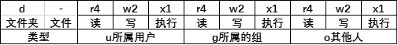

# 网易 2020 校招笔试- 系统开发/研发工程师（提前批）

## 1

有一类二叉树用三叉链表来存储的时候除了带有指向左右孩子节点的两个指针，还有指向父节点的指针，那么这样一棵二叉树有 2 个节点，那么有多少指针指向 NULL（注：根节点的父指针指向 NULL，对于不存在的节点表示为 NULL）？

正确答案: D   你的答案: 空 (错误)

```cpp
1
```

```cpp
2
```

```cpp
3
```

```cpp
4
```

```cpp
5
```

本题知识点

Java 工程师 C++工程师 网易 安全工程师 测试开发工程师 前端工程师 数据分析师 数据库工程师 算法工程师 iOS 工程师 安卓工程师 运维工程师 2020

讨论

[北斗酌美酒](https://www.nowcoder.com/profile/170736954)


发表于 2020-04-11 11:37:30

* * *

[流浪者 201907280945510](https://www.nowcoder.com/profile/60649645)

每个节点有 3 个指针，两个节点一共 6 个指针，其中 A 节点父节点指向 B 节点， B 节点子节点指向 A 节点，剩下的 4 个节点全部是 NULL

发表于 2020-02-17 09:51:27

* * *

[小水滴真的是太可爱了吧](https://www.nowcoder.com/profile/742091450)

**三叉链表存储表示**

改进于二叉链表，增加指向父节点的指针，能更好地实现结点间的访问。


发表于 2020-04-07 10:38:28

* * *

## 2

main 程序输出:

```cpp
interface Alpha {
    void f();
}
class Beta implements Alpha {
    public void f() {
        System.out.println("Beta.f()");
    }
    public void g() {
        System.out.println("Beta.g()");
    }
}
public class Main {
    public static void main(String[] args) {
        Alpha a = new Beta();
        a.f();
        System.out.println(a.getClass().getName());
        try {
            Beta b = (Beta)a;
            b.g();
        } catch (Exception e) {
            System.out.println("Error");
        }
    }
}
```

正确答案: B   你的答案: 空 (错误)

```cpp
Alpha

Error
```

```cpp
Beta.f()

Beta

Beta.g()
```

```cpp
Alpha

Beta.g()
```

```cpp
Beta.f()

Beta

Error
```

本题知识点

Java 工程师 网易 C++工程师 2020

讨论

[掌心里的小雨](https://www.nowcoder.com/profile/86073671)

考点：Java--多态

*   口诀：

    *   1.调用成员变量：编译和运行都参考左边。

    *   2.调用成员方法（非静态）：编译看左边，运行看右边

    *   3.调用静态方法：编译和运行都看左边。

*   题目中第 14 行代码`Alpha a = new Beta();`是多态的实现

*   题目中第 15 行代码`a.f();`是调用成员成员方法，满足口诀第 2 条，**编译看左边，运行看右边**，编译阶段看左边，Alpha 接口中含有`f()`方法，所以编译通过，运行时看右边，所以调用的是 Beta 类中的`f()`方法，所以**输出 Beta.f()**;

*   题目中第 16 行代码`a.getClass().getName()`中的`a.getClass()`同理运行调用的是 Beta 类的 Object 父类的本地方法`public final native Class<?> getClass();`，得到 Beta 类的 Class 对象，最后再调用 Class 类中的`public String getName()`方法，**最后输出 Beta**;

*   题目中第 18 行代码 Beta b = (Beta)a;向下转型为 Beta 类对象，所以可以直接调用 Beta 类的 g()方法，**最后输出 Beta.g()**。

发表于 2020-08-04 16:13:21

* * *

[offer-冲鸭](https://www.nowcoder.com/profile/447104610)

```cpp
        Alpha a = new Beta();
        System.out.println(Alpha.class);//interface Alpha
        System.out.println(a.getClass());//class Beta
        System.out.println(a.getClass().getName());//Beta
        System.out.println(Beta.class);//class Beta

        System.out.println(a.getClass()==Alpha.class);//false
        System.out.println(a.getClass()==Beta.class);//true

        Beta b = (Beta) a;
        System.out.println(b.getClass());//class Beta
```

发表于 2020-04-03 22:33:03

* * *

[等一手 offer](https://www.nowcoder.com/profile/123605437)

Alpha a = new Beta（）表明接口的引用变量 a 指向的是 Beta 对象，所以第一个输出为 Beta.f（）；a 所指向的是 Beta 对象，所以 a 的类名为 Beta；将 a 向下转型，由于 a 所指的对象就是 Btea 对象，转型成功，第三个输出为 Beta.g（）；

编辑于 2020-03-02 22:59:13

* * *

## 3

下列最短路径算法的叙述中正确的是（）

正确答案: B   你的答案: 空 (错误)

```cpp
Dijkstra 算法通常用于求每一对顶点间的最短路径；
```

```cpp
Dijkstra 算法不允许图中带有负权值的边，而 Floyd 算法则可以适用；
```

```cpp
Floyd 算法通常用于求某一顶点到其他各顶点的最短路径；
```

```cpp
Floyd 算法允许有包含负权值的边组成的回路，而 Dijkstra 算法不允许；
```

本题知识点

iOS 工程师 网易 Java 工程师 前端工程师 C++工程师 算法工程师 数据分析师 数据库工程师 2020

讨论

[vicyor](https://www.nowcoder.com/profile/2210832)

```cpp
1.Dijkstra 算法是计算图中的一个点到其它点的最小路径.
  算法思路: 贪心算法.
    将图中所有点分成 S(已求出解)和 U(未求出解)2 个点集.dist[i]表示 v0 到 v[i]当前已求得得最短路径.A[n][n]为边集
    1.从剩下的边集合中选出 dist 最短的边并将边的另一顶点 vi 从 U 中加入 S.
    2.更新与 vi 连接的所有且并未在 S 中的点的 dist 矩阵值,dist[vk]=min(dist[vk],dist[vi]+A(i,k)).
    3.重复上述操作直到 U 中无与 S 中的点相连的点.
2.Floyd 算法计算图中任意一对点的最短路径.
  算法思路:  T(n)=O(n³).
   动态规划法: Dis(i,j) =min(Dis(i,j), Dis(i,k) + Dis(k,j)).

```
 for(k=0;k<n;k++)
 　　{ 
       //A[i][j]初始为每点的边长. for(i=0;i<n;i++) for(j=0;j<n;j++) if(A[i][j]>(A[i][k]+A[k][j]))
             　　{
                   　　A[i][j]=A[i][k]+A[k][j];
                   　　path[i][j]=k;
              　 } 
    　} 
```cpp

3.Dijkstra 算法为啥不能存在负数边?

Dijkstra 中 S(已求出解)中的每一个点解即最短路径是已求出的,若存在负数路径,可能存在已求出的解不是最优解.

例:

A   3    B

4     -1000 

c 

由于贪心法 B 的最终结果为 3 而不是 -996,而 C 的结果正确 -997.

```

发表于 2020-02-17 15:57:16

* * *

[offer 快来球球了](https://www.nowcoder.com/profile/243031380)

注意 floyd 能有负权值的边，不能有负权值的回路！

发表于 2020-02-24 10:43:38

* * *

[青墨山音](https://www.nowcoder.com/profile/267670990)

B

发表于 2019-12-23 02:35:08

* * *

## 4

牛客网的某一网络的一台主机产生了一个 IP 数据报，头部长度为 20 字节，数据部分长度为 2000 字节，该数据报需要经过两个网络到达目的主机，这两个网络所允许的最大传输单位 MTU 分别为 1500 字节和 576 字节。那么原 IP 数据报到达目的主机时分成了（   ）IP 小报文？

正确答案: C   你的答案: 空 (错误)

```cpp
2
```

```cpp
3
```

```cpp
4
```

```cpp
5
```

本题知识点

Java 工程师 C++工程师 网易 安全工程师 大数据开发工程师 前端工程师 算法工程师 运维工程师 2020

讨论

[梦醒时分 2019](https://www.nowcoder.com/profile/477996513)

一个链路层帧能承载的最大数据量叫做最大传送单元（MTU）头部长度为 20 字节，数据部分长度为 2000 字节，该数据报需要经过两个网络到达目的主机，这两个网络所允许的最大传输单位 MTU 分别为 1500 字节和 576 字节。1、2000 字节（加上头部一共 2020 字节）的数据经过第一个 MTU 为 1500 字节的网络时，分为 2 个分片,分片 1（1500 字节）携带 1480 字节的数据，分片 2（540 字节）携带剩下的 520 字节的数据。2.分片 1（1480 字节的数据）经过第二个 MTU 为 576 字节的网络时，需要继续分片为 3 个 IP 小报文（分片 3、4、5），分片 3 和 4 各自携带 556（576-20=556）字节的数据，分片 5 携带剩下的 368 字节的数据。那么，总共分为了 4 个 IP 小报文

编辑于 2020-08-08 22:17:33

* * *

## 5

判断一个数组或序列是正序,倒序还是乱序,需要我们将这个数组完整的遍历一遍通过构建有序序列，对于未排序数据，在已排序序列中从后向前扫描，找到相应的位置并插入的排序算法是（ ）

正确答案: C   你的答案: 空 (错误)

```cpp
选择排序
```

```cpp
希尔排序
```

```cpp
插入排序
```

```cpp
归并排序
```

本题知识点

iOS 工程师 网易 安卓工程师 C++工程师 Java 工程师 安全工程师 测试工程师 大数据开发工程师 前端工程师 算法工程师 数据分析师 数据库工程师 运维工程师 2020

讨论

[Olivia_dtt](https://www.nowcoder.com/profile/232985383)

选择排序：每次从数组中选出一个最小数（最大数）放到数组最前面，存放在序列的起始位置，直到全部待排序的数据元素排完。希尔排序：设置增量分割数组，逐步进行直接插入排序,增量逐趟减少,并最后使得整个数组基本有序,再对整体进行直接插入排序。插入排序：构建有序序列，未排序数据依次从已排序数据按从后往前比较，插入到合适的位置。归并排序：把序列分成两个长度为 n/2 的子序列，对这两个子序列分别归并排序（循环将两个数组的第一个值比较，并弹出第一个值， 直到数组长度都不存在），将两个排序好的子序列合并成一个最终的排序序列

发表于 2020-04-06 20:12:11

* * *

[牛客 929822447 号](https://www.nowcoder.com/profile/929822447)


插入排序—直接插入排序：


希尔排序：

 

选择排序：

 

归并排序：


发表于 2020-08-24 18:42:35

* * *

## 6

死锁是指多个进程在运行过程中因争夺资源而造成的一种僵局，永远在互相等待的进程称为死锁进程，假设计算机系统中有 3 个不同的临界资源 R1、R2 和 R3，被 4 个进程 p1、p2、p3 及 p4 共享。各进程对资源的需求为：p1 申请 R1 和 R2，p2 申请 R2 和 R3，p3 申请 R1 和 R3，p4 申请 R2。若系统出现死锁，则处于死锁状态的进程数至少是（  ）

正确答案: C   你的答案: 空 (错误)

```cpp
1
```

```cpp
2
```

```cpp
3
```

```cpp
4
```

本题知识点

iOS 工程师 网易 安卓工程师 C++工程师 Java 工程师 测试工程师 测试开发工程师 大数据开发工程师 前端工程师 算法工程师 数据库工程师 2020

讨论

[彭彭の零柒](https://www.nowcoder.com/profile/390870854)

3 个.这种情况： p1 占用 r1,p2 占用 r2，p3 占用 r3，p1 申请 r2，p2 申请 r3，p3 申请 r1，无限等待释放资源

发表于 2020-02-21 21:58:02

* * *

[我是复读机](https://www.nowcoder.com/profile/162099353)

要理解死锁的概念。死锁的进程必须是已经占有了某个资源，同时在请求其他资源，而且不会主动释放已占有的资源。如果几个进程循环等待其他进程已占有的资源，就陷入了死局，就死锁了。

发表于 2020-04-21 17:16:12

* * *

[猫仔面](https://www.nowcoder.com/profile/4548438)

我的理解：对于本题，有 3 个资源，所以如果出现死锁（环形等待），必定至少需要 3 个进程来分别占有 3 个资源（感觉怪怪的）

发表于 2020-08-06 15:18:29

* * *

## 7

下面关于 Java NIO 提供了与标准 IO 不同的 IO 工作方式描述错误的是

正确答案: A   你的答案: 空 (错误)

```cpp
NIO 的非阻塞特性是通过锁来实现的
```

```cpp
标准的 IO 基于字节流和字符流进行操作的，而 NIO 是基于通道（Channel）和缓冲区（Buffer）进行操作
```

```cpp
Java NIO 可以让你异步的使用 IO，例如：当线程从通道读取数据到缓冲区时，线程还是可以进行其他事情
```

```cpp
Java NIO 引入了选择器的概念，选择器用于监听多个通道的事件
```

本题知识点

Java 工程师 网易 C++工程师 2020

讨论

[vicyor](https://www.nowcoder.com/profile/2210832)

1.NIO 是同步非阻塞,通过选择器 Selector 监听多个通道(Channel),响应其感兴趣的事件(每个通道在选择器上注册的事件).(Reactor 模式)

发表于 2020-02-17 16:30:14

* * *

[Jiang 锋](https://www.nowcoder.com/profile/961788916)

NIO 的非阻塞特性是通过 selector 来实现的, 而不是加锁

发表于 2020-12-06 10:20:46

* * *

[送外卖的程序员](https://www.nowcoder.com/profile/617384004)

NIO 是同步非阻塞 IO，从通道中读取数据到缓冲区过程是是同步的，AIO 才是异步的

发表于 2020-08-06 17:03:44

* * *

## 8

读程序，选出输出结果

```cpp
public static void main(String[] args) {
    Nowcoder nowcoder = new Nowcoder();
    int i = 0;
    nowcoder.inc(i);
    i = i++;
    System.out.println(i);
}
void inc(int i) {
    i++;
}
```

正确答案: A   你的答案: 空 (错误)

```cpp
0
```

```cpp
1
```

```cpp
2
```

```cpp
3
```

本题知识点

Java 工程师 网易 C++工程师 2020

讨论

[tigg_ZZ](https://www.nowcoder.com/profile/288548751)

可以细分出几种情况：1）i += 1;  这种情况下在 i = 0 之上赋值 0+1 也就是输出 12）i = i++； 第一步：i++这个表达式会返回 0，但此时 i = 1； 第二步：将返回值 0 赋值给 i ；第三步： i 又被更改为 0，所以输出 03）i = ++i; 第一步： ++i 这个表达式会返回 1，同时 i = 1； 第二步：将返回值 1 赋值给 i ； 第三步：i = 14）i++； 很常用的方式，这里的返回值并没有赋值给任何变量，所以在输出时，会发现 i = 1；

编辑于 2020-07-29 22:49:02

* * *

[爱吃蘑菇的麒麟](https://www.nowcoder.com/profile/7034395)

答案选 A. 0 inc() 方法中的 i++ 并没有返回，所以排除这个方法的干扰。 调用 inc()之后，i = 0; 然后把 i++ 赋给 i; 相当于最后输出的是：i++ 因此结果任然等于 0

发表于 2019-11-29 18:28:29

* * *

[“帆布鞋、](https://www.nowcoder.com/profile/8962669)

该题目已经经过代码验证，最后结果确实为 0。 i = i++; 这一行代码可以分为三个步骤： 1.将 i 赋值给临时变量(假设为 temp)，JVM 是如此操作的 2.i 自加变为 1 3.将 temp 值赋值给 i 因此，最后 i=0

发表于 2020-02-10 23:54:53

* * *

## 9

ls -l 命令有以下输出，描述正确的是

正确答案: D   你的答案: 空 (错误)

```cpp
default.etcd 为可执行文件，只能被 root 执行
```

```cpp
go 目录占的磁盘空间大小为 4KB
```

```cpp
install-client.sh 脚本可以用./install-client.sh 命令执行
```

```cpp
go 文件夹可以被任意用户浏览
```

本题知识点

安卓工程师 网易 C++工程师 Java 工程师 安全工程师 测试工程师 测试开发工程师 大数据开发工程师 前端工程师 数据库工程师 iOS 工程师 运维工程师 2020

讨论

[我是复读机](https://www.nowcoder.com/profile/162099353)

A 是目录，不是文件；B 也是目录，所以 4096 表示的是该目录符所占的大小（注意，4096 不表示该目录下所有文件的大小）；C 没有 x 权限，不能直接./运行，但可以用 sh 运行；D 正确

发表于 2020-04-21 19:41:36

* * *

[offer-冲鸭](https://www.nowcoder.com/profile/447104610)

首先 d 表示这个文件是一个文件夹，然后文件的权限用其后一共有 9 个字符表示，分成三组，分别表示文件所属用户的权限，文件所属用户组的权限，其他人的权限，r 表示读权限, w 表示写权限， x 表示执行权限，你给的这个例子就是说 这是个文件夹，并且此文件所属用户拥有读、写、执行三项权限，其余的用户组，其他用户不拥有任何权限（全部都是-）--转

发表于 2020-04-03 22:52:49

* * *

[HEREISDAVID](https://www.nowcoder.com/profile/864672146)



发表于 2020-09-27 20:12:49

* * *

## 10

访问记录 visit 表中包含日期 date,用户 user_id,访问的页面 url 3 个字段，以下哪个选项不能计算'2019-03-11'这一天访问过页面的所有用户数

正确答案: D   你的答案: 空 (错误)

```cpp
SELECT count(user_id) FROM (SELECT user_id FROM visit WHERE date = '2019-03-11'  GROUP BY user_id) f
```

```cpp
SELECT count(user_id) FROM (SELECT DISTINCT user_id FROM visit WHERE date = '2019-03-11') f
```

```cpp
SELECT count(DISTINCT user_id) FROM visit WHERE date = '2019-03-11'
```

```cpp
SELECT count(user_id) FROM visit WHERE date = '2019-03-11' GROUP BY date
```

本题知识点

iOS 工程师 网易 安卓工程师 C++工程师 Java 工程师 测试工程师 测试开发工程师 大数据开发工程师 数据分析师 数据库工程师 2020

讨论

[vicyor](https://www.nowcoder.com/profile/2210832)

D . SELECT count(user_id) FROM visit WHERE date = '2019-03-11' GROUP BY date    问题: 1.user_id 未去重             2.已经通过 where 选出 date 了,group by 无意义.修改: SELECT count(user_id) FROM visit WHERE date = '2019-03-11' GROUP BY user_id

发表于 2020-02-17 16:47:43

* * *

[牛客 656547734 号](https://www.nowcoder.com/profile/656547734)

选项 A 

```cpp
SELECT count(user_id) FROM (SELECT user_id FROM visit WHERE date = '2019-03-11'  GROUP BY user_id) fK
我选这个了，这个的确无法直接得到结果，但是题目问的是无法计算，这个结果通过人工计算还是可以计算出最终结果的，我觉得迷惑性的确很大。
```

发表于 2020-04-25 16:41:28

* * *

[aruruff](https://www.nowcoder.com/profile/509544345)

```cpp
除重归纳用户 id 为表 f 再计算 A   SELECT count(user_id) FROM (SELECT user_id FROM visit WHERE date = '2019-03-11'  GROUP BY user_id) f
```

  B    SELECT count(user_id) FROM (SELECT DISTINCT user_id FROM visit WHERE date = '2019-03-11') f
C 简单的用除重函数
D

```cpp
 GROUP BY 日期再

```
WHERE 日期 nono
```cpp

```

```cpp
WHERE date = '2019-03-11' GROUP BY date  
```

发表于 2019-12-11 11:58:15

* * *

## 11

java 数据库开发中怎么理解两个方法数据库操作在一个事务里面，事务和数据库连接池有什么关系，JTA 事务和普通事务的区别

你的答案

本题知识点

Java 工程师 网易 C++工程师 2020

讨论

[vicyor](https://www.nowcoder.com/profile/2210832)

1.数据库的事务交给 JDBC 的 Connection 去处理.   connection.autoCommit(false); //相当于在数据库端开启事务 start transaction;   connection.setTransactioIsolation(isolation); //设置隔离级别;   connection.commit(); //提交事务   connection.rollback(savePoint);//回滚 2.JTA 是指 Java Transaction API,JTA 允许应用程序执行分布式事务处理.   分布式事务(distributed transaction)包括一个事务管理器(transaction manager)和一个或多个资源管理器(resource manager).

发表于 2020-02-17 17:54:57

* * *

[平心-三七互娱招聘内推官](https://www.nowcoder.com/profile/2204326)

两个方法使用连接池中同一个连接

发表于 2020-02-17 17:22:21

* * *

[Fate 鹏飞](https://www.nowcoder.com/profile/179775804)

事务：指的是一组操作，里面包含许多个单一的逻辑，只要有一个逻辑没有执行成功，那么都算失败，所有的数据都回到最初的状态。事务在默认情况下是自动提交的。(事务指针对连接对象)。

1)数据库的连接对象创建工作，比较消耗性能。
2)一开始先在内存中开辟一块空间（集合），一开始先往里面放置多个连接对象。后面如果需要连接， 直接从里面取，不要自己创建连接。使用完毕后，要归还连接，确保连接对象可以循环利用。

发表于 2020-04-07 17:37:25

* * *

## 12

在并发编程有个名称叫线程安全，怎么理解一个类是线程安全

你的答案

本题知识点

Java 工程师 网易 C++工程师 2020

讨论

[vicyor](https://www.nowcoder.com/profile/2210832)

1.安全性是指不会有意外的事情发生.2.一个类是线程安全的指的是该类的域不会因为并发修改而出现一致性问题.

发表于 2020-02-17 17:55:40

* * *

[江璇 Up](https://www.nowcoder.com/profile/188879639)

这个类我们称之为资源类，使用多个线程去操作资源类；一般的操作是具有顺序性的，单线程时候就是方法顺序执行，方法对数据操作后再把数据写回去，下一个方法在对数据进行操作，所以不会出现读一些错误的数据，或者被修改后的数据没有及时的写回到内存中；如果一个类是线程安全的，那么相当于在这个类的对象和和模板上加了一把锁一样，当一个线程在操作这个类的时候，其他的线程是不被允许同时操作的，只有等这个线程完成对资源类的操作后，其他的线程才可以获得这个锁，操作资源类，继续加锁，执行，解锁。常见的保持一个类线程安全的方法有：1、使用 sychronized 线程同步锁 2、使用 Lock 对需要操作的 对象加锁等等

发表于 2020-04-06 22:48:22

* * *

[慕宗悫之长风](https://www.nowcoder.com/profile/245528289)

类的线程安全：一个类能表现出正确的行为，称这个类是线程安全的。如何保证线程安全：（1）栈封闭。（2）将状态变量修改为不可变变量。（3）对于必须要共享的变量：1、独占锁的方式：synchronized2、volatile 修饰变量：只能保证可见性不能保证一致性，适合用于当前要修改的值不依赖于先前值的情况。3、显示锁。Lock 接口的各种实现。4、原子变量。

发表于 2020-08-02 20:21:22

* * *

## 13

小易是班级的英语课代表, 他开发了一款软件开处理他的工作。
小易的软件有一个神奇的功能，能够通过一个百分数来反应你的成绩在班上的位置。“成绩超过班级 ...% 的同学”。
设这个百分数为 p，考了 s 分，则可以通过以下式子计算得出 p：
p = ( 分数不超过 s 的人数 - 1)  班级总人数 
突然一天的英语考试之后，软件突然罢工了，这可忙坏了小易。成绩输入这些对于字写得又快又好的小易当然没有问题，但是计算这些百分数……这庞大的数据量吓坏了他。
于是他来找到你，希望他编一个程序模拟这个软件：给出班级人数 n，以及每个人的成绩，请求出某几位同学的百分数。

本题知识点

iOS 工程师 网易 Java 工程师 测试开发工程师 前端工程师 C++工程师 安卓工程师 安全工程师 2020

讨论

[Muche](https://www.nowcoder.com/profile/259486465)

前缀和即可，查询时就是 O（1）复杂度

```cpp
 import java.util.*;

public class Main{
    public static void main(String[] args) {
        Scanner in = new Scanner(System.in);
        int n = in.nextInt();
        int[] stu = new int[n];
        int[] grade = new int[151];
        int[] profix = new int[152];
        for (int i = 0; i < n; i++) {
            stu[i] = in.nextInt();
            grade[stu[i]]++;
        }
        profix[0] = grade[0];
        for (int i = 1; i <= 150; i++) {
            profix[i] = profix[i - 1] + grade[i];
        }
        int q = in.nextInt();
        for (int i = 0; i < q; i++) {
            int idx = in.nextInt();
            double x = (profix[stu[idx - 1]] - 1) / (double)n;
            System.out.println(String.format("%.6f", x * 100));
        }
    }

}
```

编辑于 2020-08-08 16:57:59

* * *

[dragonlogin](https://www.nowcoder.com/profile/2071677)

思路

发现分数最大值是 150， 题目要求每次找不超过分数 x 的人数，需要找 10000 次。

*   考虑暴力解法
    每次找不超过分数 x 的人数，都遍历一次数组，需要遍历 10000 次，肯定超时
*   优化
    优化可以优先考虑空间换时间， 所以可以用 map 存每个分数的人数，然后遍历分数就可以了，最多只需要遍历 150 次

```cpp
#include <bits/stdc++.h>
using namespace std;
const int N = 10010, M = 160;
int a[N], mp[M];
int n, q;
int main() {
    scanf("%d", &n);
    memset(mp, 0, sizeof mp);
    for (int i = 1; i <= n; ++ i) {
        scanf("%d", &a[i]);
        mp[a[i]] ++ ;
    }
    scanf("%d", &q);
    int x;
    while (q -- ) {
        scanf("%d", &x);
        int cnt = 0;
        for (int i = 0; i <= a[x]; ++ i) {
            cnt += mp[i] ;
        }
        // 必须用 double，用 float 错误
        double ret = (cnt - 1) * 100.0 / n ;
        printf("%.6lf\n", ret);
    }

    return 0;
}

```

发表于 2020-07-30 18:17:51

* * *

[牛客 717970517 号](https://www.nowcoder.com/profile/717970517)

```cpp
#include<iostream>
#include<algorithm>
#include<vector>
using namespace std;
int main()
{
	vector<int>scores;
	int n;  //班级人数
	cin >> n;
	int* a = new int[n];
	for (int i = 0; i < n; i++)
	{
		cin >> a[i];        //每个学生的分数
	}
	int q;   //询问的次数
	cin >> q;
	for (int i = 0; i < q; i++)
	{
		int bianhao;
		cin >> bianhao;      //询问的是哪个学生
		scores.push_back(a[bianhao-1]);       //q 个学生的成绩放入 vector 中
	}
	sort(a, a + n);
	for (int i = 0; i < q; i++)
	{
		for (int j = n - 1; j >= 0; j--)
		{
			if (a[j] == scores[i])
			{

				double percent = j*100.0 / n;
				printf("%.6lf\n", percent);
				break;
			}
		}
	}
}
```

发表于 2020-08-07 15:47:08

* * *

## 14

小易有一个体积巨大的货物，具体来说，是个在二维平面上占地的货物。
小易有一个的广场，想把货物放在这个广场上。不幸的是，广场上已经有了一些障碍物，障碍物所在的格子不能放置你的货物。小易现在想知道能否成功地放置货物。

本题知识点

iOS 工程师 网易 Java 工程师 C++工程师 安全工程师 算法工程师 运维工程师 2020

讨论

[dragonlogin](https://www.nowcoder.com/profile/2071677)

思路

就是力扣 85 题最大矩阵和的思路。
把障碍点设为 1，非障碍点设为 0，跑一遍求最大矩阵的代码，同时记录最大矩阵面积为 eara，长和宽最大值 maxv 和最小值 minv，
如果 eara > c * d && maxv > max(c, d) && minv > min(c, d), 返回 YES，否则 NO

```cpp
#include <bits/stdc++.h>
using namespace std;
const int N = 1010, M = 160;

int t, n, m, k, c, d;

char mat[N][N];
int help(vector<int>& a,int &minv, int& maxv) {
    int n = a.size();

    int tt = 0;
    vector<int> stk(n + 10), left(n), right(n);

    for (int i = 0; i < n; ++ i) {
        while (tt && a[stk[tt]] >= a[i]) tt--;

        if (tt) left[i] = stk[tt];
        else left[i] = -1;

        stk[++ tt] = i;
    }

    tt = 0;

    for (int i = n - 1; ~i; -- i) {
        while (tt && a[stk[tt]] >= a[i]) tt--;

        if (tt) right[i] = stk[tt];
        else right[i] = n;

        stk[++ tt] = i;
    }

    int ret = 0;
    for (int i = 0; i < n; ++ i) {

        int erea = (right[i] - left[i] - 1) * a[i];
        if (ret < erea) {
            ret = erea;
            minv = min({a[i], right[i] - left[i] - 1});
            maxv = max({a[i], right[i] - left[i] - 1});
        }
    }

    return ret;
}
int main() {
    cin >> t;
    while (t -- ) {
        cin >> n >> m >> k;
        int x, y;
        memset(mat, 0, sizeof mat);
        for (int i = 1; i <= k ; ++i ) {
            cin >> x >> y;
            mat[x - 1][y - 1] = '1';
        }
        cin >> c >> d;

        vector<int> a(m + 1);
        int ret = 0;
        bool f = false;
        for (int i = 0; i < n; ++ i) {
            for (int j = 0; j < m; ++ j) {
                if (mat[i][j] == '1')
                    a[j] = 0;
                else
                    a[j] ++ ;
            }
            int minv = 0, maxv = 0;
            int ans = help(a, minv, maxv);

            if (ans >= c * d && minv >= (min(c, d)) && (maxv >= (max(d,c)))) {
                f = true;
                break;
            }

        }
        if (f)
            cout << "YES" <<endl;
        else
            cout << "NO" << endl;
    }

    return 0;
}
```

发表于 2020-07-30 14:57:47

* * *

[远征的梦想](https://www.nowcoder.com/profile/216070581)

抄 [NotDeep](https://www.nowcoder.com/profile/906271) 大佬的答案

```cpp
import java.util.Scanner;

public class Main {

    private static Scanner sc;

    public static void main(String[] args) {
        sc = new Scanner(System.in);
        int t = sc.nextInt();//组数
        for (int a = 0; a < t; a++) {
            int n = sc.nextInt();//广场长(宽)
            int m = sc.nextInt();//广场长(宽)
            int k = sc.nextInt();//障碍物个数
            int[][] grid = new int[n + 10][m + 10];
            for (int i = 0; i < k; i++) {//填入障碍物坐标
                grid[sc.nextInt()][sc.nextInt()] = 1;
            }
            for (int row = 1; row < n; row++) {
                for (int col = 1; col < m; col++) {
                    grid[row][col] += grid[row - 1][col] + grid[row][col - 1] - grid[row - 1][col - 1];
                }
            }
            int c = sc.nextInt();//货物长(宽)
            int d = sc.nextInt();//货物长(宽)
            boolean findPosition = false;
            for (int row = 1; row < n - c + 1; row++) {
                for (int col = 1; col < m - d + 1; col++) {
                    int ok = grid[row + c - 1][col + d - 1] - grid[row + c - 1][col - 1] - grid[row - 1][col + d - 1] + grid[row - 1][col - 1];
                    if (ok == 0) {
                        System.out.println("YES");
                        findPosition = true;
                        break;
                    }
                }
                if (findPosition) {
                    break;
                }
            }
            if (!findPosition) {
                System.out.println("NO");
            }
        }
    }
}
```

发表于 2020-04-04 02:03:48

* * *

[华科菜菜子](https://www.nowcoder.com/profile/296943498)

对于一个 m*n 的货物，检测其能否放在 x,y 处，只需检测在(x,y)到（x+m,y+n）(竖着放)或者（x+n,y+m）（横着放）两点构成的矩形范围内有没有障碍物，且在范围内。

发表于 2020-12-10 11:03:32

* * *

## 15

小易在维护数据的时候遇到一个需求，具体来说小易有一系列数据，这些数据了构成一个长度为 n 的数字序列，接下来小易会在这个序列上进行 q 次操作。
每次操作有一个查询的数字 x，小易需要将序列数据中所有大于等于 x 的数字都减一，并输出在本次操作中有多少个数字被减一了。
小易犯了难，希望你能帮帮他。

本题知识点

安卓工程师 网易 Java 工程师 测试工程师 前端工程师 C++工程师 算法工程师 数据分析师 2020

讨论

[dragonlogin](https://www.nowcoder.com/profile/2071677)

思路

*   暴力解法
    暴力解法很容易想到，直接按题目说的来做就可以了
*   优化
    这个数据量，显然需要用 O(nlogn)或者 O(n)算法，则会想到排序，如果从大到小排，那么每次查询一个数字 x，使得大于等于 x 的数字都会-1，那么数列还是有序的。也就是数列始终都是有序的，这样就可以进行剪枝了，遍历到小于 x 的直接 break 跳出循环即可。

```cpp
#include <bits/stdc++.h>
using namespace std;
const int N = 200010;
int a[N], hs[N];
int n, q, x;

int main() {
    scanf("%d%d", &n, &q);
    int x;
    for (int i = 1; i <= n; ++ i) {
        scanf("%d", &a[i]);
    }
    sort(a + 1, a + n + 1, greater<int>());

    while (q -- ) {
        scanf("%d", &x);
        int ret = 0;
        for (int i = 1; i <= n; ++ i) {
            if (a[i] >= x) {
                a[i] -= 1;
                ret ++ ;
            } else {
                break;
            }
        }
        printf("%d\n", ret);
    }
    return 0;
}

```

发表于 2020-07-30 18:19:16

* * *

[孝陵卫的风](https://www.nowcoder.com/profile/645847812)

```cpp
import java.util.Arrays;
import java.util.Scanner;

public class Main {
    public static void main(String[] args) {
        Scanner scanner = new Scanner(System.in);
        int n = scanner.nextInt();
        int q = scanner.nextInt();
        int[] arr = new int[n];
        //将数字录入数组
        for (int i = 0; i < n; i++) {
            int num = scanner.nextInt();
            arr[i] = num;
        }
        //先将数组排序
        Arrays.sort(arr);
        //查询次数
        for (int i = 0; i < q; i++) {
            //需要查询的数字
            int x = scanner.nextInt();
            System.out.println(demo4(arr, x));
        }
    }

    public static int demo4(int[] arr, int x) {
        int count = 0;
        //从大往小比较，碰到小于 x 的及时终止循环，能优化时间
        for (int i = arr.length-1; i >= 0; i--) {
            if (arr[i] >= x) {
                arr[i]--;
                count++;
            } else {
                break;
            }
        }
        return count;
    }
}

```

编辑于 2020-04-06 16:21:20

* * *

[miraclequester](https://www.nowcoder.com/profile/347359971)

线段树+二分，O（n (logn)²）

```cpp
#include<bits/stdc++.h>
using namespace std;
#define inf 0x3f3f3f3f
#define ll long long
const int N=2e5+5;
const double eps=1e-8;
const double PI = acos(-1.0);
#define lowbit(x) (x&(-x))
int sum[N<<2],add[N<<2];
int a[N];
void pushUp(int rt)
{
    sum[rt]=sum[rt<<1]+sum[rt<<1|1];
}
void build(int l,int r,int rt)
{
    if(l==r)
    {
        sum[rt]=a[l];
        return;
    }
    int m=(l+r)>>1;
    build(l,m,rt<<1);
    build(m+1,r,rt<<1|1);
    pushUp(rt);
}
void pushDown(int rt,int ln,int rn)
{
    if(add[rt])
    {
        add[rt<<1]+=add[rt];
        add[rt<<1|1]+=add[rt];
        sum[rt<<1]+=add[rt]*ln;
        sum[rt<<1|1]+=add[rt]*rn;
        add[rt]=0;
    }
}
void update(int L,int R,int C,int l,int r,int rt)
{
    if(L <= l && r <= R)
    {
        sum[rt]+=C*(r-l+1);
        add[rt]+=C;
        return ;
    }
    int m=(l+r)>>1;
    pushDown(rt,m-l+1,r-m);
    if(L <= m) update(L,R,C,l,m,rt<<1);
    if(R >  m) update(L,R,C,m+1,r,rt<<1|1);
    pushUp(rt);
}
int query(int L,int R,int l,int r,int rt)
{
    if(L <= l && r <= R)
    {
        return sum[rt];
    }
    int m=(l+r)>>1;
    pushDown(rt,m-l+1,r-m);
    int ans=0;
    if(L <= m) ans+=query(L,R,l,m,rt<<1);
    if(R >  m) ans+=query(L,R,m+1,r,rt<<1|1);
    return ans;
}
int main()
{
    std::ios::sync_with_stdio(false);
    int n,q;
    while(cin>>n>>q)
    {
        memset(add,0,sizeof(add));
        for(int i=1; i<=n; i++)
        {
            cin>>a[i];
        }
        sort(a+1,a+1+n);
        build(1,n,1);
        while(q--)
        {
            int l=1,r=n,m,ans=-1,x;
            cin>>x;
            while(l<=r)
            {
                m=(l+r)>>1;
                if(query(m,m,1,n,1)>=x)
                {
                    r=m-1;
                    ans=m;
                }
                else
                {
                    l=m+1;
                }
            }
            if(ans==-1)
            {
                cout<<0<<endl;
            }
            else
            {
                cout<<n-ans+1<<endl;
                update(ans,n,-1,1,n,1);
            }
        }
    }
    return 0;
}

```

编辑于 2020-04-04 20:47:09

* * *

## 16

小易有一个初始为空的数字集合，支持两种操作：
1、加入数字 x 到集合中。
2、询问集合中是否存在一个子集，满足子集中所有数字的 Or 值恰好为 k。Or 为二进制按位或操作，C++中表示为"|"。
小易希望你能解决这个问题。

本题知识点

iOS 工程师 网易 安卓工程师 C++工程师 Java 工程师 安全工程师 测试工程师 大数据开发工程师 数据分析师 2020

讨论

[dragonlogin](https://www.nowcoder.com/profile/2071677)

思路

难点就是：怎么在一个集合 a 中判断是否存在一个子集，使得子集中所有元素 或运算后的结果为 x

*   暴力想法
    找到集合 a 中的所有子集，然后一一判断是否满足条件。
    子集个数一共有 2^n,n 为集合元素个数。所以肯定超时

*   优化
    有没有可能遍历一遍集合，就可以完成。
    假设元素 x 的二进制为 100100101
    如果存在 a1 | a2 | a3 | 。。。 | an = x
    根据 | 的特点，
    0 | 0 = 0,
    1 | 0 = 1,
    0 | 1 = 1,
    1 | 1 = 1
    如果我 x 的倒数第二位是 0，那么 a1, a2,…,an 的倒数第二位肯定不能为 1
    所以，需要满足 a1 | x = x, a2 | x = x,可以用反证法证明。

```cpp
#include <bits/stdc++.h>
using namespace std;
const int N = 100010;
bool st[N];
int q, o, x;

int main() {
    scanf("%d", &q);
    vector<int> a;
    while (q --) {
        scanf("%d%d", &o, &x);
        if (o == 1) {
            if (st[x] == false)
                a.push_back(x);
                st[x] = true;
        }
        else {
            int y = 0;
            for (int v : a) {
                if ((v | x) == x)
                    y |= v;
            }

            if (y == x) {
                printf("YES\n");
            }
            else {
                printf("NO\n");
            }
        }
    }
    return 0;
}

```

发表于 2020-07-30 18:20:07

* * *

[Fzldq](https://www.nowcoder.com/profile/209755777)

```cpp
import sys

def main():

    def exist(x):
        y = 0
        for i in lst:
            if i | x == x:
                y |= i
                if x == y:
                    return True
        else:
            return False

    lst = set()
    res = []
    q = int(sys.stdin.readline().strip())
    m = map(int, sys.stdin.read().split())
    xlst = list(zip(m, m))
    for i, j in xlst:
        if i == 1:
            lst.add(j)
        else:
            res += ['YES' if exist(j) else 'NO']
    print(*res, sep='\n')

if __name__ == '__main__':
    main()
```

Python 玩这种题就是亏，只能过 60%

编辑于 2020-07-20 15:51:08

* * *

[帽子短了](https://www.nowcoder.com/profile/571009756)

```cpp
#include <iostream>
#include <string>
#include <vector>
using namespace std;
bool isexist(vector<int> temp,int x)
{
	int y = 0;
	for (int i = 0; i < temp.size(); i++)
	{
		if ((x | temp[i]) == x)
			y = y | temp[i];
	}
	return x == y;
}
int main()
{
	int n;
	cin >> n;
	vector<int> temp;
	while (n--)
	{
		int a, x;
		cin >> a >> x;
		if (a == 1)
			temp.push_back(x);
		else
		{
			if (isexist(temp, x))
				cout << "YES" << endl;
			else
				cout << "NO" << endl;
		}	
	}
	system("pause");
	return 0;
}
```

发表于 2020-06-17 19:47:52

* * *