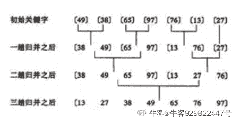

# 网易 2020 校招笔试- 移动安全工程师（提前批）

## 1

App 被加密 apple 加密后，如果我们要进行反编译就要先解除加密，下面不能解除加密的工具是

正确答案: D   你的答案: 空 (错误)

```cpp
gdb
```

```cpp
clutch
```

```cpp
dumpdecrypted
```

```cpp
OD
```

本题知识点

iOS 工程师 安卓工程师 安全工程师 网易 2020

## 2

以下哪些功能不是安卓逆向中 ADB 的常用功能？

正确答案: D   你的答案: 空 (错误)

```cpp
查看 logcat 日志
```

```cpp
端口转发
```

```cpp
shell 命令
```

```cpp
hook 进程
```

本题知识点

iOS 工程师 安卓工程师 安全工程师 网易 2020

讨论

[tfire](https://www.nowcoder.com/profile/990332093)

d

发表于 2021-01-14 01:27:22

* * *

## 3

下面对名称替换的概念性说法有误的是?

正确答案: B   你的答案: 空 (错误)

```cpp
把程序里面有意义的类、方法和字段替换无意义随机文本
```

```cpp
无意义的随机文有自动还原方法
```

```cpp
替换人员识别
```

```cpp
用 Proguard 自动还原
```

本题知识点

iOS 工程师 安卓工程师 安全工程师 网易 2020

## 4

（Android 系统中）java 代码反编译之后那种字节码方便于读取

正确答案: C   你的答案: 空 (错误)

```cpp
Java 字节码
```

```cpp
jvm 字节码
```

```cpp
Dalvik 字节码
```

```cpp
class 字节码
```

本题知识点

iOS 工程师 安卓工程师 安全工程师 网易 2020

## 5

DexClassData 类分别定义信息里不包括的是?

正确答案: C   你的答案: 空 (错误)

```cpp
Method 信息
```

```cpp
Code 信息
```

```cpp
Attribute 信息
```

```cpp
ClassDataHeadr 信息
```

本题知识点

Java 工程师 C++工程师 网易 安全工程师 iOS 工程师 安卓工程师 2020

## 6

有一类二叉树用三叉链表来存储的时候除了带有指向左右孩子节点的两个指针，还有指向父节点的指针，那么这样一棵二叉树有 2 个节点，那么有多少指针指向 NULL（注：根节点的父指针指向 NULL，对于不存在的节点表示为 NULL）？

正确答案: D   你的答案: 空 (错误)

```cpp
1
```

```cpp
2
```

```cpp
3
```

```cpp
4
```

```cpp
5
```

本题知识点

Java 工程师 C++工程师 网易 安全工程师 测试开发工程师 前端工程师 数据分析师 数据库工程师 算法工程师 iOS 工程师 安卓工程师 运维工程师 2020

讨论

[北斗酌美酒](https://www.nowcoder.com/profile/170736954)


发表于 2020-04-11 11:37:30

* * *

[流浪者 201907280945510](https://www.nowcoder.com/profile/60649645)

每个节点有 3 个指针，两个节点一共 6 个指针，其中 A 节点父节点指向 B 节点， B 节点子节点指向 A 节点，剩下的 4 个节点全部是 NULL

发表于 2020-02-17 09:51:27

* * *

[小水滴真的是太可爱了吧](https://www.nowcoder.com/profile/742091450)

**三叉链表存储表示**

改进于二叉链表，增加指向父节点的指针，能更好地实现结点间的访问。


发表于 2020-04-07 10:38:28

* * *

## 7

计算机操作系统中，索引顺序文件是顺序文件的扩展，各类记录为顺序排列，现假设牛客网人力资源部门某个文件为索引顺序文件，由 5 个逻辑记录组成，每个逻辑记录的大小与磁盘块的大小相等，均为 512B，并依次存放在 50、121、75、80、63 号磁盘块上。若要存取文件的第 1569 逻辑字节处的信息，则要访问（   ）号磁盘块。

正确答案: C   你的答案: 空 (错误)

```cpp
3
```

```cpp
75
```

```cpp
80
```

```cpp
63
```

本题知识点

Java 工程师 C++工程师 网易 安全工程师 前端工程师 iOS 工程师 安卓工程师 运维工程师 2020

讨论

[小生哥](https://www.nowcoder.com/profile/6980746)

1569/512=3...33 要访问字节的逻辑记录号为 3,对应的物理磁盘块号为 80。

发表于 2019-12-31 13:22:47

* * *

[Fat-Tiger](https://www.nowcoder.com/profile/8187487)

一块一块地读，一块大小 512B

发表于 2019-11-30 16:03:04

* * *

## 8

判断一个数组或序列是正序,倒序还是乱序,需要我们将这个数组完整的遍历一遍通过构建有序序列，对于未排序数据，在已排序序列中从后向前扫描，找到相应的位置并插入的排序算法是（ ）

正确答案: C   你的答案: 空 (错误)

```cpp
选择排序
```

```cpp
希尔排序
```

```cpp
插入排序
```

```cpp
归并排序
```

本题知识点

iOS 工程师 网易 安卓工程师 C++工程师 Java 工程师 安全工程师 测试工程师 大数据开发工程师 前端工程师 算法工程师 数据分析师 数据库工程师 运维工程师 2020

讨论

[Olivia_dtt](https://www.nowcoder.com/profile/232985383)

选择排序：每次从数组中选出一个最小数（最大数）放到数组最前面，存放在序列的起始位置，直到全部待排序的数据元素排完。希尔排序：设置增量分割数组，逐步进行直接插入排序,增量逐趟减少,并最后使得整个数组基本有序,再对整体进行直接插入排序。插入排序：构建有序序列，未排序数据依次从已排序数据按从后往前比较，插入到合适的位置。归并排序：把序列分成两个长度为 n/2 的子序列，对这两个子序列分别归并排序（循环将两个数组的第一个值比较，并弹出第一个值， 直到数组长度都不存在），将两个排序好的子序列合并成一个最终的排序序列

发表于 2020-04-06 20:12:11

* * *

[牛客 929822447 号](https://www.nowcoder.com/profile/929822447)


插入排序—直接插入排序：


希尔排序：

 

选择排序：

 

归并排序：



发表于 2020-08-24 18:42:35

* * *

## 9

ls -l 命令有以下输出，描述正确的是

正确答案: D   你的答案: 空 (错误)

```cpp
default.etcd 为可执行文件，只能被 root 执行
```

```cpp
go 目录占的磁盘空间大小为 4KB
```

```cpp
install-client.sh 脚本可以用./install-client.sh 命令执行
```

```cpp
go 文件夹可以被任意用户浏览
```

本题知识点

安卓工程师 网易 C++工程师 Java 工程师 安全工程师 测试工程师 测试开发工程师 大数据开发工程师 前端工程师 数据库工程师 iOS 工程师 运维工程师 2020

讨论

[我是复读机](https://www.nowcoder.com/profile/162099353)

A 是目录，不是文件；B 也是目录，所以 4096 表示的是该目录符所占的大小（注意，4096 不表示该目录下所有文件的大小）；C 没有 x 权限，不能直接./运行，但可以用 sh 运行；D 正确

发表于 2020-04-21 19:41:36

* * *

[offer-冲鸭](https://www.nowcoder.com/profile/447104610)

首先 d 表示这个文件是一个文件夹，然后文件的权限用其后一共有 9 个字符表示，分成三组，分别表示文件所属用户的权限，文件所属用户组的权限，其他人的权限，r 表示读权限, w 表示写权限， x 表示执行权限，你给的这个例子就是说 这是个文件夹，并且此文件所属用户拥有读、写、执行三项权限，其余的用户组，其他用户不拥有任何权限（全部都是-）--转

发表于 2020-04-03 22:52:49

* * *

[HEREISDAVID](https://www.nowcoder.com/profile/864672146)


发表于 2020-09-27 20:12:49

* * *

## 10

两条命令分别会有怎样的输出 echo hello 1>&2 |grep aaaecho hello 2>&1 |grep aaa

正确答案: A   你的答案: 空 (错误)

```cpp
第一个输出 hello， 第二个无输出
```

```cpp
第一个无输出，第二个输出 hello
```

```cpp
第一个无输出，第二个无输出
```

```cpp
第一个输出 hello，第二个输出 aaa
```

本题知识点

前端工程师 网易 Java 工程师 C++工程师 数据库工程师 iOS 工程师 安卓工程师 安全工程师 运维工程师 2020

讨论

[Offer 眷顾眷顾我吧](https://www.nowcoder.com/profile/836317992)

参考这个博主的解析[`www.cnblogs.com/cyyz-le/p/11305004.html`](https://www.cnblogs.com/cyyz-le/p/11305004.html)

发表于 2020-04-07 18:07:41

* * *

## 11

小盾是一名安卓爱好者，对安卓系统有些了解，某天想试试将他自己写的一个动态库加载到某个安卓的 App 中，使该 App 运行时能够执行到他动态库中的功能，但没想到一个合适的办法，那么就请你帮助一下他：

（1）列举出你能想到的方法，每种方法实现原理不一样；（启动时、运行过程中皆可，至少三种）

（2）针对你列举的方法，对应写出一个能够检测或者对抗的方法，每种方法检测对抗的方案不一致。

你的答案

本题知识点

iOS 工程师 安卓工程师 安全工程师 网易 2020

## 12

在 2019 年 3 月 7 日的公安部新闻发布会上，济宁市公安局通报了一起案例：不法分子在酒店客房偷装摄像头，在这个黑色产业链里面，共抓获不法分子 29 名，搜出作案用的微型摄像头 300 余个，不法分子通过这些微型摄像头共违法拍摄了近 10 万余部的住宿者的视频。

随着网上陆续报到的一些酒店新闻，让我们不得不重新重视一下酒店的安全，针对酒店房间暗藏的微型摄像头，你有什么技术手段来检测发现它们？

（不限于软硬件技术）

你的答案

本题知识点

iOS 工程师 安卓工程师 安全工程师 网易 2020

## 13

小易给你一个包含 n 个数字的数组。你可以对这个数组执行任意次以下交换操作：
对于数组中的两个下标 i,j(1<=i,j<=n)，如果为奇数，就可以交换和。现在允许你使用操作次数不限，小易希望你能求出在所有能通过若干次操作可以得到的数组中，字典序最小的一个是什么。

本题知识点

Java 工程师 网易 测试开发工程师 前端工程师 C++工程师 数据库工程师 算法工程师 iOS 工程师 安卓工程师 安全工程师 2020

讨论

[mynamewali](https://www.nowcoder.com/profile/524066618)

只要不全是奇数或者全是偶数，就进行排序

```cpp
#include<iostream>
#include<algorithm>
using namespace std;
int main(){
    int n;
    cin>>n;
    long int a[n];
    int odd_num = 0;
    for(int i=0;i<n;i++) cin>>a[i];
    for(int i=0;i<n;i++){
        if(a[i]&1) odd_num += 1;
    }
    if(odd_num==0 || odd_num==n){
        for(int i=0;i<n-1;i++) cout<<a[i]<<" ";
        cout<<a[n-1]<<endl;
    }
    else{
        sort(a,a+n);
        for(int i=0;i<n-1;i++) cout<<a[i]<<" ";
        cout<<a[n-1]<<endl;
    }

}
```

编辑于 2020-03-13 09:50:08

* * *

[孝陵卫的风](https://www.nowcoder.com/profile/645847812)

```cpp
import java.util.Arrays;
import java.util.Scanner;

public class Main {
    public static void main(String[] args) {
        Scanner scanner = new Scanner(System.in);
        while (scanner.hasNext()) {
            int n = scanner.nextInt();
            long[] arr = new long[n];
            for (int i = 0; i < n; i++) {
                arr[i] = scanner.nextLong();
            }
            demo1(arr);
            return;
        }
    }

    public static void demo1(long[] arr) {
        //奇数数量
        int oddSum = 0;
        for (int i = 0; i < arr.length; i++) {
            if (arr[i] % 2 == 1) {
                oddSum++;
            }
        }
        //如果全是偶数或者全是奇数则无法排序，直接输出
        if (oddSum == 0 || oddSum == arr.length) {
            for (int i = 0; i < arr.length; i++) {
                System.out.print(arr[i] + " ");
            }
            return;
        }
        //如果至少存在一对奇偶数，则可以将序列全部从小到大排列
        Arrays.sort(arr);
        for (int i = 0; i < arr.length; i++) {
            System.out.print(arr[i] + " ");
        }
    }
}

```

发表于 2020-04-05 22:06:52

* * *

[牛客 438821193 号](https://www.nowcoder.com/profile/438821193)

```cpp
var n = parseInt(readline())
var arr = readline().split(" ")
var ji = arr.every(item=>Number(item)%2) //判断是否全是奇数
var ou = arr.every(item=>Number(item)%2===0) //判断是否全是偶数
if(ji||ou){
    console.log(arr.join(" "))
}else{
    arr.sort((a,b)=>a-b)
    console.log(arr.join(" "))
}
```

怎么简洁怎么来 发表于 2021-08-28 14:16:50

* * *

## 14

小易有一个长度为 n 的数字数组, , …, 。

问你是否能用这 n 个数字构成一个**环(****首尾连接)**，使得环中的每一个数字都小于它相邻的两个数字的和(**每个数字都必须使用并且每个数字只能使用一次**)。

本题知识点

Java 工程师 网易 测试开发工程师 前端工程师 C++工程师 数据库工程师 算法工程师 iOS 工程师 安卓工程师 安全工程师 运维工程师 2020

讨论

[暮成](https://www.nowcoder.com/profile/220765575)

```cpp
#include <iostream>
using namespace std;
int main()
{
    int t ;
    cin >> t;
    while(t>0)
    {
    long long  n ;
    cin >> n;
        if(n<=2)
            cout << "NO" << endl;
        else
        {
        long long a[n];
        for(long long i =0;i<n;i++)
        cin >> a[i];

        //直接找最大值 次最大值 次次最大值
        long long max = a[0];
        long long ccmax = 0;
        long long cmax = 0;
        for(long long i=1;i<n;i++)
        {
            if(a[i]>=max)
            {
                ccmax = cmax;
                cmax = max;
                max = a[i];
            }
            else if (a[i] >= cmax)
               {
                ccmax = cmax;
                cmax = a[i];             
            }              
       else if (a[i] >= ccmax)    
            {                 
                ccmax = a[i];             
            }

        }

        if(ccmax+cmax>max)    //最大值小于后两个之和  则所有都满足条件
            cout << "YES" << endl;
        else
            cout << "NO" << endl;
        }
     t--;
    }
}

```

编辑于 2020-08-19 08:52:42

* * *

[黑暗过后会是晨曦](https://www.nowcoder.com/profile/128285448)

因为每个数字小于相邻只和，直接排序数组，然后只要操作最大数左右两边之和大于最大数，此时只需要将最大数和第二大数交换位置即可。

发表于 2020-02-26 10:22:10

* * *

[祈求 offer](https://www.nowcoder.com/profile/894067753)

```cpp
import java.util.Arrays;
import java.util.Scanner;

public class Main {
    public static void main(String[] args) {
        Scanner cin = new Scanner(System.in);
        int t = cin.nextInt();
        while (t-- != 0) {
            int n = cin.nextInt();
            long[] a = new long[n];
            for (int i = 0; i < n; i++) {
                a[i] = cin.nextLong();
            }
            Arrays.sort(a);
            if (a[n-2] + a[n-3] > a[n-1]){ //只要只要最后二个和第一个加起来大于最后一个
                                                        //可以考虑将最后一个往前交换一位，这样都能满足条件
                System.out.println("YES");
            }else {
                System.out.println("NO");
            }
        }
    }
}
```

编辑于 2020-08-07 11:29:39

* * *

## 15

小易是班级的英语课代表, 他开发了一款软件开处理他的工作。
小易的软件有一个神奇的功能，能够通过一个百分数来反应你的成绩在班上的位置。“成绩超过班级 ...% 的同学”。
设这个百分数为 p，考了 s 分，则可以通过以下式子计算得出 p：
p = ( 分数不超过 s 的人数 - 1)  班级总人数 
突然一天的英语考试之后，软件突然罢工了，这可忙坏了小易。成绩输入这些对于字写得又快又好的小易当然没有问题，但是计算这些百分数……这庞大的数据量吓坏了他。
于是他来找到你，希望他编一个程序模拟这个软件：给出班级人数 n，以及每个人的成绩，请求出某几位同学的百分数。

本题知识点

iOS 工程师 网易 Java 工程师 测试开发工程师 前端工程师 C++工程师 安卓工程师 安全工程师 2020

讨论

[Muche](https://www.nowcoder.com/profile/259486465)

前缀和即可，查询时就是 O（1）复杂度

```cpp
 import java.util.*;

public class Main{
    public static void main(String[] args) {
        Scanner in = new Scanner(System.in);
        int n = in.nextInt();
        int[] stu = new int[n];
        int[] grade = new int[151];
        int[] profix = new int[152];
        for (int i = 0; i < n; i++) {
            stu[i] = in.nextInt();
            grade[stu[i]]++;
        }
        profix[0] = grade[0];
        for (int i = 1; i <= 150; i++) {
            profix[i] = profix[i - 1] + grade[i];
        }
        int q = in.nextInt();
        for (int i = 0; i < q; i++) {
            int idx = in.nextInt();
            double x = (profix[stu[idx - 1]] - 1) / (double)n;
            System.out.println(String.format("%.6f", x * 100));
        }
    }

}
```

编辑于 2020-08-08 16:57:59

* * *

[dragonlogin](https://www.nowcoder.com/profile/2071677)

思路

发现分数最大值是 150， 题目要求每次找不超过分数 x 的人数，需要找 10000 次。

*   考虑暴力解法
    每次找不超过分数 x 的人数，都遍历一次数组，需要遍历 10000 次，肯定超时
*   优化
    优化可以优先考虑空间换时间， 所以可以用 map 存每个分数的人数，然后遍历分数就可以了，最多只需要遍历 150 次

```cpp
#include <bits/stdc++.h>
using namespace std;
const int N = 10010, M = 160;
int a[N], mp[M];
int n, q;
int main() {
    scanf("%d", &n);
    memset(mp, 0, sizeof mp);
    for (int i = 1; i <= n; ++ i) {
        scanf("%d", &a[i]);
        mp[a[i]] ++ ;
    }
    scanf("%d", &q);
    int x;
    while (q -- ) {
        scanf("%d", &x);
        int cnt = 0;
        for (int i = 0; i <= a[x]; ++ i) {
            cnt += mp[i] ;
        }
        // 必须用 double，用 float 错误
        double ret = (cnt - 1) * 100.0 / n ;
        printf("%.6lf\n", ret);
    }

    return 0;
}

```

发表于 2020-07-30 18:17:51

* * *

[牛客 717970517 号](https://www.nowcoder.com/profile/717970517)

```cpp
#include<iostream>
#include<algorithm>
#include<vector>
using namespace std;
int main()
{
	vector<int>scores;
	int n;  //班级人数
	cin >> n;
	int* a = new int[n];
	for (int i = 0; i < n; i++)
	{
		cin >> a[i];        //每个学生的分数
	}
	int q;   //询问的次数
	cin >> q;
	for (int i = 0; i < q; i++)
	{
		int bianhao;
		cin >> bianhao;      //询问的是哪个学生
		scores.push_back(a[bianhao-1]);       //q 个学生的成绩放入 vector 中
	}
	sort(a, a + n);
	for (int i = 0; i < q; i++)
	{
		for (int j = n - 1; j >= 0; j--)
		{
			if (a[j] == scores[i])
			{

				double percent = j*100.0 / n;
				printf("%.6lf\n", percent);
				break;
			}
		}
	}
}
```

发表于 2020-08-07 15:47:08

* * *

## 16

小易有一个初始为空的数字集合，支持两种操作：
1、加入数字 x 到集合中。
2、询问集合中是否存在一个子集，满足子集中所有数字的 Or 值恰好为 k。Or 为二进制按位或操作，C++中表示为"|"。
小易希望你能解决这个问题。

本题知识点

iOS 工程师 网易 安卓工程师 C++工程师 Java 工程师 安全工程师 测试工程师 大数据开发工程师 数据分析师 2020

讨论

[dragonlogin](https://www.nowcoder.com/profile/2071677)

思路

难点就是：怎么在一个集合 a 中判断是否存在一个子集，使得子集中所有元素 或运算后的结果为 x

*   暴力想法
    找到集合 a 中的所有子集，然后一一判断是否满足条件。
    子集个数一共有 2^n,n 为集合元素个数。所以肯定超时

*   优化
    有没有可能遍历一遍集合，就可以完成。
    假设元素 x 的二进制为 100100101
    如果存在 a1 | a2 | a3 | 。。。 | an = x
    根据 | 的特点，
    0 | 0 = 0,
    1 | 0 = 1,
    0 | 1 = 1,
    1 | 1 = 1
    如果我 x 的倒数第二位是 0，那么 a1, a2,…,an 的倒数第二位肯定不能为 1
    所以，需要满足 a1 | x = x, a2 | x = x,可以用反证法证明。

```cpp
#include <bits/stdc++.h>
using namespace std;
const int N = 100010;
bool st[N];
int q, o, x;

int main() {
    scanf("%d", &q);
    vector<int> a;
    while (q --) {
        scanf("%d%d", &o, &x);
        if (o == 1) {
            if (st[x] == false)
                a.push_back(x);
                st[x] = true;
        }
        else {
            int y = 0;
            for (int v : a) {
                if ((v | x) == x)
                    y |= v;
            }

            if (y == x) {
                printf("YES\n");
            }
            else {
                printf("NO\n");
            }
        }
    }
    return 0;
}

```

发表于 2020-07-30 18:20:07

* * *

[Fzldq](https://www.nowcoder.com/profile/209755777)

```cpp
import sys

def main():

    def exist(x):
        y = 0
        for i in lst:
            if i | x == x:
                y |= i
                if x == y:
                    return True
        else:
            return False

    lst = set()
    res = []
    q = int(sys.stdin.readline().strip())
    m = map(int, sys.stdin.read().split())
    xlst = list(zip(m, m))
    for i, j in xlst:
        if i == 1:
            lst.add(j)
        else:
            res += ['YES' if exist(j) else 'NO']
    print(*res, sep='\n')

if __name__ == '__main__':
    main()
```

Python 玩这种题就是亏，只能过 60%

编辑于 2020-07-20 15:51:08

* * *

[帽子短了](https://www.nowcoder.com/profile/571009756)

```cpp
#include <iostream>
#include <string>
#include <vector>
using namespace std;
bool isexist(vector<int> temp,int x)
{
	int y = 0;
	for (int i = 0; i < temp.size(); i++)
	{
		if ((x | temp[i]) == x)
			y = y | temp[i];
	}
	return x == y;
}
int main()
{
	int n;
	cin >> n;
	vector<int> temp;
	while (n--)
	{
		int a, x;
		cin >> a >> x;
		if (a == 1)
			temp.push_back(x);
		else
		{
			if (isexist(temp, x))
				cout << "YES" << endl;
			else
				cout << "NO" << endl;
		}	
	}
	system("pause");
	return 0;
}
```

发表于 2020-06-17 19:47:52

* * *