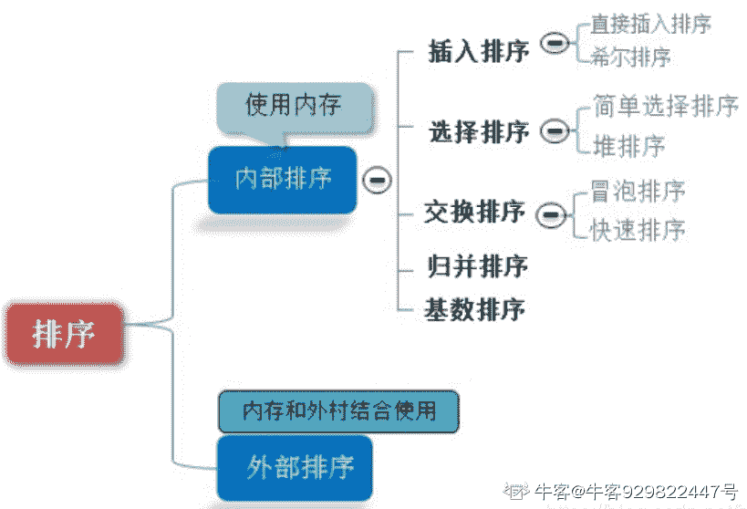

# 网易 2020 校招笔试- 运维工程师（提前批）

## 1

有一类二叉树用三叉链表来存储的时候除了带有指向左右孩子节点的两个指针，还有指向父节点的指针，那么这样一棵二叉树有 2 个节点，那么有多少指针指向 NULL（注：根节点的父指针指向 NULL，对于不存在的节点表示为 NULL）？

正确答案: D   你的答案: 空 (错误)

```cpp
1
```

```cpp
2
```

```cpp
3
```

```cpp
4
```

```cpp
5
```

本题知识点

Java 工程师 C++工程师 网易 安全工程师 测试开发工程师 前端工程师 数据分析师 数据库工程师 算法工程师 iOS 工程师 安卓工程师 运维工程师 2020

讨论

[北斗酌美酒](https://www.nowcoder.com/profile/170736954)


发表于 2020-04-11 11:37:30

* * *

[流浪者 201907280945510](https://www.nowcoder.com/profile/60649645)

每个节点有 3 个指针，两个节点一共 6 个指针，其中 A 节点父节点指向 B 节点， B 节点子节点指向 A 节点，剩下的 4 个节点全部是 NULL

发表于 2020-02-17 09:51:27

* * *

[小水滴真的是太可爱了吧](https://www.nowcoder.com/profile/742091450)

**三叉链表存储表示**

改进于二叉链表，增加指向父节点的指针，能更好地实现结点间的访问。


发表于 2020-04-07 10:38:28

* * *

## 2

在计算机操作系统中，批处理任务是无须人工干预而执行系列程序的作业，现有多个批处理任务 1，2，3，4，5 几近同步抵达运算中心，多个批处理任务运行的时常分别是 10 分钟，6 分钟，2 分钟，4 分钟和 8 分钟，它们的优先级是 3，5，2，1，4，这里 5 的优先级最高，则在下列各种调度算法中，平均进程的周转时间为 14 分钟的是（）

正确答案: D   你的答案: 空 (错误)

```cpp
时间片轮转调度算法
```

```cpp
优先级调度算法
```

```cpp
先来先服务调度算法
```

```cpp
最短作业优先调度算法
```

本题知识点

运维工程师 网易 2020

讨论

[小生哥](https://www.nowcoder.com/profile/6980746)

周转时间=结束时间-抵达时间   结束时间=等待时间+执行时间

优先级调度：按优先级从高到低，即 2、5、1、3、4
(6+(6+8)+(6+8+10)+(6+8+10+2)+(6+8+10+2+4))/5=20
先来先服务：按 1、2、3、4、5 的顺序
(10+(10+6)+(10+6+2)+(10+6+2+4)+(10+6+2+4+8))/5=19.2
最短作业优先：按运行时间最短的顺序算，即 3、4、2、5、1
(2+(2+4)+(2+4+6)+(2+4+6+8)+(2+4+6+8+10))/5=14

发表于 2019-12-31 13:12:10

* * *

## 3

计算机操作系统中，索引顺序文件是顺序文件的扩展，各类记录为顺序排列，现假设牛客网人力资源部门某个文件为索引顺序文件，由 5 个逻辑记录组成，每个逻辑记录的大小与磁盘块的大小相等，均为 512B，并依次存放在 50、121、75、80、63 号磁盘块上。若要存取文件的第 1569 逻辑字节处的信息，则要访问（   ）号磁盘块。

正确答案: C   你的答案: 空 (错误)

```cpp
3
```

```cpp
75
```

```cpp
80
```

```cpp
63
```

本题知识点

Java 工程师 C++工程师 网易 安全工程师 前端工程师 iOS 工程师 安卓工程师 运维工程师 2020

讨论

[小生哥](https://www.nowcoder.com/profile/6980746)

1569/512=3...33 要访问字节的逻辑记录号为 3,对应的物理磁盘块号为 80。

发表于 2019-12-31 13:22:47

* * *

[Fat-Tiger](https://www.nowcoder.com/profile/8187487)

一块一块地读，一块大小 512B

发表于 2019-11-30 16:03:04

* * *

## 4

牛客网的某一网络的一台主机产生了一个 IP 数据报，头部长度为 20 字节，数据部分长度为 2000 字节，该数据报需要经过两个网络到达目的主机，这两个网络所允许的最大传输单位 MTU 分别为 1500 字节和 576 字节。那么原 IP 数据报到达目的主机时分成了（   ）IP 小报文？

正确答案: C   你的答案: 空 (错误)

```cpp
2
```

```cpp
3
```

```cpp
4
```

```cpp
5
```

本题知识点

Java 工程师 C++工程师 网易 安全工程师 大数据开发工程师 前端工程师 算法工程师 运维工程师 2020

讨论

[梦醒时分 2019](https://www.nowcoder.com/profile/477996513)

一个链路层帧能承载的最大数据量叫做最大传送单元（MTU）头部长度为 20 字节，数据部分长度为 2000 字节，该数据报需要经过两个网络到达目的主机，这两个网络所允许的最大传输单位 MTU 分别为 1500 字节和 576 字节。1、2000 字节（加上头部一共 2020 字节）的数据经过第一个 MTU 为 1500 字节的网络时，分为 2 个分片,分片 1（1500 字节）携带 1480 字节的数据，分片 2（540 字节）携带剩下的 520 字节的数据。2.分片 1（1480 字节的数据）经过第二个 MTU 为 576 字节的网络时，需要继续分片为 3 个 IP 小报文（分片 3、4、5），分片 3 和 4 各自携带 556（576-20=556）字节的数据，分片 5 携带剩下的 368 字节的数据。那么，总共分为了 4 个 IP 小报文

编辑于 2020-08-08 22:17:33

* * *

## 5

判断一个数组或序列是正序,倒序还是乱序,需要我们将这个数组完整的遍历一遍通过构建有序序列，对于未排序数据，在已排序序列中从后向前扫描，找到相应的位置并插入的排序算法是（ ）

正确答案: C   你的答案: 空 (错误)

```cpp
选择排序
```

```cpp
希尔排序
```

```cpp
插入排序
```

```cpp
归并排序
```

本题知识点

iOS 工程师 网易 安卓工程师 C++工程师 Java 工程师 安全工程师 测试工程师 大数据开发工程师 前端工程师 算法工程师 数据分析师 数据库工程师 运维工程师 2020

讨论

[Olivia_dtt](https://www.nowcoder.com/profile/232985383)

选择排序：每次从数组中选出一个最小数（最大数）放到数组最前面，存放在序列的起始位置，直到全部待排序的数据元素排完。希尔排序：设置增量分割数组，逐步进行直接插入排序,增量逐趟减少,并最后使得整个数组基本有序,再对整体进行直接插入排序。插入排序：构建有序序列，未排序数据依次从已排序数据按从后往前比较，插入到合适的位置。归并排序：把序列分成两个长度为 n/2 的子序列，对这两个子序列分别归并排序（循环将两个数组的第一个值比较，并弹出第一个值， 直到数组长度都不存在），将两个排序好的子序列合并成一个最终的排序序列

发表于 2020-04-06 20:12:11

* * *

[牛客 929822447 号](https://www.nowcoder.com/profile/929822447)



插入排序—直接插入排序：


希尔排序：

 

选择排序：

 

归并排序：


发表于 2020-08-24 18:42:35

* * *

## 6

python 中使用异常处理的关键字是

正确答案: A   你的答案: 空 (错误)

```cpp
try-except
```

```cpp
raise
```

```cpp
assert
```

```cpp
error
```

本题知识点

运维工程师 网易 2020

讨论

[程序小白牛](https://www.nowcoder.com/profile/51949066)

a

发表于 2020-01-01 15:06:02

* * *

## 7

运行以下 python 代码输>>> map(lambda x: x+1, range(6))输出正确的是

正确答案: C   你的答案: 空 (错误)

```cpp
[6, 5, 4, 3, 2, 1]
```

```cpp
[5, 4, 3, 2, 1, 0]
```

```cpp
[1, 2, 3, 4, 5, 6]
```

```cpp
[0, 1, 2, 3, 4, 5]
```

本题知识点

前端工程师 网易 Java 工程师 C++工程师 算法工程师 运维工程师 2020

讨论

[齐广博 18130041519](https://www.nowcoder.com/profile/902438906)

map()函数：*接收一个函数和一个可迭代对象（可以理解为 list），将函数依次作用在每个元素上，得到一个新的 list。**lambda x: x+1：表示匿名函数，将元素加一**range()：表示一个整数列表，默认从 0 开始。* *例如：range(6)，表示：0,1,2,3,4,5。**          最后结果为：1，2,3,4,5,6。*

发表于 2020-09-08 23:25:04

* * *

## 8

请选择以下命令后 file1 和 file2 的权限 chmod 755 file1chmod 644 file2

正确答案: B   你的答案: 空 (错误)

```cpp
-rw-r--r--  file1

-rw-r--r--  file2
```

```cpp
-rwxr-xr-x  file1

-rw-r--r--  file2
```

```cpp
-rw-r--r--  file1

-rwxr-xr-x  file2
```

```cpp
-rwxr-xr-x  file1

-rw-rw-rw-  file2
```

本题知识点

Java 工程师 C++工程师 网易 安全工程师 大数据开发工程师 前端工程师 数据库工程师 运维工程师 2020

讨论

[Aiqing](https://www.nowcoder.com/profile/814029247)

**chmod**是 Linux 下设置文件权限的命令，后面的数字表示不同用户或用户组的权限。

一般是三个数字：

第一个数字表示文件所有者的权限

第二个数字表示与文件所有者同属一个用户组的其他用户的权限

第三个数字表示其它用户组的权限。

权限分为三种：读（r=4），写（w=2），执行（x=1）。综合起来还有可读可执行（rx=5=4+1）、可读可写（rw=6=4+2）、可读可写可执行(rwx=7=4+2+1)。

所以，**chmod 755** 设置用户的权限为：

1.文件所有者可读可写可执行

2.与文件所有者同属一个用户组的其他用户可读可执行

3.其它用户组可读可执行-rwx-r--r-- (一共 10 个参数) 表示文件所属组和用户的对应权限。
第一个跟参数属于管理员，跟 chmod 无关,先不管.
2-4 参数:属于 user
5-7 参数:属于 group
8-10 参数:属于 others
接下来就简单了:r==>可读 w==>可写 x==>可执行
r=4 w=2 x=1
所以 755 代表 rwxr-xr-x  注意是前三个字母为 7 然后两个 r-x 为 5 r-x 为 5

777 代表 rwxr-rwx-rwx 所有用户都可读可写可执行。644 为 -rw-r-r-

发表于 2019-12-20 17:28:38

* * *

[牛客 380846183 号](https://www.nowcoder.com/profile/380846183)

参考了楼上同学的解析，分享一点自己的领悟：10 个参数，第一个属于管理员，用“-”表示 234，567，8910 均以 rwx 的形式表示，不存在的权限用“-”代替比如 755 为“-rwxr-xr-x”第一个参数：-对应管理员 234 个参数：rwx，即为 user 权限 567 个参数：r-x，为 group 权限，此处没有可写权限，所以 w 用“-”代替 8910 个参数：r-x，同理。和楼上不同的看法（不确定对不对，但应该是对的）644“- rw- r-- r--”777“- rwx rwx rwx”

发表于 2020-08-07 11:05:19

* * *

## 9

ls -l 命令有以下输出，描述正确的是

正确答案: D   你的答案: 空 (错误)

```cpp
default.etcd 为可执行文件，只能被 root 执行
```

```cpp
go 目录占的磁盘空间大小为 4KB
```

```cpp
install-client.sh 脚本可以用./install-client.sh 命令执行
```

```cpp
go 文件夹可以被任意用户浏览
```

本题知识点

安卓工程师 网易 C++工程师 Java 工程师 安全工程师 测试工程师 测试开发工程师 大数据开发工程师 前端工程师 数据库工程师 iOS 工程师 运维工程师 2020

讨论

[我是复读机](https://www.nowcoder.com/profile/162099353)

A 是目录，不是文件；B 也是目录，所以 4096 表示的是该目录符所占的大小（注意，4096 不表示该目录下所有文件的大小）；C 没有 x 权限，不能直接./运行，但可以用 sh 运行；D 正确

发表于 2020-04-21 19:41:36

* * *

[offer-冲鸭](https://www.nowcoder.com/profile/447104610)

首先 d 表示这个文件是一个文件夹，然后文件的权限用其后一共有 9 个字符表示，分成三组，分别表示文件所属用户的权限，文件所属用户组的权限，其他人的权限，r 表示读权限, w 表示写权限， x 表示执行权限，你给的这个例子就是说 这是个文件夹，并且此文件所属用户拥有读、写、执行三项权限，其余的用户组，其他用户不拥有任何权限（全部都是-）--转

发表于 2020-04-03 22:52:49

* * *

[HEREISDAVID](https://www.nowcoder.com/profile/864672146)


发表于 2020-09-27 20:12:49

* * *

## 10

两条命令分别会有怎样的输出 echo hello 1>&2 |grep aaaecho hello 2>&1 |grep aaa

正确答案: A   你的答案: 空 (错误)

```cpp
第一个输出 hello， 第二个无输出
```

```cpp
第一个无输出，第二个输出 hello
```

```cpp
第一个无输出，第二个无输出
```

```cpp
第一个输出 hello，第二个输出 aaa
```

本题知识点

前端工程师 网易 Java 工程师 C++工程师 数据库工程师 iOS 工程师 安卓工程师 安全工程师 运维工程师 2020

讨论

[Offer 眷顾眷顾我吧](https://www.nowcoder.com/profile/836317992)

参考这个博主的解析[`www.cnblogs.com/cyyz-le/p/11305004.html`](https://www.cnblogs.com/cyyz-le/p/11305004.html)

发表于 2020-04-07 18:07:41

* * *

## 11

将一个 C 类⺴络划分为 3 个子⺴，每个子⺴最少要容纳 55 台主机，使用的子⺴掩码是?

正确答案: D   你的答案: 空 (错误)

```cpp
255.255.255.252
```

```cpp
255.255.255.248
```

```cpp
255.255.255.224
```

```cpp
255.255.255.192
```

本题知识点

运维工程师 网易 2020

讨论

[Offer 眷顾眷顾我吧](https://www.nowcoder.com/profile/836317992)

```cpp
子网可用 IP 数=2 的 N 次方-2，N 是主机号位数。

比 55 大的最小子网是容纳 62 的子网，62=2 的 6 次方-2，所以 6 位主机号
```

发表于 2020-04-07 18:10:45

* * *

## 12

TCP 三次握手和四次挥手过程中，以下状态分别处于服务端和客户端描述正确的是：

正确答案: C   你的答案: 空 (错误)

```cpp
服务端:SYN-SEND，TIME-WAIT 客户端:SYN-RCVD，CLOSE-WAIT
```

```cpp
服务端:SYN-SEND，CLOSE-WAIT 客户端:SYN-RCVD，TIME-WAIT
```

```cpp
服务端:SYN-RCVD，CLOSE-WAIT 客户端:SYN-SEND，TIME-WAIT
```

```cpp
服务端:SYN-RCVD，TIME-WAIT 客户端:SYN-SEND，CLOSE-WAIT
```

本题知识点

运维工程师 网易 2020

## 13

将当前命令 sh test.sh 任务在后台执行，下列最优雅的的做法是

正确答案: C   你的答案: 空 (错误)

```cpp
sh test.sh &
```

```cpp
nohup sh test.sh
```

```cpp
nohup sh test.sh &
```

```cpp
nohup sh test.sh &&
```

本题知识点

运维工程师 网易 2020

讨论

[Offer 眷顾眷顾我吧](https://www.nowcoder.com/profile/836317992)

nohup :表示不挂起，在你退出账户之后，进程继续在后台运行，一般形式为： nohup command &

发表于 2020-04-07 18:18:10

* * *

## 14

有时候因为磁盘空间快满了，我们需要删除一些 log 文件，但是忘记停止程序了，日志删除后，发现磁盘空 间并没有释放，这时候我们通常使用以下哪种方式查找已删除文件的进程占用

正确答案: B   你的答案: 空 (错误)

```cpp
ps
```

```cpp
lsof
```

```cpp
top
```

```cpp
df
```

本题知识点

运维工程师 网易 2020

## 15

以下关于 ACID 说法正确的是?

正确答案: A   你的答案: 空 (错误)

```cpp
A 表示原子性，要么全部执行，要么全部不执行，不会存在部分执行
```

```cpp
C 表示完整性，是数据操作前后的约束
```

```cpp
I 表示读写操作的隔离性
```

```cpp
D 表示持久性，一旦事务提交，则其所做的修改不会发生变化
```

本题知识点

数据库工程师 网易 运维工程师 2020

讨论

[Offer 眷顾眷顾我吧](https://www.nowcoder.com/profile/836317992)

ACID 是[数据库事务](https://baike.sogou.com/lemma/ShowInnerLink.htm?lemmaId=298468&ss_c=ssc.citiao.link)正确执行的四个基本要素的缩写，即原子性（Atomicity）、一致性（Consistency）、隔离性（[Isolation](https://baike.sogou.com/lemma/ShowInnerLink.htm?lemmaId=70806469&ss_c=ssc.citiao.link)）、持久性（Durability）。原子性：整个事务中的所有操作，要么全部完成，要么全部不完成，不可能停滞在中间某个环节。事务在执行过程中发生错误，会被回滚（Rollback）到事务开始前的状态，就像这个事务从来没有执行过一样。 一致性：在事务开始之前和事务结束以后，数据库的完整性约束没有被破坏。数据库在事务执行前后都保持一致性状态。在一致性状态下，所有事务对一个数据的读取结果都是相同的。 隔离性：隔离状态执行事务，使它们好像是系统在给定时间内执行的唯一操作。如果有两个事务，运行在相同的时间内，执行相同的功能，事务的隔离性将确保每一事务在系统中认为只有该事务在使用系统。这种属性有时称为[串行化](https://baike.sogou.com/lemma/ShowInnerLink.htm?lemmaId=36017&ss_c=ssc.citiao.link)，为了防止事务操作间的混淆，必须串行化或[序列化](https://baike.sogou.com/lemma/ShowInnerLink.htm?lemmaId=54553&ss_c=ssc.citiao.link)请求，使得在同一时间仅有一个请求用于同一数据。一个事务所做的修改在最终提交以前，对其它事务是不可见的。 持久性：在事务完成以后，该事务所对数据库所作的更改便持久的保存在数据库之中，并不会被回滚。一旦事务提交，则其所做的修改将会永远保存到数据库中。即使系统发生崩溃，事务执行的结果也不能丢失。可以通过数据库备份和恢复来实现，在系统发生奔溃时，使用备份的数据库进行数据恢复。 

发表于 2020-04-07 18:19:51

* * *

## 16

实现 WEB 流量的负载均衡有哪些方式，请分别描述其工作原理和优缺点

你的答案

本题知识点

运维工程师 网易 2020

讨论

[Offer 眷顾眷顾我吧](https://www.nowcoder.com/profile/836317992)

[`www.cnblogs.com/549294286/p/5067865.html`](https://www.cnblogs.com/549294286/p/5067865.html)

发表于 2020-04-07 18:21:39

* * *

## 17

请描述运维的工作内容及核心目标，为达成目标最需要具备的因素有哪些？ 结合自身对 DevOps 的理解，谈谈其对运维工作的挑战和机遇

你的答案

本题知识点

运维工程师 网易 2020

讨论

[牛客 248761564 号](https://www.nowcoder.com/profile/248761564)

为什么都没有解析

发表于 2020-04-15 22:11:37

* * *

## 18

小易有一个长度为 n 的数字数组, , …, 。

问你是否能用这 n 个数字构成一个**环(****首尾连接)**，使得环中的每一个数字都小于它相邻的两个数字的和(**每个数字都必须使用并且每个数字只能使用一次**)。

本题知识点

Java 工程师 网易 测试开发工程师 前端工程师 C++工程师 数据库工程师 算法工程师 iOS 工程师 安卓工程师 安全工程师 运维工程师 2020

讨论

[暮成](https://www.nowcoder.com/profile/220765575)

```cpp
#include <iostream>
using namespace std;
int main()
{
    int t ;
    cin >> t;
    while(t>0)
    {
    long long  n ;
    cin >> n;
        if(n<=2)
            cout << "NO" << endl;
        else
        {
        long long a[n];
        for(long long i =0;i<n;i++)
        cin >> a[i];

        //直接找最大值 次最大值 次次最大值
        long long max = a[0];
        long long ccmax = 0;
        long long cmax = 0;
        for(long long i=1;i<n;i++)
        {
            if(a[i]>=max)
            {
                ccmax = cmax;
                cmax = max;
                max = a[i];
            }
            else if (a[i] >= cmax)
               {
                ccmax = cmax;
                cmax = a[i];             
            }              
       else if (a[i] >= ccmax)    
            {                 
                ccmax = a[i];             
            }

        }

        if(ccmax+cmax>max)    //最大值小于后两个之和  则所有都满足条件
            cout << "YES" << endl;
        else
            cout << "NO" << endl;
        }
     t--;
    }
}

```

编辑于 2020-08-19 08:52:42

* * *

[黑暗过后会是晨曦](https://www.nowcoder.com/profile/128285448)

因为每个数字小于相邻只和，直接排序数组，然后只要操作最大数左右两边之和大于最大数，此时只需要将最大数和第二大数交换位置即可。

发表于 2020-02-26 10:22:10

* * *

[祈求 offer](https://www.nowcoder.com/profile/894067753)

```cpp
import java.util.Arrays;
import java.util.Scanner;

public class Main {
    public static void main(String[] args) {
        Scanner cin = new Scanner(System.in);
        int t = cin.nextInt();
        while (t-- != 0) {
            int n = cin.nextInt();
            long[] a = new long[n];
            for (int i = 0; i < n; i++) {
                a[i] = cin.nextLong();
            }
            Arrays.sort(a);
            if (a[n-2] + a[n-3] > a[n-1]){ //只要只要最后二个和第一个加起来大于最后一个
                                                        //可以考虑将最后一个往前交换一位，这样都能满足条件
                System.out.println("YES");
            }else {
                System.out.println("NO");
            }
        }
    }
}
```

编辑于 2020-08-07 11:29:39

* * *

## 19

小易有一个体积巨大的货物，具体来说，是个在二维平面上占地的货物。
小易有一个的广场，想把货物放在这个广场上。不幸的是，广场上已经有了一些障碍物，障碍物所在的格子不能放置你的货物。小易现在想知道能否成功地放置货物。

本题知识点

iOS 工程师 网易 Java 工程师 C++工程师 安全工程师 算法工程师 运维工程师 2020

讨论

[dragonlogin](https://www.nowcoder.com/profile/2071677)

思路

就是力扣 85 题最大矩阵和的思路。
把障碍点设为 1，非障碍点设为 0，跑一遍求最大矩阵的代码，同时记录最大矩阵面积为 eara，长和宽最大值 maxv 和最小值 minv，
如果 eara > c * d && maxv > max(c, d) && minv > min(c, d), 返回 YES，否则 NO

```cpp
#include <bits/stdc++.h>
using namespace std;
const int N = 1010, M = 160;

int t, n, m, k, c, d;

char mat[N][N];
int help(vector<int>& a,int &minv, int& maxv) {
    int n = a.size();

    int tt = 0;
    vector<int> stk(n + 10), left(n), right(n);

    for (int i = 0; i < n; ++ i) {
        while (tt && a[stk[tt]] >= a[i]) tt--;

        if (tt) left[i] = stk[tt];
        else left[i] = -1;

        stk[++ tt] = i;
    }

    tt = 0;

    for (int i = n - 1; ~i; -- i) {
        while (tt && a[stk[tt]] >= a[i]) tt--;

        if (tt) right[i] = stk[tt];
        else right[i] = n;

        stk[++ tt] = i;
    }

    int ret = 0;
    for (int i = 0; i < n; ++ i) {

        int erea = (right[i] - left[i] - 1) * a[i];
        if (ret < erea) {
            ret = erea;
            minv = min({a[i], right[i] - left[i] - 1});
            maxv = max({a[i], right[i] - left[i] - 1});
        }
    }

    return ret;
}
int main() {
    cin >> t;
    while (t -- ) {
        cin >> n >> m >> k;
        int x, y;
        memset(mat, 0, sizeof mat);
        for (int i = 1; i <= k ; ++i ) {
            cin >> x >> y;
            mat[x - 1][y - 1] = '1';
        }
        cin >> c >> d;

        vector<int> a(m + 1);
        int ret = 0;
        bool f = false;
        for (int i = 0; i < n; ++ i) {
            for (int j = 0; j < m; ++ j) {
                if (mat[i][j] == '1')
                    a[j] = 0;
                else
                    a[j] ++ ;
            }
            int minv = 0, maxv = 0;
            int ans = help(a, minv, maxv);

            if (ans >= c * d && minv >= (min(c, d)) && (maxv >= (max(d,c)))) {
                f = true;
                break;
            }

        }
        if (f)
            cout << "YES" <<endl;
        else
            cout << "NO" << endl;
    }

    return 0;
}
```

发表于 2020-07-30 14:57:47

* * *

[远征的梦想](https://www.nowcoder.com/profile/216070581)

抄 [NotDeep](https://www.nowcoder.com/profile/906271) 大佬的答案

```cpp
import java.util.Scanner;

public class Main {

    private static Scanner sc;

    public static void main(String[] args) {
        sc = new Scanner(System.in);
        int t = sc.nextInt();//组数
        for (int a = 0; a < t; a++) {
            int n = sc.nextInt();//广场长(宽)
            int m = sc.nextInt();//广场长(宽)
            int k = sc.nextInt();//障碍物个数
            int[][] grid = new int[n + 10][m + 10];
            for (int i = 0; i < k; i++) {//填入障碍物坐标
                grid[sc.nextInt()][sc.nextInt()] = 1;
            }
            for (int row = 1; row < n; row++) {
                for (int col = 1; col < m; col++) {
                    grid[row][col] += grid[row - 1][col] + grid[row][col - 1] - grid[row - 1][col - 1];
                }
            }
            int c = sc.nextInt();//货物长(宽)
            int d = sc.nextInt();//货物长(宽)
            boolean findPosition = false;
            for (int row = 1; row < n - c + 1; row++) {
                for (int col = 1; col < m - d + 1; col++) {
                    int ok = grid[row + c - 1][col + d - 1] - grid[row + c - 1][col - 1] - grid[row - 1][col + d - 1] + grid[row - 1][col - 1];
                    if (ok == 0) {
                        System.out.println("YES");
                        findPosition = true;
                        break;
                    }
                }
                if (findPosition) {
                    break;
                }
            }
            if (!findPosition) {
                System.out.println("NO");
            }
        }
    }
}
```

发表于 2020-04-04 02:03:48

* * *

[华科菜菜子](https://www.nowcoder.com/profile/296943498)

对于一个 m*n 的货物，检测其能否放在 x,y 处，只需检测在(x,y)到（x+m,y+n）(竖着放)或者（x+n,y+m）（横着放）两点构成的矩形范围内有没有障碍物，且在范围内。

发表于 2020-12-10 11:03:32

* * *