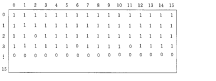

# 网易 2020 校招笔试- 运维工程师（正式批）

## 1

关于 IP 数据报的分片，以下说法错误的是(   )

正确答案: A   你的答案: 空 (错误)

```cpp
分片在源主机中进行，在中间路由器不会产生，片到达目的主机后再进行重新组装
```

```cpp
分片在源主机和中间路由器都有可能产生，片到达目的主机后再进行重新组装
```

```cpp
分片主要针对的是 UDP 传输
```

```cpp
由于 TCP 传输层会对 TCP 报文段进行分段，因而采用 TCP 传输避免了 IP 分片
```

本题知识点

运维工程师 网易 2020

讨论

[土圭垚 201904021801969](https://www.nowcoder.com/profile/600827515)

答案错误 IP 分片发生在 IP 层，不仅源端主机会进行分片，中间的路由器也有可能分片，因为不同的网络的 MTU 是不一样的，如果传输路径上的某个网络的 MTU 比源端网络的 MTU 要小，路由器就可能对 IP 数据报再次进行分片。而分片数据的重组只会发生在目的端的 IP 层。

发表于 2019-11-29 17:23:02

* * *

[牛客 602328054 号](https://www.nowcoder.com/profile/602328054)

1、在 TCP/IP 分层中，数据链路层用 MTU 来限制所能传输的数据包大小。MTU 是指一次传送的数据最大长度，不包括数据链路层数据帧的帧头。当发送的[IP 数据报](https://www.baidu.com/s?wd=IP%E6%95%B0%E6%8D%AE%E6%8A%A5&tn=SE_PcZhidaonwhc_ngpagmjz&rsv_dl=gh_pc_zhidao)的大小超过了 MTU 时，IP 层就需要对数据进行分片，否则数据将无法发送成功。

2、IP 分片发生在 IP 层，不仅源端主机会进行分片，中间的路由器也有可能分片，因为不同网络的 MTU 是不一样的。如果传输路径上的某个网络的 MTU 比源端网络的 MTU 要小，路由器就可能对[IP 数据报](https://www.baidu.com/s?wd=IP%E6%95%B0%E6%8D%AE%E6%8A%A5&tn=SE_PcZhidaonwhc_ngpagmjz&rsv_dl=gh_pc_zhidao)再次进行分片。而分片数据的重组只会发生在目的端的 IP 层。

3、IP 层是没有超时重传机制的。如果 IP 层对一个数据包进行了分片，只要有一个分片丢失了，只能依赖于传输层进行重传，结果是所有的分片都要重传一遍，这个代价有点大。由此可见，IP 分片会大大降低传输层传送数据的成功率，所以要避免 IP 分片。

发表于 2019-12-17 16:08:25

* * *

## 2

某高校计算机学院要新建 3 个实验室,每个实验室有 25 台主机,已申请了一个 C 类地址 192.168.10.0,该 C 类地址的子网掩码为（）

正确答案: D   你的答案: 空 (错误)

```cpp
255.255.255.255
```

```cpp
255.255.255.253
```

```cpp
255.255.255.0
```

```cpp
255.255.255.224
```

本题知识点

运维工程师 网易 2020

讨论

[我爱吃猪肉](https://www.nowcoder.com/profile/3015445)

因为有 3 个实验室，就需要 3 个网段，2²=4，所以最少需要从地址位借 2 位，也可以借 3 位，借 4 位等等；但由于每个实验室有 25 台主机，2⁴-2=14，2⁵-2=30，所以最少需要 5 位主机位，综合起来，就只能从地址借 2-3 位了，借 2 位的话，子网掩码是 255.255.255.192，借 3 位的话，子网掩码是 255.255.255.224，所以答案选 D

发表于 2019-12-20 16:51:46

* * *

## 3

在操作系统中，某计算机系统利用下图来分配系统中的盘块，而且行列编号从 0 开始，假设如果从 1 开始进行编号，每个盘块分配的大小为 1KB，则第 300 块所对应的二进制行号 i 和 j 分别为多少？

正确答案: A   你的答案: 空 (错误)

```cpp
i= 18，j =11
```

```cpp
i= 9，j =16
```

```cpp
i= 11，j =18
```

```cpp
i= 16，j =9
```

本题知识点

Java 工程师 C++工程师 网易 运维工程师 2020

讨论

[瓶瓶子](https://www.nowcoder.com/profile/526659640)

300=16*18+12。第 18 行第 12 列，即 i=18，j=11。

发表于 2019-12-24 13:45:13

* * *

[牛客 420969170 号](https://www.nowcoder.com/profile/420969170)

小学奥数题，周期性问题。300/16=18...12

发表于 2020-12-05 22:37:00

* * *

## 4

数据结构中，沿着某条搜索路线，依次对树中每个结点均做一次且仅做一次访问。对二叉树的结点从 1 开始进行连续编号，要求每个结点的编号大于其左、右孩子的编号，同一结点的左右孩子中，其左孩子的编号小于其右孩子的编号，可采用（  ）次序的遍历实现编号。

正确答案: C   你的答案: 空 (错误)

```cpp
先序
```

```cpp
中序
```

```cpp
后序
```

```cpp
从根开始按层次遍历
```

本题知识点

C++工程师 网易 iOS 工程师 Java 工程师 测试工程师 测试开发工程师 大数据开发工程师 算法工程师 前端工程师 数据分析师 安卓工程师 安全工程师 运维工程师 2020

讨论

[繁华落尽君辞去](https://www.nowcoder.com/profile/569656804)

先序 根左右中序 左根右后序 左右根

发表于 2019-12-03 21:47:17

* * *

[MV13eard](https://www.nowcoder.com/profile/863005403)

这题要理解题意：对二叉树的结点从 1 开始进行连续编号，意思就是把 1，2，3，4....这些数按从小到大的顺序依次放到二叉树中，并要求的放法是：左孩子<右孩子<根节点；这时候再看三种次序的遍历，先序 根左右中序 左根右后序 左右根，很显然，只有后序满足条件。

发表于 2020-03-03 11:21:25

* * *

[依昂](https://www.nowcoder.com/profile/920832473)

是我的理解有问题吗，题目中说的是每个结点的编号大于其左、右孩子的编号，这个的意思难道不是根的节点编号都要大于左右孩子的编号吗

发表于 2020-09-11 14:13:24

* * *

## 5

现在假设对 N 个元素的链表做顺序查找时，若查找每个元素的概率相同，则平均查找长度为（   ）？

正确答案: A   你的答案: 空 (错误)

```cpp
(N+l)/2
```

```cpp
N/2
```

```cpp
N
```

```cpp
[(1+N)*N]／2
```

本题知识点

安卓工程师 网易 C++工程师 iOS 工程师 Java 工程师 测试工程师 测试开发工程师 大数据开发工程师 算法工程师 前端工程师 数据分析师 安全工程师 运维工程师 2020

讨论

[L201710091511469](https://www.nowcoder.com/profile/1515815)

第一个数的比较次数为 1，第二个数的比较次数为 2。。。以此类推第 N 个数的比较次数为 N，所以总的比较次数为 1+2+...+N=N(N+1)/2,平均比较次数为(N+1)/2,也即平均查找长度。

发表于 2019-12-19 17:26:33

* * *

[阳光脆薄如纸](https://www.nowcoder.com/profile/904336422)

总长度 n(n+1)/2 除以总个数 n

发表于 2019-11-28 15:57:51

* * *

[零葬](https://www.nowcoder.com/profile/75718849)

第一个数的比较次数为 1，概率为 1/N；第二个数的比较次数为 2，概率为 1/N……以此类推第 N 个数的比较次数为 N，概率为 1/N。数学期望为：1/N*1 + 1/N*2 + ... 1/N*(N-1) + 1/N*N = 1/N*(1+2+...+N-1+N) = 1/N*(N+1)*N/2 = (N+1)/2

发表于 2020-10-21 15:09:53

* * *

## 6

下列关于 Python 的说法不正确的是：______

正确答案: B   你的答案: 空 (错误)

```cpp
Python 支持类和对象，且支持类的继承
```

```cpp
Python 使用与类相同的函数作为构造方法
```

```cpp
在继承中基类的构造方法不会被自动调用，需要在派生类的构造方法中显式调用
```

```cpp
派生类可以继承多个基类
```

本题知识点

算法工程师 网易 运维工程师 2020

讨论

[张小狗的牛客](https://www.nowcoder.com/profile/2273258)

Python 使用 _init_()作为构造方法

发表于 2020-02-25 12:32:14

* * *

## 7

python 中字典 dic1 = {'k1': 1, 'k2': 2}dic1['k3'] = 3dic1.pop('k2')print dic1 以下说法正确的是:

正确答案: B   你的答案: 空 (错误)

```cpp
dic1 输出{'k1': 1, 'k2': 2, 'k3': 3}
```

```cpp
dic1 输出{'k1': 1, 'k3': 3}
```

```cpp
dic1 输出{'k2': 2}
```

```cpp
dic1 输出{'k2': 2, 'k3': 3}
```

本题知识点

Java 工程师 C++工程师 网易 运维工程师 2020

## 8

关于 Linux 下面说法正确的是？

正确答案: A C   你的答案: 空 (错误)

```cpp
可以使用一般身份用户执行 ifconfig eth0 指令
```

```cpp
可以将“.”加入到 PATH 的查询目录中
```

```cpp
find ./ -name XXX 命令可以查找当前目录以及子目录有没有 XXX 文件
```

```cpp
linux 操作系统可以对目录进行硬链接
```

本题知识点

安卓工程师 网易 C++工程师 iOS 工程师 Java 工程师 大数据开发工程师 算法工程师 安全工程师 运维工程师 2020

讨论

[牛客 964288520 号](https://www.nowcoder.com/profile/964288520)

硬链接只能在同一文件系统中的文件之间进行链接，不能对目录进行创建。

发表于 2020-08-07 14:56:59

* * *

[NetWorker](https://www.nowcoder.com/profile/705946083)

这道题选 A  一般用户也可以执行 ifconfig 指令 至于 eth0 如果没这个网卡的话用 root 用户也查看不了啊 C init.d 是 linux7.0 之前首先启动的进程，在 rhel7.0 之后的版本首先启动的是 systemd

发表于 2020-02-27 10:39:15

* * *

[我爱吃猪肉](https://www.nowcoder.com/profile/3015445)

C 肯定对的，但亲测 A 也是对的，题库可以更新答案了~

发表于 2019-12-20 16:54:26

* * *

## 9

(umask 022;touch a) 等价于 （touch a; chmod XXX）,请问 XXX 用哪个数字表示

正确答案: A   你的答案: 空 (错误)

```cpp
644
```

```cpp
755
```

```cpp
022
```

```cpp
700
```

本题知识点

大数据开发工程师 网易 Java 工程师 C++工程师 算法工程师 iOS 工程师 安卓工程师 安全工程师 运维工程师 2020

讨论

[牛客 80662129 号](https://www.nowcoder.com/profile/80662129)

umask 与 chmod 命令设定刚好相反，umask 用的是“补码”，而 chmod 设置的是文件的权限码。我们规定数字 4 、2 和 1 表示读、写、执行权限，即 r=4，w=2，x=1。此时其他的权限组合也可以用其他的八进制数字表示出来，如： rwx = 4 + 2 + 1 = 7 rw = 4 + 2 = 6 对于文件而言，系统不允许创建之初就对其赋予可执行权限，因此文件权限的最高限定是 6，目录为 7。将最高可选值减去 umask 中的值即是默认文件创建权限。因此当 umask 为 022 时，默认创建文件的权限为 644，而默认创建目录的权限为 755。 

发表于 2020-04-06 23:04:42

* * *

[挽一缕清风](https://www.nowcoder.com/profile/919310571)

注意创建文件权限默认权限值不是 777，目录默认是 755，文件默认是 644，所以 umask=022，文件 a 权限是 644 无疑！答案选 A！

编辑于 2020-04-29 12:05:07

* * *

[namexin](https://www.nowcoder.com/profile/886795937)

unmask 的值为 022，表示反码。反码 022 为 root 账户，创建文件权限默认权限值为 rwx-rwx-rwx(777)，减去 022，755

发表于 2019-12-09 16:52:17

* * *

## 10

假设 有个空文件 file,执行如下命令：

> echo hello >> file;echo world > file;cat file

那么输出是

正确答案: D   你的答案: 空 (错误)

```cpp
hello
```

```cpp
hello world
```

```cpp
hello

world
```

```cpp
world
```

本题知识点

测试工程师 网易 测试开发工程师 Java 工程师 C++工程师 算法工程师 运维工程师 2020

讨论

[BubbleTg](https://www.nowcoder.com/profile/3275039)

使用>>指令向文件追加内容，原内容将保存。使用>指令覆盖文件原内容并重新输入内容，若文件不存在则创建文件。

发表于 2019-12-04 11:57:13

* * *

[牛客 363689098 号](https://www.nowcoder.com/profile/363689098)

echo 导入会覆盖掉原来的文件内容

发表于 2019-12-04 09:37:14

* * *

## 11

互联网常用的负载均衡技术有哪些，请分别描述其工作原理和优缺点？

你的答案

本题知识点

运维工程师 网易 2020

讨论

[夜笙丿](https://www.nowcoder.com/profile/185778492)

负载均衡，常见一些的有 nginx，LVS，haproxy

发表于 2020-04-05 15:57:55

* * *

## 12

你认为一个出色的运维工程师必须具备的关键素质有哪些（不超过 3 点），请按从主到次的顺序说明？

你的答案

本题知识点

运维工程师 网易 2020

## 13

有三种葡萄，每种分别有颗。有三个人，第一个人只吃第种葡萄，第二个人只吃第种葡萄，第三个人只吃第种葡萄。
适当安排三个人使得吃完所有的葡萄,并且且三个人中吃的最多的那个人吃得尽量少。

本题知识点

iOS 工程师 网易 测试开发工程师 算法工程师 Java 工程师 C++工程师 数据分析师 安卓工程师 安全工程师 运维工程师 2020

讨论

[missingdaysqxy](https://www.nowcoder.com/profile/981730683)

平均 5ms，412K 占用将一组三个葡萄数想像成三条线段，如果能构成三角形（符合两短相加大于长），则三个人一人吃掉相邻两条边的一半就可以；如果不能构成三角形（即有一超长边），那么要把超长边平分给两个人吃，相当于折断长边，现在有 4 条边肯定能构成四边形，那么有两种情况：

1.  两个人吃完长边后不再吃短边，第三人吃完短边也没有超出另两个人；
2.  两人吃完长边后，如果不帮第三人吃两个短边，会使第三人吃的超过 2 人。

第一种情况的输出就是长边的 1/2；第二种情况则与三角形情况相同，需要所有人均分。
因此，综合来看只有两种情况：所有人平分，或者其中两人平分最多的那种葡萄。这两个哪个大，输出哪个。

```cpp
#include <iostream>
#include <cmath>
using namespace std;
void sort(long list[3]) // 手动冒泡排序
{
    if (list[0]<list[1]) swap(list[0],list[1]);
    if (list[0]<list[2]) swap(list[0],list[2]);
    if (list[1]<list[2]) swap(list[1],list[2]);
}

int main()
{
    int n;
    long l[3], sum;
    cin >> n;
    for (int i = 0; i < n; i++)
    {
        cin >> l[0] >> l[1] >> l[2];
        sort(l);
        sum = l[0] + l[1] + l[2];
        cout << max((sum + 2) / 3, (l[0] + 1) / 2) << endl;//加 2 与加 1 是为上取整
    }
}

```

编辑于 2019-12-16 21:40:40

* * *

[天上白云蓝湛湛～](https://www.nowcoder.com/profile/341340582)

可以看成是三个人分别站在三角形的顶点（假定可以形成三角形）。设三角形两个短边是 a,b，长边是 c。则，若两短边之和大于等于长边的一半，可实现总数平分；反之，则结果为长边的一半。最终结果为全部通过。

```cpp
T = int(input())
for _ in range(T):
    x,y,z = map(int,input().split())
    food = [x,y,z]
    max_v,sum_v = max(food),sum(food)
    ans = 0
    if sum_v-max_v>=max_v//2:
        ans =(sum_v+2)//3
    else:
        ans = (max_v+1)//2
    print(ans)
```

发表于 2020-05-19 15:52:09

* * *

[小厂大锅](https://www.nowcoder.com/profile/9185846)

python3

```cpp
t=int(input())
for _ in range(t):
    a,b,c=map(int,input().split())
    maxnum=max(a,b,c)
    total=a+b+c
    if maxnum//2>=total-maxnum:
        if maxnum%2==0:
            print(maxnum//2)
        else:
            print((maxnum+1)//2)
    else:
        if total%3==0:
            print(total//3)
        elif total%3==1:
            print((total+2)//3)
        else:
            print((total+1)//3)
```

发表于 2020-04-07 18:33:27

* * *

## 14

小易有根柱子，第根柱子的高度为。一开始小易站在第一根柱子上。小易能从第根柱子跳到第根柱子，当且仅当且。其中为指定的一个数字。
另外小易拥有一次释放超能力的机会。这个超能力能让小易从柱子跳到任意满足的柱子而无视柱子高度的限制。
现在小易想知道，小易是否能到达第根柱子。

本题知识点

安卓工程师 网易 大数据开发工程师 算法工程师 前端工程师 Java 工程师 C++工程师 iOS 工程师 安全工程师 运维工程师 2020

讨论

[牛客 700653989 号](https://www.nowcoder.com/profile/700653989)

```cpp
t = int(input())
for _ in range(t):
    n, k = list(map(int, input().split()))
    li = list(map(int, input().split()))
    dp = [[False, 1] for _ in range(n)]
    dp[0][0] = True
    for i in range(1, n):
        flag = False
        max1 = 0
        for j in range(max(0, i - k), i):
            if dp[j][0] == False:
                continue
            elif li[j] >= li[i]:
                dp[i] = dp[j].copy()
                max1 = max(max1, dp[j][1])
                dp[i][1] = max1
                flag = True
            elif li[j] < li[i] and not flag and dp[j][1]:
                dp[i] = dp[j].copy()
                dp[i][1] = 0
    if dp[-1][0]:
        print('YES')
    else:
        print('NO')
```

发表于 2020-04-04 13:20:19

* * *

[爱吃咸鱼的喵](https://www.nowcoder.com/profile/620626456)

```cpp
#include <cstdio>
#include <cstring>
#include <algorithm>

#define MAX_N 1000+100
int T;
int N, k;
int H[MAX_N];
int dp[MAX_N][3];

int main()
{

	scanf("%d", &T);
	while (T--)
	{
		memset(dp, 0, sizeof(dp));
		dp[0][1] = 1;
		dp[0][0] = 1;
		scanf("%d%d", &N, &k);
		for (int i = 0; i < N; i++)
		{
			scanf("%d", &H[i]);
		}

		for (int i = 1; i < N; i++)
		{
			for (int j = 1; j <= k; j++)
			{
				if (i - j >= 0 && H[i] <= H[i-j]) {
					dp[i][0] |= dp[i - j][0];
					dp[i][1] |= dp[i - j][1];
				}

				dp[i][1] |= dp[i - j][0];

			}
		}

		if (dp[N - 1][0] || dp[N - 1][1])
			printf("YES\n");
		else
			printf("NO\n");
	}

	return 0;
}
```

 发表于 2020-01-08 20:18:45

* * *

[字节内推.](https://www.nowcoder.com/profile/9955061)

 ```cpp
import java.util.Scanner;

public class Main{
    public static void main(String[] args) {
        Scanner sc = new Scanner(System.in);
        int T = sc.nextInt();
        int n = 0, k = 0;
        for (int i = 0; i < T; i++) {
            n = sc.nextInt();
            k = sc.nextInt();
            int[] nums = new int[n];
            for (int j = 0; j < n; j++)
                nums[j] = sc.nextInt();
            System.out.println(solution(n, k, nums));
        }
    }

    public static String solution(int n, int k, int[] nums) {
        int big = 1;
        int index = 0;
        while (index < nums.length - 1) {
            int tmp = index;
            int max = 0, max_index = index;
            for (int j = index + 1; j < index + 1 + k && j < nums.length; j++) {
                if (nums[j] < nums[index]) {
                    max_index = (max > nums[j]) ? max_index : j;
                    max = Math.max(nums[j], max);
                }
            }
            index = max_index;
            if (tmp == index && big > 0) {
                big--;
                max = 0;
                max_index = index;
                for (int j = index + 1; j < index + 1 + k && j < nums.length; j++) {
                    max_index = (max > nums[j])? max_index : j;
                    max = Math.max(nums[j], max);
                }
                index = max_index;
            }
            else if (tmp == index && big <= 0)
                return "NO";
        }
        return "YES";
    }
}
```

编辑于 2020-04-05 19:10:36

* * *

## 15

小易的公司一共有名员工, 第个人每个月的薪酬是万元。
现在小易的老板向小易提了次询问, 每次询问老板都会给出一个整数, 小易要快速回答老板工资等于的员工的数量。

本题知识点

安卓工程师 网易 C++工程师 Java 工程师 测试工程师 大数据开发工程师 算法工程师 数据分析师 运维工程师 2020

讨论

[4399 内推](https://www.nowcoder.com/profile/932711750)

```cpp
/**
hashmap 记录当前输入的数字和数量，判断是否存在。
如已存在，则直接数量加 1，否则放入数字，数量设为 1.
最后根据 map.get(key)判断是否存在该数字，存在则返回 value，否则返回 0.
*/

import java.util.HashMap;
import java.util.Scanner;
public class Main{
    public static void main(String[] args){
        int n,m;
        int input;
        Scanner sc = new Scanner(System.in);
        n=sc.nextInt();
        m=sc.nextInt();
        int a;
        HashMap<Integer,Integer> hm = new HashMap();
        for(int i=0;i<n;i++){
            a=sc.nextInt();
            if(hm.containsKey(a)){
                hm.put(a,hm.get(a)+1);
            }else{
                hm.put(a,1);
            }
        }
        while(m--!=0){
            input=sc.nextInt();
            if(hm.get(input)!=null){
                System.out.println(hm.get(input));
            }else{
                System.out.println(0);
            }
        }

    }
}
```

 编辑于 2020-08-07 15:24:59

* * *

[牛客 364917519 号](https://www.nowcoder.com/profile/364917519)

```cpp
from collections import Counter
n,m = map(int,input().split())
salary = list(map(int,input().split()))
frequency_dict = dict(Counter(salary))

for i in range(m):
    question = int(input())
    print(frequency_dict.get(question,0))
```

发表于 2020-03-30 06:53:25

* * *

[零葬](https://www.nowcoder.com/profile/75718849)

直接用哈希表来进行计数，在老板给出 query 时直接查询哈希表

```cpp
import java.io.BufferedReader;
import java.io.InputStreamReader;
import java.io.IOException;
import java.util.HashMap;

public class Main {
    public static void main(String[] args) throws IOException {
        BufferedReader br = new BufferedReader(new InputStreamReader(System.in));
        String start;
        while((start = br.readLine()) != null) {
            String[] strNM = start.trim().split(" ");
            int n = Integer.parseInt(strNM[0]), m = Integer.parseInt(strNM[1]);
            String[] strArr = br.readLine().trim().split(" ");
            // 直接用哈希表来计数
            HashMap<String, Integer> map = new HashMap<>();
            for(int i = 0; i < n; i++){
                if(map.containsKey(strArr[i]))
                    map.put(strArr[i], map.get(strArr[i]) + 1);
                else
                    map.put(strArr[i], 1);
            }
            for(int i = 0; i < m; i++)
                System.out.println(map.getOrDefault(br.readLine().trim(), 0));
        }
    }
}
```

发表于 2020-10-22 15:53:30

* * *

## 16

小易有堆积木，第堆积木有块。小易还拥有一个容量无限的背包。
一开始小易站在第一堆积木旁边。每次小易可以选择进行下列三种操作中的一种：
1、从背包里掏出一块积木（如果有的话）放到当前这一堆里
2、从当前这一堆积木里掏出一块塞到背包里(如果当前积木堆不为空的话)
3、从当前这一堆走到下一堆。
一开始小易的背包里有块积木。小易希望把这些个积木变成严格递增的（即。小易希望知道这是否有可能能完成。（所有操作结束后不需要保证背包里没有积木了，可以有积木堆为空）。

本题知识点

安卓工程师 网易 C++工程师 iOS 工程师 大数据开发工程师 Java 工程师 算法工程师 前端工程师 运维工程师 2020

讨论

[安静 wsno1](https://www.nowcoder.com/profile/105030908)

所有的积木都按照 0，1，2，3...这样排，所以只需要判断到第 i 个积木时，前面 i 个积木堆加上背包里的 m 大于等于 i*(i+1)/2 就行了 T =int(input())for t in range(T):    nm =[int(n) for n in input().split()]    n =nm[0]    m =nm[1]    h =[int(n) for n in input().split()]    number =m    result =True    for i in range(n):        number =number+h[i]        if(number<(i*(i+1)/2)):            result =False            break    if(result ==True):        print("YES")    else:        print("NO")

发表于 2020-03-27 18:02:41

* * *

[大口饭团](https://www.nowcoder.com/profile/146611959)

这题描述不是贼烂？？只能从这三种选择里选的话，拿或者放了一个就不能走了？（意味着我只能改动一次）。。。如果说是拿或者放一个还能走。。示例 1 都过不了。。。。

```cpp
1
5 3
2 2 3 3 1
```

比如 1，2，3，3，1 。m=41，2，3，3，1。m=41，2，3，4，1。m=31，2，3，4，4。m=0 最后一个无论如何你都搞不了。。。实际上题目的意思是拿或者放了可以不走，继续拿或者放（实际就是你能无限拿，无限放。）。。。。

```cpp
noOfdata = int(input())
for _ in range(noOfdata):
    n, m = map(int, input().split(' '))
    items = list(map(int, input().split(' ')))
    m += items[0]
    items[0] = 0 
    prevItem = items[0]
    ok = True
    for idx in range(1, len(items)):
        if items[idx] > idx:
            m += items[idx] - idx
            items[idx] = idx
        elif items[idx] == idx:
            prevItem = items[idx]
        elif items[idx] < idx:
            placeItems = idx - items[idx]
            if m >= placeItems:
                m -= placeItems
                items[idx] = idx
            else:
                ok = False
                break
    if ok:
        print("YES")
    else:
        print("NO")
```

发表于 2020-02-27 13:55:23

* * *

[零葬](https://www.nowcoder.com/profile/75718849)

将积木调整为 0,1,2,3,...，当第 i 堆积木大于 i 时，从堆中拿积木放入包里；当第 i 堆积木小于 i 时，从背包里拿出积木放入堆中，如果在进行这个操作时没包里有积木了，就无法完成，直接返回 NO。如果遍历完之后都没有跳出，则表示可以完成，返回 YES。

```cpp
import java.util.Scanner;

public class Main {
    public static void main(String[] args) {
        Scanner sc = new Scanner(System.in);
        int T = sc.nextInt();
        while(T-- >0){
            int n = sc.nextInt(), m = sc.nextInt();
            int[] arr = new int[n];
            for(int i = 0; i < n; i++) arr[i] = sc.nextInt();
            System.out.println(solve(arr, m));
        }
    }

    // 为了留下的积木少，积木堆就按照 0,1,2,...的方式排
    private static String solve(int[] arr, int m) {
        boolean flag = true;
        long bagHeapNum = m;
        for(int i = 0; i < arr.length; i++){
            if(arr[i] > i) {
                bagHeapNum += arr[i] - i;
            }else if(arr[i] < i){
                if(bagHeapNum >= i - arr[i])
                    bagHeapNum -= i - arr[i];
                else
                    return "NO";
            }
            arr[i] = i;        // 这一句可写可不写，因为并不需要返回调整后的积木堆数组，只要知道能否调整即可
        }
        return "YES";
    }
}
```

发表于 2020-10-22 15:57:16

* * *