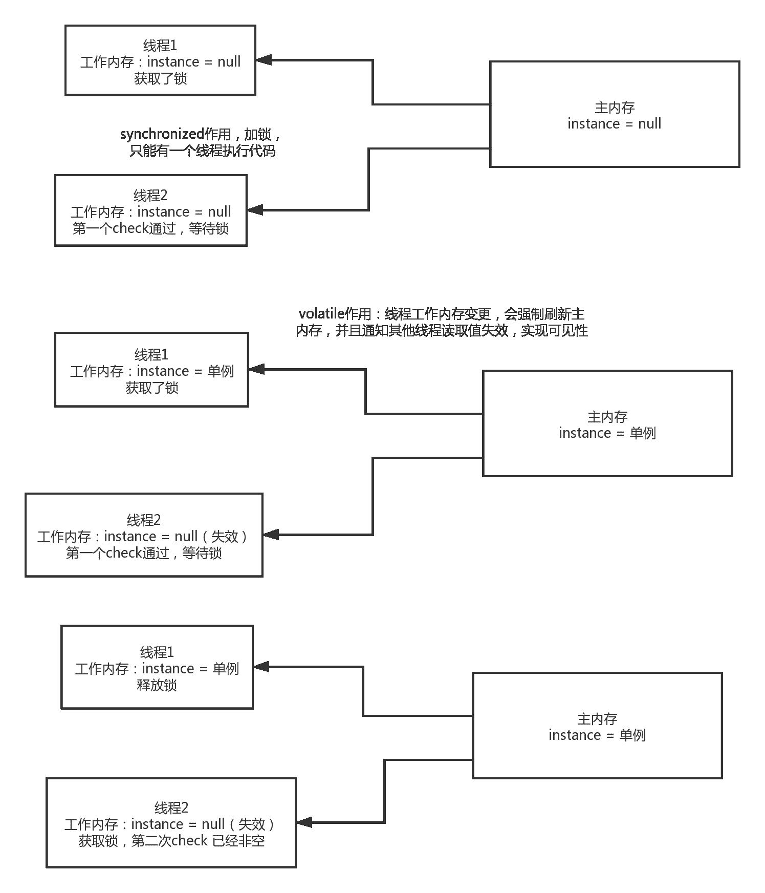

# 二千零二十、第四范式秋招测试开发笔试题

## 1

SQL 编程
打印出每个班级的分数前三名的分数(假设所有学生中没有分数相同的情况, 也就是不考虑并列第一第二第三的场景)
表结构：
id varchar(20),-- 编号
class varchar(20),-- 班级
score int-- 分数

你的答案

本题知识点

测试开发工程师 第四范式 2020

讨论

[gdut17](https://www.nowcoder.com/profile/279358190)

select

    a.*

from

 mscore as a

where    

(select  

     count(*)

from

     mscore as b

where

     b.class = a.class and b.score >= a.score

) <= 3

order by a.class asc, a.score desc;

mysql> select     ->     a.*
    -> from
    ->  mscore as a
    -> where    
    -> (select  
    ->      count(*)
    -> from
    ->      mscore as b
    -> where
    ->      b.class = a.class and b.score >= a.score
    -> ) <= 3
    -> order by a.class asc, a.score desc;
+------+-------+-------+
| id   | class | score |
+------+-------+-------+
| 11   | 1 班   |    98 |
| 13   | 1 班   |    93 |
| 12   | 1 班   |    92 |
| 24   | 2 班   |    76 |
| 22   | 2 班   |    57 |
| 23   | 2 班   |    53 |
| 33   | 3 班   |    98 |
| 35   | 3 班   |    94 |
| 31   | 3 班   |    87 |
+------+-------+-------+
9 rows in set (0.00 sec)

发表于 2020-07-23 10:26:20

* * *

[git](https://www.nowcoder.com/profile/439081)

DROP TABLE IF EXISTS `classes`;
CREATE TABLE `classes`  (
  `id` int(11) NOT NULL AUTO_INCREMENT,
  `class` varchar(20) CHARACTER SET utf8 COLLATE utf8_general_ci NULL DEFAULT NULL,
  `score` int(11) NULL DEFAULT NULL,
  PRIMARY KEY (`id`) USING BTREE
) ENGINE = InnoDB AUTO_INCREMENT = 11 CHARACTER SET = utf8 COLLATE = utf8_general_ci ROW_FORMAT = Compact;
INSERT INTO `classes` VALUES (1, 'A', 85);
INSERT INTO `classes` VALUES (2, 'B', 75);
INSERT INTO `classes` VALUES (3, 'A', 90);
INSERT INTO `classes` VALUES (4, 'A', 100);
INSERT INTO `classes` VALUES (5, 'A', 91);
INSERT INTO `classes` VALUES (6, 'B', 89);
INSERT INTO `classes` VALUES (7, 'B', 99);
INSERT INTO `classes` VALUES (8, 'B', 60);
INSERT INTO `classes` VALUES (9, 'A', 65);
INSERT INTO `classes` VALUES (10, 'B', 78);
方法一： select * from classes c where (select count(*) from classes a where a.class=c.class and  a.score>c.score)<3 order by c.class,c.score desc; 方法二： select * from classes t where exists(select count(*) from classes ts  where ts.score>=t.score  group by ts.class having count(*)<=3) order by class,score desc;性能分析：EXPLAIN select * from classes c where (select count(*) from classes a where a.class=c.class and  a.score>c.score)<3 order by c.class,c.score desc; 
id    select_type    table    type    possible_keys    key    key_len    ref    rows    Extra
1    PRIMARY    c    ALL                    10    Using where; Using filesort
2    DEPENDENT SUBQUERY    a    ALL                    10    Using where

EXPLAIN select * from classes t where exists(select count(*) from classes ts  where ts.score>=t.score  group by ts.class having count(*)<=3) order by class,score desc;
id    select_type    table    type    possible_keys    key    key_len    ref    rows    Extra
1    PRIMARY    t    ALL                    10    Using where; Using filesort
2    DEPENDENT SUBQUERY    ts    ALL                    10    Using where; Using temporary; Using filesort 都使用了 Using filesort，方法二使用了 group by 会产生 Using temporary，也不好。最好的 sql 应该优化掉 2 个。// TODO

发表于 2019-12-16 10:55:23

* * *

## 2

数据结构编程编写一个单链表，要求包含以下方法：插入头节点，删除头结点，在任意位置插入新节点， 在任意位置删除节点。打印所有节点信息，根据位置查找节点

你的答案

本题知识点

测试开发工程师 第四范式 2020

## 3

编程测试题：请从以下 3 道题目中任选一道题解答。
**JAVA**： 编写一个线程安全的单例模式(要求不在类加载时进行初始化)。然后编写测试程序进行测试。
**Python**：实现一个装饰器，要求传入两个参数，第一个是时间单位，第二个是线程数。 时间单位参数支持's'和'ms'。线程数传入整数。  要求：被修饰的函数按照装饰器中指定的线程数启动线程，同时打印函数名与执行时间。
**C/C++**：使用 2 个栈实现队列的先进先出操作并写出测试程序。（栈可以使用 STL 的 stack 或新规一个类来实现）

你的答案

本题知识点

测试开发工程师 第四范式 2020

讨论

[git](https://www.nowcoder.com/profile/439081)

double check+volatile+synchronized 单例模式保证了线程安全创建一个单例对象。

```cpp
public class ConfigurationManager{
    static volatile ConfigurationManager instance = null;

    public static ConfigurationManager getInstance(){
        if(instance == null){
            synchronized(ConfigurationManager.class){
             if(instance == null) { 
                            instance = new ConfigurationManager(); }
            }
        }
        return instance;
    }

}
```



发表于 2019-12-16 11:21:16

* * *

[王富贵啊](https://www.nowcoder.com/profile/583776694)

😂

发表于 2020-07-10 01:48:33

* * *