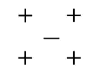

# 二千零二十、第四范式秋招算法笔试题

## 1

增加以下哪些超参数可能导致随机森林模型过拟合数据？
    1\. 决策树的数量；
    2\. 决策树的深度；
    3\. 学习率。

正确答案: B   你的答案: 空 (错误)

```cpp
1
```

```cpp
2
```

```cpp
3
```

```cpp
2，3
```

本题知识点

算法工程师 第四范式 2020

## 2

以下关于深度网络训练的说法正确的是：

正确答案: D   你的答案: 空 (错误)

```cpp
训练过程需要用到梯度，梯度衡量了损失函数相对于模型参数的变化率
```

```cpp
损失函数衡量了模型预测结果与真实值之间的差异
```

```cpp
训练过程基于一种叫做反向传播的技术
```

```cpp
其他选项都正确
```

本题知识点

算法工程师 第四范式 2020

## 3

下列关于过拟合现象的描述中，哪个是正确的：

正确答案: A   你的答案: 空 (错误)

```cpp
训练误差小，测试误差却大
```

```cpp
训练误差小，测试误差也小
```

```cpp
模型的泛化能力高
```

```cpp
其他选项都不正确
```

本题知识点

算法工程师 第四范式 2020

## 4

以下哪一项在神经网络中引入了非线性？

正确答案: B   你的答案: 空 (错误)

```cpp
Dropout
```

```cpp
修正线性单元（ReLU）
```

```cpp
卷积函数
```

```cpp
随机梯度下降
```

本题知识点

算法工程师 第四范式 2020

讨论

[qnstar](https://www.nowcoder.com/profile/506039296)

线性整流函数（Rectified Linear Unit, *ReLU*），又称修正线性单元，是一种人工神经网络中常用的激活函数（activation function），通常指代以斜坡函数及其变种为代表的非线性函数。

发表于 2020-11-21 22:25:57

* * *

## 5

以下哪些方法属于判别式模型(discriminative model)
    1\. 隐马尔科夫模型（HMM）
    2\. 朴素贝叶斯（Naive Bayes）
    3\. 隐含狄利克雷分布（LDA）
    4\. 支持向量机（support vector machine）

正确答案: D   你的答案: 空 (错误)

```cpp
1，4
```

```cpp
2，4
```

```cpp
3，4
```

```cpp
4
```

本题知识点

算法工程师 第四范式 2020

讨论

[lijiajun0499](https://www.nowcoder.com/profile/77212730)

判别式模型：SVM，感知机等生成式模型：朴素贝叶斯，隐马尔科夫模型，隐含狄利克雷分布等

发表于 2021-10-18 19:50:39

* * *

[郢玗](https://www.nowcoder.com/profile/963633360)

HMM 不是生成式嘛

发表于 2020-12-25 01:17:46

* * *

## 6

以下算法（随机搜索，梯度下降，贝叶斯优化）有几种可以用来搜索 GBDT 模型中，树的个数（超参数）？

正确答案: C   你的答案: 空 (错误)

```cpp
0
```

```cpp
1
```

```cpp
2
```

```cpp
3
```

本题知识点

算法工程师 第四范式 2020

## 7

在线性回归中使用正则项，你发现解的不少 coefficient 都是 0，则这个正则项可能是：1\. L0-norm 2\. L1-norm3\. L2-norm

正确答案: A   你的答案: 空 (错误)

```cpp
1，2
```

```cpp
2，3
```

```cpp
2
```

```cpp
3
```

本题知识点

算法工程师 第四范式 2020

讨论

[qnstar](https://www.nowcoder.com/profile/506039296)

- L0 范数：表示向量中所有非零元素的个数。非常适合稀疏编码，特征选择。但不可分，很难优化。
- L1 范数：L1 最优化问题的解是稀疏性的。实际应用中使用 L1 得到 L0 最优凸近似。
- L2 范数：L2 比 L1 具有更平滑特性，比 L1 具有更好的预测特性。若遇到两个对预测有帮助的特征，L1 倾向于选择一个更大的特征，L2 倾向于把两者结合起来。参考：[`t.hengwei.me/post/%E6%B5%85%E8%B0%88l0l1l2%E8%8C%83%E6%95%B0%E5%8F%8A%E5%85%B6%E5%BA%94%E7%94%A8.html#4-%E6%9C%BA%E5%99%A8%E5%AD%A6%E4%B9%A0%E4%B8%AD%E7%9A%84%E5%BA%94%E7%94%A8`](http://t.hengwei.me/post/%E6%B5%85%E8%B0%88l0l1l2%E8%8C%83%E6%95%B0%E5%8F%8A%E5%85%B6%E5%BA%94%E7%94%A8.html#4-%E6%9C%BA%E5%99%A8%E5%AD%A6%E4%B9%A0%E4%B8%AD%E7%9A%84%E5%BA%94%E7%94%A8)

发表于 2020-11-21 22:40:28

* * *

## 8

关于 CNN，以下结论正确的是：

正确答案: C   你的答案: 空 (错误)

```cpp
在同样层数、每层神经元数量一样的情况下，CNN 比全连接网络拥有更多的参数
```

```cpp
CNN 可以用于非监督学习，但是普通神经网络不行
```

```cpp
Pooling 层用于减少图片的空间分辨率
```

```cpp
接近输出层的 filter 主要用于提取图像的边缘信息
```

本题知识点

算法工程师 第四范式 2020

讨论

[layuki](https://www.nowcoder.com/profile/871063698)

自然语言处理

发表于 2020-06-04 18:33:56

* * *

## 9

关于 k-means 算法，正确的描述是：

正确答案: B   你的答案: 空 (错误)

```cpp
能找到任意形状的聚类
```

```cpp
初始值不同，最终结果可能不同
```

```cpp
每次迭代的时间复杂度是 O(n²)，其中 n 是样本数量
```

```cpp
不能使用核函数(kernel function)
```

本题知识点

算法工程师 第四范式 2020

## 10

关于 K-NN 和 Logistic Regression, 描述正确的是：

正确答案: C   你的答案: 空 (错误)

```cpp
两者都是线性分类器
```

```cpp
Logistic Regression 是线性分类器，当 K=1 时，K-NN 是线性分类器
```

```cpp
只有 Logistic Regression 是线性分类器
```

```cpp
K-NN 预测一个样本的时间复杂度和样本集大小无关
```

本题知识点

算法工程师 第四范式 2020

讨论

[lijiajun0499](https://www.nowcoder.com/profile/77212730)

KNN 是非线性分类器预测一个样本时将与样本集所有样本进行相似度度量，根据 top-k 个相关样本标签，占比最大的标签则为预测标签，所以 KNN 预测一个样本的时间复杂度与样本集大小相关

发表于 2021-10-18 19:55:10

* * *

## 11

在线性回归，随机森林和神经网络中，以下哪个决策曲面是随机森林的？A.    B.       C.   

正确答案: B   你的答案: 空 (错误)

```cpp
A
```

```cpp
B
```

```cpp
C
```

```cpp
无
```

本题知识点

算法工程师 第四范式 2020

## 12

给定 N 个数据样本，对某一机器学习模型，考虑用网格搜索（Grid search）来确定其 D 个超参数的值。网格搜索的计算复杂度

正确答案: C   你的答案: 空 (错误)

```cpp
与 D 线性时间相关
```

```cpp
与 D 多项式时间相关
```

```cpp
与 D 指数时间相关
```

```cpp
与 D 不相关
```

本题知识点

算法工程师 第四范式 2020

## 13

对于 Logistic Regression，其中为 loss function，为正则项。对于正则项的说法，有哪些选项是正确的 1) 对于异常样本(outlier)，比更鲁棒(robust)2) 是非凸的 3) 时，常数越大，目标函数的解越稀疏 4) 时，常数越小，目标函数的 l2-norm 越小

正确答案: A   你的答案: 空 (错误)

```cpp
1，3
```

```cpp
1，4
```

```cpp
2，3，4
```

```cpp
2，3
```

本题知识点

算法工程师 第四范式 2020

讨论

[lijiajun0499](https://www.nowcoder.com/profile/77212730)

1、对于异常样本，正则项 L1 比正则项 L2 更具有鲁棒性 3、λ越大，则与之相乘的正则项越小，故具有正则项 L1 损失的目标函数的解越稀疏。

发表于 2021-10-18 20:06:23

* * *

## 14

以下说法正确的是？1） 和预测相比，k-NN 分类器的训练需要花费更多时间
2） 一般来说，训练样本越多, k-NN 分类器准确率越高
3） k-NN 不能用于回归
4） k-NN 分类器对异常点(outlier)很敏感
5） k-NN 分类器的训练误差(training error)是 0

正确答案: C   你的答案: 空 (错误)

```cpp
1，2
```

```cpp
2，4
```

```cpp
2，4，5
```

```cpp
2，3，5
```

本题知识点

算法工程师 第四范式 2020

讨论

[lijiajun0499](https://www.nowcoder.com/profile/77212730)

1、KNN 无需训练；3、KNN 可以用于回归，同于分类的 top-k 样本标签求众数，回归则求平均 4、异常点远离样本集，导致 top-k 标签难定，故敏感 5、无需训练，也就没有训练误差。

发表于 2021-10-18 20:16:59

* * *

## 15

下面哪个分类器可以正确分类所有点（正样本：圆圈，负样本：三角)1\. Logistic regression
2\. SVM with linear kernel
3\. SVM with RBF kernel
4\. Decision tree 
5\. 3-nearest-neighbor classifier (with Euclidean distance).


正确答案: B   你的答案: 空 (错误)

```cpp
2，3，4
```

```cpp
3，4
```

```cpp
1，4，5
```

```cpp
3，4，5
```

本题知识点

算法工程师 第四范式 2020

## 16

假设一个数据集中的数据在二维欧式空间中分布如下：则如果采用留一法（leave one out)对 3-nearest neighbor 模型进行精度(accuracy)的交叉验证，得到的结果是：

正确答案: C   你的答案: 空 (错误)

```cpp
0
```

```cpp
0.4
```

```cpp
0.8
```

```cpp
1
```

本题知识点

算法工程师 第四范式 2020

讨论

[lijiajun0499](https://www.nowcoder.com/profile/77212730)

留一法交叉验证：共五个样本，所有共构建五个 KNN 分类器。留+时，top-3 标签投票始终为+，故此时精度为 1（共四次）留-时，top-3 标签投票为+，故此时精度为 0。
因此平均精度为 4/5=0.8

发表于 2021-10-18 20:21:13

* * *

[牛客 239573288 号](https://www.nowcoder.com/profile/239573288)

4/5=0.8

发表于 2020-09-23 16:57:01

* * *

## 17

随机梯度下降算法(Stochastic Gradient Descent)可以用于以下四种机器学习模型（决策树，线性分类器，SVM 核分类器，多层感知机）中的几种？

正确答案: B   你的答案: 空 (错误)

```cpp
1
```

```cpp
2
```

```cpp
3
```

```cpp
4
```

本题知识点

算法工程师 第四范式 2020

讨论

[lijiajun0499](https://www.nowcoder.com/profile/77212730)

非线性分类器：决策树，SVM 核分类器，KNN 线性分类器：多层感知机，线性 SVM
其中 SVM 核分类器主要使用二次规划问题求解算法或者 SMO 算法，而线性 SVM 可以使用 SGD

发表于 2021-10-18 19:48:08

* * *

## 18

在 Linear regression 中，假设分布为，则模型的泛化误差（方差）至少为

正确答案: A   你的答案: 空 (错误)

```cpp
不确定
```

本题知识点

算法工程师 第四范式 2020

讨论

[零葬](https://www.nowcoder.com/profile/75718849)

泛化误差=偏差+方差+噪声，而题中的 y 关于 x 的条件概率服从均值为 wx+w0 的正态分布，所以偏差几乎没有了

发表于 2020-12-10 16:47:50

* * *

## 19

当训练样本数量趋向于无穷大时，在该数据集上训练的模型变化趋势，对于其描述正确的是 ：

正确答案: C   你的答案: 空 (错误)

```cpp
偏差(bias)变小
```

```cpp
偏差变大
```

```cpp
偏差不变
```

```cpp
不确定
```

本题知识点

算法工程师 第四范式 2020

讨论

[lijiajun0499](https://www.nowcoder.com/profile/77212730)

训练样本数量趋近于无穷大时，模型方差变小，偏差不变，因为偏差模型的拟合能力相似。泛化误差=偏差+方差+噪声：偏差度量了学习算法的期望预测与真实结果的偏离程度，即刻画了模型本身的拟合能力；方差度量了同样大小的训练集的变动所导致的学习性能的变化，即刻画了数据扰动所造成的影响；噪声则表达了在当前任务上任何学习算法所能达到的期望泛化误差的下界，即刻画了学习问题本身的难度。

发表于 2021-10-18 21:20:19

* * *

## 20

已知矩阵，下列向量是的特征向量的是

正确答案: D   你的答案: 空 (错误)

本题知识点

算法工程师 第四范式 2020

讨论

[lijiajun0499](https://www.nowcoder.com/profile/77212730)

经过矩阵变化的非零向量往往发生方向和大小改变。但存在一种情况：非零向量 x 经过 A 矩阵线性变换之后得到的向量与原非零向量 x 方向相同，但是大小不定，即 Ax=λx 此时，向量 x 为 A 矩阵的特征向量，λ为 A 矩阵的特征值。Ax-λx=0，其中 0 为向量(A-λI)x=0，其中 0 为向量，I 与 A 同维的单位向量若展开上式子，则为齐次方程组，若存在非零解 x，则系数行列式|A-λI|=0，进而求得λ=2，根据 Ax-λx=0，求得 x1+x2=0，故所有(x，-x)均为矩阵 A 的特征向量，其中 x 标量未知数。

发表于 2021-10-18 21:45:20

* * *

## 21

设随机变量,的分布函数为，则 的值为：

正确答案: A   你的答案: 空 (错误)

本题知识点

算法工程师 第四范式 2020

讨论

[零葬](https://www.nowcoder.com/profile/75718849)

P(|X| > 2) = Φ(-2) + 1 - Φ(2) = (1 - Φ(2)) + 1 - Φ(2) = 2(1 - Φ(2))

发表于 2020-10-13 11:24:46

* * *

## 22

排 A,B,C,D,E,F 六个字母，使得 A,B 之间恰有两个字母的排列方式一共有：

正确答案: D   你的答案: 空 (错误)

```cpp
12
```

```cpp
72
```

```cpp
36
```

```cpp
144
```

本题知识点

算法工程师 第四范式 2020

讨论

[Hwadream](https://www.nowcoder.com/profile/428817779)

A,B 两个还可以互换位置， 2*（3*A(4,4)）=144

发表于 2020-04-10 04:41:50

* * *

[牛客 531221049 号](https://www.nowcoder.com/profile/531221049)

1\. AB 互换 x22\. AB 中间插两个（剩 4 个） x4x33\. 插完的【AXXB】看作整体（剩 2 个）每种剩下的两个都能交换【AXXB】,_, _ x2_,【AXXB】, _ x2_, _. 【AXXB】 x24\. 一共有 1x2x4x3x6= 144 种

发表于 2021-08-08 02:24:08

* * *

## 23

随机变量，，则

正确答案: D   你的答案: 空 (错误)

```cpp
不确定
```

本题知识点

算法工程师 第四范式 2020

讨论

[零葬](https://www.nowcoder.com/profile/75718849)

X，Y 相互独立或 X，Y 的联合分布属于正太分布时，X+Y 才符合正态分布

发表于 2020-10-13 14:09:18

* * *

[bigodf](https://www.nowcoder.com/profile/290871079)

x 和 y 如果独立的话应该 x+y 应该是服从正态分布的吧题目说随机变量应该是说 x，y 独立吧不太懂。

发表于 2020-09-25 13:51:01

* * *

## 24

对于某种疾病，一个诊断检测有 95%的概率对一个患者给出阳性诊断，有 10%的概率对于一个非患者给出阳性诊断，该疾病在人群中有 0.5%的患病率。现在对某个人进行该疾病的检测，假设对该人和该疾病没有任何其他已知信息，则

正确答案: D   你的答案: 空 (错误)

```cpp
检测结果为阳性的概率是 10%
```

```cpp
检测结果为阳性，此人患有疾病的概率为 90.655%
```

```cpp
检测结果为阴性，此人不患有该疾病的概率为 98.923%
```

```cpp
误诊率为 9.975%
```

本题知识点

算法工程师 第四范式 2020

讨论

[lijiajun0499](https://www.nowcoder.com/profile/77212730)

                                检测为阳性    阴性
人群中 0.5%    患病        95%          5%      人群中 99.5%  非患病    10%          90%1)    检测为阳性的概率为 0.5%*95%+99.5%*10%≠10%;
2)    P(患病|检测为阳性)=P(患病且检测为阳性)/P(检测为阳性)=(0.5%*95%)/(0.5%*95%+99.5%*10%)≈1/(1+20)≈5%;
3)    P(不患病|检测为阴性)=P(不患病且检测为阴性)/P(检测为阴性)=(99.5%*90%)/(0.5%*5%+99.5%*90%)≈1/(1+1/4000)≈99.xxxx%4)    误诊率为 0.5%*5%+99.5%*10%=9.975% 

发表于 2021-10-19 08:36:54

* * *

[零葬](https://www.nowcoder.com/profile/75718849)

总感觉这题有问题啊，最接近的应该是 A 吧

发表于 2020-10-14 21:36:06

* * *

## 25

同一进程下的多个线程可以共享哪一种资源

正确答案: B   你的答案: 空 (错误)

```cpp
stack
```

```cpp
data section
```

```cpp
register set
```

```cpp
thread ID
```

本题知识点

算法工程师 第四范式 2020

## 26

下列关于数据库事务 ACID 特性的说法不正确的是？

正确答案: C   你的答案: 空 (错误)

```cpp
A 指的是原子性，即事务中的所有操作要么全部成功，要么全部失败
```

```cpp
C 指的是一致性，即系统的状态只能是事务前的状态，或者是事务成功后的状态，而不会出现任何不一致的中间状态
```

```cpp
I 指的是可用性，即数据库系统要为事务执行提供尽可能高的可用性，确保大部分事务可以成功的被执行
```

```cpp
D 指的是持久性，即事务成功后即使发生机器断电，也可以恢复到事务成功后的状态
```

本题知识点

算法工程师 第四范式 2020

## 27

在 Linux 上，对于多进程，子进程继承了父进程的下列哪些？1、进程地址空间
2、共享内存
3、信号掩码
4、已打开的文件描述符
5、其他选项都不是

正确答案: D   你的答案: 空 (错误)

```cpp
1，2，3
```

```cpp
2，3，4
```

```cpp
1，3，4
```

```cpp
5
```

本题知识点

算法工程师 第四范式 2020

讨论

[零葬](https://www.nowcoder.com/profile/75718849)

这题有问题吧，两次出现答案不同

发表于 2020-10-14 08:14:38

* * *

[封玉](https://www.nowcoder.com/profile/972810200)

子进程完全复制了父进程的资源，包括进程上下文、代码区、数据区、堆区、栈区、内存信息、打开文件的文件描述符、信号处理函数、进程优先级、进程组号、当前工作目录、根目录、资源限制和控制终端等信息，而子进程与父进程的区别有进程号、资源使用情况和计时器等。

发表于 2020-05-13 22:01:12

* * *

## 28

设在内存中有 P1,P2,P3 三道程序，并按照 P1,P2,P3 的优先级次序运行，其中内部计算和 IO 操作时间由下表给出（CPU 计算和 IO 资源都只能同时由一个程序占用）：P1:计算 60ms---》IO 80ms---》计算 20ms 
P2:计算 120ms---》IO 40ms---》计算 40ms 
P3:计算 40ms---》IO 80ms---》计算 40ms
并行完成三道程序比单道运行节省的时间是（）

正确答案: C   你的答案: 空 (错误)

```cpp
80ms
```

```cpp
120ms
```

```cpp
160ms
```

```cpp
200ms
```

本题知识点

算法工程师 第四范式 2020

讨论

[熊猫东东](https://www.nowcoder.com/profile/641731686)

*   笨办法

    > 串行总时间：
    > P1:60+80+20
    > P2:120+40+40
    > P3:40+80+40

*   并行时间

    > P 总的执行区间段时间：120（并行段）+（80+40+80）+40（并行段）

*   计算总的节省时间

    > （60+40）+（20+40）=160

发表于 2020-10-09 11:08:25

* * *

[零葬](https://www.nowcoder.com/profile/75718849)

注意计算才有并行，io 无并行

发表于 2020-10-13 11:21:59

* * *

[敌不动我不动](https://www.nowcoder.com/profile/9447968)

*   笨办法

    > 串行总时间：
    > P1:60+80+20
    > P2:120+40+40
    > P3:40+80+40

*   并行时间

    > P1:60+80+20
    > P2:40+40+40（节省 80）
    > P3:40+40（节省 80）

*   计算总的节省时间

    > 80+80

发表于 2020-04-26 23:12:34

* * *

## 29

假设系统中有 n 个进程共享 3 台扫描仪，并采用 PV 操作实现进程同步与互斥。若系统信号量 S 的当前值为-1，进程 P1、P2 又分别执行了一次 P(S)操作，那么信号量 S 的值应为 ___。

正确答案: B   你的答案: 空 (错误)

```cpp
1
```

```cpp
-3
```

```cpp
-2
```

```cpp
-1
```

本题知识点

算法工程师 第四范式 2020

讨论

[向往远方的我](https://www.nowcoder.com/profile/806335799)

信号量 s>0，表示有资源可以使用，当资源被使用时，资源数减 1,当资源数为负数时，其值就是系统中等待的进程数

发表于 2021-12-22 20:55:01

* * *

## 30

对于一个有向有环图，其拓扑序

正确答案: A   你的答案: 空 (错误)

```cpp
不存在
```

```cpp
存在且仅有一个
```

```cpp
存在且可以有多个
```

```cpp
视情况而定
```

本题知识点

算法工程师 第四范式 2020

讨论

[bigodf](https://www.nowcoder.com/profile/290871079)

有向无环图存在拓扑序，可能不唯一有环图必不存在拓扑序

发表于 2020-09-25 14:39:54

* * *

## 31

下列哪个说法是错误的：

正确答案: D   你的答案: 空 (错误)

```cpp
栈可以用单向链表来实现
```

```cpp
队列可以用数组来实现
```

```cpp
二叉树可以用数组来实现
```

```cpp
哈希表不可以用数组来实现
```

本题知识点

算法工程师 第四范式 2020

## 32

完全二叉树共有 100 结点，该二叉树有多少个叶子结点？

正确答案: B   你的答案: 空 (错误)

```cpp
49
```

```cpp
50
```

```cpp
51
```

```cpp
52
```

本题知识点

算法工程师 第四范式 2020

## 33

求一个长度为 n 的无序数组的中位数，期望复杂度和最坏复杂度最优分别可以做到

正确答案: C   你的答案: 空 (错误)

```cpp
O(1), O(n)
```

```cpp
O(n), O(n)
```

```cpp
O(n), O(nlogn)
```

```cpp
O(nlogn), O(nlogn)
```

本题知识点

算法工程师 第四范式 2020

## 34

若一个递归函数的规模函数 T(n) = T(n-2) + (n²)/3，则其算法的时间复杂度为

正确答案: C   你的答案: 空 (错误)

```cpp
O(n²)
```

```cpp
O(n² log(n))
```

```cpp
O(n³)
```

```cpp
O(n³ log(n))
```

本题知识点

算法工程师 第四范式 2020

## 35

下列关于过拟合现象的描述中，哪个是正确的

正确答案: A   你的答案: 空 (错误)

```cpp
训练误差小，测试误差大
```

```cpp
训练误差小，测试误差小
```

```cpp
模型的泛化能力高
```

```cpp
其余选项都不对
```

本题知识点

算法工程师 第四范式 2020

## 36

现在有一个长度为 N 的数组 a, 下标范围从 0 到 N-1 ， 给出 Q 组区间 l[i], r[i], 求和。
注意最后的数字之和可能非常大，将最后的和除以 1,000,000,007 的余数输出。

本题知识点

算法工程师 第四范式 2020

讨论

[牛客 700653989 号](https://www.nowcoder.com/profile/700653989)

```cpp
n = int(input())
li = list(map(int, input().split()))
for i in range(1, n):
    li[i] += li[i - 1]
q = int(input())
result = 0
for i in range(q):
    i, j = list(map(int, input().split()))
    result += li[j]
    if i:
        result -= li[i - 1]
print(result % 1000000007)
```

发表于 2020-04-09 14:27:32

* * *

[零葬](https://www.nowcoder.com/profile/75718849)

```cpp
import java.io.BufferedReader;
import java.io.InputStreamReader;
import java.io.IOException;

public class Main {
    public static void main(String[] args) throws IOException {
        BufferedReader br = new BufferedReader(new InputStreamReader(System.in));
        String line1;
        while((line1 = br.readLine()) != null) {
            // 得到待求和的数组
            int n = Integer.parseInt(line1.trim());
            String line2 = br.readLine();
            String[] strArr = line2.trim().split(" ");
            int[] arr = new int[n];
            for(int i = 0; i < n; i++) arr[i] = Integer.parseInt(strArr[i]);
            // 计算累计分布
            for(int i = 1; i < n; i++) arr[i] += arr[i - 1];
            String line3 = br.readLine();
            int Q = Integer.parseInt(line3.trim());
            String line;
            // 通过累积分布来求区间和
            String[] strIds;
            int sum = 0;
            for(int i = 0; i < Q; i++){
                line = br.readLine();
                strIds = line.trim().split(" ");
                int low = Integer.parseInt(strIds[0]);
                int high = Integer.parseInt(strIds[1]);
                sum += arr[high];
                if(low > 0) sum -= arr[low - 1];
                // 对大数进行取余
                sum %= 1000000007;
            }
            System.out.println(sum);
        }
    }
}
```

发表于 2020-10-13 11:16:04

* * *

## 37

朴素贝叶斯分类器假设在给定样本 label 的情况下，样本的不同特征之间相互独立。现用朴素贝叶斯分类器进行垃圾邮件识别，数据包含 4 个特征。现有的训练数据如下表：

现在将所有的特征进行转换后，得到下表（**请在程序以硬编码方式读入**）：转换规则如下：（注：[m,n]表示 m,n 之间的闭区间，[m,+]表示大于 m 的开区间）标题长度（feature 1）：1: [0,3], 2: [3,6]， 3: [6,+]

正文长度（feature 2）：1: [0,10], 2：[10,20], 3: [20,+]

附件含有可执行程序（feature 3）：1： 是， 0：否

正文含特殊字符（feature 4）：1：是，0：否请在程序中读入上述训练数据，实现朴素贝叶斯分类器，语言不限，但不能使用第三方库，不需要考虑平滑方法，然后对给定的测试数据（特征已转换）进行预测，输出结果；

本题知识点

算法工程师 第四范式 2020

讨论

[南瓜风](https://www.nowcoder.com/profile/911953959)

```cpp
该题一个麻烦的是输入与输出的格式的转换 由于不能用第三方库 只能转成 list 形式 
```

发表于 2019-12-31 12:27:16

* * *