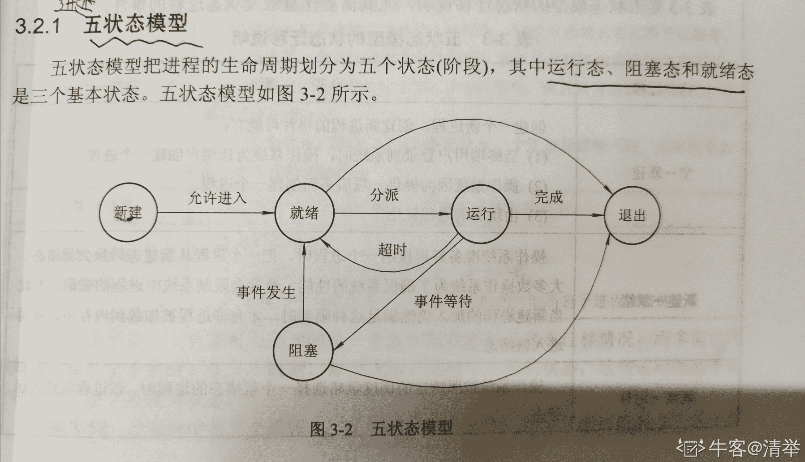
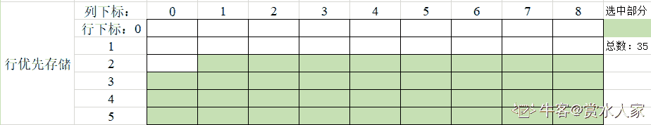
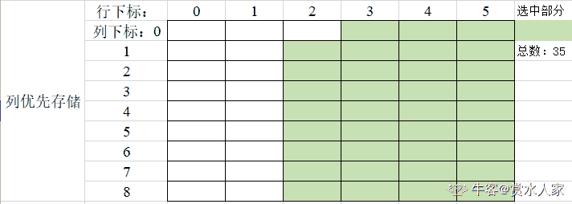
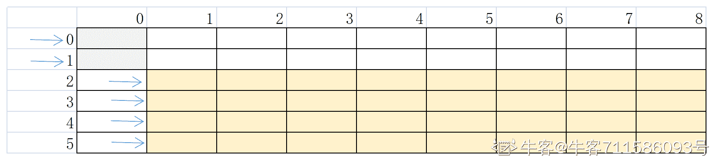
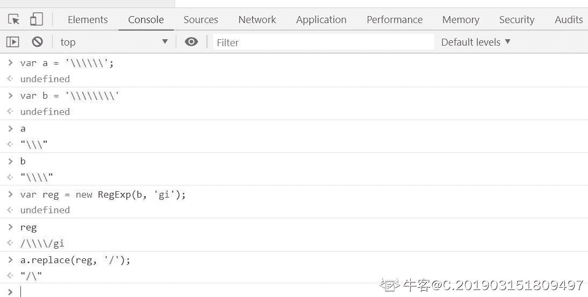
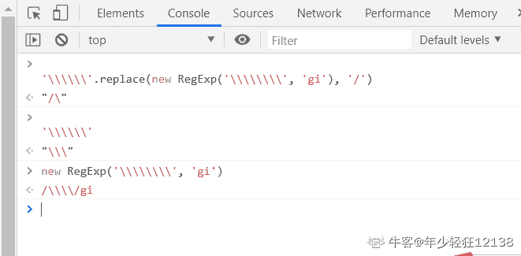
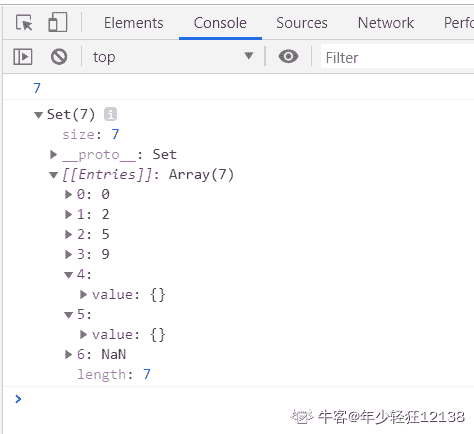
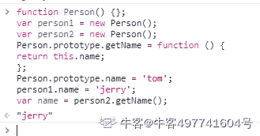
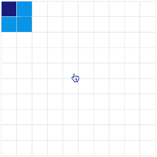

# 百度 2019 校招 Web 前端工程师笔试卷（第三批）

## 1

TCP 和 UDP 说法错误的是（）

正确答案: A   你的答案: 空 (错误)

```cpp
UDP 是面向字节流的协议
```

```cpp
TCP 的头部消息较 UDP 来说更全面
```

```cpp
TCP 是端对端的不支持广播、多播
```

```cpp
TCP 可以用在远程登陆方面，UDP 可以用在语音通话方面
```

本题知识点

前端工程师 百度 2019

讨论

[牛客 791102775 号](https://www.nowcoder.com/profile/791102775)

选 A，tcp 才是面向字节流的协议传输控制协议（TCP，Transmission Control Protocol）是一种面向连接的、可靠的、基于字节流的传输层通信协议，由 IETF 的 RFC 793 [1]  定义。TCP 旨在适应支持多网络应用的分层协议层次结构。 连接到不同但互连的计算机通信网络的主计算机中的成对进程之间依靠 TCP 提供可靠的通信服务。TCP 假设它可以从较低级别的协议获得简单的，可能不可靠的数据报服务。 原则上，TCP 应该能够在从硬线连接到分组交换或电路交换网络的各种通信系统之上操作。UDP 为应用程序提供了一种无需建立连接就可以发送封装的 IP 数据报的方法。RFC 768 [1]描述了 UDP。Internet 的传输层有两个主要协议，互为补充。无连接的是 UDP，它除了给应用程序发送数据包功能并允许它们在所需的层次上架构自己的协议之外，几乎没有做什么特别的事情。面向连接的是 [TCP](https://baike.baidu.com/item/TCP/33012)，该协议几乎做了所有的事情。

编辑于 2019-12-15 17:24:57

* * *

[清举](https://www.nowcoder.com/profile/220318145)

UDP 是面向报文的

发表于 2020-10-11 19:49:58

* * *

[被迫谋生](https://www.nowcoder.com/profile/217164647)

UDP 面向数据报

发表于 2020-02-17 21:34:13

* * *

## 2

下面关于进程三态模型说法错误的是（）

正确答案: B   你的答案: 空 (错误)

```cpp
就绪状态和执行状态可以互相转换
```

```cpp
阻塞状态可以直接转换为执行状态
```

```cpp
就绪状态转换为执行状态进行了进程调度
```

```cpp
阻塞状态可以直接转换为就绪状态
```

本题知识点

前端工程师 百度 2019

讨论

[清举](https://www.nowcoder.com/profile/220318145)



发表于 2020-10-11 19:55:17

* * *

[被迫谋生](https://www.nowcoder.com/profile/217164647)

就绪→执行(调度发生)，执行→就绪(中断) 执行→阻塞(发生等待) 阻塞→就绪

发表于 2020-02-17 21:40:22

* * *

## 3

HTTP 是 Hyper Text Transfer Protocol（超文本传输协议）的缩写。以下那个不是 HTTP 协议的请求方法（）。

正确答案: C   你的答案: 空 (错误)

```cpp
GET
```

```cpp
POST
```

```cpp
PULL
```

```cpp
PUT
```

本题知识点

前端工程师 百度 2019

讨论

[无限的爱人](https://www.nowcoder.com/profile/295142568)

可以通过 GET、 POST、 PUT、 PATCH、 DELETE 等方式对服务端的资源进行操作。其中，GET 用于查询资源，POST 用于创建资源，PUT 用于更新服务端的资源的全部信息，PATCH 用于更新服务端的资源的部分信息，DELETE 用于删除服务端的资源。

发表于 2019-12-26 13:51:43

* * *

[Super_Le](https://www.nowcoder.com/profile/561213495)

 1.0 定义的请求方式：get、post、head
 1.1 新增：options、put、delete、trace、connect

发表于 2020-11-29 13:10:05

* * *

## 4

序列{9,12,17,30,50,20,60,65,4,19}构造为堆后，堆所对应的的中序遍历序列可能为（）

正确答案: B   你的答案: 空 (错误)

```cpp
65,12,30,50,9,19,20,4,,17,60
```

```cpp
65,12,30,9,50,19,4,20,17,60
```

```cpp
65,9,30,12,19,50,4,20,17,60
```

```cpp
65,12,9,30,50,4,20,9,17,60
```

本题知识点

前端工程师 百度 2019

讨论

[哎呀咿呀](https://www.nowcoder.com/profile/476813756)

先将序列构造成堆（最大堆或最小堆），根据堆的特点可知，这是一个完全二叉树，再中序遍历这个完全二叉树，参考链接转[`www.cnblogs.com/mww-NOTCOPY/p/12357402.html`](https://www.cnblogs.com/mww-NOTCOPY/p/12357402.html)

编辑于 2020-03-29 14:16:40

* * *

[空口言 201910242221236](https://www.nowcoder.com/profile/975516553)

先把那个序列写成完全二叉树的样子，然后构造小顶堆

发表于 2020-02-22 10:17:55

* * *

## 5

下面程序的时间复杂度为多少

```cpp
int i,j,a;
for(i=1;i<n.i++)
{
   for(j=1;j<n;j*=2)
   {
       a = i+j;
       cout<<a<<endl;
    }
}
```

正确答案: B   你的答案: 空 (错误)

```cpp
O(n)
```

```cpp
O(n*log2(n))
```

```cpp
O(n2)
```

```cpp
O(n*n/2)
```

本题知识点

前端工程师 百度 2019

## 6

数据结构中，如果存在二维数组 Q，Q 的行下标取值为 2-5，Q 的列下标取值为 1-8，对于 Q 中的元素用相邻的 6 个字节存储，存储器按字节编址，数组 Q 的字节为（）

正确答案: A   你的答案: 空 (错误)

```cpp
204
```

```cpp
168
```

```cpp
192
```

```cpp
188
```

本题知识点

前端工程师 百度 2019

讨论

[赏水人家](https://www.nowcoder.com/profile/135740671)

二维数组 Q 行下标为 0-5、列下标为 0-8
取行下标取值为 2-5，列下标取值为 1-8
（1）按行优先存储
则所取元素如下图所示，共 4 * *9-1=35 个元素，每个元素 6 个字节，共 35 * *6=210 个字节

（2）按列优先存储
则所取元素如下图所示，共 4 * *9-1=35 个元素，每个元素 6 个字节，共 35 * *6=210 个字节


疑问：难道不是这样的吗？？

编辑于 2020-03-26 13:02:44

* * *

[Vault_Dweller](https://www.nowcoder.com/profile/250614235)

元素数量= 4*8 =32 字节数= 32 * 6 = 192 为什么是 204 呢

发表于 2020-01-06 07:36:23

* * *

[牛客 711586093 号](https://www.nowcoder.com/profile/711586093)

我的猜想是：  虽然地 0、1 行为空，但也需要占两个元素形成二维数组，共需（4*8+2）*6=204

发表于 2021-03-30 10:13:18

* * *

## 7

前缀表达式+^A*B-CD/E/F+GH 的中缀表达式是（）。

正确答案: C   你的答案: 空 (错误)

```cpp
A^B*C-D+E/F/G+H
```

```cpp
A^B*(C-D)+E/F/G+H
```

```cpp
A^(B*(C-D))+(E⁄F)⁄((G+H))
```

```cpp
A^B*C-D+E/F/(G+H)
```

本题知识点

前端工程师 百度 2019

讨论

[Susan2333](https://www.nowcoder.com/profile/727400294)

可用栈实现。若为字母就入栈；若为运算符就将栈顶两个字母弹出，加上运算符计算后再将得到的代数表达式入栈，依次进行，最后栈中留下中缀表达式形式。

发表于 2019-12-30 21:59:27

* * *

[Olivia_dtt](https://www.nowcoder.com/profile/232985383)


发表于 2020-03-17 15:00:07

* * *

[C.201903151809497](https://www.nowcoder.com/profile/868599228)

答案是不是有问题呀？求解。。。

发表于 2020-03-10 22:43:55

* * *

## 8

嵌入多媒体文本的 HTML 的写法正确的是()

正确答案: B   你的答案: 空 (错误)

```cpp
<a url=”#”></a>
```

```cpp
<embed src=”#”></embed>
```

```cpp
<a src=”#”></a>
```

```cpp
<embed href=”#”></embed>
```

本题知识点

前端工程师 百度 2019

讨论

[买尔旦江](https://www.nowcoder.com/profile/752368982)

src: 一般是把资源嵌入到文本里 href： 一般是与某个资源建立连接

发表于 2020-03-12 22:18:09

* * *

## 9

a:HTML 文档扩展名为.html 或.htm; b:HTML 文档必须包括 head 和 body 部分,以下说法正确的是（）

正确答案: C   你的答案: 空 (错误)

```cpp
两种说法均正确；
```

```cpp
两种说法均错误；
```

```cpp
只有 a 说法正确；
```

```cpp
只有 b 说法正确；
```

本题知识点

前端工程师 百度 2019

讨论

[夏花爱秋叶](https://www.nowcoder.com/profile/4085682)

## html 文档可以省略这三个 html,head,body 标签！！！
1\. 例子
```cpp
<!DOCTYPE html>
ddd

```
* `虽然缺少了 html 标签，body 标签，head 标签，依旧会被正确解析`为:
```cpp
<html>
    <head>
    </head>
    <body>
        ddd
    </body>
</html>
```

编辑于 2020-02-20 23:03:50

* * *

## 10

在不指定特殊属性的情况下，以下标签可以手动输入文本的是

正确答案: B   你的答案: 空 (错误)

```cpp
<input type="hidden"/>
```

```cpp
<textarea></textarea>
```

```cpp
<div></div>
```

```cpp
<a></a>
```

本题知识点

前端工程师 百度 2019

讨论

[牛客 187848039 号](https://www.nowcoder.com/profile/187848039)

<textarea> 标签定义多行的文本输入控件。

发表于 2020-03-13 17:00:00

* * *

[BrynnBrynn](https://www.nowcoder.com/profile/3462039)

 B 文本编辑

发表于 2020-06-14 21:33:43

* * *

## 11

关于 HTML 的描述，不推荐的是

正确答案: C   你的答案: 空 (错误)

```cpp
在页面顶部必须加入 DOCTYPE 声明；
```

```cpp
尽量将 js 引用放到 HTML 页面底部；
```

```cpp
可以使用 center 标签来设置元素居中；
```

```cpp
使用 table 标签来处理数据相关的展示；
```

本题知识点

前端工程师 百度 2019

讨论

[WEBJ2EE](https://www.nowcoder.com/profile/3930151)

纯渲染层面，建议是 CSS； 选 C；

发表于 2019-12-22 11:26:15

* * *

[123qwer.1](https://www.nowcoder.com/profile/567724293)

center 标签实现文字居中，不过我想多了，因为 table 标签渲染是普通标签的四倍，所以下意识选了 d...

发表于 2019-12-06 21:57:44

* * *

[买尔旦江](https://www.nowcoder.com/profile/752368982)

center 是文字居中，tabel 的性能确实不好，而且结构看起来不怎么清晰，不推荐使用

发表于 2020-03-12 22:20:08

* * *

## 12

SVG 图形与 canvas 的区别错误的是

正确答案: C   你的答案: 空 (错误)

```cpp
canvas 是 HTML5 提供的新元素;
```

```cpp
canvas 绘制的是标量图，svg 绘制的是矢量图；
```

```cpp
canvas 绘制的图形能被搜索引擎抓取；
```

```cpp
canvas 绘制图形通常是 JavaScript 实现，svg 图形通常通过 html 标签来实现；
```

本题知识点

前端工程师 百度 2019

讨论

[喃喃呐呐](https://www.nowcoder.com/profile/979887643)

**svg**

SVG 指可伸缩矢量图形 (Scalable Vector Graphics)。
SVG 用来定义用于网络的基于矢量的图形。
SVG 使用 XML 格式定义图形。
SVG 图像在放大或改变尺寸的情况下其图形质量不会有所损失。
SVG 是万维网联盟的标准。
SVG 与诸如 DOM 和 XSL 之类的 W3C 标准是一个整体。

**canvas**

HTML5 的 canvas 元素使用 JavaScript 在网页上绘制图像。画布是一个矩形区域，您可以控制其每一像素。canvas 拥有多种绘制路径、矩形、圆形、字符以及添加图像的方法。

**功能区别**

SVG 是一种使用 XML 描述 2D 图形的语言。
SVG 基于 XML，这意味着 SVG DOM 中的每个元素都是可用的。您可以为某个元素附加 JavaScript 事件处理器。
在 SVG 中，每个被绘制的图形均被视为对象。如果 SVG 对象的属性发生变化，那么浏览器能够自动重现图形。

Canvas 通过 JavaScript 来绘制 2D 图形。
Canvas 是逐像素进行渲染的。
在 canvas 中，一旦图形被绘制完成，它就不会继续得到浏览器的关注。如果其位置发生变化，那么整个场景也需要重新绘制，包括任何或许已被图形覆盖的对象。

**技术区别**

canvas 不依赖分辨率。
canvas 支持事件处理器。
canvas 最适合带有大型渲染区域的应用程序（比如谷歌地图）。
canvas 复杂度高会减慢渲染速度（任何过度使用 DOM 的应用都不快）。
canvas 不适合游戏应用**。**

svg 依赖分辨率。
svg 不支持事件处理器。
svg 弱的文本渲染能力。
svg 能够以 .png 或 .jpg 格式保存结果图像。
svg 最适合图像密集型的游戏，其中的许多对象会被频繁重绘**。**

发表于 2020-09-11 16:11:58

* * *

[夏花爱秋叶](https://www.nowcoder.com/profile/4085682)

* `svg 可以给每一个图形添加事件，canvas 不可以`
* `svg 的图形都是用 xml 标签画出来的，canvas 是用 js 绘制的`
* `canvas 绘制的是位图(标量图)也就是一个个像素绘制出来的，而 svg 是矢量图，也就是用几何特性会描述图像，并且可以无限制的自由组合`

发表于 2020-02-20 23:07:43

* * *

## 13

HTML5 新增的表单元素不包括

正确答案: A   你的答案: 空 (错误)

```cpp
password；
```

```cpp
color；
```

```cpp
data；
```

```cpp
number;
```

本题知识点

前端工程师 百度 2019

讨论

[WEBJ2EE](https://www.nowcoder.com/profile/3930151)

A 注意：C 存在拼写错误... date；

发表于 2019-12-21 21:45:26

* * *

[空口言 201910242221236](https://www.nowcoder.com/profile/975516553)

 表单控：color ,  calendar  ,  date ,  datetime, datetime-local,  time, mouth , week, email, url , search,range, tel

新的表单元素： datalist ， keygen， output

发表于 2020-02-22 11:06:40

* * *

[爱学习的小菜鸟鸟](https://www.nowcoder.com/profile/828275429)

number 也是啊，我去，color ，date，number

发表于 2020-09-09 21:44:24

* * *

## 14

transition 与 animation 的区别说法错误的是

正确答案: B   你的答案: 空 (错误)

```cpp
transition 着重属性的变化，而 animation 重点是在创建帧，让不同帧在不同时间点发生不同变化；
```

```cpp
animation 需要时间触发来达到动画的效果；
```

```cpp
animation 可以实现复杂的动画；
```

```cpp
animation 通过@keyframe 控制当前帧的属性；
```

本题知识点

前端工程师 百度 2019

讨论

[喃喃呐呐](https://www.nowcoder.com/profile/979887643)

transition 是过度属性，强调过度，他的实现需要触发一个事件（比如鼠标移动上去，焦点，点击等）才执行动画。它类似于 flash 的补间动画，设置一个开始关键帧，一个结束关键帧。
animation 是动画属性，他的实现不需要触发事件，设定好时间之后可以自己执行，且可以循环一个动画。他也类似于 flash 的补间动画，但是他可以设置多个关键帧（用@keyframe 定义）完成动画。

发表于 2020-09-11 16:13:57

* * *

[牛客 187848039 号](https://www.nowcoder.com/profile/187848039)

animation 可以一帧一帧执行 不需要事件的触发

发表于 2020-03-13 17:05:42

* * *

[爱学习的小菜鸟鸟](https://www.nowcoder.com/profile/828275429)

animation 可以不需要事件的触发，一帧一帧的发送就可以了

发表于 2020-09-09 21:46:05

* * *

## 15

在面向对象技术中，多态性是指（）

正确答案: C   你的答案: 空 (错误)

```cpp
—个类可以派生出多个类
```

```cpp
—个对象在不同的运行环境中可以有不同的变体
```

```cpp
针对一消息，不同对象可以以适合自身的方式加以响应
```

```cpp
—个对象可以由多个其他对象组成
```

本题知识点

前端工程师 百度 2019

讨论

[一叶舟 troy](https://www.nowcoder.com/profile/795673)

c 为什么题目这么描述这么别扭

发表于 2020-02-07 12:00:33

* * *

[牛客 243373836 号](https://www.nowcoder.com/profile/243373836)

多态是在一个抽象的层面上实现一个统一的行为。

发表于 2021-03-17 15:54:04

* * *

## 16

'\\\\\\'.replace(new RegExp('\\\\\\\\', 'gi'), '/') 的执行结果是？

正确答案: A   你的答案: 空 (错误)

```cpp
/\
```

```cpp
\/
```

```cpp
\\//
```

```cpp
//\\
```

本题知识点

前端工程师 百度 2019

讨论

[C.201903151809497](https://www.nowcoder.com/profile/868599228)

在字符串里面， 字符串\ 是需要进行转义的，所以字符串\得写为'\\'在正则表达式中，正则表达式\也是需要进行转义的，所以正则表达式表达式\得写为/\\/所以，题目得意思是：在字符串\\\中全局匹配，忽略大小写，把匹配到的字符串\\换成字符串/

发表于 2020-03-22 20:11:04

* * *

[年少轻狂 12138](https://www.nowcoder.com/profile/2899702)



发表于 2020-02-15 23:00:15

* * *

[SolinJ](https://www.nowcoder.com/profile/884596239)

左边字符串中对\要转义右边 RegExp 中的\要进行双重转义就是用\\匹配字符串\\\，用/替换，就成了/\

发表于 2020-01-09 10:56:49

* * *

## 17

执行下列语句后，变量 name 的值为 var name = '1';new Promise(function (resolve, reject) {resolve();reject();}).then(function () {name = '2';}).catch(function () {name = '3';});name = '4';

正确答案: B   你的答案: 空 (错误)

```cpp
1
```

```cpp
2
```

```cpp
3
```

```cpp
4
```

本题知识点

前端工程师 百度 2019

讨论

[MV13eard](https://www.nowcoder.com/profile/863005403)

new Promise 是异步的，所以它会在最后执行。然后 resolve 和 reject 两种状态只会触发一种，先调用 resolve 方法，就不会调用 reject 方法，接着执行 then 后面的回调函数，所以最后 name 为 2；看顺序效果的话可以在每个 name 后面打印一下即可，代码如下

```cpp
        var name = '1';
        console.log(name);
        new Promise(function (resolve, reject) {
            resolve();
            reject();
        }).then(function () {
            name = '2';
            console.log(name);

        }).catch(function () {
            name = '3';
            console.log(name);

        });
        name = '4';
        console.log(name);
```

发表于 2020-01-07 15:31:53

* * *

[牛客 864780232 号](https://www.nowcoder.com/profile/864780232)

先执行宏任务 var name = 1resolve() // 我理解为 return，所以 reject 不会执行 然后 name = 4 然后是微任务 name = 2 所以最后 name 为 2

发表于 2020-02-10 20:39:25

* * *

[123qwer.1](https://www.nowcoder.com/profile/567724293)

peomise 微任务，promise 只能由等待－>已执行或者已拒绝。所以只会进入.then 这个微任务。所以输出

发表于 2019-12-06 22:02:45

* * *

## 18

执行下列语句后，变量 a 的值为 Dvar a = [].push(...[1, 2, 3]);

正确答案: D   你的答案: 空 (错误)

```cpp
[1, 2, 3]
```

```cpp
[1]
```

```cpp
1
```

```cpp
3
```

本题知识点

前端工程师 百度 2019

讨论

[好运来 201808031139993](https://www.nowcoder.com/profile/849695554)

push() 方法可向数组的末尾添加一个或多个元素，并返回新的长度。

发表于 2019-12-25 15:04:36

* * *

[123qwer.1](https://www.nowcoder.com/profile/567724293)

返回新长度。

发表于 2019-12-06 22:04:26

* * *

## 19

根据如下代码，set.size 的值为 var set = new Set([0, 2, 2, 0, 0, 5, 9, {}, {}, NaN, NaN]);

正确答案: B   你的答案: 空 (错误)

```cpp
6
```

```cpp
7
```

```cpp
8
```

```cpp
11
```

本题知识点

前端工程师 百度 2019

讨论

[牛客 400830964 号](https://www.nowcoder.com/profile/400830964)

两个空值为不同元素，NaN 为相同元素，还有四个不同的数字

发表于 2020-03-14 15:49:01

* * *

[年少轻狂 12138](https://www.nowcoder.com/profile/2899702)



发表于 2020-02-15 23:34:47

* * *

[123qwer.1](https://www.nowcoder.com/profile/567724293)

ES6 提出“Same-value equality”（同值相等）算法

不同之处只有两个：一是+0 不等于-0，二是 NaN 等于自身。

set 使得 NaN 和 NaN 对比是相等的，解决了===在 NaN 上的 bug

编辑于 2020-03-29 18:42:36

* * *

## 20

下列说法中错误的是

正确答案: B   你的答案: 空 (错误)

```cpp
JSON 只是一种数据格式，不从属于 JavaScript
```

```cpp
在事件流过程中，首先发生的阶段是冒泡阶段
```

```cpp
document.querySelector 方法在没有找到匹配的元素时会返回 null
```

```cpp
ECMAScript 中只有 5 种基本数据类型
```

本题知识点

前端工程师 百度 2019

讨论

[HEXOGEN](https://www.nowcoder.com/profile/547898083)

MDN:

> 最新的 ECMAScript 标准定义了 8 种数据类型：
> 
> *   七种基本数据类型:
>     *   布尔值（Boolean），有 2 个值分别是：true 和 false.
>     *   null ， 一个表明 null 值的特殊关键字。 JavaScript 是大小写敏感的，因此 null 与 Null、NULL 或变体完全不同。
>     *   undefined ，和 null 一样是一个特殊的关键字，undefined 表示变量未定义时的属性。
>     *   数字（Number），整数或浮点数，例如： 42 或者 3.14159。
>     *   任意精度的整数 (BigInt) ，可以安全地存储和操作大整数，甚至可以超过数字的安全整数限制。
>     *   字符串（String），字符串是一串表示文本值的字符序列，例如："Howdy" 。
>     *   代表（Symbol） ( 在 ECMAScript 6 中新添加的类型).。一种实例是唯一且不可改变的数据类型。
> *   以及对象（Object）。

发表于 2020-03-16 15:33:08

* * *

[123qwer.1](https://www.nowcoder.com/profile/567724293)

两个错的选更错的，显然 b 更错。事件触发顺序则是先捕获后冒泡，这个是肯定的。但是题目没说 es6,所以说五种也是可以吧。

发表于 2019-12-06 22:13:38

* * *

[牛客 864780232 号](https://www.nowcoder.com/profile/864780232)

es6 中好像增加了 symbol

发表于 2020-02-10 20:43:57

* * *

## 21

下列说法中正确的是

正确答案: B   你的答案: 空 (错误)

```cpp
JSONP 不是一种跨域技术
```

```cpp
调用 Date 构造函数而不传参数时，得到的对象自动获得当前时间
```

```cpp
调用 setInterval 方法后得到的返回值为 undefined
```

```cpp
所有的 RegExp 实例对象都可以调用 match 方法
```

本题知识点

前端工程师 百度 2019

讨论

[买尔旦江](https://www.nowcoder.com/profile/752368982)

我怎么就选错了呢。。。SetInterval 返回的是定时器的 ID，可以利用 clearInterval（定时器 Id）来清除这个定时器

发表于 2020-03-12 22:28:18

* * *

[烟雨仔](https://www.nowcoder.com/profile/686030081)

D 选项为啥错呢?求大佬解惑。

发表于 2021-02-26 23:36:57

* * *

[爱学习的小菜鸟鸟](https://www.nowcoder.com/profile/828275429)

JSONP 是一种常见且常用的跨域方式

发表于 2020-09-09 22:02:17

* * *

## 22

执行下列语句后， 变量 name 的值为 function Person() {};var person1 = new Person();var person2 = new Person();Person.prototype.getName = function () {return this.name;};Person.prototype.name = 'tom';person1.name = 'jerry';var name = person2.getName();

正确答案: A   你的答案: 空 (错误)

```cpp
tom
```

```cpp
jerry
```

```cpp
name
```

```cpp
undefined
```

本题知识点

前端工程师 百度 2019

讨论

[牛客 497741604 号](https://www.nowcoder.com/profile/497741604)



发表于 2020-03-14 14:15:42

* * *

[被迫谋生](https://www.nowcoder.com/profile/217164647)

实例 person2 没有自定义 name 的值，使用其原型对象的 name 值 tom

发表于 2020-02-24 21:57:29

* * *

## 23

执行下列语句后，变量 name1 的值为 var name = 'tom';function getMethod() {var result = function () {return name;};var name = 'jerry';return result;}var getName = getMethod();var name1 = getName();

正确答案: B   你的答案: 空 (错误)

```cpp
tom
```

```cpp
jerry
```

```cpp
name
```

```cpp
undefined
```

本题知识点

前端工程师 百度 2019

讨论

[牛客 684299216 号](https://www.nowcoder.com/profile/684299216)

这道题考的是闭包，赋给 getName 的事指向函数 result 的指针，result 是闭包，可以读取 getMethod 的私有变量，因此返回值为 jerry

发表于 2020-03-11 00:25:57

* * *

[Zion0707](https://www.nowcoder.com/profile/826171682)

var 变量提升，var 声明始终在函数前面。第二个 var name = 'jerry' 也会进行提升，提升到 var result = function 前面，所以 result 中的 name 等于 'jerry'

编辑于 2020-02-26 23:21:26

* * *

[Kacoo](https://www.nowcoder.com/profile/4633775)

这题考的是闭包吧

发表于 2019-12-11 22:32:58

* * *

## 24

以下关于 OS 的说法正确的是

正确答案: A B C   你的答案: 空 (错误)

```cpp
多道批处理系统的特点：资源利用率高、系统吞吐量大、平均周转时间长、无交互能力
```

```cpp
分时系统具有多路性、独立性、及时性、交互性
```

```cpp
操作系统的基本特征：并发、共享、虚拟、异步
```

```cpp
在 OS 中通过时分复用和码分复用实现“虚拟”
```

本题知识点

前端工程师 百度 2019

讨论

[MIMOSA6204](https://www.nowcoder.com/profile/364655155)

在 OS 中通过时分复用和空分复用实现“虚拟”

发表于 2020-03-12 17:50:53

* * *

[牛客 73811232 号](https://www.nowcoder.com/profile/73811232)

复用和虚拟相比较，复用所分割的是实际存在的物理资源，而虚拟则实现假想的同类资源。虚拟技术解决某类物

发表于 2020-08-25 00:51:22

* * *

## 25

下面说法不正确的是？

正确答案: A C D   你的答案: 空 (错误)

```cpp
若(u，v)是连通网络的一条最小权值的边，则不论采用何种方法构造该网络的最小生成树， 所构造出最小生成树一定包含(u，v)这条边。
```

```cpp
对于静态表的顺序查找法，若在表头设置监视哨，则正确的查找方式为从第 n 个元素往开始前查找该数据元素
```

```cpp
单向哈希表的特征包括：把固定的信息转化成任意长度信息输出
```

```cpp
树的后序遍历序列等同于该树对应的二叉树的后序序列，先序遍历序列等同于该树先序序列
```

本题知识点

前端工程师 百度 2019

讨论

[ha!](https://www.nowcoder.com/profile/70651961)

A.如果(u，v)是连通网络的唯一的一条最小权值的边，那么一定包含(u，v)这条边

D.树的先序对应二叉树的先序，树的后序对应二叉树的中序

发表于 2020-03-15 12:06:08

* * *

[月小蚀](https://www.nowcoder.com/profile/291385771)

任意长度计算成固定长度的哈希值

发表于 2020-03-26 13:49:01

* * *

[牛客 188915842 号](https://www.nowcoder.com/profile/188915842)

唯一的

发表于 2020-03-13 00:30:11

* * *

## 26

面向对象程序设计方法的优点包含：

正确答案: A B C   你的答案: 空 (错误)

```cpp
可重用性
```

```cpp
可扩展性
```

```cpp
易于管理和维护
```

```cpp
简单易懂
```

本题知识点

前端工程师 百度 2019

## 27

假定需要在 node.js 环境中执行一些用户上传的自定义代码，在没有做任何沙盒等安全措施的前提下，存在哪些安全隐患？

正确答案: A B C   你的答案: 空 (错误)

```cpp
大量的同步计算造成进程卡死
```

```cpp
执行 process.exit(1) 造成进程直接退出
```

```cpp
执行 require('child_process').spwan()，直接调用系统程序，造成系统层面的危害
```

```cpp
自定义代码抛出的异常无法被捕获
```

本题知识点

前端工程师 百度 2019

## 28

关于 node.js 中的模块化规范，以下说法正确的有哪些？

正确答案: A B D   你的答案: 空 (错误)

```cpp
require 加载模块是一个同步的过程
```

```cpp
require 函数可以在代码的任意位置执行
```

```cpp
模块最终导出的是 exports，而不是 module.exports
```

```cpp
exports 或 module.exports 其中一个一旦重新赋值，exports 将失效
```

本题知识点

前端工程师 百度 2019

讨论

[桃子碎碎](https://www.nowcoder.com/profile/2127597)

ES6 标准发布后，module 成为标准，标准的使用时以 export 指令导出接口，以 import 引入模块，但是在以往的 node 模块中，我们采用的是 CommonJS 规范，使用 require 引入模块，使用 module.exports 导出接口 exports 和 module.exports 都对

发表于 2020-03-01 19:17:42

* * *

[LittleStoneys](https://www.nowcoder.com/profile/324218921)

```cpp
// { foo:'bar' }
exports.foo = 'bar'

// { foo:'bar',a:123 }
module.exports.a = 123

// 将 exports 的引用改变了
exports = {
    a: 456
}

// { foo:'foo',a:123 }
module.exports.foo = 'foo'

// 无效
exports.a = 567

exports = module.exports

// { foo: 'foo', a: 123, c: 789 }
exports.c = 789
```

一段代码搞懂 D 选项

发表于 2020-09-02 14:11:10

* * *

[被迫谋生](https://www.nowcoder.com/profile/217164647)

c 反了？

发表于 2020-02-17 22:30:23

* * *

## 29

下面选项中属于 Node 定时器的是？

正确答案: A B C D   你的答案: 空 (错误)

```cpp
setTimeout()
```

```cpp
setInterval()
```

```cpp
setImmediate()
```

```cpp
process.nextTick()
```

本题知识点

前端工程师 百度 2019

讨论

[喃喃呐呐](https://www.nowcoder.com/profile/979887643)

node 的定时器共有四种，分别是：setTimeout()，setInterval()，setImmediate()，process.nextTick()
前两个是语言的标准，后两个是 node 独有的。
node 的异步任务可以分为两种，分别是追加在 本轮循环 的异步任务和追加在 次轮循坏 的异步任务。本轮循环一定早于次轮循坏执行。
node 规定，process.nextTick 和 Promise 的回调函数，追加在本轮循环，即同步任务一旦执行完成就开始执行他们。而 setTimeout、setInterval、setImmediate 的回调函数追加在次轮循坏。

发表于 2020-09-11 16:23:02

* * *

## 30

以下代码能在不同环境下（不考虑兼容性问题）正确判断变量 a = [] 是数组的有：

正确答案: B C   你的答案: 空 (错误)

```cpp
a instanceof Array
```

```cpp
Array.isArray(a)
```

```cpp
Object.prototype.toString.call(a) === '[object Array]'
```

```cpp
typeof a === 'array'
```

本题知识点

前端工程师 百度 2019

讨论

[0fferr](https://www.nowcoder.com/profile/289584596)

instanceof 操作符的问题在于，它假定只有一个全局环境。如果网页中包含多个框架，那实际上就存在两个以上不同的全局执行环境，从而存在两个以上不同版本的 Array 构造函数。
如果你从一个框架向另一个框架传入一个数组，那么传入的数组与在第二个框架中原生创建的数组分别具有各自不同的构造函数。
var iframe = document.createElement('iframe');
    document.body.appendChild(iframe);

    var arr = [1,2,3];
    xArray = window.frames[0].Array;  //iframe 中的构造函数
    var arrx = new xArray(4,5,6);

    console.log(arrx instanceof Array);  //false
    console.log(arrx.constructor == Array);// false

    console.log(Array.prototype == xArray.prototype); //false
    console.log(arr instanceof xArray); //false

    console.log(arrx.constructor === Array);// false
    console.log(arr.constructor === Array);// true
    console.log(arrx.constructor === xArray);// true
    console.log(Array.isArray(arrx));  //true

发表于 2019-12-11 17:01:21

* * *

[清宁修瑾](https://www.nowcoder.com/profile/885589305)

typeof 主要用于判断数据是不是基本数据类型：String、Number、Object、Null、Undefined，但是无法判断出 function、array、regExp
instanceof 主要的目的是用来检测引用类型，判断 Array 和 RegExp，无法准确判断 Function

发表于 2020-08-13 15:07:44

* * *

[充电大喵](https://www.nowcoder.com/profile/881277660)

那要是按这样说，下面这个代码也是不能正确判断的啊（毕竟我也可以说 foo 里面也是个环境），虽然下面的写法几乎不会出现，但上面的写法也是极少会出现的。

所以我觉得这题有点钻牛角尖。

function foo() {
function Array(){}

if (Array.isArray(a)) {//会报错 undefined is not a function
console.log(&#39;a is an array&#39;)
}
}

foo()

发表于 2020-03-01 22:38:25

* * *

## 31

用 js 实现一个用户行收集器，功能如下：

1，收集用户在页面中的所有 click 行为，并使用 log 方法发送日志，包含触发事件的节点 xpath 信息

2，xpath 需包含 tagName、id、class、同级同名节点索引(从 1 开始)，如

<body>

<div id=“container”>

<p>something</p>
<a id=“link1” class=“link-class”></a>
<a id=“link2” class=“link-class current”>target link</a>

</div> 

</body>

点击 target link 时，xpath 为 body[1]/div[1][@id=“container”]/a[2][@id=“link2”][contains(@class, “link-class")][contains(@class, “current")]

3，不侵入、不影响其他业务代码的执行

你的答案

本题知识点

前端工程师 百度 2019

讨论

[offer 快到碗里来呀~](https://www.nowcoder.com/profile/473630826)

改了下前面兄弟的代码，因为上一位兄弟的代码中无法判断隔了一个标签的相同标签即<a>-><p>-><a>,第二个 a 应该为 a2 而不是 a1

```cpp
 // 遍历深度树形结构
        var obody = document.getElementsByTagName('body')[0];
        obody.addEventListener('click', function (e) {
            console.log(getXPath(e.target));
        })

        function getXPath(target) {
            if (target.nodeName == 'BODY') return 'body[1]';
            var index = 1;

            var str = '';
            var tempTarget = target;
            var nodeName = target.nodeName;
            var id = target.id;
            var classList = target.classList;
            // 这是在前面一个才可以，如果前面不是一样的标签，再前面有就不可以了
            // while (tempTarget.previousElementSilbling != null && tempTarget.previousElementSilbling.nodeName == nodeName) {
            //     index++;
            //     // 当前一个节点存在且和自己是同一个标签，index++
            //     // 然后把 target 转到前面的标签（即计算有多少个相同的标签）
            //     tempTarget = tempTarget.previousElementSilbling;
            // }

            // 当前面有兄弟节点时，就可以往前
            while(tempTarget.previousElementSibling!=null)
            {
                 //如果前一个节点的 node 和要找的 nodeName 一样则 index++，把 target 赋予前一个点
                if(tempTarget.previousElementSibling.nodeName == nodeName)
                {
                    index++;
                    console.log(index);
                } 
                // 无论前面的标签是否和自身一样，但是一直往前，比较是否和自身的 nodeName 一样
                tempTarget = tempTarget.previousElementSibling;
            }

            // 然后就 str 就是所在的位置
            str = '/' + nodeName.toLowerCase() + '[' + index + '][@id="' + id + '"]';
            classList.forEach(function (ele, index, self) {
                str += '[contains(@class,"' + ele + '")]';
            })
            return getXPath(target.parentNode) + str;
        }

```

 发表于 2020-03-12 16:37:59

* * *

[TTttt556](https://www.nowcoder.com/profile/637727077)

挺清晰的解法

```cpp
<!DOCTYPE html>
<html lang="en">
  <head>
    <meta charset="UTF-8" />
    <meta http-equiv="X-UA-Compatible" content="IE=edge" />
    <meta name="viewport" content="width=device-width, initial-scale=1.0" />
    <title>Document</title>
    <style type="text/css">
    </style>
  </head>
  <body>
    <div id="“container”">
      <p id="ypu" class="link-class current">something</p>
      <a id="“link1”" class="“link-class”"></a>
      <a id="“link2”" class="“link-class" current”>target link</a>
    </div>
    <script>
      window.onload = function () {
        let body = document.body;
        body.addEventListener("click", function (event) {
          const rz = fetchDetail(event.target);
          console.lo***击了", rz);
        });
        function fetchAttribute(element) {
          let rz = "";
          let id = element.id,
            classes = element.className;
          id ? (rz += `[@id="${id}"]`) : null;
          if (classes) {
            classes = classes.split(" ");
            classes = classes.map((classes) => {
              return `[contains(@class,"${classes}")]`;
            });
            rz += classes.join(",");
          }
          return rz;
        }
        function fetchDetail(element) {
          let rz = "";
          let parent = element.parentElement;
          if (parent && parent.tagName.toLowerCase() !== "html") {
            if (parent.childNodes) {
              let elementIndex;
              let childArr = [...parent.childNodes].filter((node) => {
                return node.tagName;
              });
              childArr.map((node, index) => {
                if (node === element) {
                  elementIndex = index + 1;
                }
              });
              rz += `${element.tagName.toLowerCase()}[${elementIndex}]`;
              rz += fetchAttribute(element);
              return parent.parentElement
                ? fetchDetail(parent.parentElement) + rz
                : rz;
            }
          } else {
            return `${element.tagName.toLowerCase()}[1]${fetchAttribute(
              element
            )}`;
          }
        }
      };
    </script>
  </body>
</html>

```

发表于 2021-04-07 09:38:52

* * *

[今天敲开心](https://www.nowcoder.com/profile/718199211)

 ; (function (document) {        let body = document.getElementsByTagName("body")[0];        body.addEventListener('click', (e) => {            let xpath;            const getPathX = (el) => {                let parent = el.parentNode;                if (el.nodeName == "HTML")                    return "";                let els = parent.getElementsByTagName(el.nodeName);                var index = 0;                while (els[index] !== el)                    index++;                index++;                let id = el.getAttribute("id");                let classes = el.className.split(" ");                let res = `${el.nodeName.toLowerCase()}[${index}]`;                id && (res += `[@id=${id}]`);                for (let i = 0; i < classes.length; i++) {                    (classes[i] != "") && (res += `[contains(@class,${classes[i]})]`);                }                if (el.nodeName == "BODY")                    return getPathX(parent) + res;                else                    return getPathX(parent) + "/" + res;
            }            console.log(getPathX(e.target));        }, false);
    })(document)

发表于 2021-03-21 12:17:08

* * *

## 32

Web Worker 为 Web 内容在后台线程中运行脚本提供了一种简单的方法。请列举出 Web worker 的常用 API 并列举至少 1 个 Web Worker 的常见用途。

你的答案

本题知识点

前端工程师 百度 2019

讨论

[worenhenhao](https://www.nowcoder.com/profile/284300031)

常用 API：  1. new Worker(url)，用于创建一个 worker 实例，url 指向一个 js 文件，浏览器会创建一个单独的线程来执行这个文件  2. worker.prototype.postMessage()，用于从 worker 向主线程传递消息，第一个参数是被传递的消息，可以传递对象/基础类型的数据  3. onmessage / addEventListener('message', callback)，可以用在主线程或 worker 上，用于监听 message 事件，接收对方传递来的消息，消息被放置在事件对象的 data 属性中常见用途：  1. 处理密集型数***算  2. 大数据排序  3. 数据处理，如压缩、音频处理等  4. 用于执行网络操作，如 Ajax、WebSocket

编辑于 2020-08-17 17:33:31

* * *

[顺利毕业拿 offer](https://www.nowcoder.com/profile/416883002)

postMessage(data) -> 子线程与主线程之间互相通信使用的方法，传递的 data 为任意值;terminate() -> 主线程中终止 worker，此后无法再利用其进行消息传递;onmessage -> 当有消息发送时，触发该事件；并且消息发送是双向，消息内容可通过 data 来获取;大数据的处理：这里所说的大数据处理，并不是指数据量非常大，而是要从计算量来看，通常用时不能控制在毫秒级内的运算都可以考虑放在 web worker 中执行。

高频的用户交互：高频的用户交互适用于根据用户的输入习惯、历史记录以及缓存等信息来协助用户完成输入的纠错、校正功能等类似场景，用户频繁输入的响应处理同样可以考虑放在 web worker 中执行。

发表于 2020-08-06 12:40:36

* * *

## 33

小明要为 n 个人计划一次火星的探险，其中一个重要的任务是为每个参与者安排食物。仓库里面有 m 个能用一天的食物包裹，每个食物包裹有不同的类型 a[i]。

每个人每天必须用且只能用一个食物包裹。由于某些原因，在整个过程中，每个人只能用同一种类型的食物包裹，但是不同的人用的食物包裹可以不一样。

给出人数以及食物包裹的情况，请你求出这趟探险最多可以持续多少天。

本题知识点

前端工程师 百度 2019

讨论

[npucfy](https://www.nowcoder.com/profile/219521029)

```cpp
//二分答案
#include<bits/stdc++.h>
using namespace std;

int n,m,x;
unordered_map<int,int> um;

int check(int m) {
    int sum=0;
    for(auto i:um) {
        sum+=i.second/m;
    }
    return sum>=n;
}

int main() {
    cin>>n>>m;
    if (m<n) {cout<<0;return 0;}
    int l=1,r=m/n;
    for(int i=1;i<=m;i++) {
        cin>>x;
        um[x]++;
    }
    while (l<r) {
        int mid=(l+r)>>1;
        if (check(mid)) l=mid+1;
        else r=mid;
    }
    if (check(l)) cout<<l;
    else cout<<l-1;
    return 0;
}

```

比较简单的二分答案的思想

发表于 2020-03-14 14:11:11

* * *

[codeNinja](https://www.nowcoder.com/profile/970888946)

抛砖引玉，不知道哪个边界条件没有考虑到

```cpp
const [numP, numF] = readline().split(' ').map(e => e*1),
      foods = readline().split(' ').map(e => e*1);

function main() {
    let q=[];
    for(let i=0; i<numF; ++i){
        if(q[foods[i]] === undefined){
            q[foods[i]] = 1;
        }else{
            q[foods[i]] = q[foods[i]] + 1;
        }
    }

    q = q.filter(e => e!==undefined);
    const dp = Array(numP+1).fill().map(_ => Array(q.length+1).fill());

    for(let i=0; i<=q.length; ++i){
        for(let j=0; j<=numP; ++j){

            if(j===0){
                dp[j][i] = Number.POSITIVE_INFINITY;
            }else if(i === 0){
                dp[j][i] = 0;
            }else{
                dp[j][i] = Number.NEGATIVE_INFINITY;
                let temp;
                for(let k=0; k<=j; ++k){
                    if(k===0){
                        dp[j][i] = dp[j][i] > dp[j][i-1] ? dp[j][i] : dp[j][i-1];
                    }else{
                        temp = Math.min(Math.floor(q[i-1]/k), dp[j-k][i-1]);
                        dp[j][i] = dp[j][i] > temp ? dp[j][i] : temp;
                    }
                }
            }
        }
    }

    print(dp[numP][q.length]);
}

main();
```

您的代码已保存
答案错误:您提交的程序没有通过所有的测试用例
case 通过率为 90.00%
用例:
5 79
88 36 16 64 38
76 18 98 51 7 30 27 83 41 38 33 17 13 46 73 39 41 72 84 79 42 2 6 1 16 68 22 86 45 76 41 82 83 81 74 36 27 82 32 96 74 85 88 25 24 54 70 54 55 38 62 29 62 21 100 38 9 33 79 18 44 8 57 51 6 64 44 80 52 63 50 56 18 37
对应输出应该为:
2
你的输出为:
1

发表于 2020-03-14 12:35:02

* * *

[清举](https://www.nowcoder.com/profile/220318145)

```cpp
let [n, m] = readline().split(' ').map(e => e * 1),
    arr = readline().split(' ').map(e => e * 1);
if (arr.length < m) {
    arr = arr.concat(readline().split(' ').map(e => e * 1));
}
function fn1(n, m, arr1) {
    if (n > m) {
        console.log(0);
    } else if (m < 2 * n) {
        console.log(1);
    } else {
        var arr1 = arr.slice(0, n);
        var arr2 = [];
        for (var i = 0; i < arr1.length; i++) {
            var count = 0;
            for (var j = n; j < arr.length; j++) {
                if (arr1[i] == arr[j]) {
                    count++;
                }
            }
            arr2.push(count);
        }
        arr2.sort();
        console.log(arr2[0] + 1);
    }
}
fn1(n, m, arr);
```

编辑于 2020-10-12 01:56:21

* * *

## 34

系统会随机生成 id 为 jsLayout 的 m x n 表格(m >= 3, n >= 3)，请按照如下需求实现 bind 函数
1、bind 函数为每个 td 节点绑定 click 事件，当某个 td 节点被点击时 class 变为 current，同时以该 td 为中心的九宫格 td 节点 class 变为 wrap，具体效果参考以下图片
2、每次 click 后，请清空所有不需要变动的 td 节点的 class
3、请不要手动调用 bind 函数
4、当前界面为系统生成 10 * 10 表格，执行 bind 函数，并点击第一个 td 后的效果
5、请不要手动修改 html 和 css
6、不要使用第三方插件
7、请使用 ES5 语法


本题知识点

前端工程师 百度 2019

讨论

[牛客 236843501 号](https://www.nowcoder.com/profile/236843501)

```cpp
var tdEles = document.getElementById("jsLayout").getElementsByTagName('td');
    for(var i=0,len1=tdEles.length;i<len1;i++){
        (function(index){
            tdEles[index].onclick = function(){
                var row = parseInt(index/10);
                var col = index%10;                  
                for(var j=0,len2=tdEles.length;j<len2;j++){
                    tdEles[j].className = "";
                }

                var prevRow = row-1>=0? row-1 : row;
                var nextRow = row+1<=9? row+1 : row;
                var prevCol = col-1>=0? col-1 : col;
                var nextCol = col+1<=9? col+1 : col;
                tdEles[prevRow*10+prevCol].className = "wrap";
                tdEles[prevRow*10+col].className = "wrap";
                tdEles[prevRow*10+nextCol].className = "wrap";

                tdEles[row*10+prevCol].className = "wrap";
                tdEles[row*10+col].className = "wrap";
                tdEles[row*10+nextCol].className = "wrap";

                tdEles[nextRow*10+prevCol].className = "wrap";
                tdEles[nextRow*10+col].className = "wrap";
                tdEles[nextRow*10+nextCol].className = "wrap";
                this.className = "current";
            }
        })(i)

    }
```

发表于 2020-06-25 17:26:34

* * *

[求好运啊啊啊啊](https://www.nowcoder.com/profile/32065498)

var tds=document.querySelectorAll("td")

            for(let i=0;i<tds.length;i++){
                tds[i].addEventListener("click",function(){
                    for(let j=0;j<tds.length;j++){
                        tds[j].className=""
                    }
                    tds[i].classList.add("current")
                    if(tds[i].nextElementSibling)
                    tds[i].nextElementSibling.classList.add("wrap")
                    if(tds[i].previousElementSibling)
                    tds[i].previousElementSibling.classList.add("wrap")

                    if(tds[i].parentElement.nextElementSibling!==null){
                        tds[i].parentElement.nextElementSibling.children[i%10].classList.add("wrap")
                        if((i%10)!==9){
                            if(tds[i].parentElement.nextElementSibling.children[(i+1)%10]!==null){
                                    tds[i].parentElement.nextElementSibling.children[(i+1)%10].classList.add("wrap")
                                }
                            }
                        if((i%10)!==0){    
                            if(tds[i].parentElement.nextElementSibling.children[(i-1)%10]!==null){
                                    tds[i].parentElement.nextElementSibling.children[(i-1)%10].classList.add("wrap")
                                }
                        }
                    }
                    if(tds[i].parentElement.previousElementSibling!==null){
                        tds[i].parentElement.previousElementSibling.children[i%10].classList.add("wrap")

                        if((i%10)!==9){
                            if(tds[i].parentElement.previousElementSibling.children[(i+1)%10]!==null){
                                tds[i].parentElement.previousElementSibling.children[(i+1)%10].classList.add("wrap")
                                }
                            }
                        if((i%10)!==0){
                            if(tds[i].parentElement.previousElementSibling.children[(i-1)%10]!==null){
                                tds[i].parentElement.previousElementSibling.children[(i-1)%10].classList.add("wrap")
                                }
                            }

                }

                })

            }

发表于 2020-04-02 22:09:18

* * *

[牛客 130600402 号](https://www.nowcoder.com/profile/130600402)

[`codepen.io/KayeLau/pen/KKaMLxV`](https://codepen.io/KayeLau/pen/KKaMLxV)

发表于 2021-03-29 23:52:55

* * *