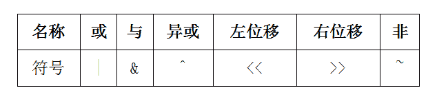

# 帆软软件 2018 届秋招笔试题-研发岗位

## 1

请写出下列排序算法的平均情况下的复杂度：快速排序，冒泡排序，插入排序。

你的答案

本题知识点

Java 工程师 C++工程师 帆软软件 2018

讨论

[LYX_1129](https://www.nowcoder.com/profile/202787953)

快排:O(nlgn)插入:O(n²)冒泡:O(n²)

发表于 2020-09-25 15:24:08

* * *

## 2

假设有一亿个字符串存储在文件中，以空格作为分隔符，现有以下的使用场景：有若干个用户，会输入不同的字符串来查找这一亿个字符串中以这个输入的字符串开头的字符串。请给出一种思路，能够快速的找到用户想要查找的字符串。比如输入：ab，就会快速的返回 abc, abxy,absolute；输入 pos，就会快速返回 postion,post 等。

你的答案

本题知识点

Java 工程师 C++工程师 帆软软件 2018

讨论

[家班社畜彭先生](https://www.nowcoder.com/profile/205787138)

后缀自动机？

编辑于 2020-03-09 09:09:08

* * *

## 3

请描述一下二分法查找的算法思路。

你的答案

本题知识点

Java 工程师 C++工程师 帆软软件 2018

讨论

[你把我蠢哭了](https://www.nowcoder.com/profile/657209636)

在一个有序数组中，取中间位置的值与目标值对比大小，根据结果判断目标值在前半段还是后半段。再取该半段的中间位置的值与目标值对比，反复上述过程，直到拿到目标值。

发表于 2020-11-10 22:23:12

* * *

[雷兹](https://www.nowcoder.com/profile/768474774)

首先将要查找的值与中间值比较，如果相等则查找成功，返回该值的位置，若不等再根据大小关系来确定是在前半段还是后半段，缩小范围后继续采用上面的思路直到找到该元素或者查找完整个表。

发表于 2020-07-20 11:54:06

* * *

[齁叭](https://www.nowcoder.com/profile/178754129)

首先将给定值 key 与表中中间位置元素的关键字比较，若相等，则查找成功，返回该元素的存储位置；若不等，则所需查找的元素只能在中间元素以外的前半部分或后半部分。然后在缩小的范围内继续进行同样的查找，如此重复直到找到为止，确定表中没有所需要查找的元素，则查找不成功，返回查找失败的信息。

发表于 2020-03-22 12:14:35

* * *

## 4

编写一段代码，用于计算两个整数的和并最终以二进制的格式输出。

你的答案

本题知识点

Java 工程师 C++工程师 帆软软件 2018

## 5

请说出 java.util.HashMap 和 java.util.Hashtable 的区别（至少说出两点）。

你的答案

本题知识点

Java 工程师 C++工程师 帆软软件 2018

讨论

[牛客 687675237 号](https://www.nowcoder.com/profile/687675237)

HashMap 线程不安全，但是效率高 HashTable 线程安全，但是效率低 HashMap 的 key 和 value 都可以是 null 值 HashTable 的 key 和 value 都不可以是 null 值

发表于 2020-05-20 15:34:43

* * *

[brues](https://www.nowcoder.com/profile/61038257)

<p>前者不支持多线程同步，后者支持所以相对而言可能前者效率高，但是不安全。其次前者可以存一个 null 的 key 和多个 null 的 value，后者不行</p>

编辑于 2020-05-03 17:13:40

* * *

[ylseven7](https://www.nowcoder.com/profile/721840381)

线程安全 null 的存储继承的父类初始容量和扩容方式 hash 的生成方式

发表于 2020-08-13 15:31:53

* * *

## 6

该题目分为 Java 何 JavaScript，可以选作任意一题。

JavaScript

请写一段 JavaScript 代码，获取出变量 data 中所有属性的值，并以如下格式输出：a=1;b=2;c=3。

你的答案

本题知识点

Java 工程师 C++工程师 帆软软件 2018

## 7

【Java】

```cpp
Publicclass Test { public static void main(String... args) { System.out.println("a"); query(); System.out.println("b"); } public static void query() { System.out.println("c"); } }
```

请完善方法 Test#query，使得程序输出的结果为：

a

b

c

你的答案

本题知识点

Java 工程师 C++工程师 帆软软件 2018

## 8

使用任意编程语言，写一个单例模式的类

你的答案

本题知识点

Java 工程师 C++工程师 帆软软件 2018

讨论

[小桥流水₂₀₁9](https://www.nowcoder.com/profile/119226248)

```cpp
import threading

class Single(object):
    _instance_lock = threading.Lock()

    def __init__(self):
        pass

    def __new__(cls, *args, **kwargs):
        if not hasattr(Single, "_instance"):
            with Single._instance_lock:
                if not hasattr(Single, "_instance"):
                    Single._instance = Single(*args, *kwargs)
        return Single._instance
```

发表于 2020-07-18 11:44:36

* * *

## 9

使用任意编程语言，分别使用递归和迭代求菲波那切数列

你的答案

本题知识点

Java 工程师 C++工程师 帆软软件 2018

## 10

请结合最简单的示例解释常用的位操作符的作用（使用最简单示例即可，比如 1|0=1）： 

你的答案

本题知识点

Java 工程师 C++工程师 帆软软件 2018

## 11

1、2、3、4、5 这 5 个数字，用 java 或者 JavaScript 写一个方法，求出所有不同的排列的个数并打印出这些排列组合， 如：51234、41235 等。要求："4"不能在第三位，"3"与"5"不能相连。

你的答案

本题知识点

Java 工程师 C++工程师 帆软软件 2018