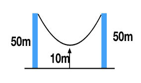
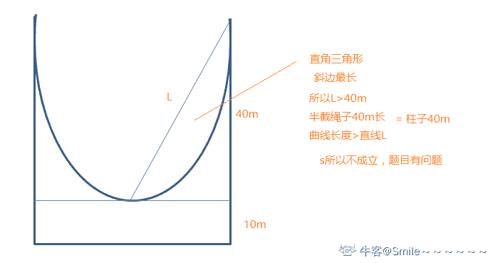

# 帆软软件 2019 届秋招笔试题-研发岗位

## 1

小帆感冒了，医生准备为他配置一瓶 600 毫升的咳嗽糖浆，却发现身边只有一个 800 毫升和 500 毫升的杯子。问：医生如何才能准确配置到 600 毫升的咳嗽糖浆呢？（写清计算过程）

你的答案

本题知识点

Java 工程师 C++工程师 帆软软件 2019

讨论

[牛客 853733017 号](https://www.nowcoder.com/profile/853733017)

还能倒掉？牛批

发表于 2019-12-17 00:51:36

* * *

[蓝色幻影](https://www.nowcoder.com/profile/781449560)

本题的关键是先想如何得到 600：  一种是经过加法：600+0 ，500+100，（只要保证两个杯子的剩余液体相加为 600）就行 ；  另一种：800-200=600；  （因此，结束前，两种杯子的剩余容量：800，300）；

发表于 2020-03-03 12:58:19

* * *

[想回我的大西北](https://www.nowcoder.com/profile/786385064)

这题目有什么意义？

发表于 2020-02-28 16:30:04

* * *

## 2

有一栋高楼，共有 n 层，物业准备在每一层都需要布置彩灯，总共有 3 种不同颜色的彩灯，但是要求相邻的楼层不能使用同一个颜色的彩灯，并且底层和最高层的彩灯颜色也不能相同，问：共有多少种不同的布置方式？（写清计算过程）

你的答案

本题知识点

Java 工程师 C++工程师 帆软软件 2019

## 3

如下图所示，两根柱子之间的绳子是自然垂落状态，绳子长 80m，求两根柱子之间的距离同时写出推导过程。如果绳子底端距离水平线 20m 呢，两根柱子距离应该是多少（写 出推导过程即可）？ 

你的答案

本题知识点

Java 工程师 C++工程师 帆软软件 2019

讨论

[Smile～～～～～～](https://www.nowcoder.com/profile/5899395)



发表于 2020-01-03 18:11:06

* * *

[牛客 566816299 号](https://www.nowcoder.com/profile/566816299)

这是一个悬链线问题，通式为 y=a cosh(x/a)，可以用待定系数法确定含立柱距离解析式，然后对曲线的长度进行积分，先码上，我过几天推导一下。

编辑于 2021-09-20 10:40:30

* * *

[stoneofthree](https://www.nowcoder.com/profile/961721687)

当距离底端 20m 时，答案应该是 8/3m 吧

发表于 2020-02-18 16:48:09

* * *

## 4

一个排好序的数组总共有 152 个元素，用二分查找算法找到第 12 个元素(首个元素为 第 1 个)，比较的元素依次为多少？写出结果的同时用任意一种语言实现二分查找算法。 （请用代码实现）

你的答案

本题知识点

Java 工程师 C++工程师 帆软软件 2019

讨论

[HL——](https://www.nowcoder.com/profile/797204255)

#include<vector>int fun(std::vector<int>& nums, int target) {    int left = 0;    int right = nums.size() - 1;    while(left <= right){        int mid = left + (right - left) / 2;        if(nums[mid] == target){            return mid;        }        else if(nums[mid] < target){            left = mid + 1;        }        else if(nume[mid] > target){            right = mid - 1;        }    }    return -1;}

发表于 2020-03-03 19:37:46

* * *

## 5

请问以 3 进制展示的整数 1211012122101，转换 16 进制，值为多少？写出答案的同时，编写一个任意进制的值转换为 2 进制的值展示的程序。（请用代码实现） 你的答案

本题知识点

Java 工程师 C++工程师 帆软软件 2019

讨论

[stoneofthree](https://www.nowcoder.com/profile/961721687)

```cpp
public class Sys {
    //其他进制转换为 10 进制
    public int toTen(String other,int k){
        StringBuilder sb=new StringBuilder(other);
        String str=sb.reverse().toString();
        int length=str.length();
        int sum=0;
        for(int i=0;i<length;i++){
            int tar=str.charAt(i)-'0';
            sum+=Math.pow(k,i)*tar;
        }
        return sum;
    }

    //其他进制转换为 2 进制
    public String toTwo(String other,int k){
        int sum=toTen(other,k);
        StringBuilder stringBuilder=new StringBuilder();
        while((sum/2)!=0){
            stringBuilder.append(sum%2);
            sum=sum/2;
        }
        if(sum==1) stringBuilder.append(1);
        String result=stringBuilder.reverse().toString();
        return result;
    }

    public static void main(String[]args){
        Sys s=new Sys();
        System.out.println(s.toTwo("1211012122101",3));
    }
}
```

发表于 2020-02-18 16:51:25

* * *

[Hope.](https://www.nowcoder.com/profile/151024571)

答案：11101100011110000101 先转十进制再转二进制即可代码：#include<iostream>#include<cstdio>
#include<string>
using namespace std;
int main()
{
    int t, rem, s[20], m = 0; //m 为该任意进制转化为的十进制数
    double jz; //进制
    string n;
    cin >> jz >> n; //输入进制和要转换的该进制数
    double k;
    k = n.length() - 1;
    for (int i = 0; i < n.length(); i++)
    {
        t = n[i] - '0';
        m += t * pow(jz, k);
        k--;
    }
    int j = 0;
    while (m)
    {
        rem = m % 2;
        m /= 2;
        s[j++] = rem;
    }
    while (j > 0)
        cout << s[--j];
    cout << endl;
    return 0;
}

发表于 2020-02-14 16:29:43

* * *

## 6

有两个数组 A、B，长度都为 N，值为任意整数，无序，要求，通过交换 A、B 中的元素，使得 A 数组元素之和与 B 数组元素之和之间的差值最小。完成代码的同时，写出数组 [100,99,98,1,2, 3]和[1,2,3,4,5,40]交换后的结果。（请用代码实现）

你的答案

本题知识点

Java 工程师 C++工程师 帆软软件 2019

讨论

[牛小小豪](https://www.nowcoder.com/profile/44590161)

   A[4, 5, 40, 98, 99, 100]

```cpp
package package1;

import java.util.ArrayList;
import java.util.Arrays;
import java.util.List;

public class A_B {
    List<Integer> path = new ArrayList<>();
    int min=Integer.MAX_VALUE;
    public static List<Integer> new_A;
    public static void main(String[] args) {
        int[] a=new int[]{100,99,98,1,2,3};
        int[] b=new int[]{1,2,3,4,5,40};
        A_B ab= new A_B();
        ab.swapelement(a,b);
        System.out.println(new_A);

    }

    public void swapelement(int[] a, int[] b){
        int len1 = a.length;
        int[] arr = new int[len1*2];
        //
        for(int i=0;i<2*len1;i++){
            if(i<len1){
                arr[i]=a[i];
            }else{
                arr[i]=b[i-len1];
                }
            }
        Arrays.sort(arr);
        int sum=0;
        for(int i=0;i<len1*2;i++){
            sum+=arr[i];
        }
        int target = sum/2;
        TraceBacking(len1,arr,target,0,0);
        return;
    }

    public void TraceBacking(int len,int[] arr,int target,int sum,int startindex){

        if(path.size()==len && Math.abs(target-sum)<min){
             new_A = new ArrayList<>(path);
             return;
        }
        if(path.size()>len)return;

        for(int i=startindex;i<arr.length;i++){
            sum+=arr[i];
            path.add(arr[i]);
            TraceBacking(len,arr,target,sum,i+1);
            path.remove(path.size()-1);
            sum-=arr[i];
        }
        return;
    }
}

```

[4, 5, 40, 98, 99, 100]

发表于 2021-06-07 16:40:09

* * *

[stoneofthree](https://www.nowcoder.com/profile/961721687)

感觉应该是正确的，反正试了几种情况感觉效果还好。

```cpp
/**
 * 解题思路：
 * 先算出两个数组总体的差值，然后分两种情况分析，发现当两个数组总体的差值和
 * A[i]-B[j]的差值的正负值相同的时候交换两个值才有可能会减小总体的差值，
 * 要想能够交换，还需要满足另一个条件就是交换后的总体差值的绝对值应该小于
 * 之前的总体差值的绝对值，这样就可以保证交换后两个数组的差值会减小。
 */
public class ReduceDiff {
    public void mindiff(int[] A,int[] B){
        int diff=0;
        for(int i=0;i<A.length;i++){
            diff+=(A[i]-B[i]);
        }
        for(int i=0;i<A.length;i++){
            for(int j=0;j<B.length;j++){
                int di=A[i]-B[j];
                int newdiff=diff-2*(A[i]-B[j]);
                if(diff*di>0 && Math.abs(newdiff)<Math.abs(diff)){
                    int temp=A[i];
                    A[i]=B[j];
                    B[j]=temp;
                    diff=newdiff;
                }
            }
        }
    }

    public static void main(String[]args){
        int[] aa={100,99,98,1,2, 3};
        int[] bb={34,54,12,1,4,6};
        ReduceDiff reduceDiff=new ReduceDiff();
        reduceDiff.mindiff(aa,bb);

        System.out.println("aa 数组为：");
        for(int i :aa){
            System.out.print(i+" ");
        }
        System.out.println("\nbb 数组为：");
        for(int i :bb){
            System.out.print(i+" ");
        }

    }
}
```

发表于 2020-02-18 17:52:21

* * *

## 7

一个文件 a.txt 存着所有汉字的拼音，格式为以分号分隔的键值对，key 为一个汉字， value 为大写的拼音，类似"...帆=FAN;软=RUAN..."。现在输入两个 char(java 中的 unicode 码)，需要比较大小，规则为：1）非汉字(即不在文件中的 key 中)永远小于汉字 2）两个非汉字的大小顺序即为 unicode 码的大小 3）两个汉字的大小为拼音字符串的顺序，例如 帆(FAN)<软(RUAN)。拼音相等则再比较 unicode 码 请先用文字描述实现思路，再用代码实现上述拼音排序，在做好初始化的前提下，提供一个 int compare(char c1,char c2)方法，以最快的速度返回两个 char 的比较结果(该方法可能会被调用上亿次) （请用代码实现）

你的答案

本题知识点

Java 工程师 C++工程师 帆软软件 2019

讨论

[情人节卡片](https://www.nowcoder.com/profile/6851465)

```cpp
static int compare(char c1,char c2){
        if(infile(c1)==0&&infile(c2)==0){
            if(c1>c2) return 1;
            else if(c1==c2) return 0;
            else return -1;
        }else if(infile(c1)==0&&infile(c2)==1){
            return -1;
        }else if(infile(c1)==1&&infile(c2)==0){
            return 1;
        }else {
                char[] a = map.get(c1).toCharArray();
                char[] b = map.get(c2).toCharArray();
                int n = Math.min(a.length,b.length);
                for (int i = 0;i<n;i++){
                    if(a[i]<b[i]){
                        return -1;
                    }else if(a[i]>b[i]){
                        return 1;
                    }
                }
            if(c1>c2) return 1;
            else if(c1==c2) return 0;
            else return -1;
        }

    }

    static int infile(char c1){
        readfile(new File("b.txt"));
        if(map.containsKey(c1)) return 1;
        else return 0;
    }
    static void readfile(File file){
        StringBuilder text = new StringBuilder();
        try{
            BufferedReader br = new BufferedReader( new FileReader(file));
            String s  =null;
            while((s = br.readLine())!=null){
                text.append(s);
            }
        }catch (FileNotFoundException e) {
            e.printStackTrace();
        } catch (IOException e) {
            e.printStackTrace();
        }
        String[] strs =  text.toString().split(";");

        for (String str:strs
             ) {
            String[] arr = str.split("=");
            map.put(arr[0].charAt(0),arr[1]);
        }
    }
```

发表于 2020-03-02 23:46:42

* * *

[stoneofthree](https://www.nowcoder.com/profile/961721687)

是不是要先把文件中的键值对转换为 hashmap 类型，然后再去进行比较

发表于 2020-02-19 08:42:04

* * *