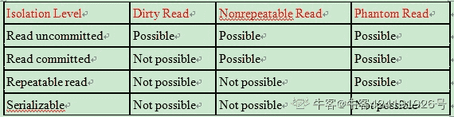

# 思科 2020 校园招聘笔试（软件类）

## 1

Choose the correct output of following code:

```cpp
#include <iostream>
using namespace std;

class Object{
    void* data;
    const int size;
    const char id;
public:
    Object(int sz, char c) : size(sz), id(c){
         data = new char[size];
         cout << "Constructor called for object " << id << ", size = " << size << endl;
    }
    ~Object(){
        cout << "Destructor called for object " << id << endl;
        delete []data;
    }
};

int main() {
    Object* a = new Object(20, 'a');
    delete a;
    void* b = new Object(20, 'b');
    delete b;
}
```

正确答案: B   你的答案: 空 (错误)

```cpp
Constructor called for object a, size = 20

Destructor called for object a

Constructor called for object b, size = 20

Destructor called for object b
```

```cpp
Constructor called for object a, size = 20

Destructor called for object a

Constructor called for object b, size = 20
```

```cpp
Constructor called for object a, size = 20

Constructor called for object b, size = 20
```

本题知识点

Java 工程师 C++工程师 iOS 工程师 安卓工程师 前端工程师 算法工程师 测试工程师 安全工程师 思科 运维工程师 PHP 工程师 2020

讨论

[牛客 612102810 号](https://www.nowcoder.com/profile/612102810)

任何类型的变量都可以赋值给 void*,但并不证明，void*对这个变量拥有所有权，所以 delete 删除的只是 viod*，并不能删除 b 对象，造成了内存的泄露。

发表于 2020-09-04 22:33:44

* * *

## 2

Which code is correct for static data member initialize:

正确答案: A   你的答案: 空 (错误)

```cpp

```
class Values{static const int scSize = 20;};
```cpp

```

```cpp

```
class Values{ static const float scFloat = 1.9; };
```cpp

```

```cpp
class Values{static float sFloat = 1.9;};
```

```cpp

```

```cpp
class Values{
static const int scInts[] = {1, 2, 3};
};

```

```cpp

本题知识点

                                                            Java 工程师 
                                                C++工程师 
                                                iOS 工程师 
                                                安卓工程师 
                                                运维工程师 
                                                前端工程师 
                                                算法工程师 
                                                PHP 工程师 
                                                测试工程师 
                                                安全工程师 
                                                思科 
                                                2020 

讨论

[EvaZh](https://www.nowcoder.com/profile/141958123)

                                                                      非 const 类型，必须类内声明，类外定义（使用于整形和浮点型） 
   const 类型中的整型，在类内声明，其定义位置可以在类外或类内 
   const 类型中的浮点型，在类内声明，类外定义 
   constexpr 类型，必须在类内声明，类内定义（使用于整形和浮点型） 

编辑于 2021-09-15 21:16:02

* * *

## 3

          Choose the correct statement of static member function: 

正确答案:
                                                                  C
                       你的答案:

                  空
                             (错误)

```
Static member function can access non-static member data.
```cpp

```
Static member function can access non-static member function.
```cpp

```
Non-static member function can access static member data.
```cpp

本题知识点

                                                            Java 工程师 
                                                C++工程师 
                                                iOS 工程师 
                                                安卓工程师 
                                                运维工程师 
                                                前端工程师 
                                                算法工程师 
                                                PHP 工程师 
                                                测试工程师 
                                                安全工程师 
                                                思科 
                                                2020 

## 4

          Which is the correct output of the following program.  

```
#include <iostream>
#include <string>
using namespace std;

class ObjectCount{
private:
    static int objCount;
public:
    ObjectCount() { objCount++; }
    static void print(const string& msg = "") {
        if(msg.size() != 0) cout << msg << ": ";
        cout << "objCount = " << objCount << endl;
    }    
    ~ObjectCount() { objCount--; }
};

int ObjectCount::objCount = 0;

ObjectCount f(ObjectCount oc) {
    return oc;
}

int main(){
    ObjectCount o1;
    ObjectCount::print("after construction of o1");
    ObjectCount o2 = f(o1);
    ObjectCount::print("after call f()");
}
```cpp

正确答案:
                                A
                                                                          你的答案:

                  空
                             (错误)

```
after construction of o1: objCount = 1

after call f(): objCount = 0
```cpp

```
after construction of o1: objCount = 1

after call f(): objCount = 1
```cpp

```
after construction of o1: objCount = 1

after call f(): objCount = 2
```cpp

```
after construction of o1: objCount = 1

after call f(): objCount = 3
```cpp

本题知识点

                                                            Java 工程师 
                                                C++工程师 
                                                iOS 工程师 
                                                安卓工程师 
                                                前端工程师 
                                                算法工程师 
                                                测试工程师 
                                                安全工程师 
                                                思科 
                                                运维工程师 
                                                PHP 工程师 
                                                2020 

讨论

[牛客 528423821 号](https://www.nowcoder.com/profile/528423821)

                                                                    ObjectCount o2 = f(o1); 调用复制构造函数 函数结束调用析构函数 objCount--

发表于 2021-09-14 18:33:33

* * *

## 5

        Which fields can be matched to mark priority by QoS?

正确答案:
                                A
                                             B
                                             C
                                                              E
                       你的答案:

                  空
                             (错误)

```
DSCP
```cpp

```
Predecence
```cpp

```
COS
```cpp

```
Checksum
```cpp

```
MPLS-EXP
```cpp

本题知识点

                                                            Java 工程师 
                                                C++工程师 
                                                iOS 工程师 
                                                安卓工程师 
                                                运维工程师 
                                                前端工程师 
                                                算法工程师 
                                                PHP 工程师 
                                                测试工程师 
                                                安全工程师 
                                                思科 
                                                2020 

## 6

        Choose the correct options below about Python Pep8.

正确答案:
                                A
                                                              C
                                             D
                       你的答案:

                  空
                             (错误)

```
Spaces are the preferred indentation method
```cpp

```
Limit all lines to a maximum of 80 characters
```cpp

```
Surround top-level function and class definitions with two blank
lines.
```cpp

```
Imports are always put at the top of the file, just after any module
comments and docstrings, and before module globals and constants.
```cpp

本题知识点

                                                            Java 工程师 
                                                C++工程师 
                                                iOS 工程师 
                                                安卓工程师 
                                                前端工程师 
                                                算法工程师 
                                                测试工程师 
                                                安全工程师 
                                                思科 
                                                运维工程师 
                                                PHP 工程师 
                                                2020 

讨论

[胡靖逸](https://www.nowcoder.com/profile/4133534)

                                                                      参考 python PEP8：[`www.python.org/dev/peps/pep-0008/`](https://www.python.org/dev/peps/pep-0008/) 

发表于 2020-09-07 14:38:17

* * *

## 7

          What is expected output for the following Python code? 

```
   a = '1232....flow_cts_source_group_tag'

   b = a.replace('..', '.').replace('..', '.').replace('.', '\': \'')
   c = b.split('\n')
   for line in c:
       line = '\''+line +'\','
       print(line)
```cpp

正确答案:
                                                 B
                                                         你的答案:

                  空
                             (错误)

```
'1232'..'flow_cts_source_group_tag',
```cpp

```
'1232': 'flow_cts_source_group_tag',
```cpp

```
'1232': 'flow_cts_source_group_tag'
```cpp

```
'1232': flow_cts_source_group_tag,
```cpp

本题知识点

                                                            Java 工程师 
                                                C++工程师 
                                                iOS 工程师 
                                                安卓工程师 
                                                运维工程师 
                                                前端工程师 
                                                算法工程师 
                                                PHP 工程师 
                                                测试工程师 
                                                安全工程师 
                                                思科 
                                                2020 

讨论

[小志不言弃](https://www.nowcoder.com/profile/968862096)

                                                                    蒙的

发表于 2021-09-16 18:51:37

* * *

## 8

          How to get the list c as below in Python code? 

```
a = [1,2]
b = [3,4]

c = [[1,2], [3,4]]

```cpp

正确答案:
                                                                                   D
                       你的答案:

                  空
                             (错误)

```
c = a + b
```cpp

```
c = c.append(a).append(b)
```cpp

```
c = []; c[0] = a; c[1] = b
```cpp

```
c = list(); c.append(a); c.append(b)
```cpp

本题知识点

                                                            Java 工程师 
                                                C++工程师 
                                                iOS 工程师 
                                                安卓工程师 
                                                运维工程师 
                                                前端工程师 
                                                算法工程师 
                                                PHP 工程师 
                                                测试工程师 
                                                安全工程师 
                                                思科 
                                                2020 

## 9

        Table A has 10 records and Table B has 100 records, what’s the possible query result for the below SQL?
 SELECT * from A left join B on A.col_1 = B.col_1

正确答案:
                                                 B
                                             C
                                             D
                                        你的答案:

                  空
                             (错误)

```
Get 1 Records
```cpp

```
Get 10 Records
```cpp

```
Get 100 Records
```cpp

```
Get 1,000 Records
```cpp

```
Get 10,000 Records
```cpp

本题知识点

                                                            Java 工程师 
                                                C++工程师 
                                                iOS 工程师 
                                                安卓工程师 
                                                运维工程师 
                                                前端工程师 
                                                算法工程师 
                                                PHP 工程师 
                                                测试工程师 
                                                安全工程师 
                                                思科 
                                                2020 

## 10

        Choose the right descriptions on some SQL keywords:

正确答案:
                                                 B
                                                              D
                       你的答案:

                  空
                             (错误)

```
WHERE clause can define conditions on aggregations.
```cpp

```
The result count of UNION must be lower than or equal the result count of UNION ALL.
```cpp

```
The EXISTS operator returns one or more records of its subquery, but not a boolean result.
```cpp

```
Primary keys cannot contain NULL values.
```cpp

本题知识点

                                                            Java 工程师 
                                                C++工程师 
                                                iOS 工程师 
                                                安卓工程师 
                                                运维工程师 
                                                前端工程师 
                                                算法工程师 
                                                PHP 工程师 
                                                测试工程师 
                                                安全工程师 
                                                思科 
                                                2020 

讨论

[牛客 528423821 号](https://www.nowcoder.com/profile/528423821)

```
WHERE 不能有聚合函数  UNION 会删除重复行
EXISTS 返回布尔值
主键不能为空
```cpp

发表于 2021-09-14 22:44:31

* * *

## 11

        Choose the right descriptions on Transaction Isolation Levels:

正确答案:
                                A
                                                                               D
                       你的答案:

                  空
                             (错误)

```
DB Transaction Isolation Levels include Read Committed, Repeatable Read, Serializable, Read Uncommitted.
```cpp

```
Read Uncommitted can prevent Dirty Read.
```cpp

```
Serializable can help improving the performance.
```cpp

```
Repeatable read CANNOT prevent Phantom Read.
```cpp

本题知识点

                                                            Java 工程师 
                                                C++工程师 
                                                iOS 工程师 
                                                安卓工程师 
                                                运维工程师 
                                                前端工程师 
                                                算法工程师 
                                                PHP 工程师 
                                                测试工程师 
                                                安全工程师 
                                                思科 
                                                2020 

讨论

[牛客 424191926 号](https://www.nowcoder.com/profile/424191926)

                                                                        

 转自[`blog.csdn.net/tianlesoftware/article/details/6594655`](https://blog.csdn.net/tianlesoftware/article/details/6594655)  

发表于 2020-09-07 15:03:42

* * *

## 12

        Choose the right descriptions on database Index:

正确答案:
                                                 B
                                             C
                                        你的答案:

                  空
                             (错误)

```
Index can enhance all the search/reading performance.
```cpp

```
Index will probably bring down the performance of insertion.
```cpp

```
B-Tree is widely used for index.
```cpp

```
Creating Index should better be done on rush hours, so that most users will be benefited from it immediately.
```cpp

本题知识点

                                                            Java 工程师 
                                                C++工程师 
                                                iOS 工程师 
                                                安卓工程师 
                                                运维工程师 
                                                前端工程师 
                                                算法工程师 
                                                PHP 工程师 
                                                测试工程师 
                                                安全工程师 
                                                思科 
                                                2020 

## 13

        Which of the following statement(s) is(are) true?

正确答案:
                                                 B
                                                              D
                       你的答案:

                  空
                             (错误)

```
Insertion/Deletion on ArrayList is faster than LinkedList
```cpp

```
Queue is FIFO, Stack is LIFO
```cpp

```
The worst time complexity of Searching in Binary Search Tree is O(log n)
```cpp

```
For Red-Black Tree, if a node is red, then both its children are black.
```cpp

本题知识点

                                                            Java 工程师 
                                                C++工程师 
                                                iOS 工程师 
                                                安卓工程师 
                                                运维工程师 
                                                前端工程师 
                                                算法工程师 
                                                PHP 工程师 
                                                测试工程师 
                                                安全工程师 
                                                思科 
                                                2020 

## 14

        There're 5 elements a,b,c,d,e to be pushed into a Stack in the alphabetical order, which one(s) below is(are) the possible pop up sequence?

正确答案:
                                A
                                             B
                                             C
                                        你的答案:

                  空
                             (错误)

```
a,b,c,d,e
```cpp

```
e,d,c,b,a
```cpp

```
c,b,d,a,e
```cpp

```
c,a,b,d,e
```cpp

本题知识点

                                                            Java 工程师 
                                                C++工程师 
                                                iOS 工程师 
                                                安卓工程师 
                                                运维工程师 
                                                前端工程师 
                                                算法工程师 
                                                PHP 工程师 
                                                测试工程师 
                                                安全工程师 
                                                思科 
                                                2020 

## 15

        There is a none-empty binary tree, its mid-order traversal is the reverse order of its post-order traversal, this tree can be: 

正确答案:
                                A
                                                                                                            你的答案:

                  空
                             (错误)

```
Tree whose all nodes have no left child
```cpp

```
A tree whose all nodes have no right child
```cpp

```
A tree with only one leaf node
```cpp

```
A full binary tree
```cpp

```
A tree whose height equals the node count
```cpp

```
None of the above is correct
```cpp

本题知识点

                                                            Java 工程师 
                                                C++工程师 
                                                iOS 工程师 
                                                安卓工程师 
                                                运维工程师 
                                                前端工程师 
                                                算法工程师 
                                                PHP 工程师 
                                                测试工程师 
                                                安全工程师 
                                                思科 
                                                2020 

## 16

        Which can be the height for a binary tree with 17 leaves?

正确答案:
                                                                  C
                                        你的答案:

                  空
                             (错误)

```
4
```cpp

```
5
```cpp

```
2048
```cpp

```
Non of above
```cpp

本题知识点

                                                            Java 工程师 
                                                C++工程师 
                                                iOS 工程师 
                                                安卓工程师 
                                                运维工程师 
                                                前端工程师 
                                                算法工程师 
                                                PHP 工程师 
                                                测试工程师 
                                                安全工程师 
                                                思科 
                                                2020 

## 17

        Which of the following are keywords in JDK8

正确答案:
                                A
                                                              C
                                             D
                       你的答案:

                  空
                             (错误)

```
abstract
```cpp

```
bool
```cpp

```
const
```cpp

```
default
```cpp

本题知识点

                                                            Java 工程师 
                                                C++工程师 
                                                iOS 工程师 
                                                安卓工程师 
                                                运维工程师 
                                                前端工程师 
                                                算法工程师 
                                                PHP 工程师 
                                                测试工程师 
                                                安全工程师 
                                                思科 
                                                2020 

## 18

          Given the following code, which of the statement(s) is(are) true? 

```
import java.util.HashMap;
import java.util.Map;

public class Foo {  public static void main(String[] args) {  Map<String, Integer> map = new HashMap<String, Integer>(); // 1  map.put("a", 127); // 2  map.put("b", new Integer(127)); // 3  map.put(null, null); // 4  System.out.println(map.get("a") == (map.get("b"))); // 5  }
}

```cpp

正确答案:
                                                                                                    E
                       你的答案:

                  空
                             (错误)

```
Compilation error at line //2
```cpp

```
Compilation error at line //4
```cpp

```
Runtime exception at line //4
```cpp

```
Code can run through with "true" as output.
```cpp

```
None of the above is correct.
```cpp

本题知识点

                                                            Java 工程师 
                                                C++工程师 
                                                iOS 工程师 
                                                安卓工程师 
                                                前端工程师 
                                                算法工程师 
                                                PHP 工程师 
                                                测试工程师 
                                                思科 
                                                运维工程师 
                                                安全工程师 
                                                2020 

## 19

          What is the output of the last "t()" in Python code? 

```
    def t(a = []):
        a.append(1)
        print(a)

    t()
    t()
    t()
    t()

```cpp

正确答案:
                                                                  C
                                        你的答案:

                  空
                             (错误)

```
[]
```cpp

```
[1]
```cpp

```
[1, 1, 1, 1]
```cpp

```
[1,  [1, 1],  [1, 1, 1], [1, 1, 1, 1]]
```cpp

本题知识点

                                                            Java 工程师 
                                                C++工程师 
                                                iOS 工程师 
                                                安卓工程师 
                                                运维工程师 
                                                前端工程师 
                                                算法工程师 
                                                PHP 工程师 
                                                测试工程师 
                                                安全工程师 
                                                思科 
                                                2020 

讨论

[胡靖逸](https://www.nowcoder.com/profile/4133534)

                                                                    是因为在全局运行，因此 a 是全局变量？

发表于 2020-09-07 14:58:55

* * *

## 20

        Which statements are typical characteristics of VLAN arrangements? (Choose three)

正确答案:
                                A
                                                              C
                                             D
                                        你的答案:

                  空
                             (错误)

```
Connectivity between VLANs requires a Layer 3 device.
```cpp

```
VLANs typically decrease the number of collision domains.
```cpp

```
Each VLAN uses a separate address space.
```cpp

```
A switch maintains a separate bridging table for each VLAN.
```cpp

```
VLANs cannot span multiple switches.
```cpp

本题知识点

                                                            Java 工程师 
                                                C++工程师 
                                                iOS 工程师 
                                                安卓工程师 
                                                运维工程师 
                                                前端工程师 
                                                算法工程师 
                                                PHP 工程师 
                                                测试工程师 
                                                安全工程师 
                                                思科 
                                                2020 

## 21

        Which statements are true about RTP and RTCP? (Choose two)

正确答案:
                                A
                                                                               D
                                        你的答案:

                  空
                             (错误)

```
An RTP port is a random even-numbered TCP port between 16384 and 32767
and the associated RTCP port is the sequential odd-numbered port
```cpp

```
RTCP packets contain application-level information about the RTP source
```cpp

```
An RTP session includes TCP port numbers for both RTP and the associated RTCP session
```cpp

```
RTCP provides QoS information about data delivered over RTP
```cpp

```
RTCP supports multiple packet types, including sender reports receiver reports, and application-specific packets.
```cpp

本题知识点

                                                            Java 工程师 
                                                C++工程师 
                                                iOS 工程师 
                                                安卓工程师 
                                                运维工程师 
                                                前端工程师 
                                                算法工程师 
                                                PHP 工程师 
                                                测试工程师 
                                                安全工程师 
                                                思科 
                                                2020 

## 22

        For network 192.0.254.0/23, which options are valid IPs address that can be assigned to a host? (Choose 2)

正确答案:
                                                 B
                                             C
                                                         你的答案:

                  空
                             (错误)

```
192.0.254.0
```cpp

```
192.0.254.255
```cpp

```
192.0.255.0
```cpp

```
192.0.255.255
```cpp

```
192.1.0.0
```cpp

本题知识点

                                                            Java 工程师 
                                                C++工程师 
                                                iOS 工程师 
                                                安卓工程师 
                                                运维工程师 
                                                前端工程师 
                                                算法工程师 
                                                PHP 工程师 
                                                测试工程师 
                                                安全工程师 
                                                思科 
                                                2020 

讨论

[牛客 848508975 号](https://www.nowcoder.com/profile/848508975)

                                                                      不能是首个和最后一个 

发表于 2020-09-07 17:14:54

* * *

## 23

        Which of the below is valid way to instantiate an array in java?

正确答案:
                                A
                                                                                                E
                       你的答案:

                  空
                             (错误)

```
int myArray [] = {1, 2, 3};
```cpp

```
int [] myArray = {"1", "2", "3"};
```cpp

```
int myArray [] [] = {1,2,3,4};
```cpp

```
int [] myArray = (1, 2, 3);
```cpp

```
int [] myArray = {1, 2, 3};
```cpp

本题知识点

                                                            Java 工程师 
                                                C++工程师 
                                                iOS 工程师 
                                                安卓工程师 
                                                运维工程师 
                                                前端工程师 
                                                算法工程师 
                                                测试工程师 
                                                思科 
                                                PHP 工程师 
                                                安全工程师 
                                                2020 

## 24

        Which of the following statement(s) are true for java?

正确答案:
                                A
                                             B
                                             C
                                        你的答案:

                  空
                             (错误)

```
JVM is responsible to converting Byte code to the machine specific code.
```cpp

```
We only need JRE to run java programs.
```cpp

```
JDK is required to compile java programs.
```cpp

```
JRE doesn't contains JVM.
```cpp

本题知识点

                                                            Java 工程师 
                                                C++工程师 
                                                iOS 工程师 
                                                安卓工程师 
                                                运维工程师 
                                                前端工程师 
                                                算法工程师 
                                                PHP 工程师 
                                                测试工程师 
                                                安全工程师 
                                                思科 
                                                2020 

## 25

        What are the different types of CPU registers in a typical operating system design?

正确答案:
                                A
                                                              C
                                             D
                       你的答案:

                  空
                             (错误)

```
Accumulators
```cpp

```
Null Pointer
```cpp

```
General Purpose Registers
```cpp

```
Stack Pointer
```cpp

本题知识点

                                                            Java 工程师 
                                                C++工程师 
                                                iOS 工程师 
                                                安卓工程师 
                                                运维工程师 
                                                前端工程师 
                                                算法工程师 
                                                PHP 工程师 
                                                测试工程师 
                                                安全工程师 
                                                思科 
                                                2020 

## 26

        Which statements are right for COW, copy-on-right?

正确答案:
                                A
                                                              C
                                             D
                       你的答案:

                  空
                             (错误)

```
The copy operation is deferred to the first write.
```cpp

```
Mainly used in cache system.
```cpp

```
If a resource is duplicated but not modified, it is not necessary to create a new resource.
```cpp

```
It is possible to significantly reduce the resource consumption of unmodified copies, while adding a small overhead to resource-modifying operations.
```cpp

本题知识点

                                                            Java 工程师 
                                                C++工程师 
                                                iOS 工程师 
                                                安卓工程师 
                                                运维工程师 
                                                前端工程师 
                                                算法工程师 
                                                PHP 工程师 
                                                测试工程师 
                                                安全工程师 
                                                思科 
                                                2020 

## 27

        What is the swap space in the disk used for?

正确答案:
                                                 B
                                                         你的答案:

                  空
                             (错误)

```
Saving temporary html pages
```cpp

```
Saving process data
```cpp

```
Storing the super-block
```cpp

```
Storing device drivers
```cpp

本题知识点

                                                            Java 工程师 
                                                C++工程师 
                                                iOS 工程师 
                                                安卓工程师 
                                                运维工程师 
                                                前端工程师 
                                                算法工程师 
                                                PHP 工程师 
                                                测试工程师 
                                                安全工程师 
                                                思科 
                                                2020 

## 28

        What complex datatypes are available in Hive?

正确答案:
                                A
                                             B
                                                              D
                       你的答案:

                  空
                             (错误)

```
STRUCT
```cpp

```
MAP
```cpp

```
LIST
```cpp

```
ARRAY
```cpp

本题知识点

                                                            Java 工程师 
                                                C++工程师 
                                                iOS 工程师 
                                                安卓工程师 
                                                运维工程师 
                                                前端工程师 
                                                算法工程师 
                                                PHP 工程师 
                                                测试工程师 
                                                安全工程师 
                                                思科 
                                                2020 

## 29

        Per-column level lossless compression codecs for Parquet format?

正确答案:
                                A
                                                              C
                                             D
                       你的答案:

                  空
                             (错误)

```
Snappy
```cpp

```
Brotli
```cpp

```
GZip
```cpp

```
LZO
```cpp

本题知识点

                                                            Java 工程师 
                                                C++工程师 
                                                iOS 工程师 
                                                安卓工程师 
                                                运维工程师 
                                                前端工程师 
                                                算法工程师 
                                                PHP 工程师 
                                                测试工程师 
                                                安全工程师 
                                                思科 
                                                2020 

## 30

        Which following statements about Apache Spark RDD, are right?

正确答案:
                                A
                                             B
                                             C
                                             D
                       你的答案:

                  空
                             (错误)

```
RDDs are datasets that consist of records.
```cpp

```
RDDs are resilient, meaning that if a node performing an operation in Spark is lost, the dataset can be reconstructed.
```cpp

```
RDDs are immutable, meaning that after they are instantiated and populated with data, they cannot be updated.
```cpp

```
DDs are distributed, meaning the data in RDDs is divided into one or many partitions and distributed as in-memory collections of objects across worker nodes in the cluster.
```cpp

本题知识点

                                                            Java 工程师 
                                                C++工程师 
                                                iOS 工程师 
                                                安卓工程师 
                                                运维工程师 
                                                前端工程师 
                                                算法工程师 
                                                PHP 工程师 
                                                测试工程师 
                                                安全工程师 
                                                思科 
                                                2020 

## 31

        Types of the NoSQL systems?

正确答案:
                                A
                                             B
                                                              D
                       你的答案:

                  空
                             (错误)

```
Key Value Stores
```cpp

```
Graph Stores
```cpp

```
Vector Stores
```cpp

```
Document Stores
```cpp

本题知识点

                                                            Java 工程师 
                                                C++工程师 
                                                iOS 工程师 
                                                安卓工程师 
                                                运维工程师 
                                                前端工程师 
                                                算法工程师 
                                                PHP 工程师 
                                                测试工程师 
                                                安全工程师 
                                                思科 
                                                2020 

## 32

        Which descriptions about microkernel-based OS is/are NOT TURE?

正确答案:
                                                 B
                                             C
                                        你的答案:

                  空
                             (错误)

```
file system and driver is not part of kernel
```cpp

```
it’s must be RTOS (real-time OS)
```cpp

```
more effective in context switching and more secure than Monolithic kernel OS
```cpp

```
QNX, L4Linux, Mach and Symbian are all the Microkernel OS
```cpp

本题知识点

                                                            Java 工程师 
                                                C++工程师 
                                                iOS 工程师 
                                                安卓工程师 
                                                运维工程师 
                                                前端工程师 
                                                算法工程师 
                                                PHP 工程师 
                                                测试工程师 
                                                安全工程师 
                                                思科 
                                                2020 

## 33

          SIP is an important protcoal of IP Phone, it could be configed with some special information to display. huntPilot URI is one kind of, and  IP phone will catch and display alert name for third party calling if there is huntPilotName configed in  huntPilot URI. 

   HuntPilot URI Samples: 
 huntpiloturi = "<sip:10000@172.16.130.42>;"                                                 alertName=
 huntpiloturi = " "<sip:10000@172.16.130.42>;                                                alertName=
 huntpiloturi = "huntpilotname<sip:10000@172.16.130.42>";                           alertName=huntpilotname
 huntpiloturi = "huntpilotname”<sip:10000@172.16.130.42>;                           alertName=huntpilotname
   huntpiloturi = "%22huntpilotname%22<sip:10000@172.16.130.42>";            alertName=huntpilotname 
   huntpiloturi = "%22huntpilot%22name%22"<sip:10000@172.16.130.42>;     alertName=huntpilot%22name

本题知识点

                                                            Java 工程师 
                                                C++工程师 
                                                iOS 工程师 
                                                安卓工程师 
                                                运维工程师 
                                                前端工程师 
                                                算法工程师 
                                                PHP 工程师 
                                                测试工程师 
                                                安全工程师 
                                                思科 
                                                2020 

讨论

[xlwmfh](https://www.nowcoder.com/profile/904927089)

```
//正则表达式匹配一下
public class Main {
    public static void main(String[] args) {
        Scanner scanner = new Scanner(System.in);
        String s = scanner.nextLine();
        Pattern pattern = Pattern.compile("\"*(%22)?(\\w+(%22)*\\w+)(%22)?\"*(<\\w+:\\w+@\\w+.\\w+.\\w+.\\w+>)*\"*");
        Matcher matcher = pattern.matcher(s);
        while (matcher.find()) {
            System.out.println(matcher.group(2));
        }
    }
}
```cpp

发表于 2020-04-17 16:04:41

* * *

[牛客 721185958 号](https://www.nowcoder.com/profile/721185958)

```
int main()
{
    char vs[1024];
    char* ans;
    string str;
    while (cin >> str)
    {
        int len = str.find("<");
        if (len < 0) len = str.length();
        len--;
        str.copy(vs, len, 1);
        if (vs[len - 1] == '\"')
            vs[--len] = '\0';
        else vs[len] = '\0';

        ans = vs;
        if (len >= 5)
        {
            if (vs[len - 1] == '2' && vs[len - 2] == '2' && vs[len - 3] == '%')
            {
                ans = vs + 3;
                vs[len - 3] = '\0';
            }
        }

        cout << ans << endl;
    }

    return 0;
}
```cpp

发表于 2020-03-08 20:21:16

* * *

[牛客 612102810 号](https://www.nowcoder.com/profile/612102810)

                                                                    #include <iostream>#include<string>
 using namespace std;
 int main()
 {
     string str;
     getline(cin,str);
     int len=str.size();
     string s;
     for(int i=0;i<len;++i)
     {
         if(str[i]=='<')
             break;
         if(str[i]>='A'&&str[i]<='z')
         {
             s+=str[i];
         }
         else if(str[i]!='<')
         {
             int j=i;
             if(!s.empty())
             {
                 while(j<len&&str[j]!='<')
                 {
                     if(str[j]>='A'&&str[j]<='z')
                         break;
                     ++j;
                 }
                 if(j<len&&str[j]!='<')
                 {
                     j=i;
                     while(str[j]<'A'||str[j]>'z')
                     {
                         s+=str[j];
                         ++j;
                     }
                 }
                 i=j-1;
             }
         }
     }
     int ll=s.size();
     for(int i=0;i<ll;++i)
         cout<<s[i];
     return 0;
 }

发表于 2020-09-04 22:12:34

* * *</iostream> 
```