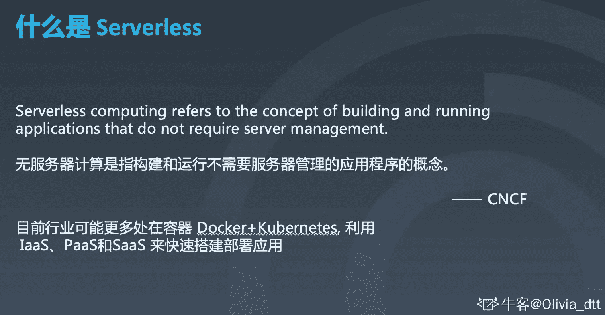
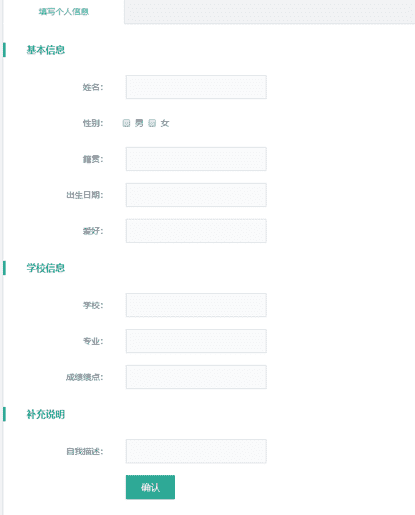

# 乐信 2020 校园招聘前端笔试题

## 1

当前页面的图片请求头 cache-control 字段设置值为：max-age= 3153600000，public，immutable； etag 和 last-modified 属性均进行了设置有效，且在用户访问的时间内没有进行变化；当前用户访问页面时，第一次访问发现图片没有加载完成，用户使用快捷键 ctrl+F5 操作进行了网页刷新后二次访问页面，请选择以下描述正确项：

正确答案: B   你的答案: 空 (错误)

```cpp
当前图片资源只能客户端缓存，代理服务器无法缓存，用户二次访问时图片请求网络状态码为 304；
```

```cpp
当前图片资源客户端和代理服务器都能进行缓存，用户二次访问时图片请求网络状态码为 200；
```

```cpp
当前图片资源只能在代理服务器进行缓存，客户端无法缓存，用户二次访问时图片请求网络状态码为 200；
```

```cpp
当前图片资源客户端和代理服务器都能进行缓存，用户二次访问时图片请求网络状态码为 304；
```

本题知识点

前端工程师 乐信 2020

讨论

[烟雨仔](https://www.nowcoder.com/profile/686030081)

不知道怎么分 客户端缓存 和 代理服务器缓存

发表于 2021-02-27 21:05:11

* * *

[疯狂踩坑人](https://www.nowcoder.com/profile/151495209)

cache-control：max-age= 3153600000，public，immutablepublic 表示客户端和代理服务器都设置缓存 immutable 表示 F5 刷新或者点击浏览器刷新按钮刷新都不发送请求但这里由于图片未加载完成，即未收到服务端的响应，即 cache-control 还未生效，故 F5 刷新后这个图片资源会重新请求若是图片加载完成后按 F5 刷新则不会重新请求

发表于 2021-04-11 12:59:18

* * *

[Eric201909161930714](https://www.nowcoder.com/profile/817975579)

强制刷新 – 当按下 ctrl+F5 来刷新页面的时候, 浏览器将绕过各种缓存(本地缓存和协商缓存), 直接让服务器返回最新的资源;具体见这篇文章讲的不错 https://mp.weixin.qq.com/s/7-R1xyFBlpOlX5PerQtA_Q

发表于 2020-06-13 15:55:09

* * *

## 2

公司计划开发一个新的 APP 投放到市场进行新业务模式探索，由于是新业务探索，业务会需要每周立刻调整页面迭代功能配合市场策略调整，新业务会在学校、菜市等网络环境不是特别好的地方进行获客，在前期获客期间，期望能快速的呈现页面吸引用户，当前新 APP 公司期望 1 个月内完成开发并上线，请选择适合当前需求背景的前端技术框架：

正确答案: D   你的答案: 空 (错误)

```cpp
原生开发，IOS 采用 swift，android 采用 kotlin；
```

```cpp
原生开发，IOS 和 android 都采用 flutter；
```

```cpp
原生开发，IOS 采用 object-c，android 采用 java；
```

```cpp
动态化开发，采用 weex 或 reactnative；
```

本题知识点

前端工程师 乐信 2020

讨论

[離島](https://www.nowcoder.com/profile/755602300)

weex 有人用？

发表于 2019-12-20 20:18:24

* * *

## 3

以下正则进行对字符串"welcome**to**fenqile**"执行 test 操作后输出为 true 的正则表达式是：

正确答案: C   你的答案: 空 (错误)

```cpp
/welcome\*{2,4}to\*{2,4}fenqile$/
```

```cpp
/^welcome\*{2,4}to\*{2,4}fenqile$/
```

```cpp
/welcome\*{2,4}to\*{2,4}fenqile\*{0,1}/
```

```cpp
/^welcome\*{2,4}to\*{2,4}fenqile\*{0,1}$/
```

本题知识点

前端工程师 乐信 2020

讨论

[Olivia_dtt](https://www.nowcoder.com/profile/232985383)

选择题，四个答案都差不多，看差别。找到$结尾符，AB 都是直接以字母结尾，没有匹配到*,D 以*0 个或一个结尾，实际字符串有两个*，D 不对。选 C

发表于 2020-04-05 15:35:16

* * *

[牛客 206597936 号](https://www.nowcoder.com/profile/206597936)

答案 CAB 选项 都是以 fenqile 结尾  不能匹配 *D  以一个*结尾  不能匹配两个*C  最后没有$  所以可以匹配到题干的  * ,返回 true

发表于 2021-01-21 10:48:25

* * *

## 4

"113"+25-"50" 的运算结果是：

正确答案: B   你的答案: 空 (错误)

```cpp
88
```

```cpp
11275
```

```cpp
undefined
```

```cpp
1132550
```

本题知识点

前端工程师 乐信 2020

讨论

[尤蔚然](https://www.nowcoder.com/profile/822005398)

加号可以用来字符串拼接，减号只能用来做运算符

发表于 2020-02-06 19:24:57

* * *

## 5

以下哪项描述是正确的：

正确答案: D   你的答案: 空 (错误)

```cpp
cookie 分永久 cookie 和会话级别 cookie，两种 cookie 都可以实现跨浏览器的传输；
```

```cpp
storage 分 localStorage 和 sessionStorage，localStorage 没有跨域的限制，但是 sessionStorage 有；
```

```cpp
sessionStorage 和 localStorage 的 API 完全一致，但是存储空间有区别，sessionStorage 存储空间小于 localStorage；
```

```cpp
cookies 和 storage 都存在跨域限制；
```

本题知识点

前端工程师 乐信 2020

讨论

[Olivia_dtt](https://www.nowcoder.com/profile/232985383)

storage 分 localStorage 永久级别和 sessionStorage 会话级别，两者的存储空间都为 5MB。两者都存在跨域限制。

发表于 2020-04-05 15:40:40

* * *

## 6

以下哪项描述是正确的：

正确答案: C   你的答案: 空 (错误)

```cpp
字符串、数组、对象、整型等都是数据结构；
```

```cpp
队列和栈都可以实现递归；
```

```cpp
树形结构只能描述一对多的相互关系，无法描述多对多的相互关系，多对多的相互关系要使用图形结构进行描述；
```

```cpp
图的深度和广度搜索都应该优先使用队列；
```

本题知识点

前端工程师 乐信 2020

讨论

[Olivia_dtt](https://www.nowcoder.com/profile/232985383)

数据结构是以特定某种布局方式存储数据的人容器。字符串、数组、对象这些称为数据类型。由于栈后进先出的特性，利用栈来保存中间结果，实现递归。树形结构，根结点没有前驱结点，其余每个结点有且只有一个前驱结点 ---》一对多
图的广度搜索用队列，深度搜索用栈

发表于 2020-04-05 15:53:34

* * *

[□□∝□□](https://www.nowcoder.com/profile/382065110)

B 用两个队列实现栈的功能，从而实现递归不行吗

发表于 2020-05-29 16:46:31

* * *

## 7

以下标签定义文档的标题，它是 head 部分中唯一必需的元素的是：

正确答案: D   你的答案: 空 (错误)

```cpp
meta
```

```cpp
link
```

```cpp
script
```

```cpp
title
```

本题知识点

前端工程师 乐信 2020

## 8

用 Chrome 浏览器不能实现以下什么操作：

正确答案: B   你的答案: 空 (错误)

```cpp
删除当前页面的所有本地缓存的 cookie 和 storage；
```

```cpp
将当前页面的请求转发至指定的 IP；
```

```cpp
对当前窗口所进行的所有页面跳转进行完整的请求日志记录，即使页面域名不相同；
```

```cpp
实时修改当前页面的 HTML、CSS 和 JS 代码并在网页加载时生效查阅更改代码的效果；
```

本题知识点

前端工程师 乐信 2020

讨论

[rogn](https://www.nowcoder.com/profile/8088451)

chrome 不是能设置代理的吗

发表于 2020-02-29 22:23:27

* * *

## 9

下面哪些选项会触发 http 请求：

正确答案: C   你的答案: 空 (错误)

```cpp
<textarea></textarea>
```

```cpp
<textarea style="display:none;"> </ textarea>
```

```cpp
<div style="display:none;  background-image:url(pic.jpg) "></div>
```

```cpp
< textarea><span style="display:none;  background-image:url(pic.jpg) "></ span></ textarea >
```

本题知识点

前端工程师 乐信 2020

讨论

[夏花爱秋叶](https://www.nowcoder.com/profile/4085682)

           应该选 c,因为其他选项都是 textarea! <!-- 此时会触发图片请求 -->            <div style="display: none;background-image: url(one/3.jpg);">
            </div>
            <!-- 此时不会触发图片请求，因为在 textarea 中，并且 textarea 元素没有指定行列，所以是显示为纯文字！
             该 span 元素并没有被解析为元素!-->
            <textarea>
                <span style="display: none;background-image: url(one/3.jpg);"></span>
            </textarea>

发表于 2019-12-22 11:55:18

* * *

## 10

以下哪个选项可以生成相对定位的元素，相对于其正常位置进行定位：

正确答案: D   你的答案: 空 (错误)

```cpp
fixed
```

```cpp
absolute
```

```cpp
static
```

```cpp
relative
```

本题知识点

前端工程师 乐信 2020

讨论

[小太阳呢](https://www.nowcoder.com/profile/745371645)

absolutr 绝对定位 relative 相对定位

发表于 2021-10-30 13:12:39

* * *

## 11

以下描述正确的是：

正确答案: A   你的答案: 空 (错误)

```cpp
flutter 技术实现的 APP，不是 hybrid app；
```

```cpp
PWA 其实就是在 hybrid app 模式下，通过缓存加快原生 APP 里面的 H5 页面加载；
```

```cpp
severless 是指完全不需要服务器，当前页面通过本地的 index DB 技术支持页面完全离线加载；
```

```cpp
IoT 和 typescript 一样，是 JS 的超集，本质上向这个语言添加了可选的静态类型和基于类的面向对象编程；
```

本题知识点

前端工程师 乐信 2020

讨论

[Olivia_dtt](https://www.nowcoder.com/profile/232985383)

移动端开发三种：1\. H5+原生(Ionic、微信小程序）-->Hybrid 2.JS+原生渲染 （React Native、Weex）
3.自绘 UI+原生(QT for mobile、Flutter) PWA: Progressive Web App， 翻译过来就是渐进式增强 WEB 应用 ，我们使用 Service Worker 对 App Shell 做离线缓存，让它可以在离线时正常展现，达到类似 Native App 的体验。这个 IoT 是 Internet of Things 吗？指的是 JavaScript IoT 应用开发平台？severless：Serverless 不是再也不需要服务器的意思，而是开发者再也不用过多考虑服务器的问题，计算资源作为服务而不是服务器的概念出现。severless = FaaS 函数即服务 + BaaS 后端即服务。业界大佬都在说这是未来趋势哦。

发表于 2020-04-05 16:21:06

* * *

[小太阳呢](https://www.nowcoder.com/profile/745371645)

我寻思着 IOT 不是物联网嘛，怎么和 ts 放一起了

发表于 2021-10-30 13:13:58

* * *

## 12

以下描述正确的是：

正确答案: C   你的答案: 空 (错误)

```cpp
对到页面之间交互展示基本没有公共模块的流程，我们也推荐使用 SPA 的方式进行页面开发，我们可以通过 SSR 进行解决 SPA 模式不利于 SEO 的问题；
```

```cpp
图片验证码主要是防止 XSS 和 CSRF 的攻击，图片验证码客户端需先进行一次校验，然后再在服务端校验一次；
```

```cpp
防止 CSRF 攻击时，我们可以采用 token 机制进行页面来源是否合法的判定，这个 token 不能采用非对称加密形式生成；
```

```cpp
内联 JS 的加载方式非常不利于代码的维护，并极其影响页面性能，这种加载 js 的方式已经逐渐被淘汰了，现在基本上都采用外联 JS 的引用方式；
```

本题知识点

前端工程师 乐信 2020

讨论

[你说啥我听不清](https://www.nowcoder.com/profile/569458946)

A，SSR 开发调试会比较麻烦，对 SPA 的一些组件的生命周期的管理会变得复杂，只会执行 ComponentMount 之前的生命周期，第三库使用受限，学习成本大 D，JS 的阻塞特性：当<script>出现的时候，页面必须等待脚本文件的加载、解析、执行完毕后才能继续进行页面的渲染。不管脚本文件是以内联形式还是外部引入的形式出现在<script>中，页面的加载和渲染都必须停下来等待脚本文件的执行完成。我的理解就是，不管内敛形式还是外部引入，只要有 script 标签，都会一定程度的影响性能，尽量合并 script 标签中内容，减少 script 标签的使用，至于逐渐被淘汰，也不完全对吧。以上都是个人愚见，如有不对，请指出错误~

发表于 2020-09-09 09:45:44

* * *

[清宁修瑾](https://www.nowcoder.com/profile/885589305)

现在的图片验证码只在服务器端校验

发表于 2020-07-31 09:11:33

* * *

[求好运啊啊啊啊](https://www.nowcoder.com/profile/32065498)

ABD 错在哪？？？

发表于 2020-04-01 14:40:33

* * *

## 13

var a = "fenqile"，以下选项可获取 a 变量里面的第三个字母 n 的是：

正确答案: B D   你的答案: 空 (错误)

```cpp
a[3];
```

```cpp
a.charAt(2);
```

```cpp
a.substr(2,2);
```

```cpp
a.substring(2,3);
```

本题知识点

前端工程师 乐信 2020

讨论

[被迫谋生](https://www.nowcoder.com/profile/217164647)

①a[2]可以返回字符 n， ②charAt(2)，2 代表位置信息， ③substr(2,2), 第一个参数代表从哪开始截，第二个参数代表截取几个字符，④substring(2,3) 截取范围形同数学的区间[2，3)

发表于 2020-02-22 21:59:00

* * *

[小太阳呢](https://www.nowcoder.com/profile/745371645)

A:q B:n C:nq D:n

发表于 2021-10-30 13:16:52

* * *

[夏花爱秋叶](https://www.nowcoder.com/profile/4085682)

            var a='12321dasdd';
            console.log(a.substr(2,2));//32 第二个参数是切割的元素个数
            console.log(a.slice(2,3));//3 slice 的参数是 start,end 
            console.log(a.substring(2,3));// 3 substring 的参数是 start,end 
            console.log(a.charAt(2));//3,返回索引处的字符

发表于 2019-12-22 12:00:47

* * *

## 14

以下不存在跨域问题的选项是：

正确答案: A   你的答案: 空 (错误)

```cpp
http://www.a.com/lab/a.js 和 http://www.a.com/lib/b.js;
```

```cpp
http://www.a.com/a.js 和 https://www.a.com/b.js;
```

```cpp
http://www.a.com/a.js 和 http://192.34.2.1/a.js;
```

```cpp
http://www.a.com/a.js 和 http://a.com/b.js;
```

本题知识点

前端工程师 乐信 2020

讨论

[50505050](https://www.nowcoder.com/profile/942021158)

为什么 A 也有跨域？

发表于 2020-03-02 18:52:01

* * *

## 15

如果网站完全没有进行 XSS 的防范手段，坏人通过 XSS 漏洞对用户小 A 进行了攻击，可以在网站进行以下什么操作：

正确答案: A D   你的答案: 空 (错误)

```cpp
让当前小 A 访问的所有页面样式错乱
```

```cpp
更改小 A 在网站上绑定的手机号及交易密码
```

```cpp
将小 A 手机上的 APP 进行删除
```

```cpp
引导小 A 跳转至其他网站
```

本题知识点

前端工程师 乐信 2020

讨论

[Olivia_dtt](https://www.nowcoder.com/profile/232985383)

百度百科：“XSS 是跨站脚本攻击(Cross Site Scripting)，为不和层叠样式表(Cascading Style Sheets, CSS)的缩写混淆，故将跨站脚本攻击缩写为 XSS。恶意攻击者往 Web 页面里插入恶意 Script 代码，当用户浏览该页之时，嵌入其中 Web 里面的 Script 代码会被执行，从而达到恶意攻击用户的目的。”B 是 CSRF 攻击，即攻击者盗用了你的身份，以你的名义发送恶意请求，对服务器来说这个请求是完全合法的，但是却完成了攻击者所期望的一个操作

发表于 2020-04-05 16:30:53

* * *

## 16

当前定义了一个变量 var a = "fenqile"，将该字符串改为全大写输出 1；

你的答案 (错误)

1 参考答案 (1) a.toUpperCase()

本题知识点

前端工程师 乐信 2020

## 17

面向对象的三个基本特征 1；

你的答案 (错误)

1 参考答案 (1) 封装、继承和多态 或 封装、继承、多态

本题知识点

前端工程师 乐信 2020

讨论

[想要 offer 的小张](https://www.nowcoder.com/profile/383142212)

封装性；多态性；继承性
有回答这个答案的同学吗:(

发表于 2019-12-29 20:57:24

* * *

## 18

ajax 和 axios、fetch 三个对象中，没有使用 XMLHttpRequest 对象的是 1；

你的答案 (错误)

1 参考答案 (1) fetch

本题知识点

前端工程师 乐信 2020

讨论

[persele](https://www.nowcoder.com/profile/256305280)

fetch 脱离了 XHR，是 ES 规范里新的实现方式，是原生 js，没有使用 XMLHttpRequest 对象。

发表于 2020-02-14 13:09:46

* * *

## 19

grunt、webpack 和 gulp 三个构建工具中，其中 1 是任务流工具，2 是模块打包工具；

你的答案 (错误)

12 参考答案 (1) grunt、gulp
(2) webpack

本题知识点

前端工程师 乐信 2020

讨论

[你说啥我听不清](https://www.nowcoder.com/profile/569458946)

为啥答案明明是对的，还是打错呀

发表于 2020-09-08 21:29:37

* * *

## 20

http://hui.m.fenqile.com:8080/index.html 这个链接中，二级域名是 1，三级域名是 2；

你的答案 (错误)

12 参考答案 (1) fenqile.com
(2) m.fenqile.com

本题知识点

前端工程师 乐信 2020

讨论

[被迫谋生](https://www.nowcoder.com/profile/217164647)

此题教我做人，连域名划分都写不明白...，com 是顶级域名都想不起来

发表于 2020-02-22 22:08:16

* * *

## 21

列出至少 10 个国内外对应网站或者 APP，并说明它们对应的理由；（例：即时通讯社交软件：国内-微信，国外-whatsapp/line）

你的答案

本题知识点

前端工程师 乐信 2020

讨论

[被迫谋生](https://www.nowcoder.com/profile/217164647)

问答平台: 知乎 vsQuera

发表于 2020-02-22 22:10:45

* * *

[persele](https://www.nowcoder.com/profile/256305280)

社交软件：国内-QQ，国外-Twitter 社交软件：国内-微博，国外-Instagram 社交软件：国内-绿洲，国外-Facebook 打车软件：国内-嘀嘀打车，国外-Uber 搜索引擎：国内-百度，国外 Google 餐饮软件：***团外卖，国外-OpenRice 直播平台：国***鱼直播 ，国外-twich 直播平台：国内-虎牙直播 ，国外-afreeca 游玩推荐平台：国内-大众点评 ，国外-timable 旅游服务软件：国内-携程 ，国外-priceline 发表于 2020-02-14 13:06:49

* * *

## 22

为了 2020 届应届生校招，现简单开发了一个让参加校招的同学录入信息的页面，当前页面如下图所示：(i) 请从前端专业角度分析当前页面可以进行哪些手段优化提升性能和用户体验；(ii) 请将当前页面的内容以 json 对象进行输出；

你的答案

本题知识点

前端工程师 乐信 2020

讨论

[多弗朗亮司](https://www.nowcoder.com/profile/30494205)

性别改为单选输入框

发表于 2020-09-09 00:01:53

* * *

[你说啥我听不清](https://www.nowcoder.com/profile/569458946)

用户体验就是每一个小模块结束后都有一个暂时保存的功能按钮，防止输入了一大堆之后不小心全都弄没了，每个模块的列表可收缩

发表于 2020-09-09 08:59:40

* * *

[被迫谋生](https://www.nowcoder.com/profile/217164647)

用户体验就是绩点专业学校出生日期可以定义数据格式，设置区间等 ，另外只有一个确定按钮有没有问题？ 性能优化求解答。

发表于 2020-02-22 22:14:53

* * *

## 23

```cpp
var a = ["Welcome", "to", "Lexin", "!"];
var b = ["Let", "us", "make", "the", "future", "together", "!"];
```

请用 console.log 打印，通过 a 和 b 两个变量组合成以下内容(注意：两句话中间需要换行，单词之间需要用空格进行分割)：Welcome to Lexin !Let us make the future together !
***备注：后期会人工阅卷打分；请务必点击“保存并调试”按钮保存答案，但不必以运行结果为准。***

本题知识点

前端工程师 乐信 2020

讨论

[一口凤梨酥](https://www.nowcoder.com/profile/615377163)

 var a = ["Welcome", "to", "Lexin", "!"]; var b = ["Let", "us", "make", "the", "future", "together", "!"]; console.log(a.join(' ') + '\n' + b.join(' '))

发表于 2020-09-09 18:27:32

* * *

[fanked](https://www.nowcoder.com/profile/161584439)

console.log(`${a.join(' ')}\n${b.join(' ')}`)

发表于 2020-03-06 14:33:45

* * *

[offer 快到碗里来 88888](https://www.nowcoder.com/profile/954802994)

function demo(a) {  let txt = ""  a.map(item => {      txt += item + ' '  })  console.log(txt)}demo(["Welcome", "to", "Lexin", "!"])demo(["Let", "us", "make", "the", "future", "together", "!"])

发表于 2020-01-07 10:56:15

* * *

## 24

宠物店出售一种电子狗（AIDog），电子狗有白色（white）和黑色（black）两种类型，电子狗可以帮主人打扫房间（clean），定时叫醒主人（wakeUp），用户购买电子狗后可以对打扫房间的频率，以及叫醒服务的时间及声音进行设置；（i）根据描述请写出对象：（ii）小 A 想买一个白色的电子狗，每隔 24 个小时电子狗就进行一次房间打扫，每天早上 8:30 电子狗就旺旺（'wang wang'）叫醒主人，请根据描述给小 Anew 一个电子狗实例：
***备注：后期会人工阅卷打分；请务必点击“保存并调试”按钮保存答案，但不必以运行结果为准。***

本题知识点

前端工程师 乐信 2020

讨论

[spring-breeze](https://www.nowcoder.com/profile/688356177)

//不知道对不对经供参考

```cpp
class AIDog {
  constructor(color, cleanTime, wakeUpTime) {
    this.color = color;
    this.cleanTime = cleanTime;
    this.wakeUpTime = wakeUpTime;
  }
  clean() {
    setInterval(() => {
      console.log('打扫房间');
    }, this.cleanTime);
  }
  wakeUp() {
    setInterval(() => {
      const date = new Date();
      if (date.getHours() === 8 && date.getMinutes() === 30) {
        console.log('wang wang');
      }
    }, 10);
  }
}
```

发表于 2020-06-22 11:34:56

* * *