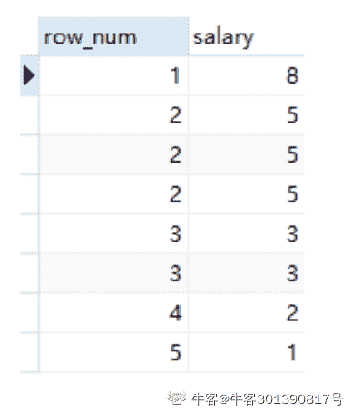

# 乐信 2020 校园招聘数据笔试题

## 1

DB、DBMS 和 DBS 三者之间的关系是

正确答案: B   你的答案: 空 (错误)

```cpp
DB 包括 DBMS 和 DBS
```

```cpp
DBS 包括 DB 和 DBMS
```

```cpp
DBMS 包括 DB 和 DBS
```

```cpp
不能相互包括
```

本题知识点

数据分析师 乐信 2020

讨论

[北斗酌美酒](https://www.nowcoder.com/profile/170736954)

DBS（数据库系统）包含 DB（数据库）和 DBNS（数据库管理系统）

发表于 2020-02-05 04:42:34

* * *

## 2

现有 A 表 30 条数据，B 表 50 条数据，A 表通过其中一个字段左关联 B 表，A 为主表，B 为从表，得到的结果表数据条数为（）条。

正确答案: A   你的答案: 空 (错误)

```cpp
>=30
```

```cpp
=30
```

```cpp
<=30
```

```cpp
=50
```

本题知识点

数据分析师 乐信 2020

讨论

[🐷林子暄哼哼](https://www.nowcoder.com/profile/999702197)

左边 1 条数，右边与之对应的可能有多条数据

发表于 2020-01-05 17:40:34

* * *

## 3

关于 HDFS 的文件写入，正确的是

正确答案: C   你的答案: 空 (错误)

```cpp
支持多用户对同一文件的写操作
```

```cpp
用户可以在文件任意位置进行修改
```

```cpp
默认将文件块复制成三份存放
```

```cpp
复制的文件块默认都存在同一机架上
```

本题知识点

数据分析师 乐信 2020

## 4

下面哪一个命令可以统计 linux 系统上一个文件中“乐信”出现的行数

正确答案: B   你的答案: 空 (错误)

```cpp
cat “乐信” filename | wc -l
```

```cpp
grep “乐信” filename | wc -l
```

```cpp
cat “乐信” filename | wc -w
```

```cpp
grep “乐信” filename | wc -w
```

本题知识点

数据分析师 乐信 2020

讨论

[卧龙隐者](https://www.nowcoder.com/profile/43740728)

语法：wc [选项] 文件

该命令各选项含义如下： 

- c 统计字节数。 

- l 统计行数。 

- w 统计字数。

发表于 2020-10-11 19:01:54

* * *

## 5

根据关系模式的完整性规则，一个关系中的主键

正确答案: D   你的答案: 空 (错误)

```cpp
不能有两个
```

```cpp
不能成为另一个关系的外部键
```

```cpp
可以重复
```

```cpp
不允许空值
```

本题知识点

数据分析师 乐信 2020

讨论

[牛客 1511620 号](https://www.nowcoder.com/profile/1511620)

数据库规定主键不为空

发表于 2020-04-11 09:00:51

* * *

## 6

逻辑回归将输出概率限定在[0, 1]之间，使用了以下哪个函数？

正确答案: B   你的答案: 空 (错误)

```cpp
tanh 函数
```

```cpp
Sigmoid 函数
```

```cpp
ReLU 函数
```

```cpp
Leaky ReLU 函数
```

本题知识点

数据分析师 乐信 2020

讨论

[我是 Coco](https://www.nowcoder.com/profile/386382698)

c 是 0 和 x 的较大值，d 是 0.01x 和 x 的较大值

发表于 2022-03-07 22:07:20

* * *

[牛客 1511620 号](https://www.nowcoder.com/profile/1511620)

深度学习中的激活函数，A 的范围是-1 到 1，B 是 0 到 1，C 和 d 我忘了

发表于 2020-04-11 09:02:23

* * *

## 7

数据仓库的数据量越大，其应用价值也越大

正确答案: B   你的答案: 空 (错误)

```cpp
正确
```

```cpp
错误
```

本题知识点

数据分析师 乐信 2020

讨论

[牛客 436120495 号](https://www.nowcoder.com/profile/436120495)

脏数据越多反而影响存储空间和处理

发表于 2020-03-21 09:36:22

* * *

[小荣哥](https://www.nowcoder.com/profile/600937108)

有效和有价值的数据决定是否具有数据分析的条件

发表于 2020-06-01 08:35:04

* * *

## 8

以下哪一种排序函数会形成“1,2,2,4,5,5,7”的排序结果？

正确答案: A   你的答案: 空 (错误)

```cpp
Rank()
```

```cpp
DENSE_RANK()
```

```cpp
ROW_NUMBER()
```

```cpp
全部错误
```

本题知识点

数据分析师 乐信 2020

讨论

[颖子颖子小颖子](https://www.nowcoder.com/profile/301390817)

1.row_number
row_number 在排名时序号 连续 不重复，即使遇到表中的两个 3 时亦如此

执行
select row_number() OVER(order by e.salary desc) as row_num , e.salary
from employee e
结果如图


2.rank
rank 函数会把要求排序的值相同的归为一组且每组序号一样，排序不会连续
执行
select rank() OVER(order by e.salary desc) as row_num , e.salary
from employee e
结果:

3.dense_rank
dense_rank 排序是连续的，也会把相同的值分为一组且每组排序号一样

执行
select dense_rank() OVER(order by e.salary desc) as row_num , e.salary
from employee e
结果：


发表于 2020-02-11 16:55:28

* * *

## 9

Mysql 中，以下哪种删除 sql 命令是错误的？

正确答案: B   你的答案: 空 (错误)

```cpp
Delete from table1 where status=2
```

```cpp
Delete from table1 a where a.status=2
```

```cpp
Delete a from table1 a where a.status=2
```

```cpp
truncate table table1
```

本题知识点

数据分析师 乐信 2020

讨论

[牛客 826589205 号](https://www.nowcoder.com/profile/826589205)

一、mysql 中删除语句

1、觉得正常的 sql：

delete from ciri_tt_ttlistinfo  t where t.task_sheet_no='C19014';

不过 mysql 数据库中执行直接报错

2、实际使用：

delete from ciri_tt_ttlistinfo  where task_sheet_no='C19014';
或者 delete t from ciri_tt_ttlistinfo  t where t.task_sheet_no='C19014';

tips：delete 使用别名的时候，要在 delete 和 from 间加上删除表的别名，这样才是正确的写法。

发表于 2020-04-16 11:40:56

* * *

[gdut17](https://www.nowcoder.com/profile/279358190)

没有错误 mysql> truncate table tab1;
Query OK, 0 rows affected (0.04 sec)

mysql> insert tab1 values(1,'ll'),(2,'aa');
Query OK, 2 rows affected (0.00 sec)
Records: 2  Duplicates: 0  Warnings: 0

mysql> delete from tab1 a where a.id=1;
Query OK, 1 row affected (0.01 sec)

mysql> delete a from tab1 a where a.id=2;
Query OK, 1 row affected (0.01 sec)

mysql> select * from tab1;
Empty set (0.00 sec)

编辑于 2020-07-18 10:10:12

* * *

[牛客 609450023 号](https://www.nowcoder.com/profile/609450023)

C 是什么意思？ a 是别名吗？

发表于 2019-12-15 11:52:34

* * *

## 10

关系数据模型的基本数据结构是：

正确答案: C   你的答案: 空 (错误)

```cpp
树
```

```cpp
图
```

```cpp
关系
```

```cpp
索引
```

本题知识点

数据分析师 乐信 2020

讨论

[QMM720](https://www.nowcoder.com/profile/195530559)

C

发表于 2020-11-08 17:06:35

* * *

[舰长 007](https://www.nowcoder.com/profile/181025725)

B

发表于 2020-05-24 20:28:36

* * *

[牛爷爷笑出益达](https://www.nowcoder.com/profile/237463408)

B

发表于 2020-04-28 23:27:27

* * *

## 11

mysql 中对于 a、b、c 建立了一个联合索引，以下能走索引的组合是

正确答案: A B D   你的答案: 空 (错误)

```cpp
a
```

```cpp
(a,b)
```

```cpp
(b,c)
```

```cpp
(a,c)
```

本题知识点

数据分析师 乐信 2020

讨论

[颖子颖子小颖子](https://www.nowcoder.com/profile/301390817)

根据查询字段的位置不同来决定，如查询 a,     a,b    a,b,c    a,c   都可以走索引的，其他条件的查询不能走索引。

组合索引 有“最左前缀”原则。就是只从最左面的开始组合，并不是所有只要含有这三列存在的字段的查询都会用到该组合索引。

发表于 2020-02-11 16:59:14

* * *

[牛客 508970125 号](https://www.nowcoder.com/profile/508970125)

遵照最左侧原则，从左往右匹配索引

发表于 2021-05-25 20:20:10

* * *

## 12

以下有关 SQL 性能优化正确的是

正确答案: A B C D   你的答案: 空 (错误)

```cpp
sql 需要避免在索引字段上使用函数
```

```cpp
避免在 WHERE 子句中使用 in，not in , 可以使用 exist 和 not exist 代替
```

```cpp
将对于同一个表格的多个字段的操作写到同一个 sql 中， 而不是分开成两个 sql 语句实现
```

```cpp
避免建立索引的列中使用空值
```

本题知识点

数据分析师 乐信 2020

讨论

[WHY_Hannie](https://www.nowcoder.com/profile/539843194)

ABCD[`www.cnblogs.com/SimpleWu/p/9929043.html`](https://www.cnblogs.com/SimpleWu/p/9929043.html)

发表于 2020-03-19 21:23:24

* * *

[牛客 73792543 号](https://www.nowcoder.com/profile/73792543)

ABCd

发表于 2021-10-15 19:02:06

* * *

[牛客 963188344 号](https://www.nowcoder.com/profile/963188344)

ABCD

发表于 2020-02-16 14:57:02

* * *

## 13

下面那些组件有实时计算的能力

正确答案: A B D   你的答案: 空 (错误)

```cpp
Storm
```

```cpp
Flink
```

```cpp
Hive
```

```cpp
Spark Streaming
```

本题知识点

数据分析师 乐信 2020

## 14

常用的排序算法中，平均时间复杂度为 O(n*logn)的有哪些？

正确答案: A C D   你的答案: 空 (错误)

```cpp
堆排序
```

```cpp
冒泡排序
```

```cpp
快速排序
```

```cpp
归并排序
```

本题知识点

数据分析师 乐信 2020

## 15

hadoop 主要组成部分包括：1,2,3

你的答案 (错误)

123 参考答案 (1) HDFS
(2) MapReduce
(3) Yarn

本题知识点

数据分析师 乐信 2020

讨论

[SWANH](https://www.nowcoder.com/profile/540780774)

MapReduce,HDFS,YARN

发表于 2020-12-13 11:35:01

* * *

[卡卡 201910170839737](https://www.nowcoder.com/profile/815563187)

用于存储 HDFS;用于计算的 MR;用于任务调度的 yarn

发表于 2020-06-28 08:38:41

* * *

[yeweiyang2020](https://www.nowcoder.com/profile/77164563)

Hbase 不算 hadoop 的一个组成部分吗

发表于 2020-03-02 16:43:46

* * *

## 16

解决 0/1 背包问题可以使用是 1、2、3 等算法

你的答案 (错误)

123 参考答案 (1) 动态规划
(2) 回溯法
(3) 分支限界法

本题知识点

数据分析师 乐信 2020

讨论

[Foxsun](https://www.nowcoder.com/profile/311189059)

背包问题还是 DP 比较典型，dfs,bfs 都可以

发表于 2020-01-06 16:56:22

* * *

[ElijahMingLiu](https://www.nowcoder.com/profile/90281949)

答对了动态回归和回溯法，其实广度优先也可以，为什么非要写分支限界法

编辑于 2020-01-06 17:25:19

* * *

## 17

常见的 OLAP 多维数据分析包括 1、2、3 和旋转等操作

你的答案 (错误)

123 参考答案 (1) 上钻
(2) 下钻
(3) 切片

本题知识点

数据分析师 乐信 2020

讨论

[金丹🌟](https://www.nowcoder.com/profile/687206413)

OLAP 让用户能够从不同的角度感知数据否情况。

1）上钻下钻主要是让用户能够从不同的粒度感知数据，比如时间上的年，月，日

2）切片和切块是指固定某些维度后，在剩余的维度看数据，若剩下二维则是切片，若剩下三维则为切块。比如从城市，产品，销量三个维度来看数据

3）旋转是指改变维的方向，即在表格中重新安排维的位置（如行列互换）----------《系统分析师考试辅导》（清华大学出版社）

编辑于 2020-06-07 05:45:59

* * *

[牛客 66117368 号](https://www.nowcoder.com/profile/66117368)

OLAP 联机分析，基于在数据方的基础上进行操作，主要包括钻取、切片、切块和旋转等操作。钻取：包括向上钻取和向下钻取；向上钻取是在某一维度将低层次的细节数据概括到高层次的汇总数据；向下钻取是从汇总数据深入到细节数据进行观察或增加新的维度切片：在立方体上选择一个维度后进行的平面切分切块：选择维度中特定区间的数据旋转：变换维的空间，即在表格中重新安排维的位置

发表于 2020-07-19 03:09:27

* * *

[Minions2020](https://www.nowcoder.com/profile/481197203)

OLAP 的基本分析多维操作有钻取、切片、切块和旋转等。

发表于 2020-05-26 17:01:15

* * *

## 18

Linux 某文件的权限为：drw-r--r--，用数值形式表示该权限为:1，该文件属性是 2

你的答案 (错误)

12 参考答案 (1) 644
(2) 只读文件夹

本题知识点

数据分析师 乐信 2020

讨论

[gdut17](https://www.nowcoder.com/profile/279358190)

首字符 d 表示文件夹，-表示文件

rwx --- 3 位二进制

rw --- 110 ---6

r-- ---100  4

r-- ---100 4

表示为 644

【文件或文件夹】【owner 权限】【group 权限】【others 权限】

此文件夹的所有者可以读写，用户组和其他用户只读

发表于 2020-07-18 09:58:14

* * *

## 19

通常电商诈骗行为都有一定关联性。已知大量历史用户收货地址及某些欺诈用户信息。请使用适当算法找出欺诈概率最高的相关地址及用户。叙述其解决思路。

你的答案

本题知识点

数据分析师 乐信 2020

讨论

[ElijahMingLiu](https://www.nowcoder.com/profile/90281949)

用聚类算法，推荐用 DBSCAN。可以考虑把地址转换成经纬度，还可以对地址用 TFIDF 进行分词。   

发表于 2020-01-05 17:03:15

* * *

[CHRisXman201910162044391](https://www.nowcoder.com/profile/700677523)

发表于 2020-03-23 11:28:00

* * *

## 20

有一存储仅一列数字得 10T 超大文件，要求对文件内数字进行排序。请叙述你的解决思路（也可以使用伪代码描述）。

你的答案

本题知识点

数据分析师 乐信 2020

讨论

[ElijahMingLiu](https://www.nowcoder.com/profile/90281949)

可以考虑使用归并排序思想，使用分布式方法，把文件分成小文件分布式排序，再合并起来。集群主机如果不够的话，CPU 计算量或者内存不足，可以考虑串行，具体可以再优化。

发表于 2020-01-05 17:03:04

* * *