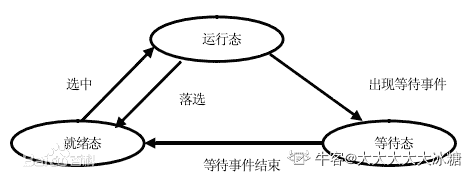

# 猿辅导 2020 校招笔试（二）

## 1

32 位操作系统中，一个进程的虚拟内存是多少?

正确答案: D   你的答案: 空 (错误)

```cpp
4M
```

```cpp
512M
```

```cpp
1G
```

```cpp
4G
```

本题知识点

Java 工程师 C++工程师 iOS 工程师 安卓工程师 运维工程师 前端工程师 算法工程师 PHP 工程师 测试工程师 安全工程师 c#工程师 数据库工程师 大数据开发工程师 猿辅导 2020 牛客

讨论

[Kaitle](https://www.nowcoder.com/profile/2213693)

因为在 32 位的操作系统中，一个指针长度是 4 字节  （32 位）， 2 的 32 次 方个地址寻址能力是从 0x00000000~0xFFFFFFFF 即为 4GB 大小的容量。

发表于 2020-07-27 22:36:55

* * *

[earthSaver](https://www.nowcoder.com/profile/975145700)

2³²=2²G=4G

发表于 2020-07-25 22:46:38

* * *

## 2

给定 yfd_interviewer 数据库表结构：

```cpp
CREATE TABLE `yfd_interviewer` (
  `id` INT(11) NOT NULL AUTO_INCREMENT,
  `name` VARCHAR(256) NOT NULL DEFAULT '',
  `age` INT(11) NOT NULL,
  `createdTime` BIGINT(20) NOT NULL,
  `updatedTime` BIGINT(20) NOT NULL,
  PRIMARY KEY (`id`)
) ENGINE=InnoDB DEFAULT CHARSET=utf8;
```

以下 SQL 中错误的是：

正确答案: C   你的答案: 空 (错误)

```cpp
select * from `yfd_interviewer`;
```

```cpp
Select * From Yfd_Interviewer;
```

```cpp
SELECT * FROM yfd_interviewer ORDER BY id WHERE name = 'lilei';
```

```cpp
UPDATE yfd_interviewer SET age = 20 WHERE id  = 1;
```

本题知识点

Java 工程师 C++工程师 iOS 工程师 安卓工程师 运维工程师 前端工程师 算法工程师 PHP 工程师 测试工程师 安全工程师 c#工程师 数据库工程师 大数据开发工程师 猿辅导 2020

讨论

[七七 201907182000497](https://www.nowcoder.com/profile/779114942)

order by 不能写在 where 前面

发表于 2020-06-27 21:57:28

* * *

[沦陷 201907291812599](https://www.nowcoder.com/profile/690366508)

SELECT * FROM yfd_interviewer ORDER BY id WHERE name = 'lilei';没有指明是倒叙还是升序 SELECT * FROM yfd_interviewer ORDER BY id  desc WHERE name = 'lilei';
同时 数据库在数据表查询的时候 大小写不敏感吗

发表于 2020-02-23 10:23:24

* * *

## 3

在进程状态转换时，以下不可能发生的是：

正确答案: A   你的答案: 空 (错误)

```cpp
等待态 --> 运行态
```

```cpp
运行态 --> 就绪态
```

```cpp
运行态 --> 等待态
```

```cpp
就绪态 --> 运行态
```

本题知识点

Java 工程师 C++工程师 iOS 工程师 安卓工程师 运维工程师 前端工程师 算法工程师 PHP 工程师 测试工程师 安全工程师 c#工程师 数据库工程师 大数据开发工程师 猿辅导 2020

讨论

[大大大大大冰糖](https://www.nowcoder.com/profile/331132575)



发表于 2020-01-03 15:07:45

* * *

## 4

74LS283 是一款四位全加器数字芯片，其输入为 2 路 4 位的数字信号 A 和 B，输出为一路 5 位（含进位）的数字信号 C，满足 C=A+B。
在只有一块 74LS283 没有其他数字芯片的情况下，对一路 3 位数字信号 X，以下说法中错误的是：

正确答案: C   你的答案: 空 (错误)

```cpp
可以实现 Y=X*3 的电路
```

```cpp
可以实现 Y=X*5 的电路
```

```cpp
可以实现 Y=X*7 的电路
```

```cpp
可以实现 Y=X*9 的电路
```

本题知识点

Java 工程师 C++工程师 iOS 工程师 安卓工程师 运维工程师 前端工程师 算法工程师 PHP 工程师 测试工程师 安全工程师 c#工程师 数据库工程师 大数据开发工程师 猿辅导 2020

讨论

[度小满极速内推](https://www.nowcoder.com/profile/434406366)

X*3 = X*2 + X = X < X*5 = X*4 + X = X << 2 + X
X*9 = X*8 + X = X << 3 + X
X*7 不能改成两个的和左移不需要加法器 直接低位补 0 就行

发表于 2020-07-30 15:24:16

* * *

## 5

小猿同学正在排查问题，当程序读入符合某个规律的字符串时会出错，他总结了一下这个规律并画了一张确定有限状态转移图，其中，X 为起始点，每读入一个字符，当前点会沿着该字符对应的边转移，当前点为 Z 时，表示接受当前读入的字符串。*表示前面括号内的正规式或前一个字符出现 0 次或多次，|表示从两侧的正规式中任选一个，则下列正规式中和上图确定有限状态机等价的是：

正确答案: D   你的答案: 空 (错误)

```cpp
00*(01)*1*
```

```cpp
0(01)*1*
```

```cpp
00(0|1)*1
```

```cpp
0(0|1)*1
```

本题知识点

Java 工程师 C++工程师 iOS 工程师 安卓工程师 运维工程师 前端工程师 算法工程师 PHP 工程师 测试工程师 安全工程师 c#工程师 数据库工程师 大数据开发工程师 猿辅导 2020

讨论

[西西 001](https://www.nowcoder.com/profile/806910018)

因为有限状态机 和 正则式一样，而且“*表示前面括号内的正规式或前一个字符出现 0 次或多次”，所以我觉得可以把所有正则式中的*当成出现 0 次，那么剩下的就应该是从 X-Z 必须要走的路了。所以 D 简化后就是 01，那么就是从 X-Y-Z。如果是 C 的话，简化后是 001，但是 Y 接收 0 又是回到 Y，这一条路并不是必经之路，所以不应该有，所以 C 错误。AB 同理个人理解，不知道有没有错误...

发表于 2020-09-11 18:18:14

* * *

## 6

袋子里面有 4 枚硬币，其中有 1 枚不均衡的硬币，其正反面朝上的概率分别为 1/4, 3/4，剩下的 3 枚为均衡硬币，正反面朝上的概率都为 1/2，现在从袋子里面随机选取一枚硬币，连续抛 2 次，结果 2 次都是正面朝上，请问刚才随机选取到的硬币为不均衡硬币的概率是多少？

正确答案: A   你的答案: 空 (错误)

```cpp
1/13
```

```cpp
1/12
```

```cpp
1/5
```

```cpp
1/4
```

本题知识点

Java 工程师 C++工程师 iOS 工程师 安卓工程师 运维工程师 前端工程师 算法工程师 PHP 工程师 测试工程师 安全工程师 c#工程师 数据库工程师 大数据开发工程师 猿辅导 2020

讨论

[口袋里的](https://www.nowcoder.com/profile/818007827)

选中不均衡的硬币且两次正面的概率：1/4*1/4*1/4=1/64；选中均衡的硬币且两次正面的概率：3/4*1/2*1/2=12/64；在两次正面下只可能有这两种情况发生；所以在两次正面情况下，选中的是不均衡的硬币的概率是 1/(1+12)

发表于 2020-01-14 00:09:26

* * *

[Flians](https://www.nowcoder.com/profile/277837)

硬币两次正面朝上和选硬币不应该是相互独立的吗？

发表于 2020-07-28 13:27:40

* * *

## 7

有向图 D 的邻接矩阵为：
则 D 中长度为 3 的通路共有多少条？

正确答案: C   你的答案: 空 (错误)

```cpp
7
```

```cpp
8
```

```cpp
9
```

```cpp
10
```

本题知识点

Java 工程师 C++工程师 iOS 工程师 安卓工程师 运维工程师 前端工程师 算法工程师 PHP 工程师 测试工程师 安全工程师 c#工程师 数据库工程师 大数据开发工程师 猿辅导 2020

讨论

[antdant](https://www.nowcoder.com/profile/285461476)

邻接矩阵的 k 次幂即可以表示图中任意两节点间长度为 k 的路径的数量原矩阵 3 次方之后为[2 1 1                                1 1 0                                1 1 1],相加之后等于 9 

编辑于 2020-07-29 21:33:09

* * *

[zxcv0112358](https://www.nowcoder.com/profile/473856205)

 

发表于 2020-09-18 11:41:30

* * *

[老哈球](https://www.nowcoder.com/profile/229862903)

我懂了，可以画图直接表示出来，不需要使用公式来计算并且自联结是允许的

发表于 2021-03-25 10:35:32

* * *

## 8

采用回退 N 步（GBN）协议的网络发送端的窗口大小为 4，依次发送了 0、1、2、3、4、5、6、7 帧数据，在超时时间内收到了第 0 帧和第 4 帧数据的 ACK，发送端应重传哪些帧：

正确答案: C   你的答案: 空 (错误)

```cpp
1、2、3、4、5、6、7
```

```cpp
1、2、3、5、6、7
```

```cpp
5、6、7
```

```cpp
4、5、6、7
```

本题知识点

Java 工程师 C++工程师 iOS 工程师 安卓工程师 运维工程师 前端工程师 算法工程师 PHP 工程师 测试工程师 安全工程师 c#工程师 数据库工程师 大数据开发工程师 猿辅导 2020

讨论

[度小满极速内推](https://www.nowcoder.com/profile/434406366)

GBN 是累积确认，累计确认允许接收端在连续收到好几个正确的确认帧后，只对最后一个数据帧发确认信息，收到了 0、4 号帧的确认，表明 0，1，2，3，4 号帧都已经接收，当计时器超时时，只需发送 4 号以后的帧，即 5，6，7

编辑于 2020-07-30 15:35:41

* * *

## 9

系统中有若干个互斥的资源 R，6 个并发的进程，每个进程都需要 3 个资源 R，为使系统不发生死锁，至少需要多少个 R：

正确答案: C   你的答案: 空 (错误)

```cpp
3
```

```cpp
8
```

```cpp
13
```

```cpp
18
```

本题知识点

Java 工程师 C++工程师 iOS 工程师 安卓工程师 运维工程师 前端工程师 算法工程师 PHP 工程师 测试工程师 安全工程师 c#工程师 数据库工程师 大数据开发工程师 猿辅导 2020

讨论

[wjaft](https://www.nowcoder.com/profile/3731889)

选择知 C。死锁的发生是由于并发进程竞争资源而出现相互等待的现象。那么如果每个进程需要 3 个资源的话，即进程必须获得到 3 个资源才可以顺利的运行。当系统中发生极端的情况下，6 个进程分别每个进程都获取到了 2 个资源，这时 6 个进程都无法继续运行，而处于等待状态，因为只有获取了 5 个资源才可以运行，那么就会等待其他进回程释放 1 个资源，而获取到该释放的资源，才可以凑齐到 3 个资源，得以运行。那么如果想保证不发生死锁的话，即只要在极端情况答下，再多增加一个资源，就可以打破死锁了。6X2+1=13.

发表于 2020-05-29 11:51:06

* * *

## 10

递归式满足：
T(n) = 4T(n/2) + n²log(n)
则 T(n)的渐进界为：

正确答案: C   你的答案: 空 (错误)

```cpp
Θ(n2)
```

```cpp
Θ(n2*log(n))
```

```cpp
Θ(n2*log2(n))
```

```cpp
Θ(n3*log(n))
```

本题知识点

Java 工程师 C++工程师 iOS 工程师 安卓工程师 运维工程师 前端工程师 算法工程师 PHP 工程师 测试工程师 安全工程师 c#工程师 数据库工程师 大数据开发工程师 猿辅导 2020

讨论

[zxcv0112358](https://www.nowcoder.com/profile/473856205)


case 2

编辑于 2020-09-18 23:22:35

* * *

[为了肥牛冲冲冲](https://www.nowcoder.com/profile/68518359)

*   代入法 ： 自己猜测一个界，然后用数学归纳法进行验证是否正确
*   递归树法 ：将递归式转换为一棵树，其结点表示不同层次的递归调用产生的代价。然后采用边界和技术来求解递归式。
*   主方法 ：可求解形如下面公式的递归式的界：
    T( n ) = aT( a/b*n) + f(n)
    其中 a>=1，b>1，f(n)是一个给定的函数。这种形式的递归式很常见，它刻画了这样的一个问题：生成 a 个子问题，每个子问题的规模是元问题规模的 1/b，分解和合并步骤总共花费时间为 f(n)。 

发表于 2020-07-30 21:28:46

* * *

## 11

以下 C 程序的输出结果是：
int fun1(int i) {
    return i <= 5 ? i : fun1(i - 1) * fun1(i - 3);
}
int fun2(unsigned int i) {
    return ((i >> 8) & 0x6597) & (((i << 8) & 0x6597) >> 8);
}
int main() {
    int n = fun2(fun1(101)) % 4;
    printf("%d", n);     return 0; }

正确答案: B   你的答案: 空 (错误)

```cpp
0
```

```cpp
1
```

```cpp
2
```

```cpp
3
```

本题知识点

Java 工程师 C++工程师 iOS 工程师 安卓工程师 运维工程师 前端工程师 算法工程师 PHP 工程师 测试工程师 安全工程师 c#工程师 数据库工程师 大数据开发工程师 猿辅导 2020

讨论

[度小满极速内推](https://www.nowcoder.com/profile/434406366)

答案为 0

发表于 2020-07-30 16:10:39

* * *

[老哈球](https://www.nowcoder.com/profile/229862903)

答案是为 0，我用程序跑了

发表于 2021-03-24 23:11:41

* * *

[菜🐔能不能有 offer](https://www.nowcoder.com/profile/762042766)

答案对嘛这个？

发表于 2020-07-18 16:46:01

* * *

## 12

关于 SQL 语句中的索引，以下说法中错误的是：

正确答案: B   你的答案: 空 (错误)

```cpp
一个基本表上可以创建多个索引
```

```cpp
索引是外模式
```

```cpp
索引可以加快查询速度
```

```cpp
系统存取数据时会自动选择合适的索引作为存取路径
```

本题知识点

Java 工程师 C++工程师 iOS 工程师 安卓工程师 运维工程师 前端工程师 算法工程师 PHP 工程师 测试工程师 安全工程师 c#工程师 数据库工程师 大数据开发工程师 猿辅导 2020

讨论

[沦陷 201907291812599](https://www.nowcoder.com/profile/690366508)

排除法：一个表中可以有多个索引  正确索引是外模式 没接触过 暂且不管索引的目的就是加快查询速度再存去数据时，如果创建索引索引会自动更新数据所以只有 外模式 没接触过 就选择它

发表于 2020-02-23 10:26:39

* * *

[牛客 43462370 号](https://www.nowcoder.com/profile/43462370)

内模式又称物理模式，它给出了数据库物理存储结构与物理存取方法，如数据存储的文件结构、索引、集簇及 hash 等存取方式与存取路径。 **外模式**

         对应数据库的升级、外模式包括（子模式 用户模式） 用来描述用户看到或者使用那部分的数据的逻辑结构，用户根据外模式用户数据操作语句或者程序去操作数据库中的数据，外模式的主要特点用来描述组成用户视图各个记录的组成、相互联系、数据的完整性和安全性、数据项的特征等。

**2、概念模式**

        对应数据库的概念模式，概念模式（概念、逻辑模式）用以描述整个数据库中的逻辑结构、用来描叙现实生活中的实体，以及它们之间的关系、从而定义记录数据项的完整性约束条件以及记录之间的联系是数据项的框架
        概念模式是数据库中全体数据的逻辑结构和特征的描叙是所有用户数据的公共数据视图。

**3、内模式**

        内模式对应物理级数据库，内模式是所有模式中的最低层的表示，不同于物理层，假设外存是一个无限性的地址空间，内模式是存储记录的类型，存储域以及表示以及存储记录的物理顺序，指示元索引，和存储路径的等数据的存储组织从而形成一个完整的系统。

发表于 2021-03-16 19:19:45

* * *

## 13

已知一个从底到顶存有元素 1、2、3 的栈 P 和一个空队列 Q，若：操作 A：从 P 中取一个元素放入 Q；操作 B：从 Q 中取一个元素放入 P；均称为一次操作，则最少经过多少次操作后，P 中的元素为 2、1、3：

正确答案: A   你的答案: 空 (错误)

```cpp
8
```

```cpp
10
```

```cpp
12
```

```cpp
14
```

本题知识点

Java 工程师 C++工程师 iOS 工程师 安卓工程师 运维工程师 前端工程师 算法工程师 PHP 工程师 测试工程师 安全工程师 c#工程师 数据库工程师 大数据开发工程师 猿辅导 2020

讨论

[海王路飞](https://www.nowcoder.com/profile/446446040)

3，2，1 分别出栈入队，此时队列 3，2，1，栈为空。3 次操作 3 出队入栈，再出栈入队，此时队列 2，1，3，栈为空。2 次操作 2，1，3 分别出队入栈，此时队列为空，栈 2，1， 3。3 次操作

编辑于 2020-07-29 16:46:10

* * *

[爸爸们给个 offer 吧](https://www.nowcoder.com/profile/591609194)

栈 —— 队列① - ③ '123' — 'null' ->'null' —'123'④ ’null' —'123' -> '3' — ‘12’⑤ '3' — '12' -> 'null' — '312'⑥ - ⑧ 'null' — '312' -> '213' - 'null'

编辑于 2020-02-19 12:14:53

* * *

## 14

TCP 建立连接的三次握手中，第二次握手发送的包的标记是:

正确答案: B   你的答案: 空 (错误)

```cpp
ACK
```

```cpp
SYN, ACK
```

```cpp
SYN, PSH
```

```cpp
SYN
```

本题知识点

Java 工程师 C++工程师 iOS 工程师 安卓工程师 运维工程师 前端工程师 算法工程师 PHP 工程师 测试工程师 安全工程师 c#工程师 数据库工程师 大数据开发工程师 猿辅导 2020

讨论

[luoc](https://www.nowcoder.com/profile/3677438)


发表于 2020-02-05 19:31:55

* * *

[牛客 281333648 号](https://www.nowcoder.com/profile/281333648)

d

发表于 2020-05-12 12:26:14

* * *

## 15

关于排序算法，下列说法错误的是:

正确答案: A   你的答案: 空 (错误)

```cpp
快速排序的最坏时间复杂度是 O(n*log(n))
```

```cpp
插入排序的最坏时间复杂度是 O(n2)
```

```cpp
堆排序的平均时间复杂度是 O(n*log(n))
```

```cpp
归并排序的最坏时间复杂度是 O(n*log(n))
```

本题知识点

Java 工程师 C++工程师 iOS 工程师 安卓工程师 运维工程师 前端工程师 算法工程师 PHP 工程师 测试工程师 安全工程师 c#工程师 数据库工程师 大数据开发工程师 猿辅导 2020

讨论

[Kaitle](https://www.nowcoder.com/profile/2213693)

快速排序的最坏时间复杂度是 O(n²)

发表于 2020-07-27 22:51:38

* * *

## 16

猿辅导老师在直播课上和同学们做游戏，让同学们在聊天区报自己的学号，每报一次可以获得一个礼物。但是老师不给报数次数超过了一定的次数的同学发礼物。现在请你来帮助老师把聊天区的报数数列处理一下。规定，当发现某个数大于 m 次时，则认定为报数过多，我们需要得到去除这些学生的报数后的报数数列。

本题知识点

Java 工程师 C++工程师 iOS 工程师 安卓工程师 运维工程师 前端工程师 算法工程师 PHP 工程师 测试工程师 安全工程师 c#工程师 数据库工程师 大数据开发工程师 猿辅导 2020

讨论

[白面葫芦娃](https://www.nowcoder.com/profile/9366787)

```cpp
#include <iostream>
#include <unordered_map>
#include <vector>
#define INF 0xffffffff
using namespace std;

int main(){
    long n=0,m=0;
    cin >> n >> m;
    unordered_map<long, int> iHashMap;
    vector<long> v(n, -1);
    vector<long> ret(n, -1);
    for(int i=0;i<n;i++){
        cin >> v[i];
        iHashMap[v[i]]++;
    }
    for(int i=0;i<n;i++){
        if(iHashMap[v[i]]<=m&&iHashMap[v[i]]!=0)
            cout << v[i] << ' ';
    }
}
```

发表于 2020-07-29 17:56:45

* * *

[李栋吧](https://www.nowcoder.com/profile/4252174)

使用 HashMap 虽然不巧妙，复杂度也确实比较高，但是好歹能测试成功。

```cpp
import java.util.*;
public class Main{

    public static void main(String[] args){
        //第一行输入：两个数，学生报数总个数 n，和允许的最大重复次数 m，以空格分隔
        Scanner sc = new Scanner(System.in);
        int n = sc.nextInt();
        int m = sc.nextInt();
        //第二行输入 ：n 个整数，表示学生所有报数数列，以空格分隔
        int[] arr = new int[n];
        for(int i = 0;i < n;i++){
            arr[i] = sc.nextInt();
        }

        //整一个 HashMap,将 arr[i]作为 key,出现的次数记为 value
        HashMap<Integer,Integer> map = new HashMap();
        //遍历数组 arr
        for(int x:arr){
            map.put(x,map.getOrDefault(x,0)+1);
        }
        //开始找出 value 值>m 对应的 key 值
        Collection<Integer> values= map.values();
        List<Integer> keyList = new ArrayList();
        for(int value:values){
            if(value > m){
                for(int key:map.keySet()){
                    if(map.get(key).equals(value)){
                        //找到这个 key 值
                        keyList.add(key);
                    }
                }
            }
        }
        //找到所有的大于 m 的 key,处理原来的数组 arr,并输出
        for(int x: arr){
            if(keyList.contains(x)){
                continue;
            }
            System.out.print(x + " ");
        }
    }
}
```

发表于 2020-08-01 15:34:48

* * *

[魔芋啤酒鸭](https://www.nowcoder.com/profile/855793012)

```cpp
let params = readline().split(' ');
let n = parseInt(params[0]);
let m = parseInt(params[1]);
let lines = readline().split(' ');
let arr=lines.map(i=>parseInt(i));
let map=new Map();
for (let i=0;i<n;i++){
    if(map.has(arr[i])){
        map.set(arr[i],map.get(arr[i])+1);
    }else map.set(arr[i],1);
}
let res=arr.filter(i=>{
    if (map.get(i)<=m) return i;
})
console.log(res.join(" "));
```

发表于 2020-07-31 23:01:44

* * *

## 17

小猿有一台打字机，只能打出‘A’、‘B’、‘C’三种字符。某天，小猿打了一段长度为 N 的字符串 1，然后发现可以通过打字机的快捷操作来快速改写字符串。已知一次快捷操作必须同时改写 K 个不同位置的字符，且被改写的字符必须改成打字机可以打出的其他字符。例如，K=2 时，"AB"可以被改写为"CA"，也可以被改写为"BC"，但不可以被改写为"AA"(必须恰好改写 K 个字符)或"EF"。可以请问通过 M 次快捷操作，能有多少种将字符串 1 改写为目标字符串 2 的方案？输出方案数对 1000000007 取模的结果。

本题知识点

Java 工程师 C++工程师 iOS 工程师 安卓工程师 运维工程师 前端工程师 算法工程师 PHP 工程师 测试工程师 安全工程师 c#工程师 数据库工程师 大数据开发工程师 猿辅导 2020

讨论

[零葬](https://www.nowcoder.com/profile/75718849)

```cpp
N, M, K = map(int, input().strip().split(' '))
s1 = input()
s2 = input()
if K == 0:
    if s1 == s2:
        print(1)
    print(0)
else:
    b = [1]
    for _ in range(K):
        b.append(b[-1] * 2)
    c = [[1] * (N + 1) for _ in range(N + 1)]
    for i in range(1, N + 1):
        for j in range(1, min(i, K + 1)):
            c[i][j] = c[i - 1][j] + c[i - 1][j - 1]
    d = [[0] * (N + 1) for _ in range(N + 1)]
    for p in range(N + 1):
        for i in range(max(0, K - N + p), min(p, K) + 1):
            temp = b[i] * c[p][i] * c[N - p][K - i]
            for j in range(K - i + 1):
                if 0 <= p - i + j <= N:
                    d[p][p - i + j] += temp * c[K - i][j]
    ans = [0 for _ in range(N + 1)]
    same = sum(p == q for p, q in zip(s1, s2))
    ans[N] = 1
    for i in range(M):
        t = []
        for j in range(N + 1):
            tt = 0
            for p in range(N + 1):
                tt += ans[p] * d[j][p]
            t.append(tt % 1000000007)
        ans = t
    print(ans[same])
```

发表于 2020-10-20 15:49:49

* * *

[菜🐔能不能有 offer](https://www.nowcoder.com/profile/762042766)

有大佬能给个思路吗？

发表于 2020-07-29 19:23:16

* * *

## 18

猿辅导课堂上老师提供了一些角色，学生可以从中选择一个自己喜欢的角色扮演，每 3 个不同的角色就可以组成一个小组，进行分组对话。当老师点击开始分组对话按钮的时候，服务器会为已经选择自己角色的同学分配对话小组，请问最多能组成多少个对话小组？

本题知识点

Java 工程师 C++工程师 iOS 工程师 安卓工程师 运维工程师 前端工程师 算法工程师 PHP 工程师 测试工程师 安全工程师 c#工程师 数据库工程师 大数据开发工程师 猿辅导 2020

讨论

[那天灯下的我](https://www.nowcoder.com/profile/426432237)

最好想的办法，对输入的数组进行排序，判断剩余的可选的是否还大于 3 个，把最少的一种角色和最多的两种角色的数量减一，再排序，以此循环，直到剩余的可选角色数量不足三个。时间复杂度爆炸，然而竟然能过

```cpp
import java.util.*;
public class Main{

    public static void main(String[] args) {
        Scanner scanner = new Scanner(System.in);
        int num = scanner.nextInt();
        for (int i = 0; i < num ; i++) {
            int length = scanner.nextInt();
            int[] array = new int[length];
            for (int j = 0; j< length; j++) {
                array[j] = scanner.nextInt();
            }

            cal(array);

        }
    }
    public static void cal(int[] array){
        int num = 0;
        while (true) {
            Arrays.sort(array);
            int i ;
            for (i = 0; i<array.length;i++){
                if (array[i] == 0)
                    continue;
                else
                    break;
            }
            if (i>array.length-3){
                break;
            }
            else {
                array[i] -= 1;
                array[array.length-1] -= 1;
                array[array.length-2] -= 1;
                num++;
            }
        }
        System.out.println(num);
    }
}

```

发表于 2020-08-01 14:58:16

* * *

[牛客 745599318 号](https://www.nowcoder.com/profile/745599318)

```cpp
#include <iostream>
#include <queue>
#include <string>
#include <vector>
#include <algorithm>
#include <unordered_map>
#include <queue>
using namespace std;
int main(){
	int C;
	cin>>C;
	while(C--){
		int n;
		cin>>n;
		priority_queue<int, vector<int>, less<int>> que;
		for(int i=0;i<n;i++){
			int t;cin>>t;
			que.push(t);
		}
		int ans = 0;
		while(que.size()>=3){
			int a= que.top();que.pop();
			int b= que.top();que.pop();
			int c= que.top();que.pop();
			int d = c;
			if(!que.empty()){
				d = c - que.top() + 1;
			}
			ans += d;
			if(a>d) que.push(a-d);
			if(b>d) que.push(b-d);
			if(c>d) que.push(c-d);
		}
		cout<<ans<<endl;
	}
	return 0;
}
```

发表于 2020-07-28 16:54:06

* * *

[黎明之墟](https://www.nowcoder.com/profile/256954863)

开始做的时候直接挑三个最大的减去其中最小的再放回去两个，过不了，后来想了一下可能会造成浪费的情况比如 3 3 3 3 按上面的思路一次之后变成 3 0 0 0，三组但是如果减到每次挑最大的三个-1，就会是 3 2 2 2 -> 2 2 1 1 ->1 1 1 0->0 0 0 0，四组加速的话就是挑三个最大的，把其中最小的减到和第四大的一样，这种方法代码有很多大佬写了，就不贴了根据上面分析的，其实就是看最大的两个数和其他数之间的和的关系，加入共有 n 个数，如果前 n-2 个数大于第 n-1 个数 那么来回相减肯定能消成只剩 1 个 2 个的情况，第 n-1 个数的关系同理，代码如下，牛客的测试用例都过了，有问题欢迎指正

```cpp
import java.util.*;

public class Main{
    public static void main(String[] args){
        Scanner sc = new Scanner(System.in);
        List<Integer> list = new LinkedList<>();
        Map<Integer, Integer> map = new HashMap<>();
        int count = sc.nextInt();

        while(count > 0){
            int num = sc.nextInt();
            int[] arr = new int[num];
            int sum = 0;
            int rs = 0;

            for(int i=0; i<num; i++){
                arr[i] = sc.nextInt();
                sum += arr[i];
            }

            if(num >= 3){
                Arrays.sort(arr);
                if(sum - arr[num - 1] - arr[num - 2] <= arr[num - 2]){//前 n-2 个数一起最多能把 n-2 减完
                    rs = sum - arr[num - 1] - arr[num - 2];
                }else if(sum - arr[num - 1] <= arr[num - 1]){//前 n-1 个数一起最多能把 n-1 减完
                    rs = (sum - arr[num - 1]) / 2;
                }else {
                    rs = sum / 3;
                }
            }

            System.out.println(rs);
            --count;
        }
    }
}
```

编辑于 2020-08-01 19:22:22

* * *