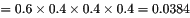

# 猿辅导 2020 校招笔试（三）

## 1

下列关于动态链接库和静态链接库的优缺点描述错误的是：

正确答案: B   你的答案: 空 (错误)

```cpp
静态库的代码装载速度比动态库快
```

```cpp
启动使用相同动态库的多个应用程序时，动态库需要装载多次
```

```cpp
静态库被多个应用程序使用时，会被装载多次，浪费内存
```

```cpp
动态链接库可以共享，即多个应用程序可以使用同一个动态库
```

本题知识点

Java 工程师 C++工程师 iOS 工程师 安卓工程师 运维工程师 前端工程师 算法工程师 PHP 工程师 测试工程师 安全工程师 c#工程师 数据库工程师 大数据开发工程师 猿辅导 2020

讨论

[度小满极速内推](https://www.nowcoder.com/profile/434406366)

**1 静态链接库的优点**

(1) 代码装载速度快，执行速度略比动态链接库快；

(2) 只需保证在开发者的计算机中有正确的.LIB 文件，在以二进制形式发布程序时不需考虑在用户的计算机上.LIB 文件是否存在及版本问题，可避免 DLL 地狱等问题。

**2 动态链接库的优点**

(1) 更加节省内存并减少页面交换；

(2) DLL 文件与 EXE 文件独立，只要输出接口不变（即名称、参数、返回值类型和调用约定不变），更换 DLL 文件不会对 EXE 文件造成任何影响，因而极大地提高了可维护性和可扩展性；

(3) 不同编程语言编写的程序只要按照函数调用约定就可以调用同一个 DLL 函数；

(4)适用于大规模的软件开发，使开发过程独立、耦合度小，便于不同开发者和开发组织之间进行开发和测试。

**3 不足之处**

(1) 使用静态链接生成的可执行文件体积较大，包含相同的公共代码，造成浪费；

(2) 使用动态链接库的应用程序不是自完备的，它依赖的 DLL 模块也要存在，如果使用载入时动态链接，程序启动时发现 DLL 不存在，系统将终止程序并给出错误信息。而使用运行时动态链接，系统不会终止，但由于 DLL 中的导出函数不可用，程序会加载失败；速度比静态链接慢。当某个模块更新后，如果新模块与旧的模块不兼容，那么那些需要该模块才能运行的软件，统统撕掉。这在早期 Windows 中很常见。

编辑于 2020-07-31 10:13:29

* * *

## 2

对使用队列实现的广度优先遍历算法，下图的一种可能的遍历顺序是

正确答案: C   你的答案: 空 (错误)

```cpp
MNOPQR
```

```cpp
NQMPOR
```

```cpp
QMNPRO
```

```cpp
QMNPOR
```

本题知识点

Java 工程师 C++工程师 iOS 工程师 安卓工程师 运维工程师 前端工程师 算法工程师 PHP 工程师 测试工程师 安全工程师 c#工程师 数据库工程师 大数据开发工程师 猿辅导 2020

讨论

[西西 001](https://www.nowcoder.com/profile/806910018)

队列是先进先出的，而且广度优先遍历其实相当于层序遍历。所以比如 C 答案，QMNPRO，即我们以 Q 为根节点，然后遍历 Q 的下一层（即与 Q 直接相连的所有节点），以 MNR 的顺序遍历。接下来一层的顺序也要依照上一层的遍历顺序，也就是先入队 M 直连的下一层节点，再入队 NP 直连的下一层节点。所以 D 答案就不对了同理 A 答案，MNOPQR，以 M 为根节点，然后遍历 M 的直连节点，应该是 RQN，不应该是 NOP，所以不对 B 答案，NQMPOR，以 N 为根节点，然后遍历 N 的直连节点，应该是 MQO，不应该是 QMP，所以也不对 

发表于 2020-09-11 15:39:25

* * *

## 3

以下 C 程序的输出结果是：
int fun1(int i) {
    return i < 2 ? i : fun1(i - 1) + fun1(i - 2);
}
int fun2(unsigned int i) {
    unsigned int j = i & 0xFFFF;    return (j & 0x9108) ^ (j & 0x8019);}
int main() {
    int n = fun2(fun1(101)) % 4;
    printf("%d", n);      return 0;  }

正确答案: B   你的答案: 空 (错误)

```cpp
0
```

```cpp
1
```

```cpp
2
```

```cpp
3
```

本题知识点

Java 工程师 C++工程师 iOS 工程师 安卓工程师 运维工程师 前端工程师 算法工程师 PHP 工程师 测试工程师 安全工程师 c#工程师 数据库工程师 大数据开发工程师 猿辅导 2020

讨论

[南方有佳人](https://www.nowcoder.com/profile/889679952)

```cpp
int fun1(int i) {
    return i < 2 ? i : fun1(i - 1) + fun1(i - 2);
	/*f0=0 f1=1 f2=1 f3=2 f4=3 f5=5 f6=8 f7=13
	  f8=21 f9=34 f10=55 f11=89 f12=144
	  f3x(x=0,1,2...)是偶数，则 f101 肯定是奇数
	*/
}
int fun2(unsigned int i) {
    unsigned int j = i & 0xFFFF;
    return (j & 0x9108) ^ (j & 0x8019);//a-f 为 0 或 1
	/*(j & 1001 0001 0000 1000) ^ (j & 1000 0000 0001 1001)
	  (a00b 000c 0000 d000) ^ (a000 0000 000e d00f)
	  000b 000c 000e 000f
        */
}
int main() {
    int n = fun2(fun1(101)) % 4;
    printf("%d",n);//f1(101)是奇数，f2 中 j 最后一位是 1,f 必为 1,则 n 为 1
    return 0;  
}
```

发表于 2019-12-31 15:19:25

* * *

[CANDoAllTHiNGS](https://www.nowcoder.com/profile/763838954)

斐波那契数列中 3 的倍数项为偶数，则 101 项为奇数，func1(101)返回一个奇数；func2 中 j 的末尾位则为 1      return 为 0 异或 1 为 1；

发表于 2020-07-27 10:07:40

* * *

[sunshina 黑白格](https://www.nowcoder.com/profile/9012463)

101 是奇数所以 fun1 返回 1，与 0FFF 相与不变，j 是 1， 与 1 相与就是判断奇数偶数，异或操作，不同为 1

发表于 2020-07-25 22:48:12

* * *

## 4

一棵二叉树的前序遍历为 ABCDEFG，则其中序遍历不可能为：

正确答案: D   你的答案: 空 (错误)

```cpp
ABCDEFG
```

```cpp
GFEDCBA
```

```cpp
CBEDAGF
```

```cpp
DBCEAFG
```

本题知识点

Java 工程师 C++工程师 iOS 工程师 安卓工程师 运维工程师 前端工程师 算法工程师 PHP 工程师 测试工程师 安全工程师 c#工程师 数据库工程师 大数据开发工程师 猿辅导 2020

讨论

[菜鸟 201711052124359](https://www.nowcoder.com/profile/8470692)

第一种方法：硬算，把每个答案都代入一遍，如果出现矛盾的话，结果不正确。第二种：转化成入栈出栈问题。1.一棵二叉树的前序遍历结果，就是前序遍历时候**元素****入栈顺序。**2.一颗二叉树的中序、后序遍历的结果，就是中序遍历、后序遍历遍历时候**元素出栈顺序**。
所以这个问题就变成了，如果给定一个栈，入栈顺序是 ABCDEFG，那么下面哪种出栈顺序是不可能的。我们来看看 D 选项。

```cpp
DBCEAFG
```

如果 D 要第一个出栈，那么我们就必须：

*   把 ABCD 按顺序压入栈，然后 D 作为栈顶元素出栈。
*   然后我们看看第二个出栈元素是 B，这时候栈里面还有 ABC，栈顶是 C，所以无论如何都无法让 B 出栈。**矛盾。所以 D 选项错误。**

发表于 2020-03-31 15:54:30

* * *

[数据分析阿宇君](https://www.nowcoder.com/profile/65596712)

解决的思路一般有两种
1、将先序序列和各个 du 中序序列结合起来，联 zhi 合起来还原二叉树，如果可以还原，就是正确的
2、转化成入栈出栈问题：将先序序列看成是一个进栈序列，如果通过栈后能够得到的就是合法的中序序列，否则就不是
因此用第二个办法最快

用第二个办法看：
选项 1，先入先出，可能
选项 2，ABC 入栈后，CB 依次出栈；DE 依次入栈，ED 依次出栈；FG 依次入栈，FG 依次出栈；最后 A 出栈。所以出栈顺序：CBEDFGA，可能
选项 3，先入后出，可能
选项 4 为答案

发表于 2020-08-01 10:50:43

* * *

## 5

Dijkstra 算法按照长度递增的方式求无向图中单源点的最短路路径问题。该算法运用了以下哪种策略：

正确答案: C   你的答案: 空 (错误)

```cpp
分治
```

```cpp
动态规划
```

```cpp
贪心
```

```cpp
回溯
```

本题知识点

Java 工程师 C++工程师 iOS 工程师 安卓工程师 运维工程师 前端工程师 算法工程师 PHP 工程师 测试工程师 安全工程师 c#工程师 数据库工程师 大数据开发工程师 猿辅导 2020

讨论

[Kaitle](https://www.nowcoder.com/profile/2213693)

贪心算法通过一系列的选择得到问题的解，所作出的每一次选择是当前状态下局部最优选择，即贪心选择；分治法的基本思想是把大问题分解成小问题，然后又小问题的解方便地构造出大问题地解；动态规划策略设计算法利用问题的最优子结构性质，以自底向上的方式递归地从子问题的最优解逐步构造出整个问题的最优解；回溯法也称为试探法，该方法首先暂时放弃关于问题规模大小的限制，并将问题的候选解按某种顺序逐一枚举和检验；

发表于 2020-07-24 20:43:21

* * *

[hellohc](https://www.nowcoder.com/profile/652898421)

c

发表于 2020-01-06 07:59:12

* * *

## 6

电子邮件应用程序应用 POP3 协议完成以下哪项工作： 

正确答案: D   你的答案: 空 (错误)

```cpp
创建邮件
```

```cpp
加密邮件
```

```cpp
发送邮件
```

```cpp
接收邮件
```

本题知识点

Java 工程师 C++工程师 iOS 工程师 安卓工程师 运维工程师 前端工程师 算法工程师 PHP 工程师 测试工程师 安全工程师 c#工程师 数据库工程师 大数据开发工程师 猿辅导 2020

讨论

[后知后觉的 Jim](https://www.nowcoder.com/profile/317274447)

SMTP 是发送协议，POP3 是读取协议

1.  SMTP 协议的应用范围：**发件人-->发送方服务器-->接收方服务器**，这个通信过程通过 **TCP 连接** 完成
2.  POP3 的应用范围：**接收方服务器-->收件人**，这个通信的过程同样是 **靠 TCP 连接** 完成

发表于 2020-03-08 23:26:48

* * *

## 7

一个局域网的 IP 为 176.68.160.93，使用 22 位作为网络地址，则该局域网的子网掩码为：

正确答案: C   你的答案: 空 (错误)

```cpp
255.255.255.0
```

```cpp
255.255.248.0
```

```cpp
255.255.252.0
```

```cpp
255.255.0.0
```

本题知识点

Java 工程师 C++工程师 iOS 工程师 安卓工程师 运维工程师 前端工程师 算法工程师 PHP 工程师 测试工程师 安全工程师 c#工程师 数据库工程师 大数据开发工程师 猿辅导 2020

讨论

[offer 快到碗里来啦啦啦](https://www.nowcoder.com/profile/708067693)

IP 地址是 32 位二进制，题中说“使用 22 位作为网络地址”，也就是在 32 位的前 22 位都是 1，即 “11111111 11111111 11111100 00000000”，换成十进制就是 “255 255 252 0”

发表于 2020-02-09 12:08:10

* * *

[度小满极速内推](https://www.nowcoder.com/profile/434406366)

子网指一个组织中相连的网络设备的逻辑分组。一般情况下，子网可表示为某地理位置内(某大楼或相同局域网中)的所有机器。网络设计师将网络划分成一个个逻辑段 (子网)，以便于更好地管理网络，同时提高网络性能，增强网络安全性。另外，将一个组织内的网络划分成各个子网，只需要通过单个共享网络地址，即可将这些子网连接到因特网上，从而减缓了互联网 IP 地址的耗尽问题。
题目中，主机的 IP 地址为 176.68.160.93。题目已说明网络地址占 22 位，那么主机地址就占 10 位，我们不难得出此子网的主机数可以有 210 个。给子网上的设备分配地址时，有两个地址是不能使用的，即二进制位全为“0”或“1”的主机地址，我们保留这两个地址，用来唯一识别两个特殊功能：子网的网络地址和广播地址。所以最多可连接的主机数是 1024 个。
掩码是一个 32 位二进制数，用点分十进制数来描述，默认情况下，掩码包含两个域：网络域和主机域。这些内容分别对应网络号和本地可管理的网络地址部分，通过使用掩码可将本地可管理的网络地址部分划分成多个子网。题中的 IP 是个 B 类地址，默认掩码为 255.255.0.0，网络地址为 16 位，而题中给出了前 22 位作为网络地址，则子网掩码第三个字节的前 6 位为子网域，第一位用“1”表示，剩余的位数为主机域，由“0”表示，即 11111100 00000000，将这二进制信息转换成十进制数作为掩码的后半部分，则可得出所求的完整掩码：255.255.252.0。

编辑于 2020-07-31 10:18:52

* * *

## 8

某进程页面访问序列为 1、2、3、1、4、2，且开始执行时内存中没有页面，分配给该进程的物理块数为 3，则采用 FIFO 页面置换算法和 LRU 页面置换算法时，缺页率分别为：

正确答案: C   你的答案: 空 (错误)

```cpp
67%和 67%
```

```cpp
83%和 83%
```

```cpp
67%和 83%
```

```cpp
83%和 67%
```

本题知识点

Java 工程师 C++工程师 iOS 工程师 安卓工程师 运维工程师 前端工程师 算法工程师 PHP 工程师 测试工程师 安全工程师 c#工程师 数据库工程师 大数据开发工程师 猿辅导 2020

讨论

[度小满极速内推](https://www.nowcoder.com/profile/434406366)

页面情况如下表：

|   | 1 | 2 | 3 | 1 | 4 | 2 |
| FIFO |  ❎ | 1 ❎
 | 12 ❎
 | 123 ✅
 | 123 ❎
 | 234 ✅
 |
| LRU | ❎ | 1 ❎
 | 12 ❎
 | 123 ✅
 | 231 ❎
 | 314 ❎ |

FIFO：4/6 = 67%LRU:   5/6 = 83% 发表于 2020-07-31 10:21:18

* * *

[不羞客](https://www.nowcoder.com/profile/7661834)

共 6 页，FCFS 有 4 次缺页错误，LRU 有 5 次，所以结果是 4/6,5/6

发表于 2020-01-04 18:01:15

* * *

[天马波拉登](https://www.nowcoder.com/profile/324001444)

放 1 前 null 缺放 2 前 1 缺放 3 前 12 缺出 1 前 123 完美放 4 前 1 已出队 23 缺放 2 前 4 已入队 234 完美 FIFO 共计四次缺页

发表于 2020-09-08 21:57:59

* * *

## 9

已知信号量的初值为 2，当前值为-3，则表示有多少个等待进程：

正确答案: C   你的答案: 空 (错误)

```cpp
1
```

```cpp
2
```

```cpp
3
```

```cpp
5
```

本题知识点

Java 工程师 C++工程师 iOS 工程师 安卓工程师 运维工程师 前端工程师 算法工程师 PHP 工程师 测试工程师 安全工程师 c#工程师 数据库工程师 大数据开发工程师 猿辅导 2020

讨论

[不羞客](https://www.nowcoder.com/profile/7661834)

选 C，如何信号量为负，则它的绝对值就是等待它的进程数

发表于 2020-01-05 16:07:04

* * *

[度小满极速内推](https://www.nowcoder.com/profile/434406366)

当信号量控制互斥问题时，其初值往往代表资源的个数。本题初值为 2，说明该种资源数量 2 个。当进程将 2 个资源全部占有之后，信号量值减至 0，此时若再有进程要求申请该资源，则必须在此信号量上等待，具体表现为：将信号量的值减 1，导致信号量的取值为负。此时有几个进程申请该资源，信号量便被减几次；因此 S 的值为-3，则表示有 3 个进程在等待该资源。

发表于 2020-07-31 10:28:09

* * *

[精神小伙儿](https://www.nowcoder.com/profile/302864140)

缺货才等待，有现货等个毛呀

发表于 2020-09-09 21:43:17

* * *

## 10

已知 Cache 的容量为 4MB，分为 4 块，每块 1MB，读写时间为 3ns，主存的容量为 512MB，读写时间为 30ns。若平均读写时间为 3.54ns，则 Cache 的命中率为：

正确答案: C   你的答案: 空 (错误)

```cpp
90%
```

```cpp
95%
```

```cpp
98%
```

```cpp
99%
```

本题知识点

Java 工程师 C++工程师 iOS 工程师 安卓工程师 运维工程师 前端工程师 算法工程师 PHP 工程师 测试工程师 安全工程师 c#工程师 数据库工程师 大数据开发工程师 猿辅导 2020

讨论

[南方有佳人](https://www.nowcoder.com/profile/889679952)

令平均访问时间为 T，Tc 为 Cache 访问时间，Tm 为内存访问时间，H 为 Cache 命中率，则 T = H*Tc + (1-H)*Tm，代入题中数据 3.54 = H*3 + (1-H)*30，得 H 为 98%

发表于 2019-12-31 16:21:44

* * *

[后知后觉的 Jim](https://www.nowcoder.com/profile/317274447)

缓存不命中就去访问主存，平均访问时间就是 **cache 命中+不命中** 总共花的时间，设命中率为 H，则
平均访问时间 T =H* cache+ (1-H) * memory
3.54 = H * 3 + (1-H) * 30 , H=98%

发表于 2020-03-08 22:27:04

* * *

[度小满极速内推](https://www.nowcoder.com/profile/434406366)

设命中率为 k，则 3k + 30(1-k) = 3.54，解得 k=0.98

发表于 2020-07-31 10:32:23

* * *

## 11

设有关系模式 R(A,B,C,D,E)，其函数依赖集为 F={A→B, AC→E, C→D}，则关系模式 R 达到了何种范式：

正确答案: A   你的答案: 空 (错误)

```cpp
1NF
```

```cpp
2NF
```

```cpp
BCNF
```

```cpp
3NF
```

本题知识点

Java 工程师 C++工程师 iOS 工程师 安卓工程师 运维工程师 前端工程师 算法工程师 PHP 工程师 测试工程师 安全工程师 c#工程师 数据库工程师 大数据开发工程师 猿辅导 2020

讨论

[南方有佳人](https://www.nowcoder.com/profile/889679952)

第二范式要求关系模式中的每一个非主属性都完全依赖于关系模式的某个候选关键字，本题 D、B 都是部分依赖于(A,C)，所以不满足 2NF，就更不可能满足要求更高的 3NF 和 BCNF，故是 1NF。

编辑于 2019-12-31 16:59:11

* * *

[天马波拉登](https://www.nowcoder.com/profile/324001444)

A->B 则 AC->BB 部分依赖于 A 不满足 2 范式即为 1 范式

发表于 2020-09-08 22:07:10

* * *

[菜鸟 201711052124359](https://www.nowcoder.com/profile/8470692)

[`blog.csdn.net/qq_40780910/article/details/105332379`](https://blog.csdn.net/qq_40780910/article/details/105332379)

发表于 2020-04-05 21:16:55

* * *

## 12

设 G 是一个具有 36 条边、不含自回路和多重边的非连通无向图，则 G 最少有多少个顶点：

正确答案: C   你的答案: 空 (错误)

```cpp
8
```

```cpp
9
```

```cpp
10
```

```cpp
11
```

本题知识点

Java 工程师 C++工程师 iOS 工程师 安卓工程师 运维工程师 前端工程师 算法工程师 PHP 工程师 测试工程师 安全工程师 c#工程师 数据库工程师 大数据开发工程师 猿辅导 2020

讨论

[南方有佳人](https://www.nowcoder.com/profile/889679952)

无向完全图的边数为：N*(N-1)/2，考虑最极端的情况当 N 为 9 时：9×8/2=36，即若有 9 个顶点，36 条边，组成无向完全图，必是连通图。此时再加一个不联通的顶点，N 为 10，即为非连通图

发表于 2019-12-31 17:14:24

* * *

[匪小 R](https://www.nowcoder.com/profile/159059482)

C，n(n-1)/2=72,解的 n=9，因为是非连通的，所以再加一个顶点答案为 10

发表于 2019-12-26 16:18:35

* * *

## 13

用 2K*8 位的存储器芯片组成 16K*8 位的存储器，地址单元为 0000H-3FFFH，每个芯片的地址空间连续，则地址空间 0B1FH 所在的芯片的最小地址编号为：

正确答案: B   你的答案: 空 (错误)

```cpp
0000H
```

```cpp
0800H
```

```cpp
2000H
```

```cpp
2800H
```

本题知识点

Java 工程师 C++工程师 iOS 工程师 安卓工程师 运维工程师 前端工程师 算法工程师 PHP 工程师 测试工程师 安全工程师 c#工程师 数据库工程师 大数据开发工程师 猿辅导 2020

讨论

[鞋盒中的月亮](https://www.nowcoder.com/profile/511115264)

B，第一块的地址 0000h-07ffh 第二块开始，在第一块的基础之上加 0800h

编辑于 2020-07-12 01:07:55

* * *

[浅笑 666](https://www.nowcoder.com/profile/5139323)

书上答案是 A

发表于 2020-11-01 17:47:48

* * *

[度小满极速内推](https://www.nowcoder.com/profile/434406366)

 一个 2K×4 位的存储器芯片的容量为 1KB，要组成 16K×8 位的存储器(容量为 16KB)，需要 16 块 2K×4 位的存储器芯片，地址单元为 0000H～03FFH、0400H～07FFH、0800H～0BFFH、C00H～0FFFH、1000H～13FFH，……
地址单元 0BIFH 所在芯片的最小地址编号为 0800H。

发表于 2020-07-31 14:28:04

* * *

## 14

某大型晚会导演组对六个节目进行终审，有六个节目尚未确定是否通过，这六个节目分别为歌曲 A、歌曲 B、相声 C、相声 D、舞蹈 E 和魔术 F。综合考虑各种因素，导演组确定如下方案： 1） 歌曲 A 和歌曲 B 至少要上一个； 2） 如果相声 C 不能通过或相声 D 不能通过，则歌曲 A 也不能通过； 3） 如果相声 C 不能通过，那么魔术 F 也不能通过 4） 只有舞蹈 E 通过，歌曲 B 才能通过。导演组最终确定舞蹈 E 不能通过。由此可以推导出（ ）

正确答案: A   你的答案: 空 (错误)

```cpp
无法确定魔术 F 是否通过
```

```cpp
歌曲 A 不能通过
```

```cpp
无法确定两个相声节目是否能通过
```

```cpp
歌曲 B 能通过
```

本题知识点

Java 工程师 C++工程师 iOS 工程师 安卓工程师 运维工程师 前端工程师 算法工程师 PHP 工程师 测试工程师 安全工程师 c#工程师 数据库工程师 大数据开发工程师 猿辅导 2020

讨论

[度小满极速内推](https://www.nowcoder.com/profile/434406366)

题干信息翻译为：①A 或 B；②ØC 或ØD→ØA；③ØC→ØF；④B→E。题干确定信息为，E 不能通过，则为ØE；命题④的否定后件，则为ØE→ØB；根据命题①，ØB→A；否定命题②后件，得到 C 且 D。否定命题③的前件，不能得到确定性结论，因此 F 是否能通过无法确定。根据题干可以推出，歌曲 A 能够通过，两个相声节目 C 和 D 都能通过，歌曲 B 不能通过。因此，B、C、D 三项表述错误，A 项当选。

发表于 2020-07-31 14:35:18

* * *

[demard](https://www.nowcoder.com/profile/912251742)

能通过 不是 通过

发表于 2020-07-28 15:08:39

* * *

## 15

甲和乙进行 5 局 3 胜制的乒乓球比赛，甲每局获胜的概率是乙每局获胜概率的 1.5 倍。问以下哪种情况发生的概率最大？

正确答案: A   你的答案: 空 (错误)

```cpp
比赛在 3 局内结束
```

```cpp
乙连胜 3 局获胜
```

```cpp
甲获胜且两人均无连胜
```

```cpp
乙用 4 局获胜
```

本题知识点

Java 工程师 C++工程师 iOS 工程师 安卓工程师 运维工程师 前端工程师 算法工程师 PHP 工程师 测试工程师 安全工程师 c#工程师 数据库工程师 大数据开发工程师 猿辅导 2020

讨论

[度小满极速内推](https://www.nowcoder.com/profile/434406366)

根据“甲每局获胜的概率是乙每局获胜概率的 1.5 倍”，设乙的概率为，则甲的概率为，由，解得，即甲获胜的概率为 0.6，乙为 0.4。
A 项：比赛在 3 局内结束，有两种情况：①甲连胜 3 局，概率；②乙连胜 3 局，概率。故 A 项总概率。
B 项：乙连胜 3 局获胜，有三种情况：①乙前 3 局连胜，概率；②乙第 2、3、4 局连胜，概率；③乙第 3、4、5 局连胜，概率；故 B 项总概率。
C 项：甲获胜且两人均无连胜，只有一种情况，即甲获胜三局且分别是第 1、3、5 局获胜，概率。
D 项：乙用 4 局获胜，则第四局必然是乙获胜，且前三局中乙有两局获胜，因此概率。
故正确答案为 A。

发表于 2020-07-31 14:36:21

* * *

[塵封 Dè眷戀](https://www.nowcoder.com/profile/448631097)

易知，甲胜率 0.6，乙胜率 0.4A. 三局结束概率：0.4³+0.6³=0.28B.乙连胜 3 局： 1\. ooo 2\. xooo 3.oxooo(o 表示乙胜，x 表示乙负)  ,故概率为 (1+0.6 +0.4*0.6)*0.4³=0.11776C.均无连胜且甲胜只有一种可能：0.4³*0.6²=0.02304D.乙四局获胜，第四局必定乙胜，前三局输一场：3*0.6*0.4³ =0.1152 故选 A

编辑于 2020-01-03 22:29:31

* * *

[BitGuo](https://www.nowcoder.com/profile/350986822)

A 包含 B，排除 BC 唯一的可能为甲乙甲乙甲，甲乙甲的概率小于甲甲甲，自然就小于 A 了，排除 CD 的可能为乙乙乙中放入一个甲，且不能在最后，前三局概率必然小于甲甲甲，排除 D 选 A

发表于 2020-07-31 22:42:08

* * *

## 16

中午是猿辅导水果时间，小猿会给每个同学发水果。猿辅导有一个矩形的办公区域，共有 N 排，每排 M 个工位。平时小猿按照从第一排到最后一排的顺序发水果，某一天小猿突然发现似乎旋转着发水果是一种更有趣的方式，所以决定试试按照逆时针方向螺旋发水果。已知每个工位有一个数字，表示该工位员工的工号，每个员工的工号不同。已知小猿从（0, 0）位置开始，按照逆时针螺旋的顺序发水果，请输出收到水果的员工工号序列。

本题知识点

Java 工程师 C++工程师 iOS 工程师 安卓工程师 运维工程师 前端工程师 算法工程师 PHP 工程师 测试工程师 安全工程师 c#工程师 数据库工程师 大数据开发工程师 猿辅导 2020

讨论

[李栋吧](https://www.nowcoder.com/profile/4252174)

剑指 offer 上是顺时针遍历矩阵

```cpp
import java.util.*;
public class Main{
    public static void main(String[] args){
         Scanner sc = new Scanner(System.in);
         //第一行 两个数， 数组行列 N，M
         int N = sc.nextInt();
         int M = sc.nextInt();
         int matrix[][] = new int[N][M];
         //输出
         int[] result = new int[N*M];
        //接下来 N 行，每行 M 个正整数，表示每个位置的员工工号
         for(int i = 0; i < N;i++){
             for(int j = 0; j < M;j++){
                 matrix[i][j] = sc.nextInt();
             }
         }
        //上下左右 
        int left = 0,right = matrix[0].length-1; 
        int top = 0,bottom = matrix.length-1;
        int x = 0;
        while(true){
            //从上到下
            for(int i = top;i <= bottom; i++){
                result[x++] = matrix[i][left];
            } 
            if(++left > right) break;

            //从左到右
            for(int i = left; i<= right; i++){
                result[x++] = matrix[bottom][i];
            }  
            if(top > --bottom) break;
            //从下到上
            for(int i = bottom;i >= top; i--){
                result[x++] = matrix[i][right];
            } 
            if(left > --right) break;
            //从右到左
            for(int i = right; i >= left; i--){
                result[x++] = matrix[top][i];
            } 
            if(++top > bottom) break;
        }

        for(int i = 0; i < result.length;i++){
            System.out.print(result[i]+" ");
        }

    }  
}
```

发表于 2020-08-01 15:45:42

* * *

[墨落纸上](https://www.nowcoder.com/profile/533283563)

```cpp
import java.util.*;
public class Main{
    public static void main(String[] args){
        Scanner sc = new Scanner(System.in);
        int N = sc.nextInt();
        int M = sc.nextInt();
        if(N == 0 || M == 0){
            return;
        }
        int[][] arr = new int[N][M];
        for(int i = 0; i < N; i++){
            for(int j = 0; j < M; j++){
                arr[i][j] = sc.nextInt();
            }
        }
        int left = 0;
        int right = M - 1;
        int up = 0;
        int down = N - 1;
        int num = M * N;
        while(num >= 1){
            for(int i = up; i <= down && num >= 1; i++){
                System.out.print(arr[i][left] + " ");
                num--;
            }
            left++;
            for(int i = left; i <= right && num >= 1; i++){
                System.out.print(arr[down][i] + " ");
                num--;
            }
            down--;
            for(int i = down; i >= up && num >= 1; i--){
                System.out.print(arr[i][right] + " ");
                num--;
            }
            right--;
            for(int i = right; i >= left && num >= 1; i--){
                System.out.print(arr[up][i] + " ");
                num--;
            }
            up++;
        }
        System.out.println();
    }
}
```

 发表于 2020-07-25 22:23:26

* * *

[BuffSeller](https://www.nowcoder.com/profile/630847344)

import java.util.*;

public class Main{
    public static void main(String[] args){
        Scanner sc = new Scanner(System.in);
        int n = sc.nextInt();
        int m = sc.nextInt();
        int[][] mat = new int[n][m];
        for(int i = 0; i < n; i++){
            for(int j = 0; j < m; j++){
                mat[i][j] = sc.nextInt();
            }
        }
        List<Integer> res = new ArrayList<>();
        int left = 0, right = m-1, up = 0, down = n-1;
        while(true){
            for(int i = up; i <= down; i++){
                res.add(mat[i][left]);
            }
            if(++left > right) break;
            for(int i = left; i <= right; i++){
                res.add(mat[down][i]);
            }
            if(--down < up) break;
            for(int i = down; i >= up; i--){
                res.add(mat[i][right]);
            }
            if(--right < left) break;
            for(int i = right; i >= left; i--){
                res.add(mat[up][i]);
            }
            if(++up > down) break;
        }
        for(int i=0;i<res.size();i++){
            System.out.print(res.get(i) + " ");

        }
    }

}

发表于 2020-07-14 18:42:54

* * *

## 17

猿辅导课程中需要记录各个班的同学们的出勤情况并进行班级排名，授予冠军班级的奖励。

但是今天粗心的小猿出公司门的时候摔了一跤，把榜单给弄丢了，幸好考勤记录还没丢，但是顺序被弄乱了，现在他把考勤记录和班级名册整理了一下，请你写个程序，帮他把班级排名恢复吧！

排名规则是各班的出勤率，即老师在教室时同学们在教室听讲的比例，具体为：班级同学有效出勤分钟数之和/(老师在教室时间*班级人数)，出勤率相同的班级，按班级名称的字典序进行排序。其中，有效出勤分钟数表示该同学与老师同在教室内的时间和，即各个区间的结束时间(分)与开始时间(分)之差的和。

本题知识点

Java 工程师 C++工程师 iOS 工程师 安卓工程师 运维工程师 前端工程师 算法工程师 PHP 工程师 测试工程师 安全工程师 c#工程师 数据库工程师 大数据开发工程师 猿辅导 2020

讨论

[清雪冰橙](https://www.nowcoder.com/profile/514769)

我吐了，您呢？

发表于 2020-04-22 17:21:51

* * *

[offeroffer 开来吧](https://www.nowcoder.com/profile/79757615)

```cpp
import java.util.*;
public class Main{
    public static void main(String[] args){
        Scanner input=new Scanner(System.in);
        int timeSum=input.nextInt();
        int classSum=input.nextInt();
        input.nextLine();
        String[] classInfo=new String[classSum];
        String[] timeInfo=new String[timeSum];
        for(int i=0;i<classSum;i++)
            classInfo[i]=input.nextLine();
        for(int i=0;i<timeSum;i++)
            timeInfo[i]=input.nextLine();
        TreeMap<String,Double> res =new TreeMap<>();//TreeMap 是有序的
        for(int i=0;i<classSum;i++){//处理 class 包含的信息
            String[] strs=classInfo[i].split(" ");
            int pSum=Integer.parseInt(strs[0]);
            String teacher=strs[1];
            String cla=strs[2];
            HashMap<String,Double> map=new HashMap<>();
            for(int j=3;j<3+pSum;j++)
                map.put(strs[j],0.0);//得到当前班级所有学生的信息
            ArrayList<Double> list=new ArrayList<>();//将所有老师的在班级里的时间放在 List 中
            for(int j=0;j<timeSum;j++){
                String[] timeStr=timeInfo[j].split(" ");//第二列消息是老师和学生编号信息
                if(timeStr[1].equals(teacher))
                    list.add(Double.parseDouble(timeStr[2]));//将所有老师的时间全部找出来
            }
            for(int j=0;j<timeSum-1;j++){//将学生的有效时间存入 map 中
                String[] timeStr=timeInfo[j].split(" ");
                if(map.containsKey(timeStr[1])){//该学生是该班的学生
                    Double start=Double.parseDouble(timeStr[2]);
                     String[] timeEnd=timeInfo[++j].split(" ");
                     Double end=Double.parseDouble(timeEnd[2]);
                    //需要遍历老师的时间，找出老师的时间与学生时间重合的部分
                    for(int k=0;k<list.size()-1;k++){
                        Double tStart=list.get(k);
                        Double tEnd=list.get(++k);
                        if(start>tEnd||end<tStart) 
                            continue;
                        if(start<tStart&&end<tEnd)
                            map.put(timeStr[1],map.get(timeStr[1])+end-tStart);
                        if(start<tStart&&end>tEnd)
                            map.put(timeStr[1],map.get(timeStr[1])+tEnd-tStart);
                        if(start>=tStart&&end<=tEnd)
                            map.put(timeStr[1],map.get(timeStr[1])+end-start);
                        if(start>tStart&&start<tEnd&&end>tEnd)
                            map.put(timeStr[1],map.get(timeStr[1])+tEnd-start);
                    }
                }
            }
            //计算老师的时间
            Double teachTime=0.0;
            for(int j=0;j<list.size();j++)
                teachTime+=list.get(j);
            //计算全部学生的有效时间，遍历 map
            Double studemtTime=0.0;
            for(String key:map.keySet())
                studemtTime+=map.get(key);
            Double number=studemtTime/(teachTime*pSum);
            res.put(cla,number);
        }
        //遍历 TreeMap
        Iterator iter = res.keySet().iterator();
        while (iter.hasNext()) {
      // 获取 key
     System.out.println((String)iter.next());
    }
 }
}

```

每个答案都是超时

发表于 2020-08-18 16:15:30

* * *

[小凯~](https://www.nowcoder.com/profile/892844765)

#include <iostream>#include<vector>
#include<algorithm>
#include<string>
#include<unordered_map>

using namespace std;

struct classname //班级属性
{
    string class_name = "";
    int classmate_num = 0;
    vector<string>name_list;
    string class_leader = "";
    double score = 0;
};

struct people//个人属性
{
    vector<int>IN, OUT;
};

static bool Compare(const classname it1, const classname it2)
{
    if (it1.score == it2.score)
    {
        return it1.class_name >= it2.class_name;
    }
    else
    {
        return it1.score >= it2.score;
    }
}

int main()
{
    int count, num;
    cin >> count >> num;
    classname* A = new classname[num];
    unordered_map<string, people>people_map;

    for (int i = 0; i < num; ++i)
    {
        cin >> A[i].classmate_num >> A[i].class_leader >> A[i].class_name;
        A[i].name_list.push_back(A[i].class_leader);
        for (int j = 0; j < A[i].classmate_num; ++j)
        {
            string p;
            cin >> p;
            A[i].name_list.push_back(p);
        }
    }

    for (int i = 0; i < count / 2; ++i)
    {
        string s1, s2, s4, s5; int s3, s6; people p;
       cin >> s1 >> s2 >> s3 >> s4 >> s5 >> s6;
        p.IN.push_back(s3); p.OUT.push_back(s6);
        if (people_map.find(s2) != people_map.end())
        {
            auto it = people_map.find(s2);
            it->second.IN.push_back(s3);
            it->second.OUT.push_back(s6);
        }
        else
        {
            people_map.insert(pair<string, people>(s2, p));
        }
        p.IN.clear(); p.OUT.clear();
    }

    for (int i = 0; i < num; ++i)
    {
        double den = 0, num1 = 0; auto teacher = people_map.find(A[i].name_list[0]);
        for (int j = 0; j < teacher->second.IN.size(); ++j)
        {
            den += (teacher->second.OUT[j] - teacher->second.IN[j]);
        }
        den = den * A[i].classmate_num;

        for (int j = 1; j <= A[i].classmate_num; ++j)
        {
            auto student = people_map.find(A[i].name_list[j]);
            if (student != people_map.end())
            {
                int index = 0, k = 0; bool B = true;
                for (; k < student->second.IN.size() && index < teacher->second.IN.size(); )
                {
                    if (student->second.IN[k] < teacher->second.IN[index]
                        && student->second.IN[k] <= teacher->second.OUT[index]
                        && student->second.IN[k] > teacher->second.IN[index])
                    {
                        num1 += (student->second.OUT[k] - teacher->second.IN[index]);
                        k++;
                    }
                    else if (student->second.IN[k] > teacher->second.IN[index]
                        && student->second.IN[k] <= teacher->second.OUT[index]
                        && student->second.OUT[k] > teacher->second.OUT[index])
                    {
                        num1 += (teacher->second.OUT[index] - student->second.IN[k]);
                        index++;
                    }
                    else if ((student->second.IN[k] >= teacher->second.IN[index]
                        && student->second.OUT[k] <= teacher->second.OUT[index]))
                    {
                        num1 += (student->second.OUT[k] - student->second.IN[k]);
                        k++;
                    }
                    else if ((student->second.IN[k] <= teacher->second.IN[index]
                        && student->second.OUT[k] >= teacher->second.OUT[index]))
                    {
                        num1 += (teacher->second.OUT[index] - teacher->second.IN[index]);
                        index++;
                    }
                    else if (student->second.IN[k] >= teacher->second.OUT[index])
                    {
                        index++;
                    }
                    else if (student->second.OUT[k] <= teacher->second.IN[index])
                    {
                        k++;
                    }
                }
            }
        }

        A[i].score = num1 / den;
    }

    sort(A, A + num, Compare);
    for (int i = 0; i < num; ++i)
    {
        cout << A[i].class_name <<endl;
    }

    return 0;
}

发表于 2020-07-24 22:51:32

* * *

## 18

辅导课堂在推进质量建设，需要分析每堂直播课的用户报障数量。当连续多个课程的报障数量之和大于一个数 s 的时候，系统会发出报警。小猿想知道最长连续的没有触发报警的课程数量。

本题知识点

Java 工程师 C++工程师 iOS 工程师 安卓工程师 运维工程师 前端工程师 算法工程师 PHP 工程师 测试工程师 安全工程师 c#工程师 数据库工程师 大数据开发工程师 猿辅导 2020

讨论

[仰望星空的雪](https://www.nowcoder.com/profile/689968942)

```cpp
// 使用滑动窗口解决
import java.util.Scanner;
public class Main {

    public static int Solution(int[] arr, int s){

           int max = 0;
           int i = 0;
           int j = 0;
           int len = arr.length;
           int sum = 0;
           while (j < len){
                  if(sum + arr[j] <= s){
                          sum += arr[j];
                          j++;
                  }else{
                          max = Math.max(max, j - i);
                          if(i < j) {
                              sum -= arr[i];
                              i++;
                          }else {
                              i++;
                              j++;
                          }
                  }

           }
           max = Math.max(max, j - i);
           return max;

    }

    public static void main(String[] args) {

           Scanner scanner = new Scanner(System.in);
           String str = scanner.nextLine();
           String[] arr = str.split(" ");
           Integer n = Integer.parseInt(arr[0]);
           Integer k = Integer.parseInt(arr[1]);
           int[] intArr = new int[n];
           for(int i = 0; i < n; i++){
                  intArr[i] = scanner.nextInt();
           }
           System.out.println(Solution(intArr, k));

    }

}
```

发表于 2020-04-14 20:21:32

* * *

[CROSS?OVER!](https://www.nowcoder.com/profile/1807237)

用队列的先进先出很容易就解决了。

```cpp
#include<iostream>
#include<queue>
using namespace std;

queue<int> vec;

int main() {
	int x1,y1;
	int tem=0,result = 0,r1 = 0;
	cin>>x1>>y1;

	for(int i = 0;i<x1;i++) {
		int tem1;cin>>tem1;
		tem+=tem1;
		vec.push(tem1);
		r1++;
		if(tem<=y1) {
			if(result<r1) {
				result = r1;
			}
		} else {
			while(tem>y1 && !vec.empty()) {
				tem-=vec.front();
				r1--;
				vec.pop();
			}
		}
	}
	cout<<result<<endl;
}
```

发表于 2020-08-11 14:21:33

* * *

[找个工作也太难了](https://www.nowcoder.com/profile/312726511)

```cpp
//使用滑动窗口，依次求窗口[begin,end)中数字之和并对窗口做出调整，整个过程中记录窗口的最大值
importjava.util.*;
publicclassMain{
    publicstaticvoidmain(String[] args){
        Scanner sc=newScanner(System.in);
        intn=sc.nextInt();
        ints=sc.nextInt();
        int[] a=newint[n];
        for(inti=0;i<n;++i)
            a[i]=sc.nextInt();

        intbegin=0,end=1;
        intmaxLen=0;
        intsum=a[0];
        while(end<n){
            if(sum<=s){
                maxLen=Math.max(maxLen,end-begin);
                sum+=a[end++];
            }else{
                sum-=a[begin++];
            }
        }
        System.out.println(maxLen);
    }
}
```

发表于 2021-07-26 15:09:25

* * *</iostream>