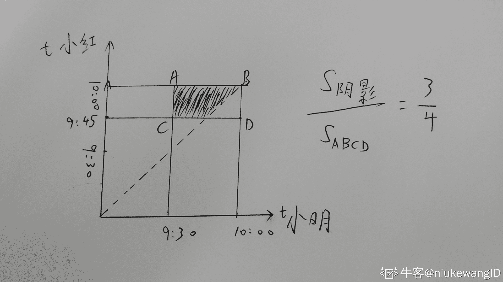

# 猿辅导 2020 校招笔试(算法岗一)

## 1

小明和小红约定一起去猿辅导参加面试，小明大概在 9:30-10:00 到达猿辅导，小红大概在 9:45-10:00 到达猿辅导，则小明比小红早到的概率为() 

正确答案: C   你的答案: 空 (错误)

```cpp
1/2
```

```cpp
2/3
```

```cpp
3/4
```

```cpp
4/5
```

本题知识点

算法工程师 猿辅导 2020

讨论

[1+½+¼+⅛+...](https://www.nowcoder.com/profile/481129516)

设小明在 9:30 后 x 分钟到达，小红在 9:30 后 y 分钟到达，则的面积/ 的面积即为概率。在直角坐标系画出图即可。

编辑于 2019-12-12 22:19:40

* * *

[牛客 792577683 号](https://www.nowcoder.com/profile/792577683)

(小明 9:30 - 9:45 到达的概率： 0.5) +( 小明 9:30 - 9:45 不到达的概率：0.5) * (小明 9:45 - 10:00 比小红早到的概率: 0.5)  = 0.5 + 0.5 * 0.5 = 3/4

发表于 2019-12-13 11:59:36

* * *

[niukewangID](https://www.nowcoder.com/profile/3668539)



发表于 2020-09-11 22:45:55

* * *

## 2

满足以下 3 个条件的 4 位数有多少个()条件 1: 不能包含 4 和 9 条件 2: 4 位数字都不同条件 3: 奇数

正确答案: D   你的答案: 空 (错误)

```cpp
672
```

```cpp
840
```

```cpp
800
```

```cpp
720
```

本题知识点

算法工程师 猿辅导 2020

讨论

[1+½+¼+⅛+...](https://www.nowcoder.com/profile/481129516)

4 位数可以选择的是 0、1、2、3、5、6、7、8 这八个数，最后一位只能是奇数，所以有，然后再从剩下的 7 个数选 3 个排列在前三位，所以是，但是可能会导致 0 在首位，要减去这些数，这些数的个数：首位是 0，最后一位只能是奇数，是，中间两位是

编辑于 2019-12-17 10:17:36

* * *

[零葬](https://www.nowcoder.com/profile/75718849)

不能包含 4，9，因此能从 0，1，2，3，5，6，7，8 这 8 个数中选择 4 位数出来，要为奇数，首先末尾得为奇数，因此 C(4,1)=4，而 0 不可以放在首位，因此从剩下的 6 个数中选一个放在首位 C(6,1)=6。首尾确定后再从剩下的 6 个数中选择 2 个 C(6,2)=15，并且这两个数全排列 A(2,2)=2。所以满足题意的数一共有：4*6*15*2 = 720 个

发表于 2020-10-20 11:56:59

* * *

[niukewangID](https://www.nowcoder.com/profile/3668539)

最低位只有 1，3，5，7，共 4 种，最高位不能有 4，9，0，减去末位，还有 6 种，第三位不能有 4，9，减去末位和第四位，还有 6 种，第二位不能有 4，9，减去末位，第四位，第三位，还有 5 种，相乘，4*6*6*5=720

发表于 2020-09-11 22:57:09

* * *

## 3

特征值分别为：

正确答案: C   你的答案: 空 (错误)

```cpp
-1, 0.6
```

```cpp
-1, 0.3
```

```cpp
1, 0.3
```

```cpp
1, 0.6
```

本题知识点

算法工程师 猿辅导 2020

讨论

[1+½+¼+⅛+...](https://www.nowcoder.com/profile/481129516)

选 c

编辑于 2019-12-12 22:13:10

* * *

[niukewangID](https://www.nowcoder.com/profile/3668539)


发表于 2020-09-11 23:02:22

* * *

## 4

假如使用一个较复杂的回归模型来拟合样本数据，使用岭回归，调试正则化参数 λ，来降低模型复杂度。若 λ 较大时，关于偏差（bias）和方差（variance），下列说法正确的是？

正确答案: C   你的答案: 空 (错误)

```cpp
若 λ 较大时，偏差减小，方差减小
```

```cpp
若 λ 较大时，偏差减小，方差增大
```

```cpp
若 λ 较大时，偏差增大，方差减小
```

```cpp
若 λ 较大时，偏差增大，方差增大
```

本题知识点

算法工程师 猿辅导 2020

讨论

[食堂在逃干饭王](https://www.nowcoder.com/profile/5786634)

正则化参数增大 -> 正则项大 -> 模型复杂度降低 -> 模型过拟合程度降低，欠拟合程度提高 -> 方差变小，偏差增大

发表于 2021-01-02 14:32:48

* * *

[cxy229](https://www.nowcoder.com/profile/868553)

c， 正则项变大，拟合能力变差，偏差变大，防过拟合，方差减小

发表于 2020-07-31 21:45:54

* * *

[yyyyyyy 歪在嘛](https://www.nowcoder.com/profile/923619073)

模型的拟合能力得到增强，偏差便会减小，但很有可能会由于拟合“过度”，从而对数据扰动更加敏感，导致方差增大。？？？？？？？是吗？

发表于 2020-07-28 11:25:10

* * *

## 5

包含 2019 个节点、先序遍历序列与中序遍历序列相同的二叉树共有( )棵。

正确答案: B   你的答案: 空 (错误)

```cpp
0
```

```cpp
1
```

```cpp
2
```

```cpp
2019
```

本题知识点

算法工程师 猿辅导 2020

讨论

[还是搞开发吧](https://www.nowcoder.com/profile/7719222)

先序遍历的规则：根左右
中序遍历的规则：左根右
要使得先序遍历和中序遍历的结果一样，这样的树必然是没有左孩子结点的。

编辑于 2020-04-15 22:09:14

* * *

[1+½+¼+⅛+...](https://www.nowcoder.com/profile/481129516)

除了叶子节点每个节点都只有右子树才符合题意
所以选 B

编辑于 2019-12-12 22:23:32

* * *

## 6

K(K>=3)个猿辅导的老师们在玩一个击鼓传花的小游戏。每击一次鼓，拿着花的老师要将花交给别人，不能留在自己手中。游戏开始前花在小猿手中，求击了 N 次鼓后，这朵花又回到小猿手中的方案数，请输出这个数模 1000000007 后的结果。

本题知识点

Java 工程师 C++工程师 iOS 工程师 安卓工程师 运维工程师 前端工程师 算法工程师 PHP 工程师 测试工程师 安全工程师 c#工程师 数据库工程师 大数据开发工程师 猿辅导 2020

讨论

[牛客 279810500 号](https://www.nowcoder.com/profile/279810500)

只能通过 70%,有没有大佬帮忙看看哪里出错了

```cpp
#include<iostream>
#include<vector>
using namespace std;
int main()
{
	long long n, k;
	cin >> n >> k;
	if (k < 3)return 0;
	vector<vector<long long>>dp(n + 1, vector<long long>(k + 1));
	dp[0][0] = 1;
	dp[0][1] = 0;
	for (long long i = 1; i <= n; i++)
	{
		dp[i][0] = dp[i - 1][1] % 1000000007;
		dp[i][1] = (dp[i - 1][0] * (k - 1)) % 1000000007 + (dp[i - 1][1] * (k - 2)) % 1000000007;
	}
	cout << dp[n][0] << endl;
	system("pause");
	return 0;
}
```

发表于 2020-06-02 21:56:42

* * *

[frostmonarch](https://www.nowcoder.com/profile/470566113)

需要用矩阵快速幂加上 DP.大家可以参考上面的 java 大佬的解答。首先，我们可以设计状态为 an,bn;an 代表我们传到第 n 个人了，且第 n 个人是小猿，那么此时有多少个方案。bn 代表我们传到第 n 个人了，且第 n 个人 不是 小猿，那么此时有多少个方案。那么 a[n]=b[n-1]因为此时第 n 个时刻已经固定好是小猿了，那么第 n-1 个时刻只能是其它人咯。b[n]=(k-1)*a[n-1]+(k-2)*b[n-1]这个就是说，我们第 n 个时刻，之和前面的一个时刻有关，当 n-1 个时刻是小猿的话，那么第 n 个位置有(k-1)种选择方法。当 n-1 个时刻不是小猿，那么我们第 n 个位置只有 k-2 种选择方法，因为我们不能选择小猿+(n-1)个时刻时候的那个人，其实就是简单的组合数学的思想。最后化简表达式，我们得到：a[n+1]=(k-1)*a[n-1]+(k-2)*a[n]
为了加快计算，我们需要用到矩阵乘法（别问为什么想到，这问 ACM 大佬）我们用矩阵表达上面的表达式：
结果是 Y[0][0].其中怎么计算矩阵的幂次，需要用到矩阵快速幂，要回矩阵快速幂先看看快速幂怎么实现的，然后再来学矩阵快速幂，这里不讨论矩阵快速幂怎么算了。 ```cpp
#include <bits/stdc++.h>
#define int long long
using namespace std;
const int MODN=1000000007;
vector<vector<int>>  mul(vector<vector<int>> &a,vector<vector<int>> &b){
    vector<vector<int>> ret(2,vector<int>(2,0));
    for(int i=0;i<2;i++)
        for(int j=0;j<2;j++)
            for(int k=0;k<2;k++)
                ret[i][j]+=a[i][k]*b[k][j],ret[i][j]%=MODN;
    return ret;
}
vector<vector<int>> quick_pow(vector<vector<int>> & mat,int n){
    vector<vector<int>> ret = {{1,0},{0,1}};
    while(n){
        if(n&1)ret=mul(ret,mat);
        mat=mul(mat,mat);
        n>>=1;
    }
    return ret;
}
int32_t main(){
    int n,k;cin>>n>>k;
    if(n==1)cout<<0<<endl;
    else if(n==2)cout<<k-1<<endl;
    else{
    vector<vector<int>> mat={{k-2,k-1},{1,0}};
    mat=quick_pow(mat,n-2);
    int ret=0;
    vector<int> mv={k-1,0};
    for(int i=0;i<2;i++)ret+=mat[0][i]*mv[i],ret%=MODN;
    cout<<ret<<endl;
    }
    return 0;
}
``` 

编辑于 2020-07-31 10:19:18

* * *

[1+½+¼+⅛+...](https://www.nowcoder.com/profile/481129516)

```cpp
import java.util.*;

public class Main{

    public static void main(String[] args){
        Scanner input;
        int N, K;

        input = new Scanner(System.in);
        while(input.hasNext()){
            N = input.nextInt();
            K = input.nextInt();
            System.out.println(new Main().Solution(N, K));
        }
    }

    private long Solution(int N, int K){
        int M;
        long[][] A, An;

        M = 1000000007;
        if(N == 1)
            return 0;
        if(N == 2)
            return K - 1;
        A = new long[][]{{K - 2, 1}, {K - 1, 0}};
        An = pow(A, N - 2);
        return An[0][0] * (K - 1) % M;
    }

    private long[][] pow(long[][] A, int n){
        Stack<Integer> stack;
        long[][] ans;

        stack = new Stack<>();
        ans = new long[][]{{1, 0}, {0, 1}};
        while(n > 0){
            stack.push(n % 2);
            n /= 2;
        }
        while(!stack.isEmpty()){
            multi(ans, ans);
            if(stack.pop() == 1)
                multi(ans, A);
        }
        return ans;
    }

    private void multi(long[][] A, long[][] B){
        long a00, a01, a10, a11;
        int M;

        M = 1000000007;
        a00 = (A[0][0] * B[0][0] + A[0][1] * B[1][0]) % M;
        a01 = (A[0][0] * B[0][1] + A[0][1] * B[1][1]) % M;
        a10 = (A[1][0] * B[0][0] + A[1][1] * B[1][0]) % M;
        a11 = (A[1][0] * B[0][1] + A[1][1] * B[1][1]) % M;
        A[0][0] = a00;
        A[0][1] = a01;
        A[1][0] = a10;
        A[1][1] = a11;
    }
}
```

发表于 2019-12-15 11:09:24

* * *

## 7

有一个 N*M 大小的迷宫矩阵，迷宫的每一个格子有一个数值（a[i][j] <10⁹）。小猿在迷宫中发现，它只能朝着上下左右四个方向的相邻格子前进，并且只能进入比当前位置数值更大的格子。但是小猿有个紧急呼救按钮，他可以通过按下按钮，强行进入到不满足数值大小要求的相邻格子，可惜这个按钮只能按 K 次。请问小猿从这个迷宫任选一个格子出发，在紧急呼救按钮的帮助下，最多能走多少步（开始位置计入步数，即站在起点是步数为 1）。

本题知识点

Java 工程师 C++工程师 iOS 工程师 安卓工程师 运维工程师 前端工程师 算法工程师 PHP 工程师 测试工程师 安全工程师 c#工程师 数据库工程师 大数据开发工程师 猿辅导 2020

讨论

[earthSaver](https://www.nowcoder.com/profile/975145700)

```cpp
#include<bits/stdc++.h>
using namespace std;
int n,m,k;
int matrix[502][502]{0};
int memo[502][502][12]{0};
int d[4][2]={{1,0},{0,1},{-1,0},{0,-1}};
bool inAera(int x,int y){
    return x>=0 && x<m && y>=0 && y<n;
}
int dfs(int x,int y,int k){
    if(memo[x][y][k]){
        return memo[x][y][k];
    }
    int count = 1;
    for(int i=0;i<4;i++){
        int new_x = x + d[i][0];
        int new_y = y + d[i][1];
        if(inAera(new_x,new_y)){
            if(matrix[x][y]<matrix[new_x][new_y]){
                count = max(count,dfs(new_x,new_y,k)+1);
            }else{
                if(k>0){
                    count = max(count,dfs(new_x,new_y,k-1)+1);
                }
            }
        }
    }
    memo[x][y][k] = count;
    return count;
}
int main(){
    cin>>m>>n>>k;
    for(int i=0;i<m;i++){
        for(int j=0;j<n;j++){
            cin>>matrix[i][j];
        }
    }
    int res = 0;
    for(int i=0;i<m;i++){
        for(int j=0;j<n;j++){
            res = max(res, dfs(i,j,k));
        }
    }
    cout<<res<<endl;
    return 0;
}
```

发表于 2020-07-25 13:35:45

* * *

[那天灯下的我](https://www.nowcoder.com/profile/426432237)

大致想法是广度优先遍历。每一个位置处可以向上下左右四个方向进行行走，此时分为两种情况：需要使用紧急呼救按钮和不需要使用紧急呼救按钮的情况。这两种情况在每一次尝试前进时是确定的。所以一个位置处可以行进的最大次数就是向其他四个方向尝试前进可以行进的最大次数中最多的情况再加一。可以采用递归的方法进行实现。为了加快运行速度，将每次计算完的结果存放到一个三维数组中，可以直接获取。第一次写，还希望大家多多指教。

```cpp
import java.util.*;
public class Main{

    static int N;
    static int M;
    static int K;
    static int[][] group;
    static int[][][] dp;

    public static void main(String[] args) {
        Scanner scanner = new Scanner(System.in);

        N = scanner.nextInt();
        M = scanner.nextInt();
        K = scanner.nextInt();

        group = new int[N][M];

        //存放计算过的最大次数的数组。
        dp = new int[N][M][K+1];

        for (int i = 0;i<N;i++){
            for (int j = 0;j<M;j++){
                group[i][j] = scanner.nextInt();
            }
        }

        int max = 0;
        for (int i = 0;i<N;i++){
            for (int j = 0;j<M;j++){
                int num = getNum(i,j,K);
                if(num > max){
                    max = num;
                }
            }
        }

        System.out.println(max);

    }

    public static int getNum(int x,int y,int k){
        if(k<0 || y<0 || x<0){  //越界判断
            return 0;
        }
        if(dp[x][y][k] != 0){   //已经计算过
            return dp[x][y][k];
        }
        int g1 = 0;
        int g2 = 0;
        int g3 = 0;
        int g4 = 0;

        //分别向上下左右四个方向进行尝试，需要判断是否用到紧急呼救按钮次数
        if(x-1 >= 0) {
            if(group[x-1][y] <= group[x][y]) {
                g1 = getNum(x-1,y,k-1);
            }
            else {
                g1 = getNum(x-1,y,k);
            }
        }

        if(y-1 >= 0) {
            if(group[x][y-1] <= group[x][y]) {
                g2 = getNum(x,y-1,k-1);
            }
            else {
                g2 = getNum(x,y-1,k);
            }
        }

        if(x+1 < N){
            if(group[x+1][y] <= group[x][y]) {
                g3 = getNum(x+1,y,k-1);
            }
            else {
                g3 = getNum(x+1,y,k);
            }
        }
        if(y+1 < M){
            if(group[x][y+1] <= group[x][y]) {
                g4 = getNum(x,y+1,k-1);
            }
            else {
                g4 = getNum(x,y+1,k);
            }
        }
        dp[x][y][k] = max(g1,g2,g3,g4) +1;
        return dp[x][y][k];
    }

    public static int max(int a,int b,int c,int d){
        if(a>=b && a>=c && a>=d){
            return a;
        }
        else if(b>=a && b>=c && b>=d){
            return b;
        }
        else if(c>=a && c>=b && c>=d){
            return c;
        }
        else {
            return d;
        }
    }

}

```

发表于 2020-07-24 00:50:28

* * *

[李栋吧](https://www.nowcoder.com/profile/4252174)

抄袭的楼下大哥

```cpp
import java.util.*;
public class Main{
    static int N,M,K;
    static int[][] group;
    static int[][][] dp;
    public static void main(String[] args){
        //第一行输入 N K M
        Scanner sc = new Scanner(System.in);    
        N = sc.nextInt();
        M = sc.nextInt();
        K = sc.nextInt();
        group = new int[N][M];
        //存放计算过的最大次数
        dp = new int[N][M][K+1];
        //输入 N*M   N 行，每行 M 个数，表示迷宫中每个格子的值。
        for(int i = 0;i < N ; i++){
            for(int j = 0; j < M;j++){
                group[i][j] = sc.nextInt();
            }
        }
        //开始计算 上下左右找一个最大值
        int max = 0;
        for(int i = 0; i < N;i++){
            for(int j = 0; j < M; j++){
                int res = getNum(i,j,K);
                if(res > max){
                    max = res;
                }
            }
        }
        System.out.println(max);         
    }
    //getNum()函数
    static int getNum(int i,int j,int k){
        //判断边界
        if(k < 0 || i < 0|| j < 0) return 0;
        //已经计算过
        if(dp[i][j][k] != 0) return dp[i][j][k];

        int g1 = 0,g2 = 0,g3 = 0,g4 = 0;
        //分别从上下左右四个方向进行尝试，需要判断是否用到 【按钮】
        //上
        if(i-1 >= 0){
            //需要用到钥匙
            if(group[i-1][j] <= group[i][j]){
                   g1 = getNum(i-1,j,k-1);
            }else{
                g1 = getNum(i-1,j,k);
            }
        }
        //下
        if(i+1 < N){
            //需要用到钥匙
           if(group[i+1][j] <= group[i][j]){
                   g2 = getNum(i+1,j,k-1);
            }else{
                g2 = getNum(i+1,j,k);
            }
        }
        //左
        if(j-1 >= 0){
            //需要用到钥匙
           if(group[i][j-1] <= group[i][j]){
                   g3 = getNum(i,j-1,k-1);
            }else{
                g3 = getNum(i,j-1,k);
            }
        }
        //右
         if(j+1 < M){
            //需要用到钥匙
           if(group[i][j+1] <= group[i][j]){
                   g4 = getNum(i,j+1,k-1);
            }else{
                g4 = getNum(i,j+1,k);
            }
        }
        dp[i][j][k] = maxValue(g1,g2,g3,g4) + 1;
        return dp[i][j][k];

    }
    //求四个数中的最大值
    public static int maxValue(int a,int b,int c,int d){
        if(a >= b && a >= c && a >= d){
            return a;
        } else if(b >= a && b >= c && b >= d){
            return b;
        } else if(c >= a && c >= b && c >= d) {
            return c;
        }else  {
            return d;
        }
    }

}

```

编辑于 2020-08-01 15:42:54

* * *

## 8

猿辅导 APP 需要下发一些宣传文本给学生，工程师们使用了一种字符压缩算法，为简单起见，假设被压缩的字符全部为大写字母序列，A,B,C,D....Z,压缩规则如下：1.AAAB 可以压缩为 A3B (单字符压缩不加括号)2.ABABA 可以压缩为(AB)2A （多字符串压缩才加括号）输入数据保证不会出现冗余括号，且表示重复的数字一定合法且大于 1，即不会出现：1.（A)2B   ------- （应为：A2B）2.  ((AB))2C,-----(应为：（AB)2C  )3\. （A)B  ----- （应为：AB）4.   A1B，（AB)1C，（应为 AB，ABC）注意：数字可能出现多位数即 A11B 或者(AB)10C 或者 A02 这种情况。A11B = AAAAAAAAAAAB(AB)10C = ABABABABABABABABABABCA02 = AA 数据分布：对于 60%的数据，括号不会出现嵌套，即不会有 ((AB)2C)2 这种结构。对于 80%的数据，括号最多只嵌套一层，即不会有 (((AB)2C)2D)99 这种结构。对于 100%的数据，括号可以嵌套任意层。

本题知识点

Java 工程师 C++工程师 iOS 工程师 安卓工程师 运维工程师 前端工程师 算法工程师 PHP 工程师 测试工程师 安全工程师 c#工程师 数据库工程师 大数据开发工程师 猿辅导 2020

讨论

[沙漠青鸟](https://www.nowcoder.com/profile/676560942)

编程语言：python3 方法：对于每一个待处理字符串，从左到右扫描整个字符串，构造一个列表 t 作为栈。每遇到一个左括号将 t 扩充一个字符串元素用来保存括号内的元素；每遇到一个右括号先找到其后的完整数字转为 int 后用 u 来保存，并 pop 出栈 t 最后新加的字符串元素且将此元素乘以 u 加入到 pop 后的 t 的最后一个元素中；每遇到一个数字时，将整个数字完整的找到后再把 t[-1][-1]乘以这个数字减 1 再并入 t[-1]中；每遇到一个普通字母时，只需将其直接并入 t[-1]。最后 t[0]即是 output。

```cpp
n=int(input())
st=[]
for i in range(n):
    st.append(input())

for s in st:
    t=['']
    j=0
    while j<len(s):
        if s[j]=='(':
            t.append('')
            j+=1
        elif s[j]==')':
            k=j+1
            j+=1
            while j<len(s) and ord(s[j])>=ord('0') and ord(s[j])<=ord('9'):
                j+=1
            u=int(s[k:j])
            v=t.pop()
            t[-1]+=v*u
        elif ord(s[j])>=ord('0') and ord(s[j])<=ord('9'):
            k=j
            j+=1
            while j<len(s) and ord(s[j])>=ord('0') and ord(s[j])<=ord('9'):
                j+=1
            u=int(s[k:j])
            t[-1]+=t[-1][-1]*(u-1)
        else:
            t[-1]+=s[j]
            j+=1
    print(t[0])
```

发表于 2020-04-02 20:17:31

* * *

[1+½+¼+⅛+...](https://www.nowcoder.com/profile/481129516)

```cpp
import java.util.*;

public class Main{
    public static void main(String[] args){
        Scanner input;
        int C, i;
        String[] strs;

        input = new Scanner(System.in);
        while(input.hasNext()){
            C = input.nextInt();
            strs = new String[C];
            for(i = 0; i < C; i++){
                strs[i] = input.next();
            }
            for(i = 0; i < C; i++){
                System.out.println(Solution(strs[i]));
            }
        }
    }

    private static String Solution(String str){
        StringBuilder ans;
        Stack<Integer> stack;
        int i, j, l;
        char c;

        ans = new StringBuilder();
        stack = new Stack<>();
        l = str.length();
        i = 0;
        while(i < l){
            c = str.charAt(i);
            if(c == '('){
                stack.push(ans.length());
                i++;
            }else if(c >= 'A' && c <= 'Z'){
                ans.append(c);
                i++;
            }else if(c >= '0' && c <= '9'){
                j = i;
                while(i < l && str.charAt(i) >= '0' && str.charAt(i) <= '9'){
                    i++;
                }
                ans.append(repeat(ans.substring(ans.length() - 1), Integer.parseInt(str.substring(j, i)) - 1));
            }else if( c == ')'){
                i++;
                j = i;
                while(i < l && str.charAt(i) >= '0' && str.charAt(i) <= '9'){
                    i++;
                }
                ans.append(repeat(ans.substring(stack.pop()), Integer.parseInt(str.substring(j, i)) - 1));
            }
        }
        return ans.toString();
    }

    private static String repeat(String str, int n){
        int i;
        StringBuilder ans;

        ans = new StringBuilder();
        for(i = 0; i < n; i++){
            ans.append(str);
        }
        return ans.toString();
    }
}
```

发表于 2019-12-15 11:05:55

* * *

[啊啊啊啊喵](https://www.nowcoder.com/profile/120711392)

```cpp
n = int(input())
temp = []
for i in range(n):
    temp.append(input())
for s in temp:
    temp0 = [] #[
    temp1 = '' #(HUN)
    temp2 = '' #ASDF
    n_temp = len(s)
    j=0
    while j < n_temp:
        if s[j] == '(':
            temp0 += s[j]
            j+=1
        elif s[j] == ')':
            temp0.pop()
            j+=1
        elif ord(s[j])>= ord('0') and ord(s[j])<=ord('9'):
            k=j
            j+=1
            if j<len(s) and ord(s[j])<=ord('9') and ord(s[j])>=ord('0'):
                j = j+1
            u = int(s[k:j])
            if len(temp1) != 0:
                temp2 += temp1*u
                temp1=''
            else:
                temp2 += temp2[-1]*(u-1)
        else:
            if len(temp0) == 0:
                temp2 += s[j]
                j += 1
            else:
                temp1 += s[j]
                j = j+1
    print(temp2)
```

python3 解法

发表于 2020-07-29 16:39:17

* * *