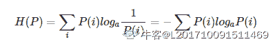
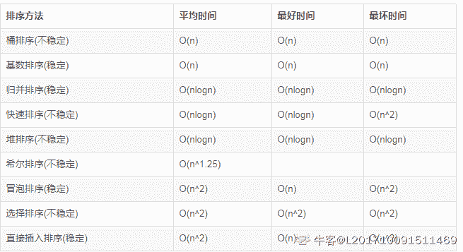
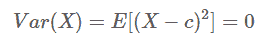
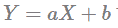
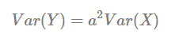
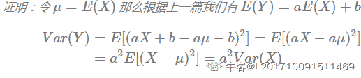

# 猿辅导 2020 校招笔试(算法岗二)

## 1

袋子里面有 4 枚硬币，其中有 1 枚不均衡的硬币，其正反面朝上的概率分别为 1/4, 3/4，剩下的 3 枚为均衡硬币，正反面朝上的概率都为 1/2，现在从袋子里面随机选取一枚硬币，连续抛 2 次，结果 2 次都是正面朝上，请问刚才随机选取到的硬币为不均衡硬币的概率是多少？

正确答案: A   你的答案: 空 (错误)

```cpp
1/13
```

```cpp
1/12
```

```cpp
1/5
```

```cpp
1/4
```

本题知识点

算法工程师 猿辅导 2020

讨论

[梦想不会远](https://www.nowcoder.com/profile/347091580)

1/4 的概率抽到不均匀的硬币，用它得到两次正的概率是 1/4*1/4，所以整个事件(记为 A)的概率是 1/4*1/4*1/4。3/4 的概率抽到均匀硬币，用它得到两次正的概率是 1/2*1/2，所以整个事件(记为 B)的概率是 3/4*1/2*1/2。P(A) / (P(A) + P(B))就是答案。

发表于 2020-07-31 13:38:20

* * *

[1+½+¼+⅛+...](https://www.nowcoder.com/profile/481129516)


发表于 2019-12-23 14:07:14

* * *

[L201710091511469](https://www.nowcoder.com/profile/1515815)


发表于 2019-12-18 15:53:24

* * *

## 2

从 1，2，3，4，5，6，7，8，9 这 9 个数字中，选出 3 个不同的数字，其和为偶数的组合有()个

正确答案: B   你的答案: 空 (错误)

```cpp
40
```

```cpp
44
```

```cpp
48
```

```cpp
52
```

本题知识点

算法工程师 猿辅导 2020

讨论

[L201710091511469](https://www.nowcoder.com/profile/1515815)

两种情况，两奇一偶和三偶，

发表于 2019-12-18 15:59:06

* * *

## 3

已知一个算术表达式的中缀形式为 A+B*C-D/E,后缀形式为 ABC*+DE/-,其前缀形式为()

正确答案: D   你的答案: 空 (错误)

```cpp
-A+B*C/DE
```

```cpp
-A+B*CD/E
```

```cpp
-+*ABC/DE
```

```cpp
-+A*BC/DE
```

本题知识点

算法工程师 猿辅导 2020

讨论

[L201710091511469](https://www.nowcoder.com/profile/1515815)

中缀根据运算符加括号(（A+(B*C)）-(D/E))  ，把运算符依次提取到对应括号前面，去除括号 ，得到前缀

发表于 2019-12-18 16:37:24

* * *

[AmazingM](https://www.nowcoder.com/profile/8649410)

表达式看作二叉树，运算符是中间节点，字母是叶子节点。根据中序遍历和后序遍历还原二叉树，前序遍历就是最终结果

发表于 2020-07-31 19:11:53

* * *

## 4

关于 KL 散度，以下哪种说法是正确的

正确答案: D   你的答案: 空 (错误)

```cpp
KL 散度是对称的
```

```cpp
KL 散度越大，两个分布越相似
```

```cpp
KL 散度取值范围为[-1,1]
```

```cpp
如果, , , 那么 
```

本题知识点

算法工程师 猿辅导 2020

讨论

[L201710091511469](https://www.nowcoder.com/profile/1515815)

```cpp
KL 散度是非对称的、散度越小分布越近似、非负
```

发表于 2019-12-18 16:56:31

* * *

## 5

以下是目标变量在训练集上的 9 个实际值 [0,0,0,0,1,1,1,1,1]，目标变量的熵是（）

正确答案: B   你的答案: 空 (错误)

```cpp

```

```cpp

```

```cpp

```

本题知识点

算法工程师 猿辅导 2020

讨论

[L201710091511469](https://www.nowcoder.com/profile/1515815)



发表于 2019-12-18 17:02:59

* * *

## 6

下列哪种排序算法的最坏时间复杂度与平均时间复杂度不同？

正确答案: B   你的答案: 空 (错误)

```cpp
冒泡排序
```

```cpp
快速排序
```

```cpp
归并排序
```

```cpp
堆排序
```

本题知识点

算法工程师 猿辅导 2020

讨论

[1+½+¼+⅛+...](https://www.nowcoder.com/profile/481129516)

在数组本身有序的情况下，快速排序的时间复杂度最差，为

发表于 2019-12-23 16:32:25

* * *

[L201710091511469](https://www.nowcoder.com/profile/1515815)



O(n)这样的标志叫做渐近时间复杂度,是个近似值.各种渐近时间复杂度由小到大的顺序如下

O(1) < O(logn) < O(n) < O(nlogn) < O(n²) < O(n³) < O(2^n) < O(n!) < O(n^n)

编辑于 2019-12-18 17:05:47

* * *

## 7

给定 n 个整数{,, ..., }，当 y 是这 n 个整数的（ ）时，损失函数最小。

正确答案: A   你的答案: 空 (错误)

```cpp
中位数
```

```cpp
众数
```

```cpp
平均数
```

```cpp
其他选项都不对
```

本题知识点

算法工程师 猿辅导 2020

讨论

[刘文超 201909271409691](https://www.nowcoder.com/profile/758250575)

首先，排序不会对损失本身造成影响，则排列元素为正序则，
令，
则有 ，即为中位数

发表于 2019-12-12 17:46:02

* * *

## 8

一个随机变量 x 的方差是 n，那么随机变量 y = 2x + 3 的方差是（）

正确答案: D   你的答案: 空 (错误)

```cpp
n
```

```cpp
2n
```

```cpp
2n + 3
```

```cpp
4n
```

本题知识点

算法工程师 猿辅导 2020

讨论

[1+½+¼+⅛+...](https://www.nowcoder.com/profile/481129516)


发表于 2019-12-23 16:31:14

* * *

[L201710091511469](https://www.nowcoder.com/profile/1515815)



[`face2ai.com/Math-Probability-4-3-Variance/`](https://face2ai.com/Math-Probability-4-3-Variance/)
 编辑于 2019-12-18 17:27:50

* * *

## 9

二项式分布的共轭先验分布是（）

正确答案: D   你的答案: 空 (错误)

```cpp
高斯分布
```

```cpp
多项式分布
```

```cpp
泊松分布
```

```cpp
贝塔分布
```

本题知识点

算法工程师 猿辅导 2020

## 10

以下哪种方法会增加模型的欠拟合风险？

正确答案: D   你的答案: 空 (错误)

```cpp
添加新特征
```

```cpp
增加模型复杂度
```

```cpp
减小正则化系数
```

```cpp
数据增强
```

本题知识点

算法工程师 猿辅导 2020

讨论

[cxy229](https://www.nowcoder.com/profile/868553)

过拟合和欠拟合是矛盾的，数据增强避免过拟合，增大了欠拟合风险

发表于 2020-08-01 12:30:14

* * *

[倒霉熊不倒霉](https://www.nowcoder.com/profile/191090399)

ze 增加特征可以提高模型相关性，改善欠拟合

发表于 2020-02-19 19:36:09

* * *

## 11

猿辅导老师在直播课上和同学们做游戏，让同学们在聊天区报自己的学号，每报一次可以获得一个礼物。但是老师不给报数次数超过了一定的次数的同学发礼物。现在请你来帮助老师把聊天区的报数数列处理一下。规定，当发现某个数大于 m 次时，则认定为报数过多，我们需要得到去除这些学生的报数后的报数数列。

本题知识点

算法工程师 猿辅导 2020

讨论

[楼非楼](https://www.nowcoder.com/profile/145096710)

```cpp
class Solution:
    def remove_count(self, n, m, arr):
        if not arr&nbs***bsp;m <= 0:
            return
        dic = {}
        for i in range(n):
            if arr[i] not in dic:
                dic[arr[i]] = 1
            else:
                dic[arr[i]] += 1
        res = []
        for value in arr:
            if dic[value] <= m:
                res.append(value)
        return res

s = input().strip()
n, m = int(s.split()[0]), int(s.split()[1])
s = input().strip()
arr = [int(x) for x in s.split()]
solution = Solution()
res = solution.remove_count(n, m, arr)
print(" ".join(str(x) for x in res))
```

发表于 2020-08-28 17:19:49

* * *

[小太阳的牛客](https://www.nowcoder.com/profile/8474295)

#include <iostream>#include<vector>
#include<unordered_map>
using namespace std;
int main()
{
    int n,m;
    cin>>n>>m;
    int arr[n+1];
    for (int i=0;i<n;i++)
        cin>>arr[i];
    unordered_map<int,int> hashMap;
    for(int i=0;i<n;i++)
    {
        hashMap[arr[i]]++;
    }
    for(int i=0;i<n;i++){
        if(hashMap[arr[i]]<=m && hashMap[arr[i]]!=0)
            cout << arr[i] << ' ';
    }
}

发表于 2020-08-17 20:52:17

* * *

[小菜鸡 2222](https://www.nowcoder.com/profile/547861820)

```cpp
N, M = list(map(int, input().split(" ")))
li = list(map(int, input().split(" ")))
dictli = {}
for i, item in enumerate(li):
    dictli[item] = dictli.get(item, 0) + 1

for i, item in enumerate(li):
    if dictli[item] > M:
        continue
    else:
        print(item, end=" ")
```

发表于 2020-07-30 10:53:50

* * *

## 12

小猿有一台打字机，只能打出‘A’、‘B’、‘C’三种字符。某天，小猿打了一段长度为 N 的字符串 1，然后发现可以通过打字机的快捷操作来快速改写字符串。已知一次快捷操作必须同时改写 K 个不同位置的字符，且被改写的字符必须改成打字机可以打出的其他字符。例如，K=2 时，"AB"可以被改写为"CA"，也可以被改写为"BC"，但不可以被改写为"AA"(必须恰好改写 K 个字符)或"EF"。可以请问通过 M 次快捷操作，能有多少种将字符串 1 改写为目标字符串 2 的方案？输出方案数对 1000000007 取模的结果。

本题知识点

算法工程师 猿辅导 2020

讨论

[牛客 540714280 号](https://www.nowcoder.com/profile/540714280)

```cpp
#include<iostream>
#include<string>
using namespace std;
const int f=1000000007;
long long dp[105][105]={0}, C[105][105], pow2[105];
int ct_same(string s1, string s2){
    int ans=0;
    for(int i=0;i<s1.length();i++){
        if(s1[i]==s2[i])ans++;
    }
    return ans;
}
void makeC(int N){
    int mid;
    for(int i=0;i<=N;i++)C[i][0]=1;
    for(int i=1;i<=N;i++){
        mid=i/2;
        for(int j=1;j<=i;j++){
            if(j<=mid) C[i][j] = C[i-1][j-1] * i / j;
            else C[i][j] = C[i][i-j];
        }
    }
}
void make_pow2(int N){
    long long t=1;
    for(int i=0;i<=N;i++){
        pow2[i]=t;
        t = (2*t) % f;
    }
}
int main(){
    int N, M, K;
    cin>>N>>M>>K;
    string s1, s2;
    cin>>s1>>s2;
    int Ns=ct_same(s1, s2);
    makeC(N);
    make_pow2(N);
    dp[1][N-K]=1;
    for(int m=2;m<=M;m++){
        for(int n=0;n<=N;n++){
            long long sum=0, t;
            int K1=max(0, K-N+n), K2=min(K, n);
            for(int i=K1;i<=K2;i++){
                for(int j=0;j<=K-i;j++){
                    t=pow2[i];
                    t = (t * C[n][i]) % f;
                    t = (t * C[N-n][K-i]) % f;
                    t = (t * C[K-i][j]) % f;
                    t = (t * dp[m-1][n+K-2*i-j]) % f;
                    sum = (sum + t) % f;
                }
            }
            dp[m][n]=sum;
        }
    }
    cout<<dp[M][Ns];
    return 0;
}
```

 发表于 2020-08-01 13:34:56

* * *

[嘀嘀复嘀嘀](https://www.nowcoder.com/profile/2916739)

```cpp
//参考内容 https://segmentfault.com/a/1190000021780192 //动态规划递推公式 #include<iostream>
(720)#include<vector>
#include<queue>
(789)#include<string>
#include<functional>
(1307)#define LL long long
using namespace std;
int main() {
    LL n, m, k;
    cin >> n >> m >> k;
    string s1, s2;
    cin >> s1 >> s2;
    int cnt = 0;
    for (int i = 0; i < n; i++)
    {
        if (s1[i] == s2[i])cnt++;
    }
    if (k == 0)
    {
        if (s1.compare(s2) == 0)
            cout << "1" << endl;
        else cout << "0" << endl;
        return 0;
    }
    int mod = 1e9 + 7;
    vector<vector<LL>>C(n + 1, vector<LL>(n + 1, 0));
    vector<vector<LL>>change(n + 1, vector<LL>(n + 1, 0));//the coefficient of change[a-i+j] to change[a]
    //change 用来记录系数
        //C[n][m]为组合数， C(n, m)
        //mi[n] = 1<<n-1;
        vector<LL>mi;
    mi.push_back(1);
    for (int i = 0; i <= k; i++)
    {
        mi.push_back(mi.back() % mod << 1);
        //cout << mi.back() << endl;
    }
    for (int i = 0; i < n + 1; i++)
        C[i][0] = 1;
    for (int i = 1; i < n + 1; i++)
    {
        for (int j = 1; j <= i; j++)
        {
            C[i][j] = C[i - 1][j] + C[i - 1][j - 1];
            C[i][j] %= mod;
        }
    }
    for (int a = 0; a <= n; a++)
    {
        for (int i = 0; i <= k; i++)
        {
            int tmp = mi[i] * C[a][i] % mod * C[n - a][k - i] % mod;
            for (int j = 0; j <= k - i; j++)
            {
                if (a - i + j >= 0 && a - i + j <= n)
                    change[a][a - i + j] = (tmp*C[k - i][j]+change[a][a - i + j]) % mod;
            }
        }
    }
    vector<int>ans(n + 1, 0), mm;//由于每一次快捷操作只和上一次结果有关，故降至一维
    ans[n] = 1;
    while (m--)
    {
        mm.clear();
        for (int i = 0; i <= n; i++)
        {
            int tmp = 0;
            for (int j = 0; j <= n; j++)
            {
                tmp = (change[i][j] * ans[j]+tmp) % mod;
            }
            mm.push_back(tmp);
        }
        ans = mm;
    }

    cout << ans[cnt] << endl;
} 
```

发表于 2020-03-04 10:09:59

* * *

## 13

猿辅导课堂上老师提供了一些角色，学生可以从中选择一个自己喜欢的角色扮演，每 3 个不同的角色就可以组成一个小组，进行分组对话。当老师点击开始分组对话按钮的时候，服务器会为已经选择自己角色的同学分配对话小组，请问最多能组成多少个对话小组？

本题知识点

算法工程师 猿辅导 2020

讨论

[1+½+¼+⅛+...](https://www.nowcoder.com/profile/481129516)

```cpp
//贪心算法+优先队列/堆
import java.util.*;

public class Main{
    public static void main(String[] args){
        Scanner input;
        int C, T, i, j;
        int[][] P;

        input = new Scanner(System.in);
        C = input.nextInt();
        P = new int[C][];
        for(i = 0; i < C; i++){
            T = input.nextInt();
            P[i] = new int[T];
            for(j = 0; j < T; j++){
                P[i][j] = input.nextInt();
            }
        }
        for(i = 0; i < C; i++){
            System.out.println(Solution(P[i]));
        }
        input.close();
    }

    private static int Solution(int[] P){
        int first, second, third, ans;
        PriorityQueue<Integer> pq;

        ans = 0;
        pq = new PriorityQueue<>((a, b) -> b - a);
        for(int p : P){
            if(p > 0){
                pq.offer(p);
            }
        }
        while(pq.size() > 2){
            first = pq.poll();
            second = pq.poll();
            third = pq.poll();
            if(--first > 0){
                pq.offer(first);
            }
            if(--second > 0){
                pq.offer(second);
            }
            if(--third > 0){
                pq.offer(third);
            }
            ans++;
        }
        return ans;
    }
}
```

发表于 2019-12-23 16:19:08

* * *

[牛客 562496337 号](https://www.nowcoder.com/profile/562496337)

#include<iostream>
#include<queue>
#include<vector>
#include<algorithm>
using  namespace std;
int fun(priority_queue<int,vector<int>,less<int>> pq){
 if(pq.size()<3)
  return 0;
 int ret=0;
 while(pq.size()>2){
  int first= pq.top();
  pq.pop();
  int second= pq.top();
  pq.pop();
  int third= pq.top();
  pq.pop();
  if(--first>0)
   pq.push(first);
  if(--second>0)
   pq.push(second);
  if(--third>0)
   pq.push(third);
  ret++;
 }
 return ret;
}
int main(){
 int n;
 cin>>n;
 while(n--){
  int c;
  cin>>c;
  priority_queue<int,vector<int>,less<int>> pq;
  while(c--){
   int a;
   cin>>a;
   if(a>0)
    pq.push(a);
  }
  int ret=fun(pq);
  cout<<ret<<endl; }
 return 0;
} 发表于 2020-09-01 18:14:41

* * *

[牛客 764442872 号](https://www.nowcoder.com/profile/764442872)

大家帮我看看哪里错了呢？通过率百分之 0？

```cpp
import heapq
c = int(input())
ans = []
for i in range(c):
    istr = input()
    nums = list(map(int, istr.split()))
    num = [-x for x in nums[1:] if x>0]
    #print (num)
    heapq.heapify(num)
    #print (num)
    count = 0

    while (len(num)>2):
        tmp = []
        for j in range(3):
            tmpi = heapq.heappop(num)
            if -tmpi>1:
                tmp.append(tmpi+1)
        count += 1
        for tmpi in tmp:
            heapq.heappush(num, tmpi)
    print (count)
```

发表于 2020-08-02 01:01:27

* * *</iostream>