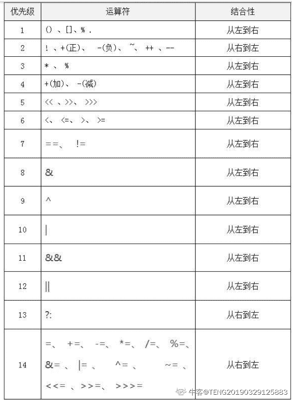

# 搜狐畅游 2020 校招笔试 - JAVA 开发工程师

## 1

以下四款游戏中，哪一款更有可能是 TapTap 上评分达到 8.0 以上的手游？

正确答案: A   你的答案: 空 (错误)

```cpp
流言侦探
```

```cpp
Apex 英雄
```

```cpp
蓝月传奇
```

```cpp
一起来捉妖
```

本题知识点

设计 搜狐畅游 数据库工程师 Java 工程师 财务 游戏策划 数据分析师 项目经理 C++工程师 市场 用户研究员 游戏研发工程师 运维工程师 游戏运营 2020 2021

讨论

[李 danran](https://www.nowcoder.com/profile/5363114)

```cpp
Apex 英雄目前评分 8.9 -2020.1.8
```

发表于 2020-01-08 16:27:37

* * *

[Ankh_L](https://www.nowcoder.com/profile/4545347)

虽然前面大多数都知道,但是这真的是 JAVA 开发工程师的题目吗😓

发表于 2020-03-24 15:04:49

* * *

[Asunaの楠世](https://www.nowcoder.com/profile/183417247)

apex 不是手游啊！一刀 999 就不用提了，捉妖是抄袭宝可梦 GO，即使没听过第一个排除法这也做出来了

发表于 2020-03-21 18:39:44

* * *

## 2

以下哪款游戏不是当下主流的电子竞技项目？

正确答案: C   你的答案: 空 (错误)

```cpp
英雄联盟
```

```cpp
CS.GO
```

```cpp
崩坏 3
```

```cpp
王者荣耀
```

本题知识点

设计 搜狐畅游 数据库工程师 Java 工程师 财务 游戏策划 数据分析师 项目经理 C++工程师 市场 用户研究员 游戏研发工程师 运维工程师 游戏运营 2020 2021

讨论

[xq7012](https://www.nowcoder.com/profile/717756269)

天啊 CSGO 都是主流了吗（狗头

发表于 2020-03-24 23:41:59

* * *

[Coder-Star](https://www.nowcoder.com/profile/1408953)

123

发表于 2021-11-04 19:02:46

* * *

[彩贺琴](https://www.nowcoder.com/profile/573873479)

崩坏 3 是 ACT 手游，别信楼下

发表于 2020-09-08 17:06:17

* * *

## 3

如下四款手机游戏中，哪款游戏类型和其他三款不一样？

正确答案: D   你的答案: 空 (错误)

```cpp
我叫 MT
```

```cpp
小冰冰传奇
```

```cpp
皇室战争
```

```cpp
决战平安京
```

本题知识点

设计 搜狐畅游 数据库工程师 Java 工程师 财务 游戏策划 数据分析师 项目经理 C++工程师 市场 用户研究员 游戏研发工程师 运维工程师 游戏运营 2020

讨论

[某只锦鲤](https://www.nowcoder.com/profile/362915100)

决战平安京：《阴阳师》IP 公平竞技对战 MOBA 手游皇室战争：即时策略、MOBA 以及卡牌等元素手游小冰冰传奇：卡牌类手机游戏我叫 MT：3DMMORPG 手游

发表于 2020-03-19 15:07:37

* * *

## 4

以下哪款游戏不属于 FPS 类游戏的范畴？

正确答案: C   你的答案: 空 (错误)

```cpp
CS 1.6
```

```cpp
雷神之锤
```

```cpp
地下城与勇士
```

```cpp
逆战
```

本题知识点

设计 搜狐畅游 数据库工程师 Java 工程师 财务 游戏策划 数据分析师 项目经理 C++工程师 市场 用户研究员 游戏研发工程师 运维工程师 游戏运营 2020 营销 2021

讨论

[知悉者也](https://www.nowcoder.com/profile/111682374)

fps 在这里表示[第一人称射击游戏](https://zh.wikipedia.org/wiki/%E7%AC%AC%E4%B8%80%E4%BA%BA%E7%A7%B0%E5%B0%84%E5%87%BB%E6%B8%B8%E6%88%8F)（First Person Shooter），除了 DNF【地下城与勇士】外，其他 3 个选项都是 FPS 游戏

发表于 2019-12-22 11:20:27

* * *

[某只锦鲤](https://www.nowcoder.com/profile/362915100)

地下城与勇士：角色扮演 2d 游戏

发表于 2020-03-19 15:09:38

* * *

## 5

以下哪款产品不是家用电视类主机？

正确答案: B   你的答案: 空 (错误)

```cpp
Xbox One
```

```cpp
PSP
```

```cpp
PS4
```

```cpp
wii
```

本题知识点

设计 搜狐畅游 数据库工程师 Java 工程师 财务 游戏策划 数据分析师 项目经理 C++工程师 市场 用户研究员 游戏研发工程师 运维工程师 游戏运营 2020 2021

讨论

[宇空·零](https://www.nowcoder.com/profile/200053465)

psp 是掌机

发表于 2020-01-06 14:37:53

* * *

[江居士](https://www.nowcoder.com/profile/956646736)

PSP 是掌上游戏机

发表于 2020-09-22 16:20:12

* * *

## 6

以下哪款游戏属于国创 IP 衍生游戏？

正确答案: B   你的答案: 空 (错误)

```cpp
一拳超人
```

```cpp
斗破苍穹
```

```cpp
Love Live
```

```cpp
精灵宝可梦
```

本题知识点

设计 搜狐畅游 数据库工程师 Java 工程师 游戏策划 数据分析师 项目经理 C++工程师 用户研究员 游戏研发工程师 运维工程师 游戏运营 2020 2021

讨论

[最爱小怪兽](https://www.nowcoder.com/profile/193667259)

三十年河东，三十年河西，莫欺少年穷

发表于 2020-04-19 20:45:57

* * *

[白驹过隙、](https://www.nowcoder.com/profile/7052607)

d

发表于 2020-01-03 15:56:22

* * *

## 7

以下哪款不属于《魔兽世界》的资料片？

正确答案: B   你的答案: 空 (错误)

```cpp
燃烧的远征
```

```cpp
虚空之遗
```

```cpp
争霸艾泽拉斯
```

```cpp
巫妖王之怒
```

本题知识点

设计 搜狐畅游 数据库工程师 Java 工程师 游戏策划 数据分析师 项目经理 C++工程师 用户研究员 游戏研发工程师 运维工程师 游戏运营 2020 2021

讨论

[上岸吧兄 dei](https://www.nowcoder.com/profile/646722939)

 魔兽世界 1.0 
魔兽世界：战场争锋 1.5 
魔兽世界：进百军黑翼之巢 1.6 
魔兽世界：血神的复苏 1.7 
魔兽世界：噩度梦之龙 1.8 
魔兽世界：安其拉之门 1.9 
魔兽世界：勇者归来 1.10 
魔兽世界：纳克萨玛斯之影 1.11 
魔兽世界：战鼓震问天 1.12 
魔兽世界答：燃烧的远征 (A)
魔兽世界：风暴前夕 2.0 
魔兽世界：黑暗神殿 2.1 
魔兽世界：祖阿曼 2.3 
魔兽世界：太专阳之井 2.4 
魔兽世界：巫妖王之怒 (D)
魔兽世界：末日的回响 3.0 
魔兽世界：奥杜属尔的秘密 3.1 
魔兽世界：北伐的召唤 3.2 
魔兽世界：巫妖王的陨落 3.3
魔兽世界：末日浩劫 4.0 
魔兽世界：海加尔**4.1

2018 年 8 月 14 日《魔兽世界：争霸艾泽拉斯》正式上线 （C)[`zhidao.baidu.com/question/1859962154886422707.html`](https://zhidao.baidu.com/question/1859962154886422707.html) 

发表于 2020-04-12 04:06:34

* * *

[Sayuyu](https://www.nowcoder.com/profile/694690141)

[虚空之遗是即时战略游戏《星际争霸Ⅱ》的资料片](http://www.baidu.com/link?url=h4-OD7UP001JPqeXeF04cKuMDrqpsdpMdfMdKR1POJR93WZKuQECtm6gmkvYpTEtmrJXWi7vpYAvM4puHF4grqelEG-BKWCjNZwJykYdHPPzhc9h7mnggunC4q7w2YtwJe8kfcdfelK6IZRBpsqcT5YpPXMG7CtkdRgyUQLWy4xCA9n5aA8EOsxYq-dx9YUbwKUfA0iyUivVdq7a4boRTM8ONbMY-492cmczLw49a-gC94IrIqTKwVPorAgvDzqoM_U7lux_fKfBKhOtVcOFm9hl_K8BGEFgrb7M3L6jhTq)

发表于 2021-03-20 11:28:41

* * *

## 8

手游天龙八部 3D 的游戏类型是？

正确答案: D   你的答案: 空 (错误)

```cpp
ARPG
```

```cpp
SLG
```

```cpp
RTS
```

```cpp
MMORPG
```

本题知识点

设计 搜狐畅游 数据库工程师 Java 工程师 游戏策划 数据分析师 项目经理 C++工程师 用户研究员 游戏研发工程师 运维工程师 游戏运营 2020

讨论

[布鲁布鲁冒泡泡](https://www.nowcoder.com/profile/805954332)

ARPG（Action Role Playing Game）：动作角色扮演类游戏中

MMORPG（ Massive Multiplayer Online Role-Playing Game）：大型多人在线角色扮演游戏

SLG（Simulation Game）：策略游戏

RTS（Real-Time Strategy Game）：即时战略游戏，是策略游戏（Strategy Game）的一种

发表于 2020-02-21 22:40:51

* * *

[hugo201903151851484](https://www.nowcoder.com/profile/437092911)

ARPG（Action Role Playing Game），游戏术语，意思是动作角色扮演类游戏中，角色的动作（特别是攻击动作）与操作（如点击鼠标）相关的动作。 MMORPG，是英文 Massive（或 Massively）Multiplayer Online Role-PlayingGame 的缩写。

发表于 2020-01-18 15:41:55

* * *

## 9

以下哪款游戏不属于 Steam 平台？

正确答案: A   你的答案: 空 (错误)

```cpp
暗黑破环神
```

```cpp
Dota2
```

```cpp
彩虹六号
```

```cpp
绝地求生
```

本题知识点

设计 搜狐畅游 数据库工程师 Java 工程师 游戏策划 数据分析师 项目经理 C++工程师 用户研究员 游戏研发工程师 运维工程师 游戏运营 2020 2021

讨论

[暖风先生](https://www.nowcoder.com/profile/7155258)

暗黑是暴雪的

发表于 2020-02-29 20:54:50

* * *

## 10

以下属于 ARPG 类型的游戏是？

正确答案: C   你的答案: 空 (错误)

```cpp
海岛奇兵
```

```cpp
王者荣耀
```

```cpp
地下城与勇士
```

```cpp
皇室战争
```

本题知识点

设计 搜狐畅游 数据库工程师 Java 工程师 游戏策划 数据分析师 项目经理 C++工程师 用户研究员 游戏研发工程师 运维工程师 游戏运营 2020

讨论

[P-ShineBeam](https://www.nowcoder.com/profile/945440246)

ARPG（Action Role Playing Game），游戏术语，意思是动作角色扮演类游戏中，角色的动作（特别是攻击动作）与操作（如点击鼠标）相关的动作。

发表于 2020-02-17 18:46:07

* * *

## 11

SLG 是指以下哪种游戏类型？

正确答案: D   你的答案: 空 (错误)

```cpp
即时战略游戏
```

```cpp
第一人称设计游戏
```

```cpp
多人在线战术竞技游戏
```

```cpp
模拟战略游戏
```

本题知识点

设计 搜狐畅游 数据库工程师 Java 工程师 财务 游戏策划 数据分析师 项目经理 C++工程师 市场 用户研究员 游戏研发工程师 运维工程师 游戏运营 2020 营销 2021 运营

讨论

[布鲁布鲁冒泡泡](https://www.nowcoder.com/profile/805954332)

ARPG（Action Role Playing Game）：动作角色扮演类游戏

MMORPG（ Massive Multiplayer Online Role-Playing Game）：大型多人在线角色扮演游戏

SLG（Simulation Game）：策略游戏、模拟战略游戏

RTS（Real-Time Strategy Game）：即时战略游戏，是策略游戏（Strategy Game）的一种

FPS（First Person Shooting 第一人称射击游戏）

发表于 2020-02-21 22:47:05

* * *

## 12

英雄联盟的开发商 Riot 被哪家公司收购？

正确答案: A   你的答案: 空 (错误)

```cpp
腾讯
```

```cpp
畅游
```

```cpp
盛趣
```

```cpp
完美世界
```

本题知识点

设计 搜狐畅游 数据库工程师 Java 工程师 财务 游戏策划 数据分析师 项目经理 C++工程师 市场 用户研究员 游戏研发工程师 运维工程师 游戏运营 2020 2021

讨论

[追寻原风景](https://www.nowcoder.com/profile/860792)

拳头公司

发表于 2020-06-22 23:28:15

* * *

## 13

谷歌人工智能团队 Deepmind 在开发围棋 AI AlphaGo 之后
，又针对哪款游戏开发了 AI？

正确答案: B   你的答案: 空 (错误)

```cpp
Dota2
```

```cpp
星际争霸 2
```

```cpp
英雄联盟
```

```cpp
皇室战争
```

本题知识点

设计 搜狐畅游 数据库工程师 Java 工程师 财务 游戏策划 数据分析师 项目经理 C++工程师 市场 用户研究员 游戏研发工程师 运维工程师 游戏运营 2020 2021

讨论

[卡咔咯咖](https://www.nowcoder.com/profile/908179179)

DOTA2 是 OPEN-AI，与谷歌团队无关

发表于 2020-03-31 14:28:01

* * *

## 14

RTS 是以下哪一类游戏的简称？

正确答案: A   你的答案: 空 (错误)

```cpp
即时战略游戏
```

```cpp
模拟战略游戏
```

```cpp
大型多人在线游戏
```

```cpp
策略卡牌游戏
```

本题知识点

设计 搜狐畅游 数据库工程师 Java 工程师 财务 游戏策划 数据分析师 项目经理 C++工程师 市场 用户研究员 游戏研发工程师 运维工程师 游戏运营 2020

讨论

[小啊啾会发光](https://www.nowcoder.com/profile/833120440)

Real-time strategy game 即时战略游戏

发表于 2020-03-03 10:46:12

* * *

## 15

《魔兽世界》的现付费模式是？

正确答案: C   你的答案: 空 (错误)

```cpp
点卡付费
```

```cpp
免费下载道具付费
```

```cpp
月卡付费
```

```cpp
点卡道具双收费
```

本题知识点

设计 搜狐畅游 数据库工程师 Java 工程师 财务 游戏策划 数据分析师 项目经理 C++工程师 市场 用户研究员 游戏研发工程师 运维工程师 游戏运营 2020 2021

讨论

[这是一只熊猫](https://www.nowcoder.com/profile/226309918)

我记得 wow 推出游戏内购了呀

发表于 2020-04-26 17:18:23

* * *

## 16

下列对常用电器节电的说法不成立的是

正确答案: D   你的答案: 空 (错误)

```cpp
将液晶电视动态模式改为影院模式，可省约 40%的耗电量
```

```cpp
空调只要提高 1 摄氏度制冷时的温度设定，便可以节点约 10%
```

```cpp
使用电脑采用中等亮度，有利于保护视力，省电
```

```cpp
灵活使用电脑内置的节电程序，不能取得很明显的节电效果
```

本题知识点

设计 搜狐畅游 数据库工程师 Java 工程师 财务 游戏策划 数据分析师 项目经理 C++工程师 市场 用户研究员 游戏研发工程师 运维工程师 游戏运营 2020 2021

## 17

2016 年 3 月，AlphaGo 对战世界围棋冠军，职业九段选手李世石，并且以 4:1 的比分击败了李世石，AlphaGo 的工作原理基于下列哪项技术？

正确答案: D   你的答案: 空 (错误)

```cpp
基因编辑
```

```cpp
纳米技术
```

```cpp
量子计算
```

```cpp
深度学习
```

本题知识点

设计 搜狐畅游 数据库工程师 Java 工程师 财务 游戏策划 数据分析师 项目经理 C++工程师 市场 用户研究员 游戏研发工程师 运维工程师 游戏运营 2020 2021

## 18

夏天，打开冰箱冷冻室的门，常常看到冷冻室中冒出一股白雾，这是

正确答案: D   你的答案: 空 (错误)

```cpp
冰箱里原有水蒸气凝结成小水滴
```

```cpp
冰箱里的冰升华后凝结成小水滴
```

```cpp
冰箱里的水变成水蒸气
```

```cpp
冰箱外部空气中的水变成小水滴
```

本题知识点

设计 搜狐畅游 数据库工程师 Java 工程师 项目经理 游戏策划 数据分析师 C++工程师 用户研究员 游戏研发工程师 运维工程师 游戏运营 2020 2021

讨论

[追寻原风景](https://www.nowcoder.com/profile/860792)

打开冰箱冷冻室的门时，冰箱内的低温气体飘散到冰箱外。使周围空气中平时看不见的水蒸气迅速冷却液化，成为很多微小水珠形成了“白雾”。

发表于 2020-06-22 23:31:48

* * *

## 19

从 3 月下旬到 10 月上旬，太阳在地球上直射位置的移动规律是：

正确答案: B   你的答案: 空 (错误)

```cpp
赤道-南回归线-赤道
```

```cpp
赤道-北回归线-赤道
```

```cpp
南回归线-赤道-北回归线
```

```cpp
北回归线-赤道-南回归线
```

本题知识点

设计 搜狐畅游 数据库工程师 Java 工程师 项目经理 游戏策划 数据分析师 C++工程师 用户研究员 游戏研发工程师 运维工程师 游戏运营 2020 2021

讨论

[冷夜辉月](https://www.nowcoder.com/profile/513554458)

春分（3 月份）在赤道，然后往北移，夏至（6 月份）到北回归线，然后往南移，秋分（9 月份）到赤道，继续往南移，冬至（12 月份）到南回归线，然后往北移，春分（3 月份）回到赤道

发表于 2020-02-20 12:48:55

* * *

## 20

关于宇航员在太空中的生活，下列说法中不正确的是：

正确答案: B   你的答案: 空 (错误)

```cpp
宇航员可以使用特定的加热器对食品加热
```

```cpp
宇航员从太空返回地面之后，由于失重，质量会有所增加
```

```cpp
宇航员应该睡在固定的睡袋中，以免被气流推动误碰仪器设备开关
```

```cpp
在同一航空器中的宇航员可以直接交谈，无需借助无线电通信设备
```

本题知识点

设计 搜狐畅游 数据库工程师 Java 工程师 财务 游戏策划 数据分析师 项目经理 C++工程师 市场 用户研究员 游戏研发工程师 运维工程师 游戏运营 2020 2021

讨论

[游生生](https://www.nowcoder.com/profile/370876119)

质量是物体的本质属性，在哪都不会改变

发表于 2020-03-12 21:11:35

* * *

[FireGogog](https://www.nowcoder.com/profile/308678318)

答:可以直接交谈。比如王亚平在太空授课时的几名宇航员就是直接交谈。因为它们生活的航空器内是仿地面自然环境的,即里面是有正常空气的,所以可以直接交谈

发表于 2020-09-13 02:41:36

* * *

[朧](https://www.nowcoder.com/profile/569378856)

在失重状态下人的骨密度会下降，严重的还要治疗骨质疏松，所以应该质量下降。

发表于 2021-04-10 15:25:54

* * *

## 21

下列未涉及无人机领域的公司是：

正确答案: D   你的答案: 空 (错误)

```cpp
3D Robotics
```

```cpp
Parrot
```

```cpp
DJI
```

```cpp
Momenta
```

本题知识点

设计 搜狐畅游 数据库工程师 Java 工程师 财务 游戏策划 数据分析师 项目经理 C++工程师 市场 用户研究员 游戏研发工程师 运维工程师 游戏运营 2020 2021

讨论

[SouthBegonia](https://www.nowcoder.com/profile/5845064)

3D Robotics：北美最大民用无人机厂商；Parrot：1994 年成立于法国巴黎，三大无人机制造厂商之一以及最早的无人机制作商；DJI 大疆，这不用说吧；Momenta：是一家自动驾驶公司，定位于打造自动驾驶大脑，其核心技术是基于深度学习的环境感知，高精度地图，驾驶决策算法。

发表于 2020-02-18 16:08:03

* * *

## 22

比特币没有基于以下哪中技术：

正确答案: A   你的答案: 空 (错误)

```cpp
B2C 网络技术
```

```cpp
加密技术
```

```cpp
时间戳技术
```

```cpp
区块链技术
```

本题知识点

设计 搜狐畅游 数据库工程师 Java 工程师 财务 游戏策划 数据分析师 项目经理 C++工程师 市场 用户研究员 游戏研发工程师 运维工程师 游戏运营 2020 2021

讨论

[SouthBegonia](https://www.nowcoder.com/profile/5845064)

B2C：Business-to-Customer 的缩写，而其中文简称为“[商对客](https://www.baidu.com/s?wd=%E5%95%86%E5%AF%B9%E5%AE%A2&tn=SE_PcZhidaonwhc_ngpagmjz&rsv_dl=gh_pc_zhidao)”。“商对客”是电子商务的一种模式，也就是通常说的直接面向消费者销售产品和服务商业零售模式。

发表于 2020-02-18 16:09:51

* * *

## 23

射频识别的英文简称为：

正确答案: A   你的答案: 空 (错误)

```cpp
RFID
```

```cpp
LTE
```

```cpp
NFC
```

```cpp
MID
```

本题知识点

设计 搜狐畅游 数据库工程师 Java 工程师 财务 游戏策划 数据分析师 项目经理 C++工程师 市场 用户研究员 游戏研发工程师 运维工程师 游戏运营 2020 2021

讨论

[SouthBegonia](https://www.nowcoder.com/profile/5845064)

RFID（Radio Frequency Identification 射频识别），其原理为阅读器与标签之间进行非接触式的数据通信，达到识别目标的目的；[LTE](https://baike.baidu.com/item/LTE)（Long Term Evolution，长期演进)，无线数据通信技术标准； NFC（Near Field Communication，近场通信），由非接触式射频识别（[RFID](https://baike.baidu.com/item/RFID/497249)）及互连互通技术整合演变而来的，通过在单一芯片上集成感应式读卡器、感应式卡片和点对点通信的功能，利用移动终端实现移动支付、电子票务、门禁、移动身份识别、防伪等应用；MID（Mobile Internet Device，[移动互联网设备](https://baike.baidu.com/item/%E7%A7%BB%E5%8A%A8%E4%BA%92%E8%81%94%E7%BD%91%E8%AE%BE%E5%A4%87/2462426)）。

发表于 2020-02-18 16:14:02

* * *

[张大坏](https://www.nowcoder.com/profile/964884243)

A

发表于 2021-11-15 12:18:02

* * *

## 24

下列功能中不属于互联网地理信息服务的是：

正确答案: D   你的答案: 空 (错误)

```cpp
提供地图服务接口与 API
```

```cpp
地理空间信息分析处理
```

```cpp
地理信息浏览查询
```

```cpp
数据安全管理与维护
```

本题知识点

设计 搜狐畅游 数据库工程师 Java 工程师 财务 游戏策划 数据分析师 项目经理 C++工程师 市场 用户研究员 游戏研发工程师 运维工程师 游戏运营 2020 2021

## 25

以下不是互联网常见的商业模式：

正确答案: D   你的答案: 空 (错误)

```cpp
流量变现模式
```

```cpp
佣金分成模式
```

```cpp
增值服务模式
```

```cpp
项目结算模式
```

本题知识点

设计 搜狐畅游 数据库工程师 Java 工程师 财务 游戏策划 数据分析师 项目经理 C++工程师 市场 用户研究员 游戏研发工程师 运维工程师 游戏运营 2020 2021

讨论

[SouthBegonia](https://www.nowcoder.com/profile/5845064)

流量变现模式：是指将网站流量（线上的人流量）通过某些手段（会员、广告）实现现金收益

发表于 2020-02-18 16:16:45

* * *

## 26

请问下面哪个赋值语句不是合法的（）

正确答案: A   你的答案: 空 (错误)

```cpp
float a = 3.0
```

```cpp
int c = 3
```

```cpp
long d = 3
```

```cpp
double b = 3.0
```

本题知识点

数据库工程师 搜狐畅游 Java 工程师 2020

讨论

[Dongeast](https://www.nowcoder.com/profile/287289056)

在 java 中小数默认处理为 double 类型的，但是要进行强制转换才可以把 float 型的数据转化成 double 型的

发表于 2021-10-14 12:08:29

* * *

[追寻原风景](https://www.nowcoder.com/profile/860792)

```cpp
float a = 3.0f
```

发表于 2020-06-23 21:32:45

* * *

## 27

请问以下哪个方法用于定义线程的执行体（）

正确答案: C   你的答案: 空 (错误)

```cpp
synchronized()
```

```cpp
start()
```

```cpp
run()
```

```cpp
init()
```

本题知识点

数据库工程师 搜狐畅游 Java 工程师 2020

讨论

[落颜亭溪](https://www.nowcoder.com/profile/634856951)

init 方法是类中的一个特殊的对象方法,专门用来对象创建的对象进行初始化。当通过类创建对象的时候，系统就会自动调用 init 方法 start（）方法让一个线程进入就绪队列等待分配 cpu，分到 cpu 后才调用实现的 run()方法。 Synchronized 关键字解决的是多个线程之间访问资源的同步性，synchronized 关键字可以保证被它修饰的方法或者代码块在任意时刻只能有一个线程执行。synchronized 关键字是解决并发问题常用解决方案，常用的有以下三种使用方式： *   修饰代码块，即同步语句块，其作用的范围是大括号{}括起来的代码，作用的对象是调用这个代码块的对象。
*   修饰普通方法，即同步方法，其作用的范围是整个方法，作用的对象是调用这个方法的对象。
*   修饰静态方法，其作用的范围是整个静态方法，作用的对象是这个类的所有对象。 

发表于 2020-08-06 10:17:36

* * *

## 28

请阅读下面代码
public class HelloWorld {
    public static void main(String[] args) {
        Integer f1 = 100, f2 = 100, f3 = 150, f4 = 150;
    }
}
请问以下哪些判断会返回 false（）

正确答案: B   你的答案: 空 (错误)

```cpp
f1 == f2
```

```cpp
f3 == f4
```

```cpp
f1.equals(100)
```

```cpp
f1 == 100
```

本题知识点

数据库工程师 搜狐畅游 Java 工程师 2020

讨论

[人工智能的听水说山](https://www.nowcoder.com/profile/376887713)

因为 Integer 类型在-128-127 范围之内是被缓存了的，也就是每个对象的内存地址是相同的，赋值就是直接在缓存中取值即可。超过这个范围，就会重新创建一个 Integer 对象，地址就不同的。

发表于 2019-12-21 21:19:33

* * *

[叶先生属兔](https://www.nowcoder.com/profile/164653018)

这题是怎么个思路呢，在我看来，ab 两个选项，如果是比较数值的话应该都返回 TRUE，如果是比较内存地址，应该两个都是 FALSE 啊，为什么一个 TRUE，一个 FALSE 下面是百度后的理解： ==判断的是内存地址,integer 在赋予 int 数值-127 到 128 之间的数可以直接调用 cache,所以内存地址一样,超过这个范围就 new 了一个对象,所以内存地址就不一样了,返回了 false

编辑于 2019-12-23 20:26:05

* * *

[Dongeast](https://www.nowcoder.com/profile/287289056)

因为 Integer 类型在-128-127 范围之内是被缓存了的，也就是每个对象的内存地址是相同的，赋值就是直接在缓存中取值即可。超过这个范围，就会重新创建一个 Integer 对象，地址就不同的。

发表于 2021-10-14 12:09:47

* * *

## 29

以下运算符中运算优先级最高的是（ ）

正确答案: D   你的答案: 空 (错误)

```cpp
+
```

```cpp
OR
```

```cpp
&gt;
```

```cpp
\
```

本题知识点

数据库工程师 搜狐畅游 Java 工程师 2020

讨论

[人工智能的听水说山](https://www.nowcoder.com/profile/376887713)



发表于 2019-12-21 21:21:15

* * *

## 30

请问下列哪一种叙述是正确的（）

正确答案: D   你的答案: 空 (错误)

```cpp
abstract 修饰符可修饰字段、方法、类
```

```cpp
抽象方法的 body 部分必须用一对大括号{}包住
```

```cpp
声明抽象方法大括号可有可无
```

```cpp
声明抽象方法不可写出大括号
```

本题知识点

数据库工程师 搜狐畅游 Java 工程师 2020

讨论

[落颜亭溪](https://www.nowcoder.com/profile/634856951)

在 Java 设计语言中，使用 abstract 修饰类时，这个类叫抽象类；在抽象类中定义的方法，称为抽象方法。抽象方法不可以有方法体，必须要继承抽象类的子类来填写方法体。既然没有方法体，那么抽象方法自然可以不写出大括号了 

发表于 2020-08-06 10:37:15

* * *

## 31

请问以下那一项可用于检索 session 属性 userid 的值（）

正确答案: A   你的答案: 空 (错误)

```cpp
session. getAttribute ("userid");
```

```cpp
session. setAttribute ("userid")
```

```cpp
request. getParameter ("userid")
```

```cpp
request. getAttribute ("userid")
```

本题知识点

数据库工程师 搜狐畅游 Java 工程师 2020

## 32

下列不属于面向对象编程的三个特征的是()

正确答案: B   你的答案: 空 (错误)

```cpp
封装
```

```cpp
指针操作
```

```cpp
多态性
```

```cpp
继承
```

本题知识点

数据库工程师 搜狐畅游 Java 工程师 2020

## 33

请阅读下面代码，计算运行结果（）
public class HelloWorld {
    public static void main(String[] args) {
        byte i  =6;
        Integer.toBinaryString(i);
        System.out.println(i<<1);
    }
}

正确答案: C   你的答案: 空 (错误)

```cpp
3
```

```cpp
9
```

```cpp
12
```

```cpp
6
```

本题知识点

数据库工程师 搜狐畅游 Java 工程师 2020

讨论

[人工智能的听水说山](https://www.nowcoder.com/profile/376887713)

<<：是逻辑左移，右边补 0，符号位和其他位一样要移动。

数学意义：在数字没有溢出的前提下，对于正数和负数，左移一位都相当于乘以 2 的 1 次方，左移 n 位就相当于乘以[2 的 n 次方](https://www.baidu.com/s?wd=2%E7%9A%84n%E6%AC%A1%E6%96%B9&tn=SE_PcZhidaonwhc_ngpagmjz&rsv_dl=gh_pc_zhidao)

发表于 2019-12-21 21:22:49

* * *

[追寻原风景](https://www.nowcoder.com/profile/860792)

转为 2 进制，然后左移一位数。

发表于 2020-06-23 21:44:19

* * *

## 34

请问以下哪一种设计模式是通过提供与对象相同的接口来控制对这个对象的访问

正确答案: B   你的答案: 空 (错误)

```cpp
适配器(Adapter)
```

```cpp
代理(Proxy)
```

```cpp
组合(Composite)
```

```cpp
装饰器(Decorator)
```

本题知识点

数据库工程师 搜狐畅游 Java 工程师 2020

## 35

在 Java 多线程中，下面哪种方式不会使线程进入阻塞状态（）

正确答案: C   你的答案: 空 (错误)

```cpp
sleep()
```

```cpp
Suspend()
```

```cpp
yield()
```

```cpp
wait()
```

本题知识点

数据库工程师 搜狐畅游 Java 工程师 2020

讨论

[牛客 79984816 号](https://www.nowcoder.com/profile/79984816)

一个线程执行到这个 yield()方法，就会让出 cpu

编辑于 2019-12-16 20:54:24

* * *

## 36

java 对 I/O 访问所提供的同步处理机制是（）

正确答案: B   你的答案: 空 (错误)

```cpp
字节流
```

```cpp
过滤流
```

```cpp
字符流
```

```cpp
压缩文件流
```

本题知识点

数据库工程师 搜狐畅游 Java 工程师 2020

## 37

下面有关值类型和引用类型描述正确的是（）

正确答案: A   你的答案: 空 (错误)

```cpp
值类型的变量赋值只是进行数据复制，创建一个同值的新对象，而引用类型变量赋值，仅仅是把对象的引用的指针赋值给变量，使它们共用一个内存地址。
```

```cpp
值类型数据是在栈上分配内存空间，它的变量直接包含变量的实例，使用效率相对较高。而引用类型数据是分配在堆上，引用类型的变量通常包含一个指向实例的指针，变量通过指针来引用实例。
```

```cpp
引用类型一般都具有继承性，但是值类型一般都是封装的，因此值类型不能作为其他任何类型的基类。
```

```cpp
值类型变量的作用域主要是在栈上分配内存空间内，而引用类型变量作用域主要在分配的堆上。
```

本题知识点

数据库工程师 搜狐畅游 Java 工程师 2020

讨论

[只有更坑，没有最坑](https://www.nowcoder.com/profile/979541802)

只知道 a✔，有解释 bcd 的吗

发表于 2020-02-21 11:18:54

* * *

## 38

Object 类不含有以下哪种方法（）

正确答案: A   你的答案: 空 (错误)

```cpp
equal
```

```cpp
wait
```

```cpp
notify
```

```cpp
clone
```

本题知识点

数据库工程师 搜狐畅游 Java 工程师 2020

讨论

[ISDS](https://www.nowcoder.com/profile/2480622)

眼瞎，equal 少了个 s

发表于 2019-12-24 12:35:38

* * *

[柳上原](https://www.nowcoder.com/profile/7159693)

equals 少个 s

发表于 2019-12-23 19:24:03

* * *

[牛客 143061234 号](https://www.nowcoder.com/profile/143061234)

四个方法都有，只是 equal 有参数

发表于 2019-12-17 18:21:34

* * *

## 39

缓存系统中主要使用的数据结构是()

正确答案: C   你的答案: 空 (错误)

```cpp
HashSet
```

```cpp
Array
```

```cpp
HashMap
```

```cpp
LinkedList
```

本题知识点

数据库工程师 搜狐畅游 Java 工程师 2020

讨论

[vicyor](https://www.nowcoder.com/profile/2210832)

1.缓存通过 Map 实现的.2.Map 的 key 当作条件,例如时间.value 是缓存的内容.

发表于 2020-02-15 18:50:07

* * *

## 40

以下哪些条件不是应该使用 volatile 变量的条件（）

正确答案: D   你的答案: 空 (错误)

```cpp
对变量的写入操作不依赖变量的当前值
```

```cpp
该变量不会和其他状态变量一起纳入不变性条件中
```

```cpp
在访问变量时不需要加锁
```

```cpp
在验证正确性时需要对可见性进行复杂的判断
```

本题知识点

数据库工程师 搜狐畅游 Java 工程师 2020

讨论

[vicyor](https://www.nowcoder.com/profile/2210832)

1.volatile 修饰符可以确保变量的可见性,防止指针重排序问题.2.当 volatile 修饰的变量做运算时候,如果是非原子性的计算,其结果将是不安全的.   例如: i++ ,  flag&&stack.isEmpty()

发表于 2020-02-15 18:35:07

* * *

## 41

关于 ConcurrentHashMap 以下说法不正确的是（）

正确答案: A   你的答案: 空 (错误)

```cpp
ConcurrentHashMap 是将每个方法都在同一个锁上同步并使得每次只能有一个线程访问容器
```

```cpp
执行读取操作的线程和执行写入操作的线程可以并发的访问 Map
```

```cpp
在并发访问的环境下可以实现更高的吞吐量
```

```cpp
在 ConcurrentHashMap 中没有实现对 Map 加锁以提供独占访问
```

本题知识点

数据库工程师 搜狐畅游 Java 工程师 2020

讨论

[vicyor](https://www.nowcoder.com/profile/2210832)

1.ConcurrentHashMap 的锁是基于分段锁的思想,jdk1.7 是以 Segment 为锁对象,jdk1.8 是以 Node 为锁对象.2.ConcurrentHashMap 通过 volatile 修饰符和后插入后特殊的算法实现读不加锁.

编辑于 2020-02-15 18:52:26

* * *

## 42

关于 FutureTask 以下说法不正确的是（）

正确答案: C   你的答案: 空 (错误)

```cpp
FutureTask 表示的计算是通过 Callable 来实现的
```

```cpp
FutureTask 执行可处于 3 种状态：等待运行、正在运行、运行完成
```

```cpp
“执行完成”只表示计算的正常结束
```

```cpp
FutureTask 进入完成状态后它会永远停止在这个状态上
```

本题知识点

Java 工程师 搜狐畅游 2020

讨论

[vicyor](https://www.nowcoder.com/profile/2210832)

1.FutureTask 执行完成并不表示成功,当 state>=2 即表示完成.2.state>=2 的几种情况:2.正常完成.  3.抛出异常 4\. 任务取消(futureTask.cancel()). 5.中断 3.ft.get 方***阻塞,直到状态为运行完成,report 会根据完成的 state 返回结果.

发表于 2020-02-15 18:56:50

* * *

## 43

关于 Runnable 和 Callable 的说法不正确的是（）

正确答案: C   你的答案: 空 (错误)

```cpp
Runnable 和 Callable 都是接口
```

```cpp
Runnable 和 Callable 都采用 Thread.start()启动线程
```

```cpp
Runnable 和 Callable 都可以返回执行结果
```

```cpp
Callable 接口的 call()方法允许抛出异常，Runnable 的 run()方法异常只能在内部消化，不能往上继续抛
```

本题知识点

Java 工程师 搜狐畅游 2020

讨论

[小鸟也有大智慧](https://www.nowcoder.com/profile/924974913)

Runnable 是没有返回值，而 Callable 是有返回值的

发表于 2020-09-06 17:54:48

* * *

[只有更坑，没有最坑](https://www.nowcoder.com/profile/979541802)

求大佬解释。。

发表于 2020-02-21 11:26:41

* * *

## 44

以下哪个选项（）可以隐藏元素

正确答案: C   你的答案: 空 (错误)

```cpp
$("id_txt").hide();
```

```cpp
$(#id_txt).remove();
```

```cpp
$("#id_txt").hide();
```

```cpp
$("#id_txt").remove();
```

本题知识点

数据库工程师 搜狐畅游 Java 工程师 2020

## 45

下面哪一个不是垃圾回收的算法（D）

正确答案: D   你的答案: 空 (错误)

```cpp
引用计数法
```

```cpp
标记清除算法
```

```cpp
复制算法
```

```cpp
FULL-GC
```

本题知识点

数据库工程师 搜狐畅游 Java 工程师 2020

讨论

[最爱小怪兽](https://www.nowcoder.com/profile/193667259)

引用计数法是用来标记对象是否可以回收（但无法解决循坏引用问题，通常使用另一种算法可达性分析）；FULL-GC 是一种垃圾回收事件；引用计数法从广义来说也算是垃圾回收算法，FULL-GC 错的比较明显 

发表于 2020-04-19 21:01:10

* * *

[山水之间兮](https://www.nowcoder.com/profile/918566162)

答案应该是 A 吧

发表于 2020-03-25 14:40:31

* * *

[只有更坑，没有最坑](https://www.nowcoder.com/profile/979541802)

求大佬解释，感到毕不了业，找不到工作了。。。

发表于 2020-02-21 11:27:30

* * *

## 46

在集群环境下，检测 JVM 信息发现在一台 server 上 java 垃圾收集器 gc 经常满荷状态，（）方法能有效减小该现象的发生

正确答案: D   你的答案: 空 (错误)

```cpp
打开 gc 冗余标志记录
```

```cpp
在集群上增加更多的 server
```

```cpp
在单台机器上运行更多的 server
```

```cpp
增加新对象的内存使用堆空间
```

本题知识点

数据库工程师 搜狐畅游 Java 工程师 2020

讨论

[小明同学 12138](https://www.nowcoder.com/profile/87802314)

当发现服务器上 GC 经常满负荷，说明堆内存动不动就满了，满了才会触发 GC，即**堆内存太小**，通过加大堆空间可以解决 GC 经常满负荷的问题，但是前提是首先得检查是否是代码层面的问题，检查是否存在大量无用对象等等，其次服务器内存得跟得上，不然增加了堆内存也只是徒劳

发表于 2020-07-24 22:33:08

* * *

[只有更坑，没有最坑](https://www.nowcoder.com/profile/979541802)

求解释！大佬！

发表于 2020-02-21 11:28:06

* * *

## 47

在 Linux 的文字命令控制环境中，命令：ls /usr/tmp > dir 的意思为（）

正确答案: D   你的答案: 空 (错误)

```cpp
打印/usr/下的 tmp 文件到 dir 设备中
```

```cpp
打印/usr/下的 tmp>dir 文件
```

```cpp
列出/usr 目录下/tmp>dir 目录中的内容
```

```cpp
将/usr/tmp 目录中的文件列表输出到 dir 文件中
```

本题知识点

数据库工程师 搜狐畅游 Java 工程师 2020

讨论

[mysterioussuperstar](https://www.nowcoder.com/profile/783604547)

>表示重定向 ls 表示列出文件夹下的内容

发表于 2020-02-15 19:28:06

* * *

## 48

以下 Linux 命令，哪个可以检测服务器端口正在被监听？

正确答案: A   你的答案: 空 (错误)

```cpp
netstat
```

```cpp
ping
```

```cpp
traceroute
```

```cpp
talnet
```

本题知识点

数据库工程师 搜狐畅游 Java 工程师 2020

讨论

[vicyor](https://www.nowcoder.com/profile/2210832)

1.netstat 查看网络连接状态,可以查看监听端口及其进程.2.ping  通过 udp 报文查看目标网络是否可达。3.talnet 远程登录.4.traceroute 利用 ICMP 协议定位您的计算机和目标计算机之间的所有路由器

发表于 2020-02-15 19:08:34

* * *

## 49

给定供应关系 SPJ(supplier_id(供应商号)，part_id(零件号)，project_id(工程号)，num(数量))，查询某工程至少用了 3 家供应商（包含 3 家）供应的零件的平均数量，并按工程号降序排列，以下（）个 sql 是正确的

正确答案: A   你的答案: 空 (错误)

```cpp
select project_id,avg(num) as 平均数量 from SPJ group by project_id having count(distinct(supplier_id)) > 2  order by project_id desc
```

```cpp
select project_id,avg(num) as 平均数量 from SPJ group by project_id where count(supplier_id) > 2  order by project_id desc
```

```cpp
select project_id,avg(num) as 平均数量 from SPJ group by project_id having (distinct(supplier_id)) > 2  order by project_id desc
```

```cpp
select project_id,avg(num) as 平均数量 from SPJ group by project_id where supplier_id > 2  order by project_id desc
```

本题知识点

数据库工程师 搜狐畅游 Java 工程师 2020

讨论

[牛客 550334703 号白羊](https://www.nowcoder.com/profile/550334703)

最简单的 group by 语句后面跟的是 having 条件语句，where 条件语句在 group by 语句之前；所以排除 BD;然后题中 3 家供应商（包含 3 家）是供应商的数量>=3/>2,需要去重计数 count（distinct（））所以选 A

发表于 2021-04-05 12:00:13

* * *

[牛客 802258761 号](https://www.nowcoder.com/profile/802258761)

至少 3 家供应商，supplier_id 肯定要去重，一定用到 distinct，排除 CD；B 选项没有 count 统计供应商总量，排除；选 A

发表于 2020-04-29 18:31:19

* * *

## 50

在关系型数据库查询中可以用于模糊查询的匹配符是(   ) 

正确答案: A   你的答案: 空 (错误)

```cpp
_
```

```cpp
[]
```

```cpp
^
```

```cpp
LIKE
```

本题知识点

数据库工程师 搜狐畅游 Java 工程师 2020

讨论

[牛客 802258761 号](https://www.nowcoder.com/profile/802258761)

模糊查询语句：SELECT  字段  FROM  表  WHERE  某字段  LIKE 条件；其中关于条件，sql 提供了 4 中匹配模式 1：%  表示零个或多个字符如：SELECT  username  FROM  user  WHERE  username  LIKE   '%张%'；  得到所有名字中含张的
2：_   表示单个字符如：SELECT  username  FROM  user   WHERE  username  LIKE '张 _'；所有叫张某的，'张 _ _' 张某某 ，'_ 张 _'  某张某的
3：[ ]  表示括号内任意字符的其中一个如：SELECT  username   FROM  user  WHERE  username  LIKE '张[一二三]'； 叫张一，张二，张三的
4：[^ ]  表示不包含在括号内的任意字符  如：SELECT  username   FROM  user  WHERE  username  LIKE '张[^一二三]'； 不叫张一，张二，张三的如张四

发表于 2020-04-29 18:19:18

* * *

## 51

对于 n 个元素的关键字序列{k1,k2,…,kn},当且仅当满足关系 ki<=k2i 且 ki<=k2i+1(2i<=n,2i+1<=n)时称其为小根堆，反之称为大根堆。在以下序列中（）不符合堆的定义

正确答案: B   你的答案: 空 (错误)

```cpp
（58,,27,36,12,8,23,9）
```

```cpp
(4,10,18,72,39,23,15)
```

```cpp
(4,10,15,72,39,23,18)
```

```cpp
(58,36,27,12,8,23,9)
```

本题知识点

数据库工程师 搜狐畅游 Java 工程师 2020

## 52

下面关于二叉排序树的叙述，错误的是（）

正确答案: C   你的答案: 空 (错误)

```cpp
对二叉排序树进行中序遍历，必定得到节点关键字的有序序列
```

```cpp
依据关键字无序的序列建立二叉排序树，也可能构造出单支树
```

```cpp
若构造二叉排序树时进行平衡化处理，则根节点的左子树结点树与右子树结点数的差值一定不超过 1
```

```cpp
若构造二叉排序树时进行平衡化处理，则根节点的左子树高度与右子树高度的差值一定不超过 1
```

本题知识点

数据库工程师 搜狐畅游 Java 工程师 2020

## 53

若事务 T1 对数据 A 已加排它锁，那么其他事务对数据 A（）

正确答案: D   你的答案: 空 (错误)

```cpp
加共享锁成功，加排他锁失败
```

```cpp
加排它锁成功，加共享锁失败
```

```cpp
加共享锁，加排它锁都成功
```

```cpp
加共享锁，加排它锁都失败
```

本题知识点

数据库工程师 搜狐畅游 Java 工程师 2020

讨论

[牛客 802258761 号](https://www.nowcoder.com/profile/802258761)

共享锁（s 锁）：又被称作读锁，是一种只可以查看但不可以修改和删除的锁，若事务 T 对数据 A 添加共享锁，允许其他事务对该数据 A 继续添加共享锁，不能加排它锁，其他加了共享锁的事务也只可以查看该数据 A，不可以修改和删除。排它锁（x 锁）：又被称为写锁和独占锁，若事务 T 对数据 A 添加排它锁，则只允许事务 T 对数据进行查看和修改，其他事务部可以对数据 A 进行添加任何类型的锁，直到事务 T 释放数据 A 上的排它锁，即保证了数据 A 在未被事务 T 释放排它锁之前不会被其他事务操作。

发表于 2020-04-29 17:44:26

* * *

## 54

下面关于分析函数 ROW_NUMBER()和 RANK()的说法不准确的是（）

正确答案: A   你的答案: 空 (错误)

```cpp
Row_number()函数返回唯一的值，rank()返回不唯一的值
```

```cpp
当碰到相同数据时，row_number()排名按照记录集中记录的顺序依次递增
```

```cpp
当遇到相同数据时，rank()函数返回不唯一的值
```

```cpp
rank()是跳跃排序
```

本题知识点

数据库工程师 搜狐畅游 Java 工程师 2020

讨论

[牛客 802258761 号](https://www.nowcoder.com/profile/802258761)

**ROW_NUMBER()：顺序排序,   **如有两个第一名则排序为  1,2,3,4,5**** **RANK()：跳跃排序， 如有两个第一名则排序为    1,1,3,4,5** **DENSE_RSNK: 连续排序， **如有两个第一名则排序为**  1,1,2,3,4****所以：A 选项， **ROW_NUMBER()返回唯一的值错误**** 

编辑于 2020-04-29 17:24:00

* * *

## 55

下列对 TCP/IP 结构及协议分层不正确的是（）

正确答案: C   你的答案: 空 (错误)

```cpp
网络接口层：Wi-Fi、ATM 、GPRS、EVDO、HSPA。
```

```cpp
网际层：IP、ICMP、IGMP 。
```

```cpp
传输层：TCP、UDP、TLS、ssh。
```

```cpp
FTP、TELNET、DNS、SMTP.
```

本题知识点

数据库工程师 搜狐畅游 Java 工程师 2020

讨论

[牛客 802258761 号](https://www.nowcoder.com/profile/802258761)

tcp/ip 体系结构分为四层：应用层，运输层，网络层，网络接口层；ssh 属于应用层 OSI 体系结构分为 7 层：应用层，表示层，会话层，运输层，网络层，数据链路层，物理层

发表于 2020-04-29 17:03:33

* * *

[牛客 143061234 号](https://www.nowcoder.com/profile/143061234)

分四层：接口层，网络层，传输层，应用层。ssh 属于应用层

发表于 2019-12-18 08:20:06

* * *

## 56

请简述 java 语言中，ArrayList、Vector、LinkedList 的关系与区别

你的答案

本题知识点

数据库工程师 搜狐畅游 Java 工程师 2020

讨论

[周小明同学](https://www.nowcoder.com/profile/480616782)

关系：ArrayList，Vector，LinkedList 都继承 List 接口，都是可迭代的，元素都是有序可重复的。区别：ArrayLis：底层是数组结构，是线程不安全的。扩容为 1.5 倍。查询块，增删慢，但在末尾增删快。Vector：底层是数组，是线程安全的。扩容为 2 倍。查询块，增删慢，但在末尾增删快。LinkedList：底层是双向链表，是线程不安全的。查询慢，增删快。

发表于 2022-03-19 18:57:34

* * *

[吴荣庆](https://www.nowcoder.com/profile/479554071)

1\. ArrayList 与 LinkedList 主要区别
ArrayList 是实现了基于动态数组的数据结构，LinkedList 基于链表的数据结构。
对于随机访问 get 和 set，ArrayList 觉得优于 LinkedList，因为 LinkedList 要移动指针。
对于新增和删除操作 add 和 remove，LinedList 比较占优势，因为 ArrayList 要移动数据。
2\. ArrayList
public class ArrayList extends AbstractList implements List, RandomAccess, Cloneable, Serializable
1
ArrayList 实现了 List 接口，即 ArrayList 实现了可变大小的数组。它允许所有元素，包括 null。
ArrayList 是为可变数组实现的，当更多的元素添加到 ArrayList 的时候，它的大小会动态增大。它的元素可以通过 get/set 方法直接访问，因为 ArrayList 本质上是一个数组。
每个 ArrayList 实例都有一个容量（Capacity），即用于存储元素的数组的大小。这个容量可随着不断添加新元素而自动增加，但是增长算法并没有定义。当需要插入大量元素时，在插入前可以调用 ensureCapacity 方法来增加 ArrayList 的容量以提高插入效率。
注意 ArrayList 没有同步方法。如果多个线程同时访问一个 List，则必须自己实现访问同步。一种解决方法是在创建 List 时构造一个同步的 List： 
List list = Collections.synchronizedList(new ArrayList(...));
3\. LinkedList
public class LinkedList extends AbstractSequentialList implements List, Deque, Cloneable, Serializable
1
List 接口的链接列表实现。实现所有可选的列表操作，并且允许所有元素（包括 null）。LinkedList 是为双向链表实现的，添加、删除元素的性能比 ArrayList 好，但是 get/set 元素的性能较差。
除了实现 List 接口外，LinkedList 类还为在列表的开头及结尾 get、remove 和 insert 元素提供了统一的命名方法。这些操作允许将链接列表用作堆栈、队列或双端队列。此类实现 Deque 接口，为 add、poll 提供先进先出队列操作，以及其他堆栈和双端队列操作。
所有操作都是按照双重链接列表的需要执行的。在列表中编索引的操作将从开头或结尾遍历列表（从靠近指定索引的一端）。
注意 LinkedList 没有同步方法。如果多个线程同时访问一个 List，则必须自己实现访问同步。一种解决方法是在创建 List 时构造一个同步的 List： 
List list = Collections.synchronizedList(new LinkedList(...));
4\. Vector
public class Vector extends AbstractList implements List, RandomAccess, Cloneable, Serializable
1
Vector 和 ArrayList 几乎是一样的，区别在于 Vector 是线程安全的，因为这个原因，它的性能较 ArrayList 差。通常情况下，大部分程序员都使用 ArrayList，而不是 Vector，因为他们可以自己做出明确的同步操作。
Vector 类可以实现可增长的对象数组。与数组一样，它包含可以使用整数索引进行访问的组件。但是，Vector 的大小可以根据需要增大或缩小，以适应创建 Vector 后进行添加或移除项的操作。
每个向量会试图通过维护 capacity 和 capacityIncrement 来优化存储管理。capacity 始终至少应与向量的大小相等；这个值通常比后者大些，因为随着将组件添加到向量中，其存储将按 capacityIncrement 的大小增加存储块。应用程序可以在插入大量组件前增加向量的容量；这样就减少了增加的重分配的量。

发表于 2020-03-11 04:07:29

* * *

## 57

无限制创建线程的不足有哪些？

你的答案

本题知识点

数据库工程师 搜狐畅游 Java 工程师 2020

讨论

[周小明同学](https://www.nowcoder.com/profile/480616782)

会导致大量的占用内存空间，消耗资源，甚至导致 OOM。会消耗 CPU 资源，可能会使 CPU 不停的进行上下文切换，导致核心态与用户态的不停转换，影响程序性能。太多的线程不易管理，提高了死锁和线程阻塞的可能。

发表于 2022-03-19 19:02:49

* * *

## 58

有一座高度是 n 级台阶的楼梯，从下往上走，每跨一步只能向上 1 级或者 2 级台阶。要求用程序来求出一共有多少种走法。

本题知识点

数据库工程师 搜狐畅游 Java 工程师 2020

讨论

[南方有佳人](https://www.nowcoder.com/profile/889679952)

```cpp
#include<stdio.h>

int getKinds(int stepNum) {   //动态规划算法
  if (stepNum < 1)  return 0;
  if (stepNum == 1)  return 1;
  if (stepNum == 2)  return 2;
  int a = 1, b = 2, temp = 0;
  for (int i = 3; i < stepNum + 1; i++)
  {
    temp = a + b;
    a = b;
    b = temp;
  }
  return temp;
}

int main(void)
{
  int stepNum;
  scanf("%d", &stepNum);
  printf("%d\n", getKinds(stepNum));
  return 0;
} 
```

 发表于 2020-01-06 18:06:44

* * *

[牛客 143061234 号](https://www.nowcoder.com/profile/143061234)

我们可以这样想，假设我们现在还有最后一步要走，可能的情况有哪些？
1.我们站在第 9 级上，一步 1 级后到达顶端；
2.我们站在第 8 级上，一步 2 级后到达顶端；
所以，最后一步可以走 1 级或者 2 级，不外乎两种情况。
再假设，已知从 0 级到 9 级的走法有 M 种，从 0 级到 8 级的走法有 N 种，那么思考一下，从 0 到 10 级的走法和 M、N 有什么关系呢？从 0 到 10 级的走法一共是多少种呢？答案是 M+N。
也就是说，用 F(n)来表示从 0 级到 n 级的走法，可得出
F(9)=M；
F(8)=N；
F(10)=M+N；
F(10)=F(9)+F(8);
如果已知从 0 到 9 级的走法和从 0 到 8 级的走法，问题就有答案了，那从 0 级到 9 级的走法有多少种呢？
我们依然这样想，还有一步就到 9 级，可能的情况有两种，从 8 到 9 和从 7 到 9，已知了从 0 级到 8 级的走法有 N 种，如果再知道从 0 到 7 的走法有 P 种，那么从 0 到 9 级的走法就是 N+P，那么可得出
F(8)=N；
F(7)=P；
F(9)=N+P；
F(9)=F(8)+F(7);
把一个复杂的问题，逐步简化成简单的问题，我们继续推断，当只剩下 2 级台阶和 1 级台阶时的走法分别是 2 和 1。不难归纳出：
F(1)=1;
F(2)=2;
F(n)=F(n-1)+F(n-2);(n>=3)
这是一个递归，有了公式和递归结束条件，就可以写出程序了。

发表于 2019-12-22 17:25:58

* * *

[Dongeast](https://www.nowcoder.com/profile/287289056)

// 组合数算法

```cpp
// 26

// 有一座高度是 n 级台阶的楼梯，从下往上走，每跨一步只能向上 1 级或者 2 级台阶。要求用程序来求出一共有多少种走法。

import java.util.*;

public class Main {
    public static void main(String[] args) {
        Scanner in = new Scanner(System.in);

        // 台阶级数
        int nums = in.nextInt();
        Solution(nums);
    }

    private static void Solution(int nums) {
        int result = 0;
        int max = nums;
        int min = 0;

        if(nums%2 == 0){
            min = nums/2;
        }else{
            min = nums/2 + 1;
        }

        int long_Able = max - min + 1;

        for(int i = 0; i<=long_Able; i++){
            result += Re(i,max-i);
        }
        System.out.println(result);
    }

    private static long fact(long n)
    {
        long sum=1;
        for(int i=2; i<=n; i++)
        {
            sum*=i;
        }
        return sum;
    }

    public static long Re(long k, long m){
        long ans1 = (fact(k)*(fact(m-k)));
        long ans2 = fact(m);
        return ans2/ans1;
    }

}

//39
```

发表于 2021-10-14 12:36:11

* * *

## 59

```cpp

```
创建两个线程，其中一个输出 1-52，另外一个输出 A-Z。输出格式要求：12A 34B 56C 78D ...
```cpp

```

本题知识点

数据库工程师 搜狐畅游 Java 工程师 2020

讨论

[最爱小怪兽](https://www.nowcoder.com/profile/193667259)

emmm，皮一下

```cpp
public class Main{
    public static void main(String args[]){
        char c='A';
       for (int i = 1; i <= 52; i++) {
           System.out.print(""+(i++)+i+(c++)+" ");
       }
    }
}
```

发表于 2020-04-19 21:30:32

* * *

[小超人 222](https://www.nowcoder.com/profile/449967116)

```cpp
import java.util.concurrent.atomic.AtomicInteger;
public class Main {

    public static volatile  boolean flag = false;
    public static AtomicInteger time =new AtomicInteger(1);
    public static void main(String[] args) {

        new Thread(() -> {
            for (int i = 1; i < 53; i=i+2) {
                if (!flag&&(time.get()==0||time.incrementAndGet()%2==0)) {

                        System.out.print(i);
                        System.out.print(i+1);
                        flag=true;

                }
                else {
                    i=i-2;
                }

            }
        }).start();

        new Thread(() -> {
            for (int i = 0; i < 26; i++) {
                if (flag&&(time.get()==1||time.incrementAndGet()%2==1)){

                        System.out.print((char) (i + 'A'));
                        System.out.print(' ');
                        flag=false;

                }else {
                    i--;
                }
            }
        }).start();
    }

}
```

发表于 2019-12-25 14:10:09

* * *

[vicyor](https://www.nowcoder.com/profile/2210832)

```cpp
import java.util.concurrent.locks.Condition;
import java.util.concurrent.locks.ReentrantLock;

public class Main {
    static volatile boolean numberFlag = true;

    public static void main(String[] args) {
        ReentrantLock lock = new ReentrantLock();
        Condition number = lock.newCondition();
        Condition word = lock.newCondition();
        Runnable numberTask = () -> {
            try {
                lock.lock();
                for (int i = 1; i <= 52; i++) {
                    while (!numberFlag) {
                       number.await();
                    }
                    System.out.print(i);
                    if(i%2==0){
                        numberFlag=false;
                        word.signalAll();
                    }
                }
            } catch (Exception e) {
                e.printStackTrace();
            } finally {
                lock.unlock();
            }
        };
        Runnable wordTask = () -> {
            try {
                lock.lock();
                for (int i = 0; i < 26; i++) {
                    while (numberFlag){word.await();}
                    char ch = (char) ('a' + i);
                    System.out.print(ch + " ");
                    numberFlag=true;
                    number.signalAll();
                }
                System.exit(0);
            } catch (Exception e) {
                e.printStackTrace();
            } finally {
                lock.unlock();
            }
        };
        new Thread(numberTask).start();
        new Thread(wordTask).start();
    }

}

```

发表于 2020-02-15 19:07:02

* * *