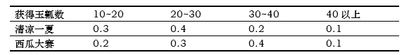
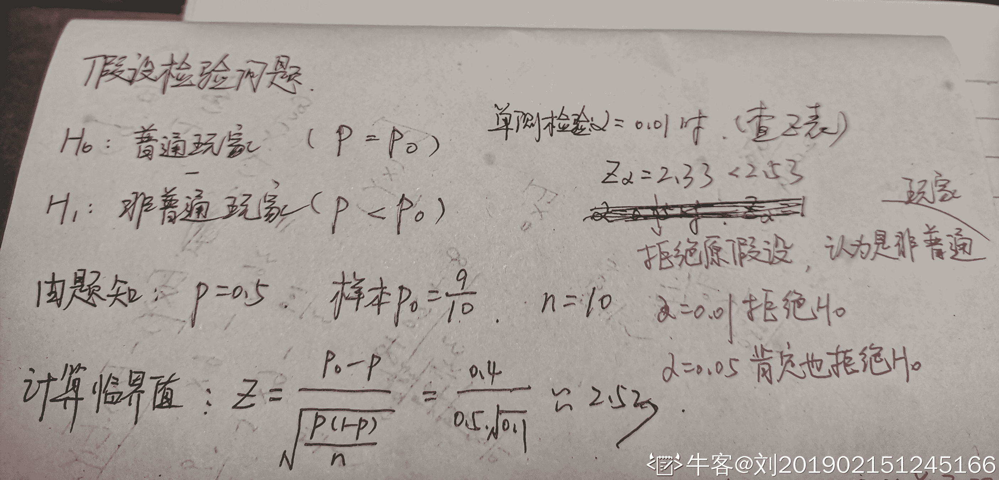
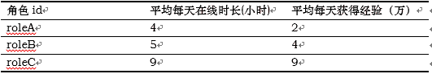

# 搜狐畅游 2020 校招笔试 - 数据分析师

## 1

以下四款游戏中，哪一款更有可能是 TapTap 上评分达到 8.0 以上的手游？

正确答案: A   你的答案: 空 (错误)

```cpp
流言侦探
```

```cpp
Apex 英雄
```

```cpp
蓝月传奇
```

```cpp
一起来捉妖
```

本题知识点

设计 搜狐畅游 数据库工程师 Java 工程师 财务 游戏策划 数据分析师 项目经理 C++工程师 市场 用户研究员 游戏研发工程师 运维工程师 游戏运营 2020 2021

讨论

[李 danran](https://www.nowcoder.com/profile/5363114)

```cpp
Apex 英雄目前评分 8.9 -2020.1.8
```

发表于 2020-01-08 16:27:37

* * *

[Ankh_L](https://www.nowcoder.com/profile/4545347)

虽然前面大多数都知道,但是这真的是 JAVA 开发工程师的题目吗😓

发表于 2020-03-24 15:04:49

* * *

[Asunaの楠世](https://www.nowcoder.com/profile/183417247)

apex 不是手游啊！一刀 999 就不用提了，捉妖是抄袭宝可梦 GO，即使没听过第一个排除法这也做出来了

发表于 2020-03-21 18:39:44

* * *

## 2

以下哪款游戏不是当下主流的电子竞技项目？

正确答案: C   你的答案: 空 (错误)

```cpp
英雄联盟
```

```cpp
CS.GO
```

```cpp
崩坏 3
```

```cpp
王者荣耀
```

本题知识点

设计 搜狐畅游 数据库工程师 Java 工程师 财务 游戏策划 数据分析师 项目经理 C++工程师 市场 用户研究员 游戏研发工程师 运维工程师 游戏运营 2020 2021

讨论

[xq7012](https://www.nowcoder.com/profile/717756269)

天啊 CSGO 都是主流了吗（狗头

发表于 2020-03-24 23:41:59

* * *

[Coder-Star](https://www.nowcoder.com/profile/1408953)

123

发表于 2021-11-04 19:02:46

* * *

[彩贺琴](https://www.nowcoder.com/profile/573873479)

崩坏 3 是 ACT 手游，别信楼下

发表于 2020-09-08 17:06:17

* * *

## 3

如下四款手机游戏中，哪款游戏类型和其他三款不一样？

正确答案: D   你的答案: 空 (错误)

```cpp
我叫 MT
```

```cpp
小冰冰传奇
```

```cpp
皇室战争
```

```cpp
决战平安京
```

本题知识点

设计 搜狐畅游 数据库工程师 Java 工程师 财务 游戏策划 数据分析师 项目经理 C++工程师 市场 用户研究员 游戏研发工程师 运维工程师 游戏运营 2020

讨论

[某只锦鲤](https://www.nowcoder.com/profile/362915100)

决战平安京：《阴阳师》IP 公平竞技对战 MOBA 手游皇室战争：即时策略、MOBA 以及卡牌等元素手游小冰冰传奇：卡牌类手机游戏我叫 MT：3DMMORPG 手游

发表于 2020-03-19 15:07:37

* * *

## 4

以下哪款游戏不属于 FPS 类游戏的范畴？

正确答案: C   你的答案: 空 (错误)

```cpp
CS 1.6
```

```cpp
雷神之锤
```

```cpp
地下城与勇士
```

```cpp
逆战
```

本题知识点

设计 搜狐畅游 数据库工程师 Java 工程师 财务 游戏策划 数据分析师 项目经理 C++工程师 市场 用户研究员 游戏研发工程师 运维工程师 游戏运营 2020 营销 2021

讨论

[知悉者也](https://www.nowcoder.com/profile/111682374)

fps 在这里表示[第一人称射击游戏](https://zh.wikipedia.org/wiki/%E7%AC%AC%E4%B8%80%E4%BA%BA%E7%A7%B0%E5%B0%84%E5%87%BB%E6%B8%B8%E6%88%8F)（First Person Shooter），除了 DNF【地下城与勇士】外，其他 3 个选项都是 FPS 游戏

发表于 2019-12-22 11:20:27

* * *

[某只锦鲤](https://www.nowcoder.com/profile/362915100)

地下城与勇士：角色扮演 2d 游戏

发表于 2020-03-19 15:09:38

* * *

## 5

以下哪款产品不是家用电视类主机？

正确答案: B   你的答案: 空 (错误)

```cpp
Xbox One
```

```cpp
PSP
```

```cpp
PS4
```

```cpp
wii
```

本题知识点

设计 搜狐畅游 数据库工程师 Java 工程师 财务 游戏策划 数据分析师 项目经理 C++工程师 市场 用户研究员 游戏研发工程师 运维工程师 游戏运营 2020 2021

讨论

[宇空·零](https://www.nowcoder.com/profile/200053465)

psp 是掌机

发表于 2020-01-06 14:37:53

* * *

[江居士](https://www.nowcoder.com/profile/956646736)

PSP 是掌上游戏机

发表于 2020-09-22 16:20:12

* * *

## 6

以下哪款游戏属于国创 IP 衍生游戏？

正确答案: B   你的答案: 空 (错误)

```cpp
一拳超人
```

```cpp
斗破苍穹
```

```cpp
Love Live
```

```cpp
精灵宝可梦
```

本题知识点

设计 搜狐畅游 数据库工程师 Java 工程师 游戏策划 数据分析师 项目经理 C++工程师 用户研究员 游戏研发工程师 运维工程师 游戏运营 2020 2021

讨论

[最爱小怪兽](https://www.nowcoder.com/profile/193667259)

三十年河东，三十年河西，莫欺少年穷

发表于 2020-04-19 20:45:57

* * *

[白驹过隙、](https://www.nowcoder.com/profile/7052607)

d

发表于 2020-01-03 15:56:22

* * *

## 7

以下哪款不属于《魔兽世界》的资料片？

正确答案: B   你的答案: 空 (错误)

```cpp
燃烧的远征
```

```cpp
虚空之遗
```

```cpp
争霸艾泽拉斯
```

```cpp
巫妖王之怒
```

本题知识点

设计 搜狐畅游 数据库工程师 Java 工程师 游戏策划 数据分析师 项目经理 C++工程师 用户研究员 游戏研发工程师 运维工程师 游戏运营 2020 2021

讨论

[上岸吧兄 dei](https://www.nowcoder.com/profile/646722939)

 魔兽世界 1.0 
魔兽世界：战场争锋 1.5 
魔兽世界：进百军黑翼之巢 1.6 
魔兽世界：血神的复苏 1.7 
魔兽世界：噩度梦之龙 1.8 
魔兽世界：安其拉之门 1.9 
魔兽世界：勇者归来 1.10 
魔兽世界：纳克萨玛斯之影 1.11 
魔兽世界：战鼓震问天 1.12 
魔兽世界答：燃烧的远征 (A)
魔兽世界：风暴前夕 2.0 
魔兽世界：黑暗神殿 2.1 
魔兽世界：祖阿曼 2.3 
魔兽世界：太专阳之井 2.4 
魔兽世界：巫妖王之怒 (D)
魔兽世界：末日的回响 3.0 
魔兽世界：奥杜属尔的秘密 3.1 
魔兽世界：北伐的召唤 3.2 
魔兽世界：巫妖王的陨落 3.3
魔兽世界：末日浩劫 4.0 
魔兽世界：海加尔**4.1

2018 年 8 月 14 日《魔兽世界：争霸艾泽拉斯》正式上线 （C)[`zhidao.baidu.com/question/1859962154886422707.html`](https://zhidao.baidu.com/question/1859962154886422707.html) 

发表于 2020-04-12 04:06:34

* * *

[Sayuyu](https://www.nowcoder.com/profile/694690141)

[虚空之遗是即时战略游戏《星际争霸Ⅱ》的资料片](http://www.baidu.com/link?url=h4-OD7UP001JPqeXeF04cKuMDrqpsdpMdfMdKR1POJR93WZKuQECtm6gmkvYpTEtmrJXWi7vpYAvM4puHF4grqelEG-BKWCjNZwJykYdHPPzhc9h7mnggunC4q7w2YtwJe8kfcdfelK6IZRBpsqcT5YpPXMG7CtkdRgyUQLWy4xCA9n5aA8EOsxYq-dx9YUbwKUfA0iyUivVdq7a4boRTM8ONbMY-492cmczLw49a-gC94IrIqTKwVPorAgvDzqoM_U7lux_fKfBKhOtVcOFm9hl_K8BGEFgrb7M3L6jhTq)

发表于 2021-03-20 11:28:41

* * *

## 8

手游天龙八部 3D 的游戏类型是？

正确答案: D   你的答案: 空 (错误)

```cpp
ARPG
```

```cpp
SLG
```

```cpp
RTS
```

```cpp
MMORPG
```

本题知识点

设计 搜狐畅游 数据库工程师 Java 工程师 游戏策划 数据分析师 项目经理 C++工程师 用户研究员 游戏研发工程师 运维工程师 游戏运营 2020

讨论

[布鲁布鲁冒泡泡](https://www.nowcoder.com/profile/805954332)

ARPG（Action Role Playing Game）：动作角色扮演类游戏中

MMORPG（ Massive Multiplayer Online Role-Playing Game）：大型多人在线角色扮演游戏

SLG（Simulation Game）：策略游戏

RTS（Real-Time Strategy Game）：即时战略游戏，是策略游戏（Strategy Game）的一种

发表于 2020-02-21 22:40:51

* * *

[hugo201903151851484](https://www.nowcoder.com/profile/437092911)

ARPG（Action Role Playing Game），游戏术语，意思是动作角色扮演类游戏中，角色的动作（特别是攻击动作）与操作（如点击鼠标）相关的动作。 MMORPG，是英文 Massive（或 Massively）Multiplayer Online Role-PlayingGame 的缩写。

发表于 2020-01-18 15:41:55

* * *

## 9

以下哪款游戏不属于 Steam 平台？

正确答案: A   你的答案: 空 (错误)

```cpp
暗黑破环神
```

```cpp
Dota2
```

```cpp
彩虹六号
```

```cpp
绝地求生
```

本题知识点

设计 搜狐畅游 数据库工程师 Java 工程师 游戏策划 数据分析师 项目经理 C++工程师 用户研究员 游戏研发工程师 运维工程师 游戏运营 2020 2021

讨论

[暖风先生](https://www.nowcoder.com/profile/7155258)

暗黑是暴雪的

发表于 2020-02-29 20:54:50

* * *

## 10

以下属于 ARPG 类型的游戏是？

正确答案: C   你的答案: 空 (错误)

```cpp
海岛奇兵
```

```cpp
王者荣耀
```

```cpp
地下城与勇士
```

```cpp
皇室战争
```

本题知识点

设计 搜狐畅游 数据库工程师 Java 工程师 游戏策划 数据分析师 项目经理 C++工程师 用户研究员 游戏研发工程师 运维工程师 游戏运营 2020

讨论

[P-ShineBeam](https://www.nowcoder.com/profile/945440246)

ARPG（Action Role Playing Game），游戏术语，意思是动作角色扮演类游戏中，角色的动作（特别是攻击动作）与操作（如点击鼠标）相关的动作。

发表于 2020-02-17 18:46:07

* * *

## 11

SLG 是指以下哪种游戏类型？

正确答案: D   你的答案: 空 (错误)

```cpp
即时战略游戏
```

```cpp
第一人称设计游戏
```

```cpp
多人在线战术竞技游戏
```

```cpp
模拟战略游戏
```

本题知识点

设计 搜狐畅游 数据库工程师 Java 工程师 财务 游戏策划 数据分析师 项目经理 C++工程师 市场 用户研究员 游戏研发工程师 运维工程师 游戏运营 2020 营销 2021 运营

讨论

[布鲁布鲁冒泡泡](https://www.nowcoder.com/profile/805954332)

ARPG（Action Role Playing Game）：动作角色扮演类游戏

MMORPG（ Massive Multiplayer Online Role-Playing Game）：大型多人在线角色扮演游戏

SLG（Simulation Game）：策略游戏、模拟战略游戏

RTS（Real-Time Strategy Game）：即时战略游戏，是策略游戏（Strategy Game）的一种

FPS（First Person Shooting 第一人称射击游戏）

发表于 2020-02-21 22:47:05

* * *

## 12

英雄联盟的开发商 Riot 被哪家公司收购？

正确答案: A   你的答案: 空 (错误)

```cpp
腾讯
```

```cpp
畅游
```

```cpp
盛趣
```

```cpp
完美世界
```

本题知识点

设计 搜狐畅游 数据库工程师 Java 工程师 财务 游戏策划 数据分析师 项目经理 C++工程师 市场 用户研究员 游戏研发工程师 运维工程师 游戏运营 2020 2021

讨论

[追寻原风景](https://www.nowcoder.com/profile/860792)

拳头公司

发表于 2020-06-22 23:28:15

* * *

## 13

谷歌人工智能团队 Deepmind 在开发围棋 AI AlphaGo 之后
，又针对哪款游戏开发了 AI？

正确答案: B   你的答案: 空 (错误)

```cpp
Dota2
```

```cpp
星际争霸 2
```

```cpp
英雄联盟
```

```cpp
皇室战争
```

本题知识点

设计 搜狐畅游 数据库工程师 Java 工程师 财务 游戏策划 数据分析师 项目经理 C++工程师 市场 用户研究员 游戏研发工程师 运维工程师 游戏运营 2020 2021

讨论

[卡咔咯咖](https://www.nowcoder.com/profile/908179179)

DOTA2 是 OPEN-AI，与谷歌团队无关

发表于 2020-03-31 14:28:01

* * *

## 14

RTS 是以下哪一类游戏的简称？

正确答案: A   你的答案: 空 (错误)

```cpp
即时战略游戏
```

```cpp
模拟战略游戏
```

```cpp
大型多人在线游戏
```

```cpp
策略卡牌游戏
```

本题知识点

设计 搜狐畅游 数据库工程师 Java 工程师 财务 游戏策划 数据分析师 项目经理 C++工程师 市场 用户研究员 游戏研发工程师 运维工程师 游戏运营 2020

讨论

[小啊啾会发光](https://www.nowcoder.com/profile/833120440)

Real-time strategy game 即时战略游戏

发表于 2020-03-03 10:46:12

* * *

## 15

《魔兽世界》的现付费模式是？

正确答案: C   你的答案: 空 (错误)

```cpp
点卡付费
```

```cpp
免费下载道具付费
```

```cpp
月卡付费
```

```cpp
点卡道具双收费
```

本题知识点

设计 搜狐畅游 数据库工程师 Java 工程师 财务 游戏策划 数据分析师 项目经理 C++工程师 市场 用户研究员 游戏研发工程师 运维工程师 游戏运营 2020 2021

讨论

[这是一只熊猫](https://www.nowcoder.com/profile/226309918)

我记得 wow 推出游戏内购了呀

发表于 2020-04-26 17:18:23

* * *

## 16

游戏中的公会系统，其主要作用是什么？

正确答案: C   你的答案: 空 (错误)

```cpp
推动玩家在游戏内的消费
```

```cpp
提升作为会长的玩家的成就感
```

```cpp
增进玩家在游戏内的互动
```

```cpp
帮助玩家更快的熟悉游戏
```

本题知识点

设计 搜狐畅游 游戏策划 数据分析师 项目经理 Java 工程师 C++工程师 用户研究员 运维工程师 游戏运营 2020

## 17

以下术语中代表游戏中战术的是？

正确答案: A   你的答案: 空 (错误)

```cpp
Rush
```

```cpp
Carry
```

```cpp
Ganker
```

```cpp
AFK
```

本题知识点

设计 搜狐畅游 游戏策划 数据分析师 项目经理 Java 工程师 C++工程师 用户研究员 运维工程师 游戏运营 2020 2021

讨论

[牛客 355336884 号](https://www.nowcoder.com/profile/355336884)

激情速度战最早是在帝国时代红警这类游戏中出现的。如果应用的现在的 moba 应该也可叫速推战术，高联动，快准狠

发表于 2020-04-04 09:57:28

* * *

[MichaelZ77](https://www.nowcoder.com/profile/553754744)

rush = 冲冲冲

发表于 2020-09-22 12:48:44

* * *

[香草 201910082319424](https://www.nowcoder.com/profile/992286449)

rush b 不是战术吗

发表于 2020-03-08 19:53:27

* * *

## 18

通常我们在 MMORPG 游戏中所说的“RAID”是指？

正确答案: C   你的答案: 空 (错误)

```cpp
公会活动
```

```cpp
高级副本
```

```cpp
大型团队活动
```

```cpp
亲友团
```

本题知识点

设计 搜狐畅游 游戏策划 数据分析师 项目经理 Java 工程师 C++工程师 用户研究员 运维工程师 游戏运营 2020

讨论

[Fawne_KIKI](https://www.nowcoder.com/profile/197039280)

RAID 指玩家集体战斗行动，包括副本战斗，野外 BOSS 战，敌对阵营首领战等，现在多为公会活动的代名词

发表于 2020-08-06 09:30:31

* * *

## 19

Dota2 国际邀请赛中，中国战队的“偶数年夺冠魔咒”在哪一年被打破？

正确答案: D   你的答案: 空 (错误)

```cpp
2012
```

```cpp
2014
```

```cpp
2016
```

```cpp
2018
```

本题知识点

设计 搜狐畅游 游戏策划 数据分析师 项目经理 Java 工程师 C++工程师 用户研究员 运维工程师 游戏运营 2020 2021

讨论

[Lin1cc](https://www.nowcoder.com/profile/843789834)

2018 年 DOTA2 国际邀请赛上，LGD 战队在总决赛上不敌 OG 战队，OG 战队在夺得冠军的同时，也打破了无数中国 dota 玩家心中的神话：中国队偶数年夺冠。

发表于 2020-03-19 09:29:20

* * *

## 20

以下哪支队伍曾经拿下过 Dota2 国际邀请赛和英雄联盟 S
赛的双冠军？

正确答案: B   你的答案: 空 (错误)

```cpp
LGD
```

```cpp
IG
```

```cpp
RNG
```

```cpp
Estar
```

本题知识点

设计 搜狐畅游 游戏策划 数据分析师 项目经理 Java 工程师 C++工程师 用户研究员 运维工程师 游戏运营 2020 2021

讨论

[牛王子](https://www.nowcoder.com/profile/326538794)

IG 牛逼

发表于 2021-04-08 20:41:20

* * *

[牛客 231055556 号](https://www.nowcoder.com/profile/231055556)

ig 2018，fpx2019，为什么 lol 部分不考多一点呜呜呜呜呜呜

发表于 2020-08-21 15:50:18

* * *

## 21

以下哪个游戏输入设备公认最不适合玩格斗类游戏？

正确答案: B   你的答案: 空 (错误)

```cpp
游戏手柄
```

```cpp
鼠标
```

```cpp
摇杆
```

```cpp
键盘
```

本题知识点

设计 搜狐畅游 财务 游戏策划 数据分析师 项目经理 Java 工程师 C++工程师 市场 用户研究员 运维工程师 游戏运营 2020 2021

讨论

[墨翊白](https://www.nowcoder.com/profile/945203719)

🤣去游戏厅打打街机

发表于 2021-08-25 11:48:06

* * *

[曲梓浩](https://www.nowcoder.com/profile/646512694)

？？？摇杆打一个看看

发表于 2020-07-27 08:59:32

* * *

## 22

以下哪个游戏不是由小说改编而来？

正确答案: D   你的答案: 空 (错误)

```cpp
天龙八部
```

```cpp
诛仙
```

```cpp
花千骨
```

```cpp
古剑奇谭
```

本题知识点

设计 搜狐畅游 游戏策划 数据分析师 项目经理 Java 工程师 C++工程师 用户研究员 运维工程师 游戏运营 2020

讨论

[Fawne_KIKI](https://www.nowcoder.com/profile/197039280)

古剑奇谭: 琴心剑魄 by 宁宣这是游戏之后出的一部剧情小说,电视剧是根据这个改编的。小说有两部,这是第一部,第二部跟这个剧情没什么关系。

发表于 2020-08-06 09:32:13

* * *

## 23

以下哪家公司不是近两年主流的 PC 游戏外设厂商？

正确答案: B   你的答案: 空 (错误)

```cpp
罗技
```

```cpp
微软
```

```cpp
赛睿
```

```cpp
雷蛇
```

本题知识点

设计 搜狐畅游 财务 游戏策划 数据分析师 项目经理 Java 工程师 C++工程师 市场 用户研究员 运维工程师 游戏运营 2020 运营 2021

讨论

[Fawne_KIKI](https://www.nowcoder.com/profile/197039280)

*赛睿*一般指 SteelSeries。SteelSeries (*赛睿*)是 2001 年成立于丹麦的一家公司，公司目前总部位于美国芝加哥，是全球专业游戏外设行业的领导者，其产品类别有：耳机，鼠标垫，鼠标，以及键盘。目前产品销售范围超过 80 个国家。

发表于 2020-08-06 09:32:44

* * *

[好好学习好好做人](https://www.nowcoder.com/profile/854180677)

PC 游戏外设厂商：硬件

发表于 2021-08-12 01:23:40

* * *

[mly5](https://www.nowcoder.com/profile/284366487)

微软的 XBOX 手柄也是外设，还是 PC 主流手柄。这题的意思是手柄不算主流外设备呗。

发表于 2021-09-29 15:04:40

* * *

## 24

以下哪款游戏使用了 Battle pass 理念？

正确答案: A   你的答案: 空 (错误)

```cpp
堡垒之夜
```

```cpp
魔兽争霸
```

```cpp
绝地求生
```

```cpp
Apex 英雄
```

本题知识点

设计 搜狐畅游 财务 游戏策划 数据分析师 项目经理 Java 工程师 C++工程师 市场 用户研究员 运维工程师 游戏运营 2020 2021

讨论

[卡咔咯咖](https://www.nowcoder.com/profile/908179179)

答案有问题，这题太老了，或者说是出题人小看了各厂的跟进速度

发表于 2020-03-31 14:29:53

* * *

[李 danran](https://www.nowcoder.com/profile/5363114)

简化理解 battle pass 就是王者的战令系统在《Dota 2》的基础之上，《堡垒之夜》的设计师做出了一项改动——将玩家在购买 Battle Pass 之前的游戏进程纳入到奖励结算之中。《堡垒之夜》的奖励分为“白银”和“黄金”两个等级，未购买 Battle Pass 的玩家可以根据活跃度获取相应等级的白银奖励，而当他们购买 Battle Pass 后，会得到之前累积的所有黄金级别的奖励。

发表于 2020-03-07 18:26:17

* * *

[JUSTDOIT201908200525941](https://www.nowcoder.com/profile/670982160)

除了魔兽以外都有

发表于 2020-02-28 17:57:07

* * *

## 25

以下哪位文艺明星尚没有自己的电竞俱乐部？

正确答案: C   你的答案: 空 (错误)

```cpp
周杰伦
```

```cpp
林俊杰
```

```cpp
蔡徐坤
```

```cpp
陈赫
```

本题知识点

设计 搜狐畅游 财务 游戏策划 数据分析师 项目经理 Java 工程师 C++工程师 市场 用户研究员 运维工程师 游戏运营 2020 2021

讨论

[OctopusF](https://www.nowcoder.com/profile/380544530)

律师函警告

发表于 2020-03-10 20:41:57

* * *

[EZ-Katka](https://www.nowcoder.com/profile/696509965)

你这是看不起我家坤坤，坤坤那么努力

发表于 2020-09-22 14:45:22

* * *

[牛客 189251641 号](https://www.nowcoder.com/profile/189251641)

因为蔡徐坤考虑到年龄小粉丝，怕他们沉迷游戏所以不接游戏相关任何工作，评论别🍋了

发表于 2022-03-19 19:37:10

* * *

## 26

以下哪个角色不出自于《火影忍者》?

正确答案: D   你的答案: 空 (错误)

```cpp
漩涡鸣人
```

```cpp
宇智波带土
```

```cpp
大蛇丸
```

```cpp
黑崎一护
```

本题知识点

设计 搜狐畅游 游戏策划 数据分析师 项目经理 Java 工程师 C++工程师 用户研究员 运维工程师 游戏运营 2020 2021

讨论

[布鲁布鲁冒泡泡](https://www.nowcoder.com/profile/805954332)

```cpp
黑崎一护：《死神》
```

发表于 2020-02-21 23:08:46

* * *

## 27

“中国国际数码互动娱乐展览会”的英文缩写是？

正确答案: D   你的答案: 空 (错误)

```cpp
TGS
```

```cpp
TGA
```

```cpp
E3
```

```cpp
CJ
```

本题知识点

设计 搜狐畅游 游戏策划 数据分析师 项目经理 Java 工程师 C++工程师 用户研究员 运维工程师 游戏运营 2020

讨论

[布鲁布鲁冒泡泡](https://www.nowcoder.com/profile/805954332)

CJ（China Joy）：中国国际数码互动娱乐展览会

TGS (Tokyo Game Show) ：东京电玩展

TGA（Tencent Global eSports Arena）：腾讯电竞运动会

E3（The Electronic Entertainment Expo）：电子娱乐展览会

发表于 2020-02-21 23:12:00

* * *

## 28

E3 游戏展的举办地是？

正确答案: A   你的答案: 空 (错误)

```cpp
洛杉矶
```

```cpp
芝加哥
```

```cpp
东京
```

```cpp
悉尼
```

本题知识点

设计 搜狐畅游 游戏策划 数据分析师 项目经理 Java 工程师 C++工程师 用户研究员 运维工程师 游戏运营 2020 2021

讨论

[墨翊白](https://www.nowcoder.com/profile/945203719)

把上一题同学的解析搬了过来😆电子娱乐展览会（英文：Electronic Entertainment Expo），简称 E3，中文地区又称为 E3 大展，是全球规模最大、知名度最高的互动娱乐展示会，自 1995 年开始举办，在全球电子娱乐产业中有着重要地位，有评论誉为“电子娱乐界一年一度的奥林匹克盛会”，吸引着全球玩家的目光，以及超过 60000 名极具影响力的零售商、分销部、研发商与投资商、媒体。E3 近几年一般于 6 月第 3 周在美国洛杉矶的洛杉矶会展中心举办。

发表于 2021-08-25 11:56:28

* * *

[牛王子](https://www.nowcoder.com/profile/326538794)

你见过凌晨 4 点的洛杉矶吗？

发表于 2021-04-08 20:44:24

* * *

## 29

下列哪个游戏公司尚未推出自走棋公司的玩法和地图

正确答案: D   你的答案: 空 (错误)

```cpp
巨鸟多多
```

```cpp
腾讯
```

```cpp
Valve
```

```cpp
暴雪
```

本题知识点

设计 搜狐畅游 游戏策划 数据分析师 项目经理 Java 工程师 C++工程师 用户研究员 运维工程师 游戏运营 2020 2021

讨论

[曲梓浩](https://www.nowcoder.com/profile/646512694)

大人，时代变了

发表于 2020-07-27 09:00:04

* * *

[君玊](https://www.nowcoder.com/profile/733146627)

炉石有了

发表于 2020-02-23 22:07:52

* * *

[牛客 659783390 号](https://www.nowcoder.com/profile/659783390)

我也想说，炉石有了，所以这题应该更新了

发表于 2021-09-09 18:07:51

* * *

## 30

下列哪家俱乐部在创造了体育联盟中最长的连败纪录？

正确答案: B   你的答案: 空 (错误)

```cpp
费城 76 人
```

```cpp
上海龙
```

```cpp
LGD
```

```cpp
J-team
```

本题知识点

设计 搜狐畅游 游戏策划 数据分析师 项目经理 Java 工程师 C++工程师 用户研究员 运维工程师 游戏运营 2020 2021

讨论

[李 danran](https://www.nowcoder.com/profile/5363114)

上海龙参加 2018 年守望先锋联赛创始赛季取得了 0-40 的成绩，未尝一胜，刷新了世界竞技（包括传统体育竞技）历史上最长的连败记录。2019 年 2 月 23 日守望先锋联赛第二赛季的比赛中，上海龙之队 3：1 战胜波士顿崛起队，终结了 42 连败，

发表于 2020-03-07 18:33:06

* * *

[布鲁布鲁冒泡泡](https://www.nowcoder.com/profile/805954332)

这是个悲伤的故事

发表于 2020-02-21 23:18:46

* * *

## 31

下列对常用电器节电的说法不成立的是

正确答案: D   你的答案: 空 (错误)

```cpp
将液晶电视动态模式改为影院模式，可省约 40%的耗电量
```

```cpp
空调只要提高 1 摄氏度制冷时的温度设定，便可以节点约 10%
```

```cpp
使用电脑采用中等亮度，有利于保护视力，省电
```

```cpp
灵活使用电脑内置的节电程序，不能取得很明显的节电效果
```

本题知识点

设计 搜狐畅游 数据库工程师 Java 工程师 财务 游戏策划 数据分析师 项目经理 C++工程师 市场 用户研究员 游戏研发工程师 运维工程师 游戏运营 2020 2021

## 32

2016 年 3 月，AlphaGo 对战世界围棋冠军，职业九段选手李世石，并且以 4:1 的比分击败了李世石，AlphaGo 的工作原理基于下列哪项技术？

正确答案: D   你的答案: 空 (错误)

```cpp
基因编辑
```

```cpp
纳米技术
```

```cpp
量子计算
```

```cpp
深度学习
```

本题知识点

设计 搜狐畅游 数据库工程师 Java 工程师 财务 游戏策划 数据分析师 项目经理 C++工程师 市场 用户研究员 游戏研发工程师 运维工程师 游戏运营 2020 2021

## 33

夏天，打开冰箱冷冻室的门，常常看到冷冻室中冒出一股白雾，这是

正确答案: D   你的答案: 空 (错误)

```cpp
冰箱里原有水蒸气凝结成小水滴
```

```cpp
冰箱里的冰升华后凝结成小水滴
```

```cpp
冰箱里的水变成水蒸气
```

```cpp
冰箱外部空气中的水变成小水滴
```

本题知识点

设计 搜狐畅游 数据库工程师 Java 工程师 项目经理 游戏策划 数据分析师 C++工程师 用户研究员 游戏研发工程师 运维工程师 游戏运营 2020 2021

讨论

[追寻原风景](https://www.nowcoder.com/profile/860792)

打开冰箱冷冻室的门时，冰箱内的低温气体飘散到冰箱外。使周围空气中平时看不见的水蒸气迅速冷却液化，成为很多微小水珠形成了“白雾”。

发表于 2020-06-22 23:31:48

* * *

## 34

从 3 月下旬到 10 月上旬，太阳在地球上直射位置的移动规律是：

正确答案: B   你的答案: 空 (错误)

```cpp
赤道-南回归线-赤道
```

```cpp
赤道-北回归线-赤道
```

```cpp
南回归线-赤道-北回归线
```

```cpp
北回归线-赤道-南回归线
```

本题知识点

设计 搜狐畅游 数据库工程师 Java 工程师 项目经理 游戏策划 数据分析师 C++工程师 用户研究员 游戏研发工程师 运维工程师 游戏运营 2020 2021

讨论

[冷夜辉月](https://www.nowcoder.com/profile/513554458)

春分（3 月份）在赤道，然后往北移，夏至（6 月份）到北回归线，然后往南移，秋分（9 月份）到赤道，继续往南移，冬至（12 月份）到南回归线，然后往北移，春分（3 月份）回到赤道

发表于 2020-02-20 12:48:55

* * *

## 35

关于宇航员在太空中的生活，下列说法中不正确的是：

正确答案: B   你的答案: 空 (错误)

```cpp
宇航员可以使用特定的加热器对食品加热
```

```cpp
宇航员从太空返回地面之后，由于失重，质量会有所增加
```

```cpp
宇航员应该睡在固定的睡袋中，以免被气流推动误碰仪器设备开关
```

```cpp
在同一航空器中的宇航员可以直接交谈，无需借助无线电通信设备
```

本题知识点

设计 搜狐畅游 数据库工程师 Java 工程师 财务 游戏策划 数据分析师 项目经理 C++工程师 市场 用户研究员 游戏研发工程师 运维工程师 游戏运营 2020 2021

讨论

[游生生](https://www.nowcoder.com/profile/370876119)

质量是物体的本质属性，在哪都不会改变

发表于 2020-03-12 21:11:35

* * *

[FireGogog](https://www.nowcoder.com/profile/308678318)

答:可以直接交谈。比如王亚平在太空授课时的几名宇航员就是直接交谈。因为它们生活的航空器内是仿地面自然环境的,即里面是有正常空气的,所以可以直接交谈

发表于 2020-09-13 02:41:36

* * *

[朧](https://www.nowcoder.com/profile/569378856)

在失重状态下人的骨密度会下降，严重的还要治疗骨质疏松，所以应该质量下降。

发表于 2021-04-10 15:25:54

* * *

## 36

“四书五经”中的“四书”指的是：

正确答案: B   你的答案: 空 (错误)

```cpp
《尚书》《周易》《论语》《孝经》
```

```cpp
《大学》《中庸》《论语》《孟子》
```

```cpp
《周易》《尚书》《礼记》《春秋》
```

```cpp
《诗经》《孟子》《孝经》《尔雅》
```

本题知识点

设计 搜狐畅游 财务 游戏策划 数据分析师 项目经理 Java 工程师 C++工程师 市场 用户研究员 运维工程师 游戏运营 2020 2021

讨论

[小橙汁](https://www.nowcoder.com/profile/158654105)

啊?我数据分析就做这个?

发表于 2020-10-07 20:13:37

* * *

[布鲁布鲁冒泡泡](https://www.nowcoder.com/profile/805954332)

五经：《诗经》《尚书》《礼记》《周易》《春秋》

发表于 2020-02-21 23:21:55

* * *

## 37

人体必需的六类营养素中有三大热能营养素，在体内经过氧化可产生能量，下列不属于热能营养素的是：

正确答案: C   你的答案: 空 (错误)

```cpp
碳水化合物
```

```cpp
脂肪
```

```cpp
维生素
```

```cpp
蛋白质
```

本题知识点

设计 搜狐畅游 项目经理 游戏策划 数据分析师 Java 工程师 C++工程师 用户研究员 运维工程师 游戏运营 2020 2021

讨论

[布鲁布鲁冒泡泡](https://www.nowcoder.com/profile/805954332)

热能营养素：蛋白质 - 脂类 - 糖类 - 碳水化合物

发表于 2020-02-21 23:22:56

* * *

[SHER_Echo](https://www.nowcoder.com/profile/383672147)

高中生物 hhh

发表于 2022-03-19 16:38:32

* * *

## 38

关于目前的国际体育赛事，下列说法正确的是：

正确答案: D   你的答案: 空 (错误)

```cpp
电子竞技已经是奥运会 正式项目
```

```cpp
进入世界杯和欧洲杯足球赛决赛圈的球队数量相同
```

```cpp
斯诺克台球属于奥运会的比赛项目之一
```

```cpp
法国网球公开赛属于四大满贯之一
```

本题知识点

设计 搜狐畅游 项目经理 游戏策划 数据分析师 Java 工程师 C++工程师 用户研究员 运维工程师 游戏运营 2020 2021

讨论

[布鲁布鲁冒泡泡](https://www.nowcoder.com/profile/805954332)

网球四大满贯是澳大利亚网球公开赛、温布尔登网球公开赛、法国网球公开赛、美国网球公开赛

发表于 2020-02-21 23:23:51

* * *

[江边鸟](https://www.nowcoder.com/profile/451872365)

电子竞技已被正式承认为体育项目且已成为了亚运会项目，但暂时没进奥运会（有期望说 2024 年能进）世界杯 32 支球队，欧洲杯 24 支成为奥运会运动项目的硬性标准《奥林匹克***》规定：运动大项和运动分项要列入夏季奥运会比赛项目，至少在 75 个国家和 4 大洲的男子中以及至少在 40 个国家和 3 大洲女子中广泛开展。运动小项要列入夏季奥运会比赛项目，至少在 50 个国家和 3 大洲男子以及至少在 35 个国家和 3 大洲的女子中开展的，而且至少两次被世界锦标赛或洲锦标赛列入比赛项目的小项。斯诺克虽然出名但圈子太小了

编辑于 2020-03-08 11:50:32

* * *

## 39

下列关于法律和道德关系的表述中，错误的是：

正确答案: C   你的答案: 空 (错误)

```cpp
法律和道德都属于社会规范的范畴，均具有规范性
```

```cpp
法律由国家强制力保障实施，而道德主要通过社会舆论和内心自律得以实施
```

```cpp
违法行为一定违反道德，违反道德行为不一定违法
```

```cpp
法律和道德可以互为促进
```

本题知识点

设计 搜狐畅游 财务 游戏策划 数据分析师 项目经理 Java 工程师 C++工程师 市场 用户研究员 运维工程师 游戏运营 2020 2021

讨论

[阿俍](https://www.nowcoder.com/profile/2847133)

拽犯法吗

发表于 2020-09-05 09:37:05

* * *

[牛客 381379933 号](https://www.nowcoder.com/profile/381379933)

防护过当违反法律，但是不违反道德

发表于 2021-09-18 15:24:17

* * *

[橘猫警长](https://www.nowcoder.com/profile/600778676)

出轨犯法嘛

发表于 2021-03-05 16:49:02

* * *

## 40

若咖啡和茶叶互为替代品，当咖啡价格上升时，茶叶需求量的变化趋势是：

正确答案: C   你的答案: 空 (错误)

```cpp
减少
```

```cpp
不变
```

```cpp
增加
```

```cpp
难以确定
```

本题知识点

设计 搜狐畅游 财务 游戏策划 数据分析师 项目经理 Java 工程师 C++工程师 市场 用户研究员 运维工程师 游戏运营 2020 2021

讨论

[原来我不是奥特曼](https://www.nowcoder.com/profile/491513273)

首先，咖啡和茶叶互为替代品，可以理解为要么喝咖啡，要么喝茶叶。当咖啡的价格上涨的时候，人们（大部分）会选择价格不上涨的茶叶，所以茶叶的需求量增加

发表于 2021-08-29 14:59:54

* * *

[小不点的锚](https://www.nowcoder.com/profile/395630905)

供求关系

发表于 2020-09-20 14:10:47

* * *

## 41

下列未涉及无人机领域的公司是：

正确答案: D   你的答案: 空 (错误)

```cpp
3D Robotics
```

```cpp
Parrot
```

```cpp
DJI
```

```cpp
Momenta
```

本题知识点

设计 搜狐畅游 数据库工程师 Java 工程师 财务 游戏策划 数据分析师 项目经理 C++工程师 市场 用户研究员 游戏研发工程师 运维工程师 游戏运营 2020 2021

讨论

[SouthBegonia](https://www.nowcoder.com/profile/5845064)

3D Robotics：北美最大民用无人机厂商；Parrot：1994 年成立于法国巴黎，三大无人机制造厂商之一以及最早的无人机制作商；DJI 大疆，这不用说吧；Momenta：是一家自动驾驶公司，定位于打造自动驾驶大脑，其核心技术是基于深度学习的环境感知，高精度地图，驾驶决策算法。

发表于 2020-02-18 16:08:03

* * *

## 42

比特币没有基于以下哪中技术：

正确答案: A   你的答案: 空 (错误)

```cpp
B2C 网络技术
```

```cpp
加密技术
```

```cpp
时间戳技术
```

```cpp
区块链技术
```

本题知识点

设计 搜狐畅游 数据库工程师 Java 工程师 财务 游戏策划 数据分析师 项目经理 C++工程师 市场 用户研究员 游戏研发工程师 运维工程师 游戏运营 2020 2021

讨论

[SouthBegonia](https://www.nowcoder.com/profile/5845064)

B2C：Business-to-Customer 的缩写，而其中文简称为“[商对客](https://www.baidu.com/s?wd=%E5%95%86%E5%AF%B9%E5%AE%A2&tn=SE_PcZhidaonwhc_ngpagmjz&rsv_dl=gh_pc_zhidao)”。“商对客”是电子商务的一种模式，也就是通常说的直接面向消费者销售产品和服务商业零售模式。

发表于 2020-02-18 16:09:51

* * *

## 43

射频识别的英文简称为：

正确答案: A   你的答案: 空 (错误)

```cpp
RFID
```

```cpp
LTE
```

```cpp
NFC
```

```cpp
MID
```

本题知识点

设计 搜狐畅游 数据库工程师 Java 工程师 财务 游戏策划 数据分析师 项目经理 C++工程师 市场 用户研究员 游戏研发工程师 运维工程师 游戏运营 2020 2021

讨论

[SouthBegonia](https://www.nowcoder.com/profile/5845064)

RFID（Radio Frequency Identification 射频识别），其原理为阅读器与标签之间进行非接触式的数据通信，达到识别目标的目的；[LTE](https://baike.baidu.com/item/LTE)（Long Term Evolution，长期演进)，无线数据通信技术标准； NFC（Near Field Communication，近场通信），由非接触式射频识别（[RFID](https://baike.baidu.com/item/RFID/497249)）及互连互通技术整合演变而来的，通过在单一芯片上集成感应式读卡器、感应式卡片和点对点通信的功能，利用移动终端实现移动支付、电子票务、门禁、移动身份识别、防伪等应用；MID（Mobile Internet Device，[移动互联网设备](https://baike.baidu.com/item/%E7%A7%BB%E5%8A%A8%E4%BA%92%E8%81%94%E7%BD%91%E8%AE%BE%E5%A4%87/2462426)）。

发表于 2020-02-18 16:14:02

* * *

[张大坏](https://www.nowcoder.com/profile/964884243)

A

发表于 2021-11-15 12:18:02

* * *

## 44

下列功能中不属于互联网地理信息服务的是：

正确答案: D   你的答案: 空 (错误)

```cpp
提供地图服务接口与 API
```

```cpp
地理空间信息分析处理
```

```cpp
地理信息浏览查询
```

```cpp
数据安全管理与维护
```

本题知识点

设计 搜狐畅游 数据库工程师 Java 工程师 财务 游戏策划 数据分析师 项目经理 C++工程师 市场 用户研究员 游戏研发工程师 运维工程师 游戏运营 2020 2021

## 45

以下不是互联网常见的商业模式：

正确答案: D   你的答案: 空 (错误)

```cpp
流量变现模式
```

```cpp
佣金分成模式
```

```cpp
增值服务模式
```

```cpp
项目结算模式
```

本题知识点

设计 搜狐畅游 数据库工程师 Java 工程师 财务 游戏策划 数据分析师 项目经理 C++工程师 市场 用户研究员 游戏研发工程师 运维工程师 游戏运营 2020 2021

讨论

[SouthBegonia](https://www.nowcoder.com/profile/5845064)

流量变现模式：是指将网站流量（线上的人流量）通过某些手段（会员、广告）实现现金收益

发表于 2020-02-18 16:16:45

* * *

## 46

国内手机 GPS 使用的哪种坐标

正确答案: D   你的答案: 空 (错误)

```cpp
北京 54 坐标系
```

```cpp
西安 80 坐标系
```

```cpp
国家 2000 坐标系
```

```cpp
WGS-84 坐标系
```

本题知识点

设计 搜狐畅游 财务 游戏策划 数据分析师 项目经理 Java 工程师 C++工程师 市场 用户研究员 运维工程师 游戏运营 2020 2021

讨论

[布鲁布鲁冒泡泡](https://www.nowcoder.com/profile/805954332)

WGS-84 坐标系（World Geodetic System 一 1984 Coordinate System）一种国际上采用的[地心坐标系](https://baike.baidu.com/item/%E5%9C%B0%E5%BF%83%E5%9D%90%E6%A0%87%E7%B3%BB/5155013)。

发表于 2020-02-21 23:31:54

* * *

[offer 跃龙门！](https://www.nowcoder.com/profile/200756259)

北京 54 坐标系

北京 54 坐标系(BJZ54)，北京 54 坐标系为参心大地坐标系，大地上的一点可用经度 L54、纬度 M54 和大地高 H54 定位，它是以克拉索夫斯基椭球为基础，经局部平差后产生的坐标系。

西安 80 坐标系

国家大地坐标系的大地原点设在我国中部的陕西省泾阳县永乐镇，位于西安市西北方向约 60 公里，故称 1980 年西安坐标系，又简称西安大地原点。

国家 2000 坐标系

2000 国家大地坐标系，是我国当前最新的国家大地坐标系，英文名称为 China Geodetic Coordinate System 2000，英文缩写为 CGCS2000。

WGS-84 坐标系 

WGS-84 坐标系（World Geodetic System 一 1984 Coordinate System）一种国际上采用的地心坐标系。

发表于 2020-09-25 16:47:59

* * *

## 47

比特币网络通过（）来生成新的比特币。实质上是用计算机来解决一项复杂的数学问题

正确答案: B   你的答案: 空 (错误)

```cpp
挖煤
```

```cpp
挖矿
```

```cpp
决策
```

```cpp
递归
```

本题知识点

设计 搜狐畅游 财务 游戏策划 数据分析师 项目经理 Java 工程师 C++工程师 市场 用户研究员 运维工程师 游戏运营 2020

讨论

[牛客 373694139 号](https://www.nowcoder.com/profile/373694139)

比特币的根本是互相验证的公开记账系统，挖矿的本质是争夺记账权。

发表于 2021-10-02 17:15:08

* * *

## 48

百度“apollo”计划是针对什么领域开放的服务

正确答案: A   你的答案: 空 (错误)

```cpp
汽车
```

```cpp
家电
```

```cpp
医疗
```

```cpp
零售
```

本题知识点

设计 搜狐畅游 财务 游戏策划 数据分析师 项目经理 Java 工程师 C++工程师 市场 用户研究员 运维工程师 游戏运营 2020 2021

讨论

[伶人歌](https://www.nowcoder.com/profile/89949529)

Baidu Apollo(阿波罗)是百度发布的自动驾驶计划,包括开放平台及企业版解决方案。

发表于 2020-03-15 12:00:26

* * *

## 49

下列不属于 O2O 平台的是

正确答案: D   你的答案: 空 (错误)

```cpp
饿了么
```

```cpp
淘票票
```

```cpp
百度地图
```

```cpp
新浪微博
```

本题知识点

设计 搜狐畅游 财务 游戏策划 数据分析师 项目经理 Java 工程师 C++工程师 市场 用户研究员 运维工程师 游戏运营 2020

讨论

[offer 跃龙门！](https://www.nowcoder.com/profile/200756259)

030 将线下商务的机会与互联网结合在了一起，让互联网成为线下交易的前台。

这样线下服务就可以用线上来揽客，消费者可以用线上来筛选服务，还有成交可以在线结算，很快达到规模。

该模式最重要的特点是：推广效果可查，每笔交易可跟踪。国内首家社区电子商务开创者九社区是鼻祖。

O2O 营销模式又称离线商务模式，是指线上营销线上购买带动线下经营和线下消费。O2O 通过打折、提供信息、服务预订等方式，把线下商店的消息推送给互联网用户，从而将他们转换为自己的线下客户，这就特别适合必须到店消费的商品和服务。

发表于 2020-09-25 16:53:43

* * *

[伽耶](https://www.nowcoder.com/profile/769835182)

online to offline

发表于 2020-07-30 02:33:51

* * *

## 50

使得计算机具有智能的根本途径是

正确答案: A   你的答案: 空 (错误)

```cpp
机器学习
```

```cpp
云学习
```

```cpp
拓展学习
```

```cpp
数据学习
```

本题知识点

设计 搜狐畅游 财务 游戏策划 数据分析师 项目经理 Java 工程师 C++工程师 市场 用户研究员 运维工程师 游戏运营 2020 2021

讨论

[伽耶](https://www.nowcoder.com/profile/769835182)

**机器学习**是一门多领域交叉学科，涉及概率论、统计**学**、逼近论、凸分析、算法复杂度理论等多门学科。 专门研究计算机怎样模拟或实现人类的**学习**行为，以获取新的知识或技能，重新组织已有的知识结构使之不断改善自身的性能。 它是人工智能的核心，是使计算机具有智能的根本途径。

发表于 2020-07-30 02:34:27

* * *

## 51

游戏中玩家可以通过两种途径清凉一夏活动、西瓜大赛活动获得玉瓤，假设每个活动获得玉瓤数概率如下表所示：
活动上线后，某玩家随机选择参加一活动，结果获得了 25 个玉瓤。请问该玩家参加的是清凉一夏活动的概率。

正确答案: A   你的答案: 空 (错误)

```cpp
4/7
```

```cpp
3/7
```

```cpp
2/5
```

```cpp
3/5
```

本题知识点

数据分析师 搜狐畅游 2020 2021

讨论

[冻柠茶去冰](https://www.nowcoder.com/profile/960204917)

贝叶斯概率：P(A|B)= P(B|A)*P(A)/P(B)

A 事件为清凉一夏，B 事件为获得 25 个瓜瓤

P(A|B) = 获得 25 个玉瓤时，参加的是清凉一夏活动的概率

P(B|A)= 0.4 = 参加清凉一夏活动时，获得 25 个玉瓤的概率

P(A)= 0.5 = 参加清凉一夏活动的概率

P(B)= （0.4+0.3）/2 = 0.7/2 = 获得 25 个玉瓤的概率

代入：0.4*0.5/（0.7/2）= 4/7

发表于 2020-04-01 17:16:42

* * *

[职业刷子](https://www.nowcoder.com/profile/151715648)

贝叶斯概率：P(A|B)=P(B)*P(A|B)       变形为  P(A|B)=P(B|A)*P(A)/P(B)A 事件为清凉一夏，B 事件为获得瓜瓤数。P(A)=1/2        P(B)=0.7/2     P(A|B)=0.4/(0.4+0.3+0.2+0.1)带入：P(A|B)=P(B|A)*P(A)/P(B)

发表于 2020-02-19 09:40:26

* * *

## 52

在游戏中，假设对于普通玩家，参加一次打图活动获得藏宝图的概率是 0.5，每次打图活动相对独立。某角色参加了 10 次打图活动，获得了 9 张藏宝图，请问该角色是否可以认定为非普通玩家？

正确答案: B   你的答案: 空 (错误)

```cpp
以 0.01 的校验水准无法认定，但以 0.05 的校验水准可以认定
```

```cpp
以 0.01 的校验水准，可以认定为非普通玩家
```

```cpp
以 0.05 的校验水准无法认定
```

本题知识点

数据分析师 搜狐畅游 2020 2021

讨论

[刘 201902151245166](https://www.nowcoder.com/profile/332887221)



发表于 2020-03-14 21:57:21

* * *

[牛客 188699475 号](https://www.nowcoder.com/profile/188699475)

H0：普通玩家； H1：非普通玩家假设 H0 成立，该玩家获得 9 张藏宝图的概率为：p-value = sup p(T >= T_observation | H0) = (0.5)¹⁰ * 10 = 10/1024 < 0.01。 拒绝原假设 H0，即在 0.01 检验水平下该玩家为非普通玩家，很可能克金了 ：）

发表于 2020-03-14 05:04:29

* * *

[职业刷子](https://www.nowcoder.com/profile/151715648)

本题中   P 为 9/10   H0：假设该玩家为普通玩家   H1：该玩家不为普通玩家  α为检验水准若 P>α，结论为按α所取水准不显著，不拒绝 H0，即认为差别很可能是由于抽样误差造成的，在统计上不成立；如果 P≤α，结论为按所取α水准显著，拒绝 H0，接受 H1;在任何检验水准下，P=0.9 都大于α  所以α给的所取水准不显著，不拒绝 H0 假设，即该玩家为普通玩家

编辑于 2020-02-19 09:45:56

* * *

## 53

筛选了一批新用户，统计其每天在线时长、获得经验数据如下：
角色 id 平均每天在线时长(小时) 平均每天获得经验（万）

请尝试计算平均每天在线时长数据、平均每天获得经验数据的协方差。

正确答案: C   你的答案: 空 (错误)

```cpp
9
```

```cpp
29/3
```

```cpp
19/3
```

```cpp
15
```

本题知识点

数据分析师 搜狐畅游 2020 2021

讨论

[Cancy](https://www.nowcoder.com/profile/794706256)

COV(X,Y)=E(XY)-E(X)E(Y)=(4x2+5x4+9x9)/3 - [(4+5+9)/3 ]*[(2+4+9)/2]=19/3

发表于 2020-03-01 12:28:31

* * *

## 54

数据库中的表 A 记录了某天玩家登录游戏的所有记录，表 A 中共有 2 个字段，一个是记录玩家登录时间的字段 time，一个是记录玩家游戏账号的字段 cnmaster，现需要计算这天登录过游戏的不重复账号个数，SQL 命令是：

正确答案: C   你的答案: 空 (错误)

```cpp
select distinct cnmaster from A
```

```cpp
select time,cnmaster from A
```

```cpp
select count(distinct cnmaster) from A
```

```cpp
select distinct time,cnmaster from A
```

本题知识点

数据分析师 搜狐畅游 2020 2021

## 55

SQL 中常用的条件表达式有

正确答案: A   你的答案: 空 (错误)

```cpp
case when
```

```cpp
if else
```

```cpp
if else when
```

```cpp
switch
```

本题知识点

数据分析师 搜狐畅游 2020 2021

讨论

[牛客 131765574 号](https://www.nowcoder.com/profile/131765574)

A

发表于 2020-12-29 19:56:18

* * *

[牛客 171129507 号](https://www.nowcoder.com/profile/171129507)

a

发表于 2021-04-28 13:15:53

* * *

[牛客 388829542 号](https://www.nowcoder.com/profile/388829542)

再见

发表于 2020-12-02 12:08:53

* * *

## 56

SQL 中用于将某种数据类型的表达式显式转换为另一种数据类型的函数是

正确答案: D   你的答案: 空 (错误)

```cpp
concat
```

```cpp
isnumeric
```

```cpp
change
```

```cpp
cast
```

本题知识点

数据分析师 搜狐畅游 2020 2021

## 57

使用 python 的 matplotlib 工具包绘制折线图，所用的函数是

正确答案: A   你的答案: 空 (错误)

```cpp
plot
```

```cpp
scatter
```

```cpp
sort
```

```cpp
input
```

本题知识点

数据分析师 搜狐畅游 2020 2021

## 58

以下 python 命令的输出结果为：
zhandouli=16000
if zhandouli < 10000:
print("初入江湖")
elif zhandouli < 30000:
print("小有名气")
else：
print("名动一方")

正确答案: B   你的答案: 空 (错误)

```cpp
初入江湖
```

```cpp
小有名气
```

```cpp
名动一方
```

本题知识点

数据分析师 搜狐畅游 2020 2021

讨论

[Liew201907251553765](https://www.nowcoder.com/profile/277199271)

因为 zhandouli 的值是 16000，所以执行 elif 中代码 小有名气

发表于 2020-08-13 20:59:43

* * *

## 59

如表 A 中记录了玩家的账号和消费金额，表 B 中记录了玩家的账号和性别，现需要把表 B 中玩家性别信息匹配到表 A 中，在 EXCEL 中应该用哪个函数

正确答案: D   你的答案: 空 (错误)

```cpp
LOOKUP
```

```cpp
SEARCH
```

```cpp
MATCH
```

```cpp
VLOOKUP
```

本题知识点

数据分析师 搜狐畅游 2020 2021

讨论

[代码扫地僧](https://www.nowcoder.com/profile/661241786)

其实 lookup 函数也可以，=lookup(1,    0/(条件 1，条件 2，...)  ,  返回值区域）

发表于 2020-12-18 22:19:37

* * *

## 60

以下哪组指标都是付费项指标：

正确答案: A   你的答案: 空 (错误)

```cpp
APA，ARPU
```

```cpp
APA，DAU
```

```cpp
DAU，ARPU
```

```cpp
DAU，DAOT
```

本题知识点

数据分析师 搜狐畅游 2020 2021

讨论

[baowozhaogongzuo](https://www.nowcoder.com/profile/5675657)

DAU(Daily Active Users)
DNU(Daily New Users)
ARPU(Average Revenue per User)
ARPPU(Average Revenue per Paying User)
APA (Active Payment Account)

发表于 2020-02-26 00:57:47

* * *

## 61

数据库中有表 A，记录玩家的登录信息，表中有登录时间和账号 2 个字段，想要统计 2 一段时间内每个月的活跃账号数，需要应用到 sql 命令中的哪个函数？1

你的答案 (错误)

1 参考答案 (1) month() 或 Month()

本题知识点

数据分析师 搜狐畅游 2020

讨论

[小呆瓜炒面](https://www.nowcoder.com/profile/72549618)

要统计活跃账号数，主要用的不应该是窗口函数的 count 和 month 两个么，为什么这里只要 month 呀

发表于 2021-03-19 22:43:03

* * *

## 62

在 Python 中输入以下命令：
s=0
for k in range(101):
    s=s+k
print (s)
输出结果为 1

你的答案 (错误)

1 参考答案 (1) 5050

本题知识点

数据分析师 搜狐畅游 2020

讨论

[牛客 199813657 号](https://www.nowcoder.com/profile/199813657)

5050

发表于 2021-09-13 16:10:46

* * *

[菓子](https://www.nowcoder.com/profile/797815821)

for 循环表示求 0-100 的和

发表于 2020-04-25 21:23:39

* * *

## 63

指标定义：新用户 n 日留存率=新用户游戏的第 n 天留存数/新用户数。那么，7 月 8 日新增用户 2000 人，这 2000 人在 7 月 9 日，7 月 10 日，7 月 11 日分别上线了 500，400，350 人，那么 7 月 8 日新增用户的 3 日留存率为 1（请以百分数展现，小数点后保留一位）

你的答案 (错误)

1 参考答案 (1) 0.2 或 20% 或 20.0%

本题知识点

数据分析师 搜狐畅游 2020

讨论

[ybNero](https://www.nowcoder.com/profile/9472454)

看清楚指标的定义：`新用户 n 日留存率=新用户游戏的第 n 天留存数/新用户数`  所以 7 月 8 日新增用户的第 3 天，指的是 7 月 10 号（8 号算第一天）。  所以结果是 400/2000 = 20.0%

发表于 2020-03-06 13:34:53

* * *

## 64

（SQL 题）数据库有两张表， 
A 表为游戏登出表，用户每次下线时记录一条：dt（登出日期），servertime（登出时间），userid（用户 id），onlinetime（当次在线时长（单位：秒），int）；
B 表为游戏充值表，用户每次充值记录一条：dt（充值日期），servertime（充值时间），userid（用户 id），money（充值金额，int）
请查出： 
1）2018 年 9 月 1 日~2018 年 9 月 7 日每天用户平均在线时长。 指标说明：平均在线时长=总在线时间/用户数。
2）2018 年 9 月 1 日当天，总在线时长超过 20 分钟以上的用户的付费总金额。

你的答案

本题知识点

数据分析师 搜狐畅游 2020 2021

讨论

[Darcy 好运](https://www.nowcoder.com/profile/431499385)

```cpp
(1)
Select dt, sum(onlinetime)/count(distinct userid) as 平均在线时长
From A
Where dt between ‘2018-09-01’ and ‘2018-09-07’
Group by dt
Order by dt

(2)
Select userid, sum(money)
From B
Where userid = (select userid from A where dt = ‘2018-09-01’ group by userid having sum(onlinetime)>20*60) and dt = ‘2018-09-01’
Group by userid

```

发表于 2019-12-17 14:25:33

* * *

[牛客 875451317 号](https://www.nowcoder.com/profile/875451317)

```cpp
1.
select sum(onlinetime)/(count(userid)) as '平均在线时长'
from A where dt>='2018-9-1' and dt<='2018-9-7'
group by dt

2.
select B.userid,sum(B.money) as '用户付费金额'
from A left join B on A.userid=B.userid
where A.dt='2018-9-1' and sum(onlinetime)>=20*60
group by userid
```

发表于 2021-08-18 10:21:04

* * *

[OBzzz](https://www.nowcoder.com/profile/845261236)

SELECT SUM(onlinetime) / COUNT(userid)FROM AWHERE dt BETWEEN '2018-09-01' AND '2018-09-07'GROUP BY dtSELECT b.userid,moneyFROM A  aLEFT JOIN B bON b.userid = a.useridWHERE a.dt = '2018-09-01'GROUP BY a.useridHAVING SUM(onlinetime) >= 1200

发表于 2022-02-24 15:55:51

* * *

## 65

我们将一款游戏的生命周期分为成长期、成熟期（稳定期）、衰退期，1）分别阐述一下这三个时期新增账号数、活跃账号数、收入这三类指标的特征分别是什么（不限这 3 个指标，也可补充其他指标）。2）选取你熟悉的一款游戏，分别阐述一下，这三个时期，产品分析的关注点有什么不同（即每个时期应重点关注的内容，每个时期至少列举 2 个，如果可以，请在每个关注点后配置对应的关注指标）。

你的答案

本题知识点

数据分析师 搜狐畅游 2020 2021

讨论

[冻柠茶去冰](https://www.nowcoder.com/profile/960204917)

1) 成长期：新增账号数、活跃账号数、收入快速增长    成熟期：新增账号数减少、活跃账号数稳定、收入稳定    衰退期：新增账号数、活跃账号数、收入持续递减 2）阴阳师      成长期：通过内测版本收集用户反馈意见，增减或改善游戏功能；产品上架 iOS、andriond 平台后，新用户数快速增长，要注重维护服务器      成熟期：玩家数量稳定下来后，要通过数据分析细分用户人群，针对性地提供个人咨询服务；活动策划需积极听取老用户建议      衰退期：注重游戏内容的创新挽留老用户，通过社交平台宣传或者明星效应吸引新用户

发表于 2020-03-26 19:15:22

* * *