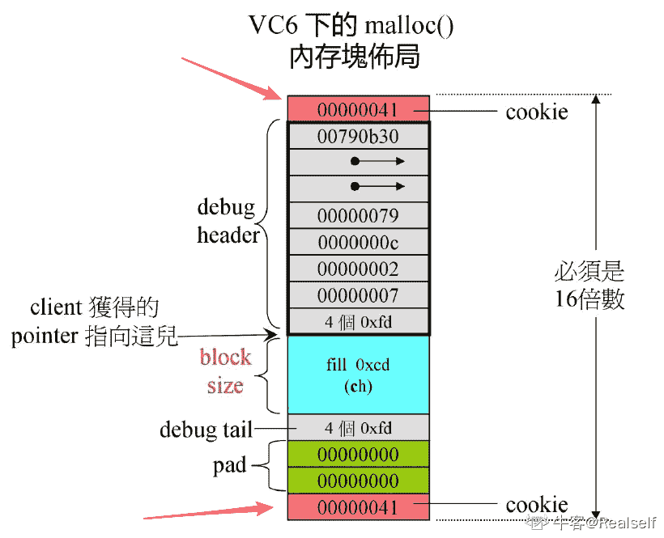
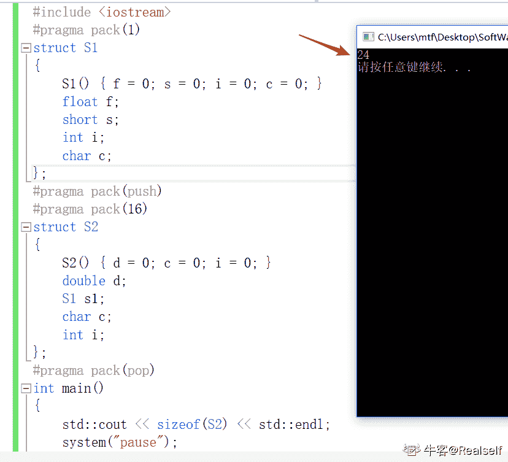
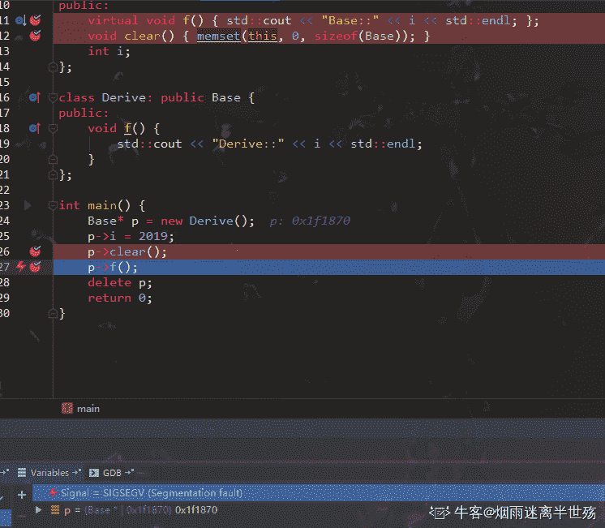

# 搜狐畅游 2020 校招笔试 - 游戏开发工程师（C ）

## 1

以下四款游戏中，哪一款更有可能是 TapTap 上评分达到 8.0 以上的手游？

正确答案: A   你的答案: 空 (错误)

```cpp
流言侦探
```

```cpp
Apex 英雄
```

```cpp
蓝月传奇
```

```cpp
一起来捉妖
```

本题知识点

设计 搜狐畅游 数据库工程师 Java 工程师 财务 游戏策划 数据分析师 项目经理 C++工程师 市场 用户研究员 游戏研发工程师 运维工程师 游戏运营 2020 2021

讨论

[李 danran](https://www.nowcoder.com/profile/5363114)

```cpp
Apex 英雄目前评分 8.9 -2020.1.8
```

发表于 2020-01-08 16:27:37

* * *

[Ankh_L](https://www.nowcoder.com/profile/4545347)

虽然前面大多数都知道,但是这真的是 JAVA 开发工程师的题目吗😓

发表于 2020-03-24 15:04:49

* * *

[Asunaの楠世](https://www.nowcoder.com/profile/183417247)

apex 不是手游啊！一刀 999 就不用提了，捉妖是抄袭宝可梦 GO，即使没听过第一个排除法这也做出来了

发表于 2020-03-21 18:39:44

* * *

## 2

以下哪款游戏不是当下主流的电子竞技项目？

正确答案: C   你的答案: 空 (错误)

```cpp
英雄联盟
```

```cpp
CS.GO
```

```cpp
崩坏 3
```

```cpp
王者荣耀
```

本题知识点

设计 搜狐畅游 数据库工程师 Java 工程师 财务 游戏策划 数据分析师 项目经理 C++工程师 市场 用户研究员 游戏研发工程师 运维工程师 游戏运营 2020 2021

讨论

[xq7012](https://www.nowcoder.com/profile/717756269)

天啊 CSGO 都是主流了吗（狗头

发表于 2020-03-24 23:41:59

* * *

[Coder-Star](https://www.nowcoder.com/profile/1408953)

123

发表于 2021-11-04 19:02:46

* * *

[彩贺琴](https://www.nowcoder.com/profile/573873479)

崩坏 3 是 ACT 手游，别信楼下

发表于 2020-09-08 17:06:17

* * *

## 3

如下四款手机游戏中，哪款游戏类型和其他三款不一样？

正确答案: D   你的答案: 空 (错误)

```cpp
我叫 MT
```

```cpp
小冰冰传奇
```

```cpp
皇室战争
```

```cpp
决战平安京
```

本题知识点

设计 搜狐畅游 数据库工程师 Java 工程师 财务 游戏策划 数据分析师 项目经理 C++工程师 市场 用户研究员 游戏研发工程师 运维工程师 游戏运营 2020

讨论

[某只锦鲤](https://www.nowcoder.com/profile/362915100)

决战平安京：《阴阳师》IP 公平竞技对战 MOBA 手游皇室战争：即时策略、MOBA 以及卡牌等元素手游小冰冰传奇：卡牌类手机游戏我叫 MT：3DMMORPG 手游

发表于 2020-03-19 15:07:37

* * *

## 4

以下哪款游戏不属于 FPS 类游戏的范畴？

正确答案: C   你的答案: 空 (错误)

```cpp
CS 1.6
```

```cpp
雷神之锤
```

```cpp
地下城与勇士
```

```cpp
逆战
```

本题知识点

设计 搜狐畅游 数据库工程师 Java 工程师 财务 游戏策划 数据分析师 项目经理 C++工程师 市场 用户研究员 游戏研发工程师 运维工程师 游戏运营 2020 营销 2021

讨论

[知悉者也](https://www.nowcoder.com/profile/111682374)

fps 在这里表示[第一人称射击游戏](https://zh.wikipedia.org/wiki/%E7%AC%AC%E4%B8%80%E4%BA%BA%E7%A7%B0%E5%B0%84%E5%87%BB%E6%B8%B8%E6%88%8F)（First Person Shooter），除了 DNF【地下城与勇士】外，其他 3 个选项都是 FPS 游戏

发表于 2019-12-22 11:20:27

* * *

[某只锦鲤](https://www.nowcoder.com/profile/362915100)

地下城与勇士：角色扮演 2d 游戏

发表于 2020-03-19 15:09:38

* * *

## 5

以下哪款产品不是家用电视类主机？

正确答案: B   你的答案: 空 (错误)

```cpp
Xbox One
```

```cpp
PSP
```

```cpp
PS4
```

```cpp
wii
```

本题知识点

设计 搜狐畅游 数据库工程师 Java 工程师 财务 游戏策划 数据分析师 项目经理 C++工程师 市场 用户研究员 游戏研发工程师 运维工程师 游戏运营 2020 2021

讨论

[宇空·零](https://www.nowcoder.com/profile/200053465)

psp 是掌机

发表于 2020-01-06 14:37:53

* * *

[江居士](https://www.nowcoder.com/profile/956646736)

PSP 是掌上游戏机

发表于 2020-09-22 16:20:12

* * *

## 6

以下哪款游戏属于国创 IP 衍生游戏？

正确答案: B   你的答案: 空 (错误)

```cpp
一拳超人
```

```cpp
斗破苍穹
```

```cpp
Love Live
```

```cpp
精灵宝可梦
```

本题知识点

设计 搜狐畅游 数据库工程师 Java 工程师 游戏策划 数据分析师 项目经理 C++工程师 用户研究员 游戏研发工程师 运维工程师 游戏运营 2020 2021

讨论

[最爱小怪兽](https://www.nowcoder.com/profile/193667259)

三十年河东，三十年河西，莫欺少年穷

发表于 2020-04-19 20:45:57

* * *

[白驹过隙、](https://www.nowcoder.com/profile/7052607)

d

发表于 2020-01-03 15:56:22

* * *

## 7

以下哪款不属于《魔兽世界》的资料片？

正确答案: B   你的答案: 空 (错误)

```cpp
燃烧的远征
```

```cpp
虚空之遗
```

```cpp
争霸艾泽拉斯
```

```cpp
巫妖王之怒
```

本题知识点

设计 搜狐畅游 数据库工程师 Java 工程师 游戏策划 数据分析师 项目经理 C++工程师 用户研究员 游戏研发工程师 运维工程师 游戏运营 2020 2021

讨论

[上岸吧兄 dei](https://www.nowcoder.com/profile/646722939)

 魔兽世界 1.0 
魔兽世界：战场争锋 1.5 
魔兽世界：进百军黑翼之巢 1.6 
魔兽世界：血神的复苏 1.7 
魔兽世界：噩度梦之龙 1.8 
魔兽世界：安其拉之门 1.9 
魔兽世界：勇者归来 1.10 
魔兽世界：纳克萨玛斯之影 1.11 
魔兽世界：战鼓震问天 1.12 
魔兽世界答：燃烧的远征 (A)
魔兽世界：风暴前夕 2.0 
魔兽世界：黑暗神殿 2.1 
魔兽世界：祖阿曼 2.3 
魔兽世界：太专阳之井 2.4 
魔兽世界：巫妖王之怒 (D)
魔兽世界：末日的回响 3.0 
魔兽世界：奥杜属尔的秘密 3.1 
魔兽世界：北伐的召唤 3.2 
魔兽世界：巫妖王的陨落 3.3
魔兽世界：末日浩劫 4.0 
魔兽世界：海加尔**4.1

2018 年 8 月 14 日《魔兽世界：争霸艾泽拉斯》正式上线 （C)[`zhidao.baidu.com/question/1859962154886422707.html`](https://zhidao.baidu.com/question/1859962154886422707.html) 

发表于 2020-04-12 04:06:34

* * *

[Sayuyu](https://www.nowcoder.com/profile/694690141)

[虚空之遗是即时战略游戏《星际争霸Ⅱ》的资料片](http://www.baidu.com/link?url=h4-OD7UP001JPqeXeF04cKuMDrqpsdpMdfMdKR1POJR93WZKuQECtm6gmkvYpTEtmrJXWi7vpYAvM4puHF4grqelEG-BKWCjNZwJykYdHPPzhc9h7mnggunC4q7w2YtwJe8kfcdfelK6IZRBpsqcT5YpPXMG7CtkdRgyUQLWy4xCA9n5aA8EOsxYq-dx9YUbwKUfA0iyUivVdq7a4boRTM8ONbMY-492cmczLw49a-gC94IrIqTKwVPorAgvDzqoM_U7lux_fKfBKhOtVcOFm9hl_K8BGEFgrb7M3L6jhTq)

发表于 2021-03-20 11:28:41

* * *

## 8

手游天龙八部 3D 的游戏类型是？

正确答案: D   你的答案: 空 (错误)

```cpp
ARPG
```

```cpp
SLG
```

```cpp
RTS
```

```cpp
MMORPG
```

本题知识点

设计 搜狐畅游 数据库工程师 Java 工程师 游戏策划 数据分析师 项目经理 C++工程师 用户研究员 游戏研发工程师 运维工程师 游戏运营 2020

讨论

[布鲁布鲁冒泡泡](https://www.nowcoder.com/profile/805954332)

ARPG（Action Role Playing Game）：动作角色扮演类游戏中

MMORPG（ Massive Multiplayer Online Role-Playing Game）：大型多人在线角色扮演游戏

SLG（Simulation Game）：策略游戏

RTS（Real-Time Strategy Game）：即时战略游戏，是策略游戏（Strategy Game）的一种

发表于 2020-02-21 22:40:51

* * *

[hugo201903151851484](https://www.nowcoder.com/profile/437092911)

ARPG（Action Role Playing Game），游戏术语，意思是动作角色扮演类游戏中，角色的动作（特别是攻击动作）与操作（如点击鼠标）相关的动作。 MMORPG，是英文 Massive（或 Massively）Multiplayer Online Role-PlayingGame 的缩写。

发表于 2020-01-18 15:41:55

* * *

## 9

以下哪款游戏不属于 Steam 平台？

正确答案: A   你的答案: 空 (错误)

```cpp
暗黑破环神
```

```cpp
Dota2
```

```cpp
彩虹六号
```

```cpp
绝地求生
```

本题知识点

设计 搜狐畅游 数据库工程师 Java 工程师 游戏策划 数据分析师 项目经理 C++工程师 用户研究员 游戏研发工程师 运维工程师 游戏运营 2020 2021

讨论

[暖风先生](https://www.nowcoder.com/profile/7155258)

暗黑是暴雪的

发表于 2020-02-29 20:54:50

* * *

## 10

以下属于 ARPG 类型的游戏是？

正确答案: C   你的答案: 空 (错误)

```cpp
海岛奇兵
```

```cpp
王者荣耀
```

```cpp
地下城与勇士
```

```cpp
皇室战争
```

本题知识点

设计 搜狐畅游 数据库工程师 Java 工程师 游戏策划 数据分析师 项目经理 C++工程师 用户研究员 游戏研发工程师 运维工程师 游戏运营 2020

讨论

[P-ShineBeam](https://www.nowcoder.com/profile/945440246)

ARPG（Action Role Playing Game），游戏术语，意思是动作角色扮演类游戏中，角色的动作（特别是攻击动作）与操作（如点击鼠标）相关的动作。

发表于 2020-02-17 18:46:07

* * *

## 11

SLG 是指以下哪种游戏类型？

正确答案: D   你的答案: 空 (错误)

```cpp
即时战略游戏
```

```cpp
第一人称设计游戏
```

```cpp
多人在线战术竞技游戏
```

```cpp
模拟战略游戏
```

本题知识点

设计 搜狐畅游 数据库工程师 Java 工程师 财务 游戏策划 数据分析师 项目经理 C++工程师 市场 用户研究员 游戏研发工程师 运维工程师 游戏运营 2020 营销 2021 运营

讨论

[布鲁布鲁冒泡泡](https://www.nowcoder.com/profile/805954332)

ARPG（Action Role Playing Game）：动作角色扮演类游戏

MMORPG（ Massive Multiplayer Online Role-Playing Game）：大型多人在线角色扮演游戏

SLG（Simulation Game）：策略游戏、模拟战略游戏

RTS（Real-Time Strategy Game）：即时战略游戏，是策略游戏（Strategy Game）的一种

FPS（First Person Shooting 第一人称射击游戏）

发表于 2020-02-21 22:47:05

* * *

## 12

英雄联盟的开发商 Riot 被哪家公司收购？

正确答案: A   你的答案: 空 (错误)

```cpp
腾讯
```

```cpp
畅游
```

```cpp
盛趣
```

```cpp
完美世界
```

本题知识点

设计 搜狐畅游 数据库工程师 Java 工程师 财务 游戏策划 数据分析师 项目经理 C++工程师 市场 用户研究员 游戏研发工程师 运维工程师 游戏运营 2020 2021

讨论

[追寻原风景](https://www.nowcoder.com/profile/860792)

拳头公司

发表于 2020-06-22 23:28:15

* * *

## 13

谷歌人工智能团队 Deepmind 在开发围棋 AI AlphaGo 之后
，又针对哪款游戏开发了 AI？

正确答案: B   你的答案: 空 (错误)

```cpp
Dota2
```

```cpp
星际争霸 2
```

```cpp
英雄联盟
```

```cpp
皇室战争
```

本题知识点

设计 搜狐畅游 数据库工程师 Java 工程师 财务 游戏策划 数据分析师 项目经理 C++工程师 市场 用户研究员 游戏研发工程师 运维工程师 游戏运营 2020 2021

讨论

[卡咔咯咖](https://www.nowcoder.com/profile/908179179)

DOTA2 是 OPEN-AI，与谷歌团队无关

发表于 2020-03-31 14:28:01

* * *

## 14

RTS 是以下哪一类游戏的简称？

正确答案: A   你的答案: 空 (错误)

```cpp
即时战略游戏
```

```cpp
模拟战略游戏
```

```cpp
大型多人在线游戏
```

```cpp
策略卡牌游戏
```

本题知识点

设计 搜狐畅游 数据库工程师 Java 工程师 财务 游戏策划 数据分析师 项目经理 C++工程师 市场 用户研究员 游戏研发工程师 运维工程师 游戏运营 2020

讨论

[小啊啾会发光](https://www.nowcoder.com/profile/833120440)

Real-time strategy game 即时战略游戏

发表于 2020-03-03 10:46:12

* * *

## 15

《魔兽世界》的现付费模式是？

正确答案: C   你的答案: 空 (错误)

```cpp
点卡付费
```

```cpp
免费下载道具付费
```

```cpp
月卡付费
```

```cpp
点卡道具双收费
```

本题知识点

设计 搜狐畅游 数据库工程师 Java 工程师 财务 游戏策划 数据分析师 项目经理 C++工程师 市场 用户研究员 游戏研发工程师 运维工程师 游戏运营 2020 2021

讨论

[这是一只熊猫](https://www.nowcoder.com/profile/226309918)

我记得 wow 推出游戏内购了呀

发表于 2020-04-26 17:18:23

* * *

## 16

下列对常用电器节电的说法不成立的是

正确答案: D   你的答案: 空 (错误)

```cpp
将液晶电视动态模式改为影院模式，可省约 40%的耗电量
```

```cpp
空调只要提高 1 摄氏度制冷时的温度设定，便可以节点约 10%
```

```cpp
使用电脑采用中等亮度，有利于保护视力，省电
```

```cpp
灵活使用电脑内置的节电程序，不能取得很明显的节电效果
```

本题知识点

设计 搜狐畅游 数据库工程师 Java 工程师 财务 游戏策划 数据分析师 项目经理 C++工程师 市场 用户研究员 游戏研发工程师 运维工程师 游戏运营 2020 2021

## 17

2016 年 3 月，AlphaGo 对战世界围棋冠军，职业九段选手李世石，并且以 4:1 的比分击败了李世石，AlphaGo 的工作原理基于下列哪项技术？

正确答案: D   你的答案: 空 (错误)

```cpp
基因编辑
```

```cpp
纳米技术
```

```cpp
量子计算
```

```cpp
深度学习
```

本题知识点

设计 搜狐畅游 数据库工程师 Java 工程师 财务 游戏策划 数据分析师 项目经理 C++工程师 市场 用户研究员 游戏研发工程师 运维工程师 游戏运营 2020 2021

## 18

夏天，打开冰箱冷冻室的门，常常看到冷冻室中冒出一股白雾，这是

正确答案: D   你的答案: 空 (错误)

```cpp
冰箱里原有水蒸气凝结成小水滴
```

```cpp
冰箱里的冰升华后凝结成小水滴
```

```cpp
冰箱里的水变成水蒸气
```

```cpp
冰箱外部空气中的水变成小水滴
```

本题知识点

设计 搜狐畅游 数据库工程师 Java 工程师 项目经理 游戏策划 数据分析师 C++工程师 用户研究员 游戏研发工程师 运维工程师 游戏运营 2020 2021

讨论

[追寻原风景](https://www.nowcoder.com/profile/860792)

打开冰箱冷冻室的门时，冰箱内的低温气体飘散到冰箱外。使周围空气中平时看不见的水蒸气迅速冷却液化，成为很多微小水珠形成了“白雾”。

发表于 2020-06-22 23:31:48

* * *

## 19

从 3 月下旬到 10 月上旬，太阳在地球上直射位置的移动规律是：

正确答案: B   你的答案: 空 (错误)

```cpp
赤道-南回归线-赤道
```

```cpp
赤道-北回归线-赤道
```

```cpp
南回归线-赤道-北回归线
```

```cpp
北回归线-赤道-南回归线
```

本题知识点

设计 搜狐畅游 数据库工程师 Java 工程师 项目经理 游戏策划 数据分析师 C++工程师 用户研究员 游戏研发工程师 运维工程师 游戏运营 2020 2021

讨论

[冷夜辉月](https://www.nowcoder.com/profile/513554458)

春分（3 月份）在赤道，然后往北移，夏至（6 月份）到北回归线，然后往南移，秋分（9 月份）到赤道，继续往南移，冬至（12 月份）到南回归线，然后往北移，春分（3 月份）回到赤道

发表于 2020-02-20 12:48:55

* * *

## 20

关于宇航员在太空中的生活，下列说法中不正确的是：

正确答案: B   你的答案: 空 (错误)

```cpp
宇航员可以使用特定的加热器对食品加热
```

```cpp
宇航员从太空返回地面之后，由于失重，质量会有所增加
```

```cpp
宇航员应该睡在固定的睡袋中，以免被气流推动误碰仪器设备开关
```

```cpp
在同一航空器中的宇航员可以直接交谈，无需借助无线电通信设备
```

本题知识点

设计 搜狐畅游 数据库工程师 Java 工程师 财务 游戏策划 数据分析师 项目经理 C++工程师 市场 用户研究员 游戏研发工程师 运维工程师 游戏运营 2020 2021

讨论

[游生生](https://www.nowcoder.com/profile/370876119)

质量是物体的本质属性，在哪都不会改变

发表于 2020-03-12 21:11:35

* * *

[FireGogog](https://www.nowcoder.com/profile/308678318)

答:可以直接交谈。比如王亚平在太空授课时的几名宇航员就是直接交谈。因为它们生活的航空器内是仿地面自然环境的,即里面是有正常空气的,所以可以直接交谈

发表于 2020-09-13 02:41:36

* * *

[朧](https://www.nowcoder.com/profile/569378856)

在失重状态下人的骨密度会下降，严重的还要治疗骨质疏松，所以应该质量下降。

发表于 2021-04-10 15:25:54

* * *

## 21

下列未涉及无人机领域的公司是：

正确答案: D   你的答案: 空 (错误)

```cpp
3D Robotics
```

```cpp
Parrot
```

```cpp
DJI
```

```cpp
Momenta
```

本题知识点

设计 搜狐畅游 数据库工程师 Java 工程师 财务 游戏策划 数据分析师 项目经理 C++工程师 市场 用户研究员 游戏研发工程师 运维工程师 游戏运营 2020 2021

讨论

[SouthBegonia](https://www.nowcoder.com/profile/5845064)

3D Robotics：北美最大民用无人机厂商；Parrot：1994 年成立于法国巴黎，三大无人机制造厂商之一以及最早的无人机制作商；DJI 大疆，这不用说吧；Momenta：是一家自动驾驶公司，定位于打造自动驾驶大脑，其核心技术是基于深度学习的环境感知，高精度地图，驾驶决策算法。

发表于 2020-02-18 16:08:03

* * *

## 22

比特币没有基于以下哪中技术：

正确答案: A   你的答案: 空 (错误)

```cpp
B2C 网络技术
```

```cpp
加密技术
```

```cpp
时间戳技术
```

```cpp
区块链技术
```

本题知识点

设计 搜狐畅游 数据库工程师 Java 工程师 财务 游戏策划 数据分析师 项目经理 C++工程师 市场 用户研究员 游戏研发工程师 运维工程师 游戏运营 2020 2021

讨论

[SouthBegonia](https://www.nowcoder.com/profile/5845064)

B2C：Business-to-Customer 的缩写，而其中文简称为“[商对客](https://www.baidu.com/s?wd=%E5%95%86%E5%AF%B9%E5%AE%A2&tn=SE_PcZhidaonwhc_ngpagmjz&rsv_dl=gh_pc_zhidao)”。“商对客”是电子商务的一种模式，也就是通常说的直接面向消费者销售产品和服务商业零售模式。

发表于 2020-02-18 16:09:51

* * *

## 23

射频识别的英文简称为：

正确答案: A   你的答案: 空 (错误)

```cpp
RFID
```

```cpp
LTE
```

```cpp
NFC
```

```cpp
MID
```

本题知识点

设计 搜狐畅游 数据库工程师 Java 工程师 财务 游戏策划 数据分析师 项目经理 C++工程师 市场 用户研究员 游戏研发工程师 运维工程师 游戏运营 2020 2021

讨论

[SouthBegonia](https://www.nowcoder.com/profile/5845064)

RFID（Radio Frequency Identification 射频识别），其原理为阅读器与标签之间进行非接触式的数据通信，达到识别目标的目的；[LTE](https://baike.baidu.com/item/LTE)（Long Term Evolution，长期演进)，无线数据通信技术标准； NFC（Near Field Communication，近场通信），由非接触式射频识别（[RFID](https://baike.baidu.com/item/RFID/497249)）及互连互通技术整合演变而来的，通过在单一芯片上集成感应式读卡器、感应式卡片和点对点通信的功能，利用移动终端实现移动支付、电子票务、门禁、移动身份识别、防伪等应用；MID（Mobile Internet Device，[移动互联网设备](https://baike.baidu.com/item/%E7%A7%BB%E5%8A%A8%E4%BA%92%E8%81%94%E7%BD%91%E8%AE%BE%E5%A4%87/2462426)）。

发表于 2020-02-18 16:14:02

* * *

[张大坏](https://www.nowcoder.com/profile/964884243)

A

发表于 2021-11-15 12:18:02

* * *

## 24

下列功能中不属于互联网地理信息服务的是：

正确答案: D   你的答案: 空 (错误)

```cpp
提供地图服务接口与 API
```

```cpp
地理空间信息分析处理
```

```cpp
地理信息浏览查询
```

```cpp
数据安全管理与维护
```

本题知识点

设计 搜狐畅游 数据库工程师 Java 工程师 财务 游戏策划 数据分析师 项目经理 C++工程师 市场 用户研究员 游戏研发工程师 运维工程师 游戏运营 2020 2021

## 25

以下不是互联网常见的商业模式：

正确答案: D   你的答案: 空 (错误)

```cpp
流量变现模式
```

```cpp
佣金分成模式
```

```cpp
增值服务模式
```

```cpp
项目结算模式
```

本题知识点

设计 搜狐畅游 数据库工程师 Java 工程师 财务 游戏策划 数据分析师 项目经理 C++工程师 市场 用户研究员 游戏研发工程师 运维工程师 游戏运营 2020 2021

讨论

[SouthBegonia](https://www.nowcoder.com/profile/5845064)

流量变现模式：是指将网站流量（线上的人流量）通过某些手段（会员、广告）实现现金收益

发表于 2020-02-18 16:16:45

* * *

## 26

下面代码的输出结果是什么？
#include <stdio.h>

void main()
{
const char* s1 = "0123456789";
char s2[] = "0123456789";
char s3[100] = "0123456789";
char s4[100];
char* s5 = s3;

printf("%d, %d, %d, %d, %d\n", sizeof(s1), sizeof(s2), sizeof(s3), sizeof(s4), sizeof(s5));
}

正确答案: A   你的答案: 空 (错误)

```cpp
4, 11, 100, 100, 4
```

```cpp
11, 11, 100, 100, 4
```

```cpp
10, 10, 10, 1, 4
```

```cpp
4, 11, 11, 4, 4
```

本题知识点

C++工程师 游戏研发工程师 搜狐畅游 2020

讨论

[烟雨迷离半世殇](https://www.nowcoder.com/profile/991806079)

解析部分：

在 32 位系统中（不知道为啥非得是 32 位）在 C++中一个指针类型是**4**个字节（所以 const char*为 4 个字节大小）一个 char 类型是**1**一个字节（所以 char s2[] = "0123456789";是 11 个字节大小，因为还隐藏了一个终止符'/'）第三个和第四个都开辟了 100 个内存空间，所以都是 100，注意和上面说的 char[]进行对比，避免出现内存溢出的情况第五个还是一个指针，所以答案还是**4**

拓展部分：

来自：[`www.cnblogs.com/huyihao/p/5984610.html`](https://www.cnblogs.com/huyihao/p/5984610.html)

一、整形

int 占据操作系统一个内存单元的大小。long 跟 int 相同 

早先 16 位操作系统一个内存单元是 16 位，所以是 2 个字节；32 位系统一个内存单元是是 32 位，所以是 4 字节；64 位操作系统中 int 同样占 32 位，即 4 个字节。

二、字符型

char 类型通常占据一个字节，对于用于扩展字符集的 wchar_t 类型，需要占据两个字节。 

三、布尔型

bool 占据一个字节 

四、浮点型

float 占据 4 个字节，double 是 float 的两倍即 8 个字节 

五、指针

一个指针的位数和操作系统的位数是相等的，即 32 位系统是 4 个字节，64 位系统是 8 个字节。

编辑于 2020-02-02 15:40:05

* * *

## 27

下面代码的输出结果是什么？
#include <stdio.h>

void main()
{
int x = 10;
int y = 10;
int z = 10;
for (z = 0; x > 8; y = z++)
{
printf("%d,%d,", x--, y);
}
}

正确答案: B   你的答案: 空 (错误)

```cpp
10, 0, 9, 1
```

```cpp
10, 10, 9, 0
```

```cpp
10, 1, 9, 2
```

```cpp
9, 10, 8, 0
```

本题知识点

C++工程师 游戏研发工程师 搜狐畅游 2020

讨论

[牛客 419406753 号](https://www.nowcoder.com/profile/419406753)

y=z++，先赋值后自增

发表于 2021-02-22 10:29:23

* * *

[SouthBegonia](https://www.nowcoder.com/profile/5845064)

10，10，9 大家应该很轻易算出，容易出错的在两次 y：第一次打印 y=10，是原有的初始值；第二次打印 y 前，执行上次循环末的 y=z++，z 在当次 for 内为 0，后++结果依旧为 0，因此 y=0（注：y=z++执行完，就算完成一条语句，在花括号内 z 才为 1）

发表于 2020-02-18 16:29:44

* * *

## 28

C++中空类编译器不会产生以下哪个成员函数？
class Empty
{
};

正确答案: C   你的答案: 空 (错误)

```cpp
析构函数
```

```cpp
拷贝构造函数
```

```cpp
私有构造函数
```

```cpp
赋值函数
```

本题知识点

C++工程师 游戏研发工程师 搜狐畅游 2020 C++

讨论

[牛客职导官方账号](https://www.nowcoder.com/profile/897353)

【正确答案】C
【解析】空类  查看全部)

编辑于 2021-11-18 08:51:16

* * *

[Realself](https://www.nowcoder.com/profile/831729261)

*   当类为空时，编译器会为这个类合成构造函数、析构函数、拷贝构造函数、赋值重载函数

    ```cpp
    class Demo
    {

    };
    void func()
    {
        Demo d1,d2,d5;//默认构造函数
        Demo d3(d1);//默认拷贝构造函数
        Demo d4 = d2;//默认拷贝构造函数
        d5 = d4;//默认赋值重载

        //局部对象自动销毁，调用默认析构函数
    }
    int main()
    {
        func();
        return 0;
    }
    ```

*   没有私有构造函数，编译器合成的默认函数都是 public 的，不是 private，如果类中构造函数是私有的，就不能在类的外部创建对象（在内部还是可以创建，要在外部使用对象，就要用到静态函数）

    ```cpp
    class Demo
    {
    public:
        static Demo * getObject()//为了返回对象持久存在，返回堆上对象指针
        {
            Demo d;//类的内部还是可以创建对象
            return new Demo();
        }
        int geta()
        {
            return a;
        }
        void destroy()
        {
            delete this;
        }
    private:
        Demo() :a(0){}
        int a;
    };
    int main()
    {
        Demo *p = Demo::getObject();
        p->geta();
        p->destroy();
        return 0;
    }
    ```

    所以，这题应该选 C

发表于 2020-03-21 14:14:17

* * *

[牛客 448541754 号](https://www.nowcoder.com/profile/448541754)

C

发表于 2021-10-21 11:40:24

* * *

## 29

以下两种情况：
(1) new 1 个长度为 10 的整型的数组。
(1) 分 10 次 new 一个长度为 1 的整型的数组。
哪个占用系统的空间更多些？

正确答案: B   你的答案: 空 (错误)

```cpp
1
```

```cpp
2
```

```cpp
一样多
```

```cpp
不确定
```

本题知识点

C++工程师 游戏研发工程师 搜狐畅游 2020

讨论

[Realself](https://www.nowcoder.com/profile/831729261)

*   new 是通过调用底层的 malloc()函数来获得内存的，VC6 下内存块的布局如下
    
*   void *malloc(unsigned int block_size)函数获得的内存，其大小不是等于 block_size，而是比 block_size 大，多的部分存放着必要的辅助信息，其中上下都有指示内存块大小的 cookie，每调用一次 malloc()，上下就会包含 cookie
*   new 1 个长度为 10 的整型的数组，只会调用 1 次 malloc(),获得的内存块只会包含一对 cookie
*   分 10 次 new 一个长度为 1 的整型的数组，就会调用 10 次 malloc()，获得的内存块就会包含 10 对 cookie，虽然实际的 block_size 大小也是 10 个 int 大小，但是却占用了系统多的内存
*   所以标准库的分配器 std::allocator 会一次获得一大片内存，尽量减少 malloc()的调用次数

发表于 2020-03-21 14:41:57

* * *

## 30

以下输出的结果是
#include <iostream>
#pragma pack(2)
struct S1
{
    S1() { f = 0; s = 0; i = 0; c = 0; }
    float f;
    short s;
    int i;
    char c;
};

#pragma pack(push)
#pragma pack(16)
struct S2
{
    S2() { d = 0; c = 0; i = 0; }
    double d;
    S1 s1;
    char c;
    int i;
};
#pragma pack(pop)

int main()
{
    std::cout << sizeof(S2) << std::endl;
}

正确答案: B   你的答案: 空 (错误)

```cpp
48
```

```cpp
32
```

```cpp
28
```

```cpp
24
```

本题知识点

C++工程师 游戏研发工程师 搜狐畅游 2020

讨论

[烟雨迷离半世殇](https://www.nowcoder.com/profile/991806079)

S1float 占 4 个字节 short 占 2 个字节 int 占 4 个字节 char 占 1 个字节 S2double 占 8 个字节 S1 展开另算 char 占 1 个 int 占 4 个

结构体在内存中的存放按单元进行存放，每个单元的大小取决于结构体中最大基本类型的大小，为了优化性能会自动进行内存对齐，整个结构体的大小必须是最大成员变量类型所占字节数的整数倍

#pragma pack(16)定义补齐方式为 16 字节（在这里其实和 32 位默认的对齐方式也没差，用 S1 的 double 作为最宽长度即可）
所以，S2 就是先算 S2 自带的：double(8)+char(1->4)+int(4)=16 再单独算 S1：float(4)+short(2->4)+int(4)+char(1->4)=16 所以 S2 所占总空间为 32

对于 C++类，结构体分配内存拓展阅读：

[`blog.csdn.net/chen1234520nnn/article/details/83341266`](https://blog.csdn.net/chen1234520nnn/article/details/83341266)[`www.cnblogs.com/-zhangnian/p/6422559.html`](https://www.cnblogs.com/-zhangnian/p/6422559.html)[`www.cnblogs.com/linuxAndMcu/p/10389096.html`](https://www.cnblogs.com/linuxAndMcu/p/10389096.html)[`blog.csdn.net/GAMEloft9/article/details/47440941`](https://blog.csdn.net/GAMEloft9/article/details/47440941)

发表于 2020-01-16 10:50:52

* * *

[Realself](https://www.nowcoder.com/profile/831729261)

结构体对齐的规则大家都清楚，着重说一下结构体中嵌套结构体的情况：**以我的测试看来，结构体内的结构体不是展开另算**，如有错误，欢迎批评改正

```cpp
#pragma pack(n)  表示的是设置 n 字节对齐
    1.对于结构的各个成员，第一个成员位于偏移为 0 的位置，以后的每个数据成员的偏移量(相对于首地址)必须是 
            min(这个数据成员的自身长度,n)的倍数
    2.在所有的数据成员完成各自对齐之后，结构或联合体本身也要进行对齐，也就是总大小必须是
            min(长度最长的基本数据成员,n)的倍数
基本数据成员：char,short int,int,float,double 等
```

*   S2 大小为 32，S1 的大小为 12，计算方式如下

    ```cpp
    #pragma pack(2)
    struct S1
    {
    S1() { f = 0; s = 0; i = 0; c = 0; }
    float f;//4 字节【规则 1 偏移量 0】
    short s;//2 字节【规则 1,偏移量 2，是 min(2,2)=2 的倍数】
    int i;//4 字节【规则 1，偏移量 6，是 min(4,2)=2 的倍数】
    char c;//1+1 字节【规则 1，偏移量 10，是 min(1,2)的倍数】
    };//【规则 2，总字节大小 4+4+2+1=11 字节，不是 min(4,2)=2 的倍数，在最后一个数据成员处补 1 字节，以对齐】->总大小 12 字节
    #pragma pack(16)
    struct S2
    {
    S2() { d = 0; c = 0; i = 0; }
    double d;//8 字节
    S1 s1;//S1 没有展开，按 12 字节不变，按规则 1 以 1 字节对齐，相当于 char ss[12]
    char c;//1 字节【规则 1，偏移量 20，满足】+3 字节
    int i;//4 字节【规则 1，偏移量 21，不是 min(4,16)=4 的整数倍，在上一个数据成员后补 3 字节，使偏移量为 24】+4 字节
    };//【规则 2，总大小 8+12+(1+3)+4=28 字节，不是 min(8,16)=8 的倍数，在最后一个数据成员处补 4 字节,使总大小为 32 以对齐】->总大小 32 字节
    ```

*   之所以这题将 S1 展开算也是 32,是因为 S1 上的设置的是按 2 字节对齐#pragma pack(2)，若设置的按 1 字节对齐#pragma pack(1)，展开算依然是 32，但是实际大小却是 24
    

编辑于 2020-03-21 16:57:23

* * *

## 31

#include  <iostream>#include <cstring>

class Base {
public:
    virtual void f() { std::cout << "Base::" << i << std::endl; };
    void clear() { memset(this, 0, sizeof(Base)); }
    int i;
};

class Derive: public Base {
public:
    void f() {
        std::cout << "Derive::" << i << std::endl;
    }
};

int main() {
    Base* p = new Derive();
    p->i = 2019; 
    p->clear();
    p->f();
    delete p;
    return 0;
}

正确答案: D   你的答案: 空 (错误)

```cpp
Base::0
```

```cpp
Derive::0 
```

```cpp
Derive::2019 
```

```cpp
异常
```

本题知识点

C++工程师 游戏研发工程师 搜狐畅游 2020

讨论

[烟雨迷离半世殇](https://www.nowcoder.com/profile/991806079)

正常来说会申请 int(4)个内存空间，但是 memset(this, 0, sizeof(Base)); 会申请 8 个，因为 C++为了实现多态机制，所有有虚函数的对象都会有一个指向一个虚函数表的指针，而使用 memset 时会把这个虚函数指针也给重置为 0，从而造成指针与表的连接断开，从而引发异常注意这里的 Derive 的 f 函数省略了 override 修饰符 **拓展阅读：C++虚函数详解****[`blog.csdn.net/haoel/article/details/1948051`](https://blog.csdn.net/haoel/article/details/1948051)**

编辑于 2020-01-17 11:17:32

* * *

## 32

有如下程序：执行后的输出结果应该是：
#include 
class BASE{
public:
~BASE(){cout<<"BASE"；}
}；
class DERIVED: public BASE{
public:
~DERIVED(){cout<<"DERIVED"；}
}；
void main(){DERIVED x；}

正确答案: D   你的答案: 空 (错误)

```cpp
BASE
```

```cpp
DERIVED
```

```cpp
BASEDERIVED
```

```cpp
DERIVEDBASE
```

本题知识点

C++工程师 游戏研发工程师 搜狐畅游 2020

讨论

[公众号「我不是匠人」](https://www.nowcoder.com/profile/936070)

构造函数的调用顺序是：先基类再派生类。析构函数的调用顺序与构造函数相反：先析构派生类，再析构基类。

编辑于 2019-12-20 13:02:01

* * *

## 33

下面描述中，表达错误的是：

正确答案: B   你的答案: 空 (错误)

```cpp
公有继承时，基类中的 public 成员在派生类中仍是 public 的
```

```cpp
公有继承时，基类中的 private 成员在派生类中仍是 private 的
```

```cpp
公有继承时，基类中的 protected 成员在派生类中仍是 protected 的
```

```cpp
私有继承时，基类中的 public 成员在派生类中是 private 的
```

本题知识点

C++工程师 游戏研发工程师 搜狐畅游 2020

讨论

[公众号「我不是匠人」](https://www.nowcoder.com/profile/936070)

private 在派生类中都是**隐藏的**。

发表于 2019-12-20 13:00:23

* * *

[风拔萝卜](https://www.nowcoder.com/profile/7023473)

继承中的访问控制符，控制的是父类成员相对于子类对象和子类的子类的访问权限，并不改变父类成员在子类中的访问权限，这个题目应该选 D，B 选项没问题，子类中是可见不可访问而已，

发表于 2019-12-25 22:35:17

* * *

## 34

有如下类声明“class A{int x；……}；”，则 A 类的成员 x 是：

正确答案: B   你的答案: 空 (错误)

```cpp
公有数据成员
```

```cpp
私有数据成员
```

```cpp
公有成员函数
```

```cpp
私有成员函数
```

本题知识点

C++工程师 游戏研发工程师 搜狐畅游 2020

讨论

[小李今天刷题了吗👀](https://www.nowcoder.com/profile/104246017)

默认访问属性为私有

发表于 2020-03-08 18:35:02

* * *

## 35

有如下一段程序：
int f1(float)；
int f2(char)；
int f3(float)；
int f4(float)；
int（*pf）（float）；
则以下不合法的是：

正确答案: C   你的答案: 空 (错误)

```cpp
int（*p）（float）=&f1；
```

```cpp
pf=&f4；
```

```cpp
pf=&f2；
```

```cpp
pf=&f3；
```

本题知识点

C++工程师 游戏研发工程师 搜狐畅游 2020

讨论

[PureDeep](https://www.nowcoder.com/profile/2153932)

不能将 "int (*)(char)" 类型的值分配到 "int (*)(float)" 类型的实体

发表于 2020-03-21 09:52:05

* * *

## 36

有如下说明语句 int a[10]={1,2,3,4,5,6,7,8,9,10}；int *p=a；则数值为 9 的表达式是：

正确答案: B   你的答案: 空 (错误)

```cpp
*p+9
```

```cpp
*(p+8)
```

```cpp
*p+=9
```

```cpp
p+7
```

本题知识点

C++工程师 游戏研发工程师 搜狐畅游 2020

讨论

[孙燕姿](https://www.nowcoder.com/profile/315257096)

表达式“*p = a”说明 p 指向 a[0]的位置； 那么 *p + 9= a[0] + 9= 10; A 错； p 指向 a[0]的位置,则 p + 8 指向 a[8]的位置, 那么 *(p +8) = a[8] = 9; B 对； *p += 9； 等同于 a[0] += 9, 等同于 a[0] + 9 = 1 + 9= 10;C 错 p 是一个指针,p 的值本身是一个地址, D 错； 显然只有 B 正确；

编辑于 2020-03-24 18:47:30

* * *

## 37

有如下模板定义：
template T fun(T x,T y){return x*x+y*y；}
在下列对 fun 的调用中，错误的是：

正确答案: C   你的答案: 空 (错误)

```cpp
fun(2,8)
```

```cpp
fun(2.0,8.2)
```

```cpp
fun(2.3,8)
```

```cpp
fun<int>(2,8.3)
```

本题知识点

C++工程师 游戏研发工程师 搜狐畅游 2020

讨论

[李 danran](https://www.nowcoder.com/profile/5363114)

声明一个函数模板后，当编译系统发现有一个对应的函数调用时，将根据实参中的类型来确认是否与函数模板中的对应形参相匹配。AB 两项正确，第一个参数和第二个参数都是 int 类型；C 项错误，编译系统从第一个参数“3”获得信息“int”和从第二个参数“5.5”获得信息“double”两者类型不同，与函数模板不匹配；D 项正确，函数名后的<int>是模板实参表，编译系统会将 double 型的形参“5.5”自动转化成 int 类型。

发表于 2020-02-12 20:03:44

* * *

## 38

如下程序输出的结果是
#define MAX(a, b) ((a) > (b) ? a : b ) 
int main() 
{
 int a = 5, b = 0;
 int c = MAX(++a, b);
 int d = MAX(++a, b + 10);
 printf("%d %d %d %d\n", a, b, c, d);
 return 0;
}

正确答案: C   你的答案: 空 (错误)

```cpp
5 0 5 6
```

```cpp
7 0 7 10
```

```cpp
8 0 7 10
```

```cpp
7 0 5 10
```

本题知识点

C++工程师 游戏研发工程师 搜狐畅游 2020

讨论

[SouthBegonia](https://www.nowcoder.com/profile/5845064)

```cpp
// 此处为真，++a 执行两次
int c = ((++a) > (b) ? ++a : b );

// 此处为假，++a 执行一次
int d = ((++a) > (b+10) ? ++a : b+10 );

```

3 次++a 因此 a 最终结果为 8

发表于 2020-02-18 16:43:41

* * *

## 39

有如下程序：执行后的输出结果应该是：
#include
class cla{
static int n；
public:
cla(){n++；}
~cla(){n--；}
static int get_n(){return n；}
}；
int cla::n=0；
int main()
{
cla * p=new cla；
delete p；
cout<<"n="<<cla::get_n()<<endl；
return 0；
}

正确答案: A   你的答案: 空 (错误)

```cpp
n=0
```

```cpp
n=1
```

```cpp
n=3
```

```cpp
n=4
```

本题知识点

C++工程师 游戏研发工程师 搜狐畅游 2020

## 40

执行如下程序后的输出结果是：
#include
class test{
static int count；
public:
test(){count++；}
~test(){count--；}
static int getCount(){return count；}
}；
int test::count=0；
int main()
{
test * p=new test；
test * q=new test；
delete p；
cout<<"count="<<test::getCount()<<endl；
return 0；
}

正确答案: B   你的答案: 空 (错误)

```cpp
count=0
```

```cpp
count=1
```

```cpp
count=2
```

```cpp
count=3
```

本题知识点

C++工程师 游戏研发工程师 搜狐畅游 2020

## 41

关于类模板的说法正确的是：

正确答案: B   你的答案: 空 (错误)

```cpp
类模板的主要作用是生成抽象类
```

```cpp
类模板实例化时，编译器将根据给出的模板实参生成一个类
```

```cpp
在类模板中的数据成员具有同样类型
```

```cpp
类模板中的成员函数没有返回值
```

本题知识点

C++工程师 游戏研发工程师 搜狐畅游 2020

## 42

在 C++中不能被重载的一组运算符是：

正确答案: A   你的答案: 空 (错误)

```cpp
:: ?: . sizeof
```

```cpp
?: . sizeof ++ ->
```

```cpp
:: ?: new delete
```

```cpp
++ -- ?: sizeof
```

本题知识点

C++工程师 游戏研发工程师 搜狐畅游 2020

讨论

[-Metaphysics](https://www.nowcoder.com/profile/568308010)

不能重载的运算符只有 5 个：

.             （成员访问运算符）

.*            （成员指针访问运算符）

::             （域运算符）

sizeof    （长度运算符）

?:            （条件运算符）

发表于 2019-12-19 15:20:34

* * *

## 43

在深度为 5 的满二叉树中，叶子结点的个数为 ______

正确答案: C   你的答案: 空 (错误)

```cpp
32
```

```cpp
31
```

```cpp
16
```

```cpp
15
```

本题知识点

C++工程师 游戏研发工程师 搜狐畅游 2020

讨论

[拜托就给个 offer 吧](https://www.nowcoder.com/profile/454281615)

这题答案错的……n 层的满二叉树，共有 2^n - 1 个节点，所以答案是 31 个。

发表于 2020-09-02 13:18:18

* * *

[牛客 714656756 号](https://www.nowcoder.com/profile/714656756)

在深度为 n 的满二叉树中，有 2 的 n-1 次方个叶结点

发表于 2019-12-16 20:34:10

* * *

## 44

已知二叉树后序遍历序列是 dabec，中序遍历序列是 debac，它的前序遍历序列是

正确答案: A   你的答案: 空 (错误)

```cpp
cedba
```

```cpp
acbed
```

```cpp
decab
```

```cpp
deabc
```

本题知识点

C++工程师 游戏研发工程师 搜狐畅游 2020

讨论

[SouthBegonia](https://www.nowcoder.com/profile/5845064)

```cpp
      c
      /
     e
    /  \
   d    b
        \
         a
```

前序遍历：cedba 中序遍历：debac 后序遍历：dabec

发表于 2020-02-18 16:55:44

* * *

## 45

在下列几种排序方法中，要求内存量最大的是 ______。

正确答案: D   你的答案: 空 (错误)

```cpp
插入排序
```

```cpp
选择排序
```

```cpp
快速排序
```

```cpp
归并排序
```

本题知识点

C++工程师 游戏研发工程师 搜狐畅游 2020

讨论

[-怦然星动`](https://www.nowcoder.com/profile/674583763)

冒泡，选择，插入，希尔，堆排的空间复杂度都为 O(1)快排的空间复杂度为 O(logN)归并的空间复杂度为 O(N)

发表于 2020-09-08 13:01:55

* * *

## 46

针对函数体内声明的静态变量，以下说明正确的是：

正确答案: B C   你的答案: 空 (错误)

```cpp
变量是分配在栈空间的
```

```cpp
变量是可以通过指针在函数外调用的
```

```cpp
变量的空间是一直存在的
```

```cpp
变量的内存空间是第一次调用申请的
```

本题知识点

C++工程师 游戏研发工程师 搜狐畅游 2020

讨论

[Realself](https://www.nowcoder.com/profile/831729261)

*   我觉得 D 是对的，全局静态变量是在编译器期间分配内存的，存储在静态区，局部静态变量在第一次使用时分配内存并初始化，也就是运行时分配内存的，也分配在静态区
*   相关说明：

    > [`segmentfault.com/q/1010000004157283`](https://segmentfault.com/q/1010000004157283)

发表于 2020-03-21 17:14:40

* * *

[luckye24](https://www.nowcoder.com/profile/283047375)

请问为什么 D 不对呢？

发表于 2020-03-11 09:25:44

* * *

## 47

针对寄存器变量，以下说法正确的是：

正确答案: A C D   你的答案: 空 (错误)

```cpp
无法取寄存器变量的地址
```

```cpp
寄存器变量可以声明全局变量
```

```cpp
寄存器变量访问效率要比普通变量访问效率高
```

```cpp
声明寄存器变量时有可能不成功
```

本题知识点

C++工程师 游戏研发工程师 搜狐畅游 2020

讨论

[-Metaphysics](https://www.nowcoder.com/profile/568308010)

A.由于 register 变量使用的是硬件 CPU 中的寄存器，寄存器变量无地址，所以不能使用取地址运算符"&"求寄存器变量的地址。C.直接存储在寄存器上面的。D.寄存器是与机器硬件密切相关的，不同类型的计算机，寄存器的数目是不一样的，通常能够被声明为寄存器变量的寄存器为 3 到 4 个，对于在一个函数中说明的多于 3 到 4 个的寄存器变量，寄存器变量就声明失败，自动转换为普通变量。

编辑于 2019-12-25 09:37:46

* * *

## 48

针对内联函数说法正确的是：

正确答案: A B C   你的答案: 空 (错误)

```cpp
多次的内联函数调用，会增加代码段
```

```cpp
内联函数有可能会增加编译时间
```

```cpp
内联函数可以消除函数调用的时间
```

```cpp
内联函数执行效率和普通函数一样
```

本题知识点

C++工程师 游戏研发工程师 搜狐畅游 2020

讨论

[游生生](https://www.nowcoder.com/profile/370876119)

内联函数的定义：如果一个函数是内联的，则编译时，会把代码副本放在每一个调用函数的地方。也就是说，减少了调用函数的过程，效率加快。但代价是，函数做一点改动，每一个调用函数的代码都需要重新编译。ABC 正确。

发表于 2020-03-12 20:34:27

* * *

## 49

若有定义：char *str[] = {"one", "two", "three"}, **P=str;
则可以表示出字符't'的表达式是

正确答案: B D   你的答案: 空 (错误)

```cpp
*str+2
```

```cpp
*str[2]
```

```cpp
*(P+1)
```

```cpp
**++P
```

本题知识点

C++工程师 游戏研发工程师 搜狐畅游 2020

讨论

[拜托就给个 offer 吧](https://www.nowcoder.com/profile/454281615)

对于数组而言，数组名代表指向数组第一个元素的指针

发表于 2020-09-02 13:23:39

* * *

## 50

设有以下定义：
int a[3][4] = {1, 2, 3, 4, 5, 6, 7, 8, 9, 10, 11, 12}；
int (*ptr)[4] = a, *p = a[0];
则下列表达式中，能正确表示数组元素 a[2][1]的表达式有

正确答案: A B   你的答案: 空 (错误)

```cpp
*(p+9)
```

```cpp
*(*(a+2)+1)
```

```cpp
(*ptr+2)+1
```

```cpp
*((*ptr+2)[1])
```

本题知识点

C++工程师 游戏研发工程师 搜狐畅游 2020

讨论

[gdut17](https://www.nowcoder.com/profile/279358190)

C 应该为*(*(ptr+2)+1)D 的*((*ptr+2)[1])是非法表示应该为(*(ptr+2))[1]才是 10

编辑于 2020-08-02 18:03:22

* * *

[游生生](https://www.nowcoder.com/profile/370876119)

a[2][1] 对应的是 10 这个数字。A. p 是个指针，对应的位置在 1\. 加 9 后刚好到 10。再加 * 号取值 B. 数组的本质也是指针。a 对应的是 a[0][0] 的地址。*(a+2)对应 a[2][0] 再加 1 就对上 a[2][1]，用 * 号取值 C、D 中 (*ptr)[4] 等价于 a[3][4]，*ptr 是 a[0][0] 的地址 (*ptr+2)+1 是 a[2][1] 的地址，并不是值。而 D 是多了一个 *

发表于 2020-03-12 20:26:00

* * *

## 51

在一个单链表结构中，指针 p 指向链表的倒数第二结点，指针 s 指向新结点，则能将 s 所指向的结点插入到链表末尾的语句组是

正确答案: B C D   你的答案: 空 (错误)

```cpp
p=p->next; s->next=p; p->next=s;
```

```cpp
p=(*p).next; (*s).next=(*p).next; (*p).next=s;
```

```cpp
s->next=NULL; p=p->next; p->next=s;
```

```cpp
p=p->next; s->next=p->next; p->next=s;
```

本题知识点

C++工程师 游戏研发工程师 搜狐畅游 2020

讨论

[拜托就给个 offer 吧](https://www.nowcoder.com/profile/454281615)

这个题也太没质量了

发表于 2020-09-02 13:27:34

* * *

## 52

能把字符串"Hello!"赋给数组 b 的语句是

正确答案: A C   你的答案: 空 (错误)

```cpp
char b[10]; strcpy(b, "Hello!");
```

```cpp
char b[10] = {'H', 'e', ''', 'l', 'o', '!'};
```

```cpp
char b[10] = "Hello!";
```

```cpp
char b[10]; b="Hello!";
```

本题知识点

C++工程师 游戏研发工程师 搜狐畅游 2020

讨论

[拜托就给个 offer 吧](https://www.nowcoder.com/profile/454281615)

答案错误，只能选 AC

发表于 2020-09-02 13:32:49

* * *

[末夜の十字♪](https://www.nowcoder.com/profile/861637875)

B 选项是考验眼力吗，'''是什么鬼 发表于 2020-03-28 03:54:23

* * *

[小李今天刷题了吗👀](https://www.nowcoder.com/profile/104246017)

D 数组名不能直接赋值

发表于 2020-03-08 18:49:17

* * *

## 53

下列定义中正确的是

正确答案: A C D   你的答案: 空 (错误)

```cpp
char szData[3] = “ab”
```

```cpp
char szData[2] = “ab”
```

```cpp
char szData[] = “abc”
```

```cpp
char szData[] = {“abc”}
```

本题知识点

C++工程师 游戏研发工程师 搜狐畅游 2020

讨论

[太阳宝宝](https://www.nowcoder.com/profile/501051747)

char 数组有结束标志“\0”,占一个字节

发表于 2020-03-08 19:09:57

* * *

## 54

以下关于观察者模式的表述中哪几项是正确的？

正确答案: A B D   你的答案: 空 (错误)

```cpp
观察者角色的更新是被动的
```

```cpp
被观察者可以通知观察者进行更新
```

```cpp
观察者可以改变被观察者的状态
```

```cpp
观察者和被观察对象之间的互动关系不能体现成类之间的直接调用
```

本题知识点

C++工程师 游戏研发工程师 搜狐畅游 2020

## 55

以下关于迭代器失效的表述中哪几项是正确的？

正确答案: B C D   你的答案: 空 (错误)

```cpp
vector 的插入操作不会导致迭代器失效
```

```cpp
map 的插入操作不会导致迭代器失效
```

```cpp
vector 的删除操作只会导致指向被删除元素及后面的迭代器失效
```

```cpp
map 的删除操作只会导致指向被删除元素的迭代器失效
```

本题知识点

C++工程师 游戏研发工程师 搜狐畅游 2020

讨论

[李 danran](https://www.nowcoder.com/profile/5363114)

vector 属于顺序容器，插入和删除会导致迭代器失效 map 属于关联容器，使用红黑树实现，插入不会产生影响，删除也只会删除当前位置的迭代器。

编辑于 2020-02-12 23:28:38

* * *

## 56

假设此时我们有一个足够大的棋盘，棋盘上每个格子的位置我们都用坐标(X, Y)来表示。棋盘上已经摆放了若干个可以移动的棋子，棋子每一次移动都可以向上，向下，向左或向右移动一个单位长度。
我们此刻想通过若干次移动，将所有棋子最后摆成一个彼此靠近的水平线，这样他们最后的坐标就是(X, Y), (X+1, Y), ....., (X+N, Y)。水平线上的棋子最后的顺序以及整数 X 和 Y 都是任意的。
我们的问题是求完成这样的目标，最少需要移动几步。
注意：任何时候同一个格子内都不可以同时放两个或两个以上的棋子(棋子不可堆叠)。

本题知识点

C++工程师 游戏研发工程师 搜狐畅游 2020

讨论

[deng 丶](https://www.nowcoder.com/profile/334669205)

个人思路：按 x 坐标对坐标有小到大进行排序 ，先只移动 x，例如设（X2，Y2）为基准坐标，则将各个坐标分别移动到(X2 - 1, Y1), (X2, Y2), ....., (X2+N - 1, Yn)，得到出步数最少的移动方案，同理再移动 y，设某一坐标所在行为目标行，将其他所有坐标移动到该行，移动步数等于 坐标所在行的行数-目标行的行数的绝对值，例如设 Y1 为目标行，则移动步数 sum_y = abs(Y2 - Y1) +...+abs（Yn - Y1),最后将最小的 sum_x、sum_y 相加就得到最小的移动步数。#include <iostream>#include <vector>
#include <algorithm>

using namespace std;

int coo_sort(pair<int, int> a, pair<int, int> b)
{
    return a.first < b.first;
}int mov_x(int i, vector<pair<int, int>> coo)
{
    int sum = 0;
    for (int j = i; j > 0; j--)
 {
        if (coo[j].first == coo[j - 1].first)
        {
            coo[j - 1].first = coo[j].first - 1;
            sum++;
        }
        else
        {
            sum += coo[j].first - coo[j - 1].first - 1;
            coo[j - 1].first = coo[j].first  - 1;
        }
    }
    for (int j = i; j < coo.size() - 1; j++)
    {
        if (coo[j].first == coo[j + 1].first)
        {
            coo[j + 1].first = coo[j].first + 1;
            sum++;
        }
        else
        {
            sum += coo[j + 1].first - coo[j].first - 1;
            coo[j + 1].first = coo[j].first + 1;
        }
    }
    return sum;
}

int mov_y(int i, vector<pair<int, int>> coo)
{
    int sum = 0;
    for (int j = 0; j < coo.size(); j++)
    {
        sum += abs(coo[i].second - coo[j].second);
    }
    return sum;
}

int main()
{
int n;
vector<pair<int, int>> coo;
pair<int, int> coo_t;
int sum_x,sum_y;
int t;
while (cin >> n)
{
sum_x = 0;
sum_y = 0;
for (int i = 0; i < n; i++)
{
cin >> coo_t.first >> coo_t.second;
coo.push_back(coo_t);
}
sort(coo.begin(), coo.end(), coo_sort);//按 x 坐标排序

sum_x = mov_x(0, coo);

for (int i = 1; i < coo.size(); i++)//分别设第 i 个坐标为基准得到最小的 x 轴移动步数
{
t = mov_x(i, coo);
if (sum_x > t)
sum_x = t;
}sum_y += mov_y(0, coo);
for (int i = 1; i < coo.size(); i++)//分别设第 i 个坐标为基准得到最小的 y 轴移动步数
{
t = mov_y(i, coo);
if (sum_y > t)
sum_y = t;
}
cout << sum_x + sum_y << endl;
coo.clear();
}
return 0;
}

编辑于 2020-03-02 16:16:44

* * *

[清雪冰橙](https://www.nowcoder.com/profile/514769)

```cpp
# include<iostream>
#include<cstring>
# include<map>
# include<algorithm>
# include<vector>
# include<cmath>
#include <sstream>
using namespace std;

int n,m;
int x[10010], y[10010], z[10010];

int main(void){
    while(cin>>n){
        for(int i=0; i<n; ++i)
            cin>>x[i]>>y[i];
        sort(y, y+n);
        sort(x, x+n);
        int mid=n/2, y_ans = 0, x_ans = 0;
        for(int i=0; i<n; ++i)
            y_ans += abs(y[i]-y[mid]);
        for(int i=0; i<n; ++i)
            z[i] = x[i] - i;
        int a = z[mid];
        for(int i=0; i<n; ++i)
            x_ans += (abs(x[i]-(a+i)));
        cout<<x_ans+y_ans<<endl;
    }
    return 0;
}
```

编辑于 2020-03-09 09:45:59

* * *

[attraversiamo](https://www.nowcoder.com/profile/694395091)

```cpp
#include<iostream>
#include<vector>
#include<math.h>
#include<algorithm>
using namespace std;
int solution(vector<int>&X,vector<int>&Y){
    int res=0;
    int n=X.size();
    if(n==0) return 0;
    vector<int> tmp=Y;
    sort(Y.begin(),Y.end());
    int mid=Y[n/2];
    sort(X.begin(),X.end());
    int mid_X=X[n/2];
    for(int i=n/2-1;i>=0;i--){
        mid_X--;
        if(X[i]!=mid_X)
            res+=max(mid_X-X[i],X[i]-mid_X);
    }
    mid_X=X[n/2];
    for(int i=n/2+1;i<n;i++){
        mid_X++;
        if(X[i]!=mid_X)
            res+=max(mid_X-X[i],X[i]-mid_X);
    }
    for(int i=0;i<n;i++){
         res+=max(Y[i]-mid,mid-Y[i]);
    }
    return res;
}
int main(){
    int n;
    cin>>n;
    int x,y;
    vector<int> X;
    vector<int> Y;
    for(int i=0;i<n;i++){
        cin>>x>>y;
        X.push_back(x);
        Y.push_back(y);
    }
    cout<<solution(X,Y);
}
```

发表于 2021-08-18 17:05:26

* * *

## 57

```cpp
一个十进制整数 N，一共有 m 位，m 满足 1<=m<=80。
```

请设计一个程序，对于给定的某一个整数 N，找到满足 3k+k²+k³<=N 的 k 的最大值。

本题知识点

C++工程师 游戏研发工程师 搜狐畅游 2020

讨论

[offer 已确定，还差个对象。](https://www.nowcoder.com/profile/992381860)

```cpp
//
// Created by yuanhao on 2020-1-6.
//
#include <iostream>
#include <cmath>
#include <cstring>

using namespace std;

// 大数乘以个位数
void big_mul(char *a, int alen, int b, char *c, int &clen) {
    int m = alen - 1;
    int carry = 0;
    int len = m + 2;
    for (int i = len - 1; i >= 0; --i) {
        int sum = 0;
        if (m >= 0) {
            sum += a[m] * b;
        }
        c[i] = sum + carry;
        if (c[i] >= 10) {
            carry = c[i] / 10;
            c[i] %= 10;
        } else {
            carry = 0;
        }
        m--;
    }
    c[len] = '\0';
    if (c[0] == 0) {
        for (int k = 0; k < len; ++k) {
            c[k] = c[k + 1];
        }
        clen = len - 1;
    } else {
        clen = len;
    }
}

// 大数加上大数
void big_add(char *a, int alen, char *b, int blen, char *c, int &clen) {
    int m = alen - 1;
    int n = blen - 1;
    int carry = 0;
    int len = max(m, n) + 2;
    for (int i = len - 1; i >= 0; --i) {
        int sum = 0;
        if (m >= 0) {
            sum += a[m];
        }
        if (n >= 0) {
            sum += b[n];
        }
        c[i] = sum + carry;
        if (c[i] >= 10) {
            c[i] -= 10;
            carry = 1;
        } else {
            carry = 0;
        }
        m--;
        n--;
    }
    c[len] = '\0';
    if (c[0] == 0) {
        for (int k = 0; k < len; ++k) {
            c[k] = c[k + 1];
        }
        clen = len - 1;
    } else {
        clen = len;
    }
}

// 大数乘以大数
void big_mul(char *a, int alen, char *b, int blen, char *c, int &clen) {
    int j;
    long sum, t = 0;
    int m = alen - 1;
    int n = blen - 1;
    for (int i = m + n; i >= 0; i--) {
        sum = t;
        if ((j = (i - m)) < 0)
            j = 0;
        for (; j <= i && j <= n; j++)
            sum += (a[i - j] * b[j]);
        c[i + 1] = sum % 10;
        t = sum / 10;
    }
    c[m + n + 2] = '\0';
    if (t > 0) {
        c[0] = t;
        clen = m + n + 2;
    } else {
        int len = m + n + 2;
        for (int k = 0; k < len; ++k) {
            c[k] = c[k + 1];
        }
        clen = m + n + 1;
    }
}

// 大数比较
bool bigger_than(char *a, int alen, char *b, int blen) {
    if (alen > blen) {
        return true;
    }
    if (alen < blen) {
        return false;
    }
    for (int i = 0; i < alen; ++i) {
        if (a[i] > b[i]) {
            return true;
        }
        if (a[i] < b[i]) {
            return false;
        }
    }
    return false;
}

/**
 * 夹逼法
 */
int main() {
    char number[100];
    cin >> number;
    int len = strlen(number);

    char n[100];
    for (int i = 0; i < len; ++i) {
        n[i] = number[i] - '0';
    }
    int nlen = len;

    /**
     * 使用夹逼法，从高位到低位，分别用 0-9 进行测试。
     * 举个例子，如果输入是 1130，那么，nlen = 4，test_len = 2,
     * 先测试高位，f(00) < 1130, f(10) == 1130, f(20) > 1130, 那么第一位就是 1。
     * 再测试第二位，f(10) == 1130, f(11) > 1130, 那么第二位就是 0。
     * 因此最终的结果就是 10。
     */
    char test[100];
    int test_len = len / 3 + 1;
    char f[100]; // 临时存放 3x
    int flen = 0;
    char f2[100]; // 临时存放 x²
    int flen2 = 0;
    char f3[100]; // 临时存放 x³
    int flen3 = 0;
    char sum[100]; // 临时存放 x² + 3x
    int sum_len = 0;
    char tmp[100]; // 临时存放 x³ + x² + 3x
    int tmp_len = 0;
    for (int i = 0; i < test_len; ++i) {
        test[i] = 0;
    }
    for (int test_index = 0; test_index < test_len; ++test_index) {
        int test_num = 0;
        bool find_bigger = false;
        for (; test_num <= 9; ++test_num) {
            // 计算 x³ + x² + 3x，其中 x 就是 test
            test[test_index] = test_num;
            big_mul(test, test_len, 3, f, flen);
            big_mul(test, test_len, test, test_len, f2, flen2);
            big_mul(test, test_len, f2, flen2, f3, flen3);
            big_add(f, flen, f2, flen2, sum, sum_len);
            big_add(sum, sum_len, f3, flen3, tmp, tmp_len);
            if (bigger_than(tmp, tmp_len, n, nlen)) {
                find_bigger = true;
                break;
            }
        }
        if (find_bigger) {
            test[test_index] = test_num - 1;
        } else {
            test[test_index] = 9;
        }
    }

    // 输出结果，注意这里要忽略掉 test 前面的 0
    bool output = false;
    for (int i = 0; i < test_len; ++i) {
        if (test[i] != 0) {
            for (int j = i; j < test_len; ++j) {
                cout << (char) (test[j] + '0');
            }
            cout << endl;
            output = true;
            return 0;
        }
    }
    if (!output) {
        cout << 0 << endl;
    }
    return 0;
}
```

发表于 2020-01-06 15:13:01

* * *

[清雪冰橙](https://www.nowcoder.com/profile/514769)

python 大法好

```cpp
import sys
for line in sys.stdin:
    a = int(line.split()[0])
    l=0
    r=a-1
    while l<=r:
        mid = l + (r-l)//2
        if 3*mid+mid**2+mid**3<=a:
            l = mid+1
        else:
            r = mid-1
    print(r)
```

发表于 2020-03-09 10:10:19

* * *

[末夜の十字♪](https://www.nowcoder.com/profile/861637875)

python 用的慢开始+拥塞避免的方法，一个值用来累积，另一个用来试探每次乘 2，如果试探值为 1 就说明累积值为结果

发表于 2020-03-28 03:45:27

* * *</iostream>